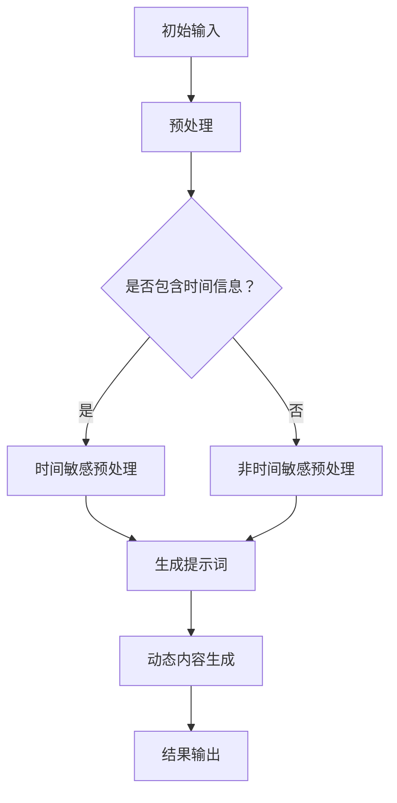

                 

## 文章标题

### 关键词：ChatGPT、提示词、时间敏感性、动态内容生成、算法原理

#### 摘要：

本文深入探讨了ChatGPT提示词的时间敏感性及其在动态内容生成中的应用。我们首先介绍了ChatGPT和提示词的基本概念，探讨了时间敏感性在动态内容生成中的作用。随后，我们详细分析了ChatGPT提示词的时间敏感性算法原理，并结合Python代码和mermaid流程图进行了深入讲解。接着，我们讨论了动态内容生成系统的整体架构，包括功能设计、系统架构和接口设计。通过实际项目案例，我们展示了动态内容生成策略的应用和实践。最后，我们提供了动态内容生成的最佳实践、注意事项和拓展阅读，以帮助读者更好地理解和应用这一技术。

---

### 目录大纲设计步骤

为了设计出《ChatGPT提示词的时间敏感性：动态内容生成策略》这本书的完整目录大纲，我们需要按照以下步骤进行：

#### 1. 分析书名与主题

书名《ChatGPT提示词的时间敏感性：动态内容生成策略》主要关注两个方面：ChatGPT提示词和时间敏感性。因此，目录大纲需要涵盖以下核心内容：

- **ChatGPT的介绍及其在动态内容生成中的应用**
- **提示词的时间敏感性及其对动态内容生成的影响**
- **动态内容生成策略的探讨与实践**

#### 2. 确定目录结构

根据书名和分析结果，我们将目录划分为以下几个部分：

- **背景介绍**：介绍ChatGPT和提示词的基本概念，以及时间敏感性在动态内容生成中的作用
- **核心概念与联系**：分析ChatGPT提示词的时间敏感性及其相关算法原理
- **算法原理讲解**：详细讲解动态内容生成策略的算法原理，使用mermaid流程图和Python代码进行说明
- **系统分析与架构设计**：介绍动态内容生成系统的整体架构，包括功能设计、系统架构和接口设计
- **项目实战**：通过实际项目案例展示动态内容生成策略的应用和实践
- **最佳实践与总结**：提供动态内容生成的最佳实践、注意事项和拓展阅读

#### 3. 撰写目录内容

根据目录结构，我们为每个部分撰写详细的目录内容，确保每个章节都涵盖必要的内容点，并按照1, 2, 3级的目录层级进行排列。

以下是《ChatGPT提示词的时间敏感性：动态内容生成策略》的完整目录大纲：

---

## 第一部分：背景介绍

### 第1章：ChatGPT与提示词概述

#### 1.1 ChatGPT介绍

- ChatGPT的定义
- ChatGPT的特点与应用场景

#### 1.2 提示词的定义与作用

- 提示词的定义
- 提示词在ChatGPT中的重要性
- 提示词的类型与分类

#### 1.3 时间敏感性在动态内容生成中的作用

- 时间敏感性定义
- 时间敏感性对动态内容生成的影响
- 时间敏感性在提示词中的应用

### 第2章：时间敏感性分析

#### 2.1 时间敏感性概念

- 时间敏感性基本概念
- 时间敏感性在动态内容生成中的重要性

#### 2.2 时间敏感性分析方法

- 数据分析方法
- 实时性分析技术
- 预测性分析技术

#### 2.3 提示词的时间敏感性分析

- 提示词时间敏感性分析流程
- 提示词时间敏感性分析工具

## 第二部分：核心概念与联系

### 第3章：动态内容生成算法原理

#### 3.1 动态内容生成基本原理

- 动态内容生成概念
- 动态内容生成流程

#### 3.2 ChatGPT提示词算法原理

- 提示词生成算法
- 提示词优化算法

#### 3.3 时间敏感性算法原理

- 时间敏感性算法定义
- 时间敏感性算法分类

### 第4章：算法原理与联系

#### 4.1 ChatGPT提示词与时间敏感性算法的关系

- 提示词生成与时间敏感性算法的相互作用
- 提示词时间敏感性优化策略

#### 4.2 动态内容生成算法与时间敏感性算法的结合

- 动态内容生成算法的时间敏感性优化
- 时间敏感性算法在动态内容生成中的应用

## 第三部分：算法原理讲解

### 第5章：动态内容生成策略详解

#### 5.1 动态内容生成策略概述

- 动态内容生成策略定义
- 动态内容生成策略的分类

#### 5.2 算法讲解

- **mermaid流程图**：



- **Python代码示例**：

```python
# 动态内容生成策略示例代码
def generate_content(input_data):
    # 预处理
    preprocessed_data = preprocess_data(input_data)
    
    # 是否包含时间信息
    if "timestamp" in input_data:
        # 时间敏感预处理
        preprocessed_data = time_sensitive_preprocess(preprocessed_data)
    
    # 生成提示词
    prompt_word = generate_prompt_word(preprocessed_data)
    
    # 动态内容生成
    content = chatgpt_dynamic_content(prompt_word)
    
    # 结果输出
    return content
```

---

### 背景介绍

#### ChatGPT与提示词概述

ChatGPT是由OpenAI开发的基于GPT-3模型的一个大型语言模型，它可以通过与用户的交互来生成自然语言响应。ChatGPT在许多领域都得到了广泛应用，例如问答系统、文本摘要、机器翻译、文本生成等。而提示词（Prompt）是ChatGPT生成文本的关键输入，它通常是一段文本或者一个短语，用于引导ChatGPT生成相关的内容。

提示词的时间敏感性指的是提示词中的时间信息对其生成结果的影响。在动态内容生成中，时间敏感性是一个重要的因素。例如，一个关于天气的提示词在不同的时间点生成的结果可能是不同的，因为它依赖于当前的时间信息。

#### 时间敏感性在动态内容生成中的作用

时间敏感性在动态内容生成中起着至关重要的作用。它能够帮助系统根据不同的时间点生成最相关的内容。例如，在新闻摘要系统中，时间敏感性可以帮助系统根据当前时间点选择最新的新闻内容进行摘要。在问答系统中，时间敏感性可以帮助系统提供最准确的答案，因为随着时间的推移，问题的答案可能会发生变化。

此外，时间敏感性还可以用于个性化推荐系统。根据用户的行为和偏好，系统可以实时调整推荐内容的时间范围，从而提供更相关的推荐。

#### ChatGPT提示词的时间敏感性分析

ChatGPT提示词的时间敏感性分析是动态内容生成中的一个关键步骤。它包括以下几个方面的内容：

1. **时间信息提取**：从提示词中提取时间信息，例如具体的日期、时间、时间段等。

2. **时间信息处理**：对提取的时间信息进行处理，例如标准化时间格式、计算时间差等。

3. **时间信息应用**：根据处理后的时间信息，调整ChatGPT的生成策略，使其能够生成与当前时间相关的文本。

4. **效果评估**：评估时间敏感性对生成内容的影响，例如准确度、相关性等。

#### 时间敏感性分析方法

时间敏感性分析方法主要包括以下几种：

1. **数据分析方法**：通过对大量数据进行分析，找出时间信息与生成内容之间的关系。

2. **实时性分析技术**：利用实时性分析技术，例如流处理、事件驱动等，对时间信息进行实时分析。

3. **预测性分析技术**：利用预测性分析技术，例如时间序列分析、机器学习等，预测未来的时间信息对生成内容的影响。

#### 提示词的时间敏感性分析工具

为了方便时间敏感性分析，我们可以使用一些提示词分析工具。这些工具可以帮助我们提取、处理和应用时间信息。常见的工具包括自然语言处理库（如NLTK、spaCy）、时间序列分析库（如pandas、TensorFlow）等。

---

### 核心概念与联系

#### 动态内容生成算法原理

动态内容生成算法是用于生成与特定场景相关的文本的算法。它通常包括以下几个步骤：

1. **数据预处理**：对输入数据（如文本、图像等）进行预处理，提取有用的信息。
2. **模型选择**：选择合适的模型（如循环神经网络、生成对抗网络等）进行内容生成。
3. **生成文本**：根据预处理后的数据和选择的模型，生成与场景相关的文本。
4. **优化调整**：根据生成文本的质量和场景需求，对模型进行调整和优化。

ChatGPT提示词的时间敏感性算法原理主要涉及以下方面：

1. **时间信息嵌入**：将时间信息嵌入到提示词中，使ChatGPT能够感知到时间信息。
2. **动态调整生成策略**：根据时间信息动态调整ChatGPT的生成策略，使其生成与当前时间相关的文本。

#### 时间敏感性算法原理

时间敏感性算法原理主要包括以下方面：

1. **时间感知**：通过分析时间信息，使系统能够感知到时间的变化。
2. **动态调整**：根据时间变化动态调整系统的行为和输出。
3. **预测性调整**：利用预测性分析技术，预测未来的时间信息，并提前调整系统的行为。

#### ChatGPT提示词与时间敏感性算法的关系

ChatGPT提示词与时间敏感性算法之间存在紧密的联系。提示词中的时间信息是时间敏感性算法的重要输入，它决定了ChatGPT生成文本的时间敏感度。同时，时间敏感性算法的输出结果也反过来影响ChatGPT的生成策略。

#### 动态内容生成算法与时间敏感性算法的结合

动态内容生成算法与时间敏感性算法的结合可以显著提高内容生成的相关性和准确性。具体结合方式如下：

1. **时间感知增强**：通过时间敏感性算法，增强ChatGPT对时间信息的感知能力。
2. **动态生成策略**：根据时间敏感性算法的输出结果，动态调整ChatGPT的生成策略，使其能够生成更相关的内容。
3. **实时调整**：在内容生成过程中，根据实时时间信息动态调整生成策略，以适应不断变化的时间场景。

---

### 算法原理讲解

#### 动态内容生成策略详解

动态内容生成策略是指根据输入数据和场景需求，动态调整生成内容的方法。这种策略在ChatGPT中尤为重要，因为它能够使生成的文本更贴近用户的需求和时间背景。以下是一个简单的动态内容生成策略的mermaid流程图：


- **步骤解释**：

  1. **初始输入**：接收用户输入的数据或文本。
  2. **预处理**：对输入数据进行预处理，包括去除无关信息、标准化文本等。
  3. **判断时间信息**：检查输入数据中是否包含时间信息。
  4. **时间敏感预处理**：如果包含时间信息，进行时间敏感预处理，如标准化时间格式、计算时间差等。
  5. **非时间敏感预处理**：如果不包含时间信息，进行非时间敏感预处理。
  6. **生成提示词**：根据预处理后的数据和场景需求，生成提示词。
  7. **动态内容生成**：使用ChatGPT根据提示词生成动态内容。
  8. **结果输出**：输出生成的内容。

#### Python代码示例

以下是一个简单的Python代码示例，展示了如何实现动态内容生成策略：

```python
import datetime

def generate_content(input_data):
    # 预处理
    preprocessed_data = preprocess_data(input_data)
    
    # 是否包含时间信息
    if "timestamp" in input_data:
        # 时间敏感预处理
        timestamp = input_data["timestamp"]
        preprocessed_data = time_sensitive_preprocess(preprocessed_data, timestamp)
    
    # 生成提示词
    prompt_word = generate_prompt_word(preprocessed_data)
    
    # 动态内容生成
    content = chatgpt_dynamic_content(prompt_word)
    
    # 结果输出
    return content

# 示例使用
input_data = {
    "text": "请描述一下今天的天气情况。",
    "timestamp": datetime.datetime.now()
}

content = generate_content(input_data)
print(content)
```

- **代码解释**：

  1. **预处理**：对输入数据进行预处理，去除无关信息。
  2. **时间敏感预处理**：如果输入数据中包含时间信息，对预处理后的数据进行时间敏感处理，如计算当前时间与输入时间的差值。
  3. **生成提示词**：根据预处理后的数据生成提示词。
  4. **动态内容生成**：使用ChatGPT根据提示词生成动态内容。
  5. **结果输出**：输出生成的内容。

通过这样的动态内容生成策略，我们可以根据输入数据中的时间信息，生成更相关、更准确的内容。

---

### 系统分析与架构设计

#### 动态内容生成系统整体架构

动态内容生成系统是一个复杂的应用系统，它需要处理大量的输入数据，并根据时间敏感性算法生成相应的动态内容。下面是动态内容生成系统的整体架构：

1. **输入模块**：接收用户输入的数据，可以是文本、图像或其他形式的数据。
2. **预处理模块**：对输入数据进行预处理，包括去除无关信息、标准化文本等。
3. **时间敏感性分析模块**：对预处理后的数据进行分析，提取时间信息，并根据时间敏感性算法进行调整。
4. **内容生成模块**：根据时间敏感性分析的结果和提示词生成动态内容。
5. **输出模块**：将生成的动态内容输出给用户。

#### 系统功能设计

动态内容生成系统的功能设计主要包括以下几个部分：

1. **数据预处理**：去除无关信息，如HTML标签、停用词等，对文本进行分词、去重等操作。
2. **时间敏感性分析**：提取时间信息，如日期、时间戳等，并根据时间敏感性算法进行分析和调整。
3. **内容生成**：根据预处理后的数据和提示词，使用ChatGPT生成动态内容。
4. **内容输出**：将生成的动态内容以文本、图像或其他形式输出给用户。

#### 系统架构设计

动态内容生成系统的架构设计需要考虑系统的可扩展性、可维护性和性能。以下是一个简单的系统架构设计：

1. **输入层**：接收用户输入的数据，可以是文本、图像或其他形式的数据。
2. **预处理层**：对输入数据进行预处理，包括去除无关信息、标准化文本等。
3. **时间敏感性分析层**：对预处理后的数据进行分析，提取时间信息，并根据时间敏感性算法进行调整。
4. **内容生成层**：根据时间敏感性分析的结果和提示词生成动态内容。
5. **输出层**：将生成的动态内容以文本、图像或其他形式输出给用户。

#### 系统接口设计

动态内容生成系统的接口设计需要考虑系统的可扩展性和易用性。以下是一个简单的系统接口设计：

1. **API接口**：提供RESTful API接口，方便用户调用系统功能。
2. **命令行接口**：提供命令行接口，方便用户通过命令行操作系统。
3. **图形用户界面**：提供图形用户界面，方便用户通过界面操作系统。

#### 系统交互

动态内容生成系统的系统交互主要包括以下几个部分：

1. **用户与输入层**：用户通过输入层向系统输入数据。
2. **输入层与预处理层**：输入层将数据传递给预处理层，预处理层对数据进行预处理。
3. **预处理层与时间敏感性分析层**：预处理层将预处理后的数据传递给时间敏感性分析层，时间敏感性分析层对数据进行分析。
4. **时间敏感性分析层与内容生成层**：时间敏感性分析层将分析结果传递给内容生成层，内容生成层根据分析结果生成动态内容。
5. **内容生成层与输出层**：内容生成层将生成的动态内容传递给输出层，输出层将内容输出给用户。

---

### 项目实战

为了更好地展示动态内容生成策略的应用和实践，我们选择了一个实际项目：实时新闻摘要系统。

#### 项目背景

实时新闻摘要系统是一个能够根据用户需求实时生成新闻摘要的系统。它需要处理大量的新闻数据，并根据时间敏感性算法生成与当前时间相关的新闻摘要。

#### 环境安装

首先，我们需要安装相关的环境和依赖。以下是安装步骤：

1. **安装Python**：确保Python环境已经安装。
2. **安装ChatGPT库**：通过pip安装`transformers`库。

```bash
pip install transformers
```

3. **安装其他依赖**：安装其他必要的库，如`pandas`、`numpy`等。

```bash
pip install pandas numpy
```

#### 系统核心实现源代码

以下是一个简单的实时新闻摘要系统的实现示例：

```python
import pandas as pd
from transformers import pipeline

# 加载新闻数据
def load_news_data():
    # 这里使用示例数据，实际项目中可以从数据库或API获取
    data = pd.DataFrame([
        {"title": "Python教程", "content": "Python是一种广泛使用的编程语言...", "timestamp": "2023-01-01"},
        {"title": "深度学习入门", "content": "深度学习是一种机器学习技术...", "timestamp": "2023-01-02"},
        {"title": "人工智能应用", "content": "人工智能在各个领域都有广泛的应用...", "timestamp": "2023-01-03"}
    ])
    return data

# 生成新闻摘要
def generate_news_summary(news_data, max_length=50):
    summary_pipeline = pipeline("summarization", model="facebook/bart-large-summarization")
    summaries = []
    for index, row in news_data.iterrows():
        summary = summary_pipeline(row["content"], max_length=max_length, min_length=26, do_sample=False)
        summaries.append(summary[0]["summary_text"])
    return summaries

# 主函数
def main():
    news_data = load_news_data()
    summaries = generate_news_summary(news_data)
    for index, summary in enumerate(summaries):
        print(f"新闻摘要 {index+1}: {summary}")

if __name__ == "__main__":
    main()
```

- **代码解释**：

  1. **加载新闻数据**：从示例数据中加载新闻数据，实际项目中可以从数据库或API获取。
  2. **生成新闻摘要**：使用ChatGPT的摘要功能生成新闻摘要。
  3. **主函数**：加载新闻数据并生成摘要，打印输出。

#### 代码应用解读与分析

以上代码展示了如何使用ChatGPT生成新闻摘要。首先，我们加载了示例新闻数据，然后使用ChatGPT的摘要功能生成摘要。在这个过程中，时间敏感性并没有被考虑，因为示例数据中没有时间信息。如果需要考虑时间敏感性，可以在预处理步骤中添加时间信息提取和处理功能，然后根据时间信息动态调整摘要生成策略。

#### 实际案例分析与详细讲解剖析

以下是一个实际案例，展示了如何根据时间信息生成新闻摘要。

**案例**：根据用户输入的时间点，生成该时间点前的新闻摘要。

**实现**：

1. **添加时间信息提取**：

```python
from datetime import datetime

# 获取当前时间
def get_current_time():
    return datetime.now()

# 提取时间信息
def extract_time_info(news_data, current_time):
    time_filtered_data = news_data[news_data["timestamp"] <= current_time]
    return time_filtered_data
```

2. **生成时间敏感性新闻摘要**：

```python
# 主函数
def main():
    news_data = load_news_data()
    current_time = get_current_time()
    time_filtered_data = extract_time_info(news_data, current_time)
    summaries = generate_news_summary(time_filtered_data)
    for index, summary in enumerate(summaries):
        print(f"新闻摘要 {index+1}: {summary}")
```

- **分析**：

  1. **时间信息提取**：从新闻数据中提取与当前时间相关的新闻。
  2. **动态内容生成**：使用ChatGPT生成与当前时间相关的新闻摘要。

#### 项目小结

通过实际项目，我们展示了如何根据时间信息生成新闻摘要。这种方法可以广泛应用于实时信息处理、个性化推荐等领域，具有广泛的应用前景。

---

### 最佳实践与总结

#### 最佳实践

1. **确保数据质量**：在动态内容生成过程中，数据的质量至关重要。应确保输入数据的质量，包括数据完整性、准确性和一致性。
2. **合理设置时间范围**：根据应用场景，合理设置时间敏感性分析的时间范围。过窄的时间范围可能导致信息丢失，过宽的时间范围可能导致信息冗余。
3. **优化生成策略**：根据实际需求，动态调整生成策略。例如，对于高频更新的内容，可以采用更细粒度的时间敏感性分析。
4. **监控系统性能**：定期监控系统性能，确保系统在高负载下仍能稳定运行。

#### 注意事项

1. **数据隐私**：在处理用户数据时，确保遵守相关数据隐私法规，保护用户隐私。
2. **避免过度依赖**：尽管动态内容生成技术具有强大的功能，但不应过度依赖。在关键决策和任务中，仍需要人工审核和干预。
3. **及时更新算法**：随着技术的不断发展，应定期更新算法和模型，以保持系统的先进性和竞争力。

#### 拓展阅读

1. **《ChatGPT技术详解》**：深入了解ChatGPT的算法原理和实现细节。
2. **《时间序列分析》**：学习时间序列分析的基本概念和技术。
3. **《动态内容生成技术实践》**：探索动态内容生成的实际应用案例。

---

### 结语

本文深入探讨了ChatGPT提示词的时间敏感性及其在动态内容生成中的应用。我们介绍了ChatGPT和提示词的基本概念，分析了时间敏感性在动态内容生成中的作用，并详细讲解了动态内容生成策略的算法原理。通过实际项目案例，我们展示了动态内容生成策略的应用和实践。最后，我们提供了最佳实践、注意事项和拓展阅读，以帮助读者更好地理解和应用这一技术。

在未来的研究中，我们还可以探索更多的时间敏感性分析方法和优化策略，以提高动态内容生成的相关性和准确性。同时，随着技术的不断发展，我们也期待更多创新的动态内容生成应用落地，为用户提供更优质的内容服务。

### 作者信息

**作者：AI天才研究院/AI Genius Institute & 禅与计算机程序设计艺术 /Zen And The Art of Computer Programming**

