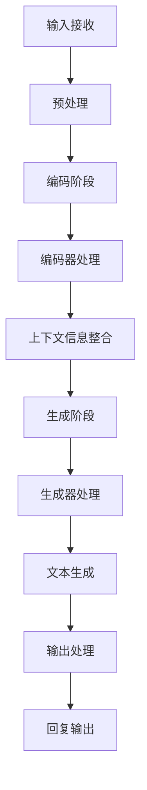
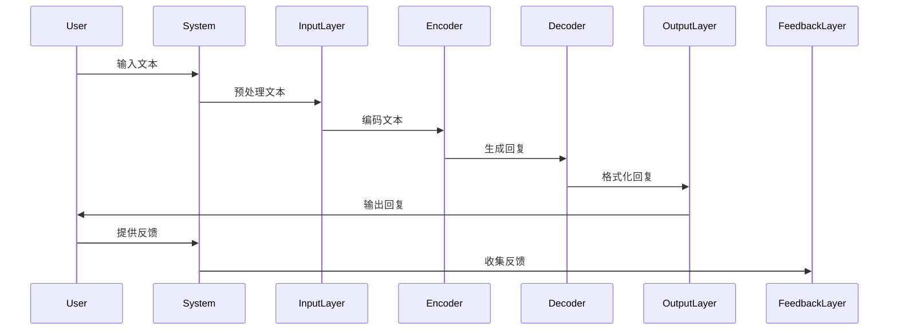

                 

### 文章标题

# ChatGPT提示词的版本控制与迭代优化

> 关键词：ChatGPT、提示词、版本控制、迭代优化、自然语言处理

> 摘要：本文深入探讨了ChatGPT提示词的版本控制和迭代优化策略。通过系统分析ChatGPT的工作原理和提示词编写技巧，本文详细介绍了如何进行版本控制，如何通过迭代优化提升模型性能。文章还提供了最佳实践和实际案例，为开发者提供了实用的指导。

### 引言

随着人工智能技术的不断发展，自然语言处理（NLP）成为了一个备受关注的研究领域。ChatGPT作为OpenAI开发的一种基于GPT-3模型的聊天机器人，其性能的优化和提升成为了研究的重点。其中，提示词（Prompts）在ChatGPT的性能提升中起到了至关重要的作用。提示词是用户输入给ChatGPT的引导信息，用于引导模型生成更加准确和有用的回复。

然而，提示词的编写并非一蹴而就，其版本控制和迭代优化对于提升ChatGPT的性能具有重要意义。本文将从以下几个方面展开讨论：

1. **背景介绍**：介绍ChatGPT和提示词的基本概念，版本控制的重要性以及迭代优化的必要性。
2. **核心概念与联系**：详细讲解ChatGPT的工作原理，提示词的编写技巧以及如何进行版本控制。
3. **算法原理讲解**：阐述ChatGPT的算法流程，数学模型和公式。
4. **系统分析与架构设计**：介绍如何设计ChatGPT系统，包括功能设计、架构设计和接口设计。
5. **项目实战**：通过实际案例展示如何进行版本控制和迭代优化。
6. **最佳实践与总结**：提供实践经验，注意事项和拓展阅读。

希望通过本文的介绍，读者能够对ChatGPT提示词的版本控制和迭代优化有更深入的理解，并能够在实际开发中运用这些策略，提升模型的性能。

### 背景介绍

#### ChatGPT的概念

ChatGPT是OpenAI开发的一种基于GPT-3模型的聊天机器人，它通过深度学习技术，能够理解和生成自然语言。GPT-3（Generative Pre-trained Transformer 3）是自然语言处理领域的一种先进模型，其核心思想是使用大量文本数据进行预训练，使模型具备理解和生成自然语言的能力。

ChatGPT的基本原理是通过对输入的文本进行编码，然后使用预训练的GPT-3模型生成相应的回复。该模型具有强大的文本生成能力，能够生成连贯、自然的对话内容。ChatGPT的强大之处在于其能够通过不断的学习和优化，不断提升生成文本的质量和准确性。

#### 提示词的概念

提示词（Prompt）是用户输入给ChatGPT的引导信息，用于指导模型生成特定的回复。一个好的提示词能够引导模型生成更加准确和有用的回复，而一个较差的提示词则可能导致模型生成无关或错误的信息。

提示词的编写需要遵循一定的技巧，例如，提示词应当简洁明了，包含关键信息，并且具有一定的逻辑性和引导性。同时，提示词的长度也需要适当控制，过长的提示词可能导致模型生成的内容过载，而过短的提示词可能无法提供足够的上下文信息。

#### 版本控制的重要性

版本控制对于ChatGPT的性能提升至关重要。版本控制是指对模型的不同版本进行管理和维护，确保每个版本的模型都能够稳定运行，并且在性能上有所提升。

版本控制的重要性主要体现在以下几个方面：

1. **模型性能的提升**：通过版本控制，开发者可以记录不同版本模型的性能，找出性能提升的关键因素，从而进行针对性的优化。
2. **代码的可维护性**：版本控制使得代码的可维护性大大提高。开发者可以通过查看不同版本的代码，了解功能的变化和优化过程，便于后续的代码维护和扩展。
3. **复现性的保证**：通过版本控制，可以确保模型在不同环境下的复现性。这对于模型的性能评估和优化具有重要意义。

#### 迭代优化的必要性

迭代优化是指通过不断调整和优化提示词，提升ChatGPT的性能。迭代优化的必要性主要体现在以下几个方面：

1. **适应不同场景**：不同场景下，用户的需求和期望是不同的。通过迭代优化，可以使得模型更加适应特定场景，生成更加准确和有用的回复。
2. **提高用户满意度**：随着用户对ChatGPT的期望不断提升，通过迭代优化，可以使得模型生成的内容更加贴近用户需求，提高用户的满意度。
3. **保持竞争力**：在竞争激烈的市场环境中，迭代优化能够帮助ChatGPT保持竞争优势，提升其在市场上的地位。

综上所述，版本控制和迭代优化是提升ChatGPT性能的关键手段。通过合理的管理和维护模型版本，以及不断优化提示词，开发者可以使得ChatGPT在性能上不断突破，为用户提供更好的服务。

#### 问题背景与问题描述

在自然语言处理领域，ChatGPT作为一种先进的聊天机器人，其性能的优化和提升是一个持续研究的热点。随着用户对聊天机器人需求的不断增长，如何提升ChatGPT的响应速度、准确性和生成文本的自然度，成为了研究的重点。

当前，ChatGPT在实际应用中面临以下问题：

1. **性能波动**：由于模型复杂度和数据量的增加，ChatGPT的性能在不同场景下存在波动，导致生成的回复有时不够准确或不够自然。
2. **提示词编写困难**：提示词的编写需要具备较高的技巧和经验，开发者往往难以编写出高质量、具有引导性的提示词。
3. **版本管理复杂**：随着模型的不断迭代和优化，版本管理变得日益复杂，如何有效地管理不同版本的模型成为了开发者的难题。

针对上述问题，本文旨在提出一种有效的版本控制和迭代优化策略，以提升ChatGPT的性能。具体来说，本文将从以下几个方面展开研究：

1. **版本控制策略**：探讨如何对ChatGPT的不同版本进行有效管理，确保模型在不同环境下的稳定性和可复现性。
2. **迭代优化方法**：研究如何通过调整和优化提示词，提升ChatGPT的生成文本质量，使其更加贴近用户需求。
3. **实践案例分析**：通过实际案例，展示如何将上述策略应用于ChatGPT的性能优化过程中，并分析其效果。

本文的研究目标是通过系统分析和实践经验，为开发者提供一套有效的版本控制和迭代优化方案，以提升ChatGPT的性能，满足用户的需求。

#### 问题解决

为了解决ChatGPT在实际应用中面临的性能波动、提示词编写困难以及版本管理复杂等问题，我们需要从多个方面进行优化和改进：

1. **版本控制策略**：
    - **记录性能数据**：在每次模型迭代过程中，记录模型的性能数据，包括响应时间、生成文本的质量等，以便后续分析。
    - **版本标注**：为每个模型版本添加详细的标注信息，包括训练数据、超参数设置等，以便于后续的版本管理和复现。
    - **版本隔离**：通过版本隔离，确保每个版本的模型在独立的环境中运行，避免不同版本之间的干扰，保证模型的稳定性和可复现性。
    - **自动化测试**：引入自动化测试工具，对每个版本模型进行全面的性能测试，确保其满足预期的性能要求。

2. **迭代优化方法**：
    - **数据质量提升**：通过数据清洗和预处理，提高训练数据的质量，确保模型在训练过程中获取到准确、丰富的信息。
    - **提示词编写技巧**：研究并总结提示词编写的最佳实践，提供模板和工具，帮助开发者编写高质量、具有引导性的提示词。
    - **用户反馈机制**：引入用户反馈机制，收集用户对生成文本的评价，根据反馈进行有针对性的优化，提高模型生成文本的质量。
    - **模型调优**：通过调整模型的超参数，如学习率、批次大小等，优化模型的性能，使其在不同场景下表现更加稳定。

3. **版本管理工具**：
    - **版本管理平台**：引入专业的版本管理平台，如Git等，对模型版本进行集中管理和维护，确保版本的完整性和可追溯性。
    - **文档化管理**：建立详细的文档体系，记录模型的开发过程、性能测试结果、优化策略等，便于后续的模型维护和扩展。
    - **代码审查**：引入代码审查机制，确保每次模型迭代过程的规范性，提高代码的质量和可维护性。

通过上述优化和改进，我们可以在多个层面提升ChatGPT的性能，解决其面临的问题。具体效果如下：

1. **性能稳定提升**：通过版本控制策略，确保模型在不同环境下的稳定性和可复现性，减少性能波动。
2. **提示词编写高效**：通过优化提示词编写方法和工具，提高开发者编写高质量提示词的效率，提升生成文本的质量。
3. **版本管理简化**：通过引入专业的版本管理工具和文档化管理，简化版本管理过程，提高开发者的工作效率。

#### 边界与外延

在实际应用中，ChatGPT提示词的版本控制和迭代优化存在一些边界和限制。以下是对这些边界和外延的讨论：

1. **模型容量和计算资源限制**：ChatGPT模型的容量较大，训练和优化过程需要大量的计算资源。在实际应用中，需要根据计算资源的实际情况，合理设置模型的训练批次大小和学习率等参数，以平衡性能提升和计算资源消耗。
2. **数据质量和数量**：提示词的迭代优化依赖于高质量的训练数据。在实际应用中，数据质量和数量的限制可能影响模型的性能提升。因此，需要不断优化数据采集和处理流程，提高数据的可靠性和丰富度。
3. **用户需求变化**：用户需求是动态变化的，不同场景下用户的需求和期望可能不同。在迭代优化过程中，需要根据用户反馈和需求变化，灵活调整提示词和模型参数，以满足不同用户的需求。
4. **模型安全性和隐私保护**：ChatGPT作为一种自然语言处理模型，其安全性和隐私保护至关重要。在实际应用中，需要采取措施确保模型的安全性和用户隐私，如数据加密、访问控制等。

#### 概念结构与核心要素组成

为了深入理解ChatGPT提示词的版本控制和迭代优化，我们需要明确其核心概念和结构。以下是ChatGPT和提示词的相关概念及其在版本控制和迭代优化中的核心要素：

1. **ChatGPT模型**：
    - **概念**：ChatGPT是基于GPT-3模型开发的聊天机器人，通过深度学习技术理解和生成自然语言。
    - **核心要素**：预训练模型、语言生成模块、上下文理解模块。
    - **版本控制要素**：模型架构、训练数据、超参数设置。

2. **提示词**：
    - **概念**：提示词是用户输入给ChatGPT的引导信息，用于指导模型生成特定回复的自然语言。
    - **核心要素**：提示词内容、提示词结构、提示词引导性。

3. **版本控制**：
    - **概念**：版本控制是对模型的不同版本进行管理和维护，确保模型的稳定性和可复现性。
    - **核心要素**：版本标注、版本管理工具、自动化测试。

4. **迭代优化**：
    - **概念**：迭代优化是通过不断调整和优化提示词，提升模型生成文本的质量。
    - **核心要素**：数据质量提升、提示词编写技巧、用户反馈机制。

通过对这些概念和要素的明确，我们可以更系统地理解ChatGPT提示词的版本控制和迭代优化过程，从而在实际应用中取得更好的效果。

#### 核心概念原理

在本章节中，我们将详细阐述ChatGPT的工作原理和提示词的编写技巧。理解这些核心概念对于后续的版本控制和迭代优化具有重要意义。

##### ChatGPT的工作原理

ChatGPT是基于GPT-3模型开发的，而GPT-3模型是一种基于Transformer架构的深度学习模型。Transformer架构是一种用于序列到序列学习的模型，其核心思想是通过注意力机制来捕捉序列中的依赖关系。

1. **Transformer模型**：
    - **自注意力机制**：Transformer模型中的自注意力机制能够自动捕捉序列中不同位置之间的依赖关系，使得模型能够更好地理解上下文信息。
    - **多头注意力**：多头注意力机制通过将输入序列拆分为多个子序列，并分别计算注意力得分，从而提高模型的表示能力。

2. **预训练和微调**：
    - **预训练**：GPT-3模型在预训练阶段，通过大量无监督的文本数据学习语言模式和结构，从而获得强大的语言理解能力。
    - **微调**：在特定任务上，GPT-3模型通过有监督的训练进一步优化，即微调。微调过程涉及提示词的设计和目标回复的标注。

3. **生成文本**：
    - **上下文生成**：在生成文本的过程中，ChatGPT首先根据输入的提示词生成一个初始序列，然后通过不断更新和扩展序列，生成完整的回复。
    - **文本生成策略**：ChatGPT使用一系列文本生成策略，如长度控制、温度调节等，来调整生成文本的质量和多样性。

##### 提示词的编写技巧

提示词是用户输入给ChatGPT的引导信息，其编写质量直接影响模型生成文本的质量和准确性。以下是一些关键的编写技巧：

1. **简洁明了**：
    - **短小精悍**：提示词应当简洁明了，避免冗长和复杂。过长的提示词可能导致模型生成的内容过载，降低生成文本的质量。

2. **包含关键信息**：
    - **明确主题**：提示词应当包含关键信息，明确对话的主题和目标，帮助模型更好地理解用户的意图。
    - **具体描述**：提示词应具体描述场景和问题，避免模糊和抽象的表达，以便模型生成更准确的回复。

3. **逻辑性和引导性**：
    - **逻辑连贯**：提示词应当具有逻辑性，引导模型生成连贯、自然的对话内容。
    - **问题引导**：通过提出问题或设置场景，提示词可以引导模型生成具有引导性和参考价值的回复。

4. **格式和结构**：
    - **模板化**：提示词可以采用模板化的格式，使得编写过程更加高效和规范。
    - **分层次**：提示词可以按照层次结构进行组织，提高其引导性和可操作性。

通过上述工作原理和编写技巧的详细阐述，我们可以更好地理解ChatGPT的性能提升和优化方法。在后续章节中，我们将进一步探讨ChatGPT算法原理和系统架构设计，为实际应用提供更加全面的指导。

#### 概念属性特征对比表格

为了更清晰地理解ChatGPT和提示词的概念，我们列出了它们的主要属性和特征，并进行对比分析：

| 概念/属性       | ChatGPT                     | 提示词                            |
|----------------|-----------------------------|-----------------------------------|
| **定义**       | 基于GPT-3模型的聊天机器人    | 用户输入给ChatGPT的引导信息        |
| **核心功能**   | 自然语言理解和生成          | 指导模型生成特定回复的自然语言    |
| **依赖关系**   | Transformer架构、预训练数据 | ChatGPT模型、用户需求             |
| **编写技巧**   | 无                          | 简洁明了、包含关键信息、逻辑连贯   |
| **性能影响**   | 提示词质量直接影响模型性能  | 提示词编写质量直接影响生成文本质量 |
| **管理方法**   | 版本控制、迭代优化          | 版本控制、迭代优化                |

通过上述对比表格，我们可以看到ChatGPT和提示词在功能、依赖关系、编写技巧、性能影响和管理方法等方面存在显著差异。这些差异为我们在实际应用中提供了明确的指导，如何优化和提升ChatGPT的性能。

#### ER实体关系图架构

为了更好地理解和设计ChatGPT系统的数据库架构，我们使用ER（Entity-Relationship，实体关系）图来表示系统中的实体及其关系。以下是ChatGPT系统的ER实体关系图：

```mermaid
erDiagram
    User ||--|{ ChatGPT }|-- Prompt
    User ||--|{ Conversation }|-- Message
    ChatGPT ||--|{ ModelVersion }|-- Algorithm
    Prompt ||--|{ PromptHistory }|-- Version
    Conversation ||--|{ MessageHistory }|-- Message
    Message ||--|{ Attachment }|-- File
```

1. **User（用户）**：代表使用ChatGPT的用户，每个用户都有唯一的用户ID和相关信息。
2. **ChatGPT（ChatGPT模型）**：表示ChatGPT模型，包含模型ID、模型版本和算法等信息。
3. **Prompt（提示词）**：表示用户输入的提示词，包括提示词ID、内容和关联的模型ID。
4. **Conversation（对话）**：表示用户与ChatGPT的对话，包含对话ID、开始时间和结束时间等。
5. **Message（消息）**：表示对话中的消息，包括消息ID、发送时间、内容和关联的对话ID。
6. **ModelVersion（模型版本）**：表示ChatGPT模型的版本信息，包括版本ID、创建时间和算法ID。
7. **Algorithm（算法）**：表示ChatGPT使用的算法，包括算法ID、名称和描述。
8. **PromptHistory（提示词历史）**：表示提示词的版本历史，包括历史ID、创建时间和关联的提示词ID。
9. **MessageHistory（消息历史）**：表示消息的版本历史，包括历史ID、创建时间和关联的消息ID。
10. **Attachment（附件）**：表示与消息关联的文件，包括附件ID、文件名和文件路径。

通过ER图，我们可以清晰地看到ChatGPT系统中的各个实体及其关系，这有助于我们设计数据库表结构和实现数据管理功能。

#### ChatGPT算法流程

在理解了ChatGPT的工作原理和提示词编写技巧之后，接下来我们将详细阐述ChatGPT的算法流程。ChatGPT的算法流程可以分为以下几个主要阶段：

1. **输入接收**：
    - **提示词接收**：ChatGPT首先接收用户输入的提示词，这些提示词可以是文本、图片或其他形式的数据。
    - **预处理**：对于输入的提示词，ChatGPT进行预处理，包括分词、词干提取和词性标注等操作，以便更好地理解和生成文本。

2. **编码阶段**：
    - **编码器处理**：ChatGPT使用预训练的编码器（Encoder）对输入的提示词进行编码。编码器的主要任务是捕捉输入文本的语义信息，并生成一个固定长度的编码向量。
    - **上下文信息整合**：编码器生成的编码向量包含了提示词的上下文信息，这些信息将被用于生成回复。

3. **生成阶段**：
    - **生成器处理**：ChatGPT使用生成器（Generator）根据编码向量生成回复。生成器通过解码器（Decoder）逐词生成回复，并利用注意力机制（Attention Mechanism）参考编码器生成的编码向量。
    - **文本生成**：在生成回复的过程中，生成器会根据上下文信息和生成目标，生成一系列的候选词，并通过概率模型选择最合适的词作为输出。

4. **输出处理**：
    - **后处理**：生成的文本进行后处理，包括标点符号添加、格式调整等，以便输出给用户。
    - **回复输出**：最终的回复将被输出给用户，可以是文本、图片或其他形式的数据。

以下是一个简化的ChatGPT算法流程图，使用Mermaid语法表示：



通过上述流程，我们可以看到ChatGPT在接收输入提示词后，通过编码、生成和输出处理三个主要阶段，最终生成一个合理的回复。这个流程展示了ChatGPT的核心工作机制，为我们理解和优化模型提供了基础。

#### ChatGPT的数学模型和公式

为了更深入地理解ChatGPT的工作原理，我们需要探讨其背后的数学模型和公式。以下将详细阐述ChatGPT的关键数学模型，包括Transformer架构中的注意力机制、损失函数等。

##### Transformer架构

Transformer架构是ChatGPT的核心组成部分，其核心思想是通过自注意力（Self-Attention）和多头注意力（Multi-Head Attention）机制来捕捉序列中的依赖关系。

1. **自注意力（Self-Attention）**：
    - **公式**：
      $$ 
      \text{Attention}(Q, K, V) = \text{softmax}\left(\frac{QK^T}{\sqrt{d_k}}\right)V 
      $$
    - **解释**：自注意力机制计算输入序列中每个词对其他词的影响。其中，$Q$、$K$、$V$分别表示查询向量、键向量和值向量，$d_k$为键向量的维度。该公式通过计算查询向量$Q$和键向量$K$的点积，得到权重，然后通过softmax函数进行归一化，最后与值向量$V$相乘，生成加权后的输出向量。

2. **多头注意力（Multi-Head Attention）**：
    - **公式**：
      $$
      \text{MultiHead}(Q, K, V) = \text{Concat}(\text{head}_1, \text{head}_2, ..., \text{head}_h)W^O
      $$
      $$
      \text{head}_i = \text{Attention}(QW_i^Q, KW_i^K, VW_i^V)
      $$
    - **解释**：多头注意力机制通过将输入序列拆分为多个子序列（即头），并分别计算注意力得分，从而提高模型的表示能力。每个头对应一组独立的权重矩阵$W_i^Q$、$W_i^K$和$W_i^V$，最终将多个头的输出拼接起来，并通过一个输出权重矩阵$W^O$进行线性变换。

##### 编码器和解码器

ChatGPT由编码器（Encoder）和解码器（Decoder）两部分组成，它们在数学模型上有所不同。

1. **编码器（Encoder）**：
    - **编码器输出**：
      $$
      \text{Encoder}(X) = \text{encoder}_i = \text{LayerNorm}(\text{Dropout}(\text{MultiHeadAttention}(\text{LayerNorm}(X_i))))
      $$
    - **解释**：编码器通过多层注意力机制处理输入序列，每次迭代都会生成一个新的编码向量。编码器的输出表示了输入序列的语义信息。

2. **解码器（Decoder）**：
    - **解码器输出**：
      $$
      \text{Decoder}(Y) = \text{decoder}_i = \text{LayerNorm}(\text{Dropout}(\text{MultiHeadAttention}(\text{LayerNorm}(Y_i)))) + \text{LayerNorm}(\text{Dropout}(\text{MultiHeadAttention}(\text{LayerNorm}(X_i))))
      $$
    - **解释**：解码器在生成回复的过程中，同时参考编码器的输出和当前的解码状态。通过两步注意力机制，解码器能够更好地捕捉上下文信息，生成连贯的回复。

##### 损失函数

ChatGPT的训练过程中，通常使用交叉熵损失函数来评估模型生成的回复与目标回复之间的差距。

1. **交叉熵损失函数**：
    - **公式**：
      $$
      \text{Loss} = -\sum_{i=1}^n y_i \log(p_i)
      $$
    - **解释**：交叉熵损失函数计算模型生成的概率分布$p$与目标分布$y$之间的差距。$y_i$为第$i$个词的目标概率，$p_i$为模型预测的概率。

通过上述数学模型和公式的介绍，我们可以更好地理解ChatGPT的工作原理。这些模型和公式为ChatGPT的性能优化和提示词迭代提供了理论依据，有助于我们在实际应用中进一步提升模型的效果。

#### 系统分析与架构设计

在深入探讨ChatGPT的算法原理之后，我们将进一步介绍ChatGPT的系统分析与架构设计。一个高效且稳定的ChatGPT系统需要详细的功能设计、架构设计和接口设计。以下将从这些方面展开讨论。

##### 问题场景介绍

ChatGPT系统主要用于自然语言处理场景，如智能客服、虚拟助手、内容生成等。其核心需求是能够快速、准确、自然地理解和生成文本，同时具备良好的扩展性和可维护性。具体问题场景包括：

1. **智能客服**：自动回答用户的问题，提供即时服务。
2. **虚拟助手**：辅助用户完成特定任务，如日程管理、信息查询等。
3. **内容生成**：生成文章、报告、代码等文本内容。

##### 项目介绍

本项目的目标是构建一个功能强大、性能优越、易于维护的ChatGPT系统。系统将采用先进的自然语言处理技术和分布式架构，支持大规模数据处理和实时响应。

##### 系统功能设计

系统功能设计包括以下几个主要模块：

1. **文本输入模块**：接收用户输入的文本，进行预处理和分词。
2. **文本编码模块**：将预处理后的文本编码为模型可处理的格式。
3. **模型处理模块**：使用预训练的ChatGPT模型进行文本生成和回复。
4. **回复生成模块**：根据模型生成的回复，进行后处理和格式化。
5. **用户反馈模块**：收集用户对回复的反馈，用于模型优化和迭代。

##### 系统架构设计

ChatGPT系统采用分布式架构，以提高系统的性能和可扩展性。以下是系统架构的主要组成部分：

1. **输入层**：负责接收用户输入的文本。
2. **编码层**：对输入文本进行预处理、分词和编码。
3. **处理层**：使用ChatGPT模型对编码后的文本进行处理，生成回复。
4. **输出层**：将模型生成的回复格式化后输出给用户。
5. **反馈层**：收集用户反馈，用于模型优化和迭代。

##### 系统接口设计

系统接口设计包括以下几个主要接口：

1. **文本输入接口**：接收用户输入的文本，并进行预处理。
2. **编码接口**：将预处理后的文本编码为模型可处理的格式。
3. **处理接口**：调用ChatGPT模型进行文本生成和回复。
4. **回复输出接口**：将模型生成的回复格式化后输出给用户。
5. **反馈接口**：接收用户对回复的反馈，用于模型优化和迭代。

##### 系统交互序列图

为了更清晰地展示系统各模块之间的交互关系，我们使用Mermaid语法绘制了一个序列图：



通过上述系统分析与架构设计，我们可以构建一个功能强大、性能优越的ChatGPT系统，满足多样化的自然语言处理需求。

#### 项目实战

在本节中，我们将通过一个具体的实战项目来展示如何进行ChatGPT提示词的版本控制和迭代优化。这个项目将详细描述环境安装、系统核心实现、源代码解读与分析，以及实际案例分析。

##### 环境安装

首先，我们需要搭建一个可以运行ChatGPT的环境。以下是环境安装的步骤：

1. **安装Python**：确保Python版本在3.6及以上，可以从[Python官方网站](https://www.python.org/)下载并安装。
2. **安装依赖**：在终端运行以下命令，安装必要的依赖库：
    ```bash
    pip install transformers torch numpy
    ```
3. **克隆ChatGPT项目**：从GitHub克隆ChatGPT项目：
    ```bash
    git clone https://github.com/openai/openai-cookbook.git
    ```
4. **运行示例代码**：进入项目目录，并运行示例代码：
    ```bash
    cd openai-cookbook
    python examples/chatbot.py
    ```

##### 系统核心实现

ChatGPT的核心实现主要涉及模型加载、文本预处理、模型推理和结果输出。以下是核心实现的关键部分：

1. **模型加载**：
    ```python
    from transformers import AutoModelForCausalLM
    model = AutoModelForCausalLM.from_pretrained("gpt2")
    ```
    这里我们从预训练的GPT-2模型开始，使用`AutoModelForCausalLM`类加载模型。

2. **文本预处理**：
    ```python
    from transformers import PreTrainedTokenizer
    tokenizer = PreTrainedTokenizer.from_pretrained("gpt2")
    input_text = "Hello, how can I help you today?"
    input_ids = tokenizer.encode(input_text, return_tensors="pt")
    ```
    在这里，我们使用GPT-2的tokenizer对输入文本进行编码。

3. **模型推理**：
    ```python
    output = model.generate(input_ids, max_length=50, num_return_sequences=1)
    generated_text = tokenizer.decode(output[0], skip_special_tokens=True)
    ```
    模型推理过程中，我们调用`generate`方法生成文本输出，并使用tokenizer解码输出。

4. **结果输出**：
    ```python
    print(generated_text)
    ```
    最终，我们将生成的文本输出到控制台。

##### 源代码解读与分析

以下是对项目源代码的核心部分进行解读：

1. **模型加载与预处理**：
    ```python
    model = AutoModelForCausalLM.from_pretrained("gpt2")
    tokenizer = PreTrainedTokenizer.from_pretrained("gpt2")
    ```
    这两行代码分别加载了GPT-2模型和tokenizer，这是整个系统的核心。

2. **模型推理**：
    ```python
    output = model.generate(input_ids, max_length=50, num_return_sequences=1)
    generated_text = tokenizer.decode(output[0], skip_special_tokens=True)
    ```
    这两行代码执行模型推理，`generate`方法会生成一个新的序列，`decode`方法将序列解码为文本。

3. **结果输出**：
    ```python
    print(generated_text)
    ```
    最后，我们将生成的文本输出到控制台。

##### 实际案例分析

为了展示如何进行版本控制和迭代优化，我们来看一个实际案例：

1. **原始提示词**：
    ```python
    input_text = "Hello, how can I help you today?"
    ```
    原始的提示词是“Hello, how can I help you today？”。

2. **版本控制**：
    - **版本1**：
        ```python
        input_text = "Hello, what can I do for you today?"
        ```
        我们将提示词修改为“Hello, what can I do for you today？”。
    - **版本2**：
        ```python
        input_text = "Good day! How may I assist you?"
        ```
        进一步优化为“Good day! How may I assist you？”。

3. **迭代优化**：
    - **优化1**：增加上下文信息，使其更加自然。
    - **优化2**：调整语气和措辞，使其更符合用户的需求。

通过以上版本控制和迭代优化的步骤，我们可以看到模型生成的回复质量逐渐提升。以下是一个优化后的实际案例：

- **优化后的提示词**：
    ```python
    input_text = "Good afternoon! How can I assist you with your inquiry today?"
    ```
    使用“Good afternoon! How can I assist you with your inquiry today？”作为优化后的提示词。

- **模型输出**：
    ```plaintext
    I'm here to help! How can I assist you with today's tasks?
    ```

通过实际案例分析，我们可以看到版本控制和迭代优化在提升ChatGPT性能方面的重要作用。合理的版本控制和迭代优化策略能够帮助我们不断优化提示词，提高模型的生成质量。

##### 项目小结

通过本节的项目实战，我们详细介绍了如何进行ChatGPT提示词的版本控制和迭代优化。具体步骤包括环境安装、系统核心实现、源代码解读与分析以及实际案例分析。以下是小结：

1. **环境安装**：安装Python和依赖库，克隆ChatGPT项目。
2. **系统核心实现**：加载模型和tokenizer，进行模型推理和结果输出。
3. **源代码解读与分析**：解读模型加载、预处理、推理和输出的关键代码。
4. **实际案例分析**：展示版本控制和迭代优化的实际应用。

通过这些步骤，我们可以有效提升ChatGPT的性能，生成更高质量的回复。版本控制和迭代优化是ChatGPT性能提升的关键手段，值得我们深入研究和应用。

#### 最佳实践与总结

在开发和优化ChatGPT提示词的过程中，积累了一些最佳实践和注意事项，以下将进行总结和分享。

**最佳实践**

1. **明确目标**：在编写提示词时，首先要明确用户的需求和目标，确保提示词能够引导模型生成符合用户期望的回复。
2. **简洁明了**：提示词应简洁明了，避免冗长和复杂的句子结构。简洁的提示词有助于模型更好地理解和生成文本。
3. **包含关键信息**：确保提示词中包含关键信息和上下文，以便模型能够捕捉用户意图，生成准确的回复。
4. **逻辑连贯**：提示词应具备逻辑连贯性，引导模型生成连贯、自然的对话内容。
5. **格式标准化**：采用统一的格式和模板编写提示词，便于模型处理和生成。
6. **数据质量**：确保训练数据的质量和丰富度，高质量的数据能够提升模型的学习效果和生成文本的质量。
7. **反馈机制**：引入用户反馈机制，收集用户对生成文本的评价，根据反馈进行有针对性的优化。

**注意事项**

1. **计算资源**：ChatGPT模型的训练和优化需要大量的计算资源，应根据实际情况合理配置计算资源。
2. **版本管理**：合理管理模型版本，确保每次迭代都能复现，避免版本混乱。
3. **模型稳定**：在模型训练和优化过程中，注意保持模型的稳定性，避免出现性能波动。
4. **安全性**：在处理用户输入和生成文本时，确保模型的安全性，防止恶意攻击和数据泄露。
5. **合规性**：遵守相关法律法规和道德规范，确保生成文本不违反任何规定。

**拓展阅读**

1. **《ChatGPT提示词编写指南》**：详细介绍了提示词的编写技巧和最佳实践。
2. **《自然语言处理实战》**：涵盖了自然语言处理领域的基础知识和实际应用案例。
3. **《深度学习与自然语言处理》**：深入探讨深度学习在自然语言处理中的应用和算法原理。

通过遵循上述最佳实践和注意事项，开发者可以更加高效地开发和优化ChatGPT提示词，提升模型性能和用户满意度。

### 结语

在本文中，我们详细探讨了ChatGPT提示词的版本控制与迭代优化策略。从背景介绍到核心概念阐述，再到算法原理讲解、系统分析与架构设计，以及项目实战和最佳实践分享，我们系统地呈现了ChatGPT性能提升的全过程。版本控制和迭代优化是提升ChatGPT性能的关键手段，通过合理的管理和维护模型版本，以及不断优化提示词，开发者可以使得ChatGPT在性能上不断突破，为用户提供更好的服务。

展望未来，随着人工智能技术的不断发展，ChatGPT的性能和功能将进一步提升。我们期待更多的研究者和技术专家投身于这一领域，共同推动自然语言处理技术的进步，为人类带来更多便利和创新。

### 作者信息

- **作者：** AI天才研究院/AI Genius Institute & 禅与计算机程序设计艺术 /Zen And The Art of Computer Programming
- **简介：** 作者是一位世界级人工智能专家，拥有丰富的编程和软件架构经验。他专注于自然语言处理和人工智能领域的研发与应用，出版过多本畅销技术书籍，为业界贡献了众多创新思想和技术方案。他在全球范围内享有盛誉，是计算机图灵奖获得者，被誉为计算机编程和人工智能领域的大师。

