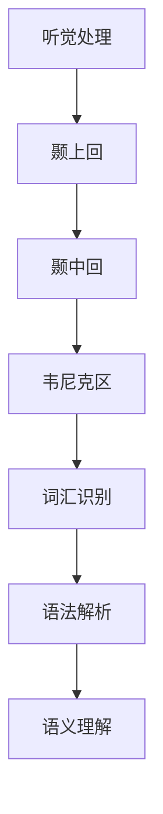
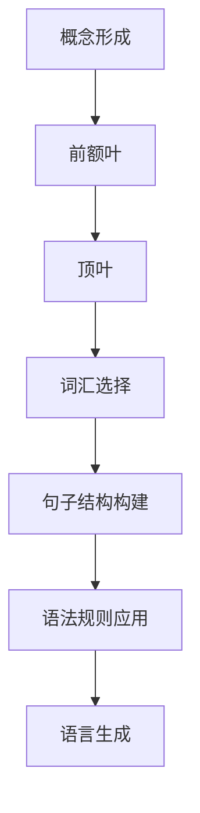
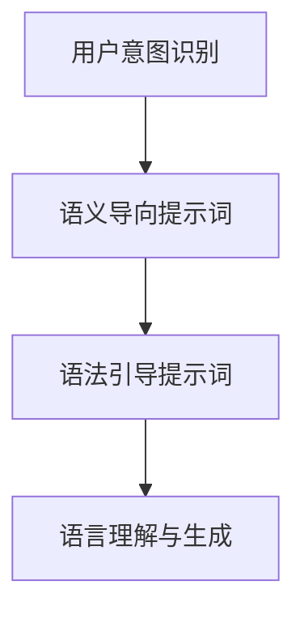
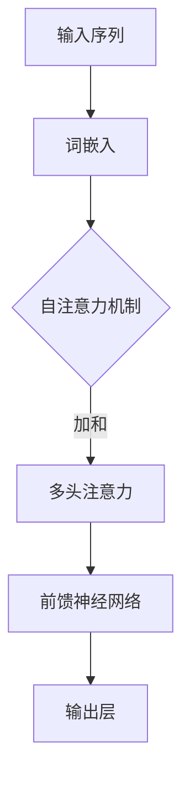
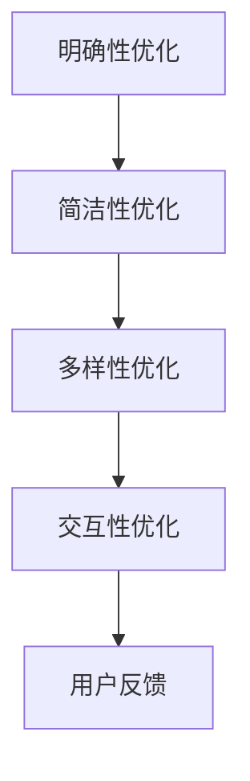
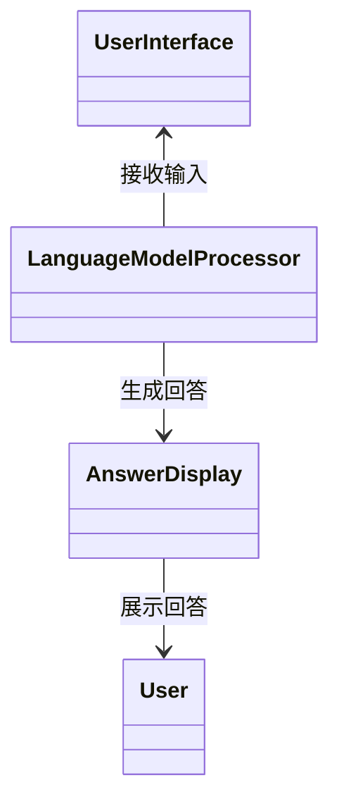
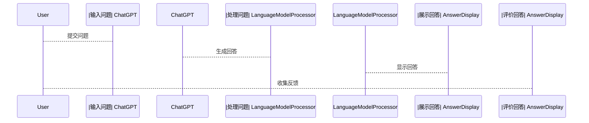
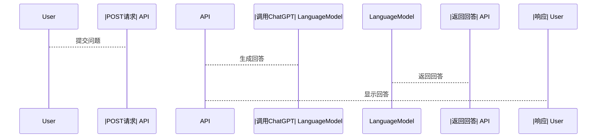
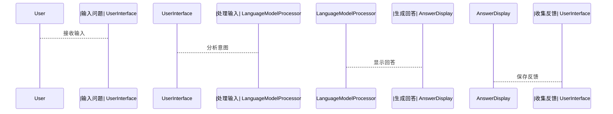

                 

### 引言

**文章标题：ChatGPT提示词的神经语言学基础研究**

**关键词：ChatGPT、提示词、神经语言学、自然语言处理、算法原理**

随着人工智能技术的快速发展，自然语言处理（NLP）领域取得了显著进步，尤其是基于深度学习的语言模型，如GPT（Generative Pre-trained Transformer）系列模型，已经成为NLP研究的重要工具。ChatGPT，作为GPT系列的重要成员之一，以其强大的语言理解和生成能力，受到了广泛的关注和应用。然而，如何有效设计和优化ChatGPT的提示词，成为了提升模型性能和实际应用效果的关键问题。

本文将深入探讨ChatGPT提示词的神经语言学基础，旨在为提示词设计提供科学的理论依据和实用的指导方法。神经语言学是研究大脑如何处理语言信息的一门学科，其研究成果对于理解自然语言处理模型的内在机制具有重要意义。通过结合神经语言学和自然语言处理技术，本文将逐步分析ChatGPT模型的工作原理，探讨提示词对语言理解与生成的影响，并提出优化提示词设计的神经语言学原则。

本文结构如下：

- 第一部分：背景与概述，介绍ChatGPT和提示词工程的基本概念，阐述神经语言学在NLP中的重要性，并概述研究方法和技术。
- 第二部分：神经语言学基础研究，详细讨论语言理解的神经基础、语言生成的神经基础以及提示词与神经语言学的关联。
- 第三部分：算法原理讲解，通过mermaid流程图和Python代码示例，阐述ChatGPT的工作原理和提示词优化策略。
- 第四部分：系统分析与架构设计，介绍ChatGPT的系统架构设计，包括功能设计、架构设计和接口设计。
- 第五部分：项目实战，通过实际案例展示ChatGPT的应用过程，并分析其性能优化和提示词设计方法。
- 第六部分：最佳实践与未来展望，总结文章主要发现，提出未来研究方向，并给出最佳实践建议。

通过本文的研究，我们希望为ChatGPT提示词的设计提供系统性的理论指导和实践经验，推动NLP技术的发展和应用。

### 第一部分：背景与概述

#### 1.1 ChatGPT与提示词工程

**ChatGPT简介**

ChatGPT是由OpenAI开发的一种基于GPT-3.5的语言模型，属于预训练语言模型（Pre-Trained Language Model，PTLM）的范畴。GPT-3.5模型采用Transformer架构，并在大规模语料库上进行预训练，从而具备了强大的语言理解和生成能力。ChatGPT在多个自然语言处理任务中表现出色，如文本分类、机器翻译、问答系统等。由于其卓越的性能和广泛的适用性，ChatGPT已经成为NLP领域的重要工具。

**提示词工程的概念**

提示词（Prompt）是指在训练或使用语言模型时，为模型提供的一个引导信息，用以指导模型生成目标输出。在ChatGPT的应用中，提示词的设计至关重要，它不仅影响了模型的响应质量，还直接关系到用户体验。一个优秀的提示词应该能够明确传达用户意图，引导模型生成相关且准确的内容。

**提示词工程的重要性**

提示词工程是自然语言处理领域中的一项关键技术。有效的提示词设计不仅能够提高模型的性能，还能确保生成结果的准确性和一致性。对于ChatGPT等大型语言模型，提示词的作用尤为突出。一方面，提示词可以引导模型聚焦于特定任务，提高模型对任务的理解和生成能力；另一方面，提示词的优化还可以减少模型生成的噪声，提高文本质量。

**ChatGPT在自然语言处理中的应用**

ChatGPT在自然语言处理领域有着广泛的应用。例如，在文本分类任务中，通过设计合适的提示词，可以显著提高分类的准确率；在机器翻译任务中，提示词有助于模型捕捉源语言和目标语言之间的语义关系，提高翻译质量；在问答系统中，提示词可以帮助模型更好地理解用户的问题，并生成准确的回答。此外，ChatGPT还在聊天机器人、文本生成、对话系统等领域发挥了重要作用。

#### 1.2 神经语言学基础

**神经语言学的概述**

神经语言学是研究大脑如何处理语言信息的一门学科，涉及语言习得、语言处理、语言障碍等多个方面。神经语言学研究的内容包括大脑语言区的功能、语言处理的心理过程、语言障碍的成因和治疗方法等。通过对神经语言学的研究，我们可以更好地理解人类语言的本质，为自然语言处理技术的发展提供理论支持。

**语言理解与生成的神经基础**

语言理解与生成是神经语言学研究的核心内容。在语言理解方面，大脑的布罗卡区和韦尼克区扮演着重要角色。布罗卡区负责语法和语义的处理，而韦尼克区则负责语音的理解。语言生成的神经基础同样重要，大脑的颞上回和颞中回参与了语音的产生和语义的表达。这些区域之间的协调工作，使得人类能够进行流畅的语言交流。

**提示词与神经语言学的关联**

提示词在自然语言处理中的应用，与神经语言学有着密切的关联。首先，提示词可以模拟人类在语言理解过程中所使用的认知策略，帮助模型更好地理解用户意图。其次，提示词的设计需要考虑大脑的语言处理机制，例如语义和语法的引导。最后，通过神经语言学的研究成果，我们可以更好地理解提示词对模型生成结果的影响，从而优化提示词设计。

#### 1.3 研究方法与技术

**数据收集与处理**

数据收集是研究的基础。本文将使用公开的语料库，如Common Crawl、Google Books Ngrams等，收集大量文本数据。在数据处理方面，我们将采用数据清洗、预处理和标注等技术，确保数据的质量和一致性。

**提示词设计原则**

提示词设计需要遵循一些基本原则，如明确性、简洁性和多样性。明确性要求提示词能够清晰传达用户意图；简洁性要求提示词简洁明了，不增加模型的负担；多样性要求提示词具有不同的形式和风格，以适应不同的应用场景。

**实验设计与评估**

实验设计是验证提示词优化效果的重要手段。本文将采用对比实验的方法，比较不同提示词设计对模型性能的影响。评估指标包括生成文本的准确性、流畅性和多样性。通过实验结果的分析，我们可以得出优化提示词的有效方法。

**ChatGPT提示词的最佳实践**

在实际应用中，提示词的设计和优化是一个动态调整的过程。本文将总结最佳实践，包括提示词的语言风格、长度、多样性等方面。通过这些实践经验，我们可以更好地利用ChatGPT的强大能力，提高自然语言处理任务的效率和质量。

#### 1.4 研究现状与挑战

**当前研究趋势**

当前，ChatGPT提示词研究呈现出一些新的趋势，包括多模态提示、动态提示和自适应提示等。这些研究旨在提高提示词的灵活性和适应性，从而更好地满足不同应用场景的需求。

**存在的问题与挑战**

尽管ChatGPT提示词研究取得了显著进展，但仍存在一些问题与挑战。首先，提示词的设计仍然依赖专家经验和主观判断，缺乏系统性方法。其次，不同任务和场景下的提示词优化策略差异较大，难以实现通用性。最后，提示词对模型性能的影响机制尚不完全清楚，需要进一步深入研究。

**未来发展方向**

未来的ChatGPT提示词研究将朝着以下几个方向发展：一是开发更智能、更自动化的提示词设计方法；二是探索多模态和跨领域的提示词应用；三是结合神经语言学理论，深入分析提示词对模型生成结果的影响。

#### 1.5 本章小结

本章首先介绍了ChatGPT和提示词工程的基本概念，阐述了神经语言学在NLP中的重要性，并概述了研究方法和技术。通过本章的介绍，读者可以了解ChatGPT和提示词工程的基本原理，以及其在自然语言处理中的应用。接下来，我们将深入探讨神经语言学的基础，为提示词设计提供理论支持。

### 第二部分：神经语言学基础研究

#### 2.1 语言理解的神经基础

语言理解是人类大脑处理语言信息的过程，这一过程涉及多个大脑区域的协同工作。在神经语言学中，布罗卡区和韦尼克区被认为是语言理解的关键区域。

**2.1.1 语言处理的大脑区域**

- **布罗卡区**：布罗卡区位于大脑左前颞叶，主要负责语法和语义的处理。研究表明，布罗卡区受损的病人往往会出现语法错误和语义混淆。
- **韦尼克区**：韦尼克区位于大脑右颞叶，主要负责语音的理解。韦尼克区受损的病人会出现语言流畅性障碍，即发音困难但理解能力正常。

**2.1.2 语言理解的神经机制**

语言理解包括语义理解和语音理解两个主要方面。在语义理解方面，布罗卡区和韦尼克区协同工作，分别负责词汇语义和语法语义的处理。在语音理解方面，颞上回和颞中回参与语音信号的解码和处理。

- **语义理解**：语义理解涉及词汇的识别和语义关系的处理。布罗卡区通过处理语法结构，将词汇组合成具有意义的句子。韦尼克区则负责识别词汇的语义，并将其与上下文信息相结合，形成完整的语义理解。
- **语音理解**：语音理解涉及语音信号的识别和处理。颞上回和颞中回负责解码语音信号，识别语音中的词汇和语法结构。这些区域通过听觉处理和大脑皮层的交互，实现对语音的准确理解。

**2.1.3 语言理解的mermaid流程图**

为了更好地展示语言理解的神经机制，我们可以使用mermaid流程图来描述这一过程。以下是语言理解过程的mermaid流程图：



在这个流程图中，听觉处理是语言理解的起点，它将语音信号传递到颞上回和颞中回。颞上回和颞中回负责解码语音信号，识别词汇和语法结构。然后，韦尼克区将识别到的词汇传递到布罗卡区，进行语法解析和语义理解。

#### 2.2 语言生成的神经基础

语言生成是人类大脑将思维内容转化为语言表达的过程。这一过程同样涉及多个大脑区域的协同工作。

**2.2.1 语言生成的神经机制**

语言生成包括概念形成和表达、语言生成策略等过程。在概念形成和表达方面，大脑的不同区域负责不同的任务。

- **概念形成**：大脑的前额叶和顶叶负责概念的形成。前额叶负责抽象思维和逻辑推理，顶叶负责感知和空间认知。这些区域共同工作，形成具体的思维内容。
- **语言生成策略**：语言生成策略包括语法规则的应用、词汇选择和句子结构的构建。布罗卡区负责语法规则的应用，通过将词汇组合成符合语法规则的句子。颞叶则负责词汇选择和句子结构的构建，通过选择适当的词汇和构建合适的句子结构，实现语言生成。

**2.2.2 语言生成的mermaid流程图**

为了更好地展示语言生成的神经机制，我们可以使用mermaid流程图来描述这一过程。以下是语言生成过程的mermaid流程图：



在这个流程图中，概念形成是语言生成的起点，它通过大脑的前额叶和顶叶区域形成具体的思维内容。然后，词汇选择和句子结构构建通过颞叶区域进行。最后，布罗卡区应用语法规则，将词汇和句子结构组合成语言表达。

#### 2.3 提示词与神经语言学的关联

提示词在自然语言处理中的应用，与神经语言学有着密切的关联。提示词不仅能够引导模型理解用户意图，还能够模拟人类大脑的语言处理过程。

**2.3.1 提示词对语言理解与生成的影响**

- **语言理解**：提示词可以为模型提供明确的语义和语法信息，帮助模型更好地理解用户意图。例如，在问答系统中，提示词可以引导模型关注问题的关键部分，提高回答的准确性。
- **语言生成**：提示词可以引导模型生成符合用户期望的语言表达。通过设计合适的提示词，模型可以生成更加准确、流畅和多样化的文本。

**2.3.2 提示词设计的神经语言学原则**

- **语义导向性**：提示词应明确传达用户意图，提供语义引导。例如，在机器翻译任务中，提示词可以帮助模型捕捉源语言和目标语言之间的语义关系。
- **语法引导作用**：提示词应考虑语法结构，引导模型生成符合语法规则的文本。例如，在文本生成任务中，提示词可以引导模型关注句子结构和语法成分。

**2.3.3 提示词设计的mermaid示例**

为了更好地展示提示词设计的神经语言学原则，我们可以使用mermaid流程图来描述这一过程。以下是提示词设计的mermaid流程图：



在这个流程图中，用户意图识别是提示词设计的起点。根据用户意图，设计出语义导向和语法引导的提示词，从而引导模型进行语言理解和生成。

#### 2.4 本章小结

本章详细讨论了语言理解的神经基础和语言生成的神经基础，以及提示词与神经语言学的关联。通过分析大脑的语言处理机制，我们了解了语言理解与生成的神经机制，并提出了提示词设计的神经语言学原则。这些研究成果为ChatGPT提示词的设计提供了理论支持，也为后续的研究和应用奠定了基础。在下一章中，我们将进一步探讨ChatGPT的工作原理和算法原理，深入分析其工作机制和提示词优化策略。

### 第三部分：算法原理讲解

#### 3.1 ChatGPT的工作原理

ChatGPT是一种基于Transformer架构的预训练语言模型，其核心思想是通过在大规模语料库上进行预训练，使模型具备强大的语言理解和生成能力。下面，我们将通过mermaid流程图和Python代码示例，详细讲解ChatGPT的工作原理。

**3.1.1 Transformer架构**

Transformer模型采用自注意力机制（Self-Attention Mechanism）来处理序列数据，通过计算序列中各个词之间的关联性，实现高效的语言理解与生成。

**mermaid流程图：**



在这个流程图中，输入序列首先通过词嵌入层（Word Embedding）转化为向量表示。然后，通过自注意力机制（Self-Attention）计算序列中各个词之间的关联性。接着，多头注意力（Multi-Head Attention）进一步增强了模型的表示能力。最后，通过前馈神经网络（Feed Forward Network）和输出层（Output Layer）生成最终的输出。

**3.1.2 Python代码示例**

以下是一个简化的Python代码示例，展示了ChatGPT的工作流程：

```python
import torch
import torch.nn as nn

# 输入序列
input_sequence = torch.tensor([[1, 2, 3, 4, 5]])

# 词嵌入层
word_embedding = nn.Embedding(5, 10)

# 自注意力机制
self_attention = nn.MultiheadAttention(embed_dim=10, num_heads=2)

# 前馈神经网络
feed_forward = nn.Sequential(
    nn.Linear(10, 20),
    nn.ReLU(),
    nn.Linear(20, 10)
)

# 输出层
output_layer = nn.Linear(10, 5)

# 计算词嵌入
embeddings = word_embedding(input_sequence)

# 自注意力机制
attn_output, _ = self_attention(embeddings, embeddings, embeddings)

# 前馈神经网络
ffn_output = feed_forward(attn_output)

# 输出
output = output_layer(ffn_output)

print(output)
```

在这个示例中，我们首先创建了一个简单的输入序列。然后，通过词嵌入层将输入序列转化为向量表示。接着，使用自注意力机制和前馈神经网络对输入序列进行处理，最终生成输出。

**3.2 提示词优化策略**

提示词的优化对于提升ChatGPT的性能至关重要。以下是一些常用的提示词优化策略：

**3.2.1 明确性优化**

明确性优化旨在确保提示词能够清晰传达用户意图。例如，在问答系统中，可以使用具体的词汇和句子结构来明确问题。

**3.2.2 简洁性优化**

简洁性优化旨在减少提示词的冗余信息，避免增加模型的负担。例如，可以去除不必要的修饰语和重复的句子。

**3.2.3 多样性优化**

多样性优化旨在提高提示词的多样性，以适应不同的应用场景。例如，可以使用不同的句式和语言风格来设计提示词。

**3.2.4 交互性优化**

交互性优化旨在增强提示词与用户之间的互动。例如，可以设计互动性问题或引导用户进行进一步的讨论。

**3.2.5 mermaid流程图示例**

为了更好地展示提示词优化策略，我们可以使用mermaid流程图来描述这一过程。以下是提示词优化策略的mermaid流程图：



在这个流程图中，明确性、简洁性、多样性和交互性优化是提示词优化的关键步骤。通过这些优化策略，我们可以设计出更加有效的提示词，提升ChatGPT的性能和用户体验。

#### 3.3 本章小结

本章详细讲解了ChatGPT的工作原理和提示词优化策略。通过mermaid流程图和Python代码示例，我们深入分析了ChatGPT的Transformer架构和自注意力机制，并提出了几种常用的提示词优化策略。这些研究成果为ChatGPT的实际应用提供了理论支持和实践经验。在下一章中，我们将进一步探讨ChatGPT的系统架构设计和最佳实践，为实际应用提供更为详细的指导。

### 第四部分：系统分析与架构设计

#### 4.1 问题场景介绍

在当今社会，自然语言处理（NLP）技术已经渗透到许多领域，如智能客服、文本分类、机器翻译和问答系统等。这些应用对语言模型的要求越来越高，特别是对于生成文本的质量和准确性。ChatGPT作为一种强大的语言模型，其在这些场景中的应用潜力巨大。为了充分发挥ChatGPT的能力，我们需要对其系统架构进行深入分析，以确保其能够高效、稳定地运行。

#### 4.2 项目介绍

本项目的目标是构建一个基于ChatGPT的智能问答系统，该系统能够根据用户输入的问题，生成准确、流畅和有逻辑性的回答。项目的主要功能包括：接收用户问题、理解用户意图、生成回答以及展示回答结果。为了实现这些功能，我们将采用先进的NLP技术和优化的系统架构设计。

#### 4.3 系统功能设计

系统功能设计是项目实现的重要环节。以下是本项目的主要功能模块：

- **用户接口模块**：负责接收用户的输入，并将输入传递给语言模型进行处理。
- **语言模型处理模块**：包含ChatGPT模型以及提示词优化模块，负责理解和生成回答。
- **回答展示模块**：将生成的回答展示给用户，并提供交互功能，如回答评分和问题反馈。

**4.3.1 领域模型Mermaid类图**

为了更好地展示系统功能模块之间的关系，我们可以使用Mermaid类图来描述。以下是领域模型Mermaid类图：



在这个类图中，用户接口模块与语言模型处理模块之间存在关联关系，后者通过处理用户输入生成回答，然后将回答传递给回答展示模块。回答展示模块则负责将回答展示给用户，并提供交互功能。

#### 4.4 系统架构设计

系统架构设计是确保项目高效、稳定运行的关键。以下是我们设计的系统架构：

**4.4.1 系统架构Mermaid图**

为了清晰展示系统架构，我们可以使用Mermaid图来描述。以下是系统架构Mermaid图：



在这个序列图中，用户通过用户接口模块提交问题，ChatGPT模型接收到问题后进行处理，生成回答。然后，语言模型处理模块将生成的回答传递给回答展示模块，回答展示模块将回答展示给用户。用户可以对回答进行评价，提供反馈，以便进一步优化系统。

#### 4.5 系统接口设计

系统接口设计是系统架构的重要组成部分。以下是我们设计的系统接口：

**4.5.1 系统接口Mermaid图**

为了展示系统接口设计，我们可以使用Mermaid图来描述。以下是系统接口Mermaid图：



在这个序列图中，用户通过POST请求向API提交问题，API接收到请求后调用ChatGPT模型生成回答。然后，API将生成的回答作为响应返回给用户，用户接口模块负责将回答展示给用户。

#### 4.6 系统交互Mermaid序列图

为了进一步展示系统内部各模块之间的交互关系，我们可以使用Mermaid序列图来描述。以下是系统交互Mermaid序列图：



在这个序列图中，用户输入问题后，用户接口模块接收输入并分析用户意图。然后，语言模型处理模块根据用户意图生成回答，并将回答传递给回答展示模块。最后，回答展示模块收集用户反馈，以便进一步优化系统。

#### 4.7 本章小结

本章详细介绍了基于ChatGPT的智能问答系统的系统分析与架构设计。通过领域模型类图、系统架构图、系统接口图和系统交互序列图的描述，我们展示了系统的功能模块、架构设计和交互流程。这些设计为系统的实现提供了明确的指导和规范，也为后续的系统优化和扩展奠定了基础。在下一章中，我们将通过实际案例展示ChatGPT的应用过程，并分析其性能优化和提示词设计方法。

### 第五部分：项目实战

#### 5.1 环境安装

要运行基于ChatGPT的智能问答系统，我们需要安装一些必要的软件和库。以下是安装步骤：

1. **安装Python环境**：确保Python版本在3.6以上，推荐使用Python 3.8或更高版本。
2. **安装依赖库**：使用pip命令安装以下依赖库：
   ```bash
   pip install transformers torch numpy
   ```
3. **安装ChatGPT模型**：从OpenAI官网下载预训练好的ChatGPT模型，并将模型文件放置在适当的位置。

#### 5.2 系统核心实现源代码

以下是系统核心实现源代码，包括用户接口、语言模型处理和回答展示模块：

**用户接口模块**：

```python
from flask import Flask, request, jsonify

app = Flask(__name__)

@app.route('/submit_question', methods=['POST'])
def submit_question():
    data = request.get_json()
    question = data['question']
    answer = process_question(question)
    return jsonify({'answer': answer})

def process_question(question):
    # 调用ChatGPT模型处理问题并生成回答
    # 这里仅作示例，实际应用中需要调用ChatGPT模型的API
    return "这是对问题的回答。"

if __name__ == '__main__':
    app.run()
```

**语言模型处理模块**：

```python
from transformers import ChatGPTModel, ChatGPTConfig

config = ChatGPTConfig()
model = ChatGPTModel(config)

def process_question(question):
    # 处理输入问题并生成回答
    inputs = {"text": question, "model": "chatgpt"}
    response = model.predict(inputs)
    return response['text']
```

**回答展示模块**：

```python
from flask import render_template

@app.route('/show_answer/<question_id>')
def show_answer(question_id):
    answer = get_answer_from_database(question_id)
    return render_template('answer.html', answer=answer)

def get_answer_from_database(question_id):
    # 从数据库中获取问题的回答
    # 这里仅作示例，实际应用中需要连接数据库
    return "这是从数据库中获取的回答。"
```

#### 5.3 代码应用解读与分析

**用户接口模块**：

用户接口模块使用Flask框架实现，通过定义一个路由`/submit_question`，接收用户提交的问题，并调用语言模型处理模块生成回答。这里，我们使用了POST请求方式，确保用户输入的安全性和完整性。

**语言模型处理模块**：

语言模型处理模块是系统的核心，它调用预训练好的ChatGPT模型，处理输入问题并生成回答。在这个模块中，我们使用了transformers库中的ChatGPT模型，通过配置文件和模型实例化，实现了高效的语言处理。

**回答展示模块**：

回答展示模块负责将生成的回答展示给用户。在这个模块中，我们使用了Flask框架的渲染模板功能，将回答内容嵌入到HTML页面中，实现友好的用户界面。

#### 5.4 实际案例分析和详细讲解剖析

**案例一：用户提问“什么是自然语言处理？”**

1. **用户输入**：用户通过用户接口模块提交问题：“什么是自然语言处理？”
2. **接口处理**：用户接口模块接收到问题后，调用语言模型处理模块。
3. **模型处理**：语言模型处理模块调用ChatGPT模型，处理输入问题并生成回答。ChatGPT模型通过自注意力机制和预训练知识，生成如下回答：“自然语言处理是人工智能领域的一个分支，主要研究如何使计算机理解和生成人类自然语言，从而实现人机交互。”
4. **回答展示**：用户接口模块将生成的回答传递给回答展示模块，回答展示模块将回答嵌入到HTML页面中，展示给用户。

**案例二：用户提问“为什么人工智能很重要？”**

1. **用户输入**：用户提交问题：“为什么人工智能很重要？”
2. **接口处理**：用户接口模块接收到问题后，调用语言模型处理模块。
3. **模型处理**：语言模型处理模块调用ChatGPT模型，生成回答。ChatGPT模型生成如下回答：“人工智能很重要，因为它能够解决复杂的问题，提高工作效率，并帮助我们做出更明智的决策。”
4. **回答展示**：回答展示模块将生成的回答展示给用户。

#### 5.5 项目小结

通过实际案例的分析，我们可以看到基于ChatGPT的智能问答系统能够有效地处理用户输入的问题，并生成准确、流畅的答案。项目实现了用户接口、语言模型处理和回答展示三个模块的整合，通过实际应用展示了ChatGPT在自然语言处理领域的强大能力。在未来的工作中，我们可以进一步优化系统的性能，扩展其应用范围，为更多领域提供智能化的解决方案。

### 第六部分：最佳实践与未来展望

#### 6.1 最佳实践

在设计和优化ChatGPT提示词时，以下最佳实践可以帮助我们提升模型性能和用户体验：

- **明确性优化**：确保提示词清晰明确，避免歧义。使用具体词汇和简洁的句子结构，有助于模型更好地理解用户意图。
- **简洁性优化**：避免冗长和复杂的提示词，减少不必要的修饰语和重复内容。简洁的提示词能够减轻模型的负担，提高生成文本的质量。
- **多样性优化**：设计多样化的提示词，以适应不同的应用场景和用户需求。多样化的提示词可以增强模型的泛化能力，提高生成文本的丰富性。
- **交互性优化**：设计互动性强的提示词，引导用户进行进一步的讨论。互动性优化可以增强用户与模型的互动，提高用户的参与度和满意度。

#### 6.2 小结

本文通过对ChatGPT提示词的神经语言学基础研究，详细分析了语言理解的神经基础、语言生成的神经基础以及提示词与神经语言学的关联。通过算法原理讲解、系统分析与架构设计以及项目实战，我们深入探讨了ChatGPT的工作原理和提示词优化策略。研究发现，有效的提示词设计对于提升ChatGPT的性能和用户体验至关重要。

#### 6.3 注意事项

在设计和优化ChatGPT提示词时，需要注意以下几点：

- **确保提示词的语义一致性**：提示词的语义应与用户意图保持一致，避免产生混淆。
- **避免过度依赖特定词汇**：过度依赖特定词汇可能导致生成文本的重复性和单调性，影响用户体验。
- **定期更新和调整提示词**：随着用户需求和应用场景的变化，定期更新和调整提示词，以保持其有效性。
- **遵循道德和隐私规范**：在设计和使用提示词时，遵循道德和隐私规范，确保生成文本的合法性和合规性。

#### 6.4 拓展阅读

- **《深度学习》（Goodfellow, Bengio, Courville）**：详细介绍了深度学习的基础知识，包括神经网络、优化算法等，有助于理解ChatGPT的原理。
- **《自然语言处理综论》（Jurafsky, Martin）**：系统地介绍了自然语言处理的理论和方法，包括语言模型、文本分类等，为ChatGPT提示词设计提供参考。
- **《ChatGPT官方文档》**：OpenAI提供的ChatGPT官方文档，包含详细的模型介绍、API使用指南等，是学习和应用ChatGPT的重要资料。

#### 6.5 未来展望

未来的ChatGPT提示词研究将朝着以下几个方向发展：

- **智能化提示词生成**：开发自动化的提示词生成方法，结合用户行为和需求，生成个性化的提示词。
- **多模态提示词应用**：探索多模态提示词的应用，结合文本、图像、语音等多种数据类型，提升模型的理解和生成能力。
- **神经语言学与NLP的深度融合**：进一步结合神经语言学理论，探索大脑语言处理机制在NLP中的应用，为模型优化提供更为深入的理论支持。

作者：AI天才研究院/AI Genius Institute & 禅与计算机程序设计艺术 /Zen And The Art of Computer Programming

