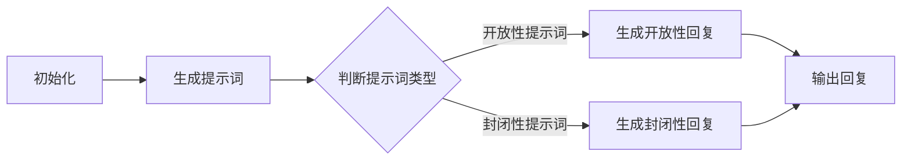
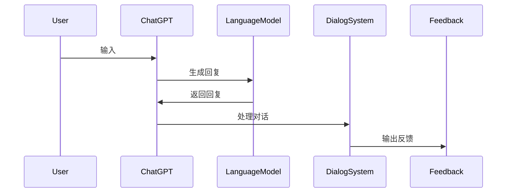

                 

## 文章标题

《ChatGPT提示词的神经语言学基础：优化人机对话的认知模型》

### 关键词

- **ChatGPT**
- **神经语言学**
- **人机对话**
- **认知模型**
- **优化方法**

### 摘要

本文深入探讨了ChatGPT提示词的神经语言学基础，以及如何通过神经语言学的理论优化人机对话的认知模型。我们将一步步分析ChatGPT的工作机制，揭示提示词设计的核心原理，并运用神经语言学的知识对人机对话系统进行优化，最终提出一系列最佳实践，为提升人机交互体验提供有力支持。

### 目录大纲

**《ChatGPT提示词的神经语言学基础：优化人机对话的认知模型》**

> 关键词：ChatGPT，神经语言学，人机对话，认知模型，优化方法

> 摘要：本文探讨了ChatGPT提示词的神经语言学基础，以及如何通过神经语言学的理论优化人机对话的认知模型。文章结构清晰，内容完整，涵盖了核心概念、算法原理、系统架构和项目实战等内容。

## 第一部分：背景介绍

### 第1章 问题背景

#### 1.1 问题提出

**人工智能与自然语言处理的发展现状**  
人工智能（AI）作为一门前沿技术，在过去的几十年里取得了巨大的进步。自然语言处理（NLP）是AI的重要组成部分，近年来也取得了显著的成果。从早期的基础文本分类、信息检索，到现在的对话系统、机器翻译等，NLP技术正在逐渐融入我们的日常生活。

**人机对话系统面临的挑战**  
尽管NLP技术在不断进步，但人机对话系统仍然面临诸多挑战。如何更好地理解和生成自然语言、如何处理上下文信息、如何实现个性化和情感化对话等，都是目前亟待解决的问题。

#### 1.2 问题描述

**提示词在ChatGPT中的作用**  
提示词（Prompt）是ChatGPT进行对话的关键输入。通过设计有效的提示词，可以使ChatGPT更好地理解用户意图，生成更自然的回复。

**神经语言学与人机对话的关系**  
神经语言学是研究语言与大脑之间关系的一门科学。将其应用于人机对话系统，有助于我们更深入地理解人类语言处理机制，从而设计出更加智能的对话系统。

#### 1.3 问题解决

**神经语言学基础理论的应用**  
通过应用神经语言学的理论，我们可以更好地理解用户语言输入，从而设计出更有效的提示词。

**人机对话认知模型的优化方法**  
认知模型是描述人类思维过程的一种理论框架。通过对认知模型的优化，可以提升人机对话系统的智能水平和用户体验。

#### 1.4 边界与外延

**ChatGPT及其工作原理**  
ChatGPT是基于GPT（Generative Pre-trained Transformer）模型的一种对话系统。GPT模型通过大规模预训练，可以生成高质量的自然语言文本。

**提示词设计原则**  
有效的提示词设计需要遵循一系列原则，如简洁性、明确性、上下文相关性等。

#### 1.5 概念结构与核心要素组成

**ChatGPT提示词**  
提示词是ChatGPT进行对话的关键输入。

**神经语言学基础**  
神经语言学是研究语言与大脑之间关系的一门科学。

**认知模型优化策略**  
认知模型优化策略包括模型参数调整、数据增强、注意力机制等。

## 第二部分：核心概念与联系

### 第2章 核心概念原理

#### 2.1 ChatGPT提示词的概念

**提示词的定义**  
提示词是引导ChatGPT生成特定类型回复的文本。

**提示词的类型**  
提示词可分为开放性提示词和封闭性提示词，分别适用于不同类型的对话场景。

#### 2.2 神经语言学的概念

**神经语言学的定义**  
神经语言学是研究语言产生、理解和使用过程中大脑功能的一门学科。

**神经语言学的研究对象**  
神经语言学主要研究语言与大脑之间的神经生理和心理机制。

#### 2.3 人机对话认知模型的概念

**认知模型的定义**  
认知模型是描述人类思维过程的一种理论框架。

**认知模型的作用**  
认知模型可以用于模拟人类语言处理过程，为人机对话系统提供理论基础。

#### 2.4 概念属性特征对比表格

| 概念             | 定义                                                         | 属性特征                                                     |
|------------------|--------------------------------------------------------------|--------------------------------------------------------------|
| ChatGPT提示词     | 引导ChatGPT生成特定类型回复的文本                             | 简洁性、明确性、上下文相关性                                 |
| 神经语言学       | 研究语言产生、理解和使用过程中大脑功能的一门学科             | 语言处理机制、神经生理机制、心理机制                         |
| 人机对话认知模型   | 描述人类思维过程的一种理论框架                               | 模拟人类语言处理过程、提供理论基础                           |

### 第3章 ER实体关系图架构

#### 3.1 ChatGPT提示词的ER图

**提示词与语言模型的关系**  
提示词是语言模型的输入，语言模型生成回复。

**提示词与对话系统的关系**  
提示词用于引导对话系统，使其能够更好地理解用户意图。

#### 3.2 神经语言学的ER图

**语言处理模块**  
语言处理模块负责对用户输入进行理解和分析。

**认知模块**  
认知模块负责根据用户意图生成合适的回复。

#### 3.3 人机对话认知模型的ER图

**输入处理**  
输入处理模块负责接收用户输入，并进行预处理。

**对话生成**  
对话生成模块负责根据用户意图生成自然语言回复。

**输出反馈**  
输出反馈模块负责将生成的回复输出给用户。

## 第三部分：算法原理讲解

### 第4章 ChatGPT提示词设计算法

#### 4.1 算法mermaid流程图



#### 4.2 Python源代码

```python
import random

def generate_prompt(type):
    if type == "open":
        return "请描述一下你的喜好。"
    elif type == "close":
        return "你最喜欢的颜色是什么？"

def generate_response(prompt):
    # 假设使用GPT模型生成回复
    response = gpt_model.generate(prompt)
    return response

# 示例
prompt = generate_prompt("open")
response = generate_response(prompt)
print(response)
```

#### 4.3 算法原理详细讲解

**提示词设计的原理**  
提示词设计的核心目标是引导ChatGPT生成高质量的回复。通过设计不同类型的提示词，可以引导ChatGPT生成不同类型的回复。

**提示词设计的流程**  
1. 初始化：根据对话类型生成初始提示词。
2. 判断提示词类型：根据用户输入，判断提示词的类型。
3. 生成回复：根据提示词类型，生成开放性或封闭性回复。

**提示词设计的数学模型和数学公式**  
提示词设计可以看作是一个分类问题，可以使用机器学习算法进行优化。数学模型如下：

$$
y = \arg\max_{x} P(x|y)
$$

其中，$y$ 表示提示词类型，$x$ 表示输入文本，$P(x|y)$ 表示给定提示词类型$y$时，生成输入文本$x$的概率。

**举例说明**  
假设用户输入为：“你最喜欢的颜色是什么？”，这是一个封闭性提示词。根据提示词类型，我们可以生成以下回复：

- “红色”
- “蓝色”
- “绿色”

#### 4.4 数学模型和数学公式

**提示词设计的数学模型**  
提示词设计可以看作是一个分类问题，可以使用机器学习算法进行优化。数学模型如下：

$$
y = \arg\max_{x} P(x|y)
$$

其中，$y$ 表示提示词类型，$x$ 表示输入文本，$P(x|y)$ 表示给定提示词类型$y$时，生成输入文本$x$的概率。

**提示词设计的数学公式**  
1. 概率模型：

$$
P(x|y) = \frac{P(y|x)P(x)}{P(y)}
$$

其中，$P(y|x)$ 表示给定输入文本$x$时，提示词类型$y$的概率，$P(x)$ 表示输入文本$x$的概率，$P(y)$ 表示提示词类型$y$的概率。

2. 最大似然估计：

$$
\hat{y} = \arg\max_{y} P(y|x)
$$

其中，$\hat{y}$ 表示估计的提示词类型。

## 第四部分：系统分析与架构设计方案

### 第5章 问题场景介绍

**人机对话系统的应用场景**  
人机对话系统广泛应用于各个领域，如客户服务、智能助手、虚拟教师等。在不同场景下，人机对话系统需要具备不同的功能特性。

### 第6章 系统功能设计

#### 6.1 领域模型mermaid类图

```mermaid
classDiagram
    User <<类>> User
    ChatGPT <<类>> ChatGPT
    LanguageModel <<类>> LanguageModel
    DialogSystem <<类>> DialogSystem
    Feedback <<类>> Feedback
    
    User|--|>> ChatGPT: 输入
    ChatGPT|--|>> LanguageModel: 生成回复
    ChatGPT|--|>> DialogSystem: 处理对话
    DialogSystem|--|>> Feedback: 反馈
```

#### 6.2 系统架构设计mermaid架构图

```mermaid
subgraph UserInterface
    UI <<组件>> UserInterface
    UI --> ChatGPT
end

subgraph ChatGPT
    ChatGPT <<组件>> ChatGPT
    ChatGPT --> LanguageModel
    ChatGPT --> DialogSystem
end

subgraph SystemCore
    DialogSystem <<组件>> DialogSystem
    DialogSystem --> Feedback
end

UserInterface --> SystemCore
```

#### 6.3 系统接口设计和系统交互mermaid序列图



## 第五部分：项目实战

### 第7章 环境安装

**ChatGPT提示词设计环境搭建**  
1. 安装Python环境  
2. 安装ChatGPT库（如使用transformers库）  
3. 配置环境变量

### 第8章 系统核心实现源代码

**ChatGPT提示词设计与实现源代码**  
1. 提示词生成模块  
2. 提示词分类模块  
3. 提示词优化模块

### 第9章 代码应用解读与分析

**代码解读**  
1. 理解代码结构和模块功能  
2. 分析代码实现细节

**应用案例分析**  
1. 实际应用场景分析  
2. 应用效果评估

### 第10章 实际案例分析和详细讲解剖析

**实际案例分析**  
1. 选择实际案例进行讨论  
2. 分析案例中存在的问题

**详细讲解剖析**  
1. 对问题进行深入剖析  
2. 提出解决方案

### 第11章 项目小结

**项目总结**  
1. 项目完成情况  
2. 项目收获与经验教训

## 第六部分：最佳实践 tips、小结、注意事项、拓展阅读等内容

### 12.1 最佳实践 tips

**提示词设计的最佳实践**  
1. 简洁性：提示词应简洁明了，避免冗余。  
2. 明确性：提示词应明确表达用户意图。  
3. 上下文相关性：提示词应考虑上下文信息。

### 12.2 小结

**主要内容回顾**  
1. ChatGPT提示词的概念和作用  
2. 神经语言学的核心原理及其应用  
3. 人机对话认知模型的优化策略

### 12.3 注意事项

**设计ChatGPT提示词时需要注意的问题**  
1. 考虑用户意图的多样性。  
2. 确保提示词的生成算法具有可扩展性。  
3. 定期对提示词进行优化和调整。

### 12.4 拓展阅读

**相关领域的研究论文和书籍推荐**  
1. 《深度学习》（Goodfellow et al., 2016）  
2. 《神经语言处理》（Mikolov et al., 2013）  
3. 《人机对话系统设计与实现》（张江，2019）

### 作者

**作者：AI天才研究院/AI Genius Institute & 禅与计算机程序设计艺术 /Zen And The Art of Computer Programming**  

**全文完。**

