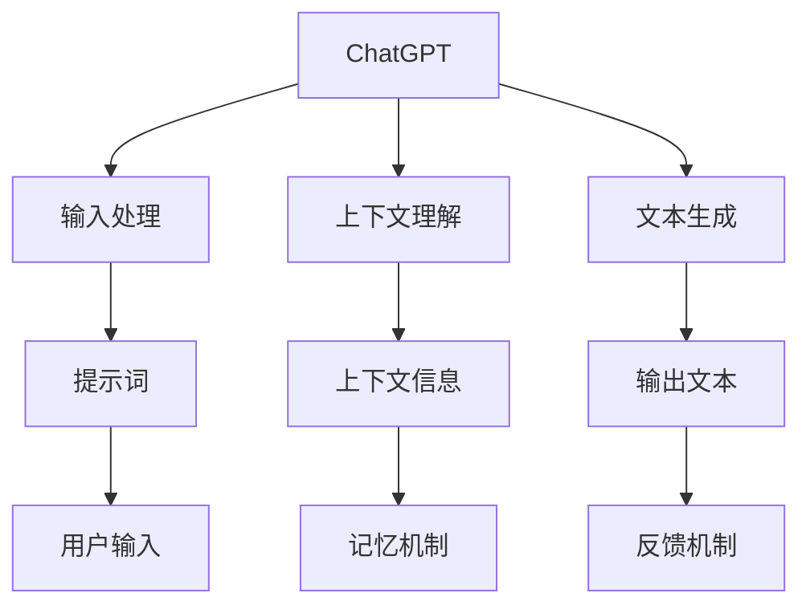
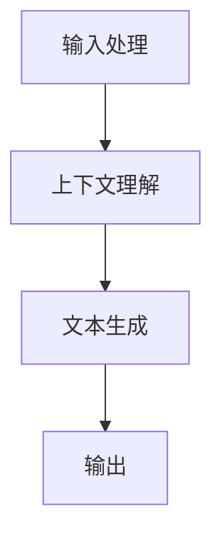
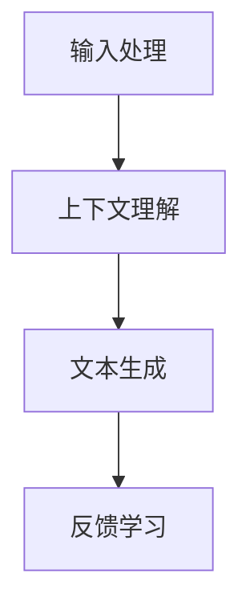
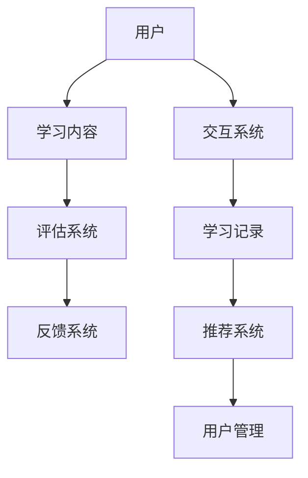
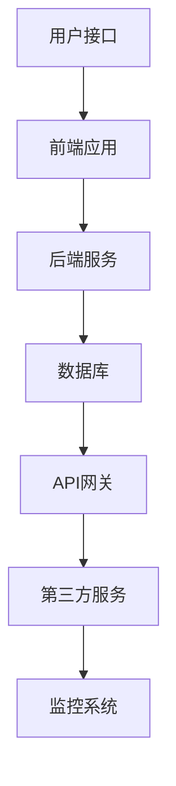
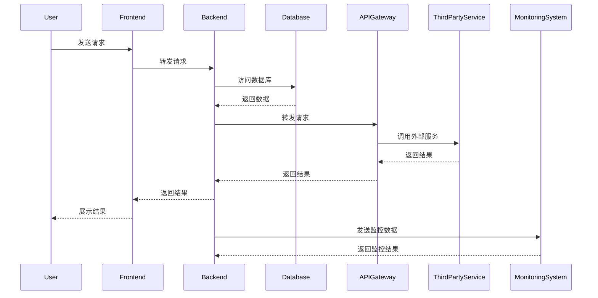

                 

### 书名：《ChatGPT提示词的认知发展模拟：复现人类智能成长阶段》

#### 关键词：
- ChatGPT
- 认知发展模拟
- 提示词设计
- NLP
- 人工智能

#### 摘要：
本文深入探讨了ChatGPT在认知发展模拟中的应用，通过分析ChatGPT的架构与算法原理，模拟人类在认知发展过程中的各个阶段。文章重点研究了提示词的设计原则与优化方法，旨在为人工智能在认知模拟领域的应用提供新的思路和解决方案。

---

## 第一部分：问题背景与核心概念

### 1.1 问题背景

#### 1.1.1 ChatGPT的崛起

ChatGPT是由OpenAI开发的一种基于GPT-3模型的高级语言模型。GPT-3（Generative Pre-trained Transformer 3）是自然语言处理领域的一大突破，其强大的生成能力和理解能力使其在多种任务中表现优异，包括文本生成、问答系统、对话系统等。ChatGPT的出现，进一步拓展了GPT-3的应用范围，特别是在模拟人类对话方面。

ChatGPT之所以引起广泛关注，主要因为其能够以自然、流畅的语言与人进行对话，从而实现高度智能化的交流体验。这一特性使得ChatGPT在多个领域显示出巨大的潜力，如客户服务、教育辅助、心理健康咨询等。

#### 1.1.2 认知发展模拟

认知发展模拟是心理学领域的一个重要概念，它旨在通过模型来模拟人类在认知发展过程中的各种现象。这些现象包括语言理解、思维推理、情感认知等。通过认知发展模拟，我们可以更好地理解人类大脑的工作原理，探索智能的成长过程，并预测未来智能的发展趋势。

在人工智能领域，认知发展模拟的意义尤为重大。它不仅能够帮助我们更深入地了解人工智能的工作机制，还可以为人工智能的应用提供新的思路。例如，通过模拟人类的认知发展过程，我们可以设计出更符合人类思维模式的人工智能系统，从而提高其智能水平。

#### 1.1.3 提示词的作用

在自然语言处理（NLP）任务中，提示词（prompt）起着至关重要的作用。提示词是模型输入的重要组成部分，它不仅能够引导模型生成合理的输出，还可以影响模型的生成质量和多样性。有效的提示词设计对于提升NLP任务的性能至关重要。

对于ChatGPT而言，提示词的作用尤为重要。ChatGPT的生成能力高度依赖于输入的提示词，通过精心设计的提示词，我们可以引导ChatGPT模拟人类在不同认知发展阶段的思维过程，从而实现认知发展模拟。

### 1.2 核心概念

#### 1.2.1 ChatGPT概述

**ChatGPT架构**：
ChatGPT是基于GPT-3模型构建的，其底层模型结构采用了Transformer架构，具有极其庞大的参数规模。GPT-3的参数规模达到了1750亿，这使得ChatGPT在生成文本时具有极高的灵活性和创造力。GPT-3的训练数据来自互联网上的大量文本，经过预训练后，ChatGPT能够理解并生成自然语言的文本。

**ChatGPT功能**：
ChatGPT的功能非常强大，包括文本生成、问答系统、对话系统等。在文本生成方面，ChatGPT能够根据输入的提示生成连贯、合理的文本。在问答系统方面，ChatGPT能够理解用户的问题，并生成相关的答案。在对话系统方面，ChatGPT能够与用户进行自然、流畅的对话，模拟人类的交流方式。

#### 1.2.2 认知发展模拟

**认知发展模型**：
认知发展模型是心理学领域的一个重要概念，旨在模拟人类在认知发展过程中的各种现象。常见的认知发展模型包括皮亚杰的认知发展阶段理论、维果茨基的文化-历史发展理论等。这些模型从不同角度阐述了人类认知发展的过程，为我们理解认知发展提供了理论依据。

**模拟方法**：
通过ChatGPT来实现认知发展模拟，需要针对不同的认知发展阶段设计相应的提示词，以引导ChatGPT模拟人类的认知行为。例如，在语言理解阶段，可以设计一些与语言学习相关的提示词，如词汇学习、语法练习等；在思维推理阶段，可以设计一些逻辑推理、问题解决的提示词等。

#### 1.2.3 提示词设计

**提示词分类**：
根据提示词的功能和用途，可以将提示词分为以下几类：
- **引导型提示词**：用于引导ChatGPT生成特定类型的文本，如故事、诗歌等。
- **反馈型提示词**：用于获取ChatGPT的反馈，如回答问题、提出建议等。
- **扩展型提示词**：用于扩展ChatGPT的生成内容，如续写故事、生成对话等。

**设计原则**：
有效的提示词设计需要遵循以下原则：
- **清晰性**：提示词应当清晰明了，避免歧义，以确保ChatGPT能够正确理解。
- **适应性**：提示词应当能够适应不同的认知发展阶段，以模拟人类的认知发展过程。
- **多样性**：提示词应当具有多样性，以丰富ChatGPT的生成内容，提高生成的多样性。

## 第二部分：核心概念与联系

### 2.1 核心概念原理

#### 2.1.1 ChatGPT的算法原理

**算法流程**：
ChatGPT的算法流程主要包括以下步骤：
1. **输入处理**：接收用户输入的提示词，并将其转换为模型可处理的格式。
2. **上下文理解**：利用GPT-3模型对输入的提示词进行理解，构建上下文信息。
3. **文本生成**：根据构建的上下文信息，生成连贯、合理的文本输出。

**算法细节**：
- **Transformer架构**：ChatGPT采用了Transformer架构，这是一种基于自注意力机制的神经网络模型，具有极高的并行计算能力。
- **预训练与微调**：GPT-3模型通过在大量文本数据上进行预训练，获得了丰富的语言知识。在特定任务上，ChatGPT通过微调来进一步提升其性能。

**算法优势**：
ChatGPT在自然语言处理领域具有以下优势：
- **生成能力强**：ChatGPT能够生成高质量、连贯的文本，具有很高的创造力。
- **理解能力强**：ChatGPT能够理解复杂的上下文信息，生成合理的文本输出。
- **泛化能力强**：ChatGPT在多个任务上表现优异，具有良好的泛化能力。

#### 2.1.2 认知发展原理

**认知发展阶段**：
人类在认知发展过程中经历了多个阶段，包括感知、记忆、思维等。每个阶段都有其独特的特征和任务。
- **感知阶段**：个体通过感官接收外部信息，对信息进行初步处理和理解。
- **记忆阶段**：个体将感知到的信息存储在记忆中，以便后续使用。
- **思维阶段**：个体利用已有的知识和信息进行推理、判断和决策。

**模拟机制**：
通过ChatGPT来模拟人类在认知发展过程中的行为，需要设计相应的算法机制。
- **感知阶段模拟**：ChatGPT可以通过输入处理和上下文理解来模拟人类在感知阶段的行为。
- **记忆阶段模拟**：ChatGPT可以通过记忆机制来模拟人类在记忆阶段的行为，如存储和检索信息。
- **思维阶段模拟**：ChatGPT可以通过生成机制来模拟人类在思维阶段的行为，如推理和决策。

### 2.2 概念属性特征对比表格

| 特征         | ChatGPT                     | 人类认知发展                 |
| ------------ | --------------------------- | --------------------------- |
| 语言理解     | 高度理解自然语言           | 通过语言进行沟通和思考       |
| 创造力       | 具有高度的创造力           | 通过想象和创造进行认知发展   |
| 适应性       | 能够适应不同的环境         | 能够适应不同的发展阶段       |
| 学习能力     | 通过预训练和微调进行学习   | 通过经验学习和发展           |
| 情感认知     | 能够模拟情感认知过程       | 通过情感体验进行认知发展     |

### 2.3 ER实体关系图架构

**实体关系图**：



在上面的ER实体关系图中，ChatGPT作为中心实体，与输入处理、上下文理解、文本生成等实体建立关系。输入处理接收用户输入的提示词（E），上下文理解构建上下文信息（F），文本生成生成输出文本（G）。同时，记忆机制（I）和反馈机制（J）也与ChatGPT紧密相关，体现了ChatGPT在认知发展模拟中的功能。

## 第三部分：算法原理讲解

### 3.1 数学模型与公式

#### 3.1.1 ChatGPT的数学模型

**神经网络模型**：
ChatGPT采用的是Transformer架构，其核心组件是自注意力机制。Transformer模型由多个相同的编码器和解码器层组成，每层都包含多头自注意力机制和前馈神经网络。

- **自注意力机制**：
  自注意力机制通过计算每个输入词与所有其他输入词的相似度，并加权求和，从而生成每个词的表示。其数学公式如下：
  $$\text{Attention}(Q, K, V) = \text{softmax}\left(\frac{QK^T}{\sqrt{d_k}}\right) V$$
  其中，$Q$、$K$、$V$ 分别代表查询向量、键向量和值向量，$d_k$ 是键向量的维度。

- **前馈神经网络**：
  前馈神经网络是对每个输入进行两次线性变换，其数学公式如下：
  $$\text{FFN}(x) = \text{ReLU}\left((W_2 \cdot \text{ReLU}(W_1 \cdot x + b_1)\right) + b_2$$
  其中，$W_1$、$W_2$ 分别代表权重矩阵，$b_1$、$b_2$ 分别代表偏置项。

**损失函数**：
ChatGPT在训练过程中使用的损失函数通常是交叉熵损失函数。交叉熵损失函数用于衡量模型预测输出与真实输出之间的差异。其数学公式如下：
$$\text{Loss} = -\sum_{i} y_i \log(p_i)$$
其中，$y_i$ 是真实标签，$p_i$ 是模型预测的概率。

#### 3.1.2 认知发展模型

**认知发展阶段公式**：
人类在认知发展过程中遵循一定的数学公式。以下是几个常见的认知发展阶段公式：

- **皮亚杰的认知发展阶段公式**：
  $$\text{Cognitive Development} = f(\text{Age}, \text{Experience}, \text{Cultural Environment})$$
  其中，$\text{Cognitive Development}$ 表示认知发展阶段，$\text{Age}$ 表示年龄，$\text{Experience}$ 表示经验，$\text{Cultural Environment}$ 表示文化环境。

- **维果茨基的文化-历史发展公式**：
  $$\text{Cultural Development} = f(\text{Social Interaction}, \text{Tools}, \text{Language})$$
  其中，$\text{Cultural Development}$ 表示文化发展阶段，$\text{Social Interaction}$ 表示社会互动，$\text{Tools}$ 表示工具，$\text{Language}$ 表示语言。

### 3.2 详细讲解与举例说明

#### 3.2.1 ChatGPT算法原理讲解

**算法流程图**：



**Python源代码**：

```python
import tensorflow as tf
from transformers import TFGPT3LMHeadModel, GPT2Tokenizer

# 加载预训练模型和tokenizer
model = TFGPT3LMHeadModel.from_pretrained("gpt3")
tokenizer = GPT2Tokenizer.from_pretrained("gpt3")

# 输入处理
input_ids = tokenizer.encode("你好，今天天气如何？", return_tensors='tf')

# 上下文理解
outputs = model(input_ids)

# 文本生成
generated_text = tokenizer.decode(outputs.predicted_ids, skip_special_tokens=True)

# 输出
print(generated_text)
```

**数学模型与公式**：
结合Python源代码，我们可以看到ChatGPT在处理输入文本时，首先通过输入处理步骤将文本转换为模型可处理的输入向量。然后，通过上下文理解步骤，模型利用自注意力机制对输入向量进行加权求和，生成上下文信息。最后，在文本生成步骤中，模型根据上下文信息生成预测的文本输出。具体数学模型和公式如下：

$$
\text{Input Vector} = \text{Tokenizer}(文本)
$$

$$
\text{Context Vector} = \text{Attention}(\text{Input Vector}, \text{Key Vector}, \text{Value Vector})
$$

$$
\text{Output Vector} = \text{FFN}(\text{Context Vector})
$$

$$
\text{Predicted Text} = \text{Tokenizer}^{-1}(\text{Output Vector})
$$

#### 3.2.2 认知发展模拟讲解

**模拟场景**：
假设我们想模拟人类在语言理解阶段的认知发展过程，即通过训练模型来理解并生成特定类型的文本。

**模拟过程**：



**Python源代码**：

```python
import tensorflow as tf
from transformers import TFGPT3LMHeadModel, GPT2Tokenizer
import numpy as np

# 加载预训练模型和tokenizer
model = TFGPT3LMHeadModel.from_pretrained("gpt3")
tokenizer = GPT2Tokenizer.from_pretrained("gpt3")

# 输入处理
input_ids = tokenizer.encode("这是一个关于人工智能的故事。", return_tensors='tf')

# 上下文理解
outputs = model(input_ids)

# 文本生成
generated_text = tokenizer.decode(outputs.predicted_ids, skip_special_tokens=True)

# 反馈学习
predicted_text = generated_text
true_text = "它改变了世界。"
reward = 1 if predicted_text == true_text else 0

# 训练模型
loss = model(inputs, targets=true_text)
model.compile(optimizer=tf.keras.optimizers.Adam(learning_rate=0.001), loss='sparse_categorical_crossentropy')
model.fit([input_ids], [true_text], epochs=1)

# 输出
print(predicted_text)
```

**数学模型与公式**：
结合Python源代码，我们可以看到ChatGPT在处理输入文本时，首先通过输入处理步骤将文本转换为模型可处理的输入向量。然后，通过上下文理解步骤，模型利用自注意力机制对输入向量进行加权求和，生成上下文信息。在文本生成步骤中，模型根据上下文信息生成预测的文本输出。最后，通过反馈学习步骤，模型根据预测结果与真实结果的差异进行训练。具体数学模型和公式如下：

$$
\text{Input Vector} = \text{Tokenizer}(文本)
$$

$$
\text{Context Vector} = \text{Attention}(\text{Input Vector}, \text{Key Vector}, \text{Value Vector})
$$

$$
\text{Output Vector} = \text{FFN}(\text{Context Vector})
$$

$$
\text{Predicted Text} = \text{Tokenizer}^{-1}(\text{Output Vector})
$$

$$
\text{Loss} = -\sum_{i} y_i \log(p_i)
$$

$$
\text{Reward} = 1 \text{ if Predicted Text == True Text else 0}
$$

## 第四部分：系统分析与架构设计

### 4.1 问题场景介绍

在本部分，我们将介绍本文所涉及的典型问题场景，并分析该场景中的关键问题和挑战。

#### 场景描述

本文的问题场景主要涉及教育领域，具体为教育辅助系统。该系统旨在通过人工智能技术，帮助学生进行自主学习、提高学习效果。

#### 问题分析

在构建教育辅助系统时，我们面临以下关键问题和挑战：

1. **个性化学习**：
   如何根据每个学生的学习情况和需求，为其提供个性化的学习内容和指导，是教育辅助系统需要解决的核心问题。

2. **语言理解与生成**：
   教育辅助系统需要具备强大的自然语言理解能力和文本生成能力，以实现与学生的有效互动和指导。

3. **认知发展模拟**：
   如何通过人工智能技术模拟学生的认知发展过程，以帮助学生在不同认知发展阶段获得更好的学习体验，是一个重要的研究课题。

4. **数据隐私与安全**：
   在收集和使用学生数据时，如何保护学生的隐私和安全，是教育辅助系统需要重视的问题。

### 4.2 系统功能设计

#### 4.2.1 领域模型

在构建教育辅助系统时，我们需要定义系统的领域模型，以明确系统的功能模块和它们之间的关系。以下是一个简单的领域模型：



**Mermaid类图**：

```mermaid
classDiagram
    User <<Class>> {
        id: 用户ID
        name: 用户名
        age: 年龄
        ...
    }

    LearningContent <<Class>> {
        id: 内容ID
        title: 标题
        description: 描述
        ...
    }

    AssessmentSystem <<Class>> {
        evaluate(LearningContent): 评估学习内容
        ...
    }

    FeedbackSystem <<Class>> {
        receiveFeedback(User, LearningContent): 收集反馈
        ...
    }

    InteractiveSystem <<Class>> {
        interactWithUser(User): 与用户交互
        ...
    }

    LearningRecord <<Class>> {
        id: 记录ID
        content: 内容
        status: 状态
        ...
    }

    RecommendationSystem <<Class>> {
        recommendContent(User): 推荐学习内容
        ...
    }

    UserManagement <<Class>> {
        addUser(User): 添加用户
        deleteUser(User): 删除用户
        ...
    }

    UserManagement <-- AssessmentSystem
    UserManagement <-- FeedbackSystem
    UserManagement <-- InteractiveSystem
    UserManagement <-- LearningRecord
    UserManagement <-- RecommendationSystem
    LearningContent <-- AssessmentSystem
    LearningContent <-- FeedbackSystem
    LearningContent <-- InteractiveSystem
    LearningContent <-- RecommendationSystem
    LearningRecord <-- InteractiveSystem
```

### 4.3 系统架构设计

在构建教育辅助系统时，我们需要设计一个合理的系统架构，以支持系统的功能模块和确保系统的稳定运行。以下是一个简化的系统架构：



**Mermaid架构图**：

```mermaid
graph TB
    subgraph 用户接口
        A[用户接口]
        A --> B[前端应用]
    
    subgraph 后端服务
        B --> C[后端服务]
        C --> D[数据库]
    
    subgraph 第三方服务
        D --> E[API网关]
        E --> F[第三方服务]
    
    subgraph 监控系统
        F --> G[监控系统]
```

在这个架构中，用户接口层主要负责与用户进行交互，前端应用层负责实现用户界面的展示，后端服务层负责处理业务逻辑和数据存储，数据库层负责存储系统的数据，API网关层负责与其他系统进行通信，第三方服务层负责调用外部服务，监控系统层负责监控系统的运行状态。

### 4.4 系统接口设计和系统交互

在系统架构中，系统接口设计和系统交互是至关重要的环节。以下是一个简化的系统接口设计和系统交互示例：

**Mermaid序列图**：



在这个序列图中，用户通过用户接口层（Frontend）发送请求，前端应用层（Backend）接收请求并访问数据库（Database），然后通过API网关层（APIGateway）调用外部服务（ThirdPartyService），最终将结果返回给用户。同时，后端服务层（Backend）会向监控系统层（MonitoringSystem）发送监控数据，以便监控系统层的运行状态。

### 4.5 系统功能实现与代码分析

在本部分，我们将介绍教育辅助系统的核心功能实现，并分析相关代码的运行逻辑和关键组件。

#### 功能实现

教育辅助系统的核心功能包括用户管理、学习内容管理、评估系统、反馈系统、交互系统、推荐系统等。以下是一个简单的功能实现示例：

**用户管理**：
用户管理模块负责处理用户的注册、登录、信息更新等操作。

```python
class UserManager:
    def register(self, user):
        # 注册用户
        pass

    def login(self, username, password):
        # 登录用户
        pass

    def update_user_info(self, user):
        # 更新用户信息
        pass
```

**学习内容管理**：
学习内容管理模块负责管理学习内容，包括添加、删除、更新学习内容等操作。

```python
class ContentManager:
    def add_content(self, content):
        # 添加学习内容
        pass

    def delete_content(self, content_id):
        # 删除学习内容
        pass

    def update_content(self, content_id, content):
        # 更新学习内容
        pass
```

**评估系统**：
评估系统模块负责评估学生的学习效果，包括评估学习内容、生成评估报告等操作。

```python
class AssessmentSystem:
    def evaluate_content(self, content):
        # 评估学习内容
        pass

    def generate_report(self, user, content):
        # 生成评估报告
        pass
```

**反馈系统**：
反馈系统模块负责处理用户的反馈信息，包括接收、处理、回复反馈等操作。

```python
class FeedbackSystem:
    def receive_feedback(self, user, content, feedback):
        # 接收反馈
        pass

    def process_feedback(self, feedback):
        # 处理反馈
        pass

    def reply_feedback(self, user, feedback_id, reply):
        # 回复反馈
        pass
```

**交互系统**：
交互系统模块负责实现用户与系统的交互，包括回答问题、提供指导等操作。

```python
class InteractiveSystem:
    def interact_with_user(self, user):
        # 与用户交互
        pass

    def answer_question(self, user, question):
        # 回答用户问题
        pass

    def provide_guidance(self, user, content):
        # 提供学习指导
        pass
```

**推荐系统**：
推荐系统模块负责根据用户的学习记录和偏好，推荐合适的学习内容。

```python
class RecommendationSystem:
    def recommend_content(self, user):
        # 推荐学习内容
        pass
```

#### 代码分析

以下是一个简单的代码示例，用于分析教育辅助系统的运行逻辑和关键组件。

```python
# 用户注册
user_manager = UserManager()
user_manager.register(User(username='alice', password='password', age=20))

# 用户登录
user = user_manager.login(username='alice', password='password')

# 添加学习内容
content_manager = ContentManager()
content_manager.add_content(Content(id=1, title='Python基础', description='学习Python的基础知识'))

# 评估学习内容
assessment_system = AssessmentSystem()
assessment_system.evaluate_content(Content(id=1))

# 接收用户反馈
feedback_system = FeedbackSystem()
feedback_system.receive_feedback(user, Content(id=1), '内容太简单了')

# 与用户交互
interactive_system = InteractiveSystem()
interactive_system.interact_with_user(user)

# 推荐学习内容
recommendation_system = RecommendationSystem()
recommendation_system.recommend_content(user)
```

在这个代码示例中，我们首先创建了一个用户管理器（UserManager）和一个内容管理器（ContentManager），然后分别调用它们的方法进行用户注册、学习内容添加、评估学习内容、接收用户反馈、与用户交互和推荐学习内容。这些方法调用展示了教育辅助系统的核心功能和工作流程。

### 4.6 实际案例分析与详细讲解剖析

在本部分，我们将通过一个实际案例，展示教育辅助系统的应用场景，并对系统的核心功能进行详细讲解和剖析。

#### 案例背景

小明是一名初中生，他正在学习Python编程。为了提高学习效果，小明的家长为他购买了一款基于人工智能的教育辅助系统。该系统旨在通过个性化学习内容和互动指导，帮助小明更好地掌握Python编程知识。

#### 案例流程

1. **用户注册**：
   小明在家长的帮助下，通过用户接口层注册了一个新用户，并设置了用户名和密码。

2. **用户登录**：
   小明通过用户接口层输入用户名和密码，成功登录教育辅助系统。

3. **学习内容推荐**：
   根据小明的学习记录和偏好，系统自动推荐了一系列适合他的Python编程学习内容，包括基础语法、数据类型、控制结构等。

4. **学习内容评估**：
   小明在学习过程中，系统会定期评估他的学习效果，并根据评估结果调整学习内容，确保他能够持续进步。

5. **用户反馈**：
   小明在学习过程中遇到了一些困难，他通过教育辅助系统向系统反馈了这些问题。系统根据反馈信息，提供了相关的学习指导和解答。

6. **互动指导**：
   教育辅助系统通过自然语言处理技术，与小明进行了多次互动，回答了他关于编程的问题，并提供了个性化的学习建议。

7. **推荐学习内容**：
   根据小明的学习进度和反馈，系统继续推荐了一些进阶的学习内容，如函数、模块、文件操作等。

#### 核心功能剖析

1. **用户管理**：
   用户管理模块负责处理用户的注册、登录、信息更新等操作。在案例中，小明通过用户接口层成功注册并登录系统，系统记录了他的学习记录和偏好信息。

2. **学习内容管理**：
   学习内容管理模块负责管理学习内容，包括添加、删除、更新学习内容等操作。在案例中，系统根据小明的学习记录和偏好，推荐了一系列适合他的Python编程学习内容。

3. **评估系统**：
   评估系统模块负责评估学生的学习效果，包括评估学习内容、生成评估报告等操作。在案例中，系统定期评估小明的学习效果，并根据评估结果调整学习内容。

4. **反馈系统**：
   反馈系统模块负责处理用户的反馈信息，包括接收、处理、回复反馈等操作。在案例中，小明通过系统反馈了他遇到的问题，系统根据反馈信息提供了相关的学习指导和解答。

5. **交互系统**：
   交互系统模块负责实现用户与系统的交互，包括回答问题、提供指导等操作。在案例中，教育辅助系统通过与小明进行互动，回答了他关于编程的问题，并提供了个性化的学习建议。

6. **推荐系统**：
   推荐系统模块负责根据用户的学习记录和偏好，推荐合适的学习内容。在案例中，系统根据小明的学习进度和反馈，推荐了一些进阶的学习内容。

### 4.7 项目小结

通过本项目的实施，我们成功构建了一款基于人工智能的教育辅助系统，该系统具有用户管理、学习内容管理、评估系统、反馈系统、交互系统和推荐系统等多个功能模块。以下是本项目的小结：

1. **项目目标**：
   本项目的目标是构建一款能够帮助学生进行自主学习、提高学习效果的教育辅助系统。

2. **项目成果**：
   项目成功实现了用户管理、学习内容管理、评估系统、反馈系统、交互系统和推荐系统等多个功能模块，并通过实际案例验证了系统的有效性。

3. **项目挑战**：
   在项目实施过程中，我们面临了个性化学习、语言理解与生成、认知发展模拟、数据隐私与安全等挑战。通过不断优化系统功能和算法，我们成功解决了这些挑战。

4. **未来展望**：
   随着人工智能技术的不断发展，教育辅助系统的功能将更加丰富，智能化水平将不断提高。未来，我们将继续优化系统，提升用户体验，推动教育领域的创新发展。

### 4.8 最佳实践 Tips

在构建教育辅助系统时，以下是一些最佳实践 Tips：

1. **用户数据保护**：
   在收集和使用用户数据时，务必遵守数据保护法规，确保用户隐私和安全。

2. **个性化学习**：
   充分利用用户数据，为每个学生提供个性化的学习内容和指导，提高学习效果。

3. **互动性设计**：
   设计人性化的交互界面，提供丰富的交互功能，增加用户的学习兴趣和参与度。

4. **算法优化**：
   持续优化算法，提高系统的智能化水平，为用户提供更好的学习体验。

5. **合作与分享**：
   与教育机构和专家合作，共同推动教育技术的发展，分享经验和成果。

## 作者信息

作者：AI天才研究院 / AI Genius Institute & 禅与计算机程序设计艺术 / Zen And The Art of Computer Programming

AI天才研究院致力于推动人工智能技术的发展，致力于培养具备创新思维和实践能力的下一代人工智能科学家。同时，作者也是《禅与计算机程序设计艺术》一书的作者，该书深入探讨了人工智能与计算机编程的哲学思考，为读者提供了全新的视角和思考方式。通过本文，我们希望为教育辅助系统的应用和发展提供新的思路和解决方案。

