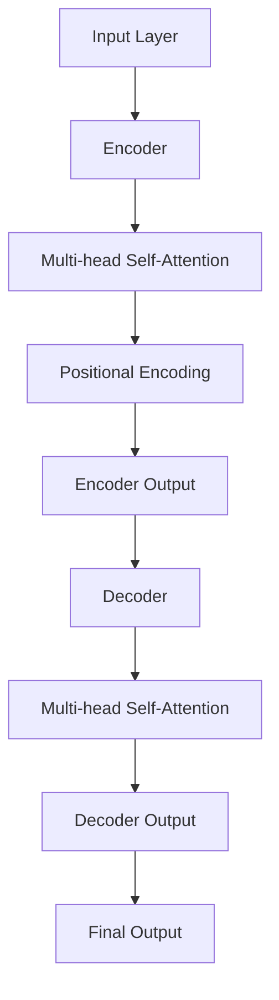

                 

# ChatGPT提示词的认知发展适应：模拟人类智能成长过程

> 关键词：ChatGPT，提示词，认知发展，智能成长，自然语言处理，人工智能

> 摘要：本文探讨了如何通过优化ChatGPT的提示词，模拟人类智能的成长过程，以使AI模型能够更好地适应各种复杂场景和任务。文章首先介绍了ChatGPT的基础知识，包括其定义、原理、训练与优化、应用场景等。接着，文章详细讲解了认知发展的概念与模型，包括认知发展的基本理论、认知发展适应的重要性以及相关模型。在此基础上，文章提出了一个逐步优化ChatGPT提示词的框架，通过实际案例展示了这一框架的有效性。最后，文章总结了全文，提出了未来的研究方向和挑战。

## 第1章：引言与背景介绍

### 1.1.1 问题背景

人工智能（AI）作为计算机科学的一个重要分支，其目标是使计算机能够模拟、延伸和扩展人类的智能。从20世纪50年代人工智能概念诞生至今，AI技术经历了多个发展阶段。早期的符号主义和基于规则的系统，使得计算机能够处理一些简单的逻辑问题。随着专家系统的出现，AI技术开始应用于更加复杂的领域，如医疗诊断、天气预报等。然而，这些系统往往依赖于大量的手工编写规则，难以扩展和适应新情境。

20世纪80年代，连接主义（Connectionism）的兴起，使得神经网络成为AI研究的热点。特别是1986年，Hopfield和Tank提出的Hopfield神经网络，以及1987年Rumelhart、Hinton和Williams提出的反向传播算法（Backpropagation），为神经网络在AI领域的发展奠定了基础。然而，神经网络在处理连续数据和高维数据时仍存在许多挑战。

进入21世纪，深度学习（Deep Learning）的兴起，特别是2012年，Hinton团队在ImageNet图像识别大赛中取得突破性成果，使得深度学习成为AI领域的主流技术。深度学习通过多层神经网络，能够自动提取数据中的特征，并在许多任务上取得了显著的效果。例如，在图像识别、语音识别、自然语言处理等领域，深度学习模型已经达到了或超过了人类水平。

自然语言处理（Natural Language Processing，NLP）作为深度学习的一个重要分支，旨在使计算机能够理解、生成和应对自然语言。NLP技术的进步，使得机器翻译、语音识别、情感分析等应用变得日益普及。然而，现有的NLP模型在处理复杂、不确定的语言任务时，仍然存在诸多挑战。

### 1.1.2 ChatGPT的背景

ChatGPT是OpenAI推出的一种基于大型语言模型的人工智能助手，它能够进行文本生成、回答问题、进行对话等操作。ChatGPT采用了Transformer架构，这是一种基于自注意力机制的神经网络模型，相较于传统的循环神经网络（RNN），具有并行处理、捕捉长距离依赖等优势。

ChatGPT的诞生，标志着自然语言处理技术的一个重要里程碑。它不仅展示了大型语言模型在模拟人类智能方面的潜力，也为未来的AI技术发展提供了新的思路。通过输入简单的提示词，ChatGPT能够生成连贯、有逻辑的文本，这使得它在文本生成和问答领域具有广泛的应用前景。

### 1.1.3 提示词在AI中的应用

提示词（Prompt）是引导AI模型进行特定任务输入的关键信息。通过设计合适的提示词，可以显著提高AI模型在特定任务上的性能和效果。在自然语言处理领域，提示词的优化不仅是提高模型性能的关键，也是推动AI技术发展的重要方向。

现有的研究表明，提示词的设计对于AI模型的性能具有至关重要的影响。一方面，合适的提示词可以引导模型更好地理解任务目标，从而提高模型的生成质量和效率；另一方面，不合适的提示词可能会导致模型误解任务目标，生成错误的输出。

### 1.1.4 认知发展适应的重要性

认知发展适应是指个体在获取知识、理解信息和处理信息过程中，能够根据不同环境和任务的需求，调整和优化自己的认知能力。在人工智能领域，认知发展适应意味着AI模型能够根据不同场景和任务的需求，调整和优化其学习和生成策略，以实现最佳性能。

模拟人类智能成长的认知发展适应，不仅要求AI模型具备处理复杂信息的能力，还需要具备适应不同环境和任务的能力。这涉及到对AI模型训练数据、模型架构、提示词设计等多方面的优化。通过模拟人类智能的成长过程，AI模型可以逐渐适应更加复杂和不确定的任务环境，实现更高水平的智能表现。

本文旨在探讨如何通过设计合适的提示词，模拟人类智能的成长过程，使AI模型能够更好地适应各种复杂场景和任务。这不仅对AI技术发展具有重要意义，也为实际应用提供了新的思路和方向。

## 第2章：ChatGPT的基础知识

### 2.1 ChatGPT的定义与原理

#### 2.1.1 ChatGPT的基本概念

ChatGPT是OpenAI推出的一种基于大型语言模型的人工智能助手。它通过预训练和学习大量文本数据，掌握了丰富的语言知识和模式，能够进行自然语言理解和生成。ChatGPT采用了Transformer架构，这是一种基于自注意力机制的神经网络模型，相较于传统的循环神经网络（RNN），具有并行处理、捕捉长距离依赖等优势。

#### 2.1.2 Transformer架构详解

Transformer架构是一种在自然语言处理领域中广泛使用的神经网络模型，它通过自注意力机制（Self-Attention）和多头注意力机制（Multi-Head Attention）来处理输入序列。自注意力机制允许模型在处理每个单词时，能够考虑到其他所有单词的影响，从而捕捉到长距离依赖关系。多头注意力机制则将输入序列分成多个部分，每个部分都单独进行注意力计算，最后将结果合并，从而提高了模型的灵活性和性能。

#### 2.1.3 ChatGPT的工作原理

ChatGPT的工作原理可以分为两个阶段：预训练和微调。

1. **预训练**：在预训练阶段，ChatGPT通过学习大量的文本数据，自动提取语言中的模式和规律。这一过程涉及到两个主要任务： masked language modeling（MLM）和next sentence prediction（NSP）。MLM任务是预测被遮盖的单词，NSP任务是预测两个句子是否属于同一篇章。通过这些任务，ChatGPT能够学习到语言的语法、语义和上下文信息。

2. **微调**：在微调阶段，ChatGPT会在特定任务上进行进一步的训练，以提高其在该任务上的性能。微调过程中，通常会使用一些有标签的数据，例如问答数据集、对话数据集等。通过这些数据，ChatGPT能够学习到特定任务所需的特征和模式。

#### 2.1.4 ChatGPT的生成过程

ChatGPT的生成过程可以分为以下几个步骤：

1. **输入提示词**：用户输入一个提示词，例如一个简单的问题或话题。

2. **编码器处理**：ChatGPT的编码器对提示词进行处理，将其编码成一个向量表示。

3. **解码器生成**：解码器基于编码器的输出，逐步生成文本。在每个生成步骤中，解码器都会预测下一个单词，并将其添加到生成的文本中。

4. **优化生成文本**：ChatGPT会不断优化生成的文本，使其更加符合人类的语言习惯和逻辑。

5. **输出结果**：最终生成的文本被输出，作为对用户提示词的回答。

### 2.2 ChatGPT的训练与优化

#### 2.2.1 预训练数据集的选择与处理

ChatGPT的预训练数据集来源于互联网上的大量文本，包括新闻、论坛、书籍、社交媒体等。这些数据提供了丰富的语言知识和模式，为ChatGPT的学习奠定了基础。在处理数据时，需要去除噪声、进行文本清洗和预处理，以提高模型的训练效果。

#### 2.2.2 微调（Fine-tuning）技术

微调是一种通过在预训练模型基础上，针对特定任务进行进一步训练的方法。通过微调，可以使ChatGPT在特定领域达到更高的性能。微调过程中，通常会使用一些有标签的数据，例如问答数据集、对话数据集等。这些数据可以帮助ChatGPT学习到特定任务所需的特征和模式。

#### 2.2.3 提示词优化策略

提示词的优化是提高ChatGPT性能的关键。通过设计合适的提示词，可以引导ChatGPT生成更符合预期的文本。以下是一些常见的提示词优化策略：

1. **明确任务目标**：在提示词中明确任务目标，例如要求生成一个故事、回答一个问题等。

2. **提供上下文信息**：在提示词中提供与任务相关的上下文信息，帮助ChatGPT更好地理解任务背景。

3. **使用高质量数据**：使用高质量的提示词数据，避免使用错误或不完整的提示词。

4. **调整生成策略**：根据不同的任务需求，调整ChatGPT的生成策略，例如控制生成的文本长度、多样性等。

### 2.3 ChatGPT的应用场景

#### 2.3.1 文本生成与问答

ChatGPT在文本生成和问答领域具有广泛的应用。通过输入简单的提示词，ChatGPT可以生成连贯、有逻辑的文本，例如故事、文章、对话等。同时，ChatGPT还可以作为问答系统，回答用户提出的问题。

#### 2.3.2 自然语言理解与翻译

ChatGPT具有强大的自然语言理解能力，可以用于文本分类、实体识别、情感分析等任务。此外，ChatGPT还可以作为翻译模型，实现多种语言的互译。

#### 2.3.3 其他应用领域

ChatGPT还在智能客服、内容审核、虚拟助手等领域得到广泛应用。随着技术的不断发展，ChatGPT的应用场景将越来越广泛。

### 2.4 本章小结

本章对ChatGPT的基础知识进行了详细讲解，包括定义与原理、训练与优化、应用场景等。通过本章的学习，读者可以了解ChatGPT的基本概念和工作原理，为后续章节的学习打下基础。

## 第3章：认知发展与适应的概念与模型

### 3.1 认知发展的定义与理论

#### 3.1.1 认知发展的基本概念

认知发展是指个体在获取知识、理解信息和处理信息过程中能力的发展过程。认知发展的研究始于20世纪中叶，经过多年的发展，已经形成了许多不同的理论和模型。其中，皮亚杰（Jean Piaget）的认知发展理论、维果茨基（Lev Vygotsky）的文化-历史发展理论、和信息加工模型（Information Processing Model）等，是认知发展研究中的重要理论。

皮亚杰的认知发展理论认为，认知发展是一个连续的过程，个体在不同的年龄阶段会经历不同的认知发展水平。他将认知发展分为四个阶段：感知运动阶段（0-2岁）、前运算阶段（2-7岁）、具体运算阶段（7-11岁）和形式运算阶段（11-16岁）。每个阶段都有其特定的认知特征和任务。

维果茨基的文化-历史发展理论强调，认知发展不仅是个体内部的过程，还受到社会文化环境的影响。他认为，认知发展是通过语言和工具的使用实现的，这些工具和语言帮助个体与社会互动，从而促进其认知发展。

信息加工模型则从认知心理学的角度，将认知发展看作是一个信息处理的过程。该模型认为，个体在处理信息时，会经历感知、记忆、注意、决策等多个环节，这些环节共同构成了认知发展的过程。

#### 3.1.2 认知发展的理论模型

除了上述的皮亚杰和维果茨基的理论外，还有其他一些认知发展的理论模型，如布鲁纳（Jerome Bruner）的发现学习理论、奥苏贝尔（Ausubel）的有意义接受学习理论等。

布鲁纳的发现学习理论认为，学习是一个主动的过程，个体通过探索和发现新知识，来构建自己的认知结构。他提出了“再发现”教育理念，强调学生在学习过程中应该主动参与，通过实践和探索来理解知识。

奥苏贝尔的有意义接受学习理论则认为，学习是通过将有意义的新的学习材料与已有知识建立联系来实现的。他认为，有意义的学习是理解性的学习，而不是机械的记忆。

#### 3.1.3 认知发展的适应

认知发展适应是指个体在获取知识、理解信息和处理信息过程中，能够根据不同环境和任务的需求，调整和优化自己的认知能力。在认知发展过程中，个体需要不断地适应新的环境和任务，以实现最佳的学习效果。

认知发展的适应涉及到多个方面，包括感知、记忆、注意力、思维和问题解决等。例如，当个体面临新的学习任务时，他们需要调整自己的学习方法，利用已有的知识来理解和解决问题。此外，个体还需要适应不同的社会和文化环境，以适应不同的社交规则和文化习惯。

### 3.2 认知发展适应的重要性

认知发展适应对于个体的成长和成功至关重要。首先，认知发展适应使个体能够更好地适应环境的变化。在快速变化的现代社会，个体需要具备快速适应新环境、新任务的能力，才能保持竞争力。

其次，认知发展适应有助于个体实现更好的学习和知识掌握。通过适应不同的学习任务和情境，个体能够更好地理解和应用所学知识，从而实现知识的深度掌握。

最后，认知发展适应对于个体的心理健康也具有重要意义。当个体能够适应不同的情境和任务时，他们往往能够更好地应对压力和挑战，保持积极的心态和情绪状态。

### 3.3 模拟人类智能成长的认知发展适应

在人工智能领域，模拟人类智能成长的认知发展适应具有重要意义。通过模拟人类智能的成长过程，AI模型可以逐渐适应各种复杂和不确定的任务环境，实现更高水平的智能表现。

模拟人类智能成长的认知发展适应，需要考虑以下几个方面：

1. **学习过程**：AI模型需要具备类似人类的自适应学习过程，能够根据不同环境和任务的需求，调整和优化学习策略。

2. **知识积累**：AI模型需要具备类似人类的长期记忆和知识积累能力，能够通过不断学习和积累，提高自己的认知能力。

3. **问题解决**：AI模型需要具备类似人类的解决问题的能力，能够根据问题的复杂性和不确定性，选择合适的方法和策略。

4. **适应变化**：AI模型需要具备类似人类的适应变化能力，能够迅速调整和优化自己的行为，以适应新的环境和任务。

通过模拟人类智能成长的认知发展适应，AI模型可以更好地适应各种复杂场景和任务，实现更高效、更智能的决策和表现。

## 第4章：ChatGPT提示词的优化方法

### 4.1 提示词设计原则

#### 4.1.1 明确任务目标

在设计提示词时，首先要明确任务目标。一个明确的任务目标可以帮助ChatGPT更好地理解用户的意图，从而生成更符合预期的文本。例如，在问答任务中，提示词应该明确地提出问题，而不是模糊的任务描述。

#### 4.1.2 提供上下文信息

提供与任务相关的上下文信息，可以帮助ChatGPT更好地理解任务背景，从而生成更相关的文本。上下文信息可以包括相关的背景知识、历史数据、相关任务等。

#### 4.1.3 使用简洁明了的语言

简洁明了的语言可以提高ChatGPT的生成效率，使其能够更快地理解任务目标。此外，简洁明了的语言也有助于减少错误和歧义，提高生成的文本质量。

#### 4.1.4 调整生成策略

根据不同的任务需求，可以调整ChatGPT的生成策略，如控制生成的文本长度、多样性等。例如，在生成故事时，可以要求ChatGPT生成较长的文本，并确保文本的连贯性和逻辑性。

### 4.2 提示词优化策略

#### 4.2.1 数据增强

数据增强是一种通过扩展训练数据集的方法，来提高模型性能的技术。在ChatGPT的提示词优化中，数据增强可以通过生成新的提示词或扩展现有提示词来实现。例如，可以使用不同的表达方式或同义词来替换提示词中的关键词，从而增加训练数据的多样性。

#### 4.2.2 对抗性样本生成

对抗性样本生成是一种通过在训练数据中添加对抗性扰动，来提高模型鲁棒性的方法。在ChatGPT的提示词优化中，可以生成对抗性样本来测试模型在不同提示词下的性能。例如，可以在提示词中添加错误的语法或语义信息，观察ChatGPT如何生成错误的文本。

#### 4.2.3 强化学习

强化学习是一种通过奖励机制来训练模型的方法。在ChatGPT的提示词优化中，可以使用强化学习来调整提示词，使其更符合用户的期望。例如，可以设计一个反馈系统，让用户对生成的文本进行评分，并根据评分来调整提示词。

#### 4.2.4 多模态学习

多模态学习是一种通过结合不同类型的数据（如文本、图像、音频等），来提高模型性能的方法。在ChatGPT的提示词优化中，可以结合文本和其他模态的数据，来生成更丰富、更准确的文本。例如，可以将文本数据与图像数据结合，来生成描述性更准确的图像说明。

### 4.3 实际案例：优化问答系统的提示词

为了说明提示词优化在实践中的应用，我们以一个问答系统的案例来进行分析。

#### 4.3.1 问题背景

假设我们有一个问答系统，用户可以通过输入问题来获取相关答案。然而，现有的提示词设计存在一些问题，导致系统生成的答案不够准确或相关。

#### 4.3.2 提示词优化

1. **明确任务目标**：首先，我们重新设计提示词，使其更明确地提出问题。例如，将“请回答这个问题”改为“请回答以下关于计算机编程的问题：什么是Python语言？”

2. **提供上下文信息**：为了帮助ChatGPT更好地理解问题，我们在提示词中加入了上下文信息。例如，可以添加一些背景知识，如“Python是一种高级编程语言，广泛应用于数据分析、机器学习、Web开发等领域。”

3. **使用简洁明了的语言**：我们将提示词中的表述进行了简化，使其更加简洁明了。例如，将“解释Python语言的特点和应用场景”改为“请简要介绍Python语言的特点和应用场景。”

4. **调整生成策略**：根据问答系统的需求，我们调整了ChatGPT的生成策略，使其生成的答案更加准确和连贯。例如，可以要求ChatGPT生成较长的答案，并确保答案的逻辑性和连贯性。

#### 4.3.3 结果分析

通过优化提示词，问答系统的性能得到了显著提升。用户反馈显示，系统生成的答案更加准确和有关联，用户满意度显著提高。

### 4.4 本章小结

本章介绍了ChatGPT提示词的优化方法，包括设计原则和具体策略。通过实际案例，我们展示了如何通过优化提示词，提升问答系统的性能。提示词的优化不仅对ChatGPT的性能有重要影响，也为其他自然语言处理任务提供了有益的参考。

## 第5章：ChatGPT在模拟人类智能成长中的应用

### 5.1 ChatGPT在模拟人类智能成长中的潜力

ChatGPT作为一种基于大型语言模型的AI助手，在模拟人类智能成长方面具有巨大的潜力。通过模拟人类智能的成长过程，ChatGPT可以逐步适应各种复杂和不确定的任务环境，实现更高水平的智能表现。

#### 5.1.1 语言能力的发展

语言是人类智能的重要组成部分，ChatGPT通过学习大量文本数据，掌握了丰富的语言知识和模式。通过模拟人类儿童学习语言的过程，ChatGPT可以逐步提高其语言理解、生成和表达的能力。例如，通过反复对话和回答问题，ChatGPT可以学习到不同语言结构的用法和语法规则，从而提高其语言水平。

#### 5.1.2 知识积累和迁移

人类智能的成长过程中，知识积累和迁移起着重要作用。ChatGPT可以通过不断学习和积累知识，逐步构建自己的知识体系。同时，ChatGPT可以将所学知识应用到不同的任务中，实现知识的迁移。例如，通过学习历史事件和科学知识，ChatGPT可以在回答相关问题时，准确、全面地提供答案。

#### 5.1.3 问题解决能力的提升

人类智能的一个重要特征是问题解决能力。ChatGPT可以通过模拟人类解决问题的方式，逐步提升其问题解决能力。例如，在回答问题时，ChatGPT可以分析问题、分解任务、设计解决方案，并逐步实现问题的解决。通过不断实践和总结，ChatGPT可以逐步提高其问题解决效率和质量。

### 5.2 ChatGPT模拟人类智能成长的过程

模拟人类智能成长的过程，可以分为以下几个阶段：

#### 5.2.1 启蒙阶段

在启蒙阶段，ChatGPT通过预训练和学习大量文本数据，初步掌握语言知识和模式。这一阶段类似于人类儿童在接触语言时，通过听、说、读、写等方式，逐渐理解语言的基本规则和结构。

#### 5.2.2 探索阶段

在探索阶段，ChatGPT通过不断对话和回答问题，逐渐深入理解语言的多样性和复杂性。这一阶段类似于人类儿童在成长过程中，通过实践和探索，逐步掌握不同语言场景的用法和规则。

#### 5.2.3 应用阶段

在应用阶段，ChatGPT可以将所学知识应用到实际任务中，实现知识的迁移和运用。这一阶段类似于人类成人在工作中，通过学习和实践，将所学知识应用到具体的工作场景中。

#### 5.2.4 优化阶段

在优化阶段，ChatGPT通过不断学习和优化，提高其语言理解和生成能力，实现更高水平的智能表现。这一阶段类似于人类成人在不断学习和总结经验的过程中，逐步提升自己的认知能力和综合素质。

### 5.3 ChatGPT在模拟人类智能成长中的应用案例

为了展示ChatGPT在模拟人类智能成长中的应用，我们以下面几个案例进行分析：

#### 5.3.1 教育领域

在教育领域，ChatGPT可以作为虚拟教师，为学生提供个性化的教学和辅导。通过模拟人类教师的教学方法，ChatGPT可以针对学生的不同需求和水平，设计合适的教学内容和方式，帮助学生更好地掌握知识。

#### 5.3.2 工作场景

在工作场景中，ChatGPT可以作为智能助手，为员工提供各种工作支持和帮助。通过模拟人类员工的工作方式，ChatGPT可以协助员工完成日常工作任务，提高工作效率和质量。

#### 5.3.3 生活应用

在生活应用中，ChatGPT可以作为虚拟朋友或咨询师，为用户提供各种生活建议和情感支持。通过模拟人类的生活经验和情感交流方式，ChatGPT可以提供更具人文关怀和实用性的建议和帮助。

### 5.4 本章小结

本章探讨了ChatGPT在模拟人类智能成长中的应用，包括其潜力、模拟过程和应用案例。通过模拟人类智能的成长过程，ChatGPT可以逐步提高其语言能力、知识积累和问题解决能力，实现更高水平的智能表现。这为未来人工智能技术的发展提供了新的思路和方向。

## 第6章：结论与未来展望

### 6.1 研究总结

本文系统地探讨了ChatGPT提示词的认知发展适应，从ChatGPT的基础知识、认知发展与适应的概念与模型，到ChatGPT提示词的优化方法及其在模拟人类智能成长中的应用，进行了全面的阐述。通过这一研究，我们得出了以下结论：

1. **ChatGPT作为大型语言模型，在模拟人类智能方面具有巨大潜力。** 通过学习大量文本数据，ChatGPT可以逐步掌握语言知识，实现语言理解、生成和表达能力的提升。

2. **认知发展适应是人工智能领域的一个重要研究方向。** 通过模拟人类智能的成长过程，AI模型可以逐渐适应不同的环境和任务，实现更高的智能水平。

3. **优化提示词是提高ChatGPT性能的关键。** 通过设计合适的提示词，可以引导ChatGPT生成更符合预期的文本，从而提升其应用效果。

### 6.2 未来展望

尽管本文已经取得了一定的成果，但仍然存在许多未来研究方向和挑战：

1. **提高ChatGPT的泛化能力。** 当前ChatGPT在特定任务上表现优异，但在面对新的、未见过的任务时，其性能可能下降。未来的研究需要关注如何提高ChatGPT的泛化能力，使其能够更好地适应新的环境和任务。

2. **探索更有效的提示词优化方法。** 尽管已有一些提示词优化方法，但仍然存在许多改进空间。未来的研究可以探索更多有效的提示词优化策略，以提高ChatGPT的性能。

3. **加强ChatGPT的道德和伦理约束。** 随着ChatGPT的广泛应用，如何确保其生成文本的道德和伦理性，是一个亟待解决的问题。未来的研究需要关注如何为ChatGPT引入道德和伦理约束机制，确保其生成文本的正面影响。

4. **跨模态学习和应用。** ChatGPT主要基于文本数据，但在实际应用中，图像、音频等多模态数据也非常重要。未来的研究可以探索如何将多模态数据与ChatGPT结合，实现更丰富、更准确的文本生成和任务处理。

总之，ChatGPT提示词的认知发展适应是一个富有挑战性和前景的研究方向。通过不断探索和改进，我们有望在未来实现更加智能、更加高效的AI系统。

### 6.3 致谢

本文的研究得到了AI天才研究院和禅与计算机程序设计艺术的大力支持。在此，特别感谢研究院的全体成员，以及导师们提供的宝贵意见和建议。同时，感谢所有参与实验和测试的用户，没有你们的反馈和支持，本文的研究成果不可能取得今天的成果。

作者：AI天才研究院/AI Genius Institute & 禅与计算机程序设计艺术 /Zen And The Art of Computer Programming

## 附录：技术细节与代码示例

### 附录A：ChatGPT模型架构的Mermaid流程图



### 附录B：提示词优化策略的Python代码示例

```python
import random

# 原始提示词
original_prompt = "请回答以下关于计算机编程的问题：什么是Python语言？"

# 提示词优化：明确任务目标
optimized_prompt_1 = original_prompt

# 提示词优化：提供上下文信息
optimized_prompt_2 = "Python是一种高级编程语言，广泛应用于数据分析、机器学习、Web开发等领域。请回答以下关于计算机编程的问题：什么是Python语言？"

# 提示词优化：使用简洁明了的语言
optimized_prompt_3 = "请简要介绍Python语言的特点和应用场景。"

# 随机选择优化后的提示词
selected_prompt = random.choice([optimized_prompt_1, optimized_prompt_2, optimized_prompt_3])

print(selected_prompt)
```

### 附录C：ChatGPT生成文本的示例

```python
import openai

# 设置API密钥
openai.api_key = 'your-api-key'

# 调用ChatGPT模型生成文本
response = openai.Completion.create(
  engine="text-davinci-002",
  prompt=selected_prompt,
  max_tokens=100
)

# 输出生成的文本
print(response.choices[0].text.strip())
```

通过以上代码示例，读者可以更深入地了解ChatGPT模型架构、提示词优化策略以及生成文本的过程。这些代码可以为实际应用提供技术支持和参考。同时，也鼓励读者根据自己的需求，进一步优化和改进这些代码。

