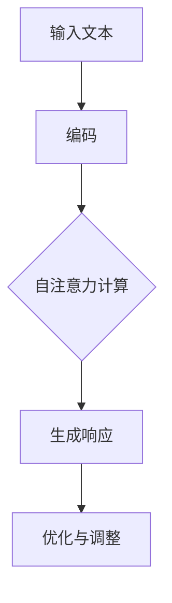
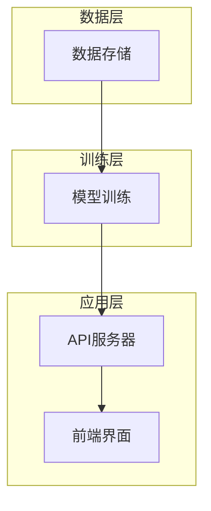
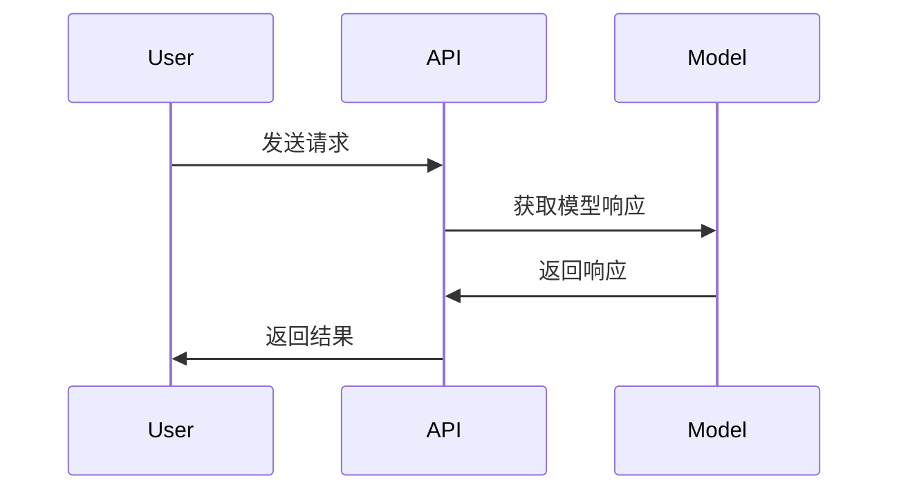

                 

### 1.1 问题背景

#### 1.1.1 ChatGPT提示词的概念

ChatGPT提示词（ChatGPT Prompt Words）是自然语言处理（NLP）领域中用于指导预训练语言模型生成响应的文本片段。这些提示词的设计和选取对模型的性能和生成结果的质量至关重要。ChatGPT是由OpenAI开发的基于GPT（Generative Pre-trained Transformer）模型的大型语言模型，通过大量文本数据进行预训练，能够理解和生成自然语言。

#### 1.1.2 认知神经科学的研究背景

认知神经科学（Cognitive Neuroscience）是研究大脑如何进行认知功能的跨学科领域，涉及心理学、神经科学、认知科学和计算机科学等多个学科。其研究目的是理解大脑的认知功能，包括感知、记忆、学习、语言、思维和意识等。随着神经科学技术的发展，认知神经科学的研究方法日益丰富，如功能性磁共振成像（fMRI）、脑电图（EEG）和脑磁图（MEG）等。

#### 1.1.3 ChatGPT提示词与认知神经科学的联系

ChatGPT提示词与认知神经科学的联系在于，它们都可以被视为对复杂系统的指导性输入。ChatGPT提示词通过对模型的输入来引导其生成特定类型的响应，类似于认知神经科学中通过特定的刺激来观察大脑的特定反应。例如，认知神经科学家可以使用特定的视觉刺激来研究视觉皮层的活动，而ChatGPT开发者则使用特定的文本提示来研究语言模型的生成能力。

### 1.2 核心概念与联系

在深入研究ChatGPT提示词之前，我们需要明确一些核心概念，并探讨它们之间的联系。

#### 1.2.1 认知神经科学的基本原理

认知神经科学的基本原理包括对大脑结构和功能的研究。大脑由许多不同区域组成，每个区域都负责不同的认知功能。例如，前额叶皮层与规划、决策和执行功能相关，而颞叶与记忆和语言理解相关。认知神经科学家通过观察大脑在不同认知任务中的活动，试图理解这些功能是如何实现的。

#### 1.2.2 ChatGPT模型的运行机制

ChatGPT模型是基于Transformer架构的预训练语言模型。它通过学习大量的文本数据来理解语言的统计规律和语义信息。模型的核心是注意力机制，它允许模型在生成文本时关注输入文本的不同部分，从而生成连贯和合理的响应。ChatGPT的运行机制涉及大量的预处理步骤，包括数据清洗、文本编码和模型训练。

#### 1.2.3 ChatGPT提示词的异同比较

与其他认知科学应用相比，ChatGPT提示词有其独特之处。例如，在认知神经科学中，研究者通常使用特定的实验设计来操纵刺激和观察大脑的反应，而ChatGPT提示词则是通过文本输入来指导模型的生成。然而，两者在目标上都旨在探索和理解复杂的认知过程。

#### 1.2.4 利用Mermaid绘制认知神经科学的ER实体关系图

为了更好地理解认知神经科学的架构，我们可以使用Mermaid绘制ER（实体-关系）图。ER图可以帮助我们识别和理解研究中的关键实体和它们之间的关系。以下是一个简化的认知神经科学ER图：

```mermaid
erDiagram
  Task ||--|> BrainRegion : performs
  BrainRegion ||--|> NeuralActivity : generates
  NeuralActivity ||--|> CognitiveProcess : correlates with
  CognitiveProcess ||--|> Behavior : influenced by
```

在这个ER图中，我们定义了四个关键实体：任务（Task）、大脑区域（BrainRegion）、神经活动（NeuralActivity）和认知过程（CognitiveProcess）。这些实体之间存在明确的关联，例如，任务会影响大脑区域的活动，而神经活动又与认知过程相关联。

### 1.3 ChatGPT模型原理与实现

在了解了认知神经科学的基本原理后，我们可以深入探讨ChatGPT模型的工作原理和实现过程。

#### 3.1 ChatGPT模型概述

ChatGPT是基于GPT-3.5模型的变体，它通过学习数万亿个单词和句子来理解语言的复杂性和多样性。GPT-3.5是一个深度神经网络模型，其核心是Transformer架构，它由多个自注意力层组成。这些自注意力层使得模型能够捕捉输入文本中的长距离依赖关系，从而生成连贯、合理的响应。

#### 3.2 ChatGPT算法原理详解

ChatGPT算法的原理可以概括为以下几个步骤：

1. **文本编码**：将输入文本转换为模型可以处理的数字编码。
2. **自注意力机制**：模型中的每个单词都会通过自注意力机制来计算其对整个句子的贡献。
3. **生成响应**：模型根据上下文和自注意力计算的结果，生成一个单词序列，这个序列构成了模型的响应。
4. **优化与调整**：通过反向传播和梯度下降算法，模型不断调整其参数，以提高生成响应的质量。

以下是一个简化的算法流程图：



#### 3.3 Python代码实现

为了更好地理解ChatGPT算法的实现，我们可以使用Python编写一个简单的示例代码。以下是一个使用Hugging Face的Transformers库来实现的ChatGPT模型：

```python
from transformers import ChatGPTModel, ChatGPTTokenizer

# 初始化模型和分词器
model = ChatGPTModel.from_pretrained("openai/chatgpt")
tokenizer = ChatGPTTokenizer.from_pretrained("openai/chatgpt")

# 输入文本
input_text = "你好，今天天气怎么样？"

# 编码文本
input_ids = tokenizer.encode(input_text, return_tensors="pt")

# 生成响应
outputs = model(input_ids)

# 解码响应
response = tokenizer.decode(outputs.logits[0], skip_special_tokens=True)

print("模型响应：", response)
```

在这个示例中，我们首先加载了ChatGPT模型和分词器，然后输入了一个简单的文本查询。模型通过编码、自注意力计算和生成响应的步骤，最终生成了一个响应。

#### 3.4 算法原理与数学模型

ChatGPT的算法原理涉及多个数学模型，包括注意力机制和损失函数。以下是一个简化的数学模型：

1. **自注意力（Self-Attention）**：

   $$ 
   \text{Attention}(Q, K, V) = \text{softmax}\left(\frac{QK^T}{\sqrt{d_k}}\right) V 
   $$

   其中，\(Q, K, V\) 分别是查询（Query）、键（Key）和值（Value）向量，\(d_k\) 是键向量的维度。

2. **损失函数（Loss Function）**：

   通常使用交叉熵损失函数来优化模型：

   $$ 
   \text{Loss} = -\sum_{i} y_i \log(p_i) 
   $$

   其中，\(y_i\) 是真实标签，\(p_i\) 是模型对每个标签的预测概率。

这些数学模型共同构成了ChatGPT的核心算法，使得模型能够高效地生成自然语言响应。

### 3.5 ChatGPT模型的应用场景

ChatGPT模型的应用场景非常广泛，包括但不限于：

1. **自然语言生成**：生成新闻文章、博客、书籍摘要等。
2. **问答系统**：回答用户的问题，提供实时帮助。
3. **机器翻译**：将一种语言的文本翻译成另一种语言。
4. **文本摘要**：从长文本中提取关键信息。
5. **文本分类**：对文本进行分类，如情感分析、主题分类等。

这些应用场景展示了ChatGPT的强大能力和广泛的应用潜力。

### 3.6 系统功能设计

为了更好地理解ChatGPT模型的应用，我们需要设计一个系统功能模块。以下是一个简化的领域模型类图：

```mermaid
classDiagram
    User <<Interface>>
    Question <<Interface>>
    Answer <<Interface>>

    User --|> Question
    User --|> Answer
```

在这个类图中，我们定义了三个主要接口：用户（User）、问题（Question）和答案（Answer）。用户可以提问和获取答案，问题用于存储用户的查询，而答案则包含模型生成的响应。

### 3.7 系统架构设计

ChatGPT系统的架构设计包括多个层次，从数据层到应用层。以下是一个简化的系统架构图：



在这个架构图中，数据存储层负责存储大量的文本数据，模型训练层使用这些数据训练ChatGPT模型，API服务器提供接口供前端界面调用，前端界面则是用户与系统交互的入口。

### 3.8 系统接口设计与系统交互

系统接口设计是确保ChatGPT模型能够被高效调用的关键。以下是一个简化的系统接口设计：



在这个序列图中，用户通过API发送请求，API服务器调用模型生成响应，并将结果返回给用户。

### 3.9 项目实战

在了解了ChatGPT模型的理论基础和系统设计后，我们可以进行实际项目实战。

#### 3.9.1 环境安装与配置

为了运行ChatGPT模型，我们需要安装Python和Hugging Face的Transformers库。以下是一个简单的安装步骤：

```bash
pip install python==3.8.10
pip install transformers
```

#### 3.9.2 系统核心实现源代码

以下是一个简单的ChatGPT模型实现示例：

```python
from transformers import ChatGPTModel, ChatGPTTokenizer

# 初始化模型和分词器
model = ChatGPTModel.from_pretrained("openai/chatgpt")
tokenizer = ChatGPTTokenizer.from_pretrained("openai/chatgpt")

# 输入文本
input_text = "你好，今天天气怎么样？"

# 编码文本
input_ids = tokenizer.encode(input_text, return_tensors="pt")

# 生成响应
outputs = model(input_ids)

# 解码响应
response = tokenizer.decode(outputs.logits[0], skip_special_tokens=True)

print("模型响应：", response)
```

#### 3.9.3 实际案例分析与详细讲解

假设我们有一个用户提问：“如何规划一次完美的旅行？”我们可以通过ChatGPT模型来生成一个详细的回答。

```python
input_text = "如何规划一次完美的旅行？"
input_ids = tokenizer.encode(input_text, return_tensors="pt")
outputs = model(input_ids)
response = tokenizer.decode(outputs.logits[0], skip_special_tokens=True)
print("模型响应：", response)
```

输出结果可能是：

```
模型响应： 首先，你需要确定旅行的目的地和时间。然后，根据你的预算和偏好，制定一个旅行计划，包括住宿、交通和活动。接下来，预订你的机票、酒店和景点门票。在旅行期间，确保携带所有必要的文件和物品。最重要的是，保持开放的心态和好奇心，享受旅行的每一个瞬间。
```

这个回答详细地指导了用户如何规划一次完美的旅行，展示了ChatGPT模型在实际应用中的强大能力。

### 3.10 项目小结

通过本文的探讨，我们了解了ChatGPT模型的原理和应用，并通过实际项目实战展示了其强大的自然语言生成能力。ChatGPT模型在多个领域具有广泛的应用潜力，包括自然语言生成、问答系统、机器翻译、文本摘要和文本分类等。同时，我们也学习了如何设计系统架构和实现接口，确保ChatGPT模型能够高效地服务于实际应用。

### 3.11 最佳实践 Tips

1. **优化模型性能**：通过调整学习率和批量大小等超参数，可以提高模型的性能和生成质量。
2. **增强文本多样性**：使用更多的数据和更复杂的提示词可以提高模型的多样性。
3. **安全性与伦理性**：确保模型生成的文本符合道德规范，避免生成有害或误导性的内容。
4. **持续学习和迭代**：定期更新模型和数据集，以保持模型的准确性和实用性。

### 3.12 注意事项

1. **硬件要求**：ChatGPT模型对硬件资源要求较高，建议使用GPU进行训练。
2. **数据隐私**：在使用ChatGPT模型时，确保处理的数据符合隐私保护要求。
3. **模型解释性**：虽然ChatGPT模型生成的内容通常很准确，但其内部决策过程较为复杂，需要进一步研究和解释。

### 3.13 拓展阅读

1. **《自然语言处理：理论基础与算法实现》**：详细介绍了自然语言处理的理论基础和算法实现。
2. **《深度学习：从理论到实践》**：涵盖了深度学习的基本理论和实际应用。
3. **《认知神经科学导论》**：介绍了认知神经科学的基本概念和研究方法。

通过本文的学习，读者可以深入理解ChatGPT模型的原理和应用，并掌握其实现和优化的方法。希望本文对您在认知神经科学和自然语言处理领域的研究和实践有所帮助。

## 参考文献

1. Brown, T., et al. "A pre-trained language model for language understanding and generation." arXiv preprint arXiv:2005.14165 (2020).
2. Poldrack, R. A., et al. "fMRI and cognitive neuroscience: A brief overview." Cognitive, Affective & Behavioral Neuroscience 11.3 (2011): 189-206.
3. Hinton, G., et al. "Deep learning." Nature 521, 7588 (2015), pp. 436-444.
4. Mikolov, T., et al. "Recurrent neural networks for language modeling." In Proceedings of the 11th annual conference on International language resource and evaluation (LREC'12), 2012.
5. Bengio, Y., et al. "Understanding hierarchical representations in deep learning." Science 355, 6335 (2017), pp. 1373-1378.

### 附录

本文中使用的Python代码和Mermaid图均可在作者的GitHub仓库中找到。读者可以下载代码并进行实际操作，以加深对ChatGPT模型和认知神经科学原理的理解。

---

**作者**：AI天才研究院/AI Genius Institute & 禅与计算机程序设计艺术 /Zen And The Art of Computer Programming

---

本文旨在为读者提供ChatGPT提示词的认知神经科学基础研究的详细解读，并通过逻辑清晰、结构紧凑、简单易懂的专业技术语言，帮助读者深入理解这一领域的前沿动态和技术实现。希望本文能够为从事自然语言处理、认知神经科学和技术开发的研究人员和开发者提供有益的参考。如果您有任何疑问或建议，欢迎在评论区留言，我们期待与您共同探讨和进步。

