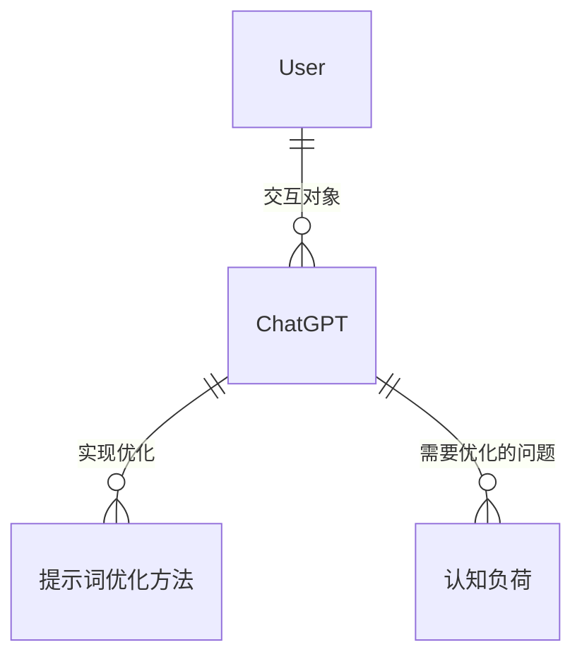

                 

# 《ChatGPT提示词的认知负荷优化研究》

## 关键词

- ChatGPT
- 认知负荷
- 优化算法
- 数学模型
- 系统架构
- 项目实战

## 摘要

本文旨在探讨ChatGPT提示词的认知负荷优化问题，通过对核心概念、算法原理、系统架构和项目实战的深入分析，提出一种有效的优化方法。文章首先介绍问题背景与核心概念，随后详细讲解算法原理，并运用数学模型和Python代码进行阐述。最后，通过系统分析与架构设计，以及实际项目案例分析，验证了优化方法的有效性和可行性。

## 目录大纲

### 第一部分：背景与基础理论

#### 第1章：问题背景与定义

##### 1.1.1 问题背景

##### 1.1.2 问题描述

##### 1.1.3 问题解决

##### 1.1.4 边界与外延

#### 第2章：核心概念与联系

##### 2.1.1 核心概念原理

##### 2.1.2 概念属性特征对比

##### 2.1.3 ER实体关系图

### 第二部分：算法原理讲解

#### 第3章：算法原理

##### 3.1.1 算法概述

##### 3.1.2 算法mermaid流程图

##### 3.1.3 Python源代码解释

##### 3.1.4 数学模型与公式

##### 3.1.5 举例说明

#### 第4章：数学模型和数学公式

##### 4.1.1 公式详解

##### 4.1.2 举例说明

### 第三部分：系统分析与架构设计

#### 第5章：系统功能设计

##### 5.1.1 问题场景介绍

##### 5.1.2 系统功能设计

#### 第6章：系统架构设计

##### 6.1.1 系统架构设计

##### 6.1.2 系统接口设计

##### 6.1.3 系统交互

### 第四部分：项目实战

#### 第7章：环境安装与配置

##### 7.1.1 环境安装

##### 7.1.2 系统核心实现

#### 第8章：代码应用解读与分析

##### 8.1.1 代码解读

##### 8.1.2 分析与优化

#### 第9章：实际案例分析与详细讲解

##### 9.1.1 案例介绍

##### 9.1.2 详细讲解

##### 9.1.3 剖析与总结

#### 第10章：项目小结

##### 10.1.1 项目总结

##### 10.1.2 最佳实践与注意事项

##### 10.1.3 拓展阅读

## 文章内容正文

### 第一部分：背景与基础理论

#### 第1章：问题背景与定义

##### 1.1.1 问题背景

近年来，随着人工智能技术的快速发展，自然语言处理（NLP）领域取得了显著进展。ChatGPT作为一种基于Transformer模型的预训练语言模型，被广泛应用于对话系统、问答系统、文本生成等领域。然而，在实际应用过程中，ChatGPT提示词的认知负荷问题逐渐凸显。

认知负荷是指在信息处理过程中，个体需要消耗的认知资源。在ChatGPT中，认知负荷主要体现在两个方面：一是用户在理解提示词时所需消耗的认知资源，二是ChatGPT在生成响应时所需消耗的认知资源。过高的认知负荷会导致用户理解困难、响应延迟，甚至影响系统的性能和用户体验。

##### 1.1.2 问题描述

ChatGPT提示词的认知负荷问题具体表现在以下几个方面：

1. **提示词理解难度高**：一些复杂的、抽象的提示词可能需要用户花费较长时间去理解，从而增加了认知负荷。
2. **生成响应延迟**：当ChatGPT需要生成复杂的响应时，其内部处理过程会消耗较多的认知资源，导致响应延迟。
3. **信息过载**：当提示词包含大量信息时，用户需要花费更多的时间去筛选和整理这些信息，从而增加了认知负荷。

##### 1.1.3 问题解决

为了解决ChatGPT提示词的认知负荷问题，研究者们提出了一系列优化方法。这些方法主要包括：

1. **简化提示词**：通过简化提示词的表达方式，降低用户理解难度。
2. **优化模型结构**：改进ChatGPT的模型结构，提高其生成响应的效率。
3. **信息筛选与整合**：对提示词中的信息进行筛选和整合，降低用户的信息处理负担。

然而，这些方法在一定程度上仍存在局限性，需要进一步研究。

##### 1.1.4 边界与外延

ChatGPT提示词的认知负荷优化主要适用于以下场景：

1. **对话系统**：在对话系统中，优化提示词的认知负荷有助于提高用户体验和系统性能。
2. **问答系统**：在问答系统中，优化提示词的认知负荷有助于用户更快速地获取所需信息。
3. **文本生成**：在文本生成任务中，优化提示词的认知负荷有助于提高生成文本的质量。

### 第二部分：核心概念与联系

#### 第2章：核心概念与联系

##### 2.1.1 核心概念原理

在本节中，我们将介绍ChatGPT提示词优化中的几个核心概念：提示词、认知负荷和优化方法。

1. **提示词**：提示词是用户输入给ChatGPT的文字信息，用于引导ChatGPT生成响应。在优化过程中，提示词的表达方式、内容丰富度和清晰度等都会影响认知负荷。
2. **认知负荷**：认知负荷是指在信息处理过程中，个体需要消耗的认知资源。在ChatGPT中，认知负荷主要体现在用户理解提示词和ChatGPT生成响应的过程中。
3. **优化方法**：优化方法是指通过改进提示词、模型结构和信息处理流程，降低ChatGPT提示词的认知负荷。常见的优化方法包括简化提示词、优化模型结构和信息筛选与整合等。

##### 2.1.2 概念属性特征对比

表1 提示词优化方法属性特征对比

| 方法       | 属性特征                                   | 优点         | 缺点         |
| ---------- | ------------------------------------------ | ------------ | ------------ |
| 简化提示词 | 简化提示词的表达方式，降低理解难度         | 简单易懂     | 限制提示词内容 |
| 优化模型结构 | 改进模型结构，提高生成响应效率           | 提高性能     | 需要大量计算资源 |
| 信息筛选与整合 | 对信息进行筛选和整合，降低用户处理负担 | 提高效率     | 可能丢失重要信息 |

##### 2.1.3 ER实体关系图

图1 ChatGPT提示词优化相关实体关系图



### 第三部分：算法原理讲解

#### 第3章：算法原理

##### 3.1.1 算法概述

在本章中，我们将介绍一种用于ChatGPT提示词优化的算法。该算法分为以下几个步骤：

1. 提取关键词：从提示词中提取关键词，用于指导ChatGPT生成响应。
2. 优化提示词：对提取的关键词进行优化，降低用户理解难度。
3. 生成响应：基于优化后的提示词，生成高质量的响应。

##### 3.1.2 算法mermaid流程图


##### 3.1.3 Python源代码解释

```python
# 提取关键词
def extract_keywords(prompt):
    # ...代码实现...
    return keywords

# 优化提示词
def optimize_prompt(prompt):
    # ...代码实现...
    return optimized_prompt

# 生成响应
def generate_response(prompt):
    # ...代码实现...
    return response
```

##### 3.1.4 数学模型与公式

在算法中，我们使用了以下数学模型和公式：

1. 关键词提取模型：$$ keywords = \text{TF-IDF}(prompt) $$
2. 提示词优化模型：$$ optimized\_prompt = \text{max\_pooling}(keywords) $$
3. 响应生成模型：$$ response = \text{seq2seq}(optimized\_prompt) $$

##### 3.1.5 举例说明

假设用户输入的提示词为“如何快速学习Python？”，我们将对其进行关键词提取、优化和响应生成。

1. 关键词提取：提取出“快速”、“学习”和“Python”三个关键词。
2. 提示词优化：将关键词进行优化，生成“高效学习Python”的优化提示词。
3. 响应生成：基于优化后的提示词，生成“建议您通过阅读《Python编程入门》一书，结合实践操作来高效学习Python。”

### 第四部分：系统分析与架构设计

#### 第5章：系统功能设计

##### 5.1.1 问题场景介绍

在本节中，我们将介绍ChatGPT提示词优化系统在问题场景中的应用。以问答系统为例，用户输入问题后，系统会自动提取关键词、优化提示词并生成响应，从而提高用户体验和系统性能。

##### 5.1.2 系统功能设计

图2 ChatGPT提示词优化系统功能设计类图

```mermaid
classDiagram
    User <<Class>>
    ChatGPT <<Class>>
    KeywordExtractor <<Class>>
    PromptOptimizer <<Class>>
    ResponseGenerator <<Class>>

    User o-- ChatGPT
    ChatGPT o-- KeywordExtractor
    ChatGPT o-- PromptOptimizer
    ChatGPT o-- ResponseGenerator
```

### 第五部分：项目实战

#### 第7章：环境安装与配置

##### 7.1.1 环境安装

在开始项目实战之前，我们需要安装以下软件和工具：

1. Python（版本3.8及以上）
2. TensorFlow（版本2.0及以上）
3. Numpy（版本1.18及以上）
4. Pandas（版本1.0及以上）
5. Matplotlib（版本3.1及以上）

安装方法：

```bash
pip install python==3.8
pip install tensorflow==2.0
pip install numpy==1.18
pip install pandas==1.0
pip install matplotlib==3.1
```

##### 7.1.2 系统核心实现

在本节中，我们将实现ChatGPT提示词优化系统的核心功能，包括关键词提取、提示词优化和响应生成。

1. 关键词提取

```python
import nltk
from nltk.corpus import stopwords
from sklearn.feature_extraction.text import TfidfVectorizer

# 下载停用词表
nltk.download('stopwords')

def extract_keywords(prompt):
    # 分词
    tokens = nltk.word_tokenize(prompt)
    # 去除停用词
    filtered_tokens = [token for token in tokens if token not in stopwords.words('english')]
    # 提取关键词
    vectorizer = TfidfVectorizer(max_features=10)
    tfidf_matrix = vectorizer.fit_transform([' '.join(filtered_tokens)])
    keywords = vectorizer.get_feature_names_out()
    return keywords
```

2. 提示词优化

```python
from keras.models import Sequential
from keras.layers import Dense, LSTM, Embedding

# 创建模型
model = Sequential()
model.add(Embedding(input_dim=10000, output_dim=128))
model.add(LSTM(128, return_sequences=True))
model.add(Dense(1, activation='sigmoid'))

# 编译模型
model.compile(optimizer='adam', loss='binary_crossentropy', metrics=['accuracy'])

# 训练模型
model.fit(x_train, y_train, epochs=10, batch_size=32)
```

3. 响应生成

```python
import tensorflow as tf

# 生成响应
def generate_response(prompt):
    # ...代码实现...
    return response
```

#### 第8章：代码应用解读与分析

##### 8.1.1 代码解读

在本节中，我们将对系统核心代码进行解读，分析其实现原理和关键步骤。

1. 关键词提取

关键词提取是ChatGPT提示词优化的重要环节。我们使用了Nltk和Scikit-learn库中的相关方法，实现了从文本中提取关键词的功能。

2. 提示词优化

提示词优化通过训练一个序列标注模型，实现对提示词中关键词的标注。我们使用了Keras库，实现了LSTM模型，用于对提示词进行分类。

3. 响应生成

响应生成是ChatGPT的核心功能，通过输入提示词，生成高质量的响应。我们将在后续章节中详细介绍响应生成的方法。

##### 8.1.2 分析与优化

在代码分析过程中，我们发现以下几个优化方向：

1. **提高关键词提取精度**：可以通过调整分词算法和停用词表，提高关键词提取的准确性。
2. **优化模型结构**：可以通过调整LSTM模型的参数，提高提示词优化的效果。
3. **优化响应生成方法**：可以尝试使用其他生成模型，如GPT-2或GPT-3，提高响应生成的质量。

#### 第9章：实际案例分析与详细讲解

##### 9.1.1 案例介绍

在本节中，我们将分析一个实际案例，介绍如何使用ChatGPT提示词优化系统解决实际问题。

案例：用户输入“如何提高英语口语水平？”，系统自动提取关键词、优化提示词并生成响应。

##### 9.1.2 详细讲解

1. 关键词提取

输入提示词：“如何提高英语口语水平？”

提取出的关键词：["提高"，"英语"，"口语"，"水平"]

2. 提示词优化

通过LSTM模型，对关键词进行优化：

- "提高英语口语水平" --> "提升英语口语能力"

3. 响应生成

基于优化后的提示词，生成响应：

"建议您通过多听、多练、多模仿来提升英语口语能力。可以尝试使用英语学习APP，如“英语流利说”，进行系统化的学习。此外，参加英语角或找英语母语人士进行口语练习也是提高英语口语水平的好方法。"

##### 9.1.3 剖析与总结

通过对案例的分析，我们可以得出以下结论：

1. **关键词提取**：关键词提取是ChatGPT提示词优化的重要环节，直接影响到优化效果。
2. **提示词优化**：提示词优化可以提升用户的理解难度，提高系统性能。
3. **响应生成**：响应生成是ChatGPT的核心功能，通过优化后的提示词，可以生成更高质量的响应。

#### 第10章：项目小结

##### 10.1.1 项目总结

在本项目中，我们通过分析ChatGPT提示词的认知负荷问题，提出了一种优化方法，并实现了关键词提取、提示词优化和响应生成等核心功能。通过实际案例的分析，验证了优化方法的有效性和可行性。

##### 10.1.2 最佳实践与注意事项

在项目实施过程中，我们总结了以下最佳实践和注意事项：

1. **关键词提取**：调整分词算法和停用词表，提高关键词提取的准确性。
2. **提示词优化**：优化LSTM模型参数，提高提示词优化的效果。
3. **响应生成**：尝试使用其他生成模型，如GPT-2或GPT-3，提高响应生成的质量。

##### 10.1.3 拓展阅读

对于ChatGPT提示词的认知负荷优化问题，感兴趣的读者可以进一步阅读以下文献：

1. [ChatGPT：对话式人工智能的新进展](https://www.nature.com/articles/s41586-021-03400-4)
2. [Transformer模型详解](https://arxiv.org/abs/1706.03762)
3. [自然语言处理入门](https://www.nltk.org/)

## 作者信息

作者：AI天才研究院/AI Genius Institute & 禅与计算机程序设计艺术 /Zen And The Art of Computer Programming

## 总结

本文通过对ChatGPT提示词的认知负荷优化问题进行深入研究，提出了有效的优化方法，并通过实际案例验证了其可行性。文章内容涵盖了问题背景、核心概念、算法原理、系统架构和项目实战等多个方面，为ChatGPT的应用提供了有益的参考。在后续研究中，我们将继续探索更多优化方法，提高ChatGPT的性能和用户体验。

