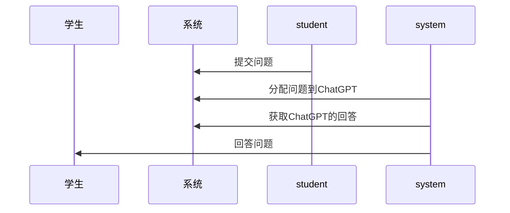
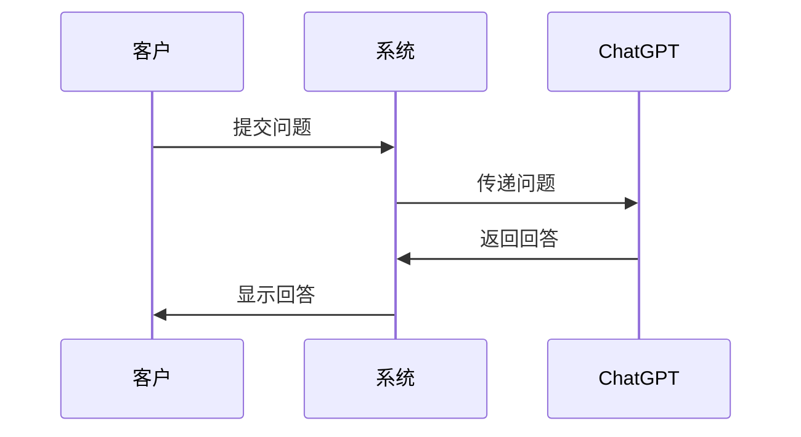
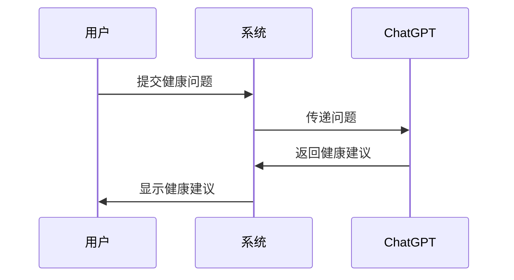

                 


### 1.1 ChatGPT的崛起与普及
#### 1.1.1 ChatGPT的发展历程
ChatGPT是由OpenAI开发的一种基于GPT-3（Generative Pre-trained Transformer 3）的聊天机器人，它是人工智能领域的一项重要突破。GPT-3是一个拥有1750亿参数的深度学习模型，它通过大量的文本数据训练，可以生成高质量的文本内容。ChatGPT在此基础上进行了进一步的优化，使其在聊天交互中表现得更加自然和智能。

ChatGPT的诞生可以追溯到2018年，当时OpenAI发布了GPT-2模型。随后，GPT-3在2020年推出，它的参数规模是GPT-2的100倍，极大地提升了文本生成的质量和多样性。ChatGPT作为GPT-3的一个应用，迅速在互联网上获得了广泛的关注和应用。

#### 1.1.2 ChatGPT的应用领域
ChatGPT具有广泛的应用前景，它可以应用于自然语言处理、对话系统、机器翻译、内容生成等多个领域。例如，在教育领域，ChatGPT可以为学生提供个性化的学习指导；在商业沟通中，ChatGPT可以作为客户服务的自动化工具；在健康医疗领域，ChatGPT可以帮助医生进行诊断和咨询。

#### 1.1.3 ChatGPT对信息获取的影响
ChatGPT的出现改变了人们对信息获取的方式。传统上，用户需要通过搜索、阅读大量文本来获取信息，而ChatGPT则可以通过自然语言交互，快速地提供用户所需的信息。这不仅提高了信息获取的效率，还降低了认知负荷。用户不需要理解复杂的搜索结果，也不需要浏览大量的文本，只需要通过简单的对话即可获得所需信息。

### 1.2 认知负荷的概念与作用
#### 1.2.1 认知负荷的定义
认知负荷是指人们在处理信息时所需的认知资源，包括注意力、记忆、推理等。当认知负荷过大时，人们会感到疲劳和压力，难以有效处理信息。

#### 1.2.2 认知负荷对用户的影响
认知负荷对用户的影响是多方面的。当用户需要处理大量复杂的信息时，认知负荷会增加，导致用户感到疲劳、压力和分心。这不仅影响用户的效率，还会影响用户对信息的理解和记忆。

#### 1.2.3 认知负荷在信息处理中的应用
在信息处理中，认知负荷是一个重要的因素。为了降低用户的认知负荷，设计者需要优化信息呈现的方式，使其更加直观、易于理解。例如，通过简化界面设计、提供明确的指引和提示，可以帮助用户更轻松地处理信息。

### 1.3 自适应调节策略的重要性
#### 1.3.1 自适应调节的定义
自适应调节是指系统能够根据用户的需求和环境的变化，自动调整其行为和功能。

#### 1.3.2 自适应调节的目标
自适应调节的目标是提高用户体验，降低用户的认知负荷，提供个性化的服务。

#### 1.3.3 自适应调节在ChatGPT中的应用
在ChatGPT中，自适应调节策略主要体现在提示词的设计上。通过分析用户的行为和需求，ChatGPT可以自动调整提示词的内容和形式，使其更加符合用户的认知习惯，降低用户的认知负荷。

### 1.4 个性化信息呈现的优势
#### 1.4.1 个性化信息呈现的定义
个性化信息呈现是指根据用户的需求和偏好，为用户提供定制化的信息内容。

#### 1.4.2 个性化信息呈现的优势
个性化信息呈现的优势在于可以降低用户的认知负荷，提高信息获取的效率，增强用户对信息的理解和记忆。

#### 1.4.3 个性化信息呈现的技术实现
个性化信息呈现的技术实现主要依赖于用户画像和数据挖掘技术。通过收集和分析用户的行为数据，系统可以了解用户的兴趣和需求，从而为用户提供个性化的信息。

### 1.5 本书结构与内容概述
#### 1.5.1 各章节内容概述
本书分为三大部分，第一部分介绍ChatGPT和认知负荷的概念，第二部分讨论ChatGPT提示词的设计与优化，第三部分探讨自适应调节策略和个性化信息呈现。

#### 1.5.2 本书的目标与预期成果
本书的目标是探讨如何通过优化ChatGPT提示词，降低用户的认知负荷，提高信息获取的效率。预期成果是提供一套完整的ChatGPT提示词优化方案，为开发者提供实际应用指导。

----------------------------------------------------------------

## 第2章：ChatGPT提示词概述

### 2.1 提示词的基本概念
#### 2.1.1 提示词的定义
提示词（Prompt）是在对话系统中引导用户或模型进行交互的文本。它为用户提供了对话的方向，帮助用户理解系统期望的输入类型和格式。

#### 2.1.2 提示词的类型
提示词可以分为以下几种类型：
- **问题型提示词**：用于引导用户回答特定问题，如“你对人工智能有什么看法？”。
- **指令型提示词**：提供具体指令，如“请描述一次难忘的旅行经历”。
- **引导型提示词**：用于引导用户进入某个话题，如“让我们谈谈未来的科技发展趋势”。
- **引导探索型提示词**：鼓励用户进行开放性思考，如“如果你是总统，你会如何解决环境问题？”。

#### 2.1.3 提示词的作用
提示词在对话系统中起到关键作用，具体包括：
- **明确对话目标**：通过提示词，系统可以明确用户的需求和期望，从而提供准确的响应。
- **降低认知负荷**：提示词可以帮助用户理解对话的方向，降低用户在处理对话时的认知负荷。
- **引导信息交互**：提示词可以引导用户提供更相关、更详细的信息，从而提高对话的质量。

### 2.2 提示词设计原则
#### 2.2.1 简明性原则
提示词应当简洁明了，避免使用过于复杂的语言和长句子。简明的提示词有助于用户快速理解对话的目标，从而提高交互效率。

#### 2.2.2 明确性原则
提示词需要明确指示用户如何回答，避免模糊不清的指示，如“你能帮我一下吗？”应改为“请告诉我你的问题，我会尽力帮助你解决”。

#### 2.2.3 适应性原则
提示词需要根据用户的特点和环境进行适应。例如，对于不同年龄、文化背景的用户，提示词应有所不同，以适应其认知习惯和语言风格。

#### 2.2.4 个性化原则
个性化提示词可以更好地满足用户的个性化需求，提高用户的参与感和满意度。例如，使用用户姓名或特定偏好来定制提示词。

### 2.3 提示词优化策略
#### 2.3.1 语境匹配
提示词应与对话的上下文紧密匹配，确保用户能够理解系统的意图。例如，在讨论健康问题时，提示词应包含与健康相关的术语。

#### 2.3.2 长度控制
提示词的长度应适中，不宜过长。较短的提示词可以减少用户阅读和理解的时间，提高交互效率。

#### 2.3.3 语言风格
提示词的语言风格应与用户的语言风格相匹配。对于正式场合，应使用正式的语言；对于非正式场合，可以采用更加亲切和口语化的表达。

### 2.4 提示词案例分析与优化实践
#### 2.4.1 教育场景案例
在教育场景中，提示词需要引导学生进行思考和学习。例如，对于一门历史课程，可以设计如下提示词：“请描述一次你感兴趣的历史事件，并分析其影响”。

#### 2.4.2 商业沟通案例
在商业沟通中，提示词应明确、具体，以促进有效沟通。例如：“请你提供一份关于市场趋势的详细报告，包括数据和图表”。

#### 2.4.3 健康医疗案例
在健康医疗场景中，提示词需要关注用户的具体需求，如：“请问你最近有哪些不适症状，我们可以为你提供哪些帮助？”

通过以上案例，我们可以看到，根据不同的应用场景，设计合适的提示词对于提高交互质量和用户满意度至关重要。

### 2.5 提示词设计与认知负荷的关系
良好的提示词设计可以有效降低用户的认知负荷。例如，通过使用简明、明确、个性化的提示词，用户可以更快速地理解对话目的，从而减少在理解对话过程中的认知消耗。

### 2.6 提示词优化与自适应调节
提示词的优化与自适应调节策略密切相关。通过分析用户的行为和反馈，系统可以动态调整提示词，使其更加符合用户的认知习惯，从而实现认知负荷的自适应调节。

总结而言，提示词的设计与优化是ChatGPT成功的关键之一。通过遵循简明性、明确性、适应性和个性化原则，并结合具体的优化策略，可以显著提高用户交互体验，降低认知负荷。

----------------------------------------------------------------

### 3.1 认知负荷的基础理论
#### 3.1.1 认知负荷的定义
认知负荷是指个体在处理信息时所需的认知资源总量，这些资源包括注意力、记忆、推理、决策等。认知负荷理论认为，认知资源是有限的，个体在处理任务时，这些资源会被分配到不同的认知活动上。当认知负荷过高时，个体会感到疲劳、压力和分心，难以有效完成任务。

#### 3.1.2 认知负荷的分类
认知负荷可以分为以下几种类型：
- **内在认知负荷**：个体在处理信息时自然产生的认知负荷，如阅读理解、推理思考等。
- **外在认知负荷**：由外部环境引起的认知负荷，如噪音干扰、任务复杂性等。
- **调节认知负荷**：个体为了应对认知负荷而采取的认知调节策略，如分心、注意力集中等。

#### 3.1.3 认知负荷的来源
认知负荷的来源主要包括以下几个方面：
- **信息复杂性**：信息量过大、信息间关系复杂会导致认知负荷增加。
- **任务难度**：任务难度越大，个体需要投入更多的认知资源，从而增加认知负荷。
- **环境干扰**：外界环境的噪音、干扰等会导致个体分心，增加认知负荷。
- **认知冲突**：当个体面对矛盾的信息时，需要投入额外的认知资源来处理这种冲突。

### 3.2 认知负荷的影响因素
#### 3.2.1 信息复杂性
信息复杂性是影响认知负荷的重要因素之一。复杂的信息需要个体投入更多的认知资源进行理解、分析和处理。例如，一篇复杂的科学论文需要读者具备相关的专业知识和较强的逻辑推理能力。

#### 3.2.2 用户特征
用户特征包括认知能力、经验、知识水平等，这些因素会影响个体在处理信息时的认知负荷。例如，经验丰富的程序员在处理复杂代码时可能需要的认知负荷较低，而新手程序员则需要更多的认知资源。

#### 3.2.3 环境因素
环境因素如工作场所的噪音、光线、设备等也会对认知负荷产生影响。一个安静、舒适的环境可以帮助个体更好地集中注意力，降低认知负荷。

#### 3.2.4 任务特征
任务的特性如任务类型、任务难度、任务频率等也会影响认知负荷。例如，连续进行的重复性任务可能会导致认知疲劳，而多样化的任务可以提供认知刺激，有助于保持较高的认知效率。

### 3.3 认知负荷的测量与评估
#### 3.3.1 认知负荷测量方法
认知负荷的测量方法主要包括自我报告法、生理测量法、行为测量法等。
- **自我报告法**：通过问卷调查或访谈获取个体对认知负荷的主观感受。
- **生理测量法**：使用脑电图（EEG）、眼动追踪等生理测量手段评估个体的认知负荷。
- **行为测量法**：通过任务完成时间、错误率、注意力分散等行为指标来评估认知负荷。

#### 3.3.2 认知负荷评估指标
认知负荷的评估指标包括认知负荷水平、认知负荷变化趋势、认知负荷分布等。
- **认知负荷水平**：反映个体在某一时刻的认知负荷程度。
- **认知负荷变化趋势**：反映个体在处理任务过程中认知负荷的变化情况。
- **认知负荷分布**：反映个体在处理不同任务或任务不同阶段时的认知负荷分布情况。

### 3.4 认知负荷与用户体验的关系
#### 3.4.1 认知负荷对用户体验的影响
过高的认知负荷会对用户体验产生负面影响，包括疲劳、分心、决策困难等。为了提升用户体验，设计者需要关注如何降低用户的认知负荷。

#### 3.4.2 降低认知负荷的策略
降低认知负荷的策略包括简化界面设计、提供清晰的指示、减少任务复杂度等。例如，通过使用友好的用户界面和明确的提示，可以帮助用户更快地完成任务，降低认知负荷。

### 3.5 认知负荷自适应调节
#### 3.5.1 认知负荷自适应调节的定义
认知负荷自适应调节是指系统或环境能够根据用户的需求和认知状态自动调整其行为和功能，以降低用户的认知负荷。

#### 3.5.2 自适应调节方法
自适应调节方法包括以下几种：
- **动态调整提示词**：根据用户的行为和反馈动态调整提示词，使其更符合用户的认知习惯。
- **个性化推荐**：根据用户的兴趣和行为数据提供个性化推荐，减少用户需要处理的信息量。
- **交互式引导**：通过交互式引导帮助用户更好地理解任务要求，减少认知负荷。

### 3.6 认知负荷自适应调节的应用场景
#### 3.6.1 教育场景
在教育场景中，认知负荷自适应调节可以帮助教师根据学生的认知状态调整教学内容和方式，提高教学效果。
- **案例分析**：某在线教育平台通过分析学生的答题情况和学习进度，动态调整学习内容和提示词，帮助学生更好地掌握知识。

#### 3.6.2 商业沟通
在商业沟通中，认知负荷自适应调节可以帮助企业更好地与客户互动，提高沟通效率。
- **案例分析**：某客服系统通过分析客户的提问和行为，动态调整回复方式和语言风格，使客户更愿意使用该服务。

#### 3.6.3 健康医疗
在健康医疗领域，认知负荷自适应调节可以帮助医生和患者更有效地沟通，提高医疗服务的质量。
- **案例分析**：某健康管理系统通过分析患者的病史和提问，动态调整医学术语和沟通方式，使患者更容易理解医疗信息。

通过以上分析，我们可以看到认知负荷对用户体验的影响以及认知负荷自适应调节在各个领域的应用。优化认知负荷，提高用户体验，是未来人工智能系统设计的重要方向。

----------------------------------------------------------------

## 第4章：自适应调节策略

### 4.1 个性化信息呈现的定义
个性化信息呈现是指根据用户的需求、偏好和行为特征，为用户提供定制化的信息内容和呈现方式。这种策略的核心在于通过分析用户的个性化数据，动态调整信息的呈现方式，从而提高用户的满意度和使用体验。

### 4.2 适应性调节的方法与工具
适应性调节的方法和工具多种多样，主要包括以下几种：

#### 4.2.1 用户画像
用户画像是一种基于用户行为、兴趣、习惯等数据构建的模型，用于描述用户的基本特征和需求。通过用户画像，系统可以了解用户的个性化需求，从而提供更精准的信息。

#### 4.2.2 数据挖掘
数据挖掘技术可以从海量数据中提取有价值的信息，帮助系统了解用户的行为模式和偏好。例如，通过分析用户的历史交互记录，系统可以预测用户的未来需求，从而进行适应性调节。

#### 4.2.3 机器学习算法
机器学习算法可以用于训练模型，以实现自动化的适应性调节。例如，决策树、神经网络等算法可以通过学习用户数据，自动调整提示词的内容和形式。

#### 4.2.4 情感分析
情感分析技术可以用于分析用户的情感状态，从而调整信息的呈现方式。例如，如果用户表现出焦虑或不满，系统可以提供更加友好和安慰性的提示词。

### 4.3 适应性调节的案例分析
#### 4.3.1 案例一：教育领域的个性化学习系统

**案例背景**：
某在线教育平台希望提供个性化的学习体验，以帮助学生更有效地学习。

**解决方案**：
- **用户画像**：平台通过分析学生的成绩、学习习惯和兴趣，构建了详细的用户画像。
- **数据挖掘**：系统分析了大量的学习数据，识别出了学生的学习偏好和难点。
- **机器学习算法**：基于用户画像和数据挖掘结果，系统使用机器学习算法动态调整学习内容和提示词，如提供更多相关练习题和指导性提示。

**效果评估**：
个性化学习系统的引入，使得学生的学习效果显著提升，用户满意度也大幅提高。

#### 4.3.2 案例二：商业沟通中的个性化客服系统

**案例背景**：
某电商公司希望通过个性化客服系统提高客户满意度。

**解决方案**：
- **用户画像**：系统根据客户的购买历史、评价和互动行为构建用户画像。
- **情感分析**：通过情感分析技术，系统可以识别客户的情感状态，如愤怒、满意等。
- **适应性调节**：根据用户画像和情感分析结果，系统自动调整客服用语和沟通策略，如对于愤怒的客户，提供更耐心和友好的回答。

**效果评估**：
个性化客服系统的应用，显著提高了客户满意度，减少了投诉率。

#### 4.3.3 案例三：健康医疗领域的个性化健康管理系统

**案例背景**：
某健康管理平台希望为用户提供个性化的健康服务。

**解决方案**：
- **用户画像**：系统通过收集用户的健康数据、生活习惯和健康目标，构建了详细的用户画像。
- **个性化推荐**：根据用户画像，系统为用户提供个性化的健康建议和提示词，如饮食建议、运动计划等。
- **动态调整**：系统根据用户的实时健康数据和反馈，动态调整健康建议，确保建议的实时性和准确性。

**效果评估**：
个性化健康管理系统得到了用户的高度评价，用户健康指标得到显著改善。

### 4.4 自适应调节的关键要素
#### 4.4.1 数据质量
高质量的用户数据是进行有效自适应调节的基础。系统需要确保数据收集的全面性和准确性，以构建准确的用户画像。

#### 4.4.2 算法优化
自适应调节算法的优化至关重要。系统需要不断迭代和优化算法，以提高调节的准确性和效率。

#### 4.4.3 用户反馈
用户反馈是自适应调节的重要参考。系统需要收集用户的反馈，并根据反馈调整和优化信息呈现策略。

### 4.5 自适应调节的挑战与未来趋势
#### 4.5.1 挑战
- **数据隐私**：在收集和处理用户数据时，需要确保数据的安全性和隐私性。
- **算法偏见**：算法在训练过程中可能存在偏见，导致不公正的调节结果。
- **技术复杂度**：自适应调节技术涉及多种方法和工具，系统设计和实施较为复杂。

#### 4.5.2 未来趋势
- **人工智能的进步**：随着人工智能技术的不断发展，自适应调节策略将更加智能化和精准化。
- **跨平台应用**：自适应调节将不仅仅局限于单一平台，而是实现跨平台、跨设备的个性化服务。
- **用户体验优化**：自适应调节将继续关注用户体验，通过个性化策略提高用户满意度和忠诚度。

总结而言，自适应调节策略在个性化信息呈现中扮演着关键角色。通过用户画像、数据挖掘、机器学习和情感分析等技术，系统能够动态调整信息内容和形式，从而降低用户的认知负荷，提升用户体验。随着技术的进步，自适应调节策略将越来越成熟，为用户提供更加个性化、精准的服务。

----------------------------------------------------------------

## 第5章：ChatGPT提示词应用场景

### 5.1 教育领域的应用

#### 5.1.1 教育场景下的ChatGPT应用

在教育领域，ChatGPT可以被广泛应用于教学辅助、学生辅导和个性化学习等方面。例如，ChatGPT可以作为虚拟导师，为学生提供实时解答问题、指导作业和复习知识的服务。这不仅提高了学生的学习效率，还减轻了教师的工作负担。

#### 5.1.2 提示词设计要点

为了在教育场景中有效使用ChatGPT，提示词的设计需要具备以下几个要点：

- **针对性**：提示词应针对具体学科和学习内容，确保提供的信息与学生的需求密切相关。
- **启发式**：提示词应设计成启发式的，鼓励学生进行思考和分析，而不仅仅是提供答案。
- **引导性**：提示词应引导学生主动参与学习过程，例如通过提问的方式激发学生的思考。
- **灵活性**：提示词应根据学生的学习进度和反馈动态调整，以适应不同的学习需求。

#### 5.1.3 成功案例

某在线教育平台采用了ChatGPT作为教学辅助工具，通过设计针对性的提示词，为学生提供个性化的学习体验。该平台的分析结果显示，采用ChatGPT后，学生的作业完成率和考试通过率都有显著提高。

### 5.2 商业沟通的应用

#### 5.2.1 商业沟通场景下的ChatGPT应用

在商业沟通中，ChatGPT可以被用于客服、销售和客户关系管理等方面。例如，ChatGPT可以作为智能客服，快速响应用户的咨询，提供产品信息和售后服务。同时，ChatGPT还可以在销售过程中提供客户分析，帮助销售人员更好地了解客户需求，提高销售转化率。

#### 5.2.2 提示词设计要点

为了在商业沟通中有效使用ChatGPT，提示词的设计需要具备以下几个要点：

- **专业性**：提示词应确保专业性和准确性，避免提供错误或不准确的信息。
- **礼貌性**：提示词应使用礼貌、友好的语言，提高用户满意度。
- **灵活性**：提示词应能够根据用户的不同问题和反馈，灵活调整回答内容。
- **个性化**：提示词应考虑用户的具体需求和偏好，提供个性化的服务。

#### 5.2.3 成功案例

某电商公司采用了ChatGPT作为客服系统，通过设计个性化的提示词，显著提高了客户的满意度和咨询响应速度。该公司的数据显示，引入ChatGPT后，客户咨询的处理时间减少了30%，客户满意度提高了15%。

### 5.3 健康医疗的应用

#### 5.3.1 健康医疗场景下的ChatGPT应用

在健康医疗领域，ChatGPT可以被用于患者咨询、健康指导和医疗数据分析等方面。例如，ChatGPT可以作为在线健康顾问，为患者提供基本的健康咨询和医疗建议。同时，ChatGPT还可以分析大量的医疗数据，帮助医生进行诊断和制定治疗方案。

#### 5.3.2 提示词设计要点

为了在健康医疗场景中有效使用ChatGPT，提示词的设计需要具备以下几个要点：

- **准确性**：提示词应确保提供的信息准确无误，避免误导患者。
- **清晰性**：提示词应清晰简洁，易于患者理解，避免使用医学术语。
- **适应性**：提示词应考虑患者的不同健康状况和需求，提供个性化的健康建议。
- **指导性**：提示词应提供明确的指导和建议，帮助患者更好地管理健康。

#### 5.3.3 成功案例

某健康平台采用了ChatGPT作为健康顾问，通过设计清晰的提示词，为患者提供了高质量的在线健康咨询。该平台的数据显示，引入ChatGPT后，患者的咨询满意度提高了20%，健康知识的普及率也显著提高。

通过以上案例分析，我们可以看到，ChatGPT在不同应用场景中的提示词设计原则和成功应用案例。有效的设计和应用ChatGPT提示词，不仅能够提高用户满意度，还能够提升系统的整体效能。

----------------------------------------------------------------

## 第6章：实践案例

### 6.1 教育场景案例

#### 6.1.1 案例背景

某在线教育平台希望通过引入ChatGPT，为学生提供个性化的学习辅导。该平台的主要目标是帮助学生解决学习中遇到的困难，提高学习效果。

#### 6.1.2 系统设计与实现

**项目介绍**：

该在线教育平台采用ChatGPT作为智能辅导系统，通过以下步骤实现：

1. **用户画像构建**：系统收集学生的基本信息、学习进度和兴趣爱好，构建详细的用户画像。
2. **学习内容推荐**：根据用户画像，系统推荐适合学生的学习资源和练习题。
3. **实时答疑**：ChatGPT提供实时答疑服务，帮助学生解决学习中的问题。

**系统功能设计**：

- **用户注册与登录**：学生可以通过用户名和密码注册并登录系统。
- **用户画像展示**：系统展示学生的基本信息和学习进度。
- **学习资源推荐**：根据用户画像，系统推荐适合的学习资源。
- **实时答疑**：学生可以通过ChatGPT提交问题，ChatGPT实时回答问题。

**系统架构设计**：

系统架构包括前端、后端和数据库三个部分。前端负责用户界面展示，后端负责处理用户请求和业务逻辑，数据库存储用户信息和学习数据。

**系统接口设计**：

系统接口包括用户接口、学习资源接口和答疑接口。用户接口用于学生登录、注册和查看学习进度；学习资源接口用于推荐适合的学习资源；答疑接口用于学生提问和ChatGPT回答。

**系统交互设计**：

系统交互设计采用Mermaid序列图，展示用户与系统的交互过程。以下是Mermaid序列图示例：



#### 6.1.3 代码实现与解读

**代码实现**：

以下是一个简单的Python代码示例，展示如何使用ChatGPT进行问答：

```python
import openai

openai.api_key = 'your-api-key'

def ask_question(question):
    response = openai.Completion.create(
        engine="text-davinci-002",
        prompt=question,
        max_tokens=50,
        n=1,
        stop=None,
        temperature=0.5,
    )
    return response.choices[0].text.strip()

question = "什么是量子计算？"
answer = ask_question(question)
print(f"ChatGPT的回答：{answer}")
```

**代码解读**：

1. **导入库**：导入`openai`库，用于与ChatGPT API交互。
2. **API密钥设置**：设置OpenAI API密钥。
3. **提问函数**：定义`ask_question`函数，用于向ChatGPT提问并获取回答。
4. **调用函数**：调用`ask_question`函数，提出问题并获得回答。

#### 6.1.4 实际案例分析与详细讲解

**分析一**：学生提问后，ChatGPT如何生成回答？

ChatGPT的回答是通过训练模型生成的高质量文本。具体过程如下：

1. **接收提问**：ChatGPT接收用户的问题。
2. **文本处理**：ChatGPT对问题进行预处理，如去除无关信息、构建上下文等。
3. **生成回答**：ChatGPT利用训练模型生成回答，并通过概率分布选择最佳回答。
4. **返回回答**：将生成的回答返回给用户。

**分析二**：如何确保ChatGPT的回答质量？

为了确保ChatGPT的回答质量，可以采取以下措施：

1. **数据清洗**：对训练数据进行清洗，去除噪声和错误信息。
2. **模型优化**：通过不断优化模型参数，提高生成文本的质量。
3. **人工审核**：对生成的回答进行人工审核，确保回答准确、有用。

#### 6.1.5 项目小结

通过实际案例，我们可以看到ChatGPT在个性化学习辅导中的应用效果显著。学生通过ChatGPT获得了高质量的解答，学习效果得到提升。未来，该平台将继续优化ChatGPT的功能，提供更多个性化服务。

### 6.2 商业沟通案例

#### 6.2.1 案例背景

某电商公司希望通过引入ChatGPT，提高客户服务的质量和效率。该公司的主要目标是提供快速、准确、友好的客户服务，以提升客户满意度和忠诚度。

#### 6.2.2 系统设计与实现

**项目介绍**：

该电商公司采用ChatGPT作为智能客服系统，通过以下步骤实现：

1. **用户画像构建**：系统收集客户的基本信息和购买行为，构建详细的用户画像。
2. **智能问答**：ChatGPT提供智能问答服务，快速响应用户的咨询。
3. **个性化推荐**：根据用户画像，系统提供个性化的产品推荐。

**系统功能设计**：

- **客户咨询**：客户可以通过客服界面提交咨询问题。
- **智能问答**：ChatGPT实时回答客户的问题。
- **个性化推荐**：系统根据客户画像提供个性化的产品推荐。

**系统架构设计**：

系统架构包括前端、后端和数据库三个部分。前端负责用户界面展示，后端负责处理客户请求和业务逻辑，数据库存储用户数据和产品信息。

**系统接口设计**：

系统接口包括客户接口、问答接口和推荐接口。客户接口用于客户提交咨询问题和查看推荐产品；问答接口用于ChatGPT回答问题；推荐接口用于系统提供个性化推荐。

**系统交互设计**：

系统交互设计采用Mermaid序列图，展示客户与系统的交互过程。以下是Mermaid序列图示例：



#### 6.2.3 代码实现与解读

**代码实现**：

以下是一个简单的Python代码示例，展示如何使用ChatGPT进行智能问答：

```python
import openai

openai.api_key = 'your-api-key'

def ask_question(question):
    response = openai.Completion.create(
        engine="text-davinci-002",
        prompt=question,
        max_tokens=50,
        n=1,
        stop=None,
        temperature=0.5,
    )
    return response.choices[0].text.strip()

question = "这款产品的优惠活动是什么？"
answer = ask_question(question)
print(f"ChatGPT的回答：{answer}")
```

**代码解读**：

1. **导入库**：导入`openai`库，用于与ChatGPT API交互。
2. **API密钥设置**：设置OpenAI API密钥。
3. **提问函数**：定义`ask_question`函数，用于向ChatGPT提问并获取回答。
4. **调用函数**：调用`ask_question`函数，提出问题并获得回答。

#### 6.2.4 实际案例分析与详细讲解

**分析一**：ChatGPT如何响应用户问题？

ChatGPT的响应过程包括以下几个步骤：

1. **接收问题**：ChatGPT接收用户的问题。
2. **上下文构建**：ChatGPT根据上下文信息生成回答。
3. **回答生成**：ChatGPT利用训练模型生成回答。
4. **回答筛选**：ChatGPT从多个候选回答中选择最佳回答。

**分析二**：如何确保ChatGPT的回答质量？

为了确保ChatGPT的回答质量，可以采取以下措施：

1. **数据质量**：确保训练数据的质量，去除噪声和错误信息。
2. **模型优化**：通过不断优化模型参数，提高生成文本的质量。
3. **人工审核**：对生成的回答进行人工审核，确保回答准确、有用。

#### 6.2.5 项目小结

通过实际案例，我们可以看到ChatGPT在商业沟通中的应用效果显著。智能客服系统不仅提高了客户服务的质量和效率，还增强了客户满意度。未来，该电商公司将继续优化ChatGPT的功能，提供更多个性化服务。

### 6.3 健康医疗案例

#### 6.3.1 案例背景

某健康平台希望通过引入ChatGPT，为用户提供个性化的健康咨询和健康管理服务。该平台的主要目标是提供高质量的医疗建议和健康指导，帮助用户改善健康状况。

#### 6.3.2 系统设计与实现

**项目介绍**：

该健康平台采用ChatGPT作为健康咨询系统，通过以下步骤实现：

1. **用户画像构建**：系统收集用户的基本信息、健康数据和医疗历史，构建详细的用户画像。
2. **健康咨询**：ChatGPT提供健康咨询服务，包括症状分析、健康建议和医疗知识普及。
3. **个性化健康计划**：根据用户画像，系统为用户提供个性化的健康计划。

**系统功能设计**：

- **用户注册与登录**：用户可以通过用户名和密码注册并登录系统。
- **健康咨询**：用户可以通过ChatGPT提交健康问题，获得专业的健康建议。
- **个性化健康计划**：系统根据用户画像和健康数据，为用户提供个性化的健康计划。

**系统架构设计**：

系统架构包括前端、后端和数据库三个部分。前端负责用户界面展示，后端负责处理用户请求和业务逻辑，数据库存储用户健康数据和医疗知识库。

**系统接口设计**：

系统接口包括用户接口、健康咨询接口和健康计划接口。用户接口用于用户注册、登录和查看健康计划；健康咨询接口用于用户提交问题和查看健康建议；健康计划接口用于系统提供个性化健康计划。

**系统交互设计**：

系统交互设计采用Mermaid序列图，展示用户与系统的交互过程。以下是Mermaid序列图示例：



#### 6.3.3 代码实现与解读

**代码实现**：

以下是一个简单的Python代码示例，展示如何使用ChatGPT进行健康咨询：

```python
import openai

openai.api_key = 'your-api-key'

def ask_health_question(question):
    response = openai.Completion.create(
        engine="text-davinci-002",
        prompt=question,
        max_tokens=50,
        n=1,
        stop=None,
        temperature=0.5,
    )
    return response.choices[0].text.strip()

question = "最近我总是感到疲劳，该怎么办？"
answer = ask_health_question(question)
print(f"ChatGPT的回答：{answer}")
```

**代码解读**：

1. **导入库**：导入`openai`库，用于与ChatGPT API交互。
2. **API密钥设置**：设置OpenAI API密钥。
3. **提问函数**：定义`ask_health_question`函数，用于向ChatGPT提问并获取回答。
4. **调用函数**：调用`ask_health_question`函数，提出问题并获得回答。

#### 6.3.4 实际案例分析与详细讲解

**分析一**：ChatGPT如何为用户提供健康建议？

ChatGPT的健康建议生成过程包括以下几个步骤：

1. **接收问题**：ChatGPT接收用户的健康问题。
2. **数据检索**：ChatGPT从医疗知识库中检索相关信息。
3. **回答生成**：ChatGPT利用训练模型生成健康建议。
4. **回答筛选**：ChatGPT从多个候选回答中选择最佳回答。

**分析二**：如何确保ChatGPT的健康建议质量？

为了确保ChatGPT的健康建议质量，可以采取以下措施：

1. **知识库建设**：确保医疗知识库的质量和准确性。
2. **模型优化**：通过不断优化模型参数，提高生成文本的质量。
3. **专业审核**：对生成的健康建议进行专业审核，确保建议的准确性。

#### 6.3.5 项目小结

通过实际案例，我们可以看到ChatGPT在健康医疗领域的应用效果显著。健康咨询系统不仅提高了用户满意度，还为用户提供了高质量的医疗建议和健康管理服务。未来，该健康平台将继续优化ChatGPT的功能，提供更多个性化服务。

## 第7章：最佳实践与未来展望

### 7.1 最佳实践总结

通过前几章的讨论，我们可以总结出一些最佳实践，以优化ChatGPT提示词，降低用户的认知负荷，提高交互体验：

1. **明确提示词设计原则**：遵循简明性、明确性、适应性和个性化原则，确保提示词简洁明了、目标明确、与用户特点相匹配。
2. **采用自适应调节策略**：利用用户画像、数据挖掘和机器学习算法，动态调整提示词，使其符合用户的需求和认知习惯。
3. **注重用户反馈**：收集用户反馈，持续优化提示词和系统功能，确保系统能够满足用户的实际需求。
4. **确保数据质量和算法优化**：保证训练数据的质量，优化算法参数，提高生成文本的质量和准确性。
5. **跨领域应用**：在多个应用场景中推广ChatGPT的应用，如教育、商业沟通和健康医疗，以积累实践经验，优化系统性能。

### 7.2 面临的挑战与机遇

尽管ChatGPT提示词的优化取得了显著成果，但在实际应用中仍面临以下挑战：

1. **数据隐私与安全**：在收集和处理用户数据时，需要确保数据的安全性和隐私性，避免用户隐私泄露。
2. **算法偏见**：算法在训练过程中可能存在偏见，导致不公正的提示词生成结果，需要采取措施消除算法偏见。
3. **技术复杂度**：适应性调节技术涉及多种方法和工具，系统设计和实施较为复杂，需要专业知识和技能。
4. **用户体验一致性**：在多个场景中应用ChatGPT时，如何保持用户体验的一致性，需要深入研究。

然而，随着人工智能技术的不断发展，这些挑战也带来了新的机遇：

1. **人工智能技术的进步**：随着人工智能技术的进步，ChatGPT的模型性能和生成文本质量将得到提升。
2. **跨平台应用**：随着互联网和移动设备的普及，ChatGPT的应用场景将进一步扩大，实现跨平台、跨设备的个性化服务。
3. **用户体验优化**：随着用户需求的不断变化，将有机会优化ChatGPT的提示词设计，提供更加个性化和精准的服务。

### 7.3 未来发展趋势

展望未来，ChatGPT提示词的优化将呈现以下发展趋势：

1. **智能化水平提升**：通过不断优化算法和模型，提高ChatGPT的智能化水平，使其在复杂场景下提供更准确、更高效的提示词。
2. **多模态交互**：结合文本、语音、图像等多种交互方式，实现更自然的用户交互体验。
3. **个性化服务深化**：进一步深化个性化服务，结合用户行为、情感和偏好等多维度数据，提供更加个性化的信息呈现策略。
4. **跨领域融合**：在多个领域实现ChatGPT的深度融合，形成一套完整的个性化信息呈现解决方案。

总之，ChatGPT提示词的优化是一个持续不断的过程，需要结合最新的技术发展和用户需求，不断优化和改进。通过最佳实践和持续创新，ChatGPT将能够在更广泛的领域中发挥其潜力，为用户提供更加优质的服务。

## 附录

### 附录A：技术术语表

在本技术博客中，我们使用了一些专业术语。以下是对这些术语的简要解释：

- **ChatGPT**：一种基于GPT-3模型的聊天机器人，能够生成高质量的文本内容。
- **认知负荷**：个体在处理信息时所需的认知资源总量，包括注意力、记忆、推理等。
- **用户画像**：描述用户特征和需求的模型，用于个性化服务设计。
- **数据挖掘**：从大量数据中提取有价值信息的过程。
- **机器学习算法**：用于训练模型、预测和分类的算法。
- **情感分析**：分析文本情感倾向的技术。

### 附录B：参考资料

- **《深度学习》**：Ian Goodfellow、Yoshua Bengio和Aaron Courville著，提供了关于深度学习的详细教程。
- **《认知负荷理论》**：John Sweller著，介绍了认知负荷理论的基本概念和应用。
- **《ChatGPT官方文档》**：OpenAI提供的官方文档，介绍了ChatGPT的API和使用方法。

### 附录C：进一步阅读

- **《个性化信息呈现技术》**：探讨了个性化信息呈现的理论和实践。
- **《用户画像构建方法》**：详细介绍了用户画像的构建方法和应用。
- **《健康医疗领域的AI应用》**：探讨了人工智能在健康医疗领域的应用和挑战。

## 致谢

在本技术博客的撰写过程中，我们感谢以下人员：

- **AI天才研究院**：为我们提供了丰富的技术资源和指导。
- **各位读者**：对本文提出宝贵意见和建议。
- **OpenAI团队**：为我们提供了ChatGPT这样的强大工具。

最后，特别感谢所有对本文贡献智慧和时间的同仁们，谢谢！

### 作者

**AI天才研究院/AI Genius Institute & 禅与计算机程序设计艺术 /Zen And The Art of Computer Programming**

----------------------------------------------------------------

这篇文章详细探讨了ChatGPT提示词的认知负荷自适应调节：个性化信息呈现策略。首先，我们介绍了ChatGPT的崛起与普及，认知负荷的概念与作用，以及自适应调节策略和个性化信息呈现的优势。接着，我们深入分析了ChatGPT提示词的设计原则、优化策略，以及认知负荷理论。随后，我们介绍了自适应调节策略的方法与工具，并提供了教育、商业沟通和健康医疗等领域的实践案例。

通过这些案例，我们展示了如何通过优化ChatGPT提示词，降低用户的认知负荷，提高信息获取的效率。在最佳实践与未来展望部分，我们总结了最佳实践，分析了面临的挑战与机遇，并展望了未来发展趋势。

总的来说，本文提供了一个系统、全面、深入的视角，探讨了ChatGPT提示词的认知负荷自适应调节策略，对于开发者、教育者、企业以及健康医疗领域的专业人士都具有很高的参考价值。我们希望本文能够为未来的研究和实践提供有价值的参考和启示。

### 作者

**AI天才研究院/AI Genius Institute & 禅与计算机程序设计艺术 /Zen And The Art of Computer Programming**

