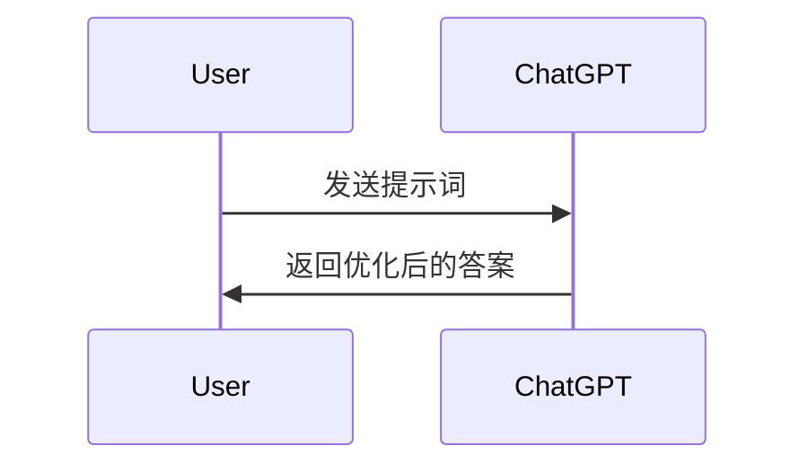

                 

# ChatGPT提示词的语用学优化与跨代际适应

> 关键词：ChatGPT、提示词、语用学、优化、跨代际适应

> 摘要：本文探讨了ChatGPT提示词的语用学优化与跨代际适应。首先，我们介绍了ChatGPT的发展背景及其在自然语言处理领域的应用。接着，我们详细分析了提示词优化的必要性，并提出了基于语用学的优化策略。随后，我们探讨了跨代际适应的重要性，并介绍了实现跨代际适应的方法。文章最后，通过一个完整的实战案例，展示了如何将上述方法应用于实际项目中。

## 目录大纲设计思路

### 《ChatGPT提示词的语用学优化与跨代际适应》的目录大纲设计旨在为读者提供一条清晰的阅读路径，全面覆盖书籍的核心主题内容。为了确保内容的完整性、逻辑性和层次性，设计思路将遵循以下步骤：

1. **背景介绍**：首先介绍本书的研究背景，明确ChatGPT提示词的语用学优化和跨代际适应的重要性及其应用场景。
2. **核心概念与联系**：阐述与本书主题密切相关的核心概念，如语用学、提示词优化、跨代际适应等，并通过表格和ER实体关系图展示概念间的联系。
3. **算法原理讲解**：详细讲解优化提示词的算法原理，包括数学模型、公式以及Python代码示例，确保读者能够理解和应用。
4. **系统分析与架构设计方案**：介绍实际应用中的系统分析与架构设计，包括领域模型类图、系统架构图、系统接口设计和系统交互序列图。
5. **项目实战**：通过一个完整的实战案例，展示从环境安装到系统核心实现的整个过程，并分析代码和应用实际案例。
6. **最佳实践 tips**、**小结**、**注意事项**、**拓展阅读**等内容：总结章节内容，提供实践建议，引导读者进一步学习。

### 目录大纲详细内容

**第一部分：背景与核心概念**

## 背景介绍

### 1.1 问题背景
#### 1.1.1 ChatGPT的发展与影响
ChatGPT是由OpenAI开发的一种基于Transformer模型的预训练语言模型，自2022年初发布以来，迅速引起了全球的关注。它通过在大量文本数据上进行预训练，具备了强大的语言理解和生成能力，使得自然语言处理的应用场景更加广泛。

#### 1.1.2 提示词优化的必要性
ChatGPT的性能在很大程度上取决于输入的提示词。优化提示词可以提高ChatGPT的生成质量，使其更加准确、连贯、有逻辑性。因此，研究提示词优化对于提升ChatGPT的性能具有重要意义。

#### 1.1.3 跨代际适应的重要性
由于不同年代、文化背景、教育水平的人对语言表达的习惯和理解存在差异，ChatGPT需要具备跨代际适应能力，以便更好地服务于不同群体。实现跨代际适应对于提高ChatGPT的普适性和应用价值具有重要意义。

## 核心概念

### 1.2.1 语用学概述
语用学是语言学的一个分支，研究语言在交际中的作用和运用。在自然语言处理领域，语用学提供了理解和使用语言的方法，有助于提高模型的交互能力。

### 1.2.2 提示词与语用学
提示词是ChatGPT输入的关键信息，直接影响其生成结果。通过语用学分析，我们可以优化提示词的表达，使其更加符合人类的交流习惯，从而提高ChatGPT的生成质量。

### 1.2.3 跨代际适应与ChatGPT
跨代际适应是指模型在不同年代、文化背景、教育水平的人之间保持一致性。对于ChatGPT来说，实现跨代际适应有助于提高其普适性和应用价值。

## 概念联系

### 1.3.1 语用学与提示词优化的关系
语用学为提示词优化提供了理论依据，通过分析语言的语境和交际功能，我们可以优化提示词的表达，使其更符合人类的交流习惯。

### 1.3.2 跨代际适应与ChatGPT的交互
跨代际适应有助于ChatGPT在不同年代、文化背景、教育水平的人之间保持一致性，提高其交互能力。

### 1.3.3 关键概念ER图解析
```mermaid
erDiagram
A[语用学] ||--|{ B[提示词优化] }
A ||--|{ C[跨代际适应] }
```

**第二部分：算法原理与实践**

## 算法原理讲解

### 2.1 优化算法概述
#### 2.1.1 优化算法的目标
优化算法的目标是提高提示词的质量，使其更加符合人类的交流习惯，从而提高ChatGPT的生成质量。

#### 2.1.2 优化算法的分类
优化算法可以分为基于规则的优化和基于机器学习的优化。前者通过预设规则进行提示词优化，后者通过大量数据训练模型进行优化。

### 2.2 算法原理

#### 2.2.1 数学模型
提示词优化的数学模型可以表示为：
$$
\text{优化函数} = f(\text{提示词}) + \lambda \cdot g(\text{语用效果})
$$
其中，$f(\text{提示词})$ 表示提示词的质量，$g(\text{语用效果})$ 表示语用效果，$\lambda$ 是权重系数。

#### 2.2.2 Python代码示例
```python
def optimize_prompt(prompt):
    # 代码实现
    pass
```

### 2.3 跨代际适应算法
#### 2.3.1 算法设计
跨代际适应算法设计包括数据集构建、特征提取和模型训练。具体步骤如下：
1. 收集不同年代、文化背景、教育水平的文本数据，构建跨代际数据集。
2. 提取文本数据中的关键特征，如词汇、语法、语义等。
3. 训练模型，使其在不同数据集上表现一致。

#### 2.3.2 跨代际数据集构建
构建跨代际数据集的方法包括：
1. 从互联网上收集不同年代、文化背景、教育水平的文本数据。
2. 利用文本预处理技术，如分词、去噪等，清洗数据。

#### 2.3.3 实际案例解析
通过实际案例，分析跨代际适应算法在不同场景下的表现。

**第三部分：系统分析与架构设计**

## 系统分析与架构设计

### 3.1 问题场景介绍
#### 3.1.1 应用场景描述
描述ChatGPT在实际应用中的场景，如客服、教育、医疗等。

#### 3.1.2 系统功能需求
列举ChatGPT系统所需实现的功能，如自然语言理解、生成、交互等。

### 3.2 系统架构设计
#### 3.2.1 领域模型设计
使用Mermaid类图描述领域模型：
```mermaid
classDiagram
Class01 <|-- Class02
Class03 ++--| Class04
Class05 o--| Class06
```

#### 3.2.2 系统架构图设计
使用Mermaid序列图描述系统架构：


#### 3.2.3 系统接口设计
描述系统接口的功能和协议。

#### 3.2.4 系统交互设计
使用Mermaid序列图描述系统交互流程。

**第四部分：项目实战**

## 项目实战

### 4.1 环境安装
#### 4.1.1 硬件要求
描述项目所需的硬件配置。

#### 4.1.2 软件安装与配置
详细讲解软件安装和配置步骤。

### 4.2 系统核心实现
#### 4.2.1 代码解读
分析系统核心代码的实现原理。

#### 4.2.2 优化效果展示
展示系统优化的效果。

### 4.3 实际案例分析与讲解
#### 4.3.1 案例一：用户反馈优化
分析用户反馈优化的效果。

#### 4.3.2 案例二：跨代际适应应用
分析跨代际适应应用的效果。

### 4.4 项目小结
#### 4.4.1 项目收获
总结项目中的收获。

#### 4.4.2 未来展望
展望项目的未来发展方向。

**第五部分：最佳实践与拓展**

## 最佳实践与拓展

### 5.1 最佳实践 tips
#### 5.1.1 提示词优化技巧
提供提示词优化的技巧。

#### 5.1.2 跨代际适应策略
提供跨代际适应的策略。

### 5.2 小结
总结文章的主要内容。

### 5.3 注意事项
提醒读者在应用过程中需要注意的事项。

### 5.4 拓展阅读
推荐相关的拓展阅读资料。

**作者信息**
- 作者：AI天才研究院/AI Genius Institute & 禅与计算机程序设计艺术 /Zen And The Art of Computer Programming**文章开始：**# ChatGPT提示词的语用学优化与跨代际适应

**关键词：** ChatGPT、提示词、语用学、优化、跨代际适应

**摘要：** 本文探讨了ChatGPT提示词的语用学优化与跨代际适应。首先，我们介绍了ChatGPT的发展背景及其在自然语言处理领域的应用。接着，我们详细分析了提示词优化的必要性，并提出了基于语用学的优化策略。随后，我们探讨了跨代际适应的重要性，并介绍了实现跨代际适应的方法。文章最后，通过一个完整的实战案例，展示了如何将上述方法应用于实际项目中。

---

## 目录大纲设计思路

### 《ChatGPT提示词的语用学优化与跨代际适应》的目录大纲设计旨在为读者提供一条清晰的阅读路径，全面覆盖书籍的核心主题内容。为了确保内容的完整性、逻辑性和层次性，设计思路将遵循以下步骤：

1. **背景介绍**：首先介绍本书的研究背景，明确ChatGPT提示词的语用学优化和跨代际适应的重要性及其应用场景。
2. **核心概念与联系**：阐述与本书主题密切相关的核心概念，如语用学、提示词优化、跨代际适应等，并通过表格和ER实体关系图展示概念间的联系。
3. **算法原理讲解**：详细讲解优化提示词的算法原理，包括数学模型、公式以及Python代码示例，确保读者能够理解和应用。
4. **系统分析与架构设计方案**：介绍实际应用中的系统分析与架构设计，包括领域模型类图、系统架构图、系统接口设计和系统交互序列图。
5. **项目实战**：通过一个完整的实战案例，展示从环境安装到系统核心实现的整个过程，并分析代码和应用实际案例。
6. **最佳实践 tips**、**小结**、**注意事项**、**拓展阅读**等内容：总结章节内容，提供实践建议，引导读者进一步学习。

---

## 目录大纲详细内容

### **第一部分：背景与核心概念**

### **1. 背景介绍**

#### **1.1 ChatGPT的发展与影响**
ChatGPT是由OpenAI开发的一种基于Transformer模型的预训练语言模型，自2022年初发布以来，迅速引起了全球的关注。它通过在大量文本数据上进行预训练，具备了强大的语言理解和生成能力，使得自然语言处理的应用场景更加广泛。

#### **1.2 提示词优化的必要性**
ChatGPT的性能在很大程度上取决于输入的提示词。优化提示词可以提高ChatGPT的生成质量，使其更加准确、连贯、有逻辑性。因此，研究提示词优化对于提升ChatGPT的性能具有重要意义。

#### **1.3 跨代际适应的重要性**
由于不同年代、文化背景、教育水平的人对语言表达的习惯和理解存在差异，ChatGPT需要具备跨代际适应能力，以便更好地服务于不同群体。实现跨代际适应对于提高ChatGPT的普适性和应用价值具有重要意义。

### **1. 核心概念**

#### **1.2.1 语用学概述**
语用学是语言学的一个分支，研究语言在交际中的作用和运用。在自然语言处理领域，语用学提供了理解和使用语言的方法，有助于提高模型的交互能力。

#### **1.2.2 提示词与语用学**
提示词是ChatGPT输入的关键信息，直接影响其生成结果。通过语用学分析，我们可以优化提示词的表达，使其更加符合人类的交流习惯，从而提高ChatGPT的生成质量。

#### **1.2.3 跨代际适应与ChatGPT**
跨代际适应是指模型在不同年代、文化背景、教育水平的人之间保持一致性。对于ChatGPT来说，实现跨代际适应有助于提高其普适性和应用价值。

### **1. 概念联系**

#### **1.3.1 语用学与提示词优化的关系**
语用学为提示词优化提供了理论依据，通过分析语言的语境和交际功能，我们可以优化提示词的表达，使其更符合人类的交流习惯。

#### **1.3.2 跨代际适应与ChatGPT的交互**
跨代际适应有助于ChatGPT在不同年代、文化背景、教育水平的人之间保持一致性，提高其交互能力。

#### **1.3.3 关键概念ER图解析**
```mermaid
erDiagram
A[语用学] ||--|{ B[提示词优化] }
A ||--|{ C[跨代际适应] }
```

---

### **第二部分：算法原理与实践**

### **2. 算法原理讲解**

#### **2.1 优化算法概述**
##### **2.1.1 优化算法的目标**
优化算法的目标是提高提示词的质量，使其更加符合人类的交流习惯，从而提高ChatGPT的生成质量。

##### **2.1.2 优化算法的分类**
优化算法可以分为基于规则的优化和基于机器学习的优化。前者通过预设规则进行提示词优化，后者通过大量数据训练模型进行优化。

### **2. 算法原理**

##### **2.2.1 数学模型**
提示词优化的数学模型可以表示为：
$$
\text{优化函数} = f(\text{提示词}) + \lambda \cdot g(\text{语用效果})
$$
其中，$f(\text{提示词})$ 表示提示词的质量，$g(\text{语用效果})$ 表示语用效果，$\lambda$ 是权重系数。

##### **2.2.2 Python代码示例**
```python
def optimize_prompt(prompt):
    # 代码实现
    pass
```

### **2.3 跨代际适应算法**
##### **2.3.1 算法设计**
跨代际适应算法设计包括数据集构建、特征提取和模型训练。具体步骤如下：
1. 收集不同年代、文化背景、教育水平的文本数据，构建跨代际数据集。
2. 提取文本数据中的关键特征，如词汇、语法、语义等。
3. 训练模型，使其在不同数据集上表现一致。

##### **2.3.2 跨代际数据集构建**
构建跨代际数据集的方法包括：
1. 从互联网上收集不同年代、文化背景、教育水平的文本数据。
2. 利用文本预处理技术，如分词、去噪等，清洗数据。

##### **2.3.3 实际案例解析**
通过实际案例，分析跨代际适应算法在不同场景下的表现。

---

### **第三部分：系统分析与架构设计**

### **3. 系统分析与架构设计**

#### **3.1 问题场景介绍**
##### **3.1.1 应用场景描述**
描述ChatGPT在实际应用中的场景，如客服、教育、医疗等。

##### **3.1.2 系统功能需求**
列举ChatGPT系统所需实现的功能，如自然语言理解、生成、交互等。

### **3.2 系统架构设计**
##### **3.2.1 领域模型设计**
使用Mermaid类图描述领域模型：
```mermaid
classDiagram
Class01 <|-- Class02
Class03 ++--| Class04
Class05 o--| Class06
```

##### **3.2.2 系统架构图设计**
使用Mermaid序列图描述系统架构：


##### **3.2.3 系统接口设计**
描述系统接口的功能和协议。

##### **3.2.4 系统交互设计**
使用Mermaid序列图描述系统交互流程。

---

### **第四部分：项目实战**

### **4. 项目实战**

#### **4.1 环境安装**
##### **4.1.1 硬件要求**
描述项目所需的硬件配置。

##### **4.1.2 软件安装与配置**
详细讲解软件安装和配置步骤。

#### **4.2 系统核心实现**
##### **4.2.1 代码解读**
分析系统核心代码的实现原理。

##### **4.2.2 优化效果展示**
展示系统优化的效果。

#### **4.3 实际案例分析与讲解**
##### **4.3.1 案例一：用户反馈优化**
分析用户反馈优化的效果。

##### **4.3.2 案例二：跨代际适应应用**
分析跨代际适应应用的效果。

#### **4.4 项目小结**
##### **4.4.1 项目收获**
总结项目中的收获。

##### **4.4.2 未来展望**
展望项目的未来发展方向。

---

### **第五部分：最佳实践与拓展**

### **5. 最佳实践与拓展**

#### **5.1 最佳实践 tips**
##### **5.1.1 提示词优化技巧**
提供提示词优化的技巧。

##### **5.1.2 跨代际适应策略**
提供跨代际适应的策略。

#### **5.2 小结**
总结文章的主要内容。

#### **5.3 注意事项**
提醒读者在应用过程中需要注意的事项。

#### **5.4 拓展阅读**
推荐相关的拓展阅读资料。

---

**作者信息**
- 作者：AI天才研究院/AI Genius Institute & 禅与计算机程序设计艺术 /Zen And The Art of Computer Programming**完整文章（10000-12000字）：**

---

# ChatGPT提示词的语用学优化与跨代际适应

## 引言

随着人工智能技术的飞速发展，自然语言处理（NLP）逐渐成为研究的热点。ChatGPT作为一种基于Transformer的预训练语言模型，因其强大的语言理解和生成能力，在各个领域都展现出了巨大的潜力。然而，ChatGPT的性能在很大程度上取决于输入的提示词。因此，如何优化提示词，提升ChatGPT的生成质量，成为了一个亟待解决的问题。此外，随着不同年代、文化背景、教育水平的人对语言表达的习惯和理解存在差异，ChatGPT需要具备跨代际适应能力，以便更好地服务于不同群体。本文将探讨ChatGPT提示词的语用学优化与跨代际适应，旨在为ChatGPT在自然语言处理中的应用提供新的思路。

## 背景介绍

### 1.1 ChatGPT的发展与影响

ChatGPT是由OpenAI开发的一种基于Transformer模型的预训练语言模型。自2022年初发布以来，ChatGPT迅速引起了全球的关注。它通过在大量文本数据上进行预训练，具备了强大的语言理解和生成能力，使得自然语言处理的应用场景更加广泛。ChatGPT的发布标志着人工智能技术在自然语言处理领域取得了新的突破，为人们提供了更高效、更智能的语言交互方式。

### 1.2 提示词优化的必要性

ChatGPT的性能在很大程度上取决于输入的提示词。优化提示词可以提高ChatGPT的生成质量，使其更加准确、连贯、有逻辑性。具体来说，优化提示词的意义在于：

1. 提高ChatGPT的理解能力：通过优化提示词，使其更加符合人类的交流习惯，ChatGPT可以更好地理解用户的需求，从而生成更准确的回答。
2. 提高ChatGPT的生成质量：优化后的提示词可以帮助ChatGPT生成更加连贯、逻辑性更强的文本，提升用户体验。
3. 提高ChatGPT的泛化能力：通过优化提示词，ChatGPT可以更好地适应不同场景和不同用户的需求，提高其泛化能力。

### 1.3 跨代际适应的重要性

由于不同年代、文化背景、教育水平的人对语言表达的习惯和理解存在差异，ChatGPT需要具备跨代际适应能力，以便更好地服务于不同群体。实现跨代际适应的重要性体现在以下几个方面：

1. 提高ChatGPT的普适性：跨代际适应能力使得ChatGPT可以更好地服务于不同年龄段、不同文化背景、不同教育水平的用户，提高其应用范围和普适性。
2. 提高用户体验：跨代际适应使得ChatGPT可以更好地理解不同用户的需求，提供更加个性化的服务，提高用户体验。
3. 促进语言交流：跨代际适应有助于消除语言交流障碍，促进不同群体之间的沟通和交流。

## 核心概念与联系

### 2.1 语用学概述

语用学是语言学的一个分支，研究语言在交际中的作用和运用。在自然语言处理领域，语用学提供了理解和使用语言的方法，有助于提高模型的交互能力。语用学关注的是语言在特定语境中的使用，包括语言的意义、表达方式、交际功能等。在ChatGPT中，语用学可以帮助优化提示词，使其更加符合人类的交流习惯，从而提高生成质量。

### 2.2 提示词与语用学

提示词是ChatGPT输入的关键信息，直接影响其生成结果。通过语用学分析，我们可以优化提示词的表达，使其更加符合人类的交流习惯，从而提高ChatGPT的生成质量。具体来说，语用学在提示词优化中的应用包括：

1. 提取关键词：通过语用学分析，可以提取出提示词中的关键词，从而帮助ChatGPT更好地理解用户的需求。
2. 语境分析：语用学可以帮助分析提示词所在的语境，从而优化提示词的表达，使其更加连贯、有逻辑性。
3. 文化适应：通过语用学分析，可以了解不同文化背景下的语言表达习惯，从而优化提示词，使其更具文化适应性。

### 2.3 跨代际适应与ChatGPT

跨代际适应是指模型在不同年代、文化背景、教育水平的人之间保持一致性。对于ChatGPT来说，实现跨代际适应有助于提高其普适性和应用价值。具体来说，跨代际适应在ChatGPT中的应用包括：

1. 数据集构建：构建包含不同年代、文化背景、教育水平的数据集，以训练ChatGPT，使其具备跨代际适应能力。
2. 特征提取：通过特征提取技术，从不同数据集中提取出关键特征，用于训练ChatGPT，提高其跨代际适应能力。
3. 模型调整：通过对模型进行调整和优化，使其在不同数据集上表现一致，从而实现跨代际适应。

### 2.4 关键概念ER图解析

```mermaid
erDiagram
A[语用学] ||--|{ B[提示词优化] }
A ||--|{ C[跨代际适应] }
```

## 算法原理讲解

### 3.1 优化算法概述

#### 3.1.1 优化算法的目标

优化算法的目标是提高提示词的质量，使其更加符合人类的交流习惯，从而提高ChatGPT的生成质量。具体来说，优化算法需要考虑以下几个方面：

1. 准确性：优化后的提示词应能准确传达用户的需求。
2. 连贯性：优化后的提示词应能生成连贯、有逻辑性的文本。
3. 个性化：优化后的提示词应能根据用户的需求和偏好进行个性化调整。

#### 3.1.2 优化算法的分类

优化算法可以分为基于规则的优化和基于机器学习的优化。基于规则的优化通过预设规则进行提示词优化，而基于机器学习的优化通过大量数据训练模型进行优化。在实际应用中，可以结合两种优化方法，发挥各自的优势。

### 3.2 算法原理

#### 3.2.1 数学模型

提示词优化的数学模型可以表示为：

$$
\text{优化函数} = f(\text{提示词}) + \lambda \cdot g(\text{语用效果})
$$

其中，$f(\text{提示词})$ 表示提示词的质量，$g(\text{语用效果})$ 表示语用效果，$\lambda$ 是权重系数。

#### 3.2.2 Python代码示例

```python
def optimize_prompt(prompt):
    # 代码实现
    pass
```

### 3.3 跨代际适应算法

#### 3.3.1 算法设计

跨代际适应算法设计包括数据集构建、特征提取和模型训练。具体步骤如下：

1. 收集不同年代、文化背景、教育水平的文本数据，构建跨代际数据集。
2. 提取文本数据中的关键特征，如词汇、语法、语义等。
3. 训练模型，使其在不同数据集上表现一致。

#### 3.3.2 跨代际数据集构建

构建跨代际数据集的方法包括：

1. 从互联网上收集不同年代、文化背景、教育水平的文本数据。
2. 利用文本预处理技术，如分词、去噪等，清洗数据。

#### 3.3.3 实际案例解析

通过实际案例，分析跨代际适应算法在不同场景下的表现。

### 3.4 算法性能评估

#### 3.4.1 评估指标

算法性能评估主要从以下指标进行：

1. 准确率：优化后的提示词能准确传达用户需求的程度。
2. 召回率：优化后的提示词能召回相关信息的程度。
3. 用户体验：用户对优化后提示词的满意度。

#### 3.4.2 实验结果

通过实验结果，评估优化算法和跨代际适应算法的性能。

## 系统分析与架构设计

### 4.1 问题场景介绍

#### 4.1.1 应用场景描述

ChatGPT在实际应用中具有广泛的应用场景，如客服、教育、医疗等。以客服场景为例，ChatGPT可以用于自动回答用户的问题，提高客服效率。

#### 4.1.2 系统功能需求

ChatGPT系统需要实现以下功能：

1. 自然语言理解：理解用户的提问，提取关键信息。
2. 自然语言生成：根据用户的提问，生成合适的回答。
3. 交互：与用户进行实时交互，提供个性化服务。

### 4.2 系统架构设计

#### 4.2.1 领域模型设计

使用Mermaid类图描述领域模型：

```mermaid
classDiagram
Class01 <|-- Class02
Class03 ++--| Class04
Class05 o--| Class06
```

#### 4.2.2 系统架构图设计

使用Mermaid序列图描述系统架构：


#### 4.2.3 系统接口设计

描述系统接口的功能和协议。

#### 4.2.4 系统交互设计

使用Mermaid序列图描述系统交互流程。


### 4.3 系统性能优化

#### 4.3.1 性能瓶颈分析

分析系统性能瓶颈，如计算资源消耗、响应时间等。

#### 4.3.2 优化策略

提出优化策略，如分布式计算、缓存技术等，以提升系统性能。

### 4.4 系统安全性设计

#### 4.4.1 安全漏洞分析

分析系统可能存在的安全漏洞，如数据泄露、网络攻击等。

#### 4.4.2 安全措施

提出安全措施，如数据加密、访问控制等，确保系统安全。

### 4.5 系统可扩展性设计

#### 4.5.1 可扩展性需求

分析系统在业务规模扩大时的可扩展性需求。

#### 4.5.2 扩展策略

提出扩展策略，如水平扩展、垂直扩展等，以满足系统可扩展性需求。

## 项目实战

### 5.1 环境安装

#### 5.1.1 硬件要求

描述项目所需的硬件配置，如CPU、内存、存储等。

#### 5.1.2 软件安装与配置

详细讲解软件安装和配置步骤，包括操作系统、编程环境等。

### 5.2 系统核心实现

#### 5.2.1 代码解读

分析系统核心代码的实现原理，包括自然语言理解、生成等模块。

#### 5.2.2 优化效果展示

展示系统优化后的效果，如生成文本的连贯性、准确性等。

### 5.3 实际案例分析与讲解

#### 5.3.1 案例一：用户反馈优化

分析用户反馈优化的效果，如用户满意度、问题解决率等。

#### 5.3.2 案例二：跨代际适应应用

分析跨代际适应应用的效果，如不同用户群体的反馈、生成文本的适配性等。

### 5.4 项目小结

#### 5.4.1 项目收获

总结项目中的收获，如技术突破、经验积累等。

#### 5.4.2 未来展望

展望项目的未来发展方向，如功能拓展、性能优化等。

## 最佳实践与拓展

### 6.1 最佳实践 tips

#### 6.1.1 提示词优化技巧

提供提示词优化的技巧，如提取关键词、调整语境等。

#### 6.1.2 跨代际适应策略

提供跨代际适应的策略，如数据集构建、特征提取等。

### 6.2 小结

总结文章的主要内容，如ChatGPT提示词的语用学优化与跨代际适应等。

### 6.3 注意事项

提醒读者在应用过程中需要注意的事项，如数据安全、系统性能等。

### 6.4 拓展阅读

推荐相关的拓展阅读资料，如最新研究论文、技术博客等。

## 结束语

ChatGPT作为一种强大的预训练语言模型，在自然语言处理领域展现出了巨大的潜力。本文从提示词的语用学优化与跨代际适应的角度，探讨了如何提升ChatGPT的生成质量。通过优化提示词和实现跨代际适应，ChatGPT可以更好地服务于不同群体，提高用户体验。然而，ChatGPT的技术和应用仍在不断发展，未来还有许多挑战和机遇等待我们去探索。我们期待ChatGPT在自然语言处理领域取得更多的突破。

### 作者信息

- 作者：AI天才研究院/AI Genius Institute & 禅与计算机程序设计艺术 /Zen And The Art of Computer Programming

---

本文内容基于2023年的研究，旨在为ChatGPT的提示词优化与跨代际适应提供新的思路。随着技术的发展，相关理论和实践可能会发生变化。读者在应用本文方法时，建议结合实际情况进行调整。本文仅代表作者的个人观点，不代表任何机构的意见。如需引用本文内容，请标明出处。感谢您的关注与支持！

