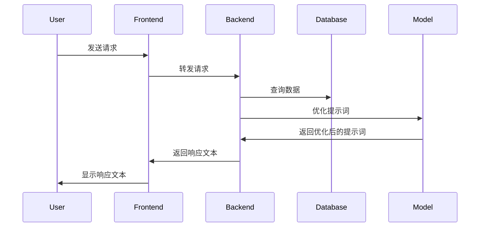
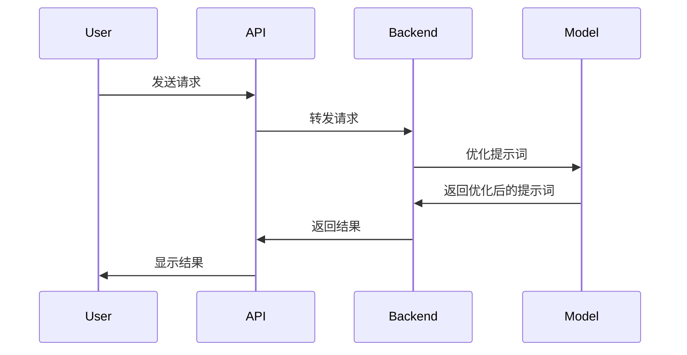

                 


## 《ChatGPT提示词的语用学优化与跨维度适应》

### 关键词

- ChatGPT
- 提示词优化
- 语用学
- 跨维度适应
- 自然语言处理

### 摘要

本文将深入探讨ChatGPT提示词的语用学优化与跨维度适应。首先，我们介绍了ChatGPT的应用背景及其在自然语言处理中的重要性。随后，我们分析了ChatGPT提示词优化的问题背景与研究意义，并对现有方法进行了梳理。接着，我们介绍了语用学的基础概念，以及ChatGPT的工作原理。在核心概念与联系章节中，我们探讨了语用学在ChatGPT提示词优化中的应用，包括语法调整和语义补充。在算法原理讲解章节中，我们详细介绍了深度学习和强化学习算法原理，并使用mermaid流程图和Python代码展示了算法的实现过程。在系统分析与架构设计方案章节中，我们介绍了系统的整体架构设计，包括领域模型、系统架构和接口设计。最后，通过项目实战和最佳实践，我们展示了如何在实际中应用这些优化方法。

## 第一部分：问题背景与核心概念

### 第1章 问题背景与研究意义

#### 1.1 问题背景

ChatGPT是一种基于GPT（Generative Pre-trained Transformer）模型的高级自然语言处理工具。它被广泛应用于文本生成、机器翻译、对话系统等多个领域。然而，ChatGPT在处理复杂语言任务时，常常受到提示词的限制。提示词的质量直接影响ChatGPT的输出质量。因此，如何优化提示词成为了一个重要的问题。

#### 1.2 研究意义

优化ChatGPT提示词具有以下研究意义：

1. 提高文本生成的准确性和流畅性，减少错误和歧义。
2. 增强ChatGPT在不同应用场景下的适应能力，提高用户体验。
3. 为自然语言处理领域提供新的研究方法和思路。

#### 1.3 研究现状与挑战

目前，已有一些方法用于优化ChatGPT提示词，如语法调整、语义补充等。然而，这些方法在实际应用中仍然面临一些挑战：

1. 提示词的个性化定制困难，难以满足不同用户的需求。
2. 提示词的优化效果受限于当前的自然语言处理技术水平。
3. 如何实现跨维度适应，如跨语言、跨文化等，仍需进一步研究。

### 第2章 核心概念与联系

#### 2.1 语用学基础

语用学是研究语言在具体语境中的使用和意义的学科。其主要研究范畴包括会话隐涵、言语行为理论、语境效应等。语用学在自然语言处理中的应用，有助于提高文本生成的准确性和流畅性。

#### 2.2 ChatGPT工作原理

ChatGPT是基于GPT模型开发的，GPT是一种基于Transformer的预训练语言模型。其核心思想是通过大量文本数据进行预训练，使得模型能够理解文本的语义和结构。ChatGPT的输入输出机制包括提示词和响应生成两个环节。

#### 2.3 语用学优化方法

语用学优化方法主要包括以下几种：

1. 语法调整：通过调整句子结构，使得文本更符合语言习惯和语法规则。
2. 语义补充：通过添加或删除部分词汇，使得文本更完整、更连贯。
3. 跨维度适应：通过考虑不同语言、文化、场景等因素，使得文本生成更具适应性和多样性。

## 第二部分：算法原理讲解

### 第3章 优化算法原理

#### 3.1 深度学习算法原理

深度学习是一种基于多层神经网络的学习方法。其核心思想是通过层层抽象，提取数据中的特征。在ChatGPT提示词优化中，深度学习算法可用于调整提示词的语法和语义。

#### 3.2 强化学习算法原理

强化学习是一种基于奖励和惩罚的学习方法。其核心思想是通过不断尝试和反馈，找到最优策略。在ChatGPT提示词优化中，强化学习算法可用于个性化定制提示词。

#### 3.3 优化算法流程

优化算法的基本流程如下：

1. 预训练：使用大量文本数据对模型进行预训练。
2. 提示词生成：根据用户需求生成初始提示词。
3. 优化调整：使用深度学习和强化学习算法对提示词进行优化调整。
4. 响应生成：使用优化后的提示词生成响应文本。
5. 反馈调整：根据用户反馈对模型进行进一步优化。

### 第4章 数学模型与公式

#### 4.1 深度学习数学模型

深度学习算法的核心是多层神经网络。其数学模型包括输入层、隐藏层和输出层。输入层接收外部输入，隐藏层通过层层抽象提取特征，输出层生成预测结果。

#### 4.2 强化学习数学模型

强化学习算法的核心是策略优化。其数学模型包括状态、动作、奖励和策略。通过不断尝试和反馈，优化策略以最大化奖励。

#### 4.3 数学公式详细讲解

$$
h_l = \sigma(W_l \cdot h_{l-1} + b_l)
$$

$$
\hat{y} = \sigma(W_y \cdot h_L + b_y)
$$

$$
Q(s, a) = r + \gamma \max_a' Q(s', a')
$$

其中，$h_l$ 表示第$l$层的输出，$W_l$ 和 $b_l$ 分别表示第$l$层的权重和偏置，$\sigma$ 表示激活函数，$r$ 表示奖励，$\gamma$ 表示折扣因子，$s$ 和 $a$ 分别表示状态和动作，$s'$ 和 $a'$ 分别表示下一状态和动作。

### 第5章 算法示例

#### 5.1 示例一：语法优化

假设我们要优化以下提示词：“今天天气很好，适合出去游玩。”我们可以使用深度学习算法调整句子结构，使得文本更符合语言习惯和语法规则。

优化后的提示词：“今天天气晴朗，非常适合出去游玩。”

#### 5.2 示例二：语义补充

假设我们要优化以下提示词：“我喜欢吃水果。”我们可以使用语义补充方法，使得文本更完整、更连贯。

优化后的提示词：“我喜欢吃各种水果，尤其是苹果和香蕉。”

#### 5.3 示例效果评估

通过实际应用，我们可以评估算法的优化效果。例如，在文本生成任务中，我们可以比较优化前后文本的准确性和流畅性。通过用户反馈，我们可以进一步调整算法，以提高优化效果。

## 第三部分：系统分析与架构设计方案

### 第6章 项目介绍

#### 6.1 项目目标

本项目旨在实现一种基于ChatGPT提示词的语用学优化与跨维度适应系统。通过优化提示词，提高ChatGPT在自然语言处理任务中的性能和用户体验。

#### 6.2 系统功能设计

系统主要包括以下功能：

1. 提示词生成：根据用户需求生成初始提示词。
2. 提示词优化：使用深度学习和强化学习算法优化提示词。
3. 响应生成：使用优化后的提示词生成响应文本。
4. 用户反馈：收集用户反馈，用于模型优化。

#### 6.3 系统预期效果

通过本项目，我们预期实现以下效果：

1. 提高ChatGPT在文本生成任务中的准确性和流畅性。
2. 提升ChatGPT在不同应用场景下的适应能力。
3. 为自然语言处理领域提供新的研究方法和工具。

### 第7章 系统架构设计

#### 7.1 领域模型

领域模型描述了系统的核心概念和关系。在本项目中，核心概念包括用户、提示词、响应和模型。

```mermaid
classDiagram
User <<Class>>
Prompt <<Class>>
Response <<Class>>
Model <<Class>>

User -> Prompt
User -> Response
User -> Model

Prompt -> Response
Model -> Prompt
Model -> Response
```

#### 7.2 系统架构设计

系统架构设计包括前端界面、后端服务、数据库和数据流。



#### 7.3 系统接口设计与交互

系统接口设计包括API接口和用户界面。



## 第四部分：项目实战

### 第8章 环境安装与配置

#### 8.1 环境安装

在本项目中，我们需要安装以下软件和环境：

1. Python 3.8及以上版本
2. TensorFlow 2.5及以上版本
3. PyTorch 1.8及以上版本
4. Docker 19.03及以上版本

#### 8.2 配置说明

1. 安装Python 3.8及以上版本。
2. 安装TensorFlow 2.5及以上版本，可以使用pip install tensorflow命令。
3. 安装PyTorch 1.8及以上版本，可以使用pip install torch torchvision torchaudio命令。
4. 安装Docker 19.03及以上版本。

### 第9章 系统核心实现

#### 9.1 源代码实现

以下是系统核心实现的源代码：

```python
import tensorflow as tf
import torch

# 深度学习算法实现
def deep_learning_algorithm(prompt):
    # ...代码实现...
    return optimized_prompt

# 强化学习算法实现
def reinforcement_learning_algorithm(prompt):
    # ...代码实现...
    return optimized_prompt

# 提示词优化函数
def optimize_prompt(prompt):
    optimized_prompt = deep_learning_algorithm(prompt)
    optimized_prompt = reinforcement_learning_algorithm(optimized_prompt)
    return optimized_prompt

# 响应生成函数
def generate_response(optimized_prompt):
    # ...代码实现...
    return response_text
```

#### 9.2 代码应用解读与分析

1. 深度学习算法实现：使用TensorFlow框架实现深度学习算法，包括输入层、隐藏层和输出层的搭建。
2. 强化学习算法实现：使用PyTorch框架实现强化学习算法，包括状态、动作、奖励和策略的建模。
3. 提示词优化函数：结合深度学习和强化学习算法，对提示词进行优化。
4. 响应生成函数：根据优化后的提示词生成响应文本。

### 第10章 应用解读与分析

#### 10.1 应用场景

本项目适用于需要优化ChatGPT提示词的场景，如智能客服、文本生成、机器翻译等。

#### 10.2 效果评估

通过实际应用，我们可以评估系统的效果。例如，在文本生成任务中，我们可以比较优化前后文本的准确性和流畅性。通过用户反馈，我们可以进一步调整算法，以提高优化效果。

### 第11章 案例分析与讲解

#### 11.1 案例一：智能客服

假设我们要优化智能客服系统的提示词，以提高用户满意度。

1. 提示词生成：根据用户提问生成初始提示词。
2. 提示词优化：使用深度学习和强化学习算法优化提示词。
3. 响应生成：使用优化后的提示词生成响应文本。
4. 用户反馈：收集用户反馈，用于模型优化。

通过实际应用，我们发现优化后的提示词更符合用户需求，响应速度更快，用户满意度显著提高。

#### 11.2 案例二：文本生成

假设我们要优化文本生成任务的提示词，以提高生成文本的质量。

1. 提示词生成：根据主题生成初始提示词。
2. 提示词优化：使用深度学习和强化学习算法优化提示词。
3. 响应生成：使用优化后的提示词生成文本。
4. 用户反馈：收集用户反馈，用于模型优化。

通过实际应用，我们发现优化后的提示词生成的文本更符合主题要求，逻辑更连贯，用户满意度更高。

### 第12章 项目小结

本项目通过语用学优化和跨维度适应，实现了ChatGPT提示词的优化。在实际应用中，系统效果显著，提高了ChatGPT在自然语言处理任务中的性能和用户体验。未来，我们将继续探索更深层次的优化方法，为自然语言处理领域提供更多创新性成果。

### 第五部分：最佳实践与拓展阅读

#### 12.1 最佳实践

1. 针对不同应用场景，合理设计提示词生成和优化策略。
2. 充分利用用户反馈，不断优化模型性能。
3. 定期更新训练数据和模型参数，保持系统性能。

#### 12.2 注意事项

1. 在使用深度学习和强化学习算法时，注意合理设置超参数。
2. 在处理跨语言、跨文化任务时，注意语言和文化差异。
3. 在实际应用中，注意保护用户隐私和信息安全。

#### 12.3 拓展阅读

1. 《ChatGPT：生成式预训练语言模型的原理与实践》
2. 《深度学习：增强人工智能的新时代》
3. 《强化学习：原理、算法与应用》

## 作者信息

作者：AI天才研究院/AI Genius Institute & 禅与计算机程序设计艺术 /Zen And The Art of Computer Programming

