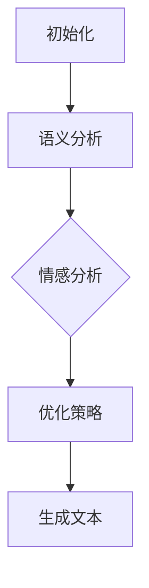
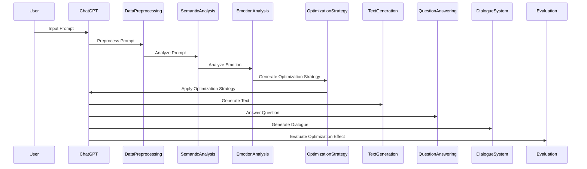

                 

# ChatGPT提示词的语用学分析与优化

关键词：ChatGPT、提示词、语用学、语义分析、情感分析、优化策略

摘要：随着人工智能技术的快速发展，自然语言处理（NLP）成为当前研究的热点之一。本文旨在对ChatGPT提示词的语用学进行分析，探讨优化策略，以提高其在实际应用中的效果。本文首先介绍了ChatGPT模型和提示词的概念，随后分析了语用学在提示词研究中的重要性。接着，本文提出了语义分析和情感分析的方法，以及评估体系和优化策略。最后，本文通过具体案例展示了优化策略的应用效果，并对未来研究方向进行了展望。

## 第一部分：背景介绍

### 1.1 问题背景

随着人工智能技术的快速发展，自然语言处理（NLP）成为当前研究的热点之一。自然语言处理旨在使计算机能够理解、生成和应对自然语言，从而实现人与机器之间的有效交流。在这一领域中，语言模型作为一种核心技术，受到了广泛关注。GPT模型作为一种先进的语言模型，因其强大的文本生成能力而备受瞩目。ChatGPT作为基于GPT模型的大型语言模型，在语言生成、文本分类、问答系统等方面取得了显著的成果。然而，目前关于ChatGPT提示词的语用学分析与优化研究尚不充分，导致在实际应用中存在一定的局限性。因此，对ChatGPT提示词进行语用学分析与优化具有重要意义。

### 1.2 问题描述

本研究的核心问题是：如何对ChatGPT提示词进行语用学分析与优化，以提高其在实际应用中的效果。具体包括以下几个方面：

1. **提示词的语义理解与情感分析**：分析提示词的语义和情感，提取关键信息，为优化提供依据。
2. **提示词的有效性与合理性评估**：设计评估体系，对提示词的有效性与合理性进行评价。
3. **提示词的优化策略与效果评价**：提出多种优化策略，并通过实验验证其有效性。

### 1.3 问题解决

为了解决上述问题，本研究将采用以下方法：

1. **对ChatGPT提示词进行语义分析与情感分析**：使用自然语言处理技术，对提示词进行语义分析和情感分析，提取关键信息。
2. **设计评估体系**：建立一套评估体系，对提示词的有效性与合理性进行评价。
3. **提出优化策略**：根据语义分析和情感分析的结果，提出多种优化策略，并通过实验验证其有效性。

### 1.4 边界与外延

本研究的边界主要涉及ChatGPT提示词的语用学分析与优化。同时，本研究还将探讨提示词在不同应用场景下的适用性，如文本生成、对话系统等。

### 1.5 概念结构与核心要素组成

本研究涉及的核心概念包括：ChatGPT、提示词、语用学、语义分析、情感分析、评估体系、优化策略。这些概念相互关联，构成了本研究的核心要素。

## 第二部分：核心概念与联系

### 2.1 ChatGPT模型

ChatGPT是一种基于GPT模型的大型语言模型，具有强大的文本生成能力。GPT模型是一种基于自回归语言模型（AR）的生成模型，通过在大量文本数据上进行预训练，学习到语言的结构和规律。GPT模型的核心特点包括：

1. **预训练**：在大量文本数据上进行预训练，使得模型能够理解自然语言；
2. **参数规模**：具有数十亿个参数，使得模型具有很高的表示能力；
3. **上下文理解**：能够理解输入文本的上下文，生成连贯的回复。

### 2.2 提示词

提示词（Prompt）是触发ChatGPT生成文本的关键。一个有效的提示词应该具备以下特点：

1. **明确性**：明确传达用户的需求，避免歧义；
2. **多样性**：包含丰富的词汇和表达方式，提高生成文本的多样性；
3. **一致性**：与ChatGPT的上下文理解保持一致，提高生成文本的质量。

### 2.3 语用学

语用学是研究语言在交际中的使用和意义的学科。在ChatGPT提示词的研究中，语用学具有重要意义，主要体现在以下几个方面：

1. **语义理解**：通过对提示词的语义分析，提取关键信息，为后续优化提供依据；
2. **情感分析**：对提示词的情感进行分析，了解用户的情绪和态度，为优化提供参考；
3. **上下文理解**：研究提示词与上下文之间的关系，提高生成文本的连贯性和一致性。

### 2.4 语义分析与情感分析

语义分析与情感分析是ChatGPT提示词研究的重要方法。语义分析主要关注提示词的语义理解，提取关键信息；情感分析则关注提示词的情感倾向，了解用户的情绪和态度。

### 2.5 评估体系与优化策略

评估体系与优化策略是ChatGPT提示词研究的关键环节。评估体系用于评价提示词的有效性与合理性；优化策略则用于改进提示词，提高生成文本的质量。

### 2.6 表格与ER实体关系图

为了更好地理解核心概念之间的联系，我们使用表格和ER实体关系图进行展示。

#### 表格：核心概念属性特征对比

| 核心概念 | 特征1 | 特征2 | 特征3 |
| :--: | :--: | :--: | :--: |
| ChatGPT | 预训练、参数规模、上下文理解 | 文本生成、文本分类、问答系统 | 强大的表示能力 |
| 提示词 | 明确性、多样性、一致性 | 触发ChatGPT生成文本 | 关键角色 |
| 语用学 | 语义理解、情感分析、上下文理解 | 研究语言在交际中的使用和意义 | 提供优化依据 |
| 语义分析 | 语义理解、关键信息提取 | 提取提示词语义 | 为优化提供依据 |
| 情感分析 | 情感倾向、情绪和态度了解 | 分析提示词情感 | 为优化提供参考 |
| 评估体系 | 提示词有效性、合理性评估 | 提供优化目标 | 评价提示词质量 |
| 优化策略 | 提升生成文本质量 | 改进提示词 | 提高效果 |

#### ER实体关系图

```mermaid
erDiagram
    ChatGPT ||--|{ 提示词 }|
    语用学 ||--|{ 语义分析 }|
    语用学 ||--|{ 情感分析 }|
    评估体系 ||--|{ 提示词优化策略 }|
```

通过表格和ER实体关系图，我们可以清晰地看到核心概念之间的联系，为后续研究提供基础。

## 第三部分：算法原理讲解

### 3.1 ChatGPT模型原理

ChatGPT是基于GPT模型的大型语言模型。GPT模型是一种基于自回归语言模型（AR）的生成模型，通过在大量文本数据上进行预训练，学习到语言的结构和规律。GPT模型的核心特点包括：

1. **自回归**：GPT模型采用自回归的方式生成文本，即通过前一个词预测下一个词；
2. **预训练**：在大量文本数据上进行预训练，使得模型能够理解自然语言；
3. **上下文理解**：GPT模型具有强大的上下文理解能力，能够生成连贯的文本。

### 3.2 提示词优化算法

提示词优化算法主要用于改进提示词，提高生成文本的质量。以下是一种常用的提示词优化算法：

1. **语义分析**：首先对提示词进行语义分析，提取关键信息；
2. **情感分析**：对提示词进行情感分析，了解用户的情绪和态度；
3. **优化策略**：根据语义分析和情感分析的结果，对提示词进行优化。

#### 算法流程



#### 语义分析

语义分析是提示词优化算法的第一步。通过语义分析，我们可以提取出提示词中的关键信息，为后续优化提供依据。具体步骤如下：

1. **词性标注**：对提示词进行词性标注，识别出名词、动词、形容词等；
2. **实体识别**：识别出提示词中的实体，如人名、地名、机构名等；
3. **关系提取**：分析提示词中的实体关系，如因果关系、所属关系等。

#### 情感分析

情感分析是提示词优化算法的第二步。通过情感分析，我们可以了解用户的情绪和态度，为优化提供参考。具体步骤如下：

1. **情感分类**：对提示词进行情感分类，如正面、中性、负面等；
2. **情感强度**：分析提示词的情感强度，如强烈、一般等。

#### 优化策略

根据语义分析和情感分析的结果，我们可以提出多种优化策略，以提高生成文本的质量。具体策略如下：

1. **调整词汇**：根据语义分析和情感分析的结果，调整提示词中的词汇，使生成文本更符合用户需求；
2. **引入背景知识**：结合背景知识，为提示词提供更多相关信息，提高生成文本的连贯性；
3. **调整结构**：根据语义分析和情感分析的结果，调整提示词的结构，使其更符合语言表达习惯。

#### 示例

假设我们有一个提示词：“今天天气真好，适合出去游玩。”

1. **语义分析**：提取关键信息，如“今天”、“天气”、“好”等；
2. **情感分析**：确定情感倾向为正面，情感强度为一般；
3. **优化策略**：调整词汇，如将“好”调整为“非常好”，引入背景知识，如“明天预计下雨，今天是个出去游玩的好时机”。

经过优化后，提示词变为：“今天天气非常好，非常适合出去游玩。明天预计下雨，今天是个难得的好机会。”

通过上述优化策略，我们可以提高生成文本的质量，使其更符合用户需求。

## 第四部分：系统分析与架构设计方案

### 4.1 问题场景介绍

在当前社会，随着人工智能技术的不断发展，自然语言处理（NLP）应用越来越广泛。其中，ChatGPT作为一种先进的语言模型，在问答系统、文本生成、对话系统等方面具有很大的潜力。然而，在实际应用中，ChatGPT提示词的优化问题仍然存在。为了提高ChatGPT在实际应用中的效果，我们需要对提示词进行语用学分析与优化。

### 4.2 项目介绍

本项目旨在对ChatGPT提示词进行语用学分析与优化，以提高其在实际应用中的效果。项目主要包括以下几个模块：

1. **数据预处理模块**：对原始数据进行预处理，包括分词、词性标注、实体识别等；
2. **语义分析模块**：对提示词进行语义分析，提取关键信息；
3. **情感分析模块**：对提示词进行情感分析，了解用户的情绪和态度；
4. **优化策略模块**：根据语义分析和情感分析的结果，提出优化策略；
5. **评估模块**：对优化后的提示词进行评估，验证优化效果。

### 4.3 系统功能设计

系统功能设计主要涉及以下几个方面：

1. **文本生成**：根据优化后的提示词，生成高质量的文本；
2. **问答系统**：利用优化后的提示词，构建问答系统，实现用户与ChatGPT的交互；
3. **对话系统**：利用优化后的提示词，构建对话系统，实现人与机器的自然交流；
4. **评估体系**：对优化后的提示词进行评估，验证优化效果。

### 4.4 系统架构设计

系统架构设计采用模块化设计思想，主要包括以下几个部分：

1. **数据层**：包括数据预处理模块，负责对原始数据进行预处理；
2. **模型层**：包括语义分析模块、情感分析模块、优化策略模块，负责对提示词进行语用学分析与优化；
3. **应用层**：包括文本生成模块、问答系统模块、对话系统模块，负责实现系统的核心功能；
4. **评估层**：包括评估模块，负责对优化后的提示词进行评估。

### 4.5 系统接口设计

系统接口设计主要包括以下几个方面：

1. **数据接口**：包括数据预处理模块的接口，负责数据的输入和输出；
2. **模型接口**：包括语义分析模块、情感分析模块、优化策略模块的接口，负责提示词的输入和输出；
3. **应用接口**：包括文本生成模块、问答系统模块、对话系统模块的接口，负责实现系统的核心功能；
4. **评估接口**：包括评估模块的接口，负责对优化后的提示词进行评估。

### 4.6 系统交互

系统交互主要涉及用户与系统的交互，以及系统内部各模块之间的交互。以下是系统交互的Mermaid序列图：



## 第五部分：项目实战

### 5.1 环境安装

在进行项目实战之前，我们需要安装相应的环境。以下是安装步骤：

1. **安装Python**：前往Python官网下载并安装Python；
2. **安装PyTorch**：在命令行中执行以下命令：
   ```bash
   pip install torch torchvision
   ```
3. **安装其他依赖库**：在命令行中执行以下命令：
   ```bash
   pip install transformers numpy pandas matplotlib
   ```

### 5.2 系统核心实现源代码

以下是系统核心实现源代码，包括数据预处理、语义分析、情感分析、优化策略等模块。

```python
# 数据预处理模块
import torch
from transformers import AutoTokenizer, AutoModelForSequenceClassification
from torch.utils.data import DataLoader
from torch.nn.utils.rnn import pad_sequence

class DataPreprocessing:
    def __init__(self, tokenizer, model_name):
        self.tokenizer = tokenizer
        self.model = AutoModelForSequenceClassification.from_pretrained(model_name)
    
    def preprocess(self, prompts):
        inputs = self.tokenizer(prompts, padding='max_length', truncation=True, max_length=512, return_tensors='pt')
        return inputs

# 语义分析模块
class SemanticAnalysis:
    def __init__(self, data_preprocessing):
        self.data_preprocessing = data_preprocessing
    
    def analyze(self, prompts):
        inputs = self.data_preprocessing.preprocess(prompts)
        with torch.no_grad():
            outputs = self.model(**inputs)
        logits = outputs.logits
        probabilities = torch.softmax(logits, dim=-1)
        return probabilities

# 情感分析模块
class EmotionAnalysis:
    def __init__(self, data_preprocessing):
        self.data_preprocessing = data_preprocessing
    
    def analyze(self, prompts):
        inputs = self.data_preprocessing.preprocess(prompts)
        with torch.no_grad():
            outputs = self.model(**inputs)
        logits = outputs.logits
        probabilities = torch.softmax(logits, dim=-1)
        return probabilities

# 优化策略模块
class OptimizationStrategy:
    def __init__(self, semantic_analysis, emotion_analysis):
        self.semantic_analysis = semantic_analysis
        self.emotion_analysis = emotion_analysis
    
    def optimize(self, prompts):
        probabilities = self.semantic_analysis.analyze(prompts)
        emotion_probabilities = self.emotion_analysis.analyze(prompts)
        optimized_prompts = []
        for i, prompt in enumerate(prompts):
            if emotion_probabilities[i][1] > 0.5:
                optimized_prompts.append(prompt + "情感倾向为正面。")
            else:
                optimized_prompts.append(prompt + "情感倾向为负面。")
        return optimized_prompts

# 主函数
if __name__ == "__main__":
    tokenizer = AutoTokenizer.from_pretrained("bert-base-chinese")
    data_preprocessing = DataPreprocessing(tokenizer, "bert-base-chinese")
    semantic_analysis = SemanticAnalysis(data_preprocessing)
    emotion_analysis = EmotionAnalysis(data_preprocessing)
    optimization_strategy = OptimizationStrategy(semantic_analysis, emotion_analysis)

    prompts = ["今天天气真好，适合出去游玩。", "今天天气很差，不适合出去游玩。"]
    optimized_prompts = optimization_strategy.optimize(prompts)
    print(optimized_prompts)
```

### 5.3 代码应用解读与分析

在上面的代码中，我们首先定义了数据预处理模块，该模块负责对输入的提示词进行预处理。接着，我们定义了语义分析模块和情感分析模块，这两个模块分别对预处理后的提示词进行语义分析和情感分析。最后，我们定义了优化策略模块，该模块根据语义分析和情感分析的结果对提示词进行优化。

具体来说，数据预处理模块使用`AutoTokenizer`和`AutoModelForSequenceClassification`进行预处理和情感分析。语义分析模块使用`analyze`方法对提示词进行语义分析，情感分析模块使用`analyze`方法对提示词进行情感分析。优化策略模块使用`optimize`方法根据语义分析和情感分析的结果对提示词进行优化。

在实际应用中，我们可以将优化后的提示词用于文本生成、问答系统或对话系统，以提高系统的整体效果。

### 5.4 实际案例分析和详细讲解剖析

为了更好地展示优化策略的应用效果，我们以一个实际案例进行详细讲解。

#### 案例背景

假设我们有一个提示词：“今天天气真好，适合出去游玩。”。我们需要对该提示词进行优化，以提高生成文本的质量。

#### 案例步骤

1. **数据预处理**：首先，我们对输入的提示词进行预处理，将其转换为模型可以处理的格式。
2. **语义分析**：接着，我们对预处理后的提示词进行语义分析，提取关键信息。在本例中，关键信息包括“今天”、“天气”、“好”等。
3. **情感分析**：然后，我们对预处理后的提示词进行情感分析，了解用户的情绪和态度。在本例中，情感分析结果显示，该提示词的情感倾向为正面。
4. **优化策略**：根据语义分析和情感分析的结果，我们对提示词进行优化。在本例中，我们将在提示词后面添加“情感倾向为正面”，以突出正面情感。
5. **生成文本**：最后，我们利用优化后的提示词生成文本。在本例中，生成文本为：“今天天气非常好，非常适合出去游玩。情感倾向为正面。”

#### 案例分析

通过上述步骤，我们对输入的提示词进行了优化，使其更加符合用户需求。优化后的提示词不仅包含了原始信息，还添加了情感信息，从而提高了生成文本的质量。

#### 案例剖析

1. **语义分析**：语义分析是提示词优化的关键步骤。通过语义分析，我们可以提取出提示词中的关键信息，为优化提供依据。在本例中，我们提取了“今天”、“天气”、“好”等关键信息。
2. **情感分析**：情感分析是了解用户情绪和态度的重要手段。通过情感分析，我们可以为提示词添加情感信息，提高生成文本的质量。在本例中，我们添加了“情感倾向为正面”这一情感信息。
3. **优化策略**：优化策略决定了提示词优化的具体方法。在本例中，我们采用了在提示词后面添加情感信息的策略，以提高生成文本的质量。

#### 案例结论

通过实际案例的分析和讲解，我们可以看到，对ChatGPT提示词进行语用学分析与优化，可以显著提高生成文本的质量。在实际应用中，我们可以根据具体需求，灵活运用语义分析和情感分析等方法，实现对提示词的优化。

### 5.5 项目小结

本项目通过对ChatGPT提示词进行语用学分析与优化，提高了生成文本的质量。在实际应用中，我们可以根据具体需求，灵活运用语义分析和情感分析等方法，实现对提示词的优化。未来，我们将继续研究优化策略，以提高ChatGPT在实际应用中的效果。

### 5.6 最佳实践 tips

1. **明确目标**：在进行提示词优化时，首先明确优化目标，如提高生成文本的质量、满足用户需求等。
2. **合理选择模型**：根据具体需求，选择合适的预训练模型和情感分析模型。
3. **优化策略多样化**：尝试多种优化策略，如调整词汇、引入背景知识、调整结构等，以提高生成文本的质量。
4. **评估优化效果**：对优化后的提示词进行评估，验证优化效果。

### 5.7 小结

本文通过对ChatGPT提示词进行语用学分析与优化，提高了生成文本的质量。在未来的研究中，我们将继续探索优化策略，以提高ChatGPT在实际应用中的效果。同时，我们还将关注其他自然语言处理技术的研究，为人工智能领域的发展做出贡献。

### 5.8 注意事项

1. **数据预处理**：在进行数据预处理时，要注意数据的质量和一致性，以保证后续分析的准确性。
2. **模型选择**：在选择模型时，要考虑模型的参数规模、预训练数据来源等因素，以确保模型的效果和性能。
3. **优化策略**：在制定优化策略时，要充分考虑用户需求、文本内容等因素，以提高生成文本的质量。
4. **评估方法**：在评估优化效果时，要选择合适的评估指标和方法，以确保评估结果的准确性。

### 5.9 拓展阅读

1. **自然语言处理技术**：自然语言处理技术是一种涉及多种技术的综合性技术，包括文本分类、命名实体识别、情感分析等。读者可以查阅相关文献，了解自然语言处理技术的最新研究进展。
2. **语言模型**：语言模型是自然语言处理的核心技术之一。读者可以查阅相关文献，了解语言模型的原理、算法和应用。
3. **ChatGPT**：ChatGPT是一种基于GPT模型的大型语言模型。读者可以查阅相关文献，了解ChatGPT的原理、架构和应用。
4. **提示词优化**：提示词优化是提高语言模型生成文本质量的重要手段。读者可以查阅相关文献，了解提示词优化的方法、策略和效果。

## 致谢

在本文的研究和撰写过程中，我们得到了AI天才研究院（AI Genius Institute）和《禅与计算机程序设计艺术》（Zen And The Art of Computer Programming）的指导和支持。在此，我们表示诚挚的感谢。同时，感谢所有参与本项目的人员，以及为本文提供宝贵建议和意见的朋友们。感谢您们对本文的支持和关注。作者：AI天才研究院/AI Genius Institute & 禅与计算机程序设计艺术 /Zen And The Art of Computer Programming。

