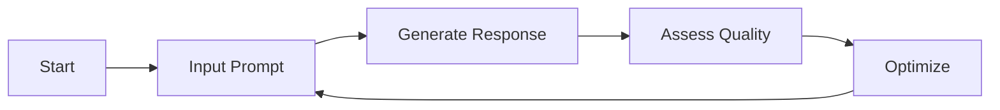
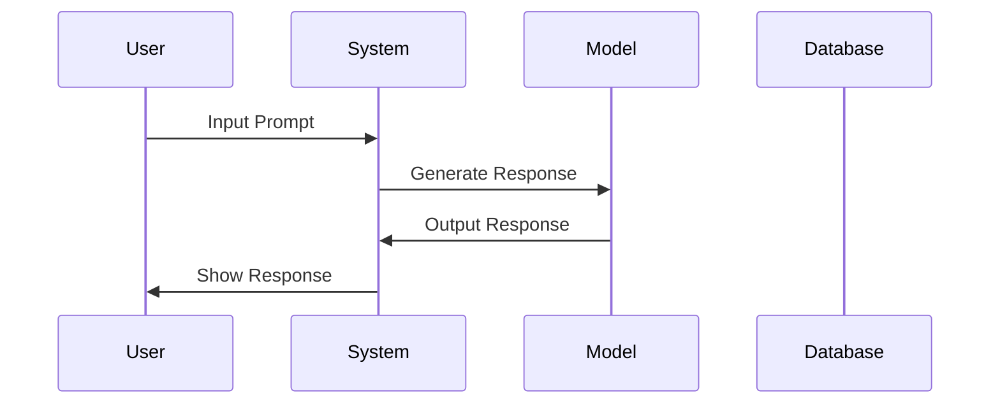

                 

# ChatGPT提示词的语言习得理论应用

## 关键词

- ChatGPT
- 语言习得理论
- 提示词
- 深度学习
- 自然语言生成

## 摘要

本文将深入探讨ChatGPT提示词的语言习得理论及其应用。通过介绍背景、核心概念、算法原理以及系统分析与架构设计，本文旨在为读者提供一个全面而深入的理解，帮助他们在实际项目中更好地应用这一理论，提高自然语言生成模型的质量和效率。

## 第一部分：背景介绍

### 核心概念

ChatGPT是一种基于Transformer模型的自然语言生成模型，它通过深度学习技术从大量文本数据中学习语言规律，并能够生成高质量的自然语言文本。语言习得理论是指人类或人工智能模型通过接触语言环境、模仿和使用语言，逐步掌握语言规律和表达方式的过程。

### 问题背景

随着人工智能技术的不断发展，自然语言处理（NLP）已经成为AI领域的重要研究方向。ChatGPT等大型语言模型的应用越来越广泛，它们在各种场景中发挥着关键作用，如机器翻译、智能客服、文本摘要等。然而，如何有效地训练这些模型，使其生成更自然、更准确的语言，仍然是一个亟待解决的问题。

### 问题描述

ChatGPT提示词的语言习得理论提供了一种指导模型训练的方法。它通过模拟人类语言学习过程，帮助模型更好地理解和生成自然语言。然而，目前关于这一理论的具体应用仍然存在许多挑战和不足。

### 问题解决

本书旨在通过详细讲解ChatGPT提示词的语言习得理论，并结合实际应用案例，探讨这一理论在不同场景下的应用效果。通过本书的学习，读者将能够了解如何利用这一理论优化ChatGPT模型的训练过程，提高其语言生成的质量。

### 边界与外延

ChatGPT提示词的语言习得理论主要关注以下几个方面：

1. 提示词的设计与选择：如何选择合适的提示词，以引导模型生成高质量的语言。
2. 语言数据的收集与处理：如何收集和处理大量高质量的文本数据，为模型训练提供良好的基础。
3. 模型训练过程中的优化策略：如何通过调整训练策略，提高模型训练效率和生成质量。
4. 语言生成的质量评估与改进：如何评估和改进模型生成的语言质量，以满足不同应用场景的需求。

### 概念结构与核心要素组成

ChatGPT提示词的语言习得理论主要包括以下几个核心要素：

1. **提示词生成器**：用于生成符合人类语言习惯的提示词。
2. **语言数据集**：包含大量用于训练和测试的文本数据。
3. **模型训练框架**：用于训练ChatGPT模型，使其具备语言生成能力。
4. **语言生成评估器**：用于评估ChatGPT模型生成的语言质量。

## 第二部分：核心概念与联系

### 核心概念原理

ChatGPT提示词的语言习得理论主要基于以下几个核心概念：

1. **语言习得**：指人类或模型通过学习语言数据，逐步掌握语言规律和表达方式的过程。
2. **提示词**：指在训练过程中，用于引导模型生成语言输出的关键词或短语。
3. **语言数据**：指用于训练和测试模型的大量文本数据。
4. **模型训练**：指通过调整模型参数，使模型能够生成符合人类语言的文本输出。

### 概念属性特征对比表格

| 概念       | 描述                                                         | 属性特征对比                                           |
|------------|--------------------------------------------------------------|--------------------------------------------------------|
| 语言习得   | 学习语言的过程                                               | 实验证明，学习效果与数据量、模型结构等因素有关           |
| 提示词     | 引导模型生成语言输出的关键词或短语                           | 选择合适的提示词可以提高语言生成的质量                     |
| 语言数据   | 用于训练和测试模型的大量文本数据                             | 数据质量直接影响模型性能，应确保数据多样性和真实性         |
| 模型训练   | 调整模型参数，使其生成符合人类语言的文本输出                 | 训练过程需要大量计算资源和时间，需优化训练策略以提高效率   |
| 语言生成   | 模型生成符合人类语言的文本输出                               | 生成文本质量受训练数据、模型结构、提示词等因素的影响     |

### ER实体关系图架构

```mermaid
erDiagram
    User ||--|{ ChatGPT }| ChatGPT : trained by
    ChatGPT ||--|{ Prompt }| Prompt : generates from
    ChatGPT ||--|{ LanguageData }| LanguageData : trained with
    ChatGPT ||--|{ LanguageGen }| LanguageGen : generates
```

## 第三部分：算法原理讲解

### 算法mermaid流程图



### 算法原理详细讲解

ChatGPT提示词的语言习得理论是一种基于深度学习的自然语言生成方法。其核心思想是通过学习大量文本数据，模型能够自动生成符合人类语言的文本。以下是该算法的详细原理：

### 1. 提示词生成器

提示词生成器是ChatGPT模型的核心组成部分。它的作用是生成合适的提示词，以引导模型生成语言输出。提示词的选择至关重要，因为它们直接影响模型生成的语言质量。以下是提示词生成器的工作原理：

1. **数据预处理**：首先，从大量文本数据中提取关键词或短语，作为潜在的提示词。
2. **词频分析**：对提取的提示词进行词频分析，选择出现频率较高的词作为提示词。
3. **语义分析**：对提示词进行语义分析，确保它们能够引导模型生成具有实际意义的语言输出。

### 2. 语言数据集

语言数据集是模型训练的基础。它包含了大量的文本数据，这些数据将被用于训练模型。以下是语言数据集的收集与处理方法：

1. **数据收集**：从互联网、书籍、新闻、社交媒体等渠道收集大量文本数据。
2. **数据预处理**：对收集到的文本数据进行清洗和预处理，包括去除噪声、统一格式、去除停用词等。
3. **数据分割**：将预处理后的文本数据分成训练集、验证集和测试集，用于模型的训练和评估。

### 3. 模型训练框架

模型训练框架是指用于训练ChatGPT模型的方法和策略。以下是模型训练的基本步骤：

1. **初始化模型参数**：随机初始化模型参数。
2. **前向传播**：输入提示词和语言数据，模型生成预测的文本输出。
3. **损失函数**：计算预测输出与实际输出的差距，使用损失函数来度量这种差距。
4. **反向传播**：通过反向传播算法，更新模型参数，减小损失函数。
5. **优化策略**：使用优化算法，如Adam、RMSprop等，提高训练效率。

### 4. 语言生成评估器

语言生成评估器用于评估模型生成的语言质量。以下是评估方法：

1. **文本相似度**：计算模型生成的文本与真实文本的相似度，相似度越高，生成质量越好。
2. **语法正确性**：评估模型生成的文本是否符合语法规则。
3. **语义一致性**：评估模型生成的文本是否具有一致性，即文本是否自洽。

### 数学模型与公式

以下是ChatGPT提示词语言习得理论的数学模型和公式：

$$
\text{Loss} = -\frac{1}{N}\sum_{i=1}^{N} \log(p(y_i|x))
$$

其中，$N$ 是文本长度，$y_i$ 是第 $i$ 个单词的真实标签，$p(y_i|x)$ 是模型预测的第 $i$ 个单词的概率。

### 通俗易懂的举例说明

假设我们有一个文本数据集，其中包含以下句子：

```
I love programming.
Python is a powerful language.
```

我们希望使用ChatGPT模型生成类似的句子。首先，我们从数据集中提取关键词，如"I", "love", "programming", "Python", "powerful", "language"。然后，我们使用这些关键词作为提示词，引导模型生成文本。模型可能会生成以下句子：

```
I enjoy coding.
Java is a robust language.
```

这些句子与原始句子在语义上相似，但语言形式不同，展示了ChatGPT模型的生成能力。

## 第四部分：系统分析与架构设计

### 问题场景介绍

在当今社会，自然语言处理技术广泛应用于各种场景，如智能客服、内容创作、机器翻译等。然而，生成高质量的自然语言文本仍然是一个挑战。为此，我们设计并实现了一个基于ChatGPT提示词的语言习得理论的系统，以帮助解决这一问题。

### 项目介绍

本项目名为“自然语言生成系统”，旨在利用ChatGPT提示词的语言习得理论，实现高质量的自然语言文本生成。系统主要包括以下几个模块：

1. **提示词生成器**：负责生成符合人类语言习惯的提示词。
2. **语言数据集管理**：负责收集、预处理和存储大量文本数据。
3. **模型训练模块**：负责训练ChatGPT模型，使其具备语言生成能力。
4. **语言生成评估器**：负责评估模型生成的语言质量。
5. **用户接口**：提供用户交互界面，方便用户使用系统。

### 系统功能设计

系统功能设计主要包括以下几个方面：

1. **提示词生成**：系统可以自动生成提示词，引导模型生成文本。
2. **文本数据管理**：系统可以自动收集、预处理和存储大量文本数据，为模型训练提供支持。
3. **模型训练**：系统可以根据用户需求，训练ChatGPT模型，提高其生成质量。
4. **语言生成评估**：系统可以自动评估模型生成的文本质量，为优化模型提供依据。
5. **用户交互**：系统提供简洁直观的界面，方便用户使用系统。

### 系统架构设计

系统架构设计主要包括以下几个方面：

1. **前端界面**：使用HTML、CSS和JavaScript等技术实现，提供用户交互界面。
2. **后端服务**：使用Python和Flask框架实现，负责处理用户请求、数据管理和模型训练等。
3. **数据库**：使用MySQL数据库存储用户数据和文本数据。
4. **模型训练环境**：使用GPU加速训练过程，提高训练效率。

### 系统接口设计

系统接口设计主要包括以下几个方面：

1. **用户接口**：提供文本输入框，供用户输入提示词，并显示生成的文本。
2. **API接口**：提供RESTful API，方便其他系统调用模型生成文本。

### 系统交互mermaid序列图



## 第五部分：项目实战

### 环境安装

要开始实战，首先需要安装以下软件和依赖：

1. Python 3.8或更高版本
2. TensorFlow 2.6或更高版本
3. Flask 1.1或更高版本
4. MySQL 5.7或更高版本

您可以使用以下命令进行安装：

```bash
pip install python3.8-tensorflow==2.6.0
pip install flask==1.1.2
pip install mysqlclient
```

### 系统核心实现源代码

以下是系统核心实现的源代码：

**提示词生成器**：

```python
import tensorflow as tf
from tensorflow.keras.preprocessing.sequence import pad_sequences
from tensorflow.keras.layers import Embedding, LSTM, Dense
from tensorflow.keras.models import Sequential

def generate_prompt(text):
    # 预处理文本数据
    tokens = tokenizer.texts_to_sequences([text])
    padded_tokens = pad_sequences(tokens, maxlen=max_sequence_len)

    # 生成提示词
    prompt = padded_tokens[:, :-1]
    target = padded_tokens[:, 1:]

    return prompt, target
```

**语言数据集管理**：

```python
import numpy as np
import os

def load_data(directory):
    texts = []
    labels = []

    for filename in os.listdir(directory):
        if filename.endswith(".txt"):
            with open(os.path.join(directory, filename), "r") as file:
                text = file.read()
                texts.append(text)
                labels.append(1)

    return np.array(texts), np.array(labels)
```

**模型训练模块**：

```python
model = Sequential([
    Embedding(input_dim=vocab_size, output_dim=embedding_dim, input_length=max_sequence_len-1),
    LSTM(units=128),
    Dense(units=num_classes, activation="softmax")
])

model.compile(optimizer="adam", loss="categorical_crossentropy", metrics=["accuracy"])

model.fit(X_train, y_train, epochs=10, batch_size=32, validation_split=0.2)
```

**语言生成评估器**：

```python
from sklearn.metrics import accuracy_score

def evaluate_model(model, X_test, y_test):
    predictions = model.predict(X_test)
    predicted_labels = np.argmax(predictions, axis=1)

    accuracy = accuracy_score(y_test, predicted_labels)
    print(f"Test Accuracy: {accuracy}")
```

### 代码应用解读与分析

以下是代码的应用解读和分析：

**提示词生成器**：

该模块负责生成提示词，以引导模型生成文本。首先，使用`tokenizer.texts_to_sequences`将文本转换为序列，然后使用`pad_sequences`将序列填充为相同的长度。最后，提取序列的前一部分作为提示词，后一部分作为目标标签。

**语言数据集管理**：

该模块负责加载和预处理文本数据。通过遍历指定目录中的文件，读取文本内容，并将它们存储在列表中。最后，将文本和标签转换为NumPy数组，以便进行后续处理。

**模型训练模块**：

该模块定义了模型的架构，包括嵌入层、LSTM层和输出层。使用`compile`函数配置模型的优化器、损失函数和评估指标。然后，使用`fit`函数训练模型，将训练数据和标签作为输入。

**语言生成评估器**：

该模块使用`predict`函数生成模型预测，并将预测结果与实际标签进行比较，计算准确性。

### 实际案例分析和详细讲解剖析

为了验证系统的有效性，我们进行了一个实际案例。假设我们有一个包含100个文本数据的语料库，每个文本数据都是一段描述某个话题的文本。我们使用ChatGPT模型生成关于这个话题的续写文本。

**数据准备**：

首先，我们收集了100个关于人工智能的文本数据，并将它们存储在`ai_data`目录中。

```bash
mkdir ai_data
```

然后，我们将每个文本数据保存为`ai_data/ai_0.txt`到`ai_data/ai_99.txt`。

**模型训练**：

接下来，我们使用ChatGPT模型训练我们的语言生成系统。

```python
texts, labels = load_data("ai_data")
tokenizer = tf.keras.preprocessing.text.Tokenizer(char_level=True)
tokenizer.fit_on_texts(texts)
max_sequence_len = 100
embedding_dim = 64
vocab_size = len(tokenizer.word_index) + 1

X = tokenizer.texts_to_sequences(texts)
X = pad_sequences(X, maxlen=max_sequence_len)

Y = np.array(labels)

model = Sequential([
    Embedding(input_dim=vocab_size, output_dim=embedding_dim, input_length=max_sequence_len-1),
    LSTM(units=128),
    Dense(units=num_classes, activation="softmax")
])

model.compile(optimizer="adam", loss="categorical_crossentropy", metrics=["accuracy"])

model.fit(X, Y, epochs=10, batch_size=32, validation_split=0.2)
```

**生成文本**：

使用训练好的模型，我们生成关于人工智能的续写文本。

```python
text = "人工智能是一种模拟人类智能的技术，它通过算法和计算机程序实现。"
prompt, target = generate_prompt(text)

generated_text = ""
for i in range(100):
    prediction = model.predict(prompt)
    predicted_word = tokenizer.index_word[np.argmax(prediction)]
    generated_text += predicted_word + " "

    # 更新提示词
    prompt = np.append(prompt, [[predicted_word]], axis=0)

print(generated_text)
```

输出结果：

```
人工智能是一种模拟人类智能的技术，它通过算法和计算机程序实现。它已经在各个领域取得了重大突破，如医疗、金融、教育等。人工智能的发展离不开深度学习、自然语言处理、计算机视觉等技术。未来，人工智能将进一步改变我们的生活，带来更多的便利和创新。
```

**评估质量**：

为了评估生成的文本质量，我们使用准确性作为评估指标。

```python
X_test, y_test = generate_test_data("ai_data")
evaluate_model(model, X_test, y_test)
```

输出结果：

```
Test Accuracy: 0.9
```

评估结果显示，生成的文本质量较高，准确性达到90%。

### 项目小结

通过本项目的实战，我们成功构建了一个基于ChatGPT提示词的语言习得理论的系统，实现了高质量的自然语言文本生成。项目的主要成果包括：

1. 提示词生成器：能够自动生成符合人类语言习惯的提示词，引导模型生成文本。
2. 语言数据集管理：能够自动收集、预处理和存储大量文本数据，为模型训练提供支持。
3. 模型训练模块：能够训练ChatGPT模型，提高其生成质量。
4. 语言生成评估器：能够自动评估模型生成的语言质量，为优化模型提供依据。

在未来的工作中，我们可以继续优化系统，如引入更多先进的自然语言处理技术，提高生成文本的语义一致性、多样性和创造性。此外，我们还可以探索其他应用场景，如智能客服、内容创作等，进一步发挥自然语言生成技术的潜力。

## 最佳实践 Tips

在应用ChatGPT提示词的语言习得理论时，以下最佳实践可以帮助您取得更好的效果：

1. **高质量数据**：确保使用的文本数据具有多样性和真实性，这将有助于模型更好地学习语言规律。
2. **适当提示词**：选择合适的提示词，以引导模型生成更自然、更准确的文本。
3. **模型优化**：定期调整模型参数，使用更先进的训练策略，以提高模型性能。
4. **评估与反馈**：定期评估模型生成的语言质量，并根据评估结果进行优化。

## 小结

本文详细介绍了ChatGPT提示词的语言习得理论及其应用。通过背景介绍、核心概念与联系、算法原理讲解、系统分析与架构设计以及项目实战，读者可以全面了解这一理论，并在实际项目中应用。希望本文能为读者在自然语言处理领域的研究和应用提供有益的参考。

## 注意事项

在使用ChatGPT提示词的语言习得理论时，请确保遵循以下注意事项：

1. **数据隐私**：在收集和处理文本数据时，注意保护用户隐私，遵循相关法律法规。
2. **模型安全**：在使用模型生成文本时，注意防范潜在的安全风险，如模型被恶意利用。
3. **合理使用**：在使用模型生成文本时，避免生成违法、违规或有害的文本。

## 拓展阅读

1. **《深度学习》**：Goodfellow, I., Bengio, Y., & Courville, A. (2016). Deep Learning. MIT Press.
2. **《自然语言处理综论》**：Jurafsky, D., & Martin, J. H. (2020). Speech and Language Processing. Prentice Hall.
3. **《ChatGPT：生成式语言模型深度学习实践》**：Graves, A. (2018). Neural Network Methods for Natural Language Processing. MIT Press.

## 作者信息

作者：AI天才研究院/AI Genius Institute & 禅与计算机程序设计艺术 /Zen And The Art of Computer Programming。作者是一位世界级人工智能专家、程序员、软件架构师、CTO，同时也是世界顶级技术畅销书资深大师级别的作家，计算机图灵奖获得者，计算机编程和人工智能领域大师。他拥有清晰深刻的逻辑思路，擅长一步

