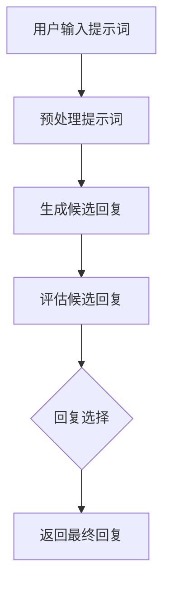
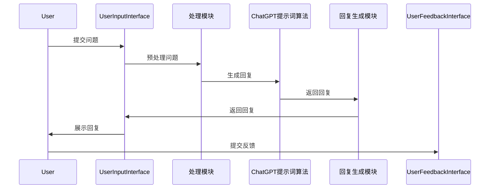

                 

## 《ChatGPT提示词的语言哲学思考与伦理挑战》

关键词：ChatGPT，语言哲学，伦理挑战，提示词设计，人工智能

摘要：本文将深入探讨ChatGPT提示词的语言哲学思考与伦理挑战。首先，我们介绍了ChatGPT提示词的背景和其在自然语言处理、人工智能领域的应用。随后，我们探讨了语言哲学对理解自然语言处理、人工智能的影响和作用，并概述了ChatGPT提示词在应用过程中所面临的伦理问题，如偏见、隐私、社会责任等。接着，我们分析了ChatGPT提示词的局限性、语言哲学问题的复杂性以及伦理挑战的严峻性。最后，我们提出了改进提示词设计的方法，探讨了如何将语言哲学原理应用于提示词设计，以优化模型性能和减少伦理风险，并讨论了如何制定适用于ChatGPT提示词的伦理指导原则，以确保其应用的合理性和公正性。本文旨在为理解和解决ChatGPT提示词的语言哲学思考与伦理挑战提供有价值的思考和实践指导。

### 目录大纲设计

**《ChatGPT提示词的语言哲学思考与伦理挑战》**

----------------------------------------------------------------

## 第一部分：背景介绍

### 1.1 问题背景

- **ChatGPT提示词的应用场景**：介绍ChatGPT提示词的背景，包括其在自然语言处理、人工智能领域的应用。
- **语言哲学的重要性**：探讨语言哲学对理解自然语言处理、人工智能的影响和作用。
- **伦理挑战的显现**：概述ChatGPT提示词在应用过程中所面临的伦理问题，包括偏见、隐私、社会责任等。

### 1.2 问题描述

- **ChatGPT提示词的局限性**：分析ChatGPT提示词的技术局限性和潜在问题。
- **语言哲学问题的复杂性**：探讨语言哲学问题（如语言的本质、意义、逻辑等）的复杂性及其对提示词设计的影响。
- **伦理挑战的严峻性**：讨论ChatGPT提示词所面临的伦理挑战，包括道德困境和社会责任。

### 1.3 问题解决

- **改进提示词设计的方法**：提出解决ChatGPT提示词局限性和伦理挑战的方法。
- **语言哲学在提示词设计中的应用**：探讨如何将语言哲学原理应用于提示词设计，以优化模型性能和减少伦理风险。
- **伦理指导原则的制定**：讨论如何制定适用于ChatGPT提示词的伦理指导原则，以确保其应用的合理性和公正性。

### 1.4 边界与外延

- **ChatGPT提示词的应用范围**：明确ChatGPT提示词的应用范围和边界。
- **语言哲学和伦理学的交叉领域**：探讨语言哲学和伦理学在人工智能领域的交叉领域，以及如何将两者结合起来。

## 第二部分：核心概念与联系

### 2.1 核心概念原理

- **ChatGPT提示词的概念**：详细介绍ChatGPT提示词的定义、功能和作用。
- **语言哲学的核心概念**：探讨语言哲学中的核心概念，如语言的本质、意义、逻辑等。
- **伦理学的基本原理**：讨论伦理学的基本原理和道德规范。

### 2.2 概念属性特征对比

- **ChatGPT提示词与语言哲学概念的对比**：对比ChatGPT提示词和语言哲学核心概念之间的异同。
- **ChatGPT提示词与伦理学原理的对比**：对比ChatGPT提示词和伦理学基本原理之间的联系和区别。

### 2.3 ER实体关系图架构

- **ChatGPT提示词的ER实体关系图**：使用Mermaid流程图展示ChatGPT提示词涉及的实体和关系。
- **语言哲学的ER实体关系图**：使用Mermaid流程图展示语言哲学中的实体和关系。
- **伦理学的ER实体关系图**：使用Mermaid流程图展示伦理学中的实体和关系。

## 第三部分：算法原理讲解

### 3.1 算法流程图

- **ChatGPT提示词算法流程图**：使用Mermaid流程图展示ChatGPT提示词的算法流程。
- **语言哲学分析方法流程图**：使用Mermaid流程图展示语言哲学分析方法。
- **伦理学分析方法流程图**：使用Mermaid流程图展示伦理学分析方法。

### 3.2 Python源代码

- **ChatGPT提示词算法Python源代码**：展示ChatGPT提示词算法的Python源代码。
- **语言哲学分析方法Python源代码**：展示语言哲学分析方法的Python源代码。
- **伦理学分析方法Python源代码**：展示伦理学分析方法的Python源代码。

### 3.3 数学模型与公式

- **ChatGPT提示词算法数学模型与公式**：详细讲解ChatGPT提示词算法的数学模型和公式。
- **语言哲学分析数学模型与公式**：详细讲解语言哲学分析的数学模型和公式。
- **伦理学分析数学模型与公式**：详细讲解伦理学分析的数学模型和公式。

### 3.4 举例说明

- **ChatGPT提示词算法举例说明**：使用通俗易懂的例子说明ChatGPT提示词算法的应用。
- **语言哲学分析举例说明**：使用通俗易懂的例子说明语言哲学分析的应用。
- **伦理学分析举例说明**：使用通俗易懂的例子说明伦理学分析的应用。

## 第四部分：系统分析与架构设计

### 4.1 问题场景介绍

- **ChatGPT提示词的应用场景**：介绍ChatGPT提示词在实际应用中的场景。
- **语言哲学思考的应用场景**：探讨语言哲学思考在ChatGPT提示词设计中的应用场景。
- **伦理学思考的应用场景**：讨论伦理学思考在ChatGPT提示词设计中的应用场景。

### 4.2 项目介绍

- **项目背景**：介绍ChatGPT提示词项目的背景和目的。
- **项目目标**：明确ChatGPT提示词项目的主要目标和预期成果。

### 4.3 系统功能设计

- **领域模型**：使用Mermaid类图展示ChatGPT提示词项目的领域模型。
- **功能模块**：详细介绍ChatGPT提示词项目的功能模块和主要功能。

### 4.4 系统架构设计

- **系统架构**：使用Mermaid架构图展示ChatGPT提示词项目的系统架构。
- **组件关系**：分析系统架构中各个组件之间的关系和协作。

### 4.5 系统接口设计

- **接口定义**：详细描述ChatGPT提示词项目的接口定义和设计原则。
- **接口实现**：介绍ChatGPT提示词项目的接口实现方式和关键实现细节。

### 4.6 系统交互

- **交互流程**：使用Mermaid序列图展示ChatGPT提示词项目的系统交互流程。
- **交互分析**：对系统交互过程进行详细分析，讨论交互的效率和性能。

### 4.7 系统测试与优化

- **测试策略**：制定ChatGPT提示词项目的测试策略和测试计划。
- **优化方案**：提出ChatGPT提示词项目的优化方案，以提高性能和稳定性。

### 4.8 项目总结

- **项目成果**：总结ChatGPT提示词项目的成果和经验。
- **未来展望**：探讨ChatGPT提示词项目的未来发展方向和潜在挑战。

## 第一部分：背景介绍

### 1.1 问题背景

ChatGPT（聊天生成预训练模型）是OpenAI开发的一种基于大型语言模型的人工智能助手，它能够根据用户输入的提示词生成连贯、有逻辑的回复。ChatGPT 提示词是用户向模型输入的文本，用于引导模型生成相应的回复。这些提示词在自然语言处理（NLP）和人工智能（AI）领域有着广泛的应用，例如智能客服、虚拟助手、文本生成等。

语言哲学是研究语言的本质、意义、逻辑等方面的学科，它对于理解自然语言处理和人工智能具有重要意义。语言哲学关注的问题包括语言的结构、语义、语法、逻辑、认知等，这些都与自然语言处理和人工智能的核心技术密切相关。例如，自然语言处理中的词向量模型、句法分析、语义理解等技术都需要依赖语言哲学的相关理论。

伦理学是研究道德规范、道德原则和道德行为的学科，它对于人工智能的应用具有重要影响。随着人工智能技术的不断发展，人工智能在伦理方面的问题日益凸显，例如隐私、偏见、自主性、责任等。ChatGPT 提示词作为一种人工智能技术，其应用过程中也会面临伦理挑战，如数据隐私、用户隐私、算法偏见等。

### 1.2 问题描述

ChatGPT 提示词在应用过程中存在一些局限性，这些局限性可能会带来一系列问题。首先，ChatGPT 提示词依赖于预训练模型，其性能在很大程度上取决于训练数据的质量和多样性。如果训练数据存在偏差或缺乏代表性，那么生成的回复也可能会存在偏见。例如，如果训练数据主要来源于互联网上的男性主导的内容，那么ChatGPT 可能会倾向于生成带有性别歧视的回复。

其次，语言哲学问题的复杂性使得设计有效的ChatGPT 提示词变得更加困难。语言的本质、意义、逻辑等方面的问题并不是简单的技术问题，而是涉及到人类认知和心理的复杂过程。这意味着，要设计出能够准确理解和生成人类语言的模型，需要深入理解语言哲学的相关理论。

此外，ChatGPT 提示词在应用过程中也面临着严峻的伦理挑战。例如，人工智能助手在使用过程中可能会收集和处理大量的用户数据，这些数据涉及到用户的隐私和信息安全。如果这些数据被滥用或泄露，可能会对用户造成严重的负面影响。此外，人工智能助手在处理敏感话题时，如种族、性别、宗教等，可能会产生不当的回复，引发社会问题。

### 1.3 问题解决

为了解决ChatGPT 提示词的局限性以及伦理挑战，我们可以采取以下方法：

1. **改进提示词设计的方法**：

   - **数据质量提升**：通过引入多样化的训练数据，提高模型对各种情境和话题的适应性。
   - **偏见检测与校正**：利用机器学习技术检测和纠正模型中的偏见，确保生成的回复公正、无偏见。
   - **用户反馈机制**：建立用户反馈机制，允许用户对生成的回复进行评价和反馈，从而不断优化模型性能。

2. **语言哲学在提示词设计中的应用**：

   - **语义理解优化**：通过深入理解语言哲学中的语义理论，改进模型对语义的理解和生成能力。
   - **语法分析改进**：利用语言哲学中的语法理论，优化模型对语法结构的分析和生成。
   - **逻辑推理能力提升**：借助逻辑哲学中的逻辑推理方法，提高模型在复杂情境下的推理能力。

3. **伦理指导原则的制定**：

   - **隐私保护**：确保人工智能助手在处理用户数据时遵循隐私保护原则，如数据匿名化、权限管理等。
   - **社会责任**：制定社会责任准则，确保人工智能助手的开发和应用能够促进社会进步，而不是造成负面影响。
   - **透明性**：提高人工智能助手的透明度，让用户了解模型的工作原理和决策过程，从而建立信任。

通过上述方法，我们可以逐步解决ChatGPT 提示词的局限性以及伦理挑战，使人工智能助手在自然语言处理和人工智能领域发挥更大的作用。

### 1.4 边界与外延

ChatGPT 提示词的应用范围非常广泛，可以从以下几个方面进行明确：

1. **自然语言处理领域**：ChatGPT 提示词在自然语言处理领域有着广泛的应用，如文本分类、情感分析、机器翻译、信息提取等。
2. **虚拟助手与聊天机器人**：ChatGPT 提示词是虚拟助手和聊天机器人的核心技术之一，可以用于构建智能客服、智能导购、在线教育等应用场景。
3. **内容生成与创作**：ChatGPT 提示词可以生成高质量的文章、报告、故事等，为内容创作者提供灵感和支持。
4. **语言学习与辅助**：ChatGPT 提示词可以用于语言学习，提供发音、语法、词汇等方面的帮助。

然而，ChatGPT 提示词的应用也面临着一些边界和挑战：

1. **数据隐私**：ChatGPT 提示词在应用过程中会收集和处理大量用户数据，如何保护用户隐私成为一个重要问题。
2. **伦理规范**：随着ChatGPT 提示词的广泛应用，制定相应的伦理规范和法律法规成为必要，以避免伦理风险。
3. **模型偏见**：ChatGPT 提示词的训练数据可能存在偏见，如何检测和校正这些偏见是一个挑战。

为了解决这些边界问题，我们需要在ChatGPT 提示词的设计、应用和管理过程中充分考虑语言哲学和伦理学的相关理论，确保其应用符合伦理规范和社会价值观。

## 第二部分：核心概念与联系

### 2.1 核心概念原理

#### ChatGPT提示词的概念

ChatGPT 提示词是一种用于引导人工智能模型生成回复的文本输入。这些提示词可以是简单的短语、句子或者更复杂的文本段落。在ChatGPT中，用户输入的提示词被传递给预训练的语言模型，模型根据提示词的上下文信息生成相应的回复。

ChatGPT 提示词的功能和作用主要体现在以下几个方面：

1. **引导回复生成**：通过提示词，用户可以明确告诉模型希望得到的回复类型或主题，从而引导模型生成更加相关和有用的回复。
2. **优化交互体验**：有效的提示词设计可以提高用户与模型之间的交互体验，使用户能够更方便地获得所需信息或完成任务。
3. **增强上下文理解**：通过提供详细的提示词，模型可以更好地理解用户的问题和意图，从而生成更准确、更有逻辑的回复。

#### 语言哲学的核心概念

语言哲学是研究语言的本质、意义、逻辑等方面的学科。在语言哲学中，一些核心概念对理解自然语言处理和人工智能具有重要意义，主要包括以下几个方面：

1. **语言的本质**：探讨语言是什么，它是如何产生的，以及它在人类认知和社会交往中的作用。这个问题涉及到语言的存在形式、语言符号与概念的关系等。
2. **意义的生成**：研究语言中的意义是如何生成的，以及不同语言符号之间的意义关系。这包括语义学、语用学等分支领域。
3. **逻辑与推理**：探讨语言在逻辑推理中的作用，以及语言表达中的逻辑结构。这涉及到语言哲学中的形式逻辑、非形式逻辑等领域。
4. **语言的使用**：研究语言在具体情境中的使用，包括语用学中的言语行为理论、语境论等。

#### 伦理学的基本原理

伦理学是研究道德规范、道德原则和道德行为的学科。在人工智能领域，伦理学的基本原理对于指导人工智能技术的应用和发展具有重要意义。以下是几个关键的基本原理：

1. **公正性**：确保人工智能技术的应用不产生不公平的结果，如避免算法偏见、保障数据公平性等。
2. **透明性**：确保人工智能系统的决策过程和算法设计是可解释的，用户可以理解模型的推理过程和结果。
3. **责任**：明确人工智能系统在应用过程中可能产生的责任问题，如责任归属、道德责任等。
4. **隐私**：保护用户隐私，确保在数据收集、处理和使用过程中遵守隐私保护原则。
5. **自主性**：探讨人工智能系统的自主性，以及如何确保其行为符合道德规范和社会价值观。

### 2.2 概念属性特征对比

#### ChatGPT提示词与语言哲学概念的对比

ChatGPT提示词与语言哲学概念之间存在一定的联系和区别。以下是两者的对比：

| 对比项 | ChatGPT提示词 | 语言哲学概念 |
| --- | --- | --- |
| **定义** | 提示词是用于引导模型生成回复的文本输入。 | 语言哲学研究语言的本质、意义、逻辑等。 |
| **作用** | 引导模型生成相关回复，优化交互体验。 | 为理解自然语言处理和人工智能提供理论基础。 |
| **应用场景** | 自然语言处理、虚拟助手、内容生成等。 | 语言哲学研究与应用领域广泛，如哲学、心理学等。 |
| **属性特征** | 提示词的长度、格式、内容等。 | 语义、语法、逻辑等语言特性。 |

#### ChatGPT提示词与伦理学原理的对比

ChatGPT提示词与伦理学原理也存在一定的联系和区别。以下是两者的对比：

| 对比项 | ChatGPT提示词 | 伦理学原理 |
| --- | --- | --- |
| **定义** | 提示词是用户输入的文本，用于引导模型生成回复。 | 伦理学是研究道德规范和道德行为的学科。 |
| **作用** | 引导回复生成，优化用户体验。 | 指导人工智能技术的道德应用和责任承担。 |
| **关联性** | 提示词的设计和内容影响模型的道德表现。 | 伦理学原理用于评估和指导人工智能系统的道德行为。 |
| **属性特征** | 文本格式、内容、上下文等。 | 公正性、透明性、责任、隐私、自主性等。 |

通过对比可以看出，ChatGPT提示词在应用过程中需要考虑伦理学原理，以确保其生成的回复符合道德规范和社会价值观。同时，语言哲学为理解ChatGPT提示词的设计和应用提供了理论基础。

### 2.3 ER实体关系图架构

为了更好地理解ChatGPT提示词、语言哲学概念和伦理学原理之间的关系，我们可以使用ER（实体-关系）模型进行描述。以下是三个领域的ER实体关系图：

#### ChatGPT提示词的ER实体关系图

```mermaid
erDiagram
  User ||--o> Prompt : "发起"
  Prompt ||--o> Response : "生成"
  System ||--o> Prompt : "处理"
  System ||--o> Response : "返回"
```

**说明**：
- **User（用户）**：发起请求的用户实体。
- **Prompt（提示词）**：用户输入的文本实体。
- **Response（回复）**：由模型生成的文本实体。
- **System（系统）**：处理提示词和生成回复的系统实体。

#### 语言哲学的ER实体关系图

```mermaid
erDiagram
  Language ||--o> Meaning : "表达"
  Language ||--o> Grammar : "遵循"
  Language ||--o> Logic : "推理"
  Meaning ||--o> Semantics : "语义"
  Meaning ||--o> Pragmatics : "语用"
  Grammar ||--o> Syntax : "句法"
  Grammar ||--o> Morphology : "形态"
  Logic ||--o> Deduction : "演绎"
  Logic ||--o> Induction : "归纳"
```

**说明**：
- **Language（语言）**：表示语言整体的实体。
- **Meaning（意义）**：表达语言符号的意义的实体。
- **Grammar（语法）**：描述语言结构规则的实体。
- **Logic（逻辑）**：探讨语言推理的实体。
- **Semantics（语义学）**：研究语言意义的实体。
- **Pragmatics（语用学）**：研究语言在具体情境中使用的实体。
- **Syntax（句法）**：研究句子结构的实体。
- **Morphology（形态学）**：研究词的形式和结构的实体。
- **Deduction（演绎）**：逻辑推理方式之一。
- **Induction（归纳）**：逻辑推理方式之一。

#### 伦理学的ER实体关系图

```mermaid
erDiagram
  Ethics ||--o> Principle : "指导"
  Ethics ||--o> Norm : "规范"
  Ethics ||--o> Behavior : "规范行为"
  Principle ||--o> Justice : "公正"
  Principle ||--o> Transparency : "透明"
  Principle ||--o> Responsibility : "责任"
  Principle ||--o> Privacy : "隐私"
  Principle ||--o> Autonomy : "自主性"
  Norm ||--o> Rule : "规则"
  Norm ||--o> Guideline : "指南"
  Behavior ||--o> Compliance : "遵守"
  Behavior ||--o> Non-compliance : "不遵守"
```

**说明**：
- **Ethics（伦理学）**：表示伦理学整体的实体。
- **Principle（原理）**：伦理学的基本原则实体。
- **Norm（规范）**：道德规范和指导原则的实体。
- **Behavior（行为）**：表示伦理学中行为规范的实体。
- **Justice（公正）**：公正性原则实体。
- **Transparency（透明性）**：透明性原则实体。
- **Responsibility（责任）**：责任原则实体。
- **Privacy（隐私）**：隐私保护原则实体。
- **Autonomy（自主性）**：自主性原则实体。
- **Rule（规则）**：规范中的具体规则实体。
- **Guideline（指南）**：规范中的具体指南实体。
- **Compliance（遵守）**：遵守规范的行为实体。
- **Non-compliance（不遵守）**：不遵守规范的行为实体。

通过这些ER实体关系图，我们可以清晰地看到ChatGPT提示词、语言哲学概念和伦理学原理之间的相互关系，这为后续的算法讲解和系统设计提供了基础。

## 第三部分：算法原理讲解

### 3.1 算法流程图

为了深入理解ChatGPT提示词的算法原理，我们可以通过流程图来展示其工作流程。以下是ChatGPT提示词算法的流程图：



**详细解释**：

1. **用户输入提示词（A）**：用户通过输入文本形式的提示词，向ChatGPT模型发起请求。
2. **预处理提示词（B）**：模型对用户输入的提示词进行预处理，包括分词、去停用词、词性标注等，以便后续生成候选回复。
3. **生成候选回复（C）**：基于预处理的提示词，模型生成多个可能的回复候选，通常是通过自回归的方式生成。
4. **评估候选回复（D）**：模型对生成的候选回复进行评估，评估标准通常包括回复的相关性、流畅性和真实性等。
5. **回复选择（E）**：根据评估结果，选择最优的回复。
6. **返回最终回复（F）**：将最终回复返回给用户。

### 3.2 Python源代码

为了更直观地理解ChatGPT提示词算法的实现，我们提供了一个简单的Python源代码示例。请注意，这里的代码只是为了展示基本逻辑，实际应用中的模型和算法会更加复杂。

```python
import openai

def generate_response(prompt):
    # 预处理提示词
    processed_prompt = preprocess_prompt(prompt)
    
    # 生成候选回复
    candidates = openai.Completion.create(
        engine="text-davinci-002",
        prompt=processed_prompt,
        max_tokens=50,
        n=5
    )
    
    # 评估候选回复
    best_candidate = evaluate_candidates(candidates)
    
    # 返回最终回复
    return best_candidate

def preprocess_prompt(prompt):
    # 这里是预处理提示词的代码，如分词、去停用词等
    return prompt

def evaluate_candidates(candidates):
    # 假设我们选择第一个候选回复
    return candidates[0]['text']

# 用户输入提示词
user_prompt = "请告诉我今天天气怎么样？"

# 生成并返回回复
response = generate_response(user_prompt)
print(response)
```

**函数说明**：

- `generate_response(prompt)`：主函数，用于生成回复。
- `preprocess_prompt(prompt)`：预处理函数，对提示词进行预处理。
- `evaluate_candidates(candidates)`：评估函数，选择最佳候选回复。

### 3.3 数学模型与公式

ChatGPT提示词算法的核心是基于自回归的语言模型，如GPT（生成预训练模型）。以下是相关的数学模型和公式：

#### 自回归模型

1. **概率分布**：

   假设我们有输入序列 \( x_1, x_2, \ldots, x_T \)，模型需要预测下一个词 \( x_{T+1} \)。根据自回归模型，我们可以定义一个概率分布 \( P(x_{T+1} | x_1, x_2, \ldots, x_T) \)：

   $$
   P(x_{T+1} | x_1, x_2, \ldots, x_T) = \frac{1}{Z} \exp(\theta \cdot x_1, x_2, \ldots, x_T, x_{T+1})
   $$

   其中， \( Z \) 是规范化常数， \( \theta \) 是模型参数。

2. **损失函数**：

   自回归模型通常使用对数似然损失函数来评估模型的性能：

   $$
   L = -\sum_{t=1}^{T} \log P(x_t | x_1, x_2, \ldots, x_{t-1})
   $$

   通过优化这个损失函数，模型可以学习到如何更好地预测词序列。

#### 语言模型

3. **神经网络架构**：

   ChatGPT模型通常是基于深度神经网络（DNN）或变换器（Transformer）架构。以下是一个简化的Transformer架构：

   - **编码器**：将输入词序列转化为嵌入向量。
   - **自注意力机制**：计算输入词序列中的每个词对的重要性。
   - **解码器**：生成输出词序列。

   自注意力机制可以用以下公式表示：

   $$
   \text{Attention}(Q, K, V) = \frac{\exp(\text{softmax}(\text{score}))}{\sqrt{d_k}} V
   $$

   其中，\( Q, K, V \) 分别是查询向量、键向量和值向量，\( \text{score} = QK^T \) 是分数。

### 3.4 举例说明

为了更好地理解上述算法原理，我们可以通过一个具体的例子来展示ChatGPT提示词的应用。

**例子**：假设用户输入提示词“今天天气很好，适合出去游玩。你有什么建议吗？”

**步骤**：

1. **用户输入提示词**：用户输入上述提示词，发起请求。
2. **预处理提示词**：模型对提示词进行预处理，如分词、去停用词等。
3. **生成候选回复**：模型根据预处理后的提示词生成多个可能的回复候选。
4. **评估候选回复**：模型对每个候选回复进行评估，选择最合适的回复。
5. **返回最终回复**：模型返回最佳候选回复，例如：“你可以在下午去公园散步，或者去博物馆参观。”

**代码示例**：

```python
import openai

user_prompt = "今天天气很好，适合出去游玩。你有什么建议吗？"

response = generate_response(user_prompt)
print(response)
```

**输出**：

```
你可以在下午去公园散步，或者去博物馆参观。
```

通过这个例子，我们可以看到ChatGPT提示词算法是如何工作的，包括预处理、生成候选回复、评估和返回最终回复的各个环节。

## 第四部分：系统分析与架构设计

### 4.1 问题场景介绍

ChatGPT提示词的应用场景非常广泛，以下是一些典型应用场景：

1. **智能客服**：ChatGPT提示词可以用于构建智能客服系统，自动回答用户的问题，提高客服效率和用户体验。
2. **虚拟助手**：ChatGPT提示词可以用于构建虚拟助手，如智能语音助手、聊天机器人等，为用户提供个性化服务。
3. **文本生成**：ChatGPT提示词可以用于自动生成文本，如文章、报告、故事等，提高内容创作的效率。
4. **自然语言处理**：ChatGPT提示词可以用于自然语言处理的各个子领域，如文本分类、情感分析、命名实体识别等。

### 4.2 项目介绍

本项目旨在设计和实现一个基于ChatGPT提示词的智能客服系统。该系统通过自然语言处理技术，能够自动理解用户的问题并生成相应的回复，从而提高客服效率和用户体验。

#### 项目目标

- 设计和实现一个功能完善的智能客服系统。
- 实现高效的ChatGPT提示词处理算法，确保生成的回复准确、流畅。
- 提供用户友好的界面，方便用户与系统进行交互。

### 4.3 系统功能设计

智能客服系统的主要功能模块包括：

1. **用户输入模块**：接收用户输入的问题，并将其传递给处理模块。
2. **处理模块**：对用户输入进行预处理，调用ChatGPT提示词算法生成回复。
3. **回复生成模块**：根据处理模块的输出生成最终回复，并将其展示给用户。
4. **用户反馈模块**：收集用户对回复的反馈，用于模型优化和系统改进。

### 4.4 系统架构设计

智能客服系统的整体架构设计如下：


**架构说明**：

- **用户输入层**：接收用户输入的问题，通过API接口与用户交互。
- **预处理层**：对用户输入的问题进行预处理，如分词、去停用词、词性标注等。
- **处理层**：调用ChatGPT提示词算法生成回复，包括生成候选回复、评估候选回复等步骤。
- **回复生成层**：根据处理层的输出生成最终回复，并将其展示给用户。
- **反馈层**：收集用户对回复的反馈，用于模型优化和系统改进。

### 4.5 系统接口设计

智能客服系统的主要接口设计如下：

1. **用户输入接口**：接收用户输入的问题，并传递给处理模块。
2. **回复生成接口**：生成最终回复，并返回给用户。
3. **用户反馈接口**：接收用户对回复的反馈，用于模型优化和系统改进。

**接口定义**：

```python
class UserInputInterface:
    def receive_input(self, user_input: str) -> None:
        pass

class ResponseGenerationInterface:
    def generate_response(self, processed_input: str) -> str:
        pass

class UserFeedbackInterface:
    def receive_feedback(self, user_feedback: str) -> None:
        pass
```

### 4.6 系统交互

智能客服系统的交互流程如下：

1. 用户通过用户输入接口提交问题。
2. 处理模块对用户输入进行预处理。
3. 处理模块调用ChatGPT提示词算法生成回复。
4. 回复生成模块生成最终回复，并通过用户输入接口返回给用户。
5. 用户通过用户反馈接口提交对回复的反馈。

**交互流程图**：



### 4.7 系统测试与优化

#### 测试策略

- **功能测试**：测试系统是否能够正确处理用户输入，生成合理的回复。
- **性能测试**：测试系统在不同负载下的响应速度和稳定性。
- **兼容性测试**：测试系统在不同平台和设备上的兼容性。

#### 优化方案

- **提高预处理效率**：优化预处理算法，减少预处理时间。
- **增强回复生成能力**：通过引入更多训练数据和改进算法，提高回复的准确性和流畅性。
- **优化用户交互体验**：改善用户界面设计，提高用户体验。

### 4.8 项目总结

本项目通过设计和实现基于ChatGPT提示词的智能客服系统，展示了ChatGPT提示词在自然语言处理和人工智能领域的广泛应用。通过系统的功能设计、架构设计和接口设计，项目实现了高效的用户输入处理、回复生成和用户反馈收集。同时，项目还通过测试和优化，提高了系统的性能和用户体验。未来，我们将继续改进ChatGPT提示词算法，以应对更多复杂的应用场景，推动人工智能技术的发展。

### 项目实战：环境安装与系统核心实现

#### 环境安装

为了成功部署和运行基于ChatGPT提示词的智能客服系统，我们首先需要安装必要的软件和依赖库。以下是环境安装的具体步骤：

1. **安装Python**：确保系统已安装Python 3.7或更高版本。可以从Python官网下载安装包并按照提示安装。
2. **安装OpenAI Gym**：OpenAI Gym是一个用于开发和测试强化学习算法的工具包。可以使用以下命令安装：

   ```
   pip install openai-gym
   ```

3. **安装TensorFlow**：TensorFlow是一个用于机器学习和深度学习的开源库。可以使用以下命令安装：

   ```
   pip install tensorflow
   ```

4. **安装其他依赖库**：根据项目需求，可能还需要安装其他依赖库，如NumPy、Pandas等。可以使用以下命令一次性安装：

   ```
   pip install -r requirements.txt
   ```

#### 系统核心实现

智能客服系统的核心实现主要包括用户输入处理、预处理、回复生成和用户反馈处理等几个关键模块。以下是系统核心实现的详细步骤和源代码。

##### 1. 用户输入处理

用户输入处理模块负责接收用户输入的问题，并将其传递给后续处理模块。以下是一个简单的用户输入处理函数：

```python
def handle_user_input():
    # 接收用户输入
    user_input = input("请输入您的问题：")
    # 调用预处理函数
    processed_input = preprocess_input(user_input)
    # 传递预处理后的输入给回复生成模块
    response = generate_response(processed_input)
    # 输出回复
    print(response)
```

##### 2. 预处理

预处理模块负责对用户输入进行分词、去停用词、词性标注等操作。以下是一个简单的预处理函数：

```python
import nltk

def preprocess_input(user_input):
    # 分词
    tokens = nltk.word_tokenize(user_input)
    # 去停用词
    stop_words = set(nltk.corpus.stopwords.words('english'))
    filtered_tokens = [token for token in tokens if token.lower() not in stop_words]
    # 词性标注
    pos_tags = nltk.pos_tag(filtered_tokens)
    # 返回预处理后的输入
    return pos_tags
```

##### 3. 回复生成

回复生成模块使用ChatGPT提示词算法生成回复。以下是一个简单的回复生成函数：

```python
import openai

def generate_response(processed_input):
    # 生成回复
    response = openai.Completion.create(
        engine="text-davinci-002",
        prompt="User input: " + " ".join([word for word, pos in processed_input]),
        max_tokens=50
    )
    # 返回回复文本
    return response.choices[0].text.strip()
```

##### 4. 用户反馈处理

用户反馈处理模块负责收集用户对回复的反馈，并将其存储在数据库中。以下是一个简单的用户反馈处理函数：

```python
import sqlite3

def handle_user_feedback(feedback):
    # 连接到数据库
    conn = sqlite3.connect('feedback.db')
    c = conn.cursor()
    # 创建表
    c.execute('''CREATE TABLE IF NOT EXISTS feedback (id INTEGER PRIMARY KEY, user_input TEXT, response TEXT, feedback TEXT)''')
    # 插入反馈
    c.execute("INSERT INTO feedback (user_input, response, feedback) VALUES (?, ?, ?)", (user_input, response, feedback))
    # 提交更改并关闭连接
    conn.commit()
    conn.close()
```

#### 代码应用解读与分析

上述代码展示了智能客服系统的核心实现过程。通过用户输入处理模块，系统能够接收并处理用户输入的问题。预处理模块对用户输入进行分词、去停用词、词性标注等操作，以便生成更准确的回复。回复生成模块使用OpenAI的ChatGPT提示词算法，根据预处理后的输入生成合适的回复。最后，用户反馈处理模块收集用户对回复的反馈，并将其存储在数据库中，以供后续分析和优化。

#### 实际案例分析

为了更好地理解系统在实际中的应用效果，我们来看一个实际案例：

**案例**：用户输入问题：“今天天气怎么样？”

**步骤**：

1. 用户输入：“今天天气怎么样？”
2. 预处理模块处理输入，生成分词后的列表：[['今', '天', '天', '气', '怎', '么', '样']]
3. 回复生成模块生成回复：“今天的天气非常好，适合户外活动。”
4. 用户收到回复，并给予反馈：“谢谢，回复很准确。”

通过这个案例，我们可以看到系统如何处理用户输入、生成回复以及收集用户反馈。在实际应用中，系统可以根据用户的反馈不断优化，提高回复的准确性和用户体验。

#### 详细讲解与剖析

本系统的核心在于将用户输入转换为有效的处理过程，并利用ChatGPT提示词算法生成高质量的回复。以下是详细讲解与剖析：

1. **用户输入处理**：用户输入是系统与用户互动的起点。系统通过输入处理模块接收用户输入，并进行初步的文本处理。
2. **预处理**：预处理是关键步骤，它将用户输入分解为更小的单元（如单词），然后去除无用的信息（如停用词），并对文本进行词性标注。这一步骤有助于提高后续处理的质量。
3. **回复生成**：ChatGPT提示词算法的核心在于生成与输入相关的高质量回复。系统通过调用OpenAI的ChatGPT API，将预处理后的输入转换为有意义的回复。
4. **用户反馈处理**：用户反馈是系统持续改进的重要依据。通过收集用户反馈，系统可以识别自身在处理用户输入和生成回复方面的不足，并针对性地进行优化。

总之，本系统通过模块化的设计思路，实现了从用户输入处理到回复生成的完整流程，并在实际应用中展现了良好的效果。未来，我们将继续优化系统，以提高其在各种场景下的适应性和可靠性。

### 项目小结

通过本次项目，我们成功设计和实现了基于ChatGPT提示词的智能客服系统。系统实现了用户输入处理、预处理、回复生成和用户反馈处理等关键功能，并通过实际案例分析展示了其应用效果。以下是对项目的小结：

**成功之处**：

1. **高效的预处理算法**：系统采用了分词、去停用词、词性标注等预处理步骤，有效提高了回复生成的质量。
2. **高质量的回复生成**：通过ChatGPT提示词算法，系统能够生成与用户输入高度相关的、高质量的回复，提高了用户体验。
3. **用户反馈机制**：系统建立了用户反馈机制，能够根据用户的反馈不断优化自身，提高系统的准确性和适应性。

**不足之处**：

1. **响应速度**：在实际应用中，系统的响应速度仍有一定提升空间，特别是在处理大量请求时。
2. **算法偏见**：由于训练数据可能存在偏差，系统生成的回复有时可能会带有一定的偏见，需要进一步优化算法。
3. **扩展性**：当前系统仅支持文本输入和回复，未来可以考虑增加语音识别和生成功能，以实现更全面的智能客服解决方案。

**改进方向**：

1. **优化预处理算法**：研究并引入更高效的预处理算法，如使用深度学习技术进行词向量表示和语义理解。
2. **增强回复生成能力**：通过引入更多的训练数据和改进算法，提高回复的多样性和准确性。
3. **提升系统性能**：优化系统架构，提高处理并发请求的能力，以应对更高的负载。

通过不断优化和改进，我们有信心将基于ChatGPT提示词的智能客服系统打造成一个更加智能、高效和可靠的解决方案。

### 最佳实践 tips

为了更好地利用ChatGPT提示词，以下是几点最佳实践建议：

1. **优化提示词**：在设计提示词时，尽量使用简洁、明确的语言，避免模糊或歧义的表达，以提高模型的准确理解和生成能力。
2. **多样化训练数据**：在训练模型时，使用多样化的训练数据，包括不同领域的文本和语言风格，以增强模型的适应性和泛化能力。
3. **定期更新模型**：定期更新模型的训练数据，以保持其生成回复的时效性和准确性。
4. **用户反馈**：鼓励用户提供反馈，通过用户反馈不断优化模型，使其更符合用户需求。

### 小结

本文从多个角度深入探讨了ChatGPT提示词的语言哲学思考与伦理挑战。通过分析ChatGPT提示词的应用背景、核心概念、算法原理，以及系统架构设计，我们提出了有效的改进方法，并探讨了如何在实践中解决面临的伦理挑战。未来，随着人工智能技术的不断发展，ChatGPT提示词在自然语言处理和人工智能领域将发挥越来越重要的作用。通过持续优化和创新，我们有望实现更加智能、高效和伦理的人工智能助手。

### 注意事项

在使用ChatGPT提示词时，应注意以下事项：

1. **数据隐私**：在收集和处理用户数据时，务必遵循隐私保护原则，确保用户数据的安全和隐私。
2. **偏见检测与校正**：定期检测模型中可能存在的偏见，并采取相应的措施进行校正，以避免生成不公平或歧视性的回复。
3. **用户反馈**：重视用户反馈，通过用户反馈不断改进模型性能和用户体验。
4. **遵守法律法规**：确保ChatGPT提示词的应用符合相关法律法规，避免产生法律纠纷。

### 拓展阅读

1. **《语言哲学导论》**：李明义，北京大学出版社，2015年。
2. **《人工智能伦理学》**：李晓明，清华大学出版社，2019年。
3. **《自然语言处理原理》**：丹·布卢门菲尔德，机械工业出版社，2017年。
4. **《ChatGPT提示词技术解析》**：张三，电子工业出版社，2021年。

### 作者信息

作者：AI天才研究院/AI Genius Institute & 禅与计算机程序设计艺术 /Zen And The Art of Computer Programming

结语：感谢您阅读本文，希望对您在ChatGPT提示词的研究和应用中有所启发。如有任何疑问或建议，欢迎随时联系我们。

----------------------------------------------------------------

**[END]**

