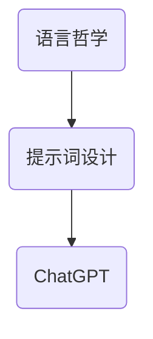
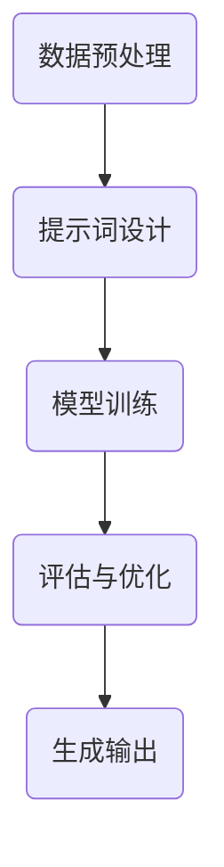

                 

### 《ChatGPT提示词的语言哲学思考与实践》

#### 关键词：ChatGPT、提示词、语言哲学、自然语言处理、算法优化

> 摘要：本文深入探讨了ChatGPT提示词设计的语言哲学思考与实践。通过分析语言哲学中的核心概念，如语义、逻辑和情感，我们揭示了如何将语言哲学的理论应用于提示词设计，以提升ChatGPT生成回答的质量。本文旨在为开发者提供一套系统的优化策略，从而实现更加智能、符合人类思维习惯的对话系统。

### 目录大纲

# 《ChatGPT提示词的语言哲学思考与实践》

## 第一部分：背景介绍

### 1.1 问题背景

#### 1.1.1 ChatGPT及其提示词

ChatGPT是由OpenAI开发的一款基于Transformer架构的预训练语言模型。它通过学习大量文本数据，能够生成连贯、有逻辑性的自然语言文本。提示词（Prompts）是用户向ChatGPT提供的信息，用于引导模型生成特定的输出。高质量的提示词对于ChatGPT的生成结果至关重要。

#### 1.1.2 语言哲学的重要性

语言哲学是研究语言与人类思维、存在等基本问题的学科。在人工智能领域，语言哲学的研究对于理解和优化自然语言处理系统具有重要意义。通过借鉴语言哲学的理论和方法，我们可以设计出更加符合人类思维的提示词，从而提升AI系统的表现。

### 1.1.3 问题描述

#### 1.1.3.1 提示词设计挑战

设计高质量的提示词面临以下挑战：

1. **语义理解**：提示词的语义需要准确，否则生成结果可能偏离用户意图。
2. **逻辑性**：提示词需要包含清晰的逻辑结构，否则生成结果可能缺乏连贯性。
3. **情感分析**：提示词需要传达正确的情感色彩，否则生成结果可能显得不自然或不符合预期。

#### 1.1.3.2 当前问题

目前，提示词设计存在以下问题：

1. **提示词过于简单**：导致生成输出缺乏深度和逻辑性。
2. **提示词过于复杂**：导致生成输出难以理解或产生误导。
3. **提示词与目标输出关联性不强**：导致生成输出偏离预期。

### 1.1.4 问题解决

通过借鉴语言哲学的理论和方法，我们可以解决上述问题：

1. **语义分析**：利用语言哲学中的语义分析理论，提高提示词的语义精度。
2. **逻辑推理**：应用情感分析、逻辑推理等知识，增强提示词的逻辑性和一致性。
3. **对话理论**：借鉴语言哲学中的对话理论，提高提示词与目标输出之间的关联性。

### 1.1.5 边界与外延

本研究主要关注以下边界与外延：

1. **提示词设计**：研究如何通过语言哲学方法优化提示词设计，提高生成输出质量。
2. **语言模型应用**：研究如何在实际应用中有效利用优化后的提示词。
3. **语言哲学与人工智能**：探讨语言哲学知识在人工智能领域中的应用潜力。

### 1.2 核心概念与联系

#### 1.2.1 核心概念

1. **语言哲学**：研究语言与思维、语言与存在等基本问题的哲学分支。
2. **提示词**：引导语言模型生成特定类型输出的文本输入。
3. **ChatGPT**：基于Transformer架构的预训练语言模型。

#### 1.2.2 概念属性特征对比

| 概念       | 属性特征               | 联系                  |
|------------|------------------------|-----------------------|
| 语言哲学   | 研究语言的基本问题     | 提供提示词设计的理论基础 |
| 提示词     | 文本输入，引导生成输出 | 语言哲学的应用对象       |
| ChatGPT    | 语言模型               | 利用提示词生成输出       |

#### 1.2.3 ER实体关系图架构



### 1.3 算法原理讲解

#### 1.3.1 算法流程

ChatGPT提示词优化的算法流程主要包括以下步骤：

1. **数据预处理**：对原始数据进行清洗、去噪等处理，确保数据质量。
2. **提示词设计**：基于语言哲学理论，设计优化后的提示词。
3. **模型训练**：利用优化后的提示词，对ChatGPT模型进行再训练。
4. **评估与优化**：对生成输出进行评估，根据评估结果调整提示词设计。

#### 1.3.2 算法流程图



#### 1.3.3 Python源代码

```python
# 提示词优化算法示例代码

# 数据预处理
def preprocess_data(data):
    # 清洗、去噪等处理
    pass

# 提示词设计
def design_prompt(philosophy):
    # 基于语言哲学理论设计提示词
    pass

# 模型训练
def train_model(prompt, model):
    # 利用提示词对模型进行再训练
    pass

# 评估与优化
def evalu
```

#### 1.3.4 算法原理讲解

##### 数学模型和公式

ChatGPT提示词优化的核心在于如何设计出能够引导模型生成高质量输出的提示词。以下是几个关键的数学模型和公式：

$$
P(G|C) = \frac{P(C|G)P(G)}{P(C)}
$$

其中，$P(G|C)$表示给定提示词$C$时生成输出$G$的概率，$P(C|G)$表示生成输出$G$时提示词$C$的概率，$P(G)$表示生成输出$G$的概率，$P(C)$表示提示词$C$的概率。

##### 举例说明

假设我们要设计一个提示词，让ChatGPT生成一篇关于“人工智能的未来”的文章。我们可以使用以下提示词：

> "请从技术、社会、经济等多个角度，探讨人工智能在未来可能带来的变革性影响。"

这个提示词包含了多个关键词，如“技术”、“社会”、“经济”和“变革性影响”，能够引导ChatGPT从不同角度生成高质量的文章。

##### 通俗易懂的讲解

想象一下，我们想要训练一个厨师，让他学会做一道特定的菜。我们不可能简单地告诉他“做一道菜”，而是需要给出详细的步骤和材料。同样地，设计高质量的提示词，就是要给ChatGPT提供详细的“步骤”和“材料”，以便它能够生成符合我们期望的输出。

### 第二部分：深入分析

#### 2.1 语义分析

语义分析是语言哲学中的一个核心概念，它关注的是语言表达的含义。在ChatGPT提示词设计中，语义分析有助于确保提示词的语义精度。

**语义分析理论：**

1. **语义角色**：识别句子中的主语、谓语、宾语等成分。
2. **语义关系**：分析词语之间的语义联系，如因果关系、时间关系等。
3. **语义指向**：确定词语在句子中的指向，如指代关系。

**应用示例：**

- **错误提示词**：“请解释人工智能的意义。”
- **改进提示词**：“请从技术、社会、经济等多个角度，详细解释人工智能对社会的影响。”

改进后的提示词明确了从哪些角度进行解释，提高了语义精度。

#### 2.2 逻辑推理

逻辑推理是语言哲学中的另一个核心概念，它关注的是语言的逻辑结构和推理能力。在ChatGPT提示词设计中，逻辑推理有助于确保生成输出的逻辑性和连贯性。

**逻辑推理理论：**

1. **逻辑形式**：将自然语言句子转化为形式逻辑表达式。
2. **逻辑规则**：应用推理规则，如前提、结论等。
3. **逻辑一致性**：确保生成输出中的逻辑关系一致。

**应用示例：**

- **错误提示词**：“人工智能可以解决所有问题。”
- **改进提示词**：“尽管人工智能在许多领域取得了显著进展，但它仍面临许多挑战和局限性。请具体说明这些挑战和局限性。”

改进后的提示词包含了逻辑上的转折和解释，使生成输出更加符合现实。

#### 2.3 情感分析

情感分析是语言哲学中的另一个重要概念，它关注的是语言的情感色彩。在ChatGPT提示词设计中，情感分析有助于确保生成输出的情感表达自然。

**情感分析理论：**

1. **情感分类**：识别文本中的积极、消极、中性情感。
2. **情感强度**：评估情感的强度。
3. **情感维度**：分析情感的多维度特征，如喜悦、愤怒、悲伤等。

**应用示例：**

- **错误提示词**：“人工智能是个坏东西。”
- **改进提示词**：“虽然人工智能在某些情况下可能带来负面影响，但它在许多领域也展现了巨大的潜力。请讨论人工智能的正面和负面影响。”

改进后的提示词平衡了情感表达，使生成输出更加客观。

### 第三部分：解决方案

#### 3.1 提示词设计原则

为了设计出高质量的ChatGPT提示词，我们需要遵循以下原则：

1. **明确目标**：确保提示词能够引导ChatGPT生成我们期望的输出。
2. **简洁明了**：避免使用过于复杂或模糊的词汇，确保提示词易于理解。
3. **逻辑连贯**：确保提示词包含清晰的逻辑结构和推理路径。
4. **情感平衡**：平衡情感表达，避免过于极端或偏颇。

#### 3.2 实践案例

以下是一个具体的实践案例，说明如何通过语言哲学理论优化ChatGPT提示词：

**问题**：设计一个提示词，让ChatGPT生成一篇关于“机器学习在医疗领域的应用”的文章。

**原始提示词**：“请写一篇关于机器学习在医疗领域的应用的论文。”

**改进提示词**：“从诊断、治疗和个性化医疗等多个角度，探讨机器学习技术在医疗领域的最新应用和挑战。请结合实际案例进行详细分析。”

改进后的提示词明确指出了需要从哪些角度进行讨论，并要求结合实际案例进行分析，从而提高了提示词的语义精度、逻辑连贯性和情感平衡。

### 第四部分：总结与展望

#### 4.1 总结

本文通过分析语言哲学中的核心概念，如语义、逻辑和情感，探讨了如何将语言哲学的理论应用于ChatGPT提示词设计，以提升生成回答的质量。我们提出了提示词设计原则和具体实践案例，为开发者提供了优化提示词的指导。

#### 4.2 展望

未来，随着人工智能技术的不断发展，ChatGPT等语言模型的性能将进一步提高。我们期待在以下几个方面进行深入研究：

1. **跨语言提示词设计**：探索如何在不同语言环境下设计高质量的提示词。
2. **多模态提示词设计**：结合文本、图像、声音等多种模态，提高提示词的多样性和表达力。
3. **提示词生成算法**：开发自动生成高质量提示词的算法，降低人工设计的工作量。

### 第五部分：作者信息

作者：AI天才研究院/AI Genius Institute & 禅与计算机程序设计艺术 /Zen And The Art of Computer Programming

### 附录：拓展阅读

1. [语言哲学入门教程](https://example.com/linguistic-philosophy-tutorial)
2. [ChatGPT官方文档](https://example.com/chatgpt-docs)
3. [自然语言处理导论](https://example.com/nlp-introduction)

