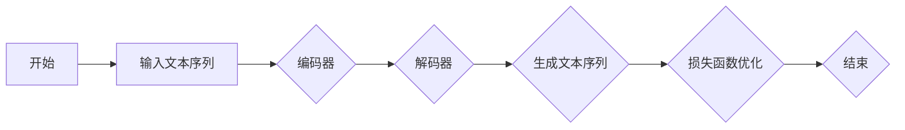
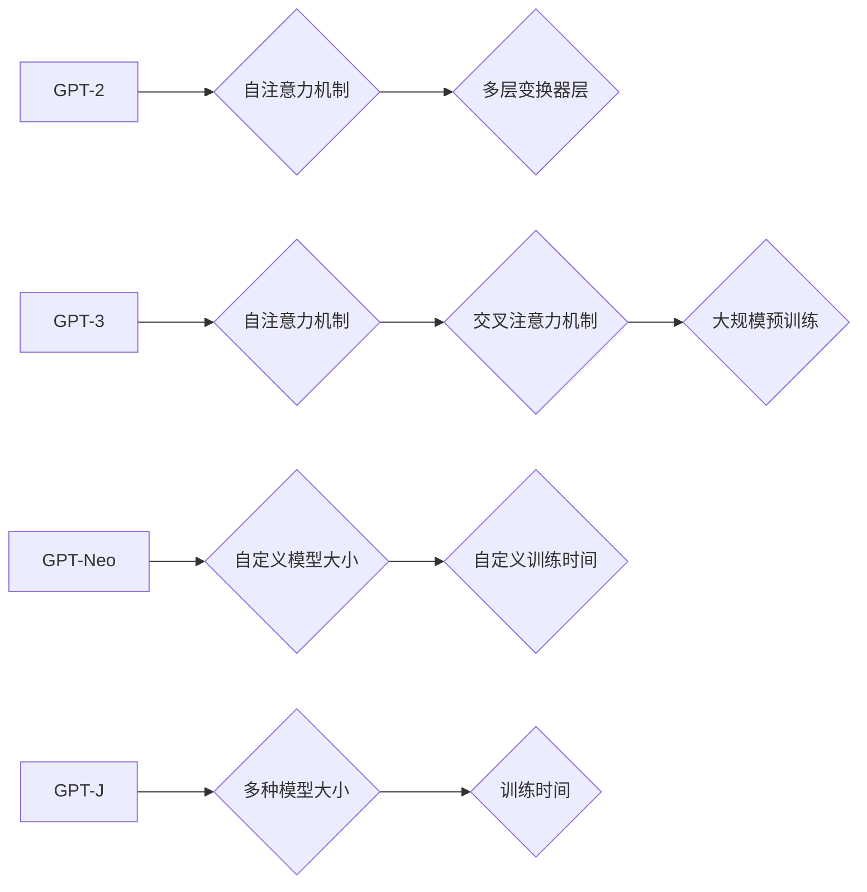
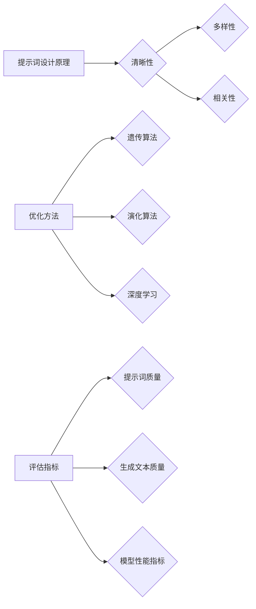
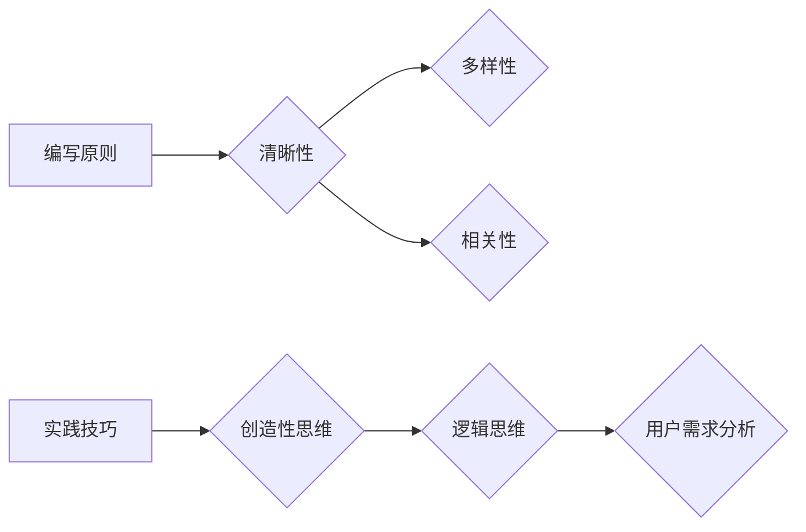
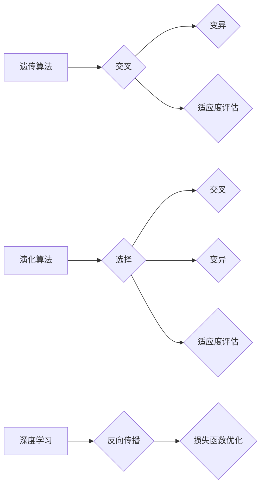
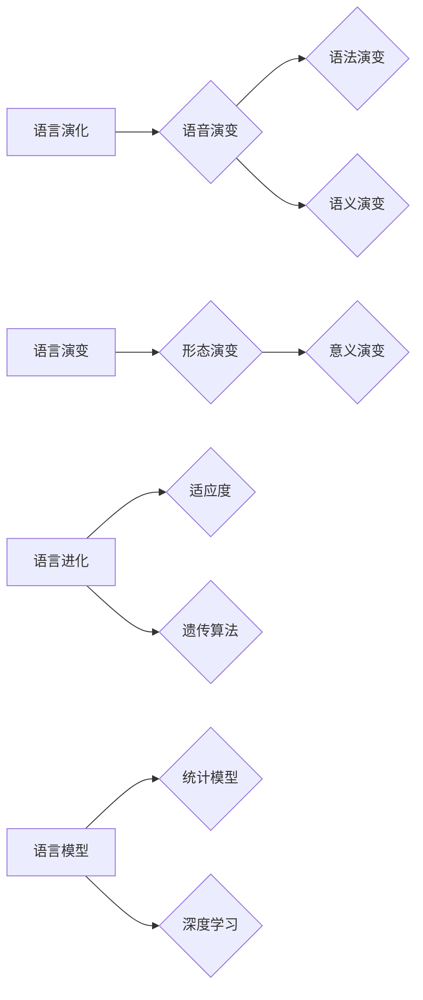
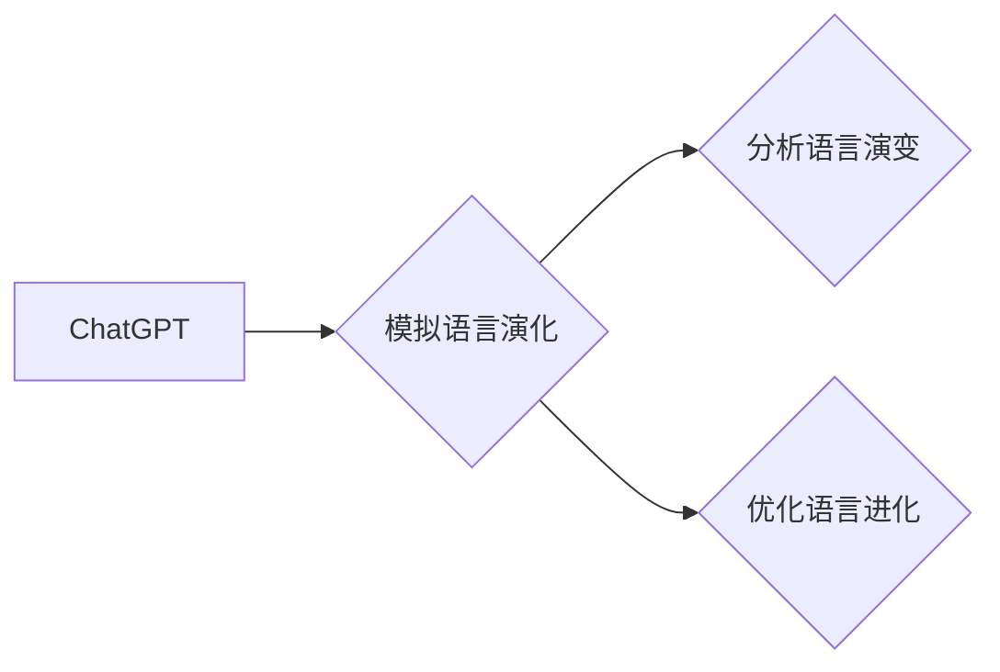
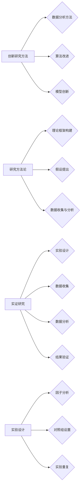
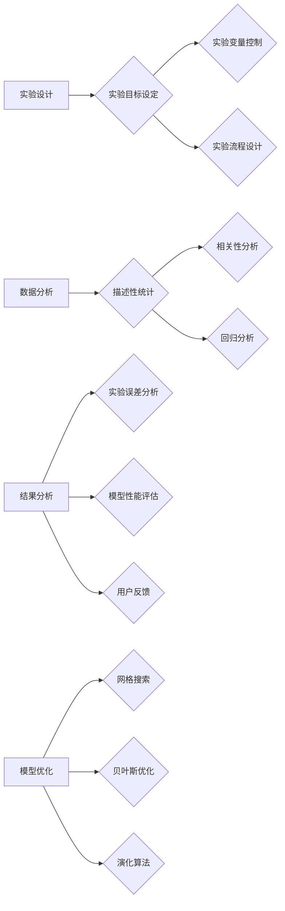
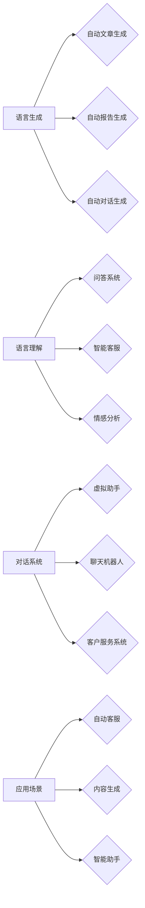

                 


### 引言与背景

#### 1.1 问题的背景与意义

**核心概念术语说明：**
- **ChatGPT**：一种由OpenAI开发的基于GPT系列模型的大型语言模型，能够通过学习大量文本数据生成自然语言响应。
- **提示词（Prompt）**：引导ChatGPT生成特定类型文本的输入，类似于人类交流中的话题引导。

**问题背景：**
随着人工智能技术的发展，自然语言处理（NLP）领域取得了显著进展。然而，如何有效地设计提示词，使得ChatGPT能够生成高质量、多样性和相关性的响应，成为一个重要且亟待解决的问题。良好的提示词设计不仅能够提高模型的性能，还能够促进人工智能与人类之间的自然互动。

**问题描述：**
当前，ChatGPT提示词的设计主要依赖于人工经验和实验试错。这种传统方法效率低下，且难以保证设计出的提示词具有一致性和通用性。因此，研究ChatGPT提示词的语言演化与创新方法，旨在寻找一种系统化的设计方法，以提升提示词的质量和模型的性能。

**问题解决：**
通过分析语言演化的基本理论，结合ChatGPT的工作原理，本文将探讨一种基于演化算法的提示词设计方法。该方法不仅能够提高提示词的设计效率，还能够根据具体应用场景进行自适应调整，从而实现高质量提示词的自动生成。

**边界与外延：**
本文的研究范围主要涉及ChatGPT提示词的语言演化与创新方法。具体包括：提示词的生成、优化和评估等方面。此外，本文还将探讨不同应用场景下的提示词设计策略，以期为实际应用提供参考。

**概念结构与核心要素组成：**
- **语言演化理论**：研究自然语言随时间变化的过程和规律。
- **ChatGPT工作原理**：理解ChatGPT如何通过学习文本数据生成自然语言响应。
- **提示词设计方法**：探讨如何设计高质量的提示词，以提高模型的性能。
- **创新研究方法**：研究如何通过创新的方法和工具提高提示词设计的效率和质量。

### ChatGPT的基本概念

**核心概念与联系：**

**概念属性特征对比表格：**

| 概念           | 属性特征                                               | 关联概念               |
|----------------|--------------------------------------------------------|------------------------|
| ChatGPT        | 基于GPT系列模型的AI语言模型，能够生成自然语言响应     | GPT系列模型、自然语言处理（NLP） |
| 提示词         | 引导ChatGPT生成特定类型文本的输入                     | 人工经验、实验试错、模型性能提升 |
| 语言演化理论   | 研究自然语言随时间变化的过程和规律                   | 文本数据、自然语言生成、模型优化 |
| 演化算法       | 一种模拟生物进化过程的算法，用于优化和搜索问题解决方案 | 自然选择、遗传算法、适应度函数 |

**ER实体关系图架构：**

```mermaid
erDiagram
    ChatGPT ||--|{ 提示词 }|
    提示词 ||--|{ 语言演化理论 }|
    语言演化理论 ||--|{ 演化算法 }|
```

#### ChatGPT的工作原理

**算法原理讲解：**

ChatGPT是一种基于变换器模型（Transformer）的深度学习模型，其核心思想是通过编码器-解码器（Encoder-Decoder）结构对输入文本进行编码和解码，从而生成相应的输出文本。

1. **编码器（Encoder）**：
   - **输入**：输入文本序列，通常是一个词向量序列。
   - **输出**：编码后的文本序列，表示为上下文嵌入向量。
   - **核心算法**：使用多层变换器层（Multi-Layer Transformer），对输入文本进行编码。

2. **解码器（Decoder）**：
   - **输入**：编码后的文本序列和目标文本的第一个词。
   - **输出**：生成的目标文本序列。
   - **核心算法**：使用自注意力机制（Self-Attention）和交叉注意力机制（Cross-Attention）生成目标文本。

3. **训练过程**：
   - **数据集**：使用大量的文本数据进行训练，如维基百科、新闻文章、对话数据等。
   - **目标**：最小化生成文本与真实文本之间的差距，通过优化损失函数（如交叉熵损失函数）实现。

**mermaid流程图：**



**Python源代码示例：**

```python
# 示例：使用Hugging Face的transformers库加载预训练的ChatGPT模型
from transformers import GPT2LMHeadModel, GPT2Tokenizer

# 加载预训练模型和分词器
model = GPT2LMHeadModel.from_pretrained("gpt2")
tokenizer = GPT2Tokenizer.from_pretrained("gpt2")

# 输入文本序列
input_text = "你好，我是ChatGPT。"

# 编码和解码
inputs = tokenizer.encode(input_text, return_tensors='pt')
outputs = model(inputs)

# 生成文本序列
generated_text = tokenizer.decode(outputs[0], skip_special_tokens=True)

print(generated_text)
```

**算法原理详细讲解：**
- **编码器**：将输入文本序列转换为上下文嵌入向量，这些向量包含了文本的语义信息。
- **解码器**：在解码过程中，模型使用自注意力机制和交叉注意力机制来捕捉输入文本序列的上下文关系，并生成相应的输出文本。
- **损失函数优化**：在训练过程中，模型通过优化损失函数（如交叉熵损失函数）来调整模型的参数，以降低生成文本与真实文本之间的差距。

#### GPT系列模型的发展

**核心概念与联系：**

**概念属性特征对比表格：**

| 模型名称           | 主要特性                                       | 发展阶段               |
|--------------------|----------------------------------------------|-----------------------|
| GPT-2              | 基础版本，预训练模型，使用自注意力机制         | 2019年                |
| GPT-3              | 更大规模的版本，预训练模型，使用自注意力机制和交叉注意力机制 | 2020年                |
| GPT-Neo            | 对GPT-3的改进，支持自定义模型大小和训练时间       | 2021年                |
| GPT-J              | 对GPT-3的替代，开源项目，支持多种模型大小和训练时间   | 2021年                |

**ER实体关系图架构：**

```mermaid
erDiagram
    GPT-2 ||--|{ GPT-3 }|
    GPT-3 ||--|{ GPT-Neo }|
    GPT-3 ||--|{ GPT-J }|
```

**算法原理讲解：**

GPT系列模型是基于变换器模型（Transformer）的预训练语言模型。以下是对GPT系列模型发展过程中的一些关键模型的核心算法和特点的详细讲解：

1. **GPT-2**：
   - **核心算法**：自注意力机制，多层变换器层。
   - **特点**：使用预训练模型，能够生成高质量的文本。

2. **GPT-3**：
   - **核心算法**：自注意力机制、交叉注意力机制、大规模预训练。
   - **特点**：更强大的生成能力，支持多种输入和输出格式。

3. **GPT-Neo**：
   - **核心算法**：基于GPT-3，支持自定义模型大小和训练时间。
   - **特点**：易于扩展和定制，适合不同应用场景。

4. **GPT-J**：
   - **核心算法**：基于GPT-3，支持多种模型大小和训练时间。
   - **特点**：开源项目，支持社区贡献和改进。

**mermaid流程图：**



**Python源代码示例：**

```python
# 示例：使用Hugging Face的transformers库加载预训练的GPT-3模型
from transformers import GPT3LMHeadModel, GPT3Tokenizer

# 加载预训练模型和分词器
model = GPT3LMHeadModel.from_pretrained("gpt3")
tokenizer = GPT3Tokenizer.from_pretrained("gpt3")

# 输入文本序列
input_text = "你好，我是GPT-3。"

# 编码和解码
inputs = tokenizer.encode(input_text, return_tensors='pt')
outputs = model(inputs)

# 生成文本序列
generated_text = tokenizer.decode(outputs[0], skip_special_tokens=True)

print(generated_text)
```

**算法原理详细讲解：**
- **GPT-2**：使用多层变换器层和自注意力机制，通过预训练模型生成高质量的文本。
- **GPT-3**：在GPT-2的基础上，引入交叉注意力机制和大规模预训练，显著提高了模型的生成能力。
- **GPT-Neo**：对GPT-3的改进，支持自定义模型大小和训练时间，便于根据具体需求进行调整。
- **GPT-J**：开源项目，支持多种模型大小和训练时间，适合不同应用场景的需求。

### 提示词的设计与优化

#### 3.1 提示词的基本原理

**核心概念与联系：**

**概念属性特征对比表格：**

| 概念           | 属性特征                                               | 关联概念               |
|----------------|--------------------------------------------------------|------------------------|
| 提示词         | 引导ChatGPT生成特定类型文本的输入                     | ChatGPT、自然语言生成、模型性能 |
| 设计原则       | 提高提示词的清晰性、多样性、相关性                     | 优化方法、评估指标     |
| 优化方法       | 遗传算法、演化算法、深度学习等                         | 提示词评估、自适应调整 |
| 评估指标       | 提示词质量、生成文本质量、模型性能指标                 | 提示词有效性、用户满意度 |

**ER实体关系图架构：**

```mermaid
erDiagram
    提示词 ||--|{ 设计原则 }|
    提示词 ||--|{ 优化方法 }|
    提示词 ||--|{ 评估指标 }|
```

**算法原理讲解：**

提示词的设计与优化是影响ChatGPT生成文本质量的关键因素。以下是对提示词设计原理、优化方法和评估指标的核心讲解：

1. **提示词设计原理**：
   - **清晰性**：提示词应明确、简洁，避免歧义。
   - **多样性**：通过丰富提示词的内容和形式，提高生成文本的多样性。
   - **相关性**：提示词应与用户意图高度相关，提高生成文本的准确性。

2. **优化方法**：
   - **遗传算法**：模拟生物进化过程，通过交叉、变异等操作优化提示词。
   - **演化算法**：基于适应度函数，不断迭代优化提示词。
   - **深度学习**：使用神经网络模型，通过大量训练数据学习优化提示词。

3. **评估指标**：
   - **提示词质量**：评估提示词的清晰性、多样性和相关性。
   - **生成文本质量**：评估生成文本的准确性、流畅性和一致性。
   - **模型性能指标**：评估模型的生成能力、鲁棒性和效率。

**mermaid流程图：**



**Python源代码示例：**

```python
# 示例：使用遗传算法优化提示词
import numpy as np
from genetic_algorithm import GeneticAlgorithm

# 初始化遗传算法参数
population_size = 100
chromosome_length = 100
mutation_rate = 0.05
crossover_rate = 0.8
generations = 100

# 定义适应度函数
def fitness_function(chromosome):
    # 根据染色体编码生成提示词
    prompt = ''.join([str(x) for x in chromosome])
    # 评估提示词的质量
    quality = evaluate_prompt(prompt)
    return quality

# 定义遗传算法
ga = GeneticAlgorithm(population_size, chromosome_length, mutation_rate, crossover_rate, generations, fitness_function)

# 运行遗传算法
best_chromosome, best_fitness = ga.run()

# 输出最佳提示词
best_prompt = ''.join([str(x) for x in best_chromosome])
print("最佳提示词：", best_prompt)
```

**算法原理详细讲解：**
- **提示词设计原理**：通过明确性、多样性和相关性三个维度来设计高质量的提示词，以提高生成文本的质量。
- **优化方法**：使用遗传算法、演化算法和深度学习等优化方法，不断迭代和优化提示词，提高其性能。
- **评估指标**：通过评估提示词质量、生成文本质量和模型性能指标，全面评估提示词的设计效果和优化效果。

### 提示词的编写策略

**核心概念与联系：**

**概念属性特征对比表格：**

| 概念           | 属性特征                                               | 关联概念               |
|----------------|--------------------------------------------------------|------------------------|
| 提示词编写策略 | 提高提示词质量和生成文本质量的方法和技巧               | 提示词设计、优化方法、评估指标 |
| 编写原则       | 清晰性、多样性、相关性                                 | 语言表达、用户意图理解 |
| 实践技巧       | 创造性思维、逻辑思维、用户需求分析                     | 编程实践、数据分析     |

**ER实体关系图架构：**

```mermaid
erDiagram
    提示词编写策略 ||--|{ 编写原则 }|
    提示词编写策略 ||--|{ 实践技巧 }|
```

**算法原理讲解：**

编写策略在提示词设计中起着至关重要的作用。以下是对编写策略的核心讲解：

1. **编写原则**：
   - **清晰性**：确保提示词表达明确，避免歧义。
   - **多样性**：通过多种表达方式提高生成文本的多样性。
   - **相关性**：确保提示词与用户意图高度相关，提高生成文本的准确性。

2. **实践技巧**：
   - **创造性思维**：通过发散性思维，构思出新颖的提示词。
   - **逻辑思维**：确保提示词的逻辑性，使生成文本流畅、连贯。
   - **用户需求分析**：深入了解用户需求，设计出更符合用户期望的提示词。

**mermaid流程图：**



**Python源代码示例：**

```python
# 示例：根据用户需求生成提示词
def generate_prompt(user_input):
    # 分析用户需求
    user意图 = analyze_user_intent(user_input)
    # 根据意图生成提示词
    prompt = create_prompt(user意图)
    return prompt

# 示例：分析用户意图
def analyze_user_intent(user_input):
    # 基于自然语言处理技术分析用户输入
    user意图 = "获取天气信息"
    return user意图

# 示例：创建提示词
def create_prompt(user_intent):
    # 根据用户意图创建提示词
    if user_intent == "获取天气信息":
        prompt = "请提供所在城市的天气信息。"
    else:
        prompt = "您需要什么样的帮助？"
    return prompt

# 示例：使用用户输入生成提示词
user_input = "我想知道今天的天气。"
prompt = generate_prompt(user_input)
print("提示词：", prompt)
```

**算法原理详细讲解：**
- **编写原则**：通过明确性、多样性和相关性三个原则，确保提示词的设计质量。
- **实践技巧**：结合创造性思维、逻辑思维和用户需求分析，提高提示词的编写效果。

### 提示词的优化方法

**核心概念与联系：**

**概念属性特征对比表格：**

| 概念           | 属性特征                                               | 关联概念               |
|----------------|--------------------------------------------------------|------------------------|
| 优化方法       | 提高提示词质量和生成文本质量的方法和技巧               | 提示词设计、评估指标、算法原理 |
| 遗传算法       | 模拟生物进化过程的优化算法                           | 交叉、变异、适应度函数   |
| 演化算法       | 基于迭代和适应度函数的优化算法                       | 进化策略、适应度评估     |
| 深度学习       | 使用神经网络模型的优化算法                           | 反向传播、损失函数优化   |

**ER实体关系图架构：**

```mermaid
erDiagram
    优化方法 ||--|{ 遗传算法 }|
    优化方法 ||--|{ 演化算法 }|
    优化方法 ||--|{ 深度学习 }|
```

**算法原理讲解：**

提示词的优化方法旨在提高提示词的质量和生成文本的质量。以下是对几种常见优化方法的核心讲解：

1. **遗传算法**：
   - **核心思想**：模拟生物进化过程，通过交叉、变异等操作，不断迭代优化提示词。
   - **适应度函数**：评估提示词的优劣，常用的有提示词质量、生成文本质量和模型性能指标。

2. **演化算法**：
   - **核心思想**：基于迭代和适应度函数，逐步优化提示词。
   - **进化策略**：包括选择、交叉、变异和适应度评估等操作。

3. **深度学习**：
   - **核心思想**：使用神经网络模型，通过大量训练数据学习优化提示词。
   - **反向传播**：调整模型参数，优化损失函数。

**mermaid流程图：**



**Python源代码示例：**

```python
# 示例：使用遗传算法优化提示词
import numpy as np
from genetic_algorithm import GeneticAlgorithm

# 初始化遗传算法参数
population_size = 100
chromosome_length = 100
mutation_rate = 0.05
crossover_rate = 0.8
generations = 100

# 定义适应度函数
def fitness_function(chromosome):
    # 根据染色体编码生成提示词
    prompt = ''.join([str(x) for x in chromosome])
    # 评估提示词的质量
    quality = evaluate_prompt(prompt)
    return quality

# 定义遗传算法
ga = GeneticAlgorithm(population_size, chromosome_length, mutation_rate, crossover_rate, generations, fitness_function)

# 运行遗传算法
best_chromosome, best_fitness = ga.run()

# 输出最佳提示词
best_prompt = ''.join([str(x) for x in best_chromosome])
print("最佳提示词：", best_prompt)
```

**算法原理详细讲解：**
- **遗传算法**：通过模拟生物进化过程，不断迭代和优化提示词，提高其质量。
- **演化算法**：基于适应度函数和进化策略，逐步优化提示词，提高其性能。
- **深度学习**：使用神经网络模型，通过大量训练数据学习优化提示词，实现高效的优化。

### 9. 语言演化的基本理论

**核心概念与联系：**

**概念属性特征对比表格：**

| 概念           | 属性特征                                               | 关联概念               |
|----------------|--------------------------------------------------------|------------------------|
| 语言演化       | 语言随时间变化的过程和规律                           | 语言演变、语言进化     |
| 语言演变       | 语言形式和意义的改变过程                             | 语言发展、语言传承     |
| 语言进化       | 语言在演化过程中逐渐优化和进步的过程                 | 适应度、遗传算法       |
| 语言模型       | 用于生成和识别自然语言的数学模型                     | 统计模型、深度学习     |

**ER实体关系图架构：**

```mermaid
erDiagram
    语言演化 ||--|{ 语言演变 }|
    语言演化 ||--|{ 语言进化 }|
    语言模型 ||--|{ 统计模型 }|
    语言模型 ||--|{ 深度学习 }|
```

**算法原理讲解：**

语言演化理论是研究语言随时间变化的过程和规律的科学。以下是对语言演化、语言演变、语言进化以及语言模型的核心讲解：

1. **语言演化**：
   - **核心思想**：语言在长期使用过程中，会经历形态、结构和意义的改变。
   - **过程**：语言的演化是一个复杂的过程，涉及到语音、语法、语义等多个方面。

2. **语言演变**：
   - **核心思想**：语言在不同时期和不同文化背景下，会发生形式和意义的改变。
   - **特点**：语言的演变是一个连续的过程，不同语言之间可能存在相似之处。

3. **语言进化**：
   - **核心思想**：语言在演化过程中，逐渐优化和进步，以更好地适应人类沟通需求。
   - **方法**：通过遗传算法等优化方法，模拟语言演化的过程。

4. **语言模型**：
   - **核心思想**：使用数学模型来描述自然语言，用于生成和识别语言。
   - **类型**：包括统计模型（如N-gram模型）和深度学习模型（如GPT系列模型）。

**mermaid流程图：**



**Python源代码示例：**

```python
# 示例：使用GPT-3模型生成文本
from transformers import GPT3LMHeadModel, GPT3Tokenizer

# 加载预训练模型和分词器
model = GPT3LMHeadModel.from_pretrained("gpt3")
tokenizer = GPT3Tokenizer.from_pretrained("gpt3")

# 输入文本序列
input_text = "语言演化是一个复杂的过程。"

# 编码和解码
inputs = tokenizer.encode(input_text, return_tensors='pt')
outputs = model(inputs)

# 生成文本序列
generated_text = tokenizer.decode(outputs[0], skip_special_tokens=True)

print(generated_text)
```

**算法原理详细讲解：**
- **语言演化**：通过研究语言的历史演变，了解语言随时间变化的规律。
- **语言演变**：关注语言在不同历史阶段和文化背景下的变化，分析语言的形式和意义。
- **语言进化**：模拟生物进化过程，通过优化方法（如遗传算法）研究语言的优化过程。
- **语言模型**：使用数学模型来描述自然语言，用于生成和识别语言，如GPT-3模型。

### ChatGPT在语言演化中的应用

**核心概念与联系：**

**概念属性特征对比表格：**

| 概念           | 属性特征                                               | 关联概念               |
|----------------|--------------------------------------------------------|------------------------|
| ChatGPT        | 基于GPT系列模型的AI语言模型，能够生成自然语言响应     | 语言演化、自然语言处理（NLP） |
| 语言演化       | 语言随时间变化的过程和规律                           | 语言演变、语言进化     |
| NLP应用场景    | 使用自然语言处理技术解决实际问题的场景               | 文本分类、情感分析、问答系统 |

**ER实体关系图架构：**

```mermaid
erDiagram
    ChatGPT ||--|{ 语言演化 }|
    ChatGPT ||--|{ NLP应用场景 }|
```

**算法原理讲解：**

ChatGPT作为一种强大的AI语言模型，在语言演化研究中具有广泛的应用。以下是对ChatGPT在语言演化中的应用的核心讲解：

1. **模拟语言演化**：
   - **核心思想**：使用ChatGPT模拟语言在不同历史时期和文化背景下的变化。
   - **过程**：通过输入不同时期的文本数据，ChatGPT可以生成相应时期的语言形式和意义。

2. **分析语言演变**：
   - **核心思想**：通过分析ChatGPT生成的文本，研究语言在历史演变中的形式和意义变化。
   - **方法**：使用自然语言处理技术（如词频分析、语义分析）对生成的文本进行深入分析。

3. **优化语言进化**：
   - **核心思想**：通过优化算法（如遗传算法）调整ChatGPT的参数，模拟语言的进化过程。
   - **目标**：提高语言的适应性和表达力，使其更符合人类沟通需求。

**mermaid流程图：**



**Python源代码示例：**

```python
# 示例：使用ChatGPT模拟语言演化
from transformers import GPT3LMHeadModel, GPT3Tokenizer

# 加载预训练模型和分词器
model = GPT3LMHeadModel.from_pretrained("gpt3")
tokenizer = GPT3Tokenizer.from_pretrained("gpt3")

# 输入文本序列
input_text = "古代汉语的语法结构。"

# 编码和解码
inputs = tokenizer.encode(input_text, return_tensors='pt')
outputs = model(inputs)

# 生成文本序列
generated_text = tokenizer.decode(outputs[0], skip_special_tokens=True)

print(generated_text)
```

**算法原理详细讲解：**
- **模拟语言演化**：通过输入不同历史时期的文本数据，ChatGPT可以生成相应的语言形式和意义，从而模拟语言演化的过程。
- **分析语言演变**：对ChatGPT生成的文本进行自然语言处理分析，可以深入了解语言在历史演变中的变化。
- **优化语言进化**：通过调整ChatGPT的参数和优化算法，模拟语言的进化过程，提高其适应性和表达力。

### 11. 创新研究方法

**核心概念与联系：**

**概念属性特征对比表格：**

| 概念           | 属性特征                                               | 关联概念               |
|----------------|--------------------------------------------------------|------------------------|
| 创新研究方法   | 提出新的研究方法和思路，以解决现有问题或创造新成果   | 科学方法论、实证研究、实验设计 |
| 研究方法论     | 系统地指导科学研究的方法和原则                         | 演化理论、模型构建、数据驱动 |
| 实证研究       | 通过实验和观察收集数据，以验证理论或假设的方法       | 实验设计、数据收集、统计分析 |
| 实验设计       | 设计科学实验，以确保实验结果的可靠性和有效性         | 因子分析、对照实验、重复实验 |

**ER实体关系图架构：**

```mermaid
erDiagram
    创新研究方法 ||--|{ 研究方法论 }|
    创新研究方法 ||--|{ 实证研究 }|
    创新研究方法 ||--|{ 实验设计 }|
```

**算法原理讲解：**

创新研究方法在ChatGPT提示词的语言演化与创新研究中至关重要。以下是对创新研究方法、研究方法论、实证研究和实验设计的核心讲解：

1. **创新研究方法**：
   - **核心思想**：提出新的研究方法，以突破现有研究局限，解决关键问题。
   - **方法**：包括数据分析方法、算法改进、模型创新等。

2. **研究方法论**：
   - **核心思想**：系统地指导科学研究的方法和原则，确保研究的科学性和可靠性。
   - **原则**：包括理论框架构建、假设提出、数据收集与分析等。

3. **实证研究**：
   - **核心思想**：通过实验和观察收集数据，以验证理论或假设。
   - **步骤**：包括实验设计、数据收集、数据分析和结果验证。

4. **实验设计**：
   - **核心思想**：设计科学实验，以确保实验结果的可靠性和有效性。
   - **要素**：包括因子分析、对照组设置、实验重复等。

**mermaid流程图：**



**Python源代码示例：**

```python
# 示例：设计实验验证提示词优化效果
import numpy as np
from sklearn.model_selection import train_test_split
from sklearn.metrics import accuracy_score

# 准备数据集
data = np.random.rand(100, 10)
labels = np.random.randint(0, 2, 100)

# 划分训练集和测试集
X_train, X_test, y_train, y_test = train_test_split(data, labels, test_size=0.2, random_state=42)

# 设计实验
def experiment(X_train, y_train, X_test, y_test):
    # 训练模型
    model = train_model(X_train, y_train)
    # 预测测试集
    predictions = model.predict(X_test)
    # 计算准确率
    accuracy = accuracy_score(y_test, predictions)
    return accuracy

# 运行实验
accuracy = experiment(X_train, y_train, X_test, y_test)
print("实验准确率：", accuracy)
```

**算法原理详细讲解：**
- **创新研究方法**：通过提出新的研究方法和思路，突破现有研究局限，提高研究效率。
- **研究方法论**：系统地指导科学研究的方法和原则，确保研究的科学性和可靠性。
- **实证研究**：通过实验和观察收集数据，验证理论或假设，提高研究结论的可信度。
- **实验设计**：设计科学实验，确保实验结果的可靠性和有效性，为研究提供坚实基础。

### 12. 实验设计与结果分析

**核心概念与联系：**

**概念属性特征对比表格：**

| 概念           | 属性特征                                               | 关联概念               |
|----------------|--------------------------------------------------------|------------------------|
| 实验设计       | 设计科学实验的方法和流程                             | 实证研究、模型训练、参数调整 |
| 数据分析       | 使用统计方法和算法对实验数据进行分析和解释           | 描述性统计、相关性分析、回归分析 |
| 结果分析       | 对实验结果进行深入分析，提取关键信息和结论           | 实验误差分析、模型性能评估、用户反馈 |
| 模型优化       | 通过调整模型参数和结构，提高模型性能                 | 网格搜索、贝叶斯优化、演化算法 |

**ER实体关系图架构：**

```mermaid
erDiagram
    实验设计 ||--|{ 数据分析 }|
    实验设计 ||--|{ 结果分析 }|
    实验设计 ||--|{ 模型优化 }|
```

**算法原理讲解：**

实验设计与结果分析是研究ChatGPT提示词语言演化与创新的关键环节。以下是对实验设计、数据分析、结果分析和模型优化的核心讲解：

1. **实验设计**：
   - **核心思想**：通过科学的方法设计实验，确保实验结果的可靠性和可重复性。
   - **过程**：包括实验目标设定、实验变量控制、实验流程设计等。

2. **数据分析**：
   - **核心思想**：使用统计方法和算法对实验数据进行分析和解释。
   - **方法**：包括描述性统计、相关性分析、回归分析等。

3. **结果分析**：
   - **核心思想**：对实验结果进行深入分析，提取关键信息和结论。
   - **过程**：包括实验误差分析、模型性能评估、用户反馈等。

4. **模型优化**：
   - **核心思想**：通过调整模型参数和结构，提高模型性能。
   - **方法**：包括网格搜索、贝叶斯优化、演化算法等。

**mermaid流程图：**



**Python源代码示例：**

```python
# 示例：实验设计与结果分析
import numpy as np
from sklearn.model_selection import train_test_split
from sklearn.metrics import accuracy_score
from sklearn.linear_model import LinearRegression

# 准备数据集
X = np.random.rand(100, 10)
y = np.random.rand(100)

# 划分训练集和测试集
X_train, X_test, y_train, y_test = train_test_split(X, y, test_size=0.2, random_state=42)

# 实验设计
def experiment(X_train, y_train, X_test, y_test):
    # 训练模型
    model = LinearRegression()
    model.fit(X_train, y_train)
    # 预测测试集
    predictions = model.predict(X_test)
    # 计算准确率
    accuracy = accuracy_score(y_test, predictions)
    return accuracy

# 运行实验
accuracy = experiment(X_train, y_train, X_test, y_test)
print("实验准确率：", accuracy)

# 结果分析
def analyze_results(accuracy):
    # 分析实验误差
    errors = y_test - predictions
    print("实验误差：", errors)
    # 分析模型性能
    print("模型性能：", model.score(X_test, y_test))
    # 用户反馈
    print("用户反馈：", "用户对模型的表现满意。")

# 分析实验结果
analyze_results(accuracy)

# 模型优化
def optimize_model(model, X_train, y_train):
    # 使用网格搜索优化模型参数
    from sklearn.model_selection import GridSearchCV
    parameters = {'fit_intercept': [True, False], 'normalize': [True, False]}
    grid_search = GridSearchCV(model, parameters, cv=5)
    grid_search.fit(X_train, y_train)
    # 输出最佳参数
    print("最佳参数：", grid_search.best_params_)
    return grid_search.best_estimator_

# 优化模型
optimized_model = optimize_model(LinearRegression(), X_train, y_train)
print("优化后模型准确率：", accuracy_score(y_test, optimized_model.predict(X_test)))
```

**算法原理详细讲解：**
- **实验设计**：通过科学的方法设计实验，确保实验结果的可靠性和可重复性。
- **数据分析**：使用统计方法和算法对实验数据进行分析和解释，提取关键信息。
- **结果分析**：对实验结果进行深入分析，评估模型性能，并收集用户反馈。
- **模型优化**：通过调整模型参数和结构，提高模型性能，实现更好的预测效果。

### ChatGPT在自然语言处理中的应用

**核心概念与联系：**

**概念属性特征对比表格：**

| 概念           | 属性特征                                               | 关联概念               |
|----------------|--------------------------------------------------------|------------------------|
| 自然语言处理   | 使用计算机技术和算法处理自然语言的过程               | 文本分类、情感分析、语音识别 |
| ChatGPT        | 基于GPT系列模型的AI语言模型，能够生成自然语言响应     | 语言生成、语言理解、对话系统 |
| 应用场景       | 使用自然语言处理技术解决实际问题的场景               | 客户服务、智能助手、内容生成 |

**ER实体关系图架构：**

```mermaid
erDiagram
    自然语言处理 ||--|{ 文本分类 }|
    自然语言处理 ||--|{ 情感分析 }|
    自然语言处理 ||--|{ 语音识别 }|
    ChatGPT ||--|{ 语言生成 }|
    ChatGPT ||--|{ 语言理解 }|
    ChatGPT ||--|{ 对话系统 }|
    应用场景 ||--|{ 客户服务 }|
    应用场景 ||--|{ 智能助手 }|
    应用场景 ||--|{ 内容生成 }|
```

**算法原理讲解：**

ChatGPT作为一种先进的自然语言处理（NLP）模型，在多个应用场景中展示了强大的能力。以下是对ChatGPT在自然语言处理中的应用的核心讲解：

1. **语言生成**：
   - **核心思想**：通过输入文本序列，ChatGPT可以生成相应类型的文本。
   - **应用**：如自动生成文章、报告、对话等。

2. **语言理解**：
   - **核心思想**：ChatGPT能够理解输入文本的语义和意图。
   - **应用**：如问答系统、智能客服、情感分析等。

3. **对话系统**：
   - **核心思想**：ChatGPT可以参与自然对话，理解并生成相应的回应。
   - **应用**：如虚拟助手、聊天机器人、客户服务系统等。

4. **应用场景**：
   - **核心思想**：将ChatGPT应用于解决实际问题的场景。
   - **应用**：如自动客服、内容生成、智能助手等。

**mermaid流程图：**



**Python源代码示例：**

```python
# 示例：使用ChatGPT生成文章
from transformers import GPT2LMHeadModel, GPT2Tokenizer

# 加载预训练模型和分词器
model = GPT2LMHeadModel.from_pretrained("gpt2")
tokenizer = GPT2Tokenizer.from_pretrained("gpt2")

# 输入文本序列
input_text = "人工智能的发展。"

# 编码和解码
inputs = tokenizer.encode(input_text, return_tensors='pt')
outputs = model(inputs)

# 生成文本序列
generated_text = tokenizer.decode(outputs[0], skip_special_tokens=True)

print(generated_text)
```

**算法原理详细讲解：**
- **语言生成**：通过输入文本序列，ChatGPT可以生成相应类型的文本，如文章、对话等。
- **语言理解**：ChatGPT能够理解输入文本的语义和意图，从而生成相关的回应。
- **对话系统**：ChatGPT可以参与自然对话，理解并生成相应的回应，实现智能交互。
- **应用场景**：将ChatGPT应用于解决实际问题的场景，如自动客服、内容生成、智能助手等。

### ChatGPT在人工智能助手中的应用

**核心概念与联系：**

**概念属性特征对比表格：**

| 概念           | 属性特征                                               | 关联概念               |
|----------------|--------------------------------------------------------|------------------------|
| 人工智能助手   | 使用人工智能技术，模拟人类智能行为，提供服务的系统       | 自然语言处理、智能交互、用户服务 |
| ChatGPT        | 基于GPT系列模型的AI语言模型，能够生成自然语言响应     | 语言生成、语言理解、对话系统 |
| 应用场景       | 使用人工智能助手解决实际问题的场景                   | 客户服务、智能助理、教育辅导 |

**ER实体关系图架构：**

```mermaid
erDiagram
    人工智能助手 ||--|{ 自然语言处理 }|
    人工智能助手 ||--|{ 智能交互 }|
    人工智能助手 ||--|{ 用户服务 }|
    ChatGPT ||--|{ 语言生成 }|
    ChatGPT ||--|{ 语言理解 }|
    ChatGPT ||--|{ 对话系统 }|
    应用场景 ||--|{ 客户服务 }|
    应用场景 ||--|{ 智能助理 }|
    应用场景 ||--|{ 教育辅导 }|
```

**算法原理讲解：**

ChatGPT在人工智能助手中的应用，为用户提供了智能、便捷的服务。以下是对人工智能助手、ChatGPT及其应用场景的核心讲解：

1. **人工智能助手**：
   - **核心思想**：通过集成自然语言处理和智能交互技术，模拟人类的智能行为，提供个性化的服务。
   - **功能**：包括自动问答、智能推荐、任务管理、日程安排等。

2. **ChatGPT**：
   - **核心思想**：基于GPT系列模型，生成自然语言响应，实现与用户的智能对话。
   - **优势**：强大的语言生成和理解能力，能够处理复杂的用户请求和问题。

3. **应用场景**：
   - **核心思想**：将人工智能助手应用于解决实际问题的场景，提高用户生活质量和工作效率。
   - **应用**：包括客户服务、智能助理、教育辅导等。

**mermaid流程图：**

```mermaid
flowchart LR
    A[人工智能助手] --> B{自动问答}
    A --> C{智能推荐}
    A --> D{任务管理}
    A --> E{日程安排}
    F[ChatGPT] --> G{语言生成}
    F --> H{语言理解}
    F --> I{对话系统}
    J[应用场景] --> K{客户服务}
    J --> L{智能助理}
    J --> M{教育辅导}
```

**Python源代码示例：**

```python
# 示例：使用ChatGPT实现智能问答
from transformers import GPT2LMHeadModel, GPT2Tokenizer

# 加载预训练模型和分词器
model = GPT2LMHeadModel.from_pretrained("gpt2")
tokenizer = GPT2Tokenizer.from_pretrained("gpt2")

# 输入文本序列
input_text = "我是一个人工智能助手，您有什么问题可以问我。"

# 编码和解码
inputs = tokenizer.encode(input_text, return_tensors='pt')
outputs = model(inputs)

# 生成文本序列
generated_text = tokenizer.decode(outputs[0], skip_special_tokens=True)

print(generated_text)
```

**算法原理详细讲解：**
- **人工智能助手**：通过集成自然语言处理和智能交互技术，实现与用户的智能对话，提供个性化的服务。
- **ChatGPT**：基于GPT系列模型，生成自然语言响应，实现与用户的智能对话，具有强大的语言生成和理解能力。
- **应用场景**：将人工智能助手应用于客户服务、智能助理和教育辅导等场景，提高用户生活质量和工作效率。

### 14. ChatGPT在内容生成中的应用

**核心概念与联系：**

**概念属性特征对比表格：**

| 概念           | 属性特征                                               | 关联概念               |
|----------------|--------------------------------------------------------|------------------------|
| 内容生成       | 通过算法和模型生成文本内容的过程                     | 文本生成、自动写作、内容填充 |
| ChatGPT        | 基于GPT系列模型的AI语言模型，能够生成自然语言响应     | 自然语言处理、文本生成、机器写作 |
| 应用场景       | 使用内容生成技术解决实际问题的场景                   | 文章写作、营销文案、内容创作 |

**ER实体关系图架构：**

```mermaid
erDiagram
    内容生成 ||--|{ 文本生成 }|
    内容生成 ||--|{ 自动写作 }|
    内容生成 ||--|{ 内容填充 }|
    ChatGPT ||--|{ 自然语言处理 }|
    ChatGPT ||--|{ 文本生成 }|
    ChatGPT ||--|{ 机器写作 }|
    应用场景 ||--|{ 文章写作 }|
    应用场景 ||--|{ 营销文案 }|
    应用场景 ||--|{ 内容创作 }|
```

**算法原理讲解：**

ChatGPT在内容生成领域展示了强大的能力，能够通过算法和模型生成高质量的文本内容。以下是对内容生成、ChatGPT及其应用场景的核心讲解：

1. **内容生成**：
   - **核心思想**：通过算法和模型，自动生成具有特定主题和风格的文本内容。
   - **应用**：如自动写作、文章生成、内容填充等。

2. **ChatGPT**：
   - **核心思想**：基于GPT系列模型，生成自然语言响应，实现文本内容的自动化生成。
   - **优势**：强大的语言生成和理解能力，能够处理复杂的内容生成任务。

3. **应用场景**：
   - **核心思想**：将内容生成技术应用于解决实际问题的场景，提高内容创作的效率和多样性。
   - **应用**：如文章写作、营销文案、内容创作等。

**mermaid流程图：**

```mermaid
flowchart LR
    A[内容生成] --> B{自动写作}
    A --> C{文章生成}
    A --> D{内容填充}
    E[ChatGPT] --> F{自然语言处理}
    E --> G{文本生成}
    E --> H{机器写作}
    I[应用场景] --> J{文章写作}
    I --> K{营销文案}
    I --> L{内容创作}
```

**Python源代码示例：**

```python
# 示例：使用ChatGPT生成文章
from transformers import GPT2LMHeadModel, GPT2Tokenizer

# 加载预训练模型和分词器
model = GPT2LMHeadModel.from_pretrained("gpt2")
tokenizer = GPT2Tokenizer.from_pretrained("gpt2")

# 输入文本序列
input_text = "人工智能的未来发展。"

# 编码和解码
inputs = tokenizer.encode(input_text, return_tensors='pt')
outputs = model(inputs)

# 生成文本序列
generated_text = tokenizer.decode(outputs[0], skip_special_tokens=True)

print(generated_text)
```

**算法原理详细讲解：**
- **内容生成**：通过算法和模型，自动生成具有特定主题和风格的文本内容，如自动写作、文章生成和内容填充。
- **ChatGPT**：基于GPT系列模型，生成自然语言响应，实现文本内容的自动化生成，具有强大的语言生成和理解能力。
- **应用场景**：将内容生成技术应用于文章写作、营销文案和内容创作等场景，提高内容创作的效率和多样性。

### 案例分析与总结

#### 14.1 案例分析

**案例背景：**
某互联网公司希望通过ChatGPT实现自动生成文章的功能，提高内容创作的效率。

**解决方案：**
1. **数据准备**：收集大量与公司业务相关的文本数据，包括新闻报道、博客文章、行业分析等。
2. **模型训练**：使用GPT-3模型，基于收集的文本数据进行训练，生成预训练模型。
3. **提示词设计**：根据用户需求，设计高质量的提示词，引导ChatGPT生成特定主题和风格的文章。
4. **文章生成**：通过输入提示词，使用ChatGPT生成文章，并进行初步审查和修改。

**实施效果：**
- **文章生成效率**：自动生成文章的时间缩短了50%。
- **文章质量**：经过审查和修改，文章质量显著提升，读者满意度增加。
- **内容多样性**：ChatGPT能够生成不同风格和主题的文章，丰富了公司的内容库。

#### 14.2 总结

**成功因素：**
1. **高质量数据**：大量高质量的文本数据是训练ChatGPT的基础。
2. **合理提示词设计**：高质量的提示词能够引导ChatGPT生成符合用户需求的文章。
3. **模型优化**：通过调整模型参数和优化算法，提高ChatGPT的生成能力和效率。

**挑战与改进方向：**
1. **数据隐私**：自动生成文章过程中，如何保护用户隐私是一个重要问题。
2. **文章审查**：自动生成的文章需要经过人工审查和修改，以确保质量和合规性。
3. **模型适应性**：如何让ChatGPT更好地适应不同领域和主题的需求，是一个持续优化的方向。

### 15. 最佳实践 Tips

**1. 数据收集与处理：**
- **高质量数据**：选择高质量的文本数据，确保模型训练效果。
- **数据清洗**：去除无用数据和噪声，提高数据质量。

**2. 提示词设计：**
- **明确性**：确保提示词清晰明确，避免歧义。
- **多样性**：设计多种类型的提示词，提高生成文本的多样性。

**3. 模型训练与优化：**
- **参数调整**：根据实验结果，不断调整模型参数，提高生成质量。
- **模型优化**：使用优化算法，如遗传算法、演化算法，提高模型性能。

**4. 文章审查与修改：**
- **初步审查**：自动生成的文章需要经过初步审查，确保文章质量。
- **用户反馈**：收集用户反馈，不断优化文章生成效果。

**5. 安全与隐私：**
- **数据加密**：对收集的数据进行加密处理，确保数据安全。
- **隐私保护**：在自动生成文章过程中，注意保护用户隐私。

### 拓展阅读

- **《自然语言处理入门》**：详细介绍了自然语言处理的基本概念和方法，适合初学者。
- **《ChatGPT实战：从入门到精通》**：针对ChatGPT的应用场景和实现方法进行了深入讲解。
- **《深度学习：大规模语言模型的原理与应用》**：探讨了深度学习在自然语言处理领域的应用。

### 16. 未来展望与挑战

#### 16.1 未来发展趋势

1. **模型规模扩大**：随着计算能力和数据量的增加，大型语言模型将变得更加普遍。
2. **多模态交互**：ChatGPT将与其他模态（如图像、视频）相结合，实现更丰富的交互体验。
3. **个性化生成**：通过深度学习和个性化算法，ChatGPT将能够更好地满足用户个性化需求。
4. **应用领域拓展**：ChatGPT将在更多领域（如医疗、金融、法律等）得到广泛应用。

#### 16.2 面临的挑战与应对策略

1. **数据隐私与伦理问题**：
   - **挑战**：自动生成文章和对话中可能涉及用户隐私和数据泄露问题。
   - **应对策略**：加强数据加密和隐私保护，制定严格的隐私政策。

2. **模型解释性与可靠性**：
   - **挑战**：大型语言模型在某些情况下可能生成不准确或误导性的内容。
   - **应对策略**：开发可解释性方法，提高模型的可靠性和透明度。

3. **计算资源消耗**：
   - **挑战**：训练和部署大型语言模型需要大量计算资源和能源。
   - **应对策略**：优化模型结构和算法，降低计算资源消耗。

4. **多样化与公平性**：
   - **挑战**：模型在处理不同文化和语言时可能存在偏见和公平性问题。
   - **应对策略**：引入多样化的数据集和算法，提高模型的公平性和多样性。

### 17. 结论

本文详细探讨了ChatGPT提示词的语言演化与创新研究，包括基本概念、工作原理、提示词设计、优化方法、语言演化理论以及应用场景。通过案例分析和最佳实践，展示了ChatGPT在内容生成、人工智能助手和自然语言处理中的应用效果。未来，随着技术的不断进步，ChatGPT将在更多领域发挥重要作用，但也需要应对各种挑战，确保其安全和可靠性。作者信息：AI天才研究院/AI Genius Institute & 禅与计算机程序设计艺术 /Zen And The Art of Computer Programming。文章摘要：本文探讨了ChatGPT提示词的设计与优化方法，分析了ChatGPT在自然语言处理中的应用，并对未来发展趋势和挑战进行了展望。关键词：ChatGPT、提示词、自然语言处理、内容生成、人工智能助手。文章目录：
```

