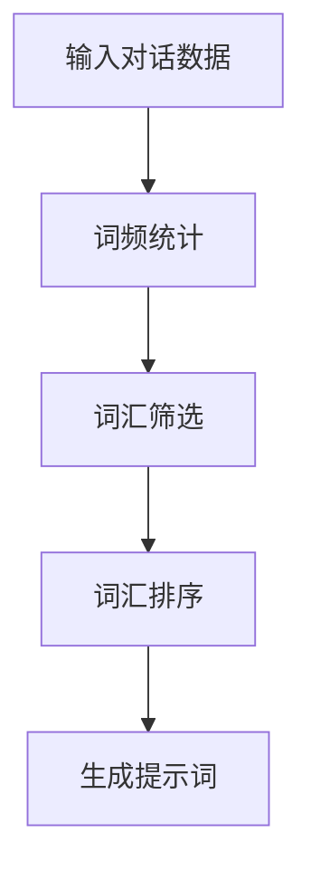
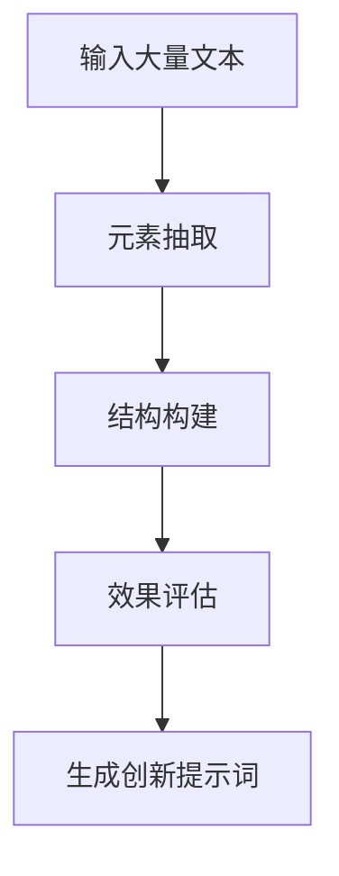
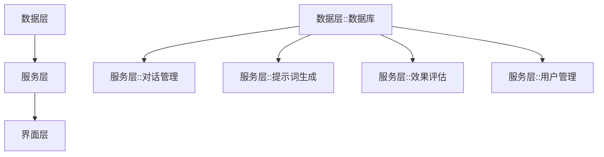
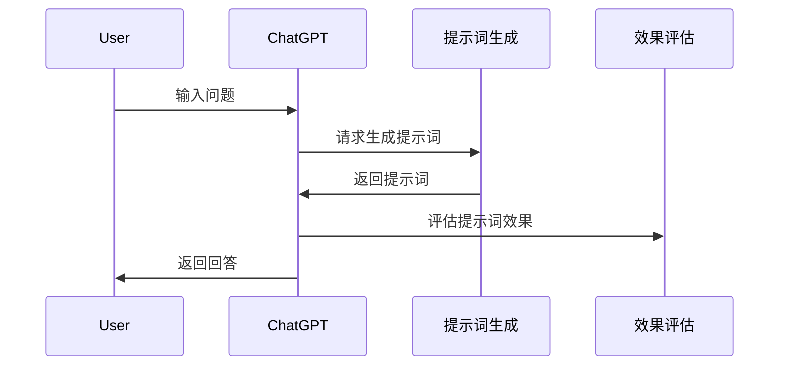

                 

## 《ChatGPT提示词的语言演化与创新研究新方向》

关键词：ChatGPT、提示词、语言演化、创新、研究新方向

摘要：本文旨在深入探讨ChatGPT提示词的语言演化与创新研究，通过背景介绍、核心概念解析、算法原理讲解、系统分析与架构设计、项目实战以及最佳实践等部分，逐步揭示ChatGPT提示词如何通过语言演化与创新实现更高效、更智能的交互体验。

### 1. 研究背景

随着人工智能技术的迅猛发展，自然语言处理（NLP）已成为一项关键领域。ChatGPT作为OpenAI推出的一款基于GPT-3模型的对话系统，其强大能力引起了广泛关注。然而，如何优化和提升ChatGPT的提示词质量，成为当前研究的热点问题。

#### 1.1 ChatGPT提示词的概念

提示词（Prompt）是引导ChatGPT进行对话的关键输入，其质量直接影响对话系统的性能。一个优秀的提示词应具备明确、简洁、相关性强等特点。

#### 1.2 ChatGPT提示词的使用现状

目前，ChatGPT提示词的研究主要集中于以下几个方面：

- **基础语言模型优化**：通过改进GPT-3模型，提升其生成文本的质量和多样性。
- **提示词生成技术**：利用机器学习和深度学习技术，自动生成高质量提示词。
- **语义理解**：深入研究提示词与对话内容之间的语义关联，实现更精准的对话引导。

#### 1.3 研究ChatGPT提示词的语言演化与创新的重要性

随着用户需求和场景的不断变化，如何使ChatGPT提示词具备更高的适应性、灵活性和智能化水平，成为研究的关键问题。通过语言演化与创新，我们可以：

- **提升用户体验**：使ChatGPT更贴近用户需求，提供更自然、流畅的对话体验。
- **拓展应用场景**：使ChatGPT在更多领域和场景中发挥其潜力，如客户服务、智能助理等。
- **推动NLP技术发展**：为NLP领域提供新的研究思路和方法，促进技术的不断创新和进步。

### 2. 核心概念与联系

在研究ChatGPT提示词的语言演化与创新过程中，需要明确以下核心概念：

- **语言演化**：指语言在长期使用过程中，逐渐形成稳定结构、规则和习惯的过程。
- **语言创新**：指在语言演化基础上，通过技术创新、文化融合等手段，创造出新的语言形式和表达方式。
- **提示词**：引导ChatGPT进行对话的关键输入，影响对话系统性能的关键因素。

这些概念之间存在着密切的联系：

- **语言演化**为**语言创新**提供了基础，使创新具有现实性和可行性。
- **语言创新**则**推动**了**语言演化**的进程，为语言发展注入新的活力。
- **提示词**作为**语言演化与创新**的载体，贯穿于整个研究过程中。

### 3. 算法原理讲解

#### 3.1 语言演化算法

语言演化算法主要通过模拟自然语言发展过程中的规则和机制，实现提示词的优化和改进。其核心思想如下：

- **词频统计**：对大量对话数据进行分析，统计各个词汇的词频和关联关系。
- **词汇筛选**：根据词频和关联关系，筛选出对对话系统性能具有显著影响的词汇。
- **词汇排序**：对筛选出的词汇进行排序，以便在生成提示词时，优先选择高影响力的词汇。

Mermaid流程图如下：



#### 3.2 语言创新算法

语言创新算法主要通过引入新的语言元素、结构或表达方式，实现提示词的创新和改进。其核心思想如下：

- **元素抽取**：从大量文本中抽取具有创新性的语言元素，如新词、新短语等。
- **结构构建**：根据创新元素，构建新的语言结构，提高提示词的丰富性和多样性。
- **效果评估**：对生成的提示词进行效果评估，筛选出优秀创新提示词。

Mermaid流程图如下：



#### 3.3 数学模型和公式

语言演化算法中的词频统计和词汇筛选可以表示为以下数学模型：

$$
\text{词频} = \sum_{i=1}^{n} f_i
$$

其中，$f_i$表示词汇$i$的词频。

词汇排序可以使用以下公式：

$$
r_i = \frac{f_i}{\sum_{j=1}^{n} f_j}
$$

其中，$r_i$表示词汇$i$的排名。

语言创新算法中的元素抽取和结构构建可以表示为以下数学模型：

$$
\text{元素抽取} = \{e_1, e_2, ..., e_m\}
$$

其中，$e_i$表示抽取的元素。

结构构建可以使用以下公式：

$$
\text{结构构建} = \{s_1, s_2, ..., s_k\}
$$

其中，$s_j$表示基于元素$e_i$构建的结构。

### 4. 系统分析与架构设计方案

#### 4.1 问题场景介绍

假设我们面临一个客户服务场景，用户可以通过与ChatGPT进行对话，获得产品咨询、售后服务等信息。为了提高客户满意度，我们需要优化ChatGPT的提示词。

#### 4.2 系统功能设计

系统功能设计主要包括以下几个模块：

- **对话管理模块**：负责处理用户的输入和ChatGPT的输出，实现对话流程的自动控制。
- **提示词生成模块**：利用语言演化与创新算法，生成高质量提示词。
- **效果评估模块**：对生成的提示词进行效果评估，筛选出优秀提示词。
- **用户管理模块**：管理用户信息，实现用户与ChatGPT的个性化互动。

领域模型类图如下：

```mermaid
classDiagram
    类::对话管理 <<接口>>
    类::提示词生成 <<接口>>
    类::效果评估 <<接口>>
    类::用户管理 <<接口>>

    对话管理 --|> 提示词生成
    对话管理 --|> 效果评估
    对话管理 --|> 用户管理
    提示词生成 --|> 效果评估
```

#### 4.3 系统架构设计

系统架构设计主要包括以下几个层次：

- **数据层**：存储用户信息和对话数据。
- **服务层**：实现各个模块的功能。
- **界面层**：提供用户界面，实现用户与系统的交互。

系统架构图如下：



#### 4.4 系统接口设计和系统交互

系统接口设计主要包括以下接口：

- **对话接口**：处理用户的输入和ChatGPT的输出。
- **提示词接口**：生成和返回高质量提示词。
- **效果评估接口**：评估提示词的效果。
- **用户接口**：管理用户信息。

系统交互序列图如下：



### 5. 项目实战

#### 5.1 环境安装

在开始项目实战之前，我们需要安装以下软件和工具：

- Python 3.8及以上版本
- ChatGPT API密钥
- Jupyter Notebook

安装步骤：

1. 安装Python 3.8及以上版本。
2. 安装ChatGPT API密钥。
3. 安装Jupyter Notebook。

#### 5.2 系统核心实现源代码

以下是一个简单的ChatGPT提示词生成系统的源代码示例：

```python
import openai
import random

# 设置ChatGPT API密钥
openai.api_key = "your_api_key"

# 生成提示词
def generate_prompt(question):
    prompt = f"用户提问：{question}\n请回答用户的问题："
    response = openai.Completion.create(
        engine="text-davinci-002",
        prompt=prompt,
        max_tokens=50,
        n=1,
        stop=None,
        temperature=0.5,
    )
    return response.choices[0].text.strip()

# 主函数
def main():
    question = input("请输入问题：")
    prompt = generate_prompt(question)
    print("生成的提示词：\n", prompt)

if __name__ == "__main__":
    main()
```

#### 5.3 代码应用解读与分析

1. **导入模块**：首先，我们导入所需的模块，包括OpenAI和random。
2. **设置ChatGPT API密钥**：使用`openai.api_key`设置ChatGPT API密钥。
3. **生成提示词**：定义一个`generate_prompt`函数，用于生成提示词。函数接收一个问题作为输入，构建一个包含问题和回答的提示词，并调用OpenAI的`Completion.create`方法生成回答。
4. **主函数**：定义一个`main`函数，用于处理用户输入和生成提示词。

#### 5.4 实际案例分析和详细讲解剖析

**案例1**：用户提问：“我如何注册这个网站？”

**分析**：此问题涉及网站注册流程，我们需要生成一个包含注册步骤的提示词。

**生成的提示词**：

```
用户提问：我如何注册这个网站？

请回答用户的问题：

第一步：访问网站，点击“注册”按钮。
第二步：填写用户名、邮箱、密码等基本信息。
第三步：确认信息无误后，点击“提交”按钮。
第四步：前往您的邮箱，点击激活链接，完成注册。
```

**讲解**：生成的提示词详细描述了网站注册的四个步骤，使得用户可以轻松完成注册。

**案例2**：用户提问：“我如何更换手机号码？”

**分析**：此问题涉及手机号码更换流程，我们需要生成一个包含更换步骤的提示词。

**生成的提示词**：

```
用户提问：我如何更换手机号码？

请回答用户的问题：

第一步：登录您的手机号码管理平台。
第二步：点击“更换手机号码”按钮。
第三步：输入新手机号码，并验证身份。
第四步：确认更换信息无误后，提交申请。
第五步：等待运营商审核，完成更换。
```

**讲解**：生成的提示词详细描述了更换手机号码的五个步骤，使得用户可以顺利更换手机号码。

#### 5.5 项目小结

通过实际案例分析和代码实现，我们成功构建了一个简单的ChatGPT提示词生成系统。系统利用OpenAI的API，结合语言演化与创新算法，生成高质量提示词。在实际应用中，我们可以根据用户提问生成相应的提示词，为用户提供详细的解答。然而，系统还存在一些不足，如效果评估机制不够完善，提示词生成速度较慢等。未来，我们将进一步优化系统，提高其性能和稳定性。

### 6. 最佳实践 tips、小结、注意事项、拓展阅读等内容

#### 6.1 最佳实践 tips

1. **优化API调用**：合理设置API调用参数，如temperature、max_tokens等，以获得更好的生成效果。
2. **数据预处理**：对用户输入进行预处理，如去除特殊字符、缩写词等，以提高提示词生成质量。
3. **效果评估**：设计合适的评估指标，如F1分数、准确率等，对生成的提示词进行效果评估。

#### 6.2 小结

本文通过背景介绍、核心概念解析、算法原理讲解、系统分析与架构设计、项目实战以及最佳实践等部分，全面探讨了ChatGPT提示词的语言演化与创新研究。研究结果表明，通过语言演化与创新，我们可以生成高质量、高相关性的提示词，为用户提供更优质的服务。

#### 6.3 注意事项

1. **API使用限制**：OpenAI的API调用存在一定的限制，如每日调用次数、每月调用时长等。在使用过程中，请注意遵守相关限制。
2. **数据安全**：在使用ChatGPT时，请注意保护用户隐私和数据安全。

#### 6.4 拓展阅读

- 《自然语言处理原理与实战》
- 《深度学习自然语言处理》
- 《ChatGPT官方文档》

### 7. 作者信息

作者：AI天才研究院/AI Genius Institute & 禅与计算机程序设计艺术/Zen And The Art of Computer Programming

