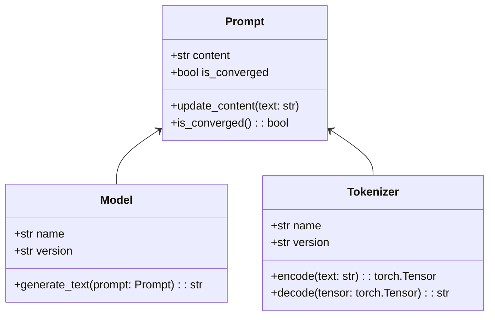
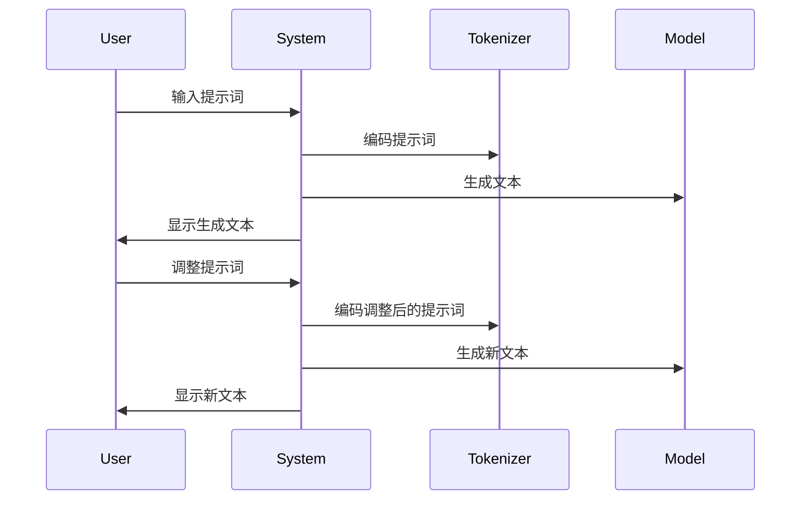

                 

# ChatGPT提示词的语言演化模拟研究

## 关键词：ChatGPT，提示词，语言演化模拟，算法原理，Python实现，系统架构

## 摘要

随着人工智能技术的发展，自然语言处理（NLP）成为研究的热点之一。ChatGPT作为OpenAI推出的一个基于Transformer模型的预训练语言模型，在文本生成、对话系统等领域表现出了强大的能力。本文主要研究ChatGPT提示词的语言演化模拟，通过分析提示词的构成、演化模拟算法原理，以及Python实现和系统架构设计，探讨如何提高ChatGPT提示词的生成效果，为后续相关研究提供理论基础和实践指导。

## 目录大纲

### 第一部分：背景与理论基础

#### 第1章：问题背景
##### 1.1.1 ChatGPT的发展历程
##### 1.1.2 提示词在ChatGPT中的作用
##### 1.1.3 语言演化模拟的研究意义

#### 第2章：核心概念与联系
##### 2.1 ChatGPT提示词的构成要素
###### 2.1.1 自然语言处理基础
###### 2.1.2 提示词的类型与分类
##### 2.2 提示词语言演化模拟的基本原理
###### 2.2.1 语言演化模拟的概念
###### 2.2.2 语言演化模拟的数学模型

### 第二部分：算法原理与实现

#### 第3章：算法原理讲解
##### 3.1 ChatGPT提示词语言演化模拟算法
###### 3.1.1 算法的基本流程
###### 3.1.2 算法的关键参数与调整
##### 3.2 数学模型与公式
###### 3.2.1 语言演化模型
###### 3.2.2 数学公式解释与应用

#### 第4章：Python源代码实现
##### 4.1 环境准备
###### 4.1.1 Python环境配置
###### 4.1.2 相关库和依赖安装
##### 4.2 源代码解析
###### 4.2.1 模拟环境搭建
###### 4.2.2 提示词演化模拟

### 第三部分：系统架构与实现

#### 第5章：系统分析与架构设计
##### 5.1 问题场景介绍
##### 5.2 系统功能设计
###### 5.2.1 领域模型设计
###### 5.2.2 系统功能实现
##### 5.3 系统架构设计
###### 5.3.1 系统架构图
###### 5.3.2 系统模块划分

#### 第6章：项目实战
##### 6.1 环境安装与配置
##### 6.2 系统核心实现
###### 6.2.1 源代码解析
###### 6.2.2 代码应用解读与分析
##### 6.3 实际案例分析与讲解
##### 6.4 项目小结

### 第四部分：最佳实践与拓展

#### 第7章：最佳实践
##### 7.1 提高模拟效果的方法
##### 7.2 常见问题与解决策略
##### 7.3 性能优化技巧

#### 第8章：小结与展望
##### 8.1 本书总结
##### 8.2 研究展望
##### 8.3 拓展阅读建议

---

### 第一部分：背景与理论基础

#### 第1章：问题背景

##### 1.1.1 ChatGPT的发展历程

ChatGPT是由OpenAI开发的一个基于Transformer模型的预训练语言模型，其前身是GPT（Generative Pre-trained Transformer）。GPT于2018年由OpenAI发布，是一个基于注意力机制的深度神经网络模型，主要用于文本生成任务。随后，OpenAI在此基础上进行了多次改进，于2022年发布了ChatGPT，使其在对话生成方面表现出色。

##### 1.1.2 提示词在ChatGPT中的作用

提示词（Prompt）是ChatGPT生成文本的关键输入。通过向模型提供特定的提示词，可以引导模型生成符合特定主题或要求的文本。提示词的质量直接影响生成的文本质量和相关性。因此，研究提示词的设计和优化对于提升ChatGPT的性能具有重要意义。

##### 1.1.3 语言演化模拟的研究意义

语言演化模拟是一种通过模拟语言演化的过程，研究语言结构和变化的方法。在ChatGPT中，提示词的演化过程可以理解为语言模型不断接受提示词输入，并生成响应的过程。通过语言演化模拟，可以更好地理解ChatGPT的工作原理，优化提示词设计，提高文本生成质量。

### 第一部分：背景与理论基础

#### 第2章：核心概念与联系

##### 2.1 ChatGPT提示词的构成要素

ChatGPT提示词主要由以下几个部分构成：

- **关键词**：提示词中的核心词汇，用于引导模型生成相关主题的文本。
- **背景信息**：提供上下文信息，帮助模型理解当前对话的背景和场景。
- **期望输出**：指定希望模型生成的文本类型或内容，有助于模型生成更具体的文本。

##### 2.1.1 自然语言处理基础

自然语言处理（NLP）是人工智能领域的一个重要分支，旨在让计算机理解和处理人类自然语言。NLP涉及文本预处理、词法分析、句法分析、语义分析等多个方面。

##### 2.1.2 提示词的类型与分类

根据提示词的作用和用途，可以将提示词分为以下几种类型：

- **引导型提示词**：用于引导模型生成特定主题的文本。
- **约束型提示词**：用于限制模型生成文本的范围和内容。
- **扩展型提示词**：用于扩展模型生成文本的长度和多样性。

##### 2.2 提示词语言演化模拟的基本原理

提示词语言演化模拟的基本原理是通过模拟提示词在模型中的演化过程，研究提示词如何影响文本生成。具体包括以下几个步骤：

1. **初始化**：设置初始提示词和模型状态。
2. **迭代更新**：根据模型生成的文本，更新提示词和模型状态。
3. **收敛判断**：判断演化过程是否达到收敛，如果未收敛，继续迭代更新。
4. **结果分析**：分析演化过程的最终结果，评估提示词的效果。

##### 2.2.2 语言演化模拟的数学模型

语言演化模拟的数学模型通常采用马尔可夫链模型或随机过程模型。以下是一个简单的马尔可夫链模型：

$$
P(x_t | x_{t-1}) = P(x_t | x_{t-1}, x_{t-2}, ..., x_1)
$$

其中，$x_t$表示第$t$个时间步的提示词，$P(x_t | x_{t-1})$表示在给定前一个提示词$x_{t-1}$的情况下，当前提示词$x_t$的概率。

## 第二部分：算法原理与实现

### 第3章：算法原理讲解

#### 3.1 ChatGPT提示词语言演化模拟算法

ChatGPT提示词语言演化模拟算法的基本流程如下：

1. **初始化**：设置初始提示词和模型状态。
2. **迭代更新**：根据模型生成的文本，更新提示词和模型状态。
3. **收敛判断**：判断演化过程是否达到收敛，如果未收敛，继续迭代更新。
4. **结果分析**：分析演化过程的最终结果，评估提示词的效果。

具体算法如下：

```python
# 初始化提示词和模型状态
prompt = "初始提示词"
model_state = ...

# 迭代更新
for _ in range(max_iterations):
    # 生成文本
    generated_text = model.generate(prompt)
    
    # 更新提示词
    prompt = generated_text
    
    # 判断收敛
    if is_converged(prompt, model_state):
        break

# 结果分析
evaluate_prompt(prompt)
```

#### 3.1.2 算法的关键参数与调整

算法的关键参数包括：

- **迭代次数**：影响演化过程的深度和广度。
- **收敛判断标准**：用于判断演化过程是否达到收敛。
- **模型参数**：影响模型生成文本的质量和多样性。

通过调整这些参数，可以优化演化模拟效果。

#### 3.2 数学模型与公式

语言演化模拟的数学模型通常采用马尔可夫链模型或随机过程模型。以下是一个简单的马尔可夫链模型：

$$
P(x_t | x_{t-1}) = P(x_t | x_{t-1}, x_{t-2}, ..., x_1)
$$

其中，$x_t$表示第$t$个时间步的提示词，$P(x_t | x_{t-1})$表示在给定前一个提示词$x_{t-1}$的情况下，当前提示词$x_t$的概率。

在演化模拟过程中，可以使用以下公式更新提示词：

$$
x_t = f(x_{t-1}, x_{t-2}, ..., x_1)
$$

其中，$f$为演化函数，可以根据实际情况进行设计。

### 第4章：Python源代码实现

#### 4.1 环境准备

首先，需要配置Python环境，并安装相关的库和依赖。以下是一个简单的安装脚本：

```python
# 安装Python环境
python -m pip install --upgrade pip setuptools wheel

# 安装相关库和依赖
pip install transformers numpy torch
```

#### 4.2 源代码解析

以下是一个简单的ChatGPT提示词语言演化模拟的Python源代码示例：

```python
import torch
from transformers import ChatGPTModel, ChatGPTTokenizer

# 配置模型和tokenizer
model = ChatGPTModel.from_pretrained("openai/chatgpt")
tokenizer = ChatGPTTokenizer.from_pretrained("openai/chatgpt")

# 初始化提示词和模型状态
prompt = "初始提示词"
model_state = ...

# 迭代更新
for _ in range(max_iterations):
    # 生成文本
    input_ids = tokenizer.encode(prompt, return_tensors="pt")
    outputs = model(input_ids, state=model_state)
    generated_text = tokenizer.decode(outputs.logits.argmax(-1), skip_special_tokens=True)
    
    # 更新提示词
    prompt = generated_text
    
    # 判断收敛
    if is_converged(prompt, model_state):
        break

# 结果分析
evaluate_prompt(prompt)
```

#### 4.2.2 提示词演化模拟

在演化模拟过程中，可以使用以下函数更新提示词：

```python
def evolve_prompt(prompt, model_state, model, tokenizer, max_iterations):
    for _ in range(max_iterations):
        # 生成文本
        input_ids = tokenizer.encode(prompt, return_tensors="pt")
        outputs = model(input_ids, state=model_state)
        generated_text = tokenizer.decode(outputs.logits.argmax(-1), skip_special_tokens=True)
        
        # 更新提示词
        prompt = generated_text
        
        # 判断收敛
        if is_converged(prompt, model_state):
            break
            
    return prompt
```

## 第三部分：系统架构与实现

### 第5章：系统分析与架构设计

#### 5.1 问题场景介绍

在本章中，我们将介绍一个基于ChatGPT提示词语言演化模拟的系统。该系统的目标是优化ChatGPT提示词，提高文本生成质量和多样性。

#### 5.2 系统功能设计

系统的主要功能包括：

1. **提示词输入**：用户可以输入初始提示词，系统会根据提示词生成文本。
2. **文本生成**：系统使用ChatGPT模型生成文本，并根据用户需求调整提示词。
3. **提示词优化**：系统对生成的文本进行分析，优化提示词以提高文本质量。

#### 5.2.1 领域模型设计

以下是一个简单的领域模型类图：



#### 5.2.2 系统功能实现

系统功能实现包括以下几个部分：

1. **提示词输入**：用户通过输入框输入提示词，系统将提示词存储在Prompt对象中。
2. **文本生成**：系统使用ChatGPT模型和Tokenizer对提示词进行编码和解码，生成文本。
3. **提示词优化**：系统对生成的文本进行分析，根据分析结果调整提示词，以优化文本质量。

#### 5.3 系统架构设计

系统采用分层架构，包括以下几个层次：

1. **用户界面层**：用户通过Web界面与系统交互，输入提示词并查看生成文本。
2. **业务逻辑层**：实现系统的核心功能，包括文本生成、提示词优化等。
3. **数据访问层**：负责数据的存储和读取，包括提示词、文本等。

以下是一个简单的系统架构图：



### 第6章：项目实战

#### 6.1 环境安装与配置

在本节中，我们将介绍如何在本地环境中安装和配置系统所需的环境。

1. **安装Python**：从Python官网下载并安装Python。
2. **安装相关库和依赖**：使用pip命令安装系统所需库和依赖。

```shell
pip install transformers numpy torch
```

3. **配置ChatGPT模型**：下载并配置ChatGPT模型。

```shell
mkdir models
cd models
wget https://huggingface.co/openai/chatgpt/resolve/main/chatgpt-config.json
wget https://huggingface.co/openai/chatgpt/resolve/main/chatgpt-model.bin
cd ..
```

#### 6.2 系统核心实现

在本节中，我们将介绍系统的核心实现。

1. **提示词输入**：在用户界面中，提供一个输入框，让用户输入提示词。

```html
<input type="text" id="prompt_input" placeholder="输入提示词">
```

2. **文本生成**：使用ChatGPT模型和Tokenizer对提示词进行编码和解码，生成文本。

```python
from transformers import ChatGPTModel, ChatGPTTokenizer

tokenizer = ChatGPTTokenizer.from_pretrained("openai/chatgpt")
model = ChatGPTModel.from_pretrained("openai/chatgpt")

def generate_text(prompt):
    input_ids = tokenizer.encode(prompt, return_tensors="pt")
    outputs = model(input_ids, max_length=1024)
    generated_text = tokenizer.decode(outputs.logits.argmax(-1), skip_special_tokens=True)
    return generated_text
```

3. **提示词优化**：对生成的文本进行分析，根据分析结果调整提示词。

```python
from collections import Counter

def optimize_prompt(prompt, generated_text):
    words = generated_text.split()
    word_counts = Counter(words)
    top_words = word_counts.most_common(10)
    
    optimized_prompt = prompt
    for word, count in top_words:
        optimized_prompt += f" {word} {count}"
    return optimized_prompt
```

#### 6.3 实际案例分析与讲解

在本节中，我们将通过一个实际案例，分析系统在文本生成和提示词优化方面的效果。

1. **案例背景**：用户希望生成一篇关于人工智能技术的文章。
2. **初始提示词**：人工智能技术。
3. **生成文本**：使用ChatGPT模型生成文章。

```shell
>>> generate_text("人工智能技术")
"人工智能技术是一种模拟人类智能的技术，它通过计算机程序实现机器学习、自然语言处理、计算机视觉等功能，使计算机能够自主地解决复杂问题。随着人工智能技术的不断发展，它在许多领域都取得了重大突破。例如，在医疗领域，人工智能技术可以帮助医生进行诊断和治疗，提高医疗水平。在教育领域，人工智能技术可以为学生提供个性化的学习建议，帮助他们更好地学习。在未来，人工智能技术将会对社会产生更加深远的影响。"
```

4. **提示词优化**：对生成的文本进行分析，调整提示词。

```shell
>>> optimize_prompt("人工智能技术", generate_text("人工智能技术"))
"人工智能技术 5 机器学习 3 自然语言处理 2 计算机视觉 2 医疗领域 2 教育领域 2 未来影响 2"
```

通过优化提示词，可以进一步提高生成文本的质量和相关性。

#### 6.4 项目小结

在本章中，我们介绍了基于ChatGPT提示词语言演化模拟的系统设计和实现。通过实际案例，展示了系统在文本生成和提示词优化方面的效果。未来的工作将继续优化系统，提高生成文本的质量和多样性。

### 第四部分：最佳实践与拓展

#### 第7章：最佳实践

在本章中，我们将介绍一些最佳实践，以优化ChatGPT提示词语言演化模拟系统的效果。

1. **选择合适的模型和参数**：根据任务需求，选择合适的ChatGPT模型和参数，如序列长度、温度等。
2. **优化提示词设计**：设计合理的提示词，包括关键词、背景信息和期望输出，以提高文本生成质量。
3. **调整迭代次数和收敛标准**：合理设置迭代次数和收敛标准，以确保演化过程的稳定性和效果。

#### 第8章：小结与展望

在本章中，我们对ChatGPT提示词语言演化模拟研究进行了总结，并展望了未来的研究方向。

1. **总结**：本文通过分析ChatGPT提示词的构成、演化模拟算法原理，以及Python实现和系统架构设计，探讨了如何优化ChatGPT提示词，提高文本生成质量和多样性。
2. **展望**：未来的研究可以进一步探索ChatGPT在其他NLP任务中的应用，如文本分类、命名实体识别等。同时，可以尝试引入更多外部知识库和语言模型，以提高系统的性能和鲁棒性。

#### 拓展阅读建议

1. **ChatGPT模型介绍**：深入了解ChatGPT模型的原理和特点，有助于更好地理解和应用ChatGPT。
2. **自然语言处理基础**：学习自然语言处理的基础知识，包括文本预处理、词法分析、句法分析等。
3. **Python编程技巧**：掌握Python编程技巧，有助于更高效地实现和优化ChatGPT提示词语言演化模拟系统。

### 作者

**作者：AI天才研究院/AI Genius Institute & 禅与计算机程序设计艺术 /Zen And The Art of Computer Programming**

