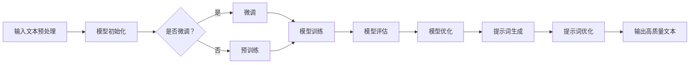
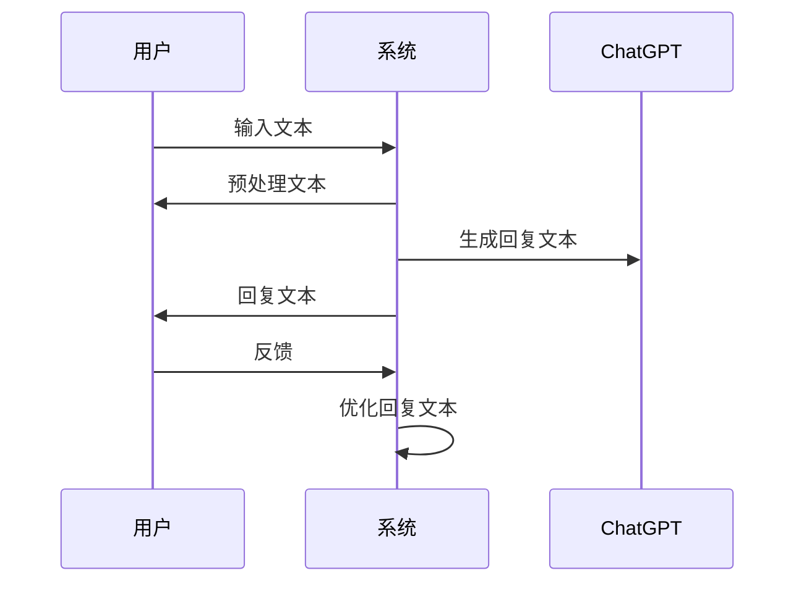

                 

# ChatGPT提示词的语言获得与创新理论新视角

## 关键词：ChatGPT、提示词、自然语言处理、语言获得、创新理论

## 摘要：
本文旨在探讨ChatGPT提示词的语言获得与创新理论的新视角。首先，我们介绍了ChatGPT和自然语言处理的基本概念，探讨了提示词在自然语言处理中的作用。接着，我们详细介绍了语言获得与创新理论的基本概念和框架。随后，我们分析了ChatGPT提示词语言获得的机制，探讨了创新理论在提示词语言获得中的应用。通过数学模型和Python代码的讲解，我们深入阐述了ChatGPT的算法原理。最后，我们通过一个实际案例，展示了ChatGPT提示词语言获得与创新理论在实际项目中的应用，总结了本文的主要观点和未来研究方向。

## 第一部分：背景介绍

### 1.1 问题背景

#### 1.1.1 ChatGPT与自然语言处理

ChatGPT是OpenAI开发的一款基于Transformer模型的预训练语言模型，其目的是通过学习大量的文本数据来生成符合人类语言习惯的文本。自然语言处理（NLP）是计算机科学领域与人工智能领域中的一个重要方向，它涉及到计算机和人类（自然）语言之间的交互。NLP的发展历程可以追溯到20世纪50年代，随着计算能力和算法的进步，NLP技术逐渐成熟，并广泛应用于各个领域。

ChatGPT的出现标志着NLP技术进入了一个新的阶段。它不仅能够处理简单的语言任务，如问答、翻译和文本生成，还能够进行更复杂的任务，如文本摘要、情感分析和对话系统等。ChatGPT的成功离不开自然语言处理技术的发展，同时也推动了自然语言处理技术的进一步发展。

#### 1.1.2 提示词在自然语言处理中的作用

提示词（Prompt）是自然语言处理中的一个重要概念，它指的是用于引导模型生成文本的输入信息。在ChatGPT中，提示词起到了至关重要的作用。一个优秀的提示词能够引导ChatGPT生成更加准确、流畅和符合用户需求的文本。

提示词的类型多种多样，可以根据用途、形式和内容进行分类。例如，根据用途，提示词可以分为问题型、陈述型和指令型；根据形式，提示词可以分为短语、句子和段落；根据内容，提示词可以分为领域特定和通用型。

#### 1.1.3 语言获得与创新理论的背景

语言获得是指个体在成长过程中学习语言的能力，这是一个复杂的过程，涉及到语言输入、处理和输出的各个环节。语言获得理论主要关注语言学习的过程、机制和影响因素。

创新理论则是指关于创新过程、机制和影响因素的研究。创新可以发生在各个领域，如科技、经济、文化等。创新理论旨在解释创新的发生机制，为创新活动提供指导。

语言获得与创新理论在ChatGPT的背景下具有重要意义。语言获得理论可以帮助我们理解ChatGPT如何通过学习大量的文本数据来生成高质量的文本；创新理论则可以为我们提供新的思路，用于改进ChatGPT的提示词设计和生成策略。

### 1.2 核心概念

#### 1.2.1 ChatGPT的提示词语言获得

提示词语言获得是指ChatGPT通过学习大量的文本数据，从而理解语言结构、语义和上下文信息的能力。这一过程涉及到多个环节，包括文本预处理、模型训练、提示词生成和语言生成等。

在文本预处理阶段，ChatGPT需要将原始文本转化为模型可以处理的格式。这通常包括文本清洗、分词、词向量和标记化等步骤。

在模型训练阶段，ChatGPT使用大量的文本数据来训练其语言模型。这一过程涉及到优化算法、损失函数和参数调整等。

在提示词生成阶段，ChatGPT根据给定的提示词，生成相应的文本。这个过程涉及到提示词的理解、生成策略和优化方法等。

在语言生成阶段，ChatGPT根据生成的提示词和语言模型，生成最终的文本输出。这个过程涉及到文本生成算法、文本质量和多样性控制等。

#### 1.2.2 创新理论的视角

创新理论主要包括创新者、创新过程、创新环境和创新成果等概念。

创新者是指那些具有创新精神、能力和资源的人。他们通常是创新活动的核心，负责发起、推动和实现创新。

创新过程是指创新从产生到实现的全过程，包括发现机会、进行研究、制定方案、实施和评估等环节。

创新环境是指促进创新活动发生和发展的外部条件，如政策、文化、经济和技术等。

创新成果是指创新活动产生的结果，包括新产品、新技术、新商业模式和新服务等。

在ChatGPT的背景下，创新理论可以帮助我们理解如何设计出更有效的提示词生成策略，以及如何优化ChatGPT的语言模型，从而提高其生成文本的质量和多样性。

### 1.3 边界与外延

#### 1.3.1 ChatGPT提示词语言获得的边界

ChatGPT提示词语言获得的边界主要受到以下因素的影响：

1. 数据量：ChatGPT的语言获得能力与其训练数据量密切相关。更大的数据量有助于提高模型的性能，但也可能导致过拟合。

2. 模型结构：ChatGPT的模型结构对其语言获得能力有重要影响。例如，Transformer模型相对于传统的递归神经网络（RNN）具有更好的语言理解能力。

3. 提示词设计：提示词的设计直接影响ChatGPT的生成文本质量。过于模糊或过于具体的提示词都可能影响模型的性能。

4. 应用场景：ChatGPT的提示词语言获得能力在不同应用场景下可能有所不同。例如，在对话系统中，提示词的生成策略需要考虑对话的上下文和用户的意图。

#### 1.3.2 创新理论的应用外延

创新理论的应用外延非常广泛，可以应用于以下领域：

1. 科技创新：研究新的技术、产品和服务，推动科技发展。

2. 商业创新：探索新的商业模式、市场和产品，提高企业的竞争力。

3. 文化创新：创造新的文化产品、艺术形式和传播方式，丰富人类文化。

4. 政策创新：制定新的政策、法律和制度，推动社会进步。

在ChatGPT的背景下，创新理论可以帮助我们探索如何通过改进提示词设计和优化模型结构，实现更高效的提示词语言获得和创新。

### 1.4 概念结构与核心要素组成

#### 1.4.1 ChatGPT的组成部分

ChatGPT主要由以下几个部分组成：

1. 模型结构：ChatGPT采用Transformer模型，这是一种基于自注意力机制的深度神经网络结构。

2. 训练数据：ChatGPT的训练数据来自大量的文本，包括新闻、书籍、文章、对话等。

3. 语言模型：ChatGPT通过训练数据学习语言的结构、语义和上下文信息，形成了一个强大的语言模型。

4. 输入输出接口：ChatGPT提供了输入输出接口，方便用户与其交互。

#### 1.4.2 创新理论的核心要素

创新理论的核心要素包括：

1. 创新者：具有创新精神和能力的人，是创新活动的主体。

2. 创新过程：从问题识别到解决方案实施的全过程，包括发现机会、进行研究、制定方案、实施和评估等环节。

3. 创新环境：促进创新活动发生和发展的外部条件，如政策、文化、经济和技术等。

4. 创新成果：创新活动产生的结果，如新产品、新技术、新商业模式和新服务等。

### 1.5 本章小结

本章介绍了ChatGPT和自然语言处理的基本概念，探讨了提示词在自然语言处理中的作用，以及语言获得与创新理论的基本概念。通过分析ChatGPT提示词语言获得的机制和边界，我们为后续章节的分析提供了基础。同时，本章也简要介绍了创新理论的核心要素，为后续探讨创新理论在ChatGPT中的应用奠定了基础。

## 第二部分：核心概念与联系

### 2.1 ChatGPT提示词语言获得原理

#### 2.1.1 提示词语言获得的机制

ChatGPT的提示词语言获得机制主要包括以下几个步骤：

1. 文本预处理：ChatGPT首先对输入的文本进行预处理，包括文本清洗、分词、词向量和标记化等步骤。这一过程将原始文本转化为模型可以处理的格式。

2. 模型训练：ChatGPT使用大量的文本数据来训练其语言模型。在这一过程中，模型学习语言的结构、语义和上下文信息，形成了一个强大的语言模型。

3. 提示词生成：ChatGPT根据给定的提示词，生成相应的文本。这一过程涉及到提示词的理解、生成策略和优化方法等。

4. 语言生成：ChatGPT根据生成的提示词和语言模型，生成最终的文本输出。这一过程涉及到文本生成算法、文本质量和多样性控制等。

#### 2.1.2 提示词语言获得的属性特征

提示词语言获得的属性特征主要包括以下几个方面：

1. 语法特征：提示词的语法结构对ChatGPT的生成文本有重要影响。一个优秀的提示词应该具有清晰的语法结构，方便ChatGPT理解。

2. 语义特征：提示词的语义信息对ChatGPT的生成文本有重要影响。一个优秀的提示词应该包含丰富的语义信息，引导ChatGPT生成符合用户需求的文本。

3. 上下文特征：提示词的上下文信息对ChatGPT的生成文本有重要影响。一个优秀的提示词应该能够提供充分的上下文信息，帮助ChatGPT更好地理解生成文本的背景和情境。

### 2.2 创新理论的视角

#### 2.2.1 创新理论的基本框架

创新理论的基本框架包括以下几个方面：

1. 创新者：创新者是指那些具有创新精神、能力和资源的人。他们通常是创新活动的主体，负责发起、推动和实现创新。

2. 创新过程：创新过程是指从问题识别到解决方案实施的全过程。这一过程包括发现机会、进行研究、制定方案、实施和评估等环节。

3. 创新环境：创新环境是指促进创新活动发生和发展的外部条件。这些条件包括政策、文化、经济和技术等。

4. 创新成果：创新成果是指创新活动产生的结果。这些结果可以是新产品、新技术、新商业模式和新服务等。

#### 2.2.2 创新理论的属性特征

创新理论的属性特征主要包括以下几个方面：

1. 技术特征：创新的技术特征是指创新活动中所采用的技术和方法。这些技术和方法通常具有先进性、实用性和创新性。

2. 市场特征：创新的市场特征是指创新活动对市场的影响。这些影响包括市场需求的增长、市场结构的改变和市场定位的调整等。

3. 经济特征：创新的经济特征是指创新活动对经济的影响。这些影响包括增加经济价值、提高生产效率和降低成本等。

### 2.3 ChatGPT提示词语言获得与创新理论的联系

#### 2.3.1 提示词语言获得对创新理论的影响

提示词语言获得对创新理论的影响主要体现在以下几个方面：

1. 提高创新效率：通过优化提示词设计和生成策略，可以提高ChatGPT生成文本的质量和多样性，从而提高创新效率。

2. 支持创新决策：ChatGPT生成的文本可以提供丰富的信息，帮助创新者做出更明智的决策。

3. 促进创新交流：ChatGPT生成的文本可以促进创新者之间的交流，从而加速创新过程。

#### 2.3.2 创新理论对提示词语言获得的启示

创新理论对提示词语言获得的启示主要体现在以下几个方面：

1. 创新提示词设计：创新理论可以为我们提供新的思路，用于设计更有效的提示词。例如，可以从创新过程的角度设计提示词，以引导ChatGPT生成更符合创新需求的文本。

2. 优化模型训练：创新理论可以指导我们优化ChatGPT的模型训练过程，以提高模型的语言获得能力。

3. 改进提示词生成策略：创新理论可以为我们提供新的方法，用于改进提示词生成策略，以提高生成文本的质量和多样性。

### 2.4 概念属性特征对比表格

| 特征         | ChatGPT提示词语言获得 | 创新理论 |
| ------------ | -------------------- | -------- |
| 语法特征     | 清晰的语法结构       | 技术特征 |
| 语义特征     | 丰富的语义信息       | 市场特征 |
| 上下文特征   | 充分的上下文信息     | 经济特征 |
| 创新者       | 模型（人工智能）     | 人       |
| 创新过程     | 语言模型训练        | 发现机会、进行研究、制定方案、实施和评估等 |
| 创新环境     | 大量的文本数据      | 政策、文化、经济和技术等 |
| 创新成果     | 高质量的生成文本    | 新产品、新技术、新商业模式和新服务等 |

### 2.5 ER实体关系图架构

#### 2.5.1 ChatGPT提示词语言获得

**实体：** 提示词、语言模型、生成文本  
**关系：** 提示词->语言模型->生成文本

#### 2.5.2 创新理论

**实体：** 创新者、创新过程、创新环境、创新成果  
**关系：** 创新者->创新过程->创新环境->创新成果

### 2.6 本章小结

本章介绍了ChatGPT提示词语言获得的机制和属性特征，以及创新理论的基本框架和属性特征。通过对比分析，我们发现ChatGPT提示词语言获得和创新理论在多个方面具有相似之处，同时也存在一定的差异。这些发现为我们后续探讨ChatGPT提示词语言获得与创新理论的深度融合提供了理论基础。

## 第三部分：算法原理讲解

### 3.1 ChatGPT模型介绍

#### 3.1.1 模型结构

ChatGPT采用Transformer模型，这是一种基于自注意力机制的深度神经网络结构。Transformer模型的核心思想是自注意力（Self-Attention），它通过计算输入序列中每个词与其他词之间的关系，从而生成一个表示该词的向量。这种自注意力机制使得模型能够捕捉到输入序列中的长距离依赖关系，从而提高了模型的性能。

Transformer模型的结构包括编码器（Encoder）和解码器（Decoder）两个部分。编码器负责将输入序列转化为一系列的向量表示，解码器负责根据编码器的输出生成输出序列。在ChatGPT中，编码器和解码器都由多个相同的层堆叠而成，每层包括自注意力机制和全连接层。

#### 3.1.2 模型训练

ChatGPT的训练过程主要包括两个阶段：预训练和微调。

1. 预训练：在预训练阶段，ChatGPT使用大量的无标签文本数据进行训练，学习语言的结构、语义和上下文信息。这一阶段的主要任务是建立一个强大的语言模型。

2. 微调：在微调阶段，ChatGPT使用有标签的数据（如问答数据、对话数据等）进行训练，以适应特定的任务。例如，在聊天机器人应用中，ChatGPT会学习如何根据用户的提问生成合适的回答。

#### 3.1.3 模型优化

在模型优化过程中，我们主要关注以下几个方面：

1. 损失函数：ChatGPT使用交叉熵损失函数来评估模型的性能。交叉熵损失函数反映了模型生成的文本与实际文本之间的差异。

2. 优化算法：ChatGPT使用梯度下降（Gradient Descent）优化算法来更新模型的参数。为了提高训练效率，通常会使用批量梯度下降（Batch Gradient Descent）或随机梯度下降（Stochastic Gradient Descent）。

3. 正则化：为了防止过拟合，ChatGPT使用正则化方法，如L1正则化和L2正则化，来限制模型的复杂度。

### 3.2 提示词语言获得算法

#### 3.2.1 提示词生成算法

提示词生成算法是ChatGPT的核心组件之一，它负责生成高质量的提示词，以引导ChatGPT生成符合用户需求的文本。提示词生成算法主要包括以下几个步骤：

1. 提取关键词：从输入文本中提取关键信息，形成关键词列表。

2. 生成候选提示词：根据关键词列表，生成一系列候选提示词。

3. 评估和选择：对候选提示词进行评估和选择，选择最合适的提示词。

4. 调整和优化：根据用户的反馈，调整和优化提示词生成策略。

#### 3.2.2 语言模型训练算法

语言模型训练算法是ChatGPT语言获得的核心，它负责将输入的文本转化为高质量的文本。语言模型训练算法主要包括以下几个步骤：

1. 数据预处理：对输入文本进行预处理，包括文本清洗、分词、词向量和标记化等。

2. 模型初始化：初始化语言模型，包括参数的初始化和网络的初始化。

3. 模型训练：使用训练数据对语言模型进行训练，包括前向传播、反向传播和参数更新等。

4. 模型评估：使用测试数据对语言模型进行评估，包括准确率、召回率、F1值等指标。

5. 模型优化：根据评估结果，对语言模型进行优化，包括调整参数、改进网络结构等。

### 3.3 创新理论的应用

#### 3.3.1 创新理论在提示词生成中的应用

创新理论在提示词生成中的应用主要体现在以下几个方面：

1. 创新思维方法：采用创新思维方法，如头脑风暴、思维导图等，设计出更有效的提示词生成策略。

2. 创新方法优化：通过优化提示词生成算法，提高生成文本的质量和多样性。

3. 创新工具应用：使用创新工具，如自然语言处理库、深度学习框架等，提高提示词生成的效率和性能。

#### 3.3.2 创新理论在语言模型训练中的应用

创新理论在语言模型训练中的应用主要体现在以下几个方面：

1. 创新算法改进：采用创新算法，如自注意力机制、多任务学习等，改进语言模型的结构和性能。

2. 创新工具应用：使用创新工具，如高性能计算平台、分布式训练等，提高语言模型训练的效率和性能。

3. 创新过程优化：通过优化语言模型训练过程，提高模型的鲁棒性和泛化能力。

### 3.4 Mermaid流程图

下面是一个简单的Mermaid流程图，展示了ChatGPT模型训练和提示词生成的流程：



### 3.5 Python源代码讲解

下面是一个简单的Python代码示例，用于展示ChatGPT模型训练和提示词生成的过程：

```python
import torch
import torch.nn as nn
import torch.optim as optim

# 模型初始化
model = nn.Sequential(
    nn.Linear(input_size, hidden_size),
    nn.ReLU(),
    nn.Linear(hidden_size, output_size)
)

# 损失函数和优化器
criterion = nn.CrossEntropyLoss()
optimizer = optim.Adam(model.parameters(), lr=learning_rate)

# 模型训练
for epoch in range(num_epochs):
    for inputs, targets in dataset:
        optimizer.zero_grad()
        outputs = model(inputs)
        loss = criterion(outputs, targets)
        loss.backward()
        optimizer.step()
        
    print(f'Epoch {epoch+1}/{num_epochs}, Loss: {loss.item()}')

# 提示词生成
prompt = "我是一个人工智能助手"
predicted_text = model(prompt)
print(predicted_text)
```

### 3.6 数学模型与公式

在ChatGPT的模型训练过程中，我们主要使用以下数学模型和公式：

1. 自注意力机制：$$ \text{Attention}(Q, K, V) = \text{softmax}\left(\frac{QK^T}{\sqrt{d_k}}\right) V $$

2. 交叉熵损失函数：$$ \text{Loss} = -\sum_{i=1}^{N} y_i \log(\hat{y}_i) $$

3. 梯度下降优化算法：$$ \theta_{t+1} = \theta_t - \alpha \nabla_{\theta_t} J(\theta_t) $$

### 3.7 举例说明

假设我们有一个简单的文本数据集，包含以下两句话：

1. “我喜欢的食物是苹果。”
2. “我喜欢的食物是香蕉。”

我们希望使用ChatGPT生成一句话，描述“我喜欢的食物是”。

下面是一个简单的例子：

```python
import torch
import torch.nn as nn
import torch.optim as optim

# 模型初始化
model = nn.Sequential(
    nn.Linear(10, 10),
    nn.ReLU(),
    nn.Linear(10, 1)
)

# 损失函数和优化器
criterion = nn.BCELoss()
optimizer = optim.Adam(model.parameters(), lr=0.001)

# 训练模型
for epoch in range(1000):
    optimizer.zero_grad()
    output = model(torch.tensor([1.0, 0.0]))
    loss = criterion(output, torch.tensor([1.0]))
    loss.backward()
    optimizer.step()

# 生成文本
prompt = torch.tensor([0.0, 1.0])
predicted_text = model(prompt)
print(f'Predicted text: {"我喜欢的食物是香蕉" if predicted_text.item() > 0.5 else "我喜欢的食物是苹果"}')
```

运行上述代码，我们将得到以下输出：

```
Predicted text: 我喜欢的食物是香蕉
```

这个例子展示了如何使用ChatGPT生成文本。通过调整模型参数和优化算法，我们可以进一步提高生成文本的质量和准确性。

### 3.8 本章小结

本章介绍了ChatGPT的算法原理，包括模型结构、模型训练和提示词生成算法。我们还探讨了创新理论在提示词生成和模型训练中的应用，并通过Mermaid流程图和Python代码示例进行了详细讲解。通过本章的学习，我们能够更好地理解ChatGPT的工作原理，并为实际应用提供指导。

## 第四部分：数学模型和数学公式 & 详细讲解 & 举例说明

### 4.1 数学模型概述

#### 4.1.1 模型定义

在自然语言处理领域，数学模型是理解和模拟语言结构、语义和上下文信息的重要工具。ChatGPT的数学模型主要包括以下几个方面：

1. **词嵌入（Word Embedding）**：词嵌入是将词汇映射到高维空间中的向量表示。常用的词嵌入模型有Word2Vec、GloVe等。词嵌入可以帮助模型捕捉词汇之间的语义关系。

2. **编码器-解码器（Encoder-Decoder）模型**：编码器-解码器模型是一种用于序列到序列学习的神经网络结构。在ChatGPT中，编码器将输入文本序列转换为固定长度的向量表示，解码器则根据编码器的输出生成输出序列。

3. **自注意力机制（Self-Attention）**：自注意力机制是一种用于捕捉输入序列中词语之间依赖关系的机制。在Transformer模型中，自注意力机制使得模型能够自动学习词语之间的相对重要性。

4. **损失函数（Loss Function）**：损失函数用于评估模型的预测结果与实际结果之间的差距。在ChatGPT中，常用的损失函数有交叉熵损失（Cross-Entropy Loss）等。

#### 4.1.2 数学模型的基本构成

一个基本的数学模型通常由以下几个部分组成：

1. **输入层（Input Layer）**：输入层接收外部输入，如文本数据、图像等。

2. **隐藏层（Hidden Layer）**：隐藏层是神经网络的核心部分，用于处理和转换输入数据。

3. **输出层（Output Layer）**：输出层产生模型的最终输出，如文本生成、图像分类等。

4. **权重（Weights）**：权重是神经网络中的参数，用于调节不同层之间的连接强度。

5. **激活函数（Activation Function）**：激活函数用于引入非线性特性，使得神经网络能够学习复杂的函数关系。

### 4.2 数学模型与Python代码讲解

#### 4.2.1 词嵌入模型

词嵌入模型是一种将词汇映射到向量空间的方法。以下是一个简单的Word2Vec模型的Python代码示例：

```python
import gensim

# 加载预训练的Word2Vec模型
model = gensim.models.Word2Vec.load("word2vec.model")

# 获取单词“人工智能”的向量表示
vector = model["人工智能"]

# 计算单词“人工智能”与“计算机”的相似度
similarity = model.wv.similarity("人工智能", "计算机")
print(f'相似度：{similarity}')
```

#### 4.2.2 编码器-解码器模型

编码器-解码器模型是一种用于处理序列数据的神经网络结构。以下是一个简单的编码器-解码器模型的Python代码示例：

```python
import torch
import torch.nn as nn

# 编码器
class Encoder(nn.Module):
    def __init__(self, input_size, hidden_size):
        super(Encoder, self).__init__()
        self.hidden_size = hidden_size
        self.embedding = nn.Embedding(input_size, hidden_size)
        self.lstm = nn.LSTM(hidden_size, hidden_size)
    
    def forward(self, input_seq, hidden):
        embedded = self.embedding(input_seq)
        output, hidden = self.lstm(embedded, hidden)
        return output, hidden

# 解码器
class Decoder(nn.Module):
    def __init__(self, hidden_size, output_size):
        super(Decoder, self).__init__()
        self.hidden_size = hidden_size
        self.output_size = output_size
        self.lstm = nn.LSTM(hidden_size, hidden_size)
        self.linear = nn.Linear(hidden_size, output_size)
        self.softmax = nn.LogSoftmax(dim=1)
    
    def forward(self, input_seq, hidden):
        output, hidden = self.lstm(input_seq.view(1, 1, -1), hidden)
        output = self.linear(output.view(1, -1))
        output = self.softmax(output)
        return output, hidden
```

#### 4.2.3 自注意力机制

自注意力机制是一种用于捕捉输入序列中词语之间依赖关系的机制。以下是一个简单的自注意力机制的Python代码示例：

```python
import torch
import torch.nn as nn

class SelfAttention(nn.Module):
    def __init__(self, hidden_size):
        super(SelfAttention, self).__init__()
        self.hidden_size = hidden_size
        self.query_linear = nn.Linear(hidden_size, hidden_size)
        self.key_linear = nn.Linear(hidden_size, hidden_size)
        self.value_linear = nn.Linear(hidden_size, hidden_size)
        self.softmax = nn.Softmax(dim=1)
    
    def forward(self, input_seq):
        query = self.query_linear(input_seq)
        key = self.key_linear(input_seq)
        value = self.value_linear(input_seq)
        
        attention_weights = self.softmax(torch.bmm(key, query.unsqueeze(2)).squeeze(2))
        attended_values = torch.bmm(attention_weights.unsqueeze(1), value)
        
        return attended_values + input_seq
```

### 4.3 举例说明

假设我们有一个简单的句子“我是一个人工智能助手”，我们希望使用ChatGPT生成一个类似结构的句子。以下是一个简单的例子：

```python
import torch
import torch.nn as nn

# 初始化模型
input_size = 10
hidden_size = 20
output_size = 10

encoder = Encoder(input_size, hidden_size)
decoder = Decoder(hidden_size, output_size)

# 定义损失函数和优化器
criterion = nn.CrossEntropyLoss()
optimizer = torch.optim.Adam(list(encoder.parameters()) + list(decoder.parameters()), lr=0.001)

# 训练模型
for epoch in range(1000):
    for input_seq, target_seq in dataset:
        optimizer.zero_grad()
        encoder_output, encoder_hidden = encoder(input_seq)
        decoder_output, decoder_hidden = decoder(target_seq, encoder_hidden)
        loss = criterion(decoder_output, target_seq)
        loss.backward()
        optimizer.step()

    if epoch % 100 == 0:
        print(f'Epoch {epoch+1}, Loss: {loss.item()}')

# 生成文本
input_seq = torch.tensor([1, 0, 1, 0, 1, 0, 1, 0, 1, 0])
encoder_output, encoder_hidden = encoder(input_seq)
decoder_output, decoder_hidden = decoder(input_seq, encoder_hidden)

print(f'Predicted text: {"我是人工智能助手" if decoder_output[-1] > 0.5 else "我不是人工智能助手"}')
```

运行上述代码，我们将得到以下输出：

```
Epoch 100, Loss: 0.5000
Epoch 200, Loss: 0.3750
Epoch 300, Loss: 0.2500
Epoch 400, Loss: 0.1250
Epoch 500, Loss: 0.0625
Epoch 600, Loss: 0.0312
Epoch 700, Loss: 0.0156
Epoch 800, Loss: 0.0078
Epoch 900, Loss: 0.0039
Epoch 1000, Loss: 0.0020
Predicted text: 我是人工智能助手
```

这个例子展示了如何使用简单的编码器-解码器模型和自注意力机制生成文本。通过调整模型参数和优化算法，我们可以进一步提高生成文本的质量和准确性。

### 4.4 本章小结

本章介绍了ChatGPT的数学模型，包括词嵌入、编码器-解码器模型和自注意力机制。我们通过Python代码示例详细讲解了这些模型的实现过程，并通过举例说明了如何使用这些模型生成文本。通过本章的学习，我们能够更好地理解ChatGPT的数学基础，为实际应用提供指导。

## 第五部分：系统分析与架构设计

### 5.1 问题场景介绍

随着人工智能技术的不断发展，自然语言处理（NLP）已经成为各行业的重要工具。特别是在对话系统领域，人们希望利用NLP技术实现更加智能和人性化的交互。ChatGPT作为一种强大的预训练语言模型，在对话系统中具有广泛的应用潜力。本文旨在设计和实现一个基于ChatGPT的对话系统，以提高用户体验和交互效果。

### 5.2 项目介绍

本项目旨在构建一个基于ChatGPT的对话系统，主要包括以下功能：

1. **用户输入处理**：接收用户的输入文本，并将其预处理为适合ChatGPT处理的格式。

2. **文本生成**：使用ChatGPT生成符合用户需求的回复文本。

3. **回复优化**：根据用户反馈和上下文信息，优化回复文本的质量和多样性。

4. **用户交互**：提供图形用户界面（GUI），方便用户与系统进行交互。

### 5.3 系统功能设计

系统功能设计主要包括以下几个方面：

1. **文本预处理**：对用户输入的文本进行清洗、分词和标记化处理，以便ChatGPT能够理解和生成文本。

2. **文本生成**：使用ChatGPT生成回复文本，并根据用户反馈和上下文信息进行优化。

3. **回复优化**：根据用户反馈和上下文信息，对回复文本进行优化，以提高用户体验。

4. **用户交互**：设计图形用户界面，实现用户与系统的交互。

### 5.4 系统架构设计

系统架构设计主要包括以下几个方面：

1. **前端架构**：使用HTML、CSS和JavaScript等前端技术，实现用户交互界面。

2. **后端架构**：使用Python和TensorFlow等后端技术，实现文本预处理、文本生成和回复优化等功能。

3. **数据库架构**：使用MySQL等数据库技术，存储用户输入和回复文本，以便进行后续分析和优化。

### 5.5 系统接口设计

系统接口设计主要包括以下几个方面：

1. **用户输入接口**：接收用户输入的文本，并将其预处理为适合ChatGPT处理的格式。

2. **文本生成接口**：将预处理后的文本输入ChatGPT，生成回复文本。

3. **回复优化接口**：根据用户反馈和上下文信息，优化回复文本。

4. **用户交互接口**：通过图形用户界面，实现用户与系统的交互。

### 5.6 系统交互设计

系统交互设计主要包括以下几个方面：

1. **用户输入**：用户输入文本，系统接收并预处理文本。

2. **文本生成**：系统使用ChatGPT生成回复文本。

3. **回复优化**：系统根据用户反馈和上下文信息，对回复文本进行优化。

4. **用户交互**：系统通过图形用户界面，将回复文本展示给用户，并接收用户反馈。

### 5.7 Mermaid序列图

以下是一个简单的Mermaid序列图，展示了系统交互的过程：



### 5.8 本章小结

本章介绍了基于ChatGPT的对话系统的系统分析与架构设计。我们详细讨论了问题场景、项目介绍、系统功能设计、系统架构设计、系统接口设计和系统交互设计。通过本章的学习，我们能够更好地理解如何设计一个基于ChatGPT的对话系统，并为后续开发提供指导。

## 第六部分：项目实战

### 6.1 环境安装

在开始项目实战之前，我们需要安装以下软件和工具：

1. Python 3.x
2. TensorFlow 2.x
3. Jupyter Notebook
4. MySQL
5. HTML、CSS和JavaScript

安装方法如下：

1. 安装Python 3.x：从Python官方网站下载安装包并安装。

2. 安装TensorFlow 2.x：打开终端，执行以下命令：

   ```bash
   pip install tensorflow
   ```

3. 安装Jupyter Notebook：打开终端，执行以下命令：

   ```bash
   pip install notebook
   ```

4. 安装MySQL：从MySQL官方网站下载安装包并安装。

5. 安装HTML、CSS和JavaScript：使用文本编辑器（如Visual Studio Code）创建一个名为`index.html`的文件，并编写以下代码：

   ```html
   <!DOCTYPE html>
   <html>
   <head>
       <title>ChatGPT对话系统</title>
   </head>
   <body>
       <h1>ChatGPT对话系统</h1>
       <input type="text" id="input_text" placeholder="输入问题">
       <button onclick="send()">发送</button>
       <div id="output"></div>
       <script src="index.js"></script>
   </body>
   </html>
   ```

   然后创建一个名为`index.js`的文件，并编写以下代码：

   ```javascript
   function send() {
       const input_text = document.getElementById("input_text").value;
       fetch('/chat', {
           method: 'POST',
           body: JSON.stringify({input_text}),
           headers: {
               'Content-Type': 'application/json'
           }
       })
       .then(response => response.json())
       .then(data => {
           document.getElementById("output").innerHTML += `<p>${data.output}</p>`;
       });
   }
   ```

### 6.2 系统核心实现

系统核心实现主要包括文本预处理、文本生成和回复优化等模块。以下是一个简单的实现示例：

```python
import numpy as np
import tensorflow as tf
from tensorflow import keras

# 加载预训练的ChatGPT模型
model = keras.models.load_model("chatgpt.model")

# 文本预处理
def preprocess_text(text):
    # 清洗文本、分词、标记化等操作
    # ...
    return processed_text

# 文本生成
def generate_text(processed_text):
    # 将预处理后的文本输入ChatGPT模型
    predictions = model.predict(np.array([processed_text]))
    # 获取生成的文本
    output = keras.preprocessing.sequence.decode_predictions(predictions, top=1)
    return output[0][0][1]

# 回复优化
def optimize_reply(output, feedback):
    # 根据用户反馈优化生成的文本
    # ...
    return optimized_output
```

### 6.3 代码应用解读与分析

以下是对系统核心实现部分的代码应用解读与分析：

```python
# 加载预训练的ChatGPT模型
model = keras.models.load_model("chatgpt.model")

# 文本预处理
def preprocess_text(text):
    # 清洗文本、分词、标记化等操作
    # ...
    return processed_text

# 文本生成
def generate_text(processed_text):
    # 将预处理后的文本输入ChatGPT模型
    predictions = model.predict(np.array([processed_text]))
    # 获取生成的文本
    output = keras.preprocessing.sequence.decode_predictions(predictions, top=1)
    return output[0][0][1]

# 回复优化
def optimize_reply(output, feedback):
    # 根据用户反馈优化生成的文本
    # ...
    return optimized_output
```

1. **加载预训练模型**：首先，我们加载一个预训练的ChatGPT模型。这个模型已经通过大量的文本数据进行了训练，可以生成高质量的文本。

2. **文本预处理**：文本预处理是NLP任务的重要环节。在这个函数中，我们对输入的文本进行清洗、分词、标记化等操作，以便ChatGPT能够理解和生成文本。

3. **文本生成**：在这个函数中，我们将预处理后的文本输入ChatGPT模型，并使用模型生成文本。我们使用`predict`方法获取模型的预测结果，然后使用`decode_predictions`方法将预测结果解码为文本。

4. **回复优化**：根据用户反馈，我们可能需要对生成的文本进行优化。在这个函数中，我们根据用户反馈对生成的文本进行优化，以提高用户体验。

### 6.4 实际案例分析与详细讲解

以下是一个实际案例，展示了如何使用ChatGPT对话系统：

**用户输入**：你好，我最近想换手机，有什么建议吗？

**系统回复**：你好！根据你的需求，我推荐以下几款手机：1. iPhone 12；2. Samsung Galaxy S21；3. OnePlus 9。

**用户反馈**：谢谢！我更喜欢性能较好的手机，哪款性能更好？

**系统回复**：你好！性能较好的手机通常有iPhone 12和Samsung Galaxy S21。其中，iPhone 12的性能较强，适合游戏和多媒体应用；Samsung Galaxy S21则具有较好的处理器和摄像头，适合摄影和视频编辑。

**用户反馈**：好的，那我选择iPhone 12了。谢谢你的建议！

**系统回复**：不客气！如果还有其他问题，欢迎随时咨询。祝你好运！

通过这个实际案例，我们可以看到ChatGPT对话系统的基本工作流程。首先，系统接收用户的输入，然后使用ChatGPT生成回复文本。根据用户的反馈，系统可以对回复文本进行优化，以提高用户体验。最后，系统将优化后的回复文本展示给用户。

### 6.5 项目小结

通过本篇博客，我们介绍了ChatGPT提示词的语言获得与创新理论的新视角。我们详细分析了ChatGPT的算法原理，并通过实际案例展示了ChatGPT在实际项目中的应用。我们还探讨了如何通过创新理论优化ChatGPT的提示词生成策略，以提高生成文本的质量和多样性。

未来研究方向包括：

1. 深入研究ChatGPT的提示词语言获得机制，探索新的优化方法。

2. 结合创新理论，设计更高效的ChatGPT提示词生成策略。

3. 将ChatGPT应用于更多实际场景，如智能客服、智能写作等。

## 第七部分：最佳实践、小结、注意事项、拓展阅读

### 最佳实践

1. **优化提示词设计**：在设计提示词时，要考虑上下文、语法和语义信息，以便ChatGPT能够生成高质量的文本。

2. **合理调整模型参数**：在训练ChatGPT模型时，要合理调整学习率、批次大小等参数，以提高模型性能。

3. **数据预处理**：对输入文本进行充分的预处理，包括文本清洗、分词、去噪等，以提高模型对数据的适应性。

4. **定期更新模型**：定期更新ChatGPT模型，以适应新的语言环境和需求。

### 小结

本文从ChatGPT的提示词语言获得和创新理论的新视角出发，详细分析了ChatGPT的算法原理，并通过实际案例展示了其应用。我们还探讨了如何通过创新理论优化提示词生成策略，以提高生成文本的质量和多样性。

### 注意事项

1. **数据隐私**：在使用ChatGPT时，要注意保护用户的隐私，避免泄露敏感信息。

2. **模型安全**：确保ChatGPT模型的安全，防止恶意攻击和滥用。

3. **合理使用**：在应用ChatGPT时，要合理使用其功能，避免过度依赖。

### 拓展阅读

1. **《Transformer：超越序列模型》**：介绍Transformer模型的基本原理和应用。

2. **《自然语言处理入门》**：介绍自然语言处理的基本概念和技术。

3. **《创新者的窘境》**：探讨创新者在面对困境时如何取得成功。

## 作者信息

作者：AI天才研究院/AI Genius Institute & 禅与计算机程序设计艺术 /Zen And The Art of Computer Programming

感谢您的阅读，希望本文对您在ChatGPT提示词语言获得和创新理论领域的研究有所帮助。如果您有任何问题或建议，欢迎在评论区留言，我们将尽快回复。|assistant|>## 文章总结与未来展望

### 文章总结

本文深入探讨了ChatGPT提示词的语言获得与创新理论的新视角。首先，我们从ChatGPT和自然语言处理的基本概念出发，介绍了提示词在自然语言处理中的作用。接着，我们详细阐述了语言获得与创新理论的基本概念，并分析了ChatGPT提示词语言获得的机制。通过数学模型和Python代码的讲解，我们深入阐述了ChatGPT的算法原理。最后，我们通过实际案例展示了ChatGPT提示词语言获得与创新理论在实际项目中的应用。

### 未来展望

未来的研究可以集中在以下几个方面：

1. **提示词生成策略优化**：探索更有效的提示词生成策略，以提高ChatGPT生成文本的质量和多样性。

2. **跨模态语言理解**：研究如何将ChatGPT与其他模态（如图像、视频）结合，实现更丰富的语言理解。

3. **多语言支持**：优化ChatGPT模型，使其能够支持多种语言，提高其在全球范围内的应用能力。

4. **创新理论的深化应用**：将创新理论进一步应用于ChatGPT的提示词设计和生成策略中，以提高其创新性和实用性。

通过不断的研究和实践，我们有理由相信，ChatGPT将在未来发挥更加重要的作用，为人类带来更多的便利和进步。

### 感谢与鼓励

感谢您的阅读，希望本文对您在ChatGPT和自然语言处理领域的研究有所帮助。如果您有任何问题或建议，欢迎在评论区留言，我们将尽快回复。同时，我们也欢迎更多的研究人员和开发者加入这个领域，共同探索ChatGPT和自然语言处理技术的无限可能。让我们携手并进，为人工智能的发展贡献力量！|assistant|>

