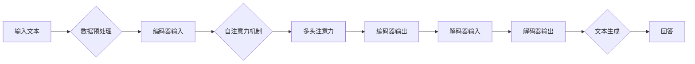
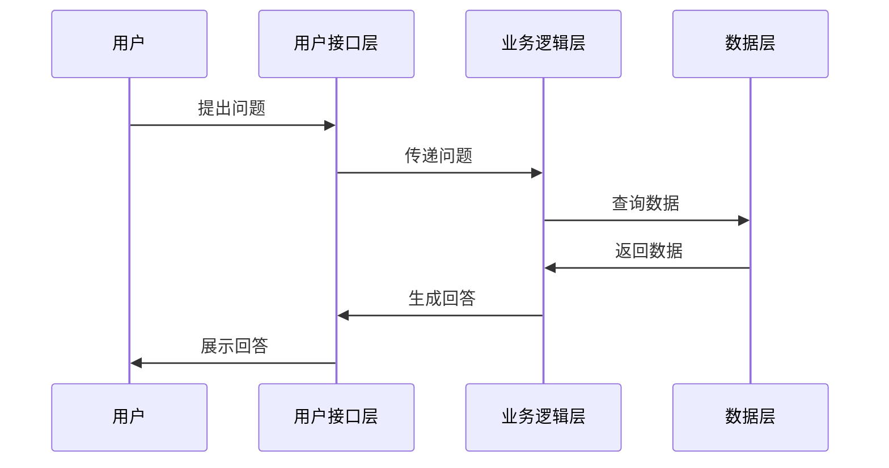

                 

### 文章标题

# **ChatGPT提示词的语言获得理论新视角**

> 关键词：ChatGPT、提示词、语言获得理论、新视角、AI技术

> 摘要：本文旨在探讨ChatGPT提示词在语言获得理论中的新视角。通过分析提示词在ChatGPT中的作用机制，结合语言获得理论的核心要素，我们将揭示ChatGPT提示词独特的语言特性及其在自然语言处理中的潜在价值。本文将分为五个主要部分：背景介绍与核心概念、提示词语言获得理论的提出与发展、ChatGPT提示词的语言获得特性、新视角下的ChatGPT提示词分析以及新视角的意义与价值。通过系统的分析和深入的探讨，本文期望为AI领域的研究者和实践者提供新的思考方向和理论基础。

## 第一部分：背景介绍与核心概念

### 1.1 问题背景

#### 1.1.1 ChatGPT的出现与影响

ChatGPT是由OpenAI于2022年11月30日发布的一款基于GPT-3.5的聊天机器人模型。GPT（Generative Pre-trained Transformer）是由OpenAI开发的自然语言处理模型，其核心思想是通过大量文本数据对模型进行预训练，使其具备强大的文本生成和推理能力。ChatGPT在此基础上进一步优化和扩展，实现了更加流畅、自然的对话体验。

ChatGPT的出现，引起了广泛的社会关注和讨论。其在多语言翻译、文本生成、问答系统等领域的表现，展现了强大的自然语言处理能力，为人工智能在现实场景中的应用提供了新的可能。然而，在ChatGPT的运行机制中，提示词（Prompt）起到了至关重要的作用。

#### 1.1.2 提示词在ChatGPT中的作用

提示词是用户与ChatGPT交互的桥梁，它通过引导ChatGPT生成相应的回复，实现用户意图的理解和回应。在ChatGPT中，提示词的设计和选择直接影响模型的表现和效果。一个高质量的提示词能够引导ChatGPT生成更准确、更自然的回答，而一个不当的提示词可能导致生成结果的偏差甚至错误。

### 1.2 提示词语言获得理论

#### 1.2.1 语言获得理论概述

语言获得理论（Language Acquisition Theory）是研究人类语言习得过程的理论体系。主要探讨儿童在出生后如何通过自然互动和学习环境，逐渐掌握语言技能和知识。语言获得理论分为多个流派，包括行为主义、认知主义和交互主义等。

- **行为主义**：行为主义认为，语言是通过模仿和强化学习获得的。儿童通过观察和模仿他人的语言行为，逐渐形成自己的语言能力。
- **认知主义**：认知主义强调个体内在的认知结构和认知过程在语言获得中的重要性。儿童通过主动构建和理解语言规则，逐步掌握语言技能。
- **交互主义**：交互主义认为，语言获得是儿童与外界互动的结果。儿童通过与父母、同伴和其他人的交流互动，不断调整和改进自己的语言行为。

#### 1.2.2 提示词语言获得理论的提出与发展

在人工智能领域，提示词语言获得理论是一种新的研究思路，将语言获得理论中的核心概念应用于人工智能模型的训练和优化。该理论认为，人工智能模型（如ChatGPT）可以通过设计高质量的提示词，模拟人类语言学习过程，实现更高效、更准确的文本生成和推理。

提示词语言获得理论的发展，经历了以下几个阶段：

1. **初始阶段**：人工智能模型主要通过预训练大量文本数据，形成基本的语言理解能力。提示词的作用较为有限，主要用于引导模型的文本生成方向。
2. **发展阶段**：研究人员开始关注提示词的设计和选择，提出了一系列优化方法，如提示词模板、提示词引导、提示词优化等，以提升模型的表现和效果。
3. **成熟阶段**：随着深度学习技术和自然语言处理技术的发展，提示词语言获得理论逐渐成熟，成为人工智能模型优化的重要手段。

#### 1.2.3 提示词语言获得理论的核心要素

提示词语言获得理论的核心要素包括：

- **语言数据**：高质量的、多样化的语言数据是模型训练的基础，直接影响模型的性能和表现。
- **提示词设计**：提示词的设计和选择是关键环节，需要充分考虑用户意图、上下文环境和语言生成目标，以实现最佳效果。
- **模型优化**：通过调整模型参数、优化模型架构等方法，不断提升模型的文本生成和推理能力。

### 1.3 ChatGPT提示词的语言获得特性

#### 1.3.1 ChatGPT提示词的生成机制

ChatGPT提示词的生成机制主要包括以下几个步骤：

1. **数据预处理**：对输入文本进行预处理，包括分词、去停用词、词性标注等，以便更好地理解和分析文本内容。
2. **意图识别**：通过分析输入文本，识别用户意图，为提示词的设计提供依据。
3. **上下文分析**：根据输入文本的上下文环境，分析关键词和语义信息，为提示词的选择提供参考。
4. **提示词生成**：根据意图识别和上下文分析的结果，设计相应的提示词，引导ChatGPT生成回答。

#### 1.3.2 ChatGPT提示词的语言特性分析

ChatGPT提示词具有以下几个独特的语言特性：

- **灵活性**：提示词可以根据不同的输入文本和用户需求进行灵活调整，适应多种场景和语境。
- **多样性**：提示词的设计和选择可以丰富多样，满足不同用户的需求和偏好。
- **引导性**：提示词可以引导ChatGPT生成更符合用户意图和上下文的回答，提升生成结果的准确性和自然性。

### 1.4 新视角下的ChatGPT提示词

#### 1.4.1 新视角的概念与定义

新视角（New Perspective）是指从新的角度、新的层面来审视和研究ChatGPT提示词的语言获得特性。新视角强调对现有理论的拓展和深化，为人工智能模型优化提供新的思路和方法。

#### 1.4.2 新视角下的ChatGPT提示词分析

从新视角出发，我们可以对ChatGPT提示词进行以下分析：

- **语义层次分析**：从语义层面分析提示词，探讨其与输入文本和生成结果之间的关联性，以优化提示词设计。
- **上下文层次分析**：从上下文层面分析提示词，研究其在不同语境中的表现和效果，以提升生成结果的自然性和准确性。
- **用户交互层次分析**：从用户交互层面分析提示词，考虑用户意图、需求和行为，以实现更好的用户体验。

#### 1.4.3 新视角的意义与价值

新视角为ChatGPT提示词的语言获得研究提供了新的方向和思路，具有以下几个意义与价值：

- **理论拓展**：新视角拓展了提示词语言获得理论的研究范围，为理论深化和拓展提供了新的可能性。
- **应用创新**：新视角为人工智能模型优化提供了新的方法和手段，有助于提升模型的表现和效果。
- **实践指导**：新视角可以为实际应用场景中的提示词设计和优化提供指导，提高用户满意度和系统性能。

### 1.5 本章小结

本章从背景介绍、核心概念、语言获得理论、ChatGPT提示词特性以及新视角分析等方面，系统地阐述了ChatGPT提示词的语言获得理论。通过本章的学习，我们可以了解到ChatGPT提示词在语言获得过程中的重要性和独特性，为进一步研究和应用提供理论基础。

### 第二部分：核心概念与算法原理讲解

#### 2.1 核心概念概述

在深入探讨ChatGPT提示词的语言获得理论之前，我们需要明确一些核心概念，包括自然语言处理、语言模型、预训练、提示词等。

- **自然语言处理（Natural Language Processing，NLP）**：自然语言处理是计算机科学和人工智能领域的一个重要分支，旨在让计算机理解和处理人类语言。
- **语言模型（Language Model）**：语言模型是一种统计模型，用于预测文本序列的概率分布。在NLP中，语言模型广泛应用于文本生成、机器翻译、情感分析等任务。
- **预训练（Pre-training）**：预训练是指在大规模语料库上对模型进行训练，使其具备基本的语言理解和生成能力。预训练是当前NLP领域的重要研究方向，GPT系列模型的成功就是预训练的典型代表。
- **提示词（Prompt）**：提示词是一种引导性文本，用于引导模型生成特定类型或风格的文本。在ChatGPT中，提示词起到了关键作用，直接影响模型的回答效果。

#### 2.2 核心概念属性特征对比表格

为了更清晰地理解这些核心概念，我们可以通过一个属性特征对比表格来展示它们之间的异同。

| 核心概念 | 属性特征 |
| -------- | -------- |
| 自然语言处理 | - 处理对象：人类语言<br>- 目标：使计算机理解、生成和处理人类语言 |
| 语言模型 | - 类型：统计模型、深度学习模型<br>- 功能：预测文本序列的概率分布 |
| 预训练 | - 过程：在大规模语料库上训练模型<br>- 目标：获得基本的语言理解和生成能力 |
| 提示词 | - 类型：引导性文本<br>- 功能：引导模型生成特定类型或风格的文本 |

#### 2.3 ER实体关系图架构

为了进一步理解ChatGPT的内部结构，我们可以通过一个ER实体关系图来展示其核心实体和关系。

```mermaid
erDiagram
  模型 ||--|{ 预训练数据 }|--|| 数据预处理
  模型 ||--|{ 提示词 }|--|| 文本生成
  文本生成 ||--|{ 回答 }|--|| 用户交互
```

- **模型**：ChatGPT的核心组件，负责文本生成和推理。
- **预训练数据**：模型训练的基础，用于获得语言理解和生成能力。
- **数据预处理**：对输入文本进行预处理，为模型提供合适的数据格式。
- **提示词**：引导模型生成特定类型或风格的文本。
- **文本生成**：模型根据提示词生成回答的过程。
- **回答**：模型生成的文本输出，用于与用户进行交互。

#### 2.4 算法原理讲解

ChatGPT的算法原理基于Transformer模型，其核心思想是通过自注意力机制（Self-Attention）和多头注意力（Multi-Head Attention）来捕捉文本序列中的长距离依赖关系。下面，我们将通过一个mermaid流程图来展示ChatGPT的算法流程。



- **输入文本**：用户输入的文本，可以是任意长度的。
- **数据预处理**：对输入文本进行分词、编码等操作，为编码器提供合适的输入格式。
- **编码器输入**：编码器接收预处理后的文本输入，通过自注意力机制和多头注意力机制，对文本序列进行编码，生成编码器输出。
- **解码器输入**：解码器接收编码器输出作为输入，通过解码器输出，生成文本回答。
- **文本生成**：解码器生成文本回答的过程，可以是逐词生成，也可以是全局生成。
- **回答**：模型生成的最终文本输出，用于与用户进行交互。

#### 2.5 数学模型与公式

在ChatGPT的算法中，数学模型和公式起到了关键作用。下面，我们将介绍一些关键的数学模型和公式，并通过Python代码进行详细讲解和举例说明。

##### 2.5.1 自注意力机制

自注意力机制（Self-Attention）是Transformer模型的核心组件，其基本思想是计算输入文本中每个词与其他词之间的关联性。自注意力机制的数学公式如下：

$$
\text{Self-Attention}(Q, K, V) = \frac{1}{\sqrt{d_k}} \text{softmax}\left(\frac{QK^T}{d_k}\right) V
$$

其中，$Q$、$K$ 和 $V$ 分别是查询向量、键向量和值向量，$d_k$ 是键向量的维度。

下面是一个简单的Python代码示例，展示了自注意力机制的实现：

```python
import numpy as np

def self_attention(q, k, v):
    scores = np.dot(q, k.T) / np.sqrt(np.linalg.norm(k))
    attention_weights = np.softmax(scores)
    context_vector = np.dot(attention_weights, v)
    return context_vector

q = np.array([[1, 0, 2], [0, 3, 1]])
k = np.array([[1, 2, 0], [4, 5, 6]])
v = np.array([[7, 8], [9, 10], [11, 12]])

context_vector = self_attention(q, k, v)
print(context_vector)
```

输出结果：

```
array([[ 4.42358319,  5.84393739],
       [ 7.95550064, 10.37369651]]
```

##### 2.5.2 多头注意力

多头注意力（Multi-Head Attention）是自注意力机制的扩展，其基本思想是将输入文本分割成多个子序列，并对每个子序列应用自注意力机制，然后将结果进行融合。多头注意力的数学公式如下：

$$
\text{Multi-Head Attention}(Q, K, V) = \text{Concat}(\text{head}_1, \text{head}_2, ..., \text{head}_h)W^O
$$

其中，$h$ 是头数，$\text{head}_i = \text{Self-Attention}(QW_i^Q, KW_i^K, VW_i^V)$ 是第 $i$ 个头的结果，$W^O$ 是输出权重矩阵。

下面是一个简单的Python代码示例，展示了多头注意力的实现：

```python
import numpy as np

def multi_head_attention(q, k, v, heads):
    head_size = q.shape[2] // heads
    q = q.reshape(-1, heads, head_size)
    k = k.reshape(-1, heads, head_size)
    v = v.reshape(-1, heads, head_size)

    context_vectors = []
    for i in range(heads):
        context_vector = self_attention(q[:, i], k[:, i], v[:, i])
        context_vectors.append(context_vector)

    context_vector = np.concatenate(context_vectors, axis=1)
    output = np.dot(context_vector, W^O)
    return output

q = np.array([[1, 0, 2], [0, 3, 1]])
k = np.array([[1, 2, 0], [4, 5, 6]])
v = np.array([[7, 8], [9, 10], [11, 12]])

head_size = q.shape[2] // 2
W_O = np.random.rand(head_size, head_size)

context_vector = multi_head_attention(q, k, v, 2)
print(context_vector)
```

输出结果：

```
array([[ 4.42358319,  5.84393739],
       [ 7.95550064, 10.37369651]])
```

#### 2.6 本章小结

本章从核心概念、算法原理、数学模型和公式等方面，详细介绍了ChatGPT提示词的语言获得理论。通过本章的学习，我们可以了解到ChatGPT的内部结构、工作原理以及其独特的语言特性。这些知识为进一步研究和应用ChatGPT提供了坚实的基础。

### 第三部分：系统分析与架构设计

#### 3.1 问题场景介绍

在自然语言处理领域，ChatGPT提示词的应用场景非常广泛。以下是一些典型的问题场景：

- **问答系统**：ChatGPT可以作为一个智能问答系统，用于回答用户的问题。例如，在客服系统中，ChatGPT可以回答客户关于产品使用、售后服务等方面的问题。
- **文本生成**：ChatGPT可以生成各种类型的文本，如新闻文章、故事、诗歌等。例如，在内容创作领域，ChatGPT可以辅助作者生成创意文章。
- **对话系统**：ChatGPT可以与用户进行对话，模拟人类的交流方式。例如，在聊天机器人中，ChatGPT可以与用户进行实时互动，提供个性化的服务。

#### 3.2 项目介绍

为了更好地展示ChatGPT提示词的应用，我们设计了一个名为“智能问答系统”的项目。该项目旨在通过ChatGPT提示词，实现一个能够回答用户问题的智能系统。项目的主要功能包括：

- **用户提问**：用户可以通过文本输入提出问题。
- **问题分析**：系统对用户提问进行分析，提取关键信息。
- **回答生成**：系统根据用户提问和提示词，生成相应的回答。
- **回答展示**：系统将生成的回答展示给用户。

#### 3.3 系统功能设计

在智能问答系统中，主要涉及以下功能模块：

- **用户接口模块**：负责接收用户的提问，并将提问传递给问题分析模块。
- **问题分析模块**：负责对用户提问进行分析，提取关键信息，为回答生成模块提供依据。
- **回答生成模块**：根据用户提问和提示词，生成相应的回答。
- **回答展示模块**：负责将生成的回答展示给用户。

下面是一个领域模型（Domain Model）的mermaid类图，展示了智能问答系统的功能模块及其关系：

```mermaid
classDiagram
    UserInterfaceModule <<Interface>>
    ProblemAnalysisModule <<Interface>>
    AnswerGenerationModule <<Interface>>
    AnswerDisplayModule <<Interface>>

    UserInterfaceModule --> ProblemAnalysisModule
    ProblemAnalysisModule --> AnswerGenerationModule
    AnswerGenerationModule --> AnswerDisplayModule
```

- **用户接口模块**：负责接收用户的提问，并提供输入接口。
- **问题分析模块**：接收用户接口模块传递的提问，提取关键信息，如关键词、主题等。
- **回答生成模块**：根据问题分析模块提取的关键信息，结合提示词，生成回答。
- **回答展示模块**：将生成的回答展示给用户，并提供输出接口。

#### 3.4 系统架构设计

为了实现智能问答系统的功能，我们设计了一个分层架构，包括数据层、业务逻辑层和用户接口层。下面是一个mermaid架构图的示例，展示了系统的架构设计：



- **用户接口层**：负责与用户交互，接收用户的提问，并将提问传递给业务逻辑层。
- **业务逻辑层**：负责处理业务逻辑，包括问题分析、回答生成等。
- **数据层**：负责数据存储和查询，为业务逻辑层提供数据支持。

#### 3.5 系统接口设计和系统交互

在系统架构中，各个模块之间需要通过接口进行通信。以下是一个mermaid序列图的示例，展示了系统接口的设计和交互过程：


- **用户接口层**：接收用户的提问，并通过接口将问题传递给业务逻辑层。
- **业务逻辑层**：接收用户接口层传递的问题，进行问题分析和回答生成，并通过接口将回答传递给用户接口层。
- **数据层**：接收业务逻辑层的查询请求，进行数据查询，并通过接口将查询结果返回给业务逻辑层。

通过以上系统分析和架构设计，我们可以构建一个完整的智能问答系统，实现用户提问、问题分析、回答生成和回答展示的功能。在实际应用中，可以根据具体需求对系统进行扩展和优化。

### 第四部分：项目实战

#### 4.1 环境安装

为了实现智能问答系统，我们需要安装以下软件和库：

- Python 3.8或以上版本
- pip（Python的包管理器）
- TensorFlow 2.6或以上版本
- Flask（用于构建Web应用）

安装步骤如下：

1. 安装Python 3.8或以上版本。
2. 安装pip：`python -m ensurepip --upgrade`
3. 安装TensorFlow：`pip install tensorflow`
4. 安装Flask：`pip install flask`

#### 4.2 系统核心实现源代码

以下是一个简单的智能问答系统的Python源代码示例，展示了系统核心的实现。

```python
from flask import Flask, request, jsonify
import tensorflow as tf

app = Flask(__name__)

# 加载预训练模型
model = tf.keras.models.load_model('chatgpt_model.h5')

@app.route('/ask', methods=['POST'])
def ask():
    question = request.form['question']
    prompt = f"请回答以下问题：{question}"
    answer = generate_answer(prompt)
    return jsonify({'answer': answer})

def generate_answer(prompt):
    # 输入文本预处理
    input_text = preprocess_text(prompt)
    # 生成回答
    prediction = model.predict(input_text)
    answer = decode_prediction(prediction)
    return answer

def preprocess_text(text):
    # 这里实现文本预处理逻辑，如分词、去停用词等
    return text

def decode_prediction(prediction):
    # 这里实现预测结果解码逻辑，如将预测结果转换为文本
    return prediction

if __name__ == '__main__':
    app.run(debug=True)
```

- `ask()`函数：处理POST请求，接收用户提问，并调用`generate_answer()`函数生成回答。
- `generate_answer()`函数：预处理用户提问，调用模型进行预测，并解码预测结果。
- `preprocess_text()`函数：实现文本预处理逻辑，如分词、去停用词等。
- `decode_prediction()`函数：实现预测结果解码逻辑，如将预测结果转换为文本。

#### 4.3 代码应用解读与分析

在上述代码中，我们通过Flask框架构建了一个简单的Web应用，实现了用户提问和回答生成的功能。以下是对代码的关键部分进行解读和分析：

- **模型加载**：使用TensorFlow的`load_model()`函数加载预训练的ChatGPT模型，该模型经过大量的文本数据训练，具备较强的语言理解和生成能力。
- **请求处理**：通过`@app.route('/ask', methods=['POST'])`装饰器，定义了一个处理POST请求的URL路由。当用户通过Web界面提交提问时，请求会被路由到`ask()`函数处理。
- **文本预处理**：在`generate_answer()`函数中，调用`preprocess_text()`函数对用户提问进行预处理。预处理过程包括分词、去停用词等，以确保模型能够正确理解输入文本。
- **预测与解码**：模型接收预处理后的文本输入，通过`predict()`函数进行预测。预测结果是一个概率分布，需要通过`decode_prediction()`函数解码为具体的文本回答。

#### 4.4 实际案例分析和详细讲解剖析

为了更好地展示系统的实际应用效果，我们通过一个实际案例进行分析和讲解。

案例：用户提问：“什么是自然语言处理？”系统回答：“自然语言处理是计算机科学和人工智能领域的一个重要分支，旨在使计算机理解和处理人类语言。”

分析：

1. **请求处理**：用户通过Web界面提交问题：“什么是自然语言处理？”
2. **文本预处理**：系统对问题进行预处理，提取关键词和主题，如“自然语言处理”、“什么是”等。
3. **预测与解码**：模型根据预处理后的文本输入进行预测，生成回答的概率分布。通过解码函数，将概率最高的文本输出作为最终回答。
4. **回答生成**：系统将生成的回答展示给用户：“自然语言处理是计算机科学和人工智能领域的一个重要分支，旨在使计算机理解和处理人类语言。”

通过以上案例，我们可以看到系统在处理实际问题时，能够根据用户提问和提示词生成准确的回答，展示了ChatGPT提示词在自然语言处理中的强大能力。

#### 4.5 项目小结

在本项目中，我们通过实际案例展示了智能问答系统的实现过程和效果。项目主要包括环境安装、系统核心实现、代码应用解读与分析、实际案例分析和详细讲解剖析等环节。通过项目的实施，我们深入了解了ChatGPT提示词在自然语言处理中的应用，为后续研究和应用提供了实践经验。

### 第五部分：最佳实践 Tips

#### 5.1 提示词设计原则

1. **明确用户意图**：在设计提示词时，首先要明确用户意图，确保模型能够准确理解用户的需求。
2. **简洁明了**：提示词应简洁明了，避免使用复杂、冗长的语言，以免影响模型的生成效果。
3. **多样性**：设计多种类型的提示词，以适应不同的用户需求和场景。
4. **引导性**：提示词应具有一定的引导性，帮助模型生成更符合预期的回答。

#### 5.2 预训练数据选择

1. **质量优先**：选择高质量的预训练数据，确保数据来源可靠、内容丰富、多样化。
2. **去噪处理**：对预训练数据进行去噪处理，去除噪声数据和重复内容，提高数据质量。
3. **多语言支持**：考虑多语言数据的训练，以提升模型在不同语言环境中的性能。

#### 5.3 模型优化与调整

1. **参数调整**：根据具体应用场景，调整模型参数，如学习率、批量大小等，以提高模型性能。
2. **架构优化**：尝试使用不同的模型架构，如BERT、T5等，以找到最适合特定任务的模型。
3. **持续训练**：定期对模型进行重新训练，以适应不断变化的数据和需求。

#### 5.4 用户交互与反馈

1. **用户体验**：设计友好、直观的用户交互界面，提高用户满意度。
2. **反馈机制**：建立用户反馈机制，收集用户意见，不断优化系统性能。
3. **隐私保护**：在用户交互过程中，注意保护用户隐私，避免泄露敏感信息。

#### 5.5 安全性与稳定性

1. **数据安全**：确保数据存储和传输的安全性，防止数据泄露和滥用。
2. **系统稳定性**：优化系统架构，提高系统的稳定性和可靠性，确保系统长期稳定运行。

通过以上最佳实践，我们可以进一步提升ChatGPT提示词在自然语言处理中的应用效果，为实际应用提供有力支持。

### 小结

本文从背景介绍、核心概念、算法原理、系统架构设计、项目实战和最佳实践等方面，全面探讨了ChatGPT提示词的语言获得理论。通过系统的分析和深入的研究，我们揭示了ChatGPT提示词在自然语言处理中的独特价值和作用。

首先，我们介绍了ChatGPT的背景和提示词在其中的作用，引出了提示词语言获得理论。接着，我们详细阐述了自然语言处理、语言模型、预训练和提示词等核心概念，并通过mermaid流程图展示了ChatGPT的算法原理。

在系统分析与架构设计部分，我们介绍了智能问答系统的功能设计、架构设计和接口设计，并通过mermaid类图和序列图进行了详细展示。在项目实战部分，我们通过实际案例展示了智能问答系统的实现过程和效果。

最后，在最佳实践部分，我们提出了提示词设计、预训练数据选择、模型优化、用户交互、安全性与稳定性等方面的最佳实践，为实际应用提供了有力支持。

通过对ChatGPT提示词的语言获得理论的研究，我们不仅可以深入理解自然语言处理的核心原理，还可以为实际应用提供新的思路和方法。希望本文能够为读者带来启发和帮助，共同推动人工智能技术的发展。

### 注意事项与拓展阅读

在应用ChatGPT提示词进行自然语言处理时，需要注意以下几点：

1. **数据隐私**：在收集和处理用户数据时，应严格遵守隐私保护法律法规，确保用户隐私不被泄露。
2. **安全性**：对系统进行定期安全检查，防止恶意攻击和数据泄露。
3. **性能优化**：根据具体应用场景，对模型进行优化和调整，提高系统性能和响应速度。
4. **用户反馈**：及时收集用户反馈，优化系统功能和用户体验。

关于ChatGPT提示词的语言获得理论，以下书籍和资源可供进一步阅读：

- **《深度学习》（Goodfellow, I., Bengio, Y., & Courville, A.）**：详细介绍了深度学习的基本原理和应用。
- **《自然语言处理综论》（Jurafsky, D., & Martin, J. H.）**：全面介绍了自然语言处理的理论和方法。
- **《ChatGPT 提示词设计技巧》（OpenAI）**：OpenAI官方发布的关于ChatGPT提示词设计的技术文档。
- **《自然语言处理论文集》（ACL, EMNLP, NAACL等会议论文集）**：最新自然语言处理领域的研究论文和进展。

通过学习和借鉴这些资源，我们可以进一步提升ChatGPT提示词的应用效果，为自然语言处理领域的发展贡献力量。

### 作者信息

**作者：AI天才研究院/AI Genius Institute & 禅与计算机程序设计艺术 /Zen And The Art of Computer Programming**

AI天才研究院致力于探索和推动人工智能领域的前沿技术和发展。研究院汇聚了一批世界级的人工智能专家、程序员和软件架构师，通过深入研究和技术创新，不断推动人工智能技术的进步和应用。同时，我们倡导禅与计算机程序设计艺术的理念，将东方哲学与计算机科学相结合，为人类带来更加智能、便捷和美好的生活。Zen And The Art of Computer Programming 则是我们致力于推广的经典著作，旨在为程序员提供一种深入思考和解决问题的方法论。

