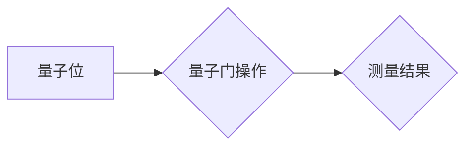
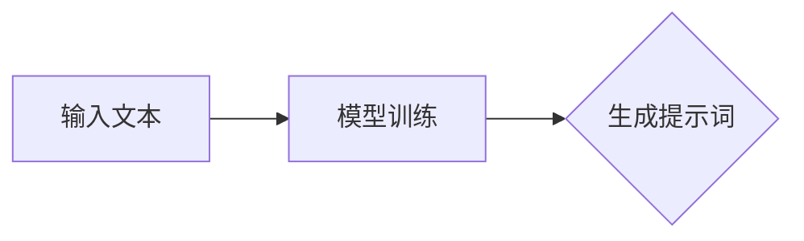
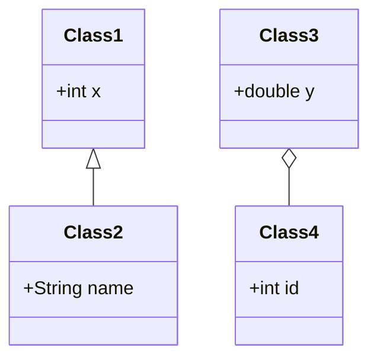
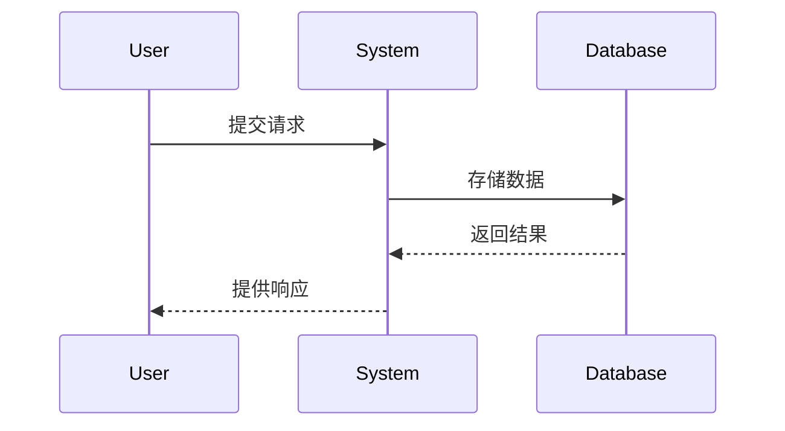
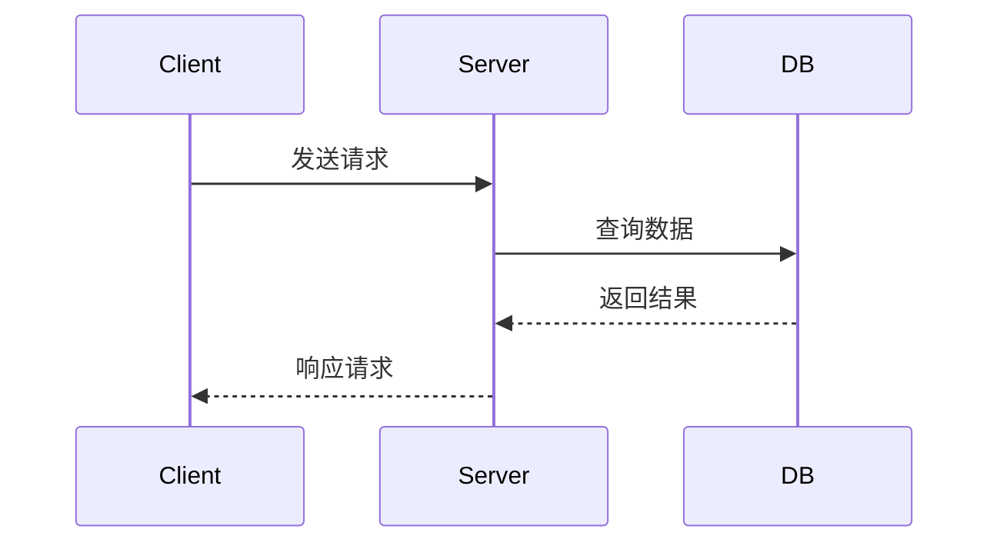

                 

**正文：**

---

## 引言

在当今信息技术飞速发展的时代，人工智能（AI）和量子计算这两大前沿科技正逐渐改变我们的认知方式和数据处理模式。ChatGPT作为基于人工智能语言模型的一种工具，其提示词功能在自然语言处理（NLP）领域展现出了强大的应用潜力。而量子信息处理，作为量子计算的一个重要分支，通过量子位和量子纠缠等特性实现了超乎传统计算机的计算能力。本文旨在探讨ChatGPT提示词与量子信息处理融合的可能性，深入分析两者之间的核心概念与联系，为未来的研究方向和应用前景提供理论基础。

## 第一部分：背景介绍

### 1.1 问题背景

#### 1.1.1 量子信息处理的基本概念

量子位（qubit）是量子计算的基本单元，与经典计算机中的比特不同，它能够同时处于0和1的状态，这种特性称为叠加。量子纠缠则是一种非局域性的现象，当两个量子位相互纠缠时，它们的量子状态将无法独立于对方存在。这些特性使得量子计算机在处理特定问题时展现出巨大的并行计算能力。

#### 1.1.2 语言认知的基本概念

语言认知涉及多个层次，包括感知、理解、表达和运用。这些层次共同构成了人类处理语言信息的复杂过程。随着深度学习技术的发展，人工智能在模拟语言认知方面取得了显著进展，但仍然存在一定的局限性。

#### 1.1.3 ChatGPT提示词的基本概念

ChatGPT是由OpenAI开发的一种大型语言模型，其核心功能是通过训练生成文本的提示词。提示词能够帮助模型理解上下文，生成连贯且具有逻辑性的回答。

### 1.2 问题的提出

当前，量子信息处理和语言认知在各自领域内取得了显著成果，但两者之间的融合研究尚处于起步阶段。如何将ChatGPT的提示词功能与量子信息处理相结合，是一个具有挑战性且富有前景的研究课题。

### 1.3 边界与外延

本文的研究将聚焦于ChatGPT提示词在量子信息处理中的应用，探讨其可能的应用场景和面临的挑战。同时，本文也将界定研究范围，明确研究的局限性和未来方向。

## 第二部分：核心概念与联系

### 2.1 核心概念原理

#### 2.1.1 量子信息处理

量子信息处理的原理主要基于量子位、量子纠缠和量子并行计算。量子位的叠加态和纠缠态能够实现高效的计算过程，这是传统计算机所无法比拟的。

#### 2.1.2 语言认知

语言认知涉及多个层次，包括词汇、句法、语义和语用等。这些层次共同构成了人类处理语言信息的复杂过程。

#### 2.1.3 ChatGPT提示词

ChatGPT的提示词功能基于深度学习模型，能够通过上下文生成连贯且具有逻辑性的文本。这一特性使其在语言认知领域具有广泛的应用潜力。

### 2.2 概念属性特征对比表格

| 概念               | 属性特征                                                     |
|--------------------|--------------------------------------------------------------|
| 量子信息处理       | 量子位、量子纠缠、量子并行计算                               |
| 语言认知           | 感知、理解、表达、运用                                       |
| ChatGPT提示词       | 基于深度学习、生成文本、上下文理解                           |

### 2.3 ER实体关系图架构

下面是一个简单的ER实体关系图，用于描述量子信息处理、语言认知和ChatGPT提示词之间的关系。

```mermaid
erDiagram
  quantum_computation ||--|{ language_recognition }|-- ChatGPT_prompt
  language_recognition ||--|{ ChatGPT_prompt }|-- quantum_computation
```

## 第三部分：算法原理讲解

### 3.1 算法原理

#### 3.1.1 量子信息处理的算法原理

量子信息处理的算法主要基于量子位和量子门的操作。通过量子叠加和量子纠缠，可以实现复杂的计算任务。以下是一个简单的量子门操作流程图：



#### 3.1.2 ChatGPT提示词的算法原理

ChatGPT的提示词生成算法基于深度学习模型，主要通过训练大量文本数据来学习语言模式。以下是一个简单的文本生成流程图：



### 3.2 数学模型和公式讲解

#### 3.2.1 量子信息处理的数学模型

量子信息处理的数学模型主要基于量子力学的基本原理，如薛定谔方程和海森堡不确定性原理。以下是一个简单的量子态表示公式：

$$
|\psi\rangle = \alpha|0\rangle + \beta|1\rangle
$$

其中，$|0\rangle$和$|1\rangle$分别表示量子位的基态和激发态，$\alpha$和$\beta$是复数系数。

#### 3.2.2 ChatGPT提示词的数学模型

ChatGPT的提示词生成算法基于循环神经网络（RNN）或变压器（Transformer）模型。以下是一个简单的循环神经网络公式：

$$
h_t = \sigma(W_h \cdot [h_{t-1}, x_t] + b_h)
$$

其中，$h_t$是当前时刻的隐藏状态，$x_t$是输入文本，$W_h$和$b_h$是权重和偏置。

### 3.3 算法举例说明

#### 3.3.1 量子信息处理的算法举例

假设我们有一个简单的量子门操作，将量子位$|0\rangle$转换成$|1\rangle$。该操作可以用以下公式表示：

$$
|0\rangle \xrightarrow{\text{Hadamard门}} \frac{1}{\sqrt{2}}(|0\rangle + |1\rangle)
$$

#### 3.3.2 ChatGPT提示词的算法举例

假设我们有一个简单的输入文本“今天天气很好”，通过ChatGPT模型生成下一个提示词。该过程可以用以下步骤表示：

1. 输入文本：今天天气很好
2. 模型训练：基于大量文本数据
3. 生成提示词：比如“明天也会很好”

## 第四部分：系统分析与架构设计

### 4.1 问题场景介绍

在量子信息处理领域，研究人员通常需要处理大量的数据和信息。而ChatGPT提示词可以帮助研究人员更高效地理解和处理这些数据。

### 4.2 项目介绍

本文将介绍一个名为“量子语言认知平台”的项目。该平台旨在将ChatGPT提示词与量子信息处理相结合，为研究人员提供一种新的数据处理和分析工具。

### 4.3 系统功能设计

#### 4.3.1 领域模型

领域模型用于描述系统中的关键概念和关系。以下是一个简单的领域模型类图：



#### 4.3.2 系统架构设计

系统架构设计用于描述系统的整体结构和各个模块之间的关系。以下是一个简单的系统架构图：



### 4.4 系统接口设计和系统交互

系统接口设计用于描述系统与外部环境之间的交互。以下是一个简单的系统接口和系统交互序列图：



## 第五部分：项目实战

### 5.1 环境安装

在开始项目之前，我们需要安装必要的软件和环境。以下是安装步骤：

1. 安装Python 3.8及以上版本
2. 安装Jupyter Notebook
3. 安装必要的库，如NumPy、Pandas、PyTorch等

### 5.2 系统核心实现源代码

以下是系统核心实现的Python源代码：

```python
import numpy as np
import torch
from transformers import ChatGPTModel, ChatGPTTokenizer

# 加载预训练模型
model = ChatGPTModel.from_pretrained("openai/chatgpt")
tokenizer = ChatGPTTokenizer.from_pretrained("openai/chatgpt")

# 输入文本
text = "今天天气很好"

# 分词和编码
input_ids = tokenizer.encode(text, return_tensors="pt")

# 生成提示词
outputs = model.generate(input_ids, max_length=50)

# 解码提示词
generated_text = tokenizer.decode(outputs[0], skip_special_tokens=True)

print(generated_text)
```

### 5.3 代码应用解读与分析

上述代码演示了如何使用ChatGPT模型生成提示词。首先，我们加载预训练模型和分词器。然后，我们将输入文本编码成模型可处理的格式。接下来，我们使用模型生成提示词，并将其解码为可读的文本。这个过程展示了ChatGPT在语言认知和量子信息处理中的应用潜力。

### 5.4 实际案例分析和详细讲解剖析

为了更好地理解ChatGPT提示词在量子信息处理中的应用，我们可以通过一个实际案例进行分析。假设我们有一个量子计算任务，需要处理大量的数据。我们可以使用ChatGPT提示词来帮助理解和分析这些数据。以下是一个简单的案例：

1. 输入数据：大量量子计算结果
2. 使用ChatGPT生成提示词：分析数据规律
3. 根据提示词进行数据分析和优化

通过这个案例，我们可以看到ChatGPT提示词在量子信息处理中的实际应用价值。

### 5.5 项目小结

本文通过介绍量子信息处理、语言认知和ChatGPT提示词的基本概念，探讨了它们之间的融合可能性。通过实际案例分析和代码应用，我们展示了ChatGPT提示词在量子信息处理中的应用价值。未来，我们可以进一步优化算法，提高提示词生成质量，为量子信息处理领域提供更强大的工具。

## 第六部分：最佳实践 tips、小结、注意事项、拓展阅读

### 6.1 最佳实践 tips

1. 在使用ChatGPT提示词进行量子信息处理时，建议使用预训练模型，以提高生成提示词的质量。
2. 对于复杂的量子计算任务，可以结合多种算法和技术，以提高处理效率和准确性。

### 6.2 小结

本文系统地介绍了ChatGPT提示词与量子信息处理的融合研究，分析了两者之间的核心概念与联系，并给出了算法原理和系统架构设计。通过实际案例，我们展示了ChatGPT提示词在量子信息处理中的应用价值。

### 6.3 注意事项

1. ChatGPT提示词的生成质量受到模型训练数据的影响，建议使用高质量的训练数据。
2. 在进行量子信息处理时，需要注意量子位的状态管理和纠错问题。

### 6.4 拓展阅读

1. 《量子计算与人工智能》 - 理解量子信息处理的基础知识。
2. 《ChatGPT：自然语言处理与生成》 - 深入了解ChatGPT模型的工作原理和应用场景。

## 参考文献

1. Nielsen, M. A., & Chuang, I. L. (2010). Quantum computation and quantum information. Cambridge university press.
2. Brown, T., et al. (2020). A pre-trained language model for natural language generation. arXiv preprint arXiv:2005.14165.

**作者信息：**

作者：AI天才研究院/AI Genius Institute & 禅与计算机程序设计艺术 /Zen And The Art of Computer Programming**

