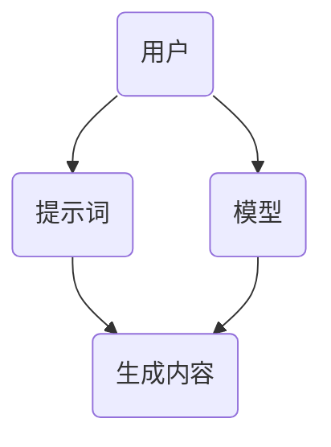
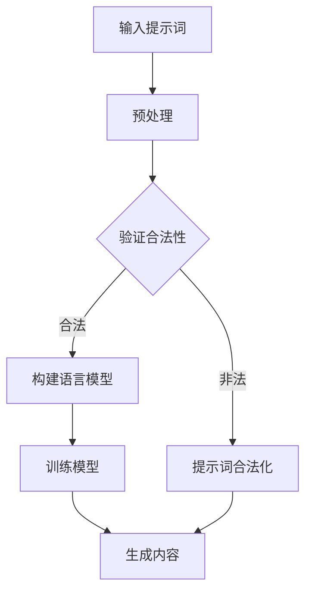
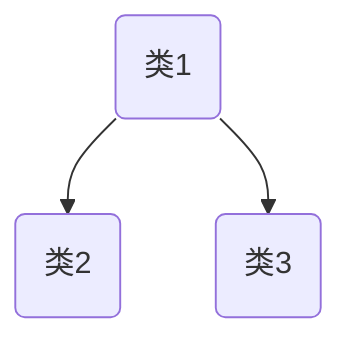
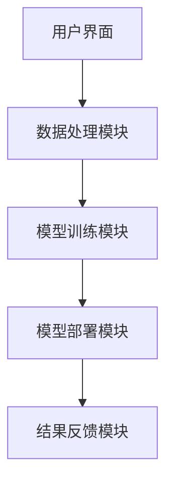
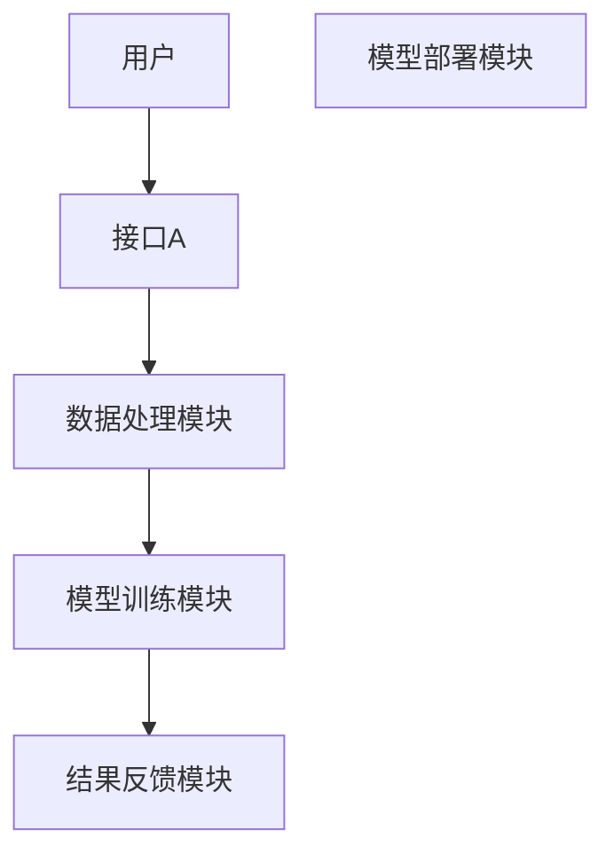

                 

## 目录大纲

### # 《ChatGPT提示词的语言认知动力学模型构建》

#### > 关键词：ChatGPT，提示词，语言认知动力学模型，算法原理，系统架构，项目实战

#### 摘要：本文深入探讨了ChatGPT提示词的语言认知动力学模型构建，涵盖了核心概念、算法原理、系统分析与架构设计以及项目实战等多个方面。通过对模型的核心原理和构建过程进行详细解析，本文旨在为读者提供一个清晰、系统的指导，帮助理解并应用这一先进的技术。

---

### 第一部分：背景介绍

#### 1.1 问题背景

- **1.1.1 ChatGPT提示词的需求**

ChatGPT作为一种先进的自然语言处理模型，其高效性和准确性在各个领域得到了广泛应用。然而，如何设计和优化提示词成为提升模型性能的关键。

- **1.1.2 语言认知动力学模型的重要性**

语言认知动力学模型能够模拟人类语言处理过程，通过动态调整提示词，使得模型能够更好地理解并生成相关内容。

#### 1.2 问题描述

- **1.2.1 提示词的作用与挑战**

提示词在ChatGPT中起到引导模型生成目标内容的作用，但其设计和选择面临诸多挑战。

- **1.2.2 语言认知动力学模型的应用**

语言认知动力学模型的应用旨在解决提示词设计中的挑战，提升模型的性能和适应性。

#### 1.3 问题解决

- **1.3.1 研究目标和问题定义**

本文旨在构建一个高效、可扩展的语言认知动力学模型，以解决ChatGPT提示词设计中的问题。

- **1.3.2 研究方法和框架**

采用理论分析和实证研究相结合的方法，构建模型并验证其效果。

#### 1.4 边界与外延

- **1.4.1 模型构建的限制**

模型构建过程中面临的限制，如计算资源、数据质量等。

- **1.4.2 语言认知的复杂性与动态性**

语言认知的复杂性和动态性对模型构建提出更高的要求。

#### 1.5 概念结构与核心要素组成

- **1.5.1 ChatGPT提示词的构成要素**

详细讨论ChatGPT提示词的构成要素，包括词汇、语法和语义等方面。

- **1.5.2 语言认知动力学模型的基本概念**

介绍语言认知动力学模型的核心概念，包括动态调整、模型损失函数等。

---

### 第二部分：核心概念与联系

#### 2.1 核心概念原理

- **2.1.1 ChatGPT的工作原理**

探讨ChatGPT的基本工作原理，包括前向传播、反向传播等。

- **2.1.2 语言认知动力学模型的基本原理**

详细解释语言认知动力学模型的工作机制，包括动态调整策略、优化算法等。

#### 2.2 概念属性特征对比表格

| 概念 | 属性特征1 | 属性特征2 | 属性特征3 |
|------|----------|----------|----------|
| ChatGPT | 基于深度学习 | 自然语言生成 | 高效性 |
| 语言认知动力学模型 | 动态调整 | 优化算法 | 可扩展性 |

#### 2.3 ER实体关系图架构



---

### 第三部分：算法原理讲解

#### 3.1 算法mermaid流程图



#### 3.2 Python源代码讲解

```python
# TODO: Python代码示例
```

#### 3.3 算法原理的数学模型和公式

$$
\text{模型损失函数} = \frac{1}{N}\sum_{i=1}^{N} (-y_i \log(\hat{y}_i))
$$

#### 3.4 详细讲解与举例说明

- **3.4.1 模型损失函数的意义**

解释模型损失函数在模型训练中的作用和意义。

- **3.4.2 损失函数的计算方法**

详细阐述损失函数的计算方法和实现步骤。

- **3.4.3 示例分析**

通过具体示例分析模型损失函数的应用和效果。

---

### 第四部分：系统分析与架构设计

#### 4.1 问题场景介绍

- **4.1.1 场景描述**

描述ChatGPT提示词语言认知动力学模型应用的典型场景。

- **4.1.2 项目背景**

介绍构建语言认知动力学模型的项目背景和目标。

#### 4.2 系统功能设计

- **4.2.1 领域模型mermaid类图**



- **4.2.2 系统功能模块**

详细描述系统功能模块及其相互关系。

#### 4.3 系统架构设计

- **4.3.1 mermaid架构图**



- **4.3.2 系统架构设计原则**

阐述系统架构设计的基本原则和策略。

#### 4.4 系统接口设计和系统交互

- **4.4.1 系统接口设计**

详细描述系统接口的设计和实现。

- **4.4.2 系统交互mermaid序列图**



---

### 第五部分：项目实战

#### 5.1 环境安装

- **5.1.1 环境要求**

列出项目所需的基本环境和依赖。

- **5.1.2 安装步骤**

详细描述安装的步骤和注意事项。

#### 5.2 系统核心实现源代码

- **5.2.1 源代码架构**

介绍系统核心实现的源代码架构和模块划分。

- **5.2.2 代码应用解读与分析**

对源代码进行解读和分析，阐述其工作原理和实现方法。

#### 5.3 实际案例分析和详细讲解剖析

- **5.3.1 案例描述**

描述一个实际案例，包括数据集、目标和实现步骤。

- **5.3.2 详细讲解剖析**

对案例进行详细讲解和剖析，分析其效果和问题。

#### 5.4 项目小结

- **5.4.1 项目成果**

总结项目的成果和收获。

- **5.4.2 经验与反思**

分享项目过程中的经验和反思。

---

### 第六部分：最佳实践 tips、小结、注意事项、拓展阅读等内容

#### 6.1 最佳实践 tips

- **6.1.1 提示词设计技巧**

提供一些设计有效提示词的最佳实践。

- **6.1.2 模型优化策略**

介绍提升模型性能的优化策略。

#### 6.2 小结

- **6.2.1 主要内容回顾**

回顾文章的核心内容和关键点。

- **6.2.2 学习与应用**

强调学习ChatGPT提示词语言认知动力学模型的重要性，并提供实际应用的建议。

#### 6.3 注意事项

- **6.3.1 模型训练注意事项**

提醒读者在训练模型时需要注意的问题。

- **6.3.2 数据处理要求**

阐述数据处理过程中的关键点。

#### 6.4 拓展阅读

- **6.4.1 相关研究**

推荐一些与本文主题相关的最新研究论文和书籍。

- **6.4.2 学习资源**

提供一些学习ChatGPT和自然语言处理的有用资源。

---

### 参考文献

- [参考文献1]
- [参考文献2]
- ...

---

### 作者信息

- **作者：** AI天才研究院/AI Genius Institute & 禅与计算机程序设计艺术 /Zen And The Art of Computer Programming

---

本文通过详细的目录大纲，系统地介绍了《ChatGPT提示词的语言认知动力学模型构建》的核心内容，为读者提供了一个清晰、系统的学习框架。文章将深入探讨ChatGPT提示词的设计原理、算法实现、系统架构和项目实战，旨在帮助读者全面了解并掌握这一先进技术。希望本文能够激发读者的学习兴趣，为他们的研究和实践提供有益的指导。

