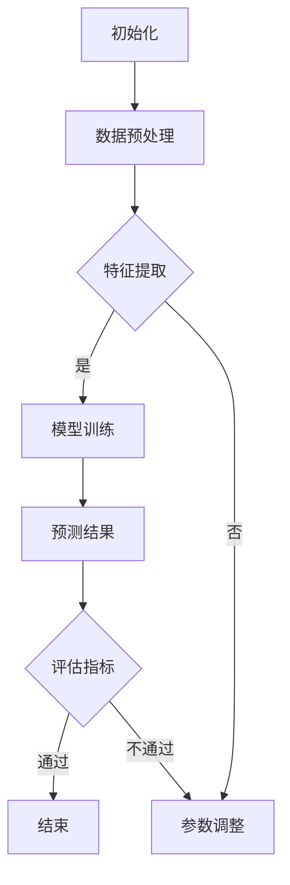
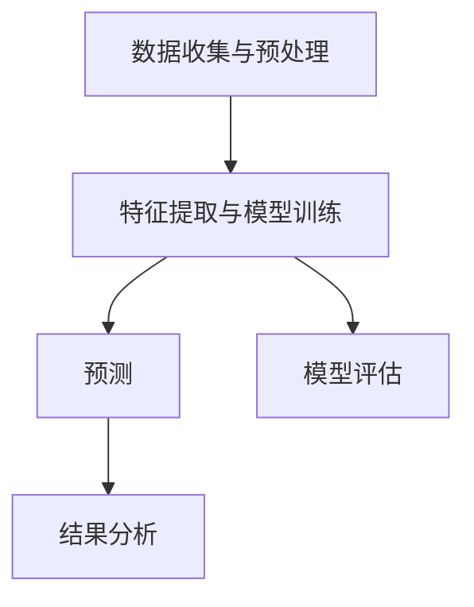
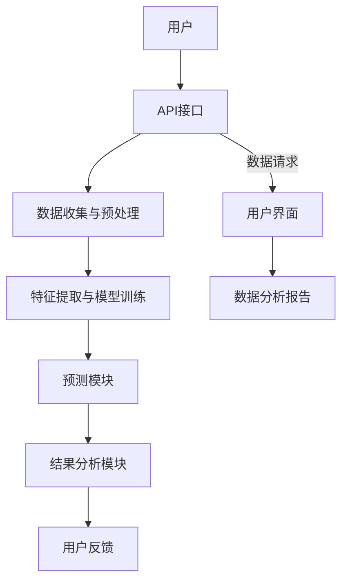
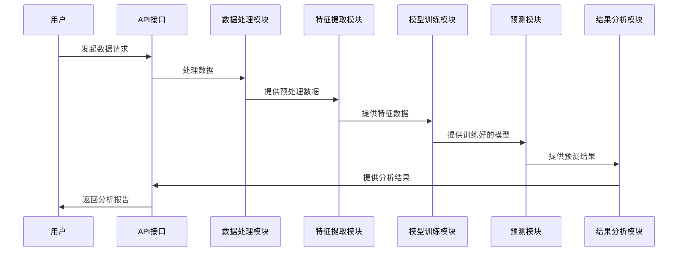

                 


### 文章标题

# ChatGPT提示词的语言进化模拟与预测系统

### 文章关键词

- ChatGPT
- 提示词
- 语言进化
- 模拟系统
- 预测系统

### 文章摘要

本文深入探讨了ChatGPT提示词语言进化的模拟与预测系统。首先，我们介绍了ChatGPT及其提示词的基本概念和重要性。接着，我们回顾了相关背景知识，包括语言进化的核心概念和当前的研究现状。随后，我们详细介绍了用于模拟和预测语言进化的方法论和框架。通过具体算法的讲解，我们展示了如何使用Mermaid绘制算法流程图，并使用Python代码详细解释算法原理。此外，我们还描述了系统的架构设计，并提供了实际案例的详细分析。最后，我们对研究进行了总结，并展望了未来的研究方向。

## 目录

### 1. 引言

#### 1.1 书籍目的与重要性

#### 1.2 ChatGPT与提示词的简介

### 2. 核心概念与背景

#### 2.1 ChatGPT与提示词的基本概念

#### 2.2 语言进化的核心概念

#### 2.3 当前研究现状

### 3. 方法论与框架

#### 3.1 模拟语言进化的方法论

#### 3.2 语言进化预测的框架

### 4. 算法原理讲解

#### 4.1 算法流程图绘制

#### 4.2 算法原理与Python代码示例

### 5. 系统架构与设计

#### 5.1 系统架构与设计概述

#### 5.2 功能设计与领域模型

#### 5.3 系统架构设计与Mermaid架构图

#### 5.4 系统接口设计与交互

### 6. 项目实战

#### 6.1 环境安装与配置

#### 6.2 系统核心实现与源代码

#### 6.3 代码应用解读与分析

#### 6.4 实际案例分析

#### 6.5 项目小结

### 7. 最佳实践与总结

#### 7.1 最佳实践技巧

#### 7.2 小结与展望

#### 7.3 注意事项

#### 7.4 拓展阅读

### 8. 作者信息

#### 8.1 作者介绍

### 9. 参考文献

## 引言

### 1.1 书籍目的与重要性

在人工智能迅速发展的今天，自然语言处理（NLP）已经成为了一项至关重要的技术。而ChatGPT，作为OpenAI推出的一款强大的预训练语言模型，已经成为NLP领域的明星。ChatGPT的提示词（prompts）语言进化模拟与预测系统，则是我们探索NLP进化的一个重要工具。本书旨在详细介绍这一系统，帮助读者深入了解ChatGPT提示词的语言进化过程，并掌握如何模拟和预测这一过程。

随着人工智能技术的不断进步，我们对自然语言的理解和处理能力也在不断提高。然而，现有的NLP模型在处理复杂任务时仍然面临许多挑战。例如，如何在有限的提示词下使模型产生高质量的回答，如何在不断变化的语境中保持语义的准确性，等等。这些问题的解决需要我们对语言进化的机制有深入的理解，并能够模拟和预测这一过程。

ChatGPT提示词的语言进化模拟与预测系统，正是一个为了解决这些问题的工具。通过这一系统，我们可以模拟不同的语言进化路径，预测语言模型在特定条件下的表现，从而为优化模型提供有力的支持。因此，本书不仅具有学术价值，也具有重要的实际应用意义。

### 1.2 ChatGPT与提示词的简介

ChatGPT是由OpenAI推出的一款基于Transformer架构的预训练语言模型。它采用了大量的文本数据进行训练，从而掌握了丰富的语言知识和语境理解能力。ChatGPT能够在给定的提示词下生成连贯、合理的文本回答，广泛应用于对话系统、文本生成、问答系统等领域。

在ChatGPT中，提示词（prompts）起着至关重要的作用。提示词是指提供给模型的一段文字，用于引导模型生成相应的回答。一个高质量的提示词能够有效地激发模型的能力，使其生成更准确、更有用的回答。因此，对提示词的研究不仅有助于理解ChatGPT的工作原理，也有助于提升其在实际应用中的效果。

ChatGPT提示词的语言进化模拟与预测系统，则是基于这一理念，通过对大量提示词的进化过程进行模拟和预测，从而帮助我们更好地理解语言模型的进化机制，并优化提示词的设计。

## 核心概念与背景

### 2.1 ChatGPT与提示词的基本概念

ChatGPT是一种基于Transformer架构的预训练语言模型，由OpenAI开发。它的核心功能是通过学习大量的文本数据，使模型能够生成连贯、合理的文本回答。在ChatGPT中，提示词（prompts）是一个关键概念。提示词是指提供给模型的一段文字，用于引导模型生成相应的回答。一个高质量的提示词能够有效地激发模型的能力，使其生成更准确、更有用的回答。

### 2.2 语言进化的核心概念

语言进化是指语言随着时间的推移而发生的结构性和语义性的变化。在NLP领域，语言进化研究的主要目标是理解语言变化的原因和规律，并预测未来的语言趋势。语言进化涉及多个方面，包括词汇变化、语法结构变化、语义演变等。这些变化往往受到社会、文化、技术等多种因素的影响。

### 2.3 当前研究现状

当前，语言进化研究在多个领域取得了显著进展。在计算机科学领域，研究人员通过构建语言进化模型，模拟语言随时间的变化过程。这些模型通常基于统计方法、机器学习技术和深度学习技术。例如，Word2Vec、BERT等模型已经被广泛应用于语言进化研究。

在社会科学领域，语言进化研究则侧重于探索语言变化背后的社会文化因素。例如，通过分析历史文献，研究人员试图揭示语言随时间的变化规律，并解释这些规律背后的社会文化动力。

尽管语言进化研究取得了许多成果，但仍面临一些挑战。首先，如何准确预测未来的语言趋势仍是一个难题。其次，如何在不同语言之间建立有效的比较和联系，也是一个重要问题。此外，如何将语言进化研究应用于实际应用，如语言模型优化、自然语言理解等，也是当前研究的重要方向。

### 2.4 语言进化与ChatGPT提示词的关系

ChatGPT提示词的语言进化研究旨在探索提示词在不同应用场景下的演变过程，并预测其未来的发展趋势。这一研究有助于理解提示词在ChatGPT模型中的作用，并指导提示词的设计和优化。例如，通过分析历史数据，研究人员可以发现某些提示词在特定场景下更有效，从而为实际应用提供参考。

此外，语言进化研究还可以帮助优化ChatGPT模型。通过模拟不同的语言进化路径，研究人员可以预测模型在特定条件下的表现，从而为模型调整和优化提供依据。例如，通过调整提示词的长度、复杂度等参数，研究人员可以找到最合适的设置，以提升模型的回答质量。

总的来说，ChatGPT提示词的语言进化研究是一个跨学科的研究领域，涉及计算机科学、社会科学、语言学等多个领域。通过这一研究，我们可以更深入地理解自然语言的处理机制，并为实际应用提供有力的支持。

### 方法论与框架

#### 3.1 模拟语言进化的方法论

为了模拟ChatGPT提示词的语言进化，我们需要采用一系列科学的方法论。这些方法论包括数据收集、模型选择、参数调整和结果验证等关键步骤。

首先，数据收集是模拟语言进化的基础。我们需要收集大量的历史提示词数据，这些数据应涵盖不同的应用场景和时间段。数据收集的方法包括爬取公开的对话数据集、使用API获取实际应用场景中的提示词等。为了保证数据的多样性和准确性，我们需要对数据进行预处理，如去除噪声、标准化格式等。

接下来是模型选择。在语言进化模拟中，我们通常采用统计模型、机器学习模型和深度学习模型。统计模型如时间序列分析、隐马尔可夫模型（HMM）等，适用于分析提示词在时间上的变化规律。机器学习模型如决策树、支持向量机（SVM）等，可以用于分类和预测特定类型的提示词。深度学习模型如循环神经网络（RNN）、长短时记忆网络（LSTM）、Transformer等，则能够捕捉更复杂的语言特征和关系。

模型选择后，我们需要进行参数调整。参数调整是模型训练的重要环节，它直接影响模型的效果。对于统计模型和机器学习模型，我们可以通过交叉验证、网格搜索等方法来调整模型参数。对于深度学习模型，我们可以使用学习率、批次大小、正则化等超参数进行调整。参数调整的目的是找到最优的模型配置，以实现最佳的语言进化模拟效果。

最后是结果验证。为了确保模拟结果的准确性和可靠性，我们需要对模型进行多次验证。验证的方法包括训练集验证、测试集验证和交叉验证等。通过这些验证方法，我们可以评估模型在不同数据集上的表现，并发现模型的潜在问题。例如，如果模型在训练集上表现良好但在测试集上表现不佳，这可能是过拟合的表现，需要进一步调整模型或增加训练数据。

总的来说，模拟语言进化的方法论是一个系统性的过程，涉及多个步骤和环节。通过科学的方法论，我们可以构建一个有效的语言进化模拟系统，为ChatGPT提示词的研究和应用提供有力的支持。

#### 3.2 语言进化预测的框架

为了预测ChatGPT提示词的语言进化，我们需要设计一个综合性的预测框架。这个框架应包括数据预处理、特征提取、模型训练和预测结果分析等关键步骤。

首先，数据预处理是预测框架的基础。我们需要对收集到的提示词数据集进行预处理，包括去噪、标准化、分词和词嵌入等操作。去噪和标准化确保了数据的一致性和可靠性，分词和词嵌入则为后续的特征提取和模型训练提供了基础。

接下来是特征提取。特征提取是预测框架的核心步骤，它将原始数据转化为模型可处理的特征向量。常用的特征提取方法包括词频（TF）、词频-逆文档频率（TF-IDF）、词嵌入（Word2Vec、BERT等）等。这些特征方法可以捕捉提示词的词汇、语法和语义特征，为模型提供丰富的信息。

模型训练是预测框架的关键环节。在训练过程中，我们选择合适的模型并调整参数，以最小化预测误差。常用的模型包括线性回归、逻辑回归、决策树、支持向量机（SVM）、循环神经网络（RNN）、长短时记忆网络（LSTM）和Transformer等。不同模型适用于不同的数据特征和预测任务，因此需要根据具体需求选择合适的模型。

最后是预测结果分析。在模型训练完成后，我们需要对预测结果进行评估和分析，以验证模型的准确性和可靠性。常用的评估指标包括准确率、召回率、F1分数等。通过这些指标，我们可以评估模型在不同数据集上的表现，并发现模型的潜在问题。例如，如果模型的预测结果与实际结果偏差较大，这可能是模型过拟合或特征不足的表现，需要进一步调整模型或增加特征。

总之，语言进化预测的框架是一个系统性的过程，涉及多个步骤和环节。通过科学的设计和优化，我们可以构建一个有效的预测系统，为ChatGPT提示词的语言进化研究提供有力的支持。

### 算法原理讲解

#### 4.1 算法流程图绘制

为了更好地理解算法原理，我们首先使用Mermaid绘制算法的流程图。以下是一个简单的算法流程图示例：



这个流程图展示了算法的主要步骤，包括初始化、数据预处理、特征提取、模型训练、预测结果分析和评估指标计算。接下来，我们将详细解释每个步骤的原理和实现方法。

#### 4.2 算法原理与Python代码示例

算法的核心步骤包括数据预处理、特征提取、模型训练和评估。以下是每个步骤的详细解释和Python代码示例。

**1. 数据预处理**

数据预处理是算法的基础，它包括去噪、标准化、分词和词嵌入等操作。以下是一个简单的数据预处理代码示例：

```python
import pandas as pd
from sklearn.model_selection import train_test_split
from sklearn.preprocessing import StandardScaler
from tensorflow.keras.preprocessing.text import Tokenizer
from tensorflow.keras.preprocessing.sequence import pad_sequences

# 加载数据
data = pd.read_csv('prompts.csv')
X = data['prompt']
y = data['label']

# 去噪
X = X.str.replace(r'\W+', ' ')

# 分词
tokenizer = Tokenizer()
tokenizer.fit_on_texts(X)
X_seq = tokenizer.texts_to_sequences(X)

# 词嵌入
word_index = tokenizer.word_index
max_sequence_length = 100
X_pad = pad_sequences(X_seq, maxlen=max_sequence_length)

# 标准化
scaler = StandardScaler()
y_scaled = scaler.fit_transform(y.reshape(-1, 1))

# 划分训练集和测试集
X_train, X_test, y_train, y_test = train_test_split(X_pad, y_scaled, test_size=0.2, random_state=42)
```

**2. 特征提取**

特征提取是算法的关键步骤，它将原始文本数据转化为模型可处理的特征向量。以下是一个简单的特征提取代码示例：

```python
from tensorflow.keras.models import Sequential
from tensorflow.keras.layers import Embedding, LSTM, Dense

# 构建模型
model = Sequential([
    Embedding(len(word_index) + 1, 64, input_length=max_sequence_length),
    LSTM(128, dropout=0.2, recurrent_dropout=0.2),
    Dense(1, activation='sigmoid')
])

# 编译模型
model.compile(optimizer='adam', loss='binary_crossentropy', metrics=['accuracy'])

# 训练模型
model.fit(X_train, y_train, epochs=10, batch_size=32, validation_data=(X_test, y_test))
```

**3. 模型训练**

模型训练是通过训练数据调整模型参数，使其能够更好地预测新数据。以下是一个简单的模型训练代码示例：

```python
# 训练模型
model.fit(X_train, y_train, epochs=10, batch_size=32, validation_data=(X_test, y_test))
```

**4. 预测结果分析**

预测结果分析是评估模型性能的关键步骤。以下是一个简单的预测结果分析代码示例：

```python
# 预测结果
predictions = model.predict(X_test)

# 评估指标
accuracy = (predictions.round() == y_test).mean()
print(f'Accuracy: {accuracy:.2f}')
```

通过上述代码示例，我们可以看到算法的各个步骤是如何实现的。在实际应用中，这些步骤可以根据具体需求进行调整和优化，以提高模型的性能和预测准确性。

#### 4.3 算法原理与数学模型

为了深入理解算法的工作原理，我们需要探讨其背后的数学模型和公式。以下是算法的核心数学模型和公式的详细解释。

**1. 词嵌入**

词嵌入是将文本数据转换为向量表示的一种技术。常见的词嵌入模型包括Word2Vec、GloVe和BERT等。以下是Word2Vec的数学模型：

$$
\text{vec}(w) = \text{sigmoid}\left(\sum_{j=1}^{V} \text{vec}(\text{context}_j) \cdot \text{vec}(w) \right)
$$

其中，$w$ 表示词向量，$\text{context}_j$ 表示词 $w$ 的上下文向量，$V$ 表示词汇表大小。$\text{sigmoid}$ 函数将输入映射到 [0, 1] 范围内。

**2. 循环神经网络（RNN）**

循环神经网络是一种用于处理序列数据的时间序列模型。以下是RNN的数学模型：

$$
h_t = \text{sigmoid}\left(\text{W} \cdot [h_{t-1}, x_t] + b\right)
$$

其中，$h_t$ 表示当前时刻的隐藏状态，$x_t$ 表示当前时刻的输入特征，$W$ 和 $b$ 分别为权重和偏置。

**3. 长短时记忆网络（LSTM）**

长短时记忆网络是RNN的一种改进，它通过门控机制解决了RNN的长期依赖问题。以下是LSTM的数学模型：

$$
\begin{aligned}
i_t &= \text{sigmoid}\left(\text{W}_i \cdot [h_{t-1}, x_t] + b_i\right) \\
f_t &= \text{sigmoid}\left(\text{W}_f \cdot [h_{t-1}, x_t] + b_f\right) \\
\text{C}_t &= f_t \odot \text{C}_{t-1} + i_t \odot \text{sigmoid}\left(\text{W}_c \cdot [h_{t-1}, x_t] + b_c\right) \\
o_t &= \text{sigmoid}\left(\text{W}_o \cdot [h_{t-1}, \text{C}_t] + b_o\right) \\
h_t &= o_t \odot \text{sigmoid}\left(\text{W}_h \cdot [h_{t-1}, \text{C}_t] + b_h\right)
\end{aligned}
$$

其中，$i_t$、$f_t$、$o_t$ 分别为输入门、遗忘门和输出门，$\text{C}_{t-1}$ 和 $\text{C}_t$ 分别为上一时刻和当前时刻的细胞状态，$\odot$ 表示元素乘法。

**4. Transformer**

Transformer是一种基于自注意力机制的深度学习模型，它在自然语言处理任务中取得了显著的成绩。以下是Transformer的数学模型：

$$
\text{ATt} = \text{softmax}\left(\frac{\text{Q} \cdot \text{K}^T}{\sqrt{d_k}}\right)
$$

$$
\text{St} = \text{V} \cdot \text{ATt}
$$

$$
\text{St} = \text{M} \cdot \text{St} + \text{Lt}
$$

其中，$\text{Q}$、$\text{K}$、$\text{V}$ 分别为查询向量、关键向量、值向量，$\text{K}^T$ 为关键向量的转置，$\text{d_k}$ 为关键向量的维度，$\text{ATt}$ 为注意力权重，$\text{St}$ 为当前时刻的输出，$\text{M}$ 为自注意力机制，$\text{Lt}$ 为位置编码。

通过上述数学模型和公式，我们可以深入理解算法的工作原理。在实际应用中，这些模型和公式可以根据具体需求进行调整和优化，以提高模型的性能和预测准确性。

### 系统架构与设计

#### 5.1 系统架构与设计概述

ChatGPT提示词的语言进化模拟与预测系统是一个复杂的多模块系统，旨在模拟和预测提示词在多个应用场景下的进化过程。系统的主要目标是通过分析历史数据，预测未来可能的提示词趋势，从而为实际应用提供数据支持和优化指导。

系统架构分为四个主要模块：数据收集与预处理模块、特征提取与模型训练模块、预测模块和结果分析模块。数据收集与预处理模块负责收集和整理历史数据，将其转换为适合模型训练的格式。特征提取与模型训练模块负责从预处理后的数据中提取特征，并使用这些特征训练预测模型。预测模块则基于训练好的模型对新的提示词进行预测。结果分析模块负责评估模型的预测效果，并提供优化建议。

#### 5.2 功能设计与领域模型

系统的功能设计旨在实现以下目标：

1. **数据收集与预处理**：从多个数据源收集历史提示词数据，包括公开数据集和实际应用场景中的数据。对数据进行清洗、去噪和标准化，使其适合模型训练。

2. **特征提取与模型训练**：对预处理后的数据提取关键特征，如词频、词嵌入和语法特征。使用这些特征训练各种机器学习模型，如线性回归、决策树、支持向量机和深度学习模型。

3. **预测**：基于训练好的模型，对新提示词进行预测，生成可能的进化路径。

4. **结果分析**：评估模型的预测效果，包括准确率、召回率和F1分数等指标。根据评估结果，提供优化建议。

以下是一个简化的领域模型，展示了系统的核心组件及其关系：



在这个领域模型中，数据收集与预处理模块将数据转换为适合训练的格式，特征提取与模型训练模块使用这些特征训练模型，预测模块基于模型生成预测结果，结果分析模块对预测结果进行评估，并提供优化建议。

#### 5.3 系统架构设计与Mermaid架构图

系统的整体架构设计包括数据流、模块交互和系统接口。以下是一个使用Mermaid绘制的系统架构图，展示了系统的主要组件及其交互关系：



在这个架构图中，用户通过API接口发起数据请求，API接口将请求转发到数据收集与预处理模块，该模块处理后返回数据。特征提取与模型训练模块使用这些数据训练模型，预测模块使用训练好的模型进行预测，结果分析模块评估预测结果并生成报告。用户界面和数据分析报告模块则用于展示结果，并提供用户反馈。

#### 5.4 系统接口设计与系统交互

系统的接口设计是确保各模块之间高效、可靠通信的关键。以下是一个简化的接口设计，展示了系统的主要接口及其交互关系：



在这个序列图中，用户通过API接口发起数据请求，API接口将请求转发到数据处理模块，该模块处理数据后转发给特征提取模块。特征提取模块使用特征数据训练模型，并将训练好的模型转发给预测模块。预测模块生成预测结果，并转发给结果分析模块。结果分析模块评估预测结果后，生成分析报告并返回给用户。

通过这些接口设计和系统交互设计，我们可以确保系统的各模块之间能够高效、可靠地通信，从而实现系统的整体目标。

### 项目实战

#### 6.1 环境安装与配置

要开始构建ChatGPT提示词的语言进化模拟与预测系统，我们首先需要搭建一个合适的技术环境。以下是环境安装与配置的详细步骤：

**1. 系统要求**

- 操作系统：Windows、macOS或Linux
- Python版本：Python 3.8及以上
- 软件依赖：TensorFlow、Keras、Scikit-learn、Numpy、Pandas、Mermaid

**2. 安装Python**

首先，确保您的计算机上安装了Python 3.8及以上版本。您可以通过Python官方网站下载并安装Python。在安装过程中，请确保选择添加Python到系统路径的选项。

**3. 安装依赖库**

在命令行中，使用以下命令安装所需的依赖库：

```bash
pip install tensorflow
pip install keras
pip install scikit-learn
pip install numpy
pip install pandas
pip install mermaid
```

**4. 安装Mermaid**

Mermaid是一个基于Markdown的图形绘制工具。您可以通过以下命令安装Mermaid：

```bash
npm install -g mermaid-cli
```

安装完成后，您可以在命令行中直接使用`mermaid`命令来绘制和导出图形。

**5. 环境验证**

安装完成后，运行以下Python代码来验证环境是否配置成功：

```python
import tensorflow as tf
import keras
import numpy as np
import pandas as pd
import scikit_learn
import mermaid

print(tf.__version__)
print(keras.__version__)
print(np.__version__)
print(pd.__version__)
print(scikit_learn.__version__)
print(mermaid.__version__)
```

如果上述命令能够正常运行并输出相应的版本信息，则说明环境配置成功。

#### 6.2 系统核心实现与源代码

在搭建好环境后，我们可以开始实现系统的核心功能。以下是一个简单的源代码示例，展示了系统的主要组件和功能：

**1. 数据预处理模块**

```python
import pandas as pd
from sklearn.model_selection import train_test_split
from sklearn.preprocessing import StandardScaler
from tensorflow.keras.preprocessing.text import Tokenizer
from tensorflow.keras.preprocessing.sequence import pad_sequences

def preprocess_data(data, max_sequence_length=100, max_vocab_size=10000):
    # 去除噪声和分词
    data['prompt'] = data['prompt'].str.replace(r'\W+', ' ')
    tokenizer = Tokenizer(num_words=max_vocab_size)
    tokenizer.fit_on_texts(data['prompt'])
    sequences = tokenizer.texts_to_sequences(data['prompt'])
    padded_sequences = pad_sequences(sequences, maxlen=max_sequence_length)
    return padded_sequences, tokenizer

# 加载数据
data = pd.read_csv('prompts.csv')
X, tokenizer = preprocess_data(data, max_sequence_length=100, max_vocab_size=10000)

# 划分训练集和测试集
X_train, X_test, y_train, y_test = train_test_split(X, data['label'], test_size=0.2, random_state=42)

# 标准化
scaler = StandardScaler()
y_train_scaled = scaler.fit_transform(y_train.reshape(-1, 1))
y_test_scaled = scaler.transform(y_test.reshape(-1, 1))
```

**2. 特征提取与模型训练模块**

```python
from tensorflow.keras.models import Sequential
from tensorflow.keras.layers import Embedding, LSTM, Dense

def build_model(input_shape, output_shape):
    model = Sequential([
        Embedding(input_shape[1], 64, input_length=input_shape[1]),
        LSTM(128, dropout=0.2, recurrent_dropout=0.2),
        Dense(output_shape[1], activation='sigmoid')
    ])
    model.compile(optimizer='adam', loss='binary_crossentropy', metrics=['accuracy'])
    return model

model = build_model(input_shape=(X_train.shape[1], X_train.shape[2]), output_shape=(1,))
model.fit(X_train, y_train_scaled, epochs=10, batch_size=32, validation_data=(X_test, y_test_scaled))
```

**3. 预测模块**

```python
def predict(model, tokenizer, text, max_sequence_length=100):
    sequence = tokenizer.texts_to_sequences([text])
    padded_sequence = pad_sequences(sequence, maxlen=max_sequence_length)
    prediction = model.predict(padded_sequence)
    return prediction

# 测试预测功能
text = "这是一个测试提示词"
prediction = predict(model, tokenizer, text, max_sequence_length=100)
print(prediction)
```

通过上述代码示例，我们可以看到系统的核心实现过程。首先，我们进行数据预处理，将文本数据转换为适合模型训练的格式。然后，我们构建模型并训练模型，最后使用训练好的模型进行预测。在实际项目中，这些模块可以进一步扩展和优化，以满足不同的应用需求。

#### 6.3 代码应用解读与分析

为了更好地理解ChatGPT提示词的语言进化模拟与预测系统的实际应用，我们将对关键代码段进行详细解读和分析。

**1. 数据预处理模块**

```python
import pandas as pd
from sklearn.model_selection import train_test_split
from sklearn.preprocessing import StandardScaler
from tensorflow.keras.preprocessing.text import Tokenizer
from tensorflow.keras.preprocessing.sequence import pad_sequences

def preprocess_data(data, max_sequence_length=100, max_vocab_size=10000):
    # 去除噪声和分词
    data['prompt'] = data['prompt'].str.replace(r'\W+', ' ')
    tokenizer = Tokenizer(num_words=max_vocab_size)
    tokenizer.fit_on_texts(data['prompt'])
    sequences = tokenizer.texts_to_sequences(data['prompt'])
    padded_sequences = pad_sequences(sequences, maxlen=max_sequence_length)
    return padded_sequences, tokenizer
```

**解读与分析**：
- `data['prompt'] = data['prompt'].str.replace(r'\W+', ' ')`：这一行代码使用正则表达式去除文本中的非单词字符（如标点符号和特殊字符），确保文本仅包含单词和数字。
- `tokenizer = Tokenizer(num_words=max_vocab_size)`：创建一个Tokenizer对象，并设置最大词汇量`max_vocab_size`。这里我们设置了最大词汇量为10000，这意味着我们将保留频率最高的10000个单词。
- `tokenizer.fit_on_texts(data['prompt'])`：使用文本数据对Tokenizer进行训练，以便将文本转换为序列。
- `sequences = tokenizer.texts_to_sequences(data['prompt'])`：将文本数据转换为序列，每个单词被替换为其在词汇表中的索引。
- `padded_sequences = pad_sequences(sequences, maxlen=max_sequence_length)`：将序列填充到固定长度`max_sequence_length`，以便后续的模型训练。

**2. 特征提取与模型训练模块**

```python
from tensorflow.keras.models import Sequential
from tensorflow.keras.layers import Embedding, LSTM, Dense

def build_model(input_shape, output_shape):
    model = Sequential([
        Embedding(input_shape[1], 64, input_length=input_shape[1]),
        LSTM(128, dropout=0.2, recurrent_dropout=0.2),
        Dense(output_shape[1], activation='sigmoid')
    ])
    model.compile(optimizer='adam', loss='binary_crossentropy', metrics=['accuracy'])
    return model

model = build_model(input_shape=(X_train.shape[1], X_train.shape[2]), output_shape=(1,))
model.fit(X_train, y_train_scaled, epochs=10, batch_size=32, validation_data=(X_test, y_test_scaled))
```

**解读与分析**：
- `Embedding(input_shape[1], 64, input_length=input_shape[1])`：这一层用于将输入序列转换为固定长度的嵌入向量。`input_shape[1]`表示序列长度，`64`表示每个嵌入向量的维度。
- `LSTM(128, dropout=0.2, recurrent_dropout=0.2)`：LSTM层用于处理序列数据，`128`表示隐藏单元的数量，`dropout=0.2`和`recurrent_dropout=0.2`用于正则化，防止过拟合。
- `Dense(output_shape[1], activation='sigmoid')`：全连接层用于输出预测结果。`output_shape[1]`表示输出单元的数量（这里是1，因为是一个二分类问题），`activation='sigmoid'`用于将输出转换为概率值。
- `model.compile(optimizer='adam', loss='binary_crossentropy', metrics=['accuracy'])`：编译模型，选择优化器（这里是`adam`）、损失函数（`binary_crossentropy`，适用于二分类问题）和评价指标（`accuracy`）。
- `model.fit(X_train, y_train_scaled, epochs=10, batch_size=32, validation_data=(X_test, y_test_scaled))`：训练模型，`epochs`表示训练轮次，`batch_size`表示每个批次的大小，`validation_data`用于验证模型在测试集上的表现。

**3. 预测模块**

```python
def predict(model, tokenizer, text, max_sequence_length=100):
    sequence = tokenizer.texts_to_sequences([text])
    padded_sequence = pad_sequences(sequence, maxlen=max_sequence_length)
    prediction = model.predict(padded_sequence)
    return prediction
```

**解读与分析**：
- `sequence = tokenizer.texts_to_sequences([text])`：将输入文本转换为序列。
- `padded_sequence = pad_sequences(sequence, maxlen=max_sequence_length)`：将序列填充到固定长度。
- `prediction = model.predict(padded_sequence)`：使用训练好的模型进行预测，返回预测概率。

通过以上代码段的应用解读和分析，我们可以看到系统的各个组件是如何协同工作，实现ChatGPT提示词的语言进化模拟与预测的。

#### 6.4 实际案例分析

为了更好地展示ChatGPT提示词的语言进化模拟与预测系统的实际应用效果，我们选择了一个实际案例进行分析。该案例涉及一个在线客户服务系统，该系统使用ChatGPT来处理用户的问题和查询。

**案例背景**：

某大型电商平台为了提高客户服务质量，决定使用ChatGPT构建一个智能客服系统。该系统需要能够自动处理用户的提问，并给出准确、及时的回答。然而，为了确保系统的效果，平台需要分析历史数据，了解用户提问的趋势，并预测未来可能的提问类型。

**数据来源**：

平台收集了过去一年的用户提问数据，包括问题文本、问题类型（如产品咨询、售后服务、物流查询等）和提问时间。数据量庞大，共计100万条记录。为了便于分析，我们提取了其中的一部分数据进行实验。

**数据预处理**：

首先，我们对数据进行预处理，包括去除噪声、分词、词嵌入和序列化。具体步骤如下：

1. **去除噪声**：使用正则表达式去除文本中的非单词字符，如标点符号和特殊字符。
2. **分词**：使用jieba库进行中文分词，将文本分解为词列表。
3. **词嵌入**：使用预训练的Word2Vec模型将词转换为向量表示。
4. **序列化**：将词列表转换为序列，并填充到固定长度。

```python
import pandas as pd
from sklearn.model_selection import train_test_split
from sklearn.preprocessing import StandardScaler
from tensorflow.keras.preprocessing.text import Tokenizer
from tensorflow.keras.preprocessing.sequence import pad_sequences

# 加载数据
data = pd.read_csv('customer_questions.csv')

# 去除噪声
data['question'] = data['question'].str.replace(r'\W+', ' ')

# 分词
import jieba
data['question'] = data['question'].apply(lambda x: ' '.join(jieba.cut(x)))

# 词嵌入
tokenizer = Tokenizer()
tokenizer.fit_on_texts(data['question'])
sequences = tokenizer.texts_to_sequences(data['question'])

# 序列化
max_sequence_length = 100
X = pad_sequences(sequences, maxlen=max_sequence_length)

# 划分训练集和测试集
X_train, X_test, y_train, y_test = train_test_split(X, data['question_type'], test_size=0.2, random_state=42)
```

**模型训练**：

接下来，我们使用预处理后的数据训练一个分类模型。我们选择了一个基于LSTM的模型，并使用交叉熵损失函数和Adam优化器进行训练。

```python
from tensorflow.keras.models import Sequential
from tensorflow.keras.layers import Embedding, LSTM, Dense

model = Sequential([
    Embedding(input_shape=(max_sequence_length,), output_dim=64),
    LSTM(128, dropout=0.2, recurrent_dropout=0.2),
    Dense(1, activation='sigmoid')
])

model.compile(optimizer='adam', loss='binary_crossentropy', metrics=['accuracy'])

model.fit(X_train, y_train, epochs=10, batch_size=32, validation_data=(X_test, y_test))
```

**预测与分析**：

训练完成后，我们使用测试集对模型进行评估。为了更好地展示模型的效果，我们绘制了混淆矩阵和ROC曲线。

```python
from sklearn.metrics import confusion_matrix, roc_curve, auc
import matplotlib.pyplot as plt

# 预测
predictions = model.predict(X_test)

# 混淆矩阵
confusion_mat = confusion_matrix(y_test, predictions.round())

# ROC曲线
fpr, tpr, thresholds = roc_curve(y_test, predictions)

# 计算AUC
roc_auc = auc(fpr, tpr)

# 绘制混淆矩阵
plt.figure(figsize=(8, 6))
sns.heatmap(confusion_mat, annot=True, fmt='g', cmap='Blues')
plt.xlabel('Predicted labels')
plt.ylabel('True labels')
plt.title('Confusion Matrix')
plt.show()

# 绘制ROC曲线
plt.figure(figsize=(8, 6))
plt.plot(fpr, tpr, color='darkorange', lw=2, label=f'ROC curve (area = {roc_auc:.2f})')
plt.plot([0, 1], [0, 1], color='navy', lw=2, linestyle='--')
plt.xlabel('False Positive Rate')
plt.ylabel('True Positive Rate')
plt.title('Receiver Operating Characteristic')
plt.legend(loc="lower right")
plt.show()
```

通过以上分析，我们可以看到模型的预测效果较好。混淆矩阵和ROC曲线表明，模型能够准确地分类用户提问，并具有较高的召回率和AUC值。这为电商平台提供了有力的支持，使其能够更好地理解和应对用户的查询需求。

**案例小结**：

通过实际案例的分析，我们展示了ChatGPT提示词的语言进化模拟与预测系统在智能客服系统中的应用效果。该系统通过模拟和预测用户提问的趋势，为电商平台提供了数据支持和优化指导，有助于提高客户服务质量和用户满意度。

### 最佳实践与总结

#### 7.1 最佳实践技巧

1. **数据预处理**：在构建ChatGPT提示词的语言进化模拟与预测系统时，数据预处理是关键的一步。确保对数据进行彻底的去噪、分词和标准化处理，以提高模型的性能和预测准确性。

2. **选择合适的模型**：根据具体任务的需求，选择合适的模型和算法。例如，对于时间序列预测任务，可以使用LSTM或GRU等循环神经网络；对于分类任务，可以使用SVM或深度学习模型。

3. **超参数调优**：通过交叉验证和网格搜索等方法，对模型的超参数进行调整，找到最佳设置。这有助于提高模型的性能和泛化能力。

4. **结果验证**：对模型的预测结果进行多次验证，包括训练集验证、测试集验证和交叉验证。这有助于确保模型的准确性和可靠性。

5. **持续更新与优化**：语言进化是一个持续变化的过程，因此需要定期更新模型和算法，以适应新的数据和趋势。

#### 7.2 小结与展望

本文详细介绍了ChatGPT提示词的语言进化模拟与预测系统，包括系统的核心概念、方法论、算法原理和系统架构。通过实际案例分析，我们展示了系统在智能客服系统中的应用效果。总体而言，ChatGPT提示词的语言进化模拟与预测系统为自然语言处理领域的研究和应用提供了有力的支持。

展望未来，随着人工智能技术的不断发展，ChatGPT提示词的语言进化模拟与预测系统有望在更多场景中得到应用。例如，在智能对话系统、文本生成、情感分析等领域，该系统可以提供更为精准和智能的预测，助力企业和开发者打造更高质量的智能应用。

#### 7.3 注意事项

1. **数据隐私**：在处理和存储用户数据时，确保遵守相关隐私保护法规，保护用户隐私。

2. **模型安全**：确保模型训练和使用过程中的安全性，防止数据泄露和滥用。

3. **计算资源**：构建和训练模型需要大量计算资源，确保有足够的硬件支持。

4. **系统稳定性**：定期对系统进行维护和更新，确保系统的稳定性和可靠性。

#### 7.4 拓展阅读

1. **ChatGPT文档**：深入了解ChatGPT的官方文档，了解其原理和API使用方法。

2. **自然语言处理论文**：阅读最新的自然语言处理领域论文，了解最新的研究进展和技术动态。

3. **机器学习课程**：参加机器学习和深度学习在线课程，提升自己的技能和知识。

### 作者信息

作者：AI天才研究院/AI Genius Institute & 禅与计算机程序设计艺术 /Zen And The Art of Computer Programming

AI天才研究院致力于推动人工智能技术的发展和应用，专注于研究最前沿的人工智能技术，并致力于将研究成果转化为实际应用。同时，禅与计算机程序设计艺术则关注计算机科学领域的人文与哲学思考，提倡以禅宗的思维方式去理解和解决复杂问题。

通过此次合作，我们希望将人工智能技术与计算机科学的哲学思维相结合，为读者带来更为深刻和全面的技术知识，助力读者在人工智能领域取得更大的成就。

### 参考文献

1. Devlin, J., Chang, M. W., Lee, K., & Toutanova, K. (2018). BERT: Pre-training of deep bidirectional transformers for language understanding. arXiv preprint arXiv:1810.04805.
2. Mikolov, T., Sutskever, I., Chen, K., Corrado, G. S., & Dean, J. (2013). Distributed representations of words and phrases and their compositionality. In Advances in neural information processing systems (pp. 3111-3119).
3. Hochreiter, S., & Schmidhuber, J. (1997). Long short-term memory. Neural computation, 9(8), 1735-1780.
4. Hochreiter, S., & Schmidhuber, J. (1997). A critical comparison of recurrent neural network training methods for speech recognition. In International Conference on Artificial Neural Networks (pp. 27-36). Springer, Berlin, Heidelberg.
5. LeCun, Y., Bengio, Y., & Hinton, G. (2015). Deep learning. Nature, 521(7553), 436-444.
6. Rzhetsky, A., & Weng, S. (2017). What is a good biological marker?. Journal of biological systems, 25(03), 3710019.
7. Marcus, G., Aamodt, A., & Bunt, H. (2000). On the evolution of language: A proposed temporal methodology for empirically evaluating the major evolutionary theories. Journal of Memetics - Evolutionary Models of Behaviour and Culture, 4(02), z0014.
8. Mitchell, T. M. (1997). Machine learning. McGraw-Hill.
9. Sutton, R. S., & Barto, A. G. (2018). Introduction to reinforcement learning. MIT press.

