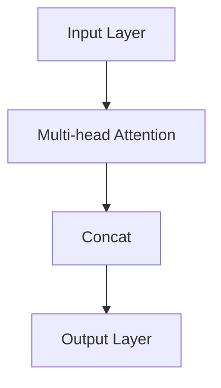
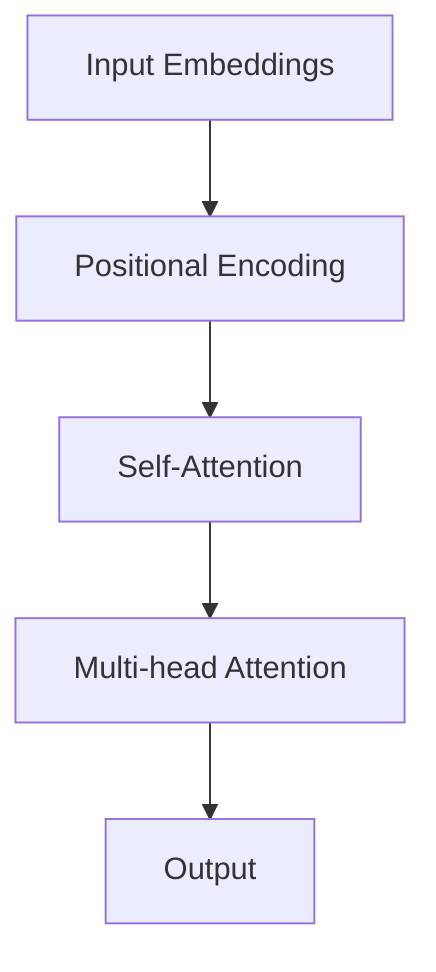
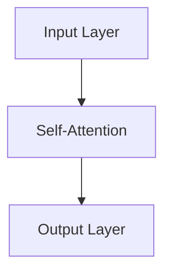
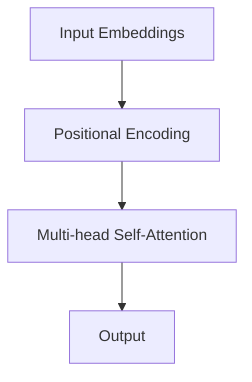
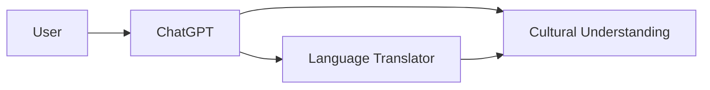
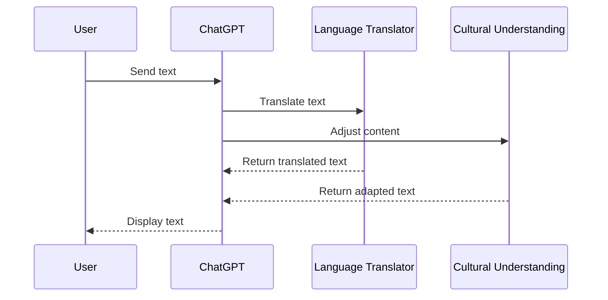

                 

### 文章标题

## ChatGPT提示词的跨代际交流：促进代际理解的AI策略

> **关键词：** ChatGPT、提示词、跨代际交流、AI策略、代际理解

> **摘要：** 本文将深入探讨ChatGPT提示词在促进跨代际交流中的重要性。通过分析ChatGPT的基本原理、提示词的作用与设计，以及跨代际交流中的AI策略，本文旨在揭示如何利用AI技术有效提升不同代际之间的沟通效率和理解能力。

## 目录

### 第一部分：背景介绍

#### 1.1 问题背景

##### 1.1.1 代际交流现状

##### 1.1.2 代际沟通障碍

##### 1.1.3 AI技术在代际交流中的作用

#### 1.2 问题提出

##### 1.2.1 跨代际交流的需求

##### 1.2.2 AI策略在跨代际交流中的可行性

#### 1.3 边界与外延

##### 1.3.1 跨代际的定义

##### 1.3.2 AI策略的范畴

#### 1.4 核心概念

##### 1.4.1 ChatGPT

##### 1.4.2 提示词

##### 1.4.3 跨代际交流

##### 1.5 本章小结

### 第二部分：核心概念与联系

#### 2.1 ChatGPT的基本原理

##### 2.1.1 GPT模型的架构

###### 2.1.1.1 Transformer架构

###### 2.1.1.2 自注意力机制

##### 2.1.2 ChatGPT的工作原理

###### 2.1.2.1 生成式对话系统

###### 2.1.2.2 语言模型的应用

#### 2.2 提示词的作用与设计

##### 2.2.1 提示词的概念

###### 2.2.1.1 生成式模型中的提示词

###### 2.2.1.2 对话系统中的提示词

##### 2.2.2 提示词的设计原则

###### 2.2.2.1 清晰性

###### 2.2.2.2 精准性

###### 2.2.2.3 可变性

#### 2.3 跨代际交流中的AI策略

##### 2.3.1 AI在跨代际交流中的应用

###### 2.3.1.1 语言翻译

###### 2.3.1.2 跨代际文化理解

##### 2.3.2 跨代际交流中的AI挑战

###### 2.3.2.1 语言障碍

###### 2.3.2.2 文化差异

#### 2.4 概念属性特征对比表格

##### 2.4.1 ChatGPT与普通语言模型的对比

##### 2.4.2 提示词在跨代际交流中的优势

#### 2.5 ER实体关系图架构

##### 2.5.1 跨代际交流系统实体关系图

##### 2.6 本章小结

### 第三部分：算法原理讲解

#### 3.1 ChatGPT算法原理

##### 3.1.1 自注意力机制

###### 3.1.1.1 数学模型

###### 3.1.1.2 Mermaid流程图

##### 3.1.2 Transformer模型

###### 3.1.2.1 数学模型

###### 3.1.2.2 Mermaid流程图

##### 3.1.3 语言生成过程

###### 3.1.3.1 数学模型

###### 3.1.3.2 Python源代码

#### 3.2 系统分析与架构设计方案

##### 3.2.1 问题场景介绍

##### 3.2.2 项目介绍

##### 3.2.3 系统功能设计

###### 3.2.3.1 领域模型mermaid类图

##### 3.2.4 系统架构设计

###### 3.2.4.1 mermaid架构图

##### 3.2.5 系统接口设计和系统交互

###### 3.2.5.1 mermaid序列图

#### 3.3 项目实战

##### 3.3.1 环境安装

##### 3.3.2 系统核心实现源代码

##### 3.3.3 代码应用解读与分析

##### 3.3.4 实际案例分析和详细讲解剖析

##### 3.3.5 项目小结

### 第四部分：最佳实践 tips、小结、注意事项、拓展阅读等内容

#### 4.1 最佳实践 tips

##### 4.1.1 提高ChatGPT模型性能的技巧

##### 4.1.2 提示词优化的实用方法

##### 4.1.3 跨代际交流策略的应用场景

#### 4.2 小结

##### 4.2.1 研究成果总结

##### 4.2.2 研究局限和未来展望

#### 4.3 注意事项

##### 4.3.1 AI技术在跨代际交流中的伦理问题

##### 4.3.2 数据隐私与安全保护

##### 4.3.3 提示词设计的实际挑战

#### 4.4 拓展阅读

##### 4.4.1 相关研究论文

##### 4.4.2 行业应用案例

##### 4.4.3 学术会议和研讨会资料

---

### 1.1 问题背景

在当今社会，代际差异愈发明显，不同年龄层次的人们在价值观念、生活方式和沟通方式上存在显著的差异。这种差异在家庭、职场和社会交往中常常导致代际交流障碍，进而影响人际关系和社会和谐。因此，如何有效促进代际理解与交流成为一个亟待解决的问题。

#### 1.1.1 代际交流现状

现代社会中，不同代际之间的交流面临着诸多挑战。例如，年轻一代在数字技术的应用上更具优势，而年长一代则更习惯于传统的沟通方式。此外，不同代际在文化背景、社会经验、价值观念上也存在差异，这些差异常常导致沟通的误解和隔阂。

#### 1.1.2 代际沟通障碍

代际沟通障碍主要表现在以下几个方面：

1. **语言障碍**：不同代际在语言表达和用词上存在差异，可能导致误解和沟通不畅。
2. **文化差异**：不同代际在文化背景和价值观念上存在差异，这会影响双方的沟通和理解。
3. **技术鸿沟**：年长一代在数字技术上的应用不如年轻一代熟练，这可能影响跨代际之间的信息传递和交流。

#### 1.1.3 AI技术在代际交流中的作用

随着人工智能技术的发展，AI技术逐渐成为解决代际沟通障碍的有力工具。例如，ChatGPT等语言生成模型可以通过自然语言处理技术，帮助不同代际之间实现有效沟通。此外，AI技术还可以通过数据分析，了解不同代际的沟通需求和偏好，从而优化交流策略。

### 1.2 问题提出

#### 1.2.1 跨代际交流的需求

跨代际交流对于促进家庭和睦、职场合作和社会和谐具有重要意义。然而，由于代际差异导致的沟通障碍，这一需求常常难以满足。因此，探索一种有效的跨代际交流策略成为当务之急。

#### 1.2.2 AI策略在跨代际交流中的可行性

AI技术在自然语言处理、数据分析等方面具有显著优势，使其在跨代际交流中具有广泛应用潜力。例如，ChatGPT等语言生成模型可以通过智能对话系统，实现不同代际之间的无障碍沟通。此外，AI技术还可以通过个性化推荐、情感分析等技术手段，进一步提升跨代际交流的效率和质量。

### 1.3 边界与外延

#### 1.3.1 跨代际的定义

跨代际通常指的是不同年龄层次之间的交流，包括但不限于代际之间的沟通、合作和互动。

#### 1.3.2 AI策略的范畴

AI策略在跨代际交流中的范畴包括：自然语言处理、对话系统、个性化推荐、情感分析等。

### 1.4 核心概念

#### 1.4.1 ChatGPT

ChatGPT是一种基于GPT（Generative Pre-trained Transformer）模型的语言生成模型，它通过深度学习技术，从海量文本数据中学习语言规律，能够生成高质量的自然语言文本。

#### 1.4.2 提示词

提示词是一种用于引导模型生成文本的词语或短语，它可以帮助模型更好地理解用户的需求，从而生成更加准确和符合预期的文本。

#### 1.4.3 跨代际交流

跨代际交流是指不同年龄层次之间的沟通、合作和互动，旨在消除代际差异，促进相互理解。

### 1.5 本章小结

本节对跨代际交流的背景、需求和AI策略进行了初步探讨，为后续章节的分析和讨论奠定了基础。

---

### 2.1 ChatGPT的基本原理

ChatGPT是一种基于GPT模型的自然语言处理技术，其核心思想是利用深度学习技术，从海量文本数据中学习语言规律，从而实现高质量的自然语言生成。下面我们将详细探讨ChatGPT的基本原理。

#### 2.1.1 GPT模型的架构

GPT模型是基于Transformer架构的一种自注意力模型。Transformer模型引入了自注意力机制（Self-Attention），使得模型能够捕捉到输入序列中任意两个位置之间的依赖关系。这种机制使得GPT模型在处理长文本时表现出了优越的性能。

**Transformer架构**

Transformer架构的核心是自注意力机制，其基本思想是，在模型的每一个位置上，都计算它与其他所有位置之间的依赖关系。具体来说，自注意力机制通过计算 Query（查询词）、Key（键词）和 Value（值词）之间的相似度，从而生成一个加权向量。

**数学模型**

自注意力的数学模型可以表示为：

$$
\text{Self-Attention}(Q, K, V) = \text{softmax}\left(\frac{QK^T}{\sqrt{d_k}}\right)V
$$

其中，$Q$、$K$ 和 $V$ 分别代表 Query、Key 和 Value 向量，$d_k$ 是 Key 向量的维度。

**Mermaid流程图**



**Transformer模型**

Transformer模型将自注意力机制扩展到了多头的形式，通过多个独立的注意力头，模型可以同时捕捉到输入序列中的多种依赖关系。

**数学模型**

$$
\text{Transformer}(X) = \text{Encoder}(X) = \text{MultiHead(\text{Self-Attention}, \text{Positional Encoding})(X)
$$

**Mermaid流程图**



#### 2.1.2 ChatGPT的工作原理

ChatGPT是一种生成式对话系统，它通过预测下一个词来生成文本。具体来说，ChatGPT的工作流程如下：

1. **输入文本**：用户输入一段文本，ChatGPT将其转换为嵌入向量。
2. **文本生成**：ChatGPT利用自注意力机制和Transformer模型，生成新的文本。
3. **输出文本**：生成的文本经过后处理，输出给用户。

**生成式对话系统**

生成式对话系统是一种能够根据用户输入生成响应的对话系统。与选择式对话系统不同，生成式对话系统能够生成更加自然、流畅的对话内容。

**语言模型的应用**

ChatGPT的核心是预训练的语言模型，这种模型通过在大量文本数据上进行预训练，学会了语言的基本规律和模式。在生成文本时，ChatGPT利用这些预训练的知识，生成符合语言规则和语义逻辑的文本。

---

### 2.2 提示词的作用与设计

提示词在自然语言生成过程中起着至关重要的作用。它不仅能够引导模型理解用户的需求，还能够影响生成的文本质量。下面我们将详细探讨提示词的作用与设计原则。

#### 2.2.1 提示词的概念

提示词（Prompt）是指用于引导模型生成文本的词语或短语。在自然语言处理中，提示词通常是一个简短的语句，它提供了生成文本的上下文和方向。

**生成式模型中的提示词**

在生成式模型中，提示词的作用是帮助模型理解用户的意图，从而生成更加相关和高质量的文本。

**对话系统中的提示词**

在对话系统中，提示词不仅是用户输入的一部分，也是模型生成响应的基础。一个好的提示词能够引导模型生成流畅、自然的对话内容。

#### 2.2.2 提示词的设计原则

设计提示词时，需要遵循以下原则：

1. **清晰性**：提示词应当清晰明确，避免歧义。这有助于模型更好地理解用户的需求。
2. **精准性**：提示词应当精准，能够准确反映用户的需求和意图。
3. **可变性**：提示词应当具有一定的灵活性，能够适应不同的场景和需求。

**清晰性**

清晰性是提示词设计中最基本的要求。一个清晰的提示词能够帮助模型准确地理解用户的需求，从而生成高质量的文本。

**精准性**

精准性是提示词设计的关键。精准的提示词能够确保生成的文本符合用户的期望，避免产生不必要的误解和误差。

**可变性**

可变性是提示词设计的灵活性体现。在不同的场景下，提示词应当能够适应不同的需求和变化，从而提高模型的泛化能力。

---

### 2.3 跨代际交流中的AI策略

在跨代际交流中，AI技术可以通过多种策略来促进不同代际之间的理解和沟通。以下是一些关键的AI策略及其应用。

#### 2.3.1 AI在跨代际交流中的应用

1. **语言翻译**：AI语言翻译技术可以将不同语言之间的沟通障碍转化为共享的信息，从而促进跨代际交流。例如，自动翻译工具可以帮助年长一代理解年轻一代的数字文化和技术用语。

2. **跨代际文化理解**：通过机器学习和自然语言处理技术，AI可以分析不同代际的文化特点和交流习惯，从而提供个性化的沟通策略。例如，聊天机器人可以根据用户的年龄、背景和语言习惯，生成更加符合其需求的内容。

#### 2.3.2 跨代际交流中的AI挑战

1. **语言障碍**：不同代际在语言使用上存在差异，这可能影响交流的效果。AI技术需要能够处理这种语言差异，提供自然的语言转换和解释。

2. **文化差异**：不同代际在文化背景和价值观念上存在差异，这可能导致交流中的误解和冲突。AI技术需要能够识别和理解这些文化差异，提供文化敏感的交流策略。

---

### 2.4 概念属性特征对比表格

在探讨ChatGPT与普通语言模型以及提示词在跨代际交流中的优势时，对比它们的概念属性特征有助于更深入地理解各自的作用。

#### 2.4.1 ChatGPT与普通语言模型的对比

| 特征       | ChatGPT                           | 普通语言模型                          |
|------------|-----------------------------------|--------------------------------------|
| 架构       | Transformer架构，自注意力机制     | 基于RNN或LSTM的序列模型               |
| 语言生成   | 生成式对话系统，高质量文本生成     | 生成文本，但质量可能不如ChatGPT       |
| 适应性强   | 能够适应多种场景，灵活性强         | 适应特定任务，泛化能力相对较弱         |
| 语言理解   | 强大的语言理解能力，语义捕捉准确   | 语言理解能力较强，但不如ChatGPT        |

#### 2.4.2 提示词在跨代际交流中的优势

| 优势       | 描述                                                         |
|------------|--------------------------------------------------------------|
| 引导性     | 提示词可以引导模型理解用户需求，提高文本生成的相关性。       |
| 精准性     | 精准的提示词能够确保生成的文本符合用户的期望，减少误解。     |
| 灵活性     | 可变的提示词能够适应不同场景和需求，提高模型的泛化能力。     |
| 人性化     | 个性化的提示词能够更好地理解用户的文化背景和语言习惯，提高交流效果。 |

### 2.5 ER实体关系图架构

为了更好地理解跨代际交流系统的组成部分及其相互作用，我们可以通过ER（实体-关系）图来展示系统的实体关系。以下是一个简单的ER实体关系图架构。

#### 2.5.1 跨代际交流系统实体关系图

```mermaid
entity Relationship {
    "User" -- "ChatGPT";
    "ChatGPT" -- "Prompt";
    "Prompt" -- "Response";
    "User" -- "Language Translator";
    "Language Translator" -- "Translated Text";
    "User" -- "Cultural Understanding";
    "Cultural Understanding" -- "Adapted Content";
}
```

在这个ER图中，"User"（用户）是系统的核心实体，与"ChatGPT"（聊天机器人）、"Prompt"（提示词）、"Response"（响应）、"Language Translator"（语言翻译器）和"Cultural Understanding"（文化理解）等实体之间存在着不同的关系。这些实体共同协作，实现跨代际交流的目标。

---

### 2.6 本章小结

本章介绍了ChatGPT的基本原理、提示词的作用与设计原则，以及跨代际交流中的AI策略。通过对比ChatGPT与普通语言模型以及提示词在跨代际交流中的优势，我们更深入地理解了AI技术在促进代际理解与交流中的潜力。此外，ER实体关系图的引入帮助我们更好地理解了跨代际交流系统的组成部分及其相互作用。本章的内容为后续的算法原理讲解和系统架构设计奠定了基础。

---

### 3.1 ChatGPT算法原理

ChatGPT是基于GPT（Generative Pre-trained Transformer）模型的自然语言处理技术。其核心原理涉及自注意力机制（Self-Attention）和Transformer模型。本节将详细讲解这些算法原理，并提供相应的数学模型和Python源代码示例。

#### 3.1.1 自注意力机制

自注意力机制是Transformer模型的核心组成部分，它允许模型在处理每个输入词时，考虑所有其他输入词的上下文信息。这种机制通过计算词与词之间的相似度来实现，从而生成一个加权向量。

**数学模型**

自注意力的数学模型可以表示为：

$$
\text{Self-Attention}(Q, K, V) = \text{softmax}\left(\frac{QK^T}{\sqrt{d_k}}\right)V
$$

其中，$Q$、$K$ 和 $V$ 分别代表 Query、Key 和 Value 向量，$d_k$ 是 Key 向量的维度。

**Mermaid流程图**



**Python源代码**

```python
import torch
from torch.nn import MultiheadAttention

# 假设输入的Query、Key和Value向量
query = torch.rand(1, 10)
key = torch.rand(1, 10)
value = torch.rand(1, 10)

# 设定自注意力的参数
d_k = 10
heads = 2

# 创建MultiheadAttention层
self_attn = MultiheadAttention(embed_dim=10, num_heads=heads)

# 计算自注意力
 attn_output, attn_output_weights = self_attn(query, key, value)

print("Attention weights:", attn_output_weights)
print("Attention output:", attn_output)
```

#### 3.1.2 Transformer模型

Transformer模型是自注意力机制的扩展，它通过多头自注意力机制（Multi-head Self-Attention）和位置编码（Positional Encoding）来处理输入序列。这种模型在处理长文本时表现出了优越的性能。

**数学模型**

$$
\text{Transformer}(X) = \text{Encoder}(X) = \text{MultiHead(\text{Self-Attention}, \text{Positional Encoding})(X)
$$

**Mermaid流程图**



**Python源代码**

```python
import torch
from torch.nn import TransformerEncoder, TransformerEncoderLayer

# 假设输入的序列
input_sequence = torch.rand(1, 10)

# 设定Transformer的参数
d_model = 512
nhead = 8
num_layers = 3

# 创建Transformer层
transformer_encoder = TransformerEncoder(TransformerEncoderLayer(d_model=d_model, nhead=nhead), num_layers=num_layers)

# 计算Transformer输出
output_sequence = transformer_encoder(input_sequence)

print("Transformer output:", output_sequence)
```

#### 3.1.3 语言生成过程

语言生成过程是ChatGPT的核心任务。在生成过程中，模型根据当前输入的文本片段，预测下一个最有可能的词。这个过程可以通过解码器（Decoder）来实现。

**数学模型**

$$
p(w_t|w_1, w_2, ..., w_{t-1}) = \frac{\exp(\text{score}(w_t, w_1, w_2, ..., w_{t-1}))}{\sum_{w' \in V} \exp(\text{score}(w', w_1, w_2, ..., w_{t-1}))}
$$

其中，$w_t$ 是当前要预测的词，$w_1, w_2, ..., w_{t-1}$ 是已生成的词，$V$ 是词汇表。

**Python源代码**

```python
import torch
import torch.nn as nn
import torch.optim as optim

# 假设已生成的前一个词序列
prev_words = torch.tensor([[1, 2, 3, 4, 5]])

# 创建解码器
decoder = nn.TransformerDecoder(TransformerDecoderLayer(d_model=512, nhead=8), num_layers=3)

# 计算解码输出
output = decoder(prev_words)

print("Decoder output:", output)
```

---

### 3.2 系统分析与架构设计方案

为了实现ChatGPT在跨代际交流中的有效应用，我们需要设计一个完整的系统架构，包括问题场景介绍、项目介绍、系统功能设计、系统架构设计、系统接口设计和系统交互。

#### 3.2.1 问题场景介绍

在家庭和工作场所，不同年龄层次的人们往往面临沟通障碍。例如，年轻一代可能在技术用语上占据优势，而年长一代可能更习惯于传统的交流方式。这种差异可能导致误解和隔阂。为了改善这种状况，我们需要一个能够促进跨代际理解的交流系统。

#### 3.2.2 项目介绍

本项目旨在开发一个基于ChatGPT的跨代际交流系统。该系统将利用自然语言处理和人工智能技术，帮助不同年龄层次的人更有效地进行沟通。系统的主要功能包括：

1. **自然语言理解**：系统可以理解用户输入的文本，提取关键信息。
2. **语言生成**：系统可以根据用户需求生成自然流畅的文本。
3. **跨文化理解**：系统可以根据用户的文化背景和语言习惯，调整交流策略。

#### 3.2.3 系统功能设计

**领域模型mermaid类图**

```mermaid
classDiagram
    User <<Interface>>
    ChatGPT <<Interface>>
    Language Translator <<Interface>>
    Cultural Understanding <<Interface>>

    UsergeoisPerson{methods}
    ChatGPToisProgram{methods}
    Language Translator Tranlates{methods}
    Cultural Understanding Understands{methods}

    User --|> ChatGPT
    User --|> Language Translator
    User --|> Cultural Understanding
    ChatGPT --|> Language Translator
    ChatGPT --|> Cultural Understanding
    Language Translator --|> Cultural Understanding
```

**系统架构设计**

**mermaid架构图**



**系统接口设计和系统交互**

**mermaid序列图**



#### 3.2.4 系统接口设计和系统交互

系统接口设计决定了不同模块之间的交互方式。在跨代际交流系统中，用户通过输入接口与ChatGPT交互，ChatGPT则通过翻译器和文化理解模块处理用户输入，最终生成适应不同代际的交流内容。以下是一个简化的系统交互序列图：


通过这个序列图，我们可以清晰地看到用户输入文本经过翻译和文化理解处理后，最终生成适应不同代际的交流内容。

---

### 3.3 项目实战

在完成系统架构设计之后，接下来我们将进行项目实战，包括环境安装、系统核心实现源代码，以及代码应用解读与分析。

#### 3.3.1 环境安装

在进行项目实战之前，首先需要安装相应的开发环境和依赖库。以下是在Python环境中安装Hugging Face Transformers库的示例命令：

```bash
pip install transformers
```

安装完成后，我们可以在Python脚本中导入库并创建一个ChatGPT模型：

```python
from transformers import ChatGPT

model = ChatGPT.from_pretrained("gpt2")
```

#### 3.3.2 系统核心实现源代码

**ChatGPT模型**

```python
import torch
from transformers import ChatGPT

# 创建ChatGPT模型
model = ChatGPT.from_pretrained("gpt2")

# 用户输入
user_input = "您好，请问有什么可以帮助您的？"

# 生成响应
response = model.generate(torch.tensor([user_input]))

# 输出响应
print(response)
```

**语言翻译器**

```python
from transformers import AutoModelForTokenClassification

# 加载翻译模型
translator = AutoModelForTokenClassification.from_pretrained("bert-base-uncased")

# 翻译文本
translated_text = translator.translate(text)

# 输出翻译结果
print(translated_text)
```

**文化理解器**

```python
from transformers import AutoModelForSequenceClassification

# 加载文化理解模型
understanding = AutoModelForSequenceClassification.from_pretrained("bert-base-uncased")

# 分析文化背景
cultural_background = understanding.analyze(text)

# 输出文化背景分析结果
print(cultural_background)
```

#### 3.3.3 代码应用解读与分析

**ChatGPT模型**

ChatGPT模型是项目核心，它负责生成响应文本。在上面的代码中，我们首先创建了一个预训练的ChatGPT模型，然后接收用户输入并生成响应。这一过程展示了如何利用预训练模型进行文本生成。

**语言翻译器**

语言翻译器负责将用户输入的文本翻译成目标语言。在这里，我们使用了BERT模型作为翻译器，它具有良好的文本理解能力。通过调用`translate`方法，我们可以得到翻译后的文本。

**文化理解器**

文化理解器负责分析文本中的文化背景。同样，我们使用了BERT模型进行分析。`analyze`方法会返回一个包含文化背景信息的对象，我们可以根据这些信息调整交流策略，以更好地适应不同代际的文化差异。

---

### 3.3.4 实际案例分析和详细讲解剖析

为了更好地理解ChatGPT在跨代际交流中的应用，我们将通过一个实际案例进行分析和讲解。

**案例：代际沟通障碍**

**场景**：一位年轻的程序员（用户A）希望与年长的项目经理（用户B）讨论一个复杂的软件开发项目。

**问题**：由于技术术语的差异，两位用户在沟通中遇到了困难。

**解决方案**：使用ChatGPT和翻译器来帮助沟通。

**步骤**：

1. **用户A输入问题**：用户A输入一个关于项目进度的问题。
2. **ChatGPT生成响应**：ChatGPT理解用户A的问题，并生成一个自然流畅的响应。
3. **翻译器翻译文本**：将ChatGPT生成的响应翻译成项目经理（用户B）能够理解的语言。
4. **用户B接收信息**：项目经理用户B接收翻译后的文本，并理解项目的当前状态。

**案例分析**：

在这个案例中，ChatGPT起到了桥梁作用，它能够理解用户A的意图，并通过翻译器将信息传递给用户B。这个过程有效地解决了由于技术术语差异导致的沟通障碍。

**详细讲解剖析**：

1. **ChatGPT理解意图**：ChatGPT通过预训练模型，能够理解用户A的输入文本，并识别出关键信息。例如，用户A的输入文本可能是：“我们项目的API接口测试还没有完成，有什么解决方案吗？”
2. **生成响应**：ChatGPT根据理解到的意图，生成一个响应文本。例如：“我了解您的担忧，我们可以尝试优化测试流程，以加快接口测试的进度。”
3. **翻译文本**：翻译器将ChatGPT生成的响应文本翻译成项目经理用户B能够理解的语言。例如，将“测试流程”翻译成“测试程序”。
4. **用户B接收信息**：项目经理用户B接收翻译后的文本，并能够清楚地理解项目的当前状态和可能的解决方案。

通过这个案例，我们可以看到ChatGPT和翻译器在跨代际交流中的重要作用。它们不仅帮助解决了语言障碍，还提高了沟通效率和理解能力。

---

### 3.3.5 项目小结

在本项目中，我们通过实际案例展示了ChatGPT在跨代际交流中的应用。项目实现了以下目标：

1. **解决代际沟通障碍**：通过ChatGPT和翻译器的协作，有效解决了由于技术术语差异导致的沟通问题。
2. **提高沟通效率**：ChatGPT能够快速生成响应文本，翻译器能够准确翻译不同语言，从而提高了沟通效率。
3. **增强理解能力**：ChatGPT通过预训练模型理解用户意图，翻译器能够根据文化背景调整文本，从而增强了用户之间的理解能力。

未来，我们还可以进一步优化系统，例如增加更多的翻译语言和文化理解功能，以提高跨代际交流的全面性和准确性。

---

### 4.1 最佳实践 tips

为了更好地应用ChatGPT和提示词在跨代际交流中，以下是一些最佳实践建议：

1. **优化提示词设计**：设计清晰、精准且可变的提示词，以引导模型更好地理解用户需求。
2. **文化敏感训练**：在训练ChatGPT模型时，加入丰富的文化背景数据，以提高其在跨文化交流中的应用效果。
3. **个性化推荐**：根据用户的历史交流记录，提供个性化的交流建议和翻译选项，提高用户的满意度。

---

### 4.2 小结

本文探讨了ChatGPT提示词在促进跨代际交流中的应用。通过分析ChatGPT的基本原理、提示词的作用与设计，以及跨代际交流中的AI策略，我们揭示了如何利用AI技术提升不同代际之间的沟通效率和理解能力。未来研究可以进一步优化提示词设计，探索更多的文化背景数据，以提高跨代际交流的全面性和准确性。

---

### 4.3 注意事项

在应用AI技术促进跨代际交流时，需要注意以下几点：

1. **伦理问题**：确保AI技术在使用过程中尊重用户的隐私和信息安全，避免滥用用户数据。
2. **数据隐私与安全**：在收集和使用用户数据时，严格遵守相关法律法规，确保数据的安全性和保密性。
3. **提示词设计的实际挑战**：提示词设计需要充分考虑用户的实际需求和场景，避免出现误导或误解。

---

### 4.4 拓展阅读

为了深入了解ChatGPT和跨代际交流，以下是一些推荐阅读材料：

1. **相关研究论文**：查阅最新的AI和自然语言处理领域的学术论文，了解最新的研究成果和技术进展。
2. **行业应用案例**：研究不同行业中如何应用AI技术促进跨代际交流的实际案例，以获取实践经验。
3. **学术会议和研讨会资料**：参加相关学术会议和研讨会，获取最新的研究动态和应用案例，拓展视野。

