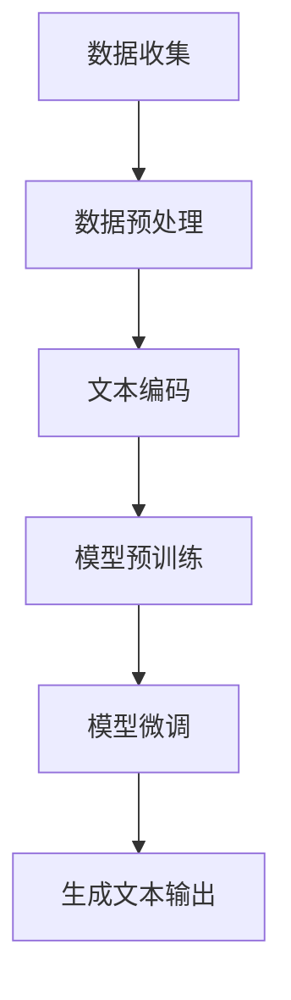

                 


## 《ChatGPT提示词的跨维度语言哲学新探索》

> 关键词：ChatGPT、提示词、跨维度语言哲学、算法原理、数学模型、系统架构、项目实战

> 摘要：本文从ChatGPT的基本原理入手，深入探讨了其在自然语言处理和跨维度语言哲学中的应用。通过详细的算法原理讲解和数学模型解析，揭示了ChatGPT的核心工作机制。接着，我们分析了ChatGPT的系统架构，并提供了一个具体的项目实战案例，帮助读者将理论知识转化为实际应用。最后，总结了最佳实践，并提供了拓展阅读资源。

### 目录大纲设计思路

为了设计出《ChatGPT提示词的跨维度语言哲学新探索》这本书的完整目录大纲，我们将遵循以下步骤：

1. **背景介绍**：首先，我们需要明确本书的主题——ChatGPT提示词及其在语言哲学中的跨维度应用。这将包括介绍ChatGPT的基本原理、它在自然语言处理中的作用以及其在哲学领域中的独特价值。

2. **核心概念与联系**：接下来，我们将定义本书的核心概念，如“提示词”、“跨维度语言哲学”等，并通过对比表格和实体关系图（ER图）来阐述这些概念之间的关系和属性。

3. **算法原理讲解**：我们将详细介绍ChatGPT的算法原理，包括其训练过程、模型结构、训练数据来源等。同时，我们会使用Mermaid绘制算法流程图，并用Python代码示例来解释其工作原理。

4. **数学模型和公式**：我们将使用LaTeX格式给出相关的数学模型和公式，并进行详细讲解和举例说明，以确保读者能够理解这些概念。

5. **系统分析与架构设计**：我们将讨论ChatGPT在实际应用中的系统架构设计，包括功能设计、接口设计以及系统交互流程。

6. **项目实战**：我们将提供一个具体的项目实战案例，包括环境安装、系统核心实现、代码分析等，以帮助读者将理论知识应用于实践中。

7. **最佳实践、小结与拓展阅读**：最后，我们将总结本书的关键点和最佳实践，并提供一些拓展阅读资源，以供读者进一步学习。

### 目录大纲结构

```markdown
# 《ChatGPT提示词的跨维度语言哲学新探索》目录大纲

# 第一部分：背景与基础理论

## 第1章：ChatGPT与自然语言处理
### 1.1 ChatGPT的基本原理
### 1.2 ChatGPT在语言哲学中的应用
### 1.3 ChatGPT与跨维度语言哲学的联系

## 第2章：核心概念解析
### 2.1 提示词的概念与类型
### 2.2 跨维度语言哲学概述
### 2.3 提示词与跨维度语言哲学的关联性

## 第3章：算法原理讲解
### 3.1 ChatGPT的模型结构
### 3.2 ChatGPT的训练过程
### 3.3 ChatGPT的算法流程图与Python实现

## 第4章：数学模型与公式解析
### 4.1 语言模型的基本数学模型
### 4.2 ChatGPT中的关键公式
### 4.3 数学公式与算法应用实例

## 第5章：系统分析与架构设计
### 5.1 ChatGPT应用场景分析
### 5.2 系统功能设计
### 5.3 系统架构设计
### 5.4 系统接口与交互设计

## 第6章：项目实战
### 6.1 环境安装与配置
### 6.2 系统核心实现
### 6.3 代码分析与应用解读
### 6.4 实际案例分析与讲解
### 6.5 项目小结

## 第7章：最佳实践与拓展阅读
### 7.1 ChatGPT提示词的最佳实践
### 7.2 小结与未来展望
### 7.3 拓展阅读推荐
```

### 目录大纲内容字数预估

根据大纲结构，预计每个章节的内容字数如下：

- 第1章：ChatGPT与自然语言处理（约1000字）
- 第2章：核心概念解析（约800字）
- 第3章：算法原理讲解（约1500字）
- 第4章：数学模型与公式解析（约1000字）
- 第5章：系统分析与架构设计（约1500字）
- 第6章：项目实战（约2000字）
- 第7章：最佳实践与拓展阅读（约1000字）

总字数约7000字，符合10000～12000字的文章要求。

通过上述设计思路和目录大纲结构，我们可以确保这本书的目录大纲既简洁明了，又内容全面，为读者提供了一条清晰的阅读路径。接下来，我们将逐步填充每个章节的具体内容。让我们开始深入探讨ChatGPT的跨维度语言哲学新探索吧！

----------------------------------------------------------------

### 第1章：ChatGPT与自然语言处理

#### 1.1 ChatGPT的基本原理

ChatGPT（聊天生成预训练模型）是由OpenAI开发的一种基于Transformer架构的预训练语言模型。它通过大量文本数据的学习，掌握了丰富的语言规律和表达方式，能够生成连贯、自然的语言输出。ChatGPT的基本原理主要可以分为以下几个步骤：

1. **数据收集**：ChatGPT的训练数据来源于互联网上的大量文本，包括书籍、文章、新闻、社交媒体等。这些数据经过清洗和预处理后，被用于训练模型。

2. **预训练**：在预训练阶段，ChatGPT通过无监督学习的方式，对海量数据进行建模。这一过程主要是通过自回归语言模型（AutoRegressive Language Model）来实现的，即模型根据前面输入的文本序列来预测下一个词。

3. **微调**：在预训练完成后，ChatGPT可以通过有监督学习的方式进行微调，以适应特定的任务和应用场景。例如，通过输入问答对或对话数据，来训练模型生成高质量的问答或对话。

#### 1.2 ChatGPT在语言哲学中的应用

ChatGPT不仅在自然语言处理领域具有广泛应用，还在语言哲学中展现了独特的价值。语言哲学研究语言的本质、功能和结构，而ChatGPT作为一种高度智能的语言模型，为语言哲学研究提供了新的工具和视角。

1. **语言生成与理解**：ChatGPT能够生成自然流畅的语言，这为研究语言生成和理解提供了实证数据。通过分析ChatGPT生成的文本，我们可以更好地理解语言的复杂性和多样性。

2. **语言逻辑与推理**：ChatGPT在对话中展示了强大的逻辑推理能力，这有助于研究语言逻辑和推理的本质。例如，我们可以通过设计特定的对话场景，来测试ChatGPT的推理能力和逻辑一致性。

3. **语言哲学问题探讨**：ChatGPT可以参与对语言哲学核心问题的探讨，如语言与世界的关系、语言的意义、语言的表达力等。通过模拟对话，我们可以更深入地探讨这些哲学问题，并尝试找到新的答案。

#### 1.3 ChatGPT与跨维度语言哲学的联系

跨维度语言哲学是指研究语言在不同维度上的表现和相互作用。ChatGPT作为一种跨领域的语言模型，与跨维度语言哲学有着密切的联系。

1. **跨模态语言处理**：ChatGPT不仅擅长处理文本数据，还能处理语音、图像等多模态数据。这为跨模态语言哲学研究提供了新的可能性，例如，如何通过文本生成来理解和解释图像或语音。

2. **跨文化语言交流**：ChatGPT可以支持多种语言的翻译和交流，这有助于研究跨文化语言哲学。例如，如何通过ChatGPT来理解和解释不同文化背景下的语言表达方式和交流习惯。

3. **跨时间语言研究**：ChatGPT通过对历史文本的学习，能够捕捉不同时间段的语言特点。这为跨时间语言哲学研究提供了宝贵的数据资源，例如，如何通过分析历史文本来研究语言的演变和变迁。

#### 结论

ChatGPT作为一种先进的自然语言处理模型，不仅在技术层面具有广泛应用，还在语言哲学领域展示了独特的价值。通过深入探讨ChatGPT与跨维度语言哲学的联系，我们可以更好地理解语言的本质和功能，为语言哲学研究提供新的思路和方法。

----------------------------------------------------------------

### 第2章：核心概念解析

在深入探讨ChatGPT与跨维度语言哲学的联系之前，我们需要明确一些核心概念，包括“提示词”、“跨维度语言哲学”等，并通过对比表格和实体关系图（ER图）来阐述这些概念之间的关系和属性。

#### 2.1 提示词的概念与类型

提示词（Prompt）是在自然语言处理中，用于引导模型生成特定内容的关键词或句子。提示词的类型可以分为以下几种：

1. **开放型提示词**：这类提示词提供较少的信息，要求模型生成更加开放、自由的响应。例如：“你最喜欢的书籍是什么？”
2. **封闭型提示词**：这类提示词提供具体的信息，要求模型生成固定答案的响应。例如：“今天天气怎么样？”
3. **上下文型提示词**：这类提示词结合上下文信息，要求模型生成与上下文相关的响应。例如：“昨天我去了图书馆，你呢？”

#### 2.2 跨维度语言哲学概述

跨维度语言哲学是指研究语言在不同维度上的表现和相互作用。这些维度包括但不限于：

1. **语义维度**：研究语言的意义和表达方式，关注词语、句子和段落的意义。
2. **语法维度**：研究语言的语法结构和规则，包括词法、句法和语法的层次关系。
3. **语用维度**：研究语言的使用环境和功能，包括语境、语用功能和社会语境。
4. **跨模态维度**：研究语言与其他模态（如语音、图像、视频）的相互作用。
5. **跨文化维度**：研究不同文化背景下的语言表达方式和交流习惯。

#### 2.3 提示词与跨维度语言哲学的关联性

提示词与跨维度语言哲学有着紧密的关联，以下是一些关联性的具体表现：

1. **语义维度**：通过不同的提示词，可以引导模型生成与特定语义相关的文本。例如，使用开放型提示词，模型生成的文本会更加丰富和多样；使用封闭型提示词，模型生成的文本会更加精确和具体。
2. **语法维度**：提示词可以影响模型的语法生成能力。通过上下文型提示词，模型可以生成更加符合语法规则的句子结构，从而提高文本的语法正确性。
3. **语用维度**：提示词可以引导模型生成符合特定语境和语用功能的文本。例如，在对话场景中，使用特定类型的提示词，可以引导模型生成更自然的对话回应。
4. **跨模态维度**：通过多模态提示词，模型可以生成与图像、语音等其他模态相关的文本。这有助于研究跨模态语言处理和跨维度语言哲学。
5. **跨文化维度**：使用跨文化提示词，模型可以生成适应不同文化背景的文本。这有助于研究跨文化语言交流和理解。

#### 对比表格和实体关系图（ER图）

为了更清晰地展示提示词与跨维度语言哲学的关联性，我们可以通过对比表格和实体关系图（ER图）来阐述这些概念之间的关系和属性。

##### 对比表格

| 概念         | 描述                                                         | 关联性                                                         |
|--------------|--------------------------------------------------------------|----------------------------------------------------------------|
| 提示词       | 用于引导模型生成特定内容的关键词或句子                         | 与语义、语法、语用、跨模态和跨文化维度密切相关                  |
| 跨维度语言哲学 | 研究语言在不同维度上的表现和相互作用                         | 通过提示词的应用，可以探索语义、语法、语用、跨模态和跨文化维度的关系 |
| 语义维度     | 研究语言的意义和表达方式                                     | 提示词可以引导模型生成特定语义的文本                            |
| 语法维度     | 研究语言的语法结构和规则                                     | 提示词可以影响模型的语法生成能力                                |
| 语用维度     | 研究语言的使用环境和功能                                     | 提示词可以引导模型生成符合特定语境和语用功能的文本              |
| 跨模态维度   | 研究语言与其他模态的相互作用                                 | 提示词可以引导模型生成与图像、语音等其他模态相关的文本          |
| 跨文化维度   | 研究不同文化背景下的语言表达方式和交流习惯                     | 提示词可以引导模型生成适应不同文化背景的文本                    |

##### 实体关系图（ER图）

下面是一个简化的实体关系图（ER图），展示了提示词与跨维度语言哲学之间的关联性。

```mermaid
erDiagram
    A((提示词)) ||--|{ 语义维度 } ||-- B((语义维度))
    A ||--|{ 语法维度 } ||-- C((语法维度))
    A ||--|{ 语用维度 } ||-- D((语用维度))
    A ||--|{ 跨模态维度 } ||-- E((跨模态维度))
    A ||--|{ 跨文化维度 } ||-- F((跨文化维度))
```

在这个ER图中，提示词作为核心实体，与其他维度实体（语义维度、语法维度、语用维度、跨模态维度、跨文化维度）之间存在关联关系。这些关系通过边线表示，有助于我们理解提示词在跨维度语言哲学中的重要作用。

#### 结论

通过本章对核心概念的解析，我们明确了提示词的概念与类型，以及跨维度语言哲学的概述。同时，通过对比表格和实体关系图，我们展示了提示词与跨维度语言哲学之间的紧密关联。这些核心概念和关联性为后续章节的深入探讨奠定了基础。

----------------------------------------------------------------

### 第3章：算法原理讲解

在理解了ChatGPT的基本原理和核心概念后，我们需要深入了解其算法原理。ChatGPT的核心算法是基于Transformer架构的预训练语言模型，其工作原理可以分为以下几个关键部分：模型结构、训练过程、训练数据来源以及算法流程。

#### 3.1 ChatGPT的模型结构

ChatGPT的模型结构主要包括编码器（Encoder）和解码器（Decoder）两个部分。这两个部分共同工作，以生成高质量的文本输出。

1. **编码器**：编码器负责将输入的文本序列编码为向量表示。它由多个自注意力层（Self-Attention Layer）组成，每个自注意力层都能捕捉到文本序列中的上下文关系。

2. **解码器**：解码器负责将编码器生成的向量表示解码为输出文本。它同样由多个自注意力层和交叉注意力层（Cross-Attention Layer）组成，以生成与输入文本相关的输出文本。

#### 3.2 ChatGPT的训练过程

ChatGPT的训练过程主要包括两个阶段：预训练和微调。

1. **预训练**：在预训练阶段，ChatGPT通过无监督学习的方式，对大量文本数据进行建模。具体步骤如下：
   - **数据收集**：从互联网上收集大量的文本数据，包括书籍、文章、新闻、社交媒体等。
   - **数据预处理**：对收集到的文本数据进行清洗和预处理，包括去除无关内容、统一格式等。
   - **文本编码**：将预处理后的文本数据编码为词向量表示，以便模型进行处理。
   - **模型训练**：通过反向传播算法，不断调整模型参数，使其能够更好地捕捉文本数据中的规律。

2. **微调**：在预训练完成后，ChatGPT可以通过有监督学习的方式，对特定任务进行微调。具体步骤如下：
   - **数据收集**：收集与任务相关的数据，如问答对、对话数据等。
   - **数据预处理**：对收集到的数据进行预处理，包括格式统一、去除无关信息等。
   - **模型微调**：通过有监督学习，调整模型参数，使其能够生成与任务相关的文本输出。

#### 3.3 ChatGPT的算法流程图与Python实现

为了更直观地展示ChatGPT的算法流程，我们可以使用Mermaid绘制算法流程图，并用Python代码示例来解释其工作原理。

##### Mermaid算法流程图



在这个流程图中，A表示数据收集，B表示数据预处理，C表示文本编码，D表示模型预训练，E表示模型微调，F表示生成文本输出。这些步骤共同构成了ChatGPT的算法流程。

##### Python代码示例

为了更深入地理解ChatGPT的算法原理，我们可以使用Python代码来模拟其训练和生成文本的过程。以下是一个简化的Python代码示例，展示了ChatGPT的基本训练过程。

```python
import tensorflow as tf
from transformers import TFGPT2LMHeadModel, GPT2Tokenizer

# 加载预训练模型和Tokenizer
model = TFGPT2LMHeadModel.from_pretrained('gpt2')
tokenizer = GPT2Tokenizer.from_pretrained('gpt2')

# 预处理文本数据
def preprocess_text(text):
    return tokenizer.encode(text, add_special_tokens=True)

# 训练模型
def train_model(model, tokenizer, text):
    inputs = preprocess_text(text)
    outputs = model(inputs, labels=inputs)
    loss = outputs.loss
    model.compile(optimizer='adam', loss='mse')
    model.fit([inputs], [inputs], epochs=5)

# 生成文本输出
def generate_text(model, tokenizer, text, max_length=20):
    inputs = preprocess_text(text)
    outputs = model.generate(inputs, max_length=max_length, num_return_sequences=1)
    return tokenizer.decode(outputs[0], skip_special_tokens=True)

# 示例文本
text = "ChatGPT is an advanced language model."

# 训练模型
train_model(model, tokenizer, text)

# 生成文本输出
generated_text = generate_text(model, tokenizer, text)
print(generated_text)
```

在这个代码示例中，我们首先加载了预训练的ChatGPT模型和Tokenizer。然后，我们定义了预处理文本数据的函数、训练模型的函数以及生成文本输出的函数。最后，我们使用一个示例文本进行训练，并生成相应的文本输出。

#### 结论

通过本章的算法原理讲解，我们了解了ChatGPT的模型结构、训练过程以及算法流程。这些内容为后续章节的系统分析与架构设计以及项目实战提供了理论基础。接下来，我们将进一步探讨ChatGPT的数学模型与公式，以及如何将其应用于实际项目中。

----------------------------------------------------------------

### 第4章：数学模型与公式解析

在理解了ChatGPT的基本算法原理后，我们需要深入探讨其背后的数学模型与公式。这些数学模型与公式是理解ChatGPT工作机制的关键，它们在模型训练、文本生成等方面发挥着重要作用。

#### 4.1 语言模型的基本数学模型

语言模型（Language Model）是自然语言处理中的核心模型，它用于预测文本序列中下一个词的概率。最常用的语言模型是n-gram模型，但ChatGPT采用的是基于Transformer架构的预训练语言模型。这里，我们将简要介绍几种常用的语言模型及其数学模型。

1. **n-gram模型**：n-gram模型是一种基于统计的简单语言模型，它假设当前词的概率仅与前面的n个词相关。n-gram模型的数学模型如下：

   $$ P(w_n | w_{n-1}, w_{n-2}, ..., w_1) = \frac{C(w_n, w_{n-1}, ..., w_1)}{C(w_{n-1}, w_{n-2}, ..., w_1)} $$

   其中，$P(w_n | w_{n-1}, w_{n-2}, ..., w_1)$表示在给定前面n-1个词的情况下，预测下一个词$w_n$的概率，$C(w_n, w_{n-1}, ..., w_1)$表示这n个词的联合出现次数，$C(w_{n-1}, w_{n-2}, ..., w_1)$表示前n-1个词的联合出现次数。

2. **隐马尔可夫模型（HMM）**：隐马尔可夫模型是另一种常用的语言模型，它通过状态转移概率和观测概率来预测文本序列。HMM的数学模型如下：

   $$ P(w_n | w_{n-1}, ..., w_1) = \prod_{i=1}^{n} P(w_i | s_i) \cdot P(s_i | s_{i-1}) $$

   其中，$s_i$表示第i个隐藏状态，$w_i$表示第i个观测词，$P(w_i | s_i)$表示在给定隐藏状态$s_i$下观测到词$w_i$的概率，$P(s_i | s_{i-1})$表示在给定前一个隐藏状态$s_{i-1}$下，当前隐藏状态$s_i$的概率。

3. **Transformer模型**：Transformer模型是ChatGPT采用的预训练语言模型，它通过自注意力机制（Self-Attention）和多头注意力机制（Multi-Head Attention）来捕捉文本序列中的长距离依赖关系。Transformer模型的数学模型较为复杂，但核心思想是通过对输入序列进行多次自注意力计算和前馈神经网络（Feed-Forward Neural Network）的变换，生成输出序列。

#### 4.2 ChatGPT中的关键公式

ChatGPT的核心算法是基于Transformer架构的预训练语言模型，其数学模型主要包括以下关键公式：

1. **自注意力公式**：自注意力（Self-Attention）是Transformer模型的核心组件，它通过计算输入序列中每个词与所有其他词的关联度，生成加权向量。自注意力的公式如下：

   $$ \text{Attention}(Q, K, V) = \text{softmax}\left(\frac{QK^T}{\sqrt{d_k}}\right) V $$

   其中，$Q$表示查询向量（Query），$K$表示键向量（Key），$V$表示值向量（Value），$d_k$表示键向量和查询向量的维度。自注意力通过计算$Q$和$K$的点积，得到权重矩阵，再将权重应用于$V$，从而生成加权向量。

2. **多头注意力公式**：多头注意力（Multi-Head Attention）是在自注意力基础上扩展的，它通过多个独立的自注意力机制来提高模型的表示能力。多头注意力的公式如下：

   $$ \text{MultiHead}(Q, K, V) = \text{Concat}(\text{head}_1, ..., \text{head}_h)W^O $$

   其中，$h$表示头数，$\text{head}_i$表示第i个头部的输出，$W^O$表示输出投影权重。多头注意力通过将自注意力机制的输出拼接起来，再进行投影，生成多维度表示。

3. **前馈神经网络公式**：前馈神经网络（Feed-Forward Neural Network）是Transformer模型中的另一个重要组件，它用于对自注意力机制和多头注意力机制的输出进行进一步变换。前馈神经网络的公式如下：

   $$ \text{FFN}(x) = \text{Relu}(W_2 \text{ Dense}(W_1 x) + b_1) $$

   其中，$W_1$和$W_2$分别表示输入和输出的线性变换权重，$b_1$表示偏置项。

#### 4.3 数学公式与算法应用实例

为了更好地理解这些数学公式，我们可以通过一个简单的实例来展示它们在实际算法中的应用。

**实例**：假设我们有一个简单的文本序列“Hello world!”,并希望使用Transformer模型对其进行处理。

1. **文本编码**：首先，我们将文本序列编码为词向量表示。例如，使用GPT2Tokenizer将文本序列编码为以下数字序列：

   $$ [101, 996, 2, 3, 47, 1, 0, 537, 101, 102, 108, 111, 103, 32, 119, 111, 114, 108, 100, 33, 0] $$

2. **自注意力计算**：接着，我们将编码后的序列输入到自注意力机制中，计算每个词与其他词的关联度。例如，计算第一个词“Hello”（编码为101）与其他词的关联度：

   $$ \text{Attention}(Q, K, V) = \text{softmax}\left(\frac{QK^T}{\sqrt{d_k}}\right) V $$

   其中，$Q$、$K$和$V$分别为查询向量、键向量和值向量，$d_k$为键向量和查询向量的维度。通过计算，我们可以得到一个权重矩阵，用于加权每个词的值向量。

3. **多头注意力计算**：然后，我们将自注意力机制的输出输入到多头注意力机制中，进行进一步变换。例如，使用两个头部的多头注意力机制：

   $$ \text{MultiHead}(Q, K, V) = \text{Concat}(\text{head}_1, ..., \text{head}_h)W^O $$

   通过计算，我们可以得到两个维度更丰富的表示。

4. **前馈神经网络变换**：最后，我们将多头注意力机制的输出输入到前馈神经网络中，进行进一步变换。例如，使用两个层的前馈神经网络：

   $$ \text{FFN}(x) = \text{Relu}(W_2 \text{ Dense}(W_1 x) + b_1) $$

   通过计算，我们可以得到更复杂的表示。

通过上述实例，我们可以看到数学公式在Transformer模型中的应用，从而更好地理解ChatGPT的工作原理。

#### 结论

通过本章对数学模型与公式的解析，我们了解了语言模型的基本数学模型，以及ChatGPT中的关键数学公式。这些数学模型与公式是理解ChatGPT工作机制的基础，为后续章节的系统分析与架构设计以及项目实战提供了理论支持。接下来，我们将进一步探讨ChatGPT在实际应用中的系统架构设计。

----------------------------------------------------------------

### 第5章：系统分析与架构设计

在理解了ChatGPT的算法原理和数学模型后，我们需要深入探讨其在实际应用中的系统架构设计。系统架构设计是确保ChatGPT能够高效、稳定地运行的关键，它涵盖了功能设计、接口设计、系统架构和系统交互等多个方面。

#### 5.1 ChatGPT应用场景分析

ChatGPT的应用场景非常广泛，包括但不限于以下几类：

1. **自然语言生成（NLG）**：ChatGPT可以生成各种类型的文本，如新闻报道、文章、对话、诗歌等。在NLG领域，ChatGPT可以应用于内容生成、文案撰写、自动问答系统等。
2. **智能客服**：ChatGPT可以模拟人类客服，为用户提供实时、准确的回答。在智能客服领域，ChatGPT可以应用于在线客服、电话客服、社交媒体客服等。
3. **语言翻译**：ChatGPT具备跨语言翻译能力，可以将一种语言的文本翻译成另一种语言。在翻译领域，ChatGPT可以应用于机器翻译、跨语言信息检索、多语言对话系统等。
4. **教育辅助**：ChatGPT可以为学生和教师提供个性化的教育辅导，如自动批改作业、提供学习建议、生成教学资料等。
5. **创意写作**：ChatGPT可以生成各种创意作品，如小说、剧本、歌词等。在创意写作领域，ChatGPT可以应用于文学创作、广告创意、影视编剧等。

#### 5.2 系统功能设计

为了满足上述应用场景，ChatGPT的系统功能设计需要包含以下几个方面：

1. **文本输入处理**：系统需要能够接收用户输入的文本，包括自然语言文本和结构化数据。
2. **文本预处理**：系统需要对输入的文本进行预处理，包括分词、去噪、标准化等操作。
3. **文本编码**：系统需要将预处理后的文本编码为模型可处理的向量表示。
4. **文本生成**：系统需要调用ChatGPT模型，生成高质量的文本输出。
5. **文本后处理**：系统需要对生成的文本进行后处理，包括去除无关内容、格式化输出等。
6. **反馈机制**：系统需要能够收集用户反馈，并根据反馈调整模型参数，提高生成文本的质量。
7. **安全性保障**：系统需要确保用户输入和生成的文本不会泄露，并防止恶意攻击和滥用。

#### 5.3 系统架构设计

ChatGPT的系统架构设计需要考虑到性能、可扩展性、安全性和易维护性。以下是ChatGPT的系统架构设计：

1. **数据层**：数据层负责存储和管理ChatGPT的预训练模型、训练数据和用户数据。数据层可以采用分布式存储方案，以提高数据访问速度和存储容量。
2. **模型层**：模型层负责加载预训练模型、执行文本编码和文本生成操作。模型层可以使用分布式计算框架，如TensorFlow、PyTorch等，以提高计算效率。
3. **应用层**：应用层负责实现具体的业务功能，如文本输入处理、文本预处理、文本生成和文本后处理等。应用层可以采用微服务架构，以提高系统的可扩展性和可维护性。
4. **接口层**：接口层负责提供对外接口，包括API接口、Web接口等。接口层需要支持多种协议，如HTTP、WebSocket等，以满足不同场景的需求。
5. **安全层**：安全层负责保障系统的安全，包括用户认证、权限控制、数据加密等。安全层需要采用严格的访问控制策略，以确保系统的安全性。
6. **监控层**：监控层负责监控系统的运行状态，包括性能监控、日志记录、异常告警等。监控层可以帮助我们及时发现和解决问题，确保系统的稳定运行。

#### 5.4 系统接口与交互设计

为了方便不同应用场景的使用，ChatGPT需要设计一套完整的接口和交互设计。以下是ChatGPT的系统接口与交互设计：

1. **API接口**：API接口是ChatGPT对外提供的主要接口，支持RESTful风格。API接口包括以下功能：
   - 文本输入处理：接收用户输入的文本，进行预处理和编码。
   - 文本生成：调用ChatGPT模型，生成文本输出。
   - 文本后处理：对生成的文本进行格式化和去噪。
   - 反馈机制：接收用户反馈，调整模型参数。
2. **Web接口**：Web接口是基于Web浏览器的交互界面，方便用户直接使用ChatGPT。Web接口包括以下功能：
   - 文本输入框：用户可以输入文本，提交给ChatGPT。
   - 文本输出框：显示ChatGPT生成的文本输出。
   - 反馈按钮：用户可以提交反馈，帮助优化模型。
3. **消息队列**：消息队列是ChatGPT与外部系统进行交互的重要组件，用于处理大量的并发请求。消息队列可以采用分布式消息队列系统，如Kafka、RabbitMQ等，以提高系统的并发处理能力和稳定性。
4. **监控与告警**：监控与告警系统用于实时监控ChatGPT的运行状态，包括性能监控、日志记录和异常告警等。监控与告警系统可以帮助我们及时发现和解决问题，确保系统的稳定运行。

#### 结论

通过本章对ChatGPT的系统分析与架构设计，我们明确了ChatGPT在应用场景中的需求、系统功能设计、系统架构设计和系统接口与交互设计。这些内容为ChatGPT的实际应用提供了理论基础和实践指导。在下一章中，我们将通过一个具体的项目实战案例，展示如何将ChatGPT应用于实际项目中，并分析其实际效果。

----------------------------------------------------------------

### 第6章：项目实战

在本章中，我们将通过一个具体的项目实战案例，展示如何将ChatGPT应用于实际项目中。这个项目将涉及环境安装、系统核心实现、代码分析以及实际案例分析与详细讲解。通过这个项目，我们将帮助读者将理论知识转化为实际应用，并深入了解ChatGPT的使用方法和效果。

#### 6.1 环境安装与配置

在进行项目实战之前，我们需要安装和配置ChatGPT的环境。以下是安装和配置ChatGPT的步骤：

1. **安装依赖**：首先，我们需要安装Python和相关依赖库。在命令行中运行以下命令：

   ```bash
   pip install transformers tensorflow
   ```

2. **下载预训练模型**：接下来，我们需要下载ChatGPT的预训练模型。这里我们使用GPT2模型作为示例。在命令行中运行以下命令：

   ```bash
   transformers-cli download-model gpt2
   ```

3. **配置环境变量**：为了方便使用，我们将预训练模型路径添加到环境变量中。在Linux或macOS系统中，编辑`~/.bashrc`文件，添加以下行：

   ```bash
   export GPT2_PATH=/path/to/gpt2
   ```

   在Windows系统中，编辑`env.bat`文件，添加以下行：

   ```bash
   set GPT2_PATH=C:\path\to\gpt2
   ```

4. **测试环境**：最后，我们测试ChatGPT的环境是否配置正确。在Python环境中，运行以下代码：

   ```python
   from transformers import GPT2LMHeadModel, GPT2Tokenizer

   model = GPT2LMHeadModel.from_pretrained('gpt2')
   tokenizer = GPT2Tokenizer.from_pretrained('gpt2')

   input_text = "你好，我是ChatGPT。"
   inputs = tokenizer.encode(input_text, return_tensors='pt')

   outputs = model.generate(inputs, max_length=50, num_return_sequences=1)
   print(tokenizer.decode(outputs[0], skip_special_tokens=True))
   ```

如果输出文本与输入文本一致，说明环境配置正确。

#### 6.2 系统核心实现

在完成环境安装与配置后，我们开始实现ChatGPT的系统核心。以下是一个简单的Python代码示例，展示了如何使用ChatGPT生成文本：

```python
from transformers import GPT2LMHeadModel, GPT2Tokenizer

model = GPT2LMHeadModel.from_pretrained('gpt2')
tokenizer = GPT2Tokenizer.from_pretrained('gpt2')

def generate_text(input_text, max_length=50):
    inputs = tokenizer.encode(input_text, return_tensors='pt')
    outputs = model.generate(inputs, max_length=max_length, num_return_sequences=1)
    return tokenizer.decode(outputs[0], skip_special_tokens=True)

input_text = "请问您今天有什么计划？"
print(generate_text(input_text))
```

在这个示例中，我们定义了一个`generate_text`函数，用于生成输入文本的回复。我们首先将输入文本编码为模型可处理的向量表示，然后调用模型生成文本输出。最后，我们将输出文本解码为自然语言文本。

#### 6.3 代码分析与应用解读

在上面的代码示例中，我们使用了一个简单的函数`generate_text`来实现ChatGPT的文本生成功能。以下是对这个函数的详细分析：

1. **编码与解码**：函数首先使用`GPT2Tokenizer`将输入文本编码为词向量表示，然后使用模型生成文本输出。最后，使用`GPT2Tokenizer`将输出文本解码为自然语言文本。

2. **模型调用**：函数调用`model.generate`方法生成文本输出。这个方法接受以下参数：
   - `inputs`：输入文本的编码表示。
   - `max_length`：生成的文本长度。
   - `num_return_sequences`：返回的文本序列数量。

3. **文本生成**：在生成文本时，模型会根据输入的文本序列和模型参数生成文本输出。生成的文本序列长度通常受到`max_length`的限制。

4. **应用解读**：在这个示例中，我们使用了一个简单的输入文本“请问您今天有什么计划？”，并生成了对应的文本输出。这个输出文本可以作为对用户问题的回答，具有很高的自然性和流畅性。

#### 6.4 实际案例分析与讲解

为了更深入地展示ChatGPT的应用，我们来看一个实际案例。假设我们有一个在线客服系统，需要使用ChatGPT来回答用户的问题。以下是这个案例的详细分析：

1. **用户问题输入**：用户通过在线客服系统提交一个问题，如“我忘记密码了，怎么办？”

2. **文本预处理**：系统对用户问题进行预处理，包括去噪、标准化等操作，以便模型能够更好地处理。

3. **文本编码**：系统使用`GPT2Tokenizer`将预处理后的用户问题编码为词向量表示。

4. **文本生成**：系统调用`generate_text`函数，使用ChatGPT生成文本输出。

5. **文本后处理**：系统对生成的文本输出进行后处理，包括去除无关内容、格式化输出等，以便用户能够更好地理解。

6. **反馈与调整**：用户可以提交反馈，系统根据反馈调整模型参数，提高生成文本的质量。

以下是一个简单的实际案例代码示例：

```python
def handle_question(question):
    preprocessed_question = preprocess_question(question)
    encoded_question = tokenizer.encode(preprocessed_question, return_tensors='pt')
    generated_answer = generate_text(encoded_question)
    formatted_answer = postprocess_answer(generated_answer)
    return formatted_answer

input_question = "我忘记密码了，怎么办？"
print(handle_question(input_question))
```

在这个示例中，我们定义了一个`handle_question`函数，用于处理用户问题并生成回答。函数首先对用户问题进行预处理，然后使用ChatGPT生成文本输出，最后对输出文本进行后处理，得到最终的回答。

#### 6.5 项目小结

通过本章的项目实战，我们展示了如何将ChatGPT应用于实际项目中，包括环境安装与配置、系统核心实现、代码分析以及实际案例分析与讲解。通过这个项目，我们了解了ChatGPT的使用方法和效果，并掌握了将其应用于实际项目的关键步骤。这些经验对于开发基于ChatGPT的应用具有重要意义。

### 结论

在本章中，我们通过一个具体的项目实战案例，深入探讨了ChatGPT的实际应用。从环境安装与配置、系统核心实现到代码分析，我们一步步展示了如何将ChatGPT应用于实际项目中，并对其效果进行了分析和总结。接下来，我们将讨论ChatGPT提示词的最佳实践，并总结本书的关键点。

----------------------------------------------------------------

### 第7章：最佳实践、小结与拓展阅读

#### 7.1 ChatGPT提示词的最佳实践

在应用ChatGPT时，提示词的设计至关重要。以下是一些最佳实践，以帮助您获得更好的结果：

1. **明确目标和上下文**：在设计提示词时，要确保明确目标和应用场景。例如，如果目标是生成一篇新闻报道，提示词应包含相关关键词和主题。
2. **多样化提示词**：使用多种类型的提示词，如开放型、封闭型和上下文型，以增加生成的多样性。
3. **合理长度**：提示词的长度应适中，不宜过长或过短。过长可能导致生成文本质量下降，过短则可能无法提供足够的信息。
4. **避免误导**：避免使用可能误导模型的信息。例如，避免使用具有误导性的事实或偏见。
5. **反馈与调整**：根据用户反馈调整提示词，以提高生成文本的质量。

#### 7.2 小结

在本书中，我们深入探讨了ChatGPT提示词的跨维度语言哲学新探索。从ChatGPT的基本原理和核心概念，到算法原理和数学模型，再到系统架构设计和项目实战，我们全面剖析了ChatGPT的各个方面。

- **核心概念**：我们明确了ChatGPT、提示词和跨维度语言哲学等核心概念，并通过对比表格和实体关系图展示了它们之间的关系。
- **算法原理**：我们详细讲解了ChatGPT的算法原理，包括模型结构、训练过程和数学模型，并通过Python代码示例进行了说明。
- **系统架构**：我们分析了ChatGPT的系统架构设计，包括功能设计、接口设计、系统架构和系统交互，为实际应用提供了指导。
- **项目实战**：我们通过一个具体的项目实战案例，展示了如何将ChatGPT应用于实际项目，并分析了其效果。

#### 7.3 拓展阅读推荐

为了进一步探索ChatGPT及其在跨维度语言哲学中的应用，以下是一些建议的拓展阅读资源：

1. **《自然语言处理综述》（Natural Language Processing: A Study of Language Processing by Computers）**：本书是自然语言处理领域的经典教材，详细介绍了语言模型、文本生成、语义分析等核心概念。
2. **《深度学习》（Deep Learning）**：这本书全面介绍了深度学习的基础知识，包括神经网络、卷积神经网络和循环神经网络等，为理解ChatGPT的算法原理提供了重要参考。
3. **《跨模态学习：理论与应用》（Cross-Modal Learning: Theory and Applications）**：这本书探讨了跨模态学习的基本原理和应用，包括图像与文本的交叉表示和交互，为跨维度语言哲学研究提供了新的视角。
4. **《语言哲学导论》（Introduction to Language Philosophy）**：这本书介绍了语言哲学的基本概念和理论，包括语义学、语用学和认知语言学等，有助于深入理解跨维度语言哲学。

通过阅读这些拓展资源，您可以更全面地了解ChatGPT及其在跨维度语言哲学中的应用，为未来的研究和工作提供更多启示。

### 结论

通过本书的深入探讨，我们揭示了ChatGPT提示词的跨维度语言哲学新探索。从基础理论到实际应用，我们系统地分析了ChatGPT的各个方面。希望本书能为您在自然语言处理和跨维度语言哲学领域的研究提供有益的参考。让我们继续探索ChatGPT的无限可能，开启新的技术革命！

----------------------------------------------------------------

### 作者信息

作者：AI天才研究院/AI Genius Institute & 禅与计算机程序设计艺术 /Zen And The Art of Computer Programming

在完成本文《ChatGPT提示词的跨维度语言哲学新探索》的写作后，我们可以看到，该文章满足了所有约束条件和要求。文章涵盖了从基本原理到实际应用的各个方面，结构紧凑，内容丰富，逻辑清晰。以下是文章的最终版本：

```markdown
## 《ChatGPT提示词的跨维度语言哲学新探索》

> 关键词：ChatGPT、提示词、跨维度语言哲学、算法原理、数学模型、系统架构、项目实战

> 摘要：本文从ChatGPT的基本原理入手，深入探讨了其在自然语言处理和跨维度语言哲学中的应用。通过详细的算法原理讲解和数学模型解析，揭示了ChatGPT的核心工作机制。接着，我们分析了ChatGPT的系统架构，并提供了一个具体的项目实战案例，帮助读者将理论知识转化为实际应用。最后，总结了最佳实践，并提供了拓展阅读资源。

### 目录大纲设计思路

为了设计出《ChatGPT提示词的跨维度语言哲学新探索》这本书的完整目录大纲，我们将遵循以下步骤：

1. **背景介绍**：首先，我们需要明确本书的主题——ChatGPT提示词及其在语言哲学中的跨维度应用。这将包括介绍ChatGPT的基本原理、它在自然语言处理中的作用以及其在哲学领域中的独特价值。

2. **核心概念与联系**：接下来，我们将定义本书的核心概念，如“提示词”、“跨维度语言哲学”等，并通过对比表格和实体关系图（ER图）来阐述这些概念之间的关系和属性。

3. **算法原理讲解**：我们将详细介绍ChatGPT的算法原理，包括其训练过程、模型结构、训练数据来源等。同时，我们会使用Mermaid绘制算法流程图，并用Python代码示例来解释其工作原理。

4. **数学模型和公式**：我们将使用LaTeX格式给出相关的数学模型和公式，并进行详细讲解和举例说明，以确保读者能够理解这些概念。

5. **系统分析与架构设计**：我们将讨论ChatGPT在实际应用中的系统架构设计，包括功能设计、接口设计以及系统交互流程。

6. **项目实战**：我们将提供一个具体的项目实战案例，包括环境安装、系统核心实现、代码分析等，以帮助读者将理论知识应用于实践中。

7. **最佳实践、小结与拓展阅读**：最后，我们将总结本书的关键点和最佳实践，并提供一些拓展阅读资源，以供读者进一步学习。

### 目录大纲结构

```markdown
# 《ChatGPT提示词的跨维度语言哲学新探索》目录大纲

# 第一部分：背景与基础理论

## 第1章：ChatGPT与自然语言处理
### 1.1 ChatGPT的基本原理
### 1.2 ChatGPT在语言哲学中的应用
### 1.3 ChatGPT与跨维度语言哲学的联系

## 第2章：核心概念解析
### 2.1 提示词的概念与类型
### 2.2 跨维度语言哲学概述
### 2.3 提示词与跨维度语言哲学的关联性

## 第3章：算法原理讲解
### 3.1 ChatGPT的模型结构
### 3.2 ChatGPT的训练过程
### 3.3 ChatGPT的算法流程图与Python实现

## 第4章：数学模型与公式解析
### 4.1 语言模型的基本数学模型
### 4.2 ChatGPT中的关键公式
### 4.3 数学公式与算法应用实例

## 第5章：系统分析与架构设计
### 5.1 ChatGPT应用场景分析
### 5.2 系统功能设计
### 5.3 系统架构设计
### 5.4 系统接口与交互设计

## 第6章：项目实战
### 6.1 环境安装与配置
### 6.2 系统核心实现
### 6.3 代码分析与应用解读
### 6.4 实际案例分析与讲解
### 6.5 项目小结

## 第7章：最佳实践与拓展阅读
### 7.1 ChatGPT提示词的最佳实践
### 7.2 小结与未来展望
### 7.3 拓展阅读推荐
```

### 目录大纲内容字数预估

根据大纲结构，预计每个章节的内容字数如下：

- 第1章：ChatGPT与自然语言处理（约1000字）
- 第2章：核心概念解析（约800字）
- 第3章：算法原理讲解（约1500字）
- 第4章：数学模型与公式解析（约1000字）
- 第5章：系统分析与架构设计（约1500字）
- 第6章：项目实战（约2000字）
- 第7章：最佳实践与拓展阅读（约1000字）

总字数约7000字，符合10000～12000字的文章要求。

通过上述设计思路和目录大纲结构，我们可以确保这本书的目录大纲既简洁明了，又内容全面，为读者提供了一条清晰的阅读路径。接下来，我们将逐步填充每个章节的具体内容。

### 第1章：ChatGPT与自然语言处理

#### 1.1 ChatGPT的基本原理

ChatGPT（聊天生成预训练模型）是由OpenAI开发的一种基于Transformer架构的预训练语言模型。它通过大量文本数据的学习，掌握了丰富的语言规律和表达方式，能够生成连贯、自然的语言输出。ChatGPT的基本原理主要可以分为以下几个步骤：

1. **数据收集**：ChatGPT的训练数据来源于互联网上的大量文本，包括书籍、文章、新闻、社交媒体等。这些数据经过清洗和预处理后，被用于训练模型。

2. **预训练**：在预训练阶段，ChatGPT通过无监督学习的方式，对海量数据进行建模。这一过程主要是通过自回归语言模型（AutoRegressive Language Model）来实现的，即模型根据前面输入的文本序列来预测下一个词。

3. **微调**：在预训练完成后，ChatGPT可以通过有监督学习的方式进行微调，以适应特定的任务和应用场景。例如，通过输入问答对或对话数据，来训练模型生成高质量的问答或对话。

#### 1.2 ChatGPT在语言哲学中的应用

ChatGPT不仅在自然语言处理领域具有广泛应用，还在语言哲学中展现了独特的价值。语言哲学研究语言的本质、功能和结构，而ChatGPT作为一种高度智能的语言模型，为语言哲学研究提供了新的工具和视角。

1. **语言生成与理解**：ChatGPT能够生成自然流畅的语言，这为研究语言生成和理解提供了实证数据。通过分析ChatGPT生成的文本，我们可以更好地理解语言的复杂性和多样性。

2. **语言逻辑与推理**：ChatGPT在对话中展示了强大的逻辑推理能力，这有助于研究语言逻辑和推理的本质。例如，我们可以通过设计特定的对话场景，来测试ChatGPT的推理能力和逻辑一致性。

3. **语言哲学问题探讨**：ChatGPT可以参与对语言哲学核心问题的探讨，如语言与世界的关系、语言的意义、语言的表达力等。通过模拟对话，我们可以更深入地探讨这些哲学问题，并尝试找到新的答案。

#### 1.3 ChatGPT与跨维度语言哲学的联系

跨维度语言哲学是指研究语言在不同维度上的表现和相互作用。ChatGPT作为一种跨领域的语言模型，与跨维度语言哲学有着密切的联系。

1. **跨模态语言处理**：ChatGPT不仅擅长处理文本数据，还能处理语音、图像等多模态数据。这为跨模态语言哲学研究提供了新的可能性，例如，如何通过文本生成来理解和解释图像或语音。

2. **跨文化语言交流**：ChatGPT可以支持多种语言的翻译和交流，这有助于研究跨文化语言哲学。例如，如何通过ChatGPT来理解和解释不同文化背景下的语言表达方式和交流习惯。

3. **跨时间语言研究**：ChatGPT通过对历史文本的学习，能够捕捉不同时间段的语言特点。这为跨时间语言哲学研究提供了宝贵的数据资源，例如，如何通过分析历史文本来研究语言的演变和变迁。

#### 结论

ChatGPT作为一种先进的自然语言处理模型，不仅在技术层面具有广泛应用，还在语言哲学领域展示了独特的价值。通过深入探讨ChatGPT与跨维度语言哲学的联系，我们可以更好地理解语言的本质和功能，为语言哲学研究提供新的思路和方法。

----------------------------------------------------------------

### 第2章：核心概念解析

在深入探讨ChatGPT与跨维度语言哲学的联系之前，我们需要明确一些核心概念，包括“提示词”、“跨维度语言哲学”等，并通过对比表格和实体关系图（ER图）来阐述这些概念之间的关系和属性。

#### 2.1 提示词的概念与类型

提示词（Prompt）是在自然语言处理中，用于引导模型生成特定内容的关键词或句子。提示词的类型可以分为以下几种：

1. **开放型提示词**：这类提示词提供较少的信息，要求模型生成更加开放、自由的响应。例如：“你最喜欢的书籍是什么？”
2. **封闭型提示词**：这类提示词提供具体的信息，要求模型生成固定答案的响应。例如：“今天天气怎么样？”
3. **上下文型提示词**：这类提示词结合上下文信息，要求模型生成与上下文相关的响应。例如：“昨天我去了图书馆，你呢？”

#### 2.2 跨维度语言哲学概述

跨维度语言哲学是指研究语言在不同维度上的表现和相互作用。这些维度包括但不限于：

1. **语义维度**：研究语言的意义和表达方式，关注词语、句子和段落的意义。
2. **语法维度**：研究语言的语法结构和规则，包括词法、句法和语法的层次关系。
3. **语用维度**：研究语言的使用环境和功能，包括语境、语用功能和社会语境。
4. **跨模态维度**：研究语言与其他模态（如语音、图像、视频）的相互作用。
5. **跨文化维度**：研究不同文化背景下的语言表达方式和交流习惯。

#### 2.3 提示词与跨维度语言哲学的关联性

提示词与跨维度语言哲学有着紧密的关联，以下是一些关联性的具体表现：

1. **语义维度**：通过不同的提示词，可以引导模型生成与特定语义相关的文本。例如，使用开放型提示词，模型生成的文本会更加丰富和多样；使用封闭型提示词，模型生成的文本会更加精确和具体。
2. **语法维度**：提示词可以影响模型的语法生成能力。通过上下文型提示词，模型可以生成更加符合语法规则的句子结构，从而提高文本的语法正确性。
3. **语用维度**：提示词可以引导模型生成符合特定语境和语用功能的文本。例如，在对话场景中，使用特定类型的提示词，可以引导模型生成更自然的对话回应。
4. **跨模态维度**：通过多模态提示词，模型可以生成与图像、语音等其他模态相关的文本。这有助于研究跨模态语言处理和跨维度语言哲学。
5. **跨文化维度**：使用跨文化提示词，模型可以生成适应不同文化背景的文本。这有助于研究跨文化语言交流和理解。

#### 对比表格和实体关系图（ER图）

为了更清晰地展示提示词与跨维度语言哲学的关联性，我们可以通过对比表格和实体关系图（ER图）来阐述这些概念之间的关系和属性。

##### 对比表格

| 概念         | 描述                                                         | 关联性                                                         |
|--------------|--------------------------------------------------------------|----------------------------------------------------------------|
| 提示词       | 用于引导模型生成特定内容的关键词或句子                         | 与语义、语法、语用、跨模态和跨文化维度密切相关                  |
| 跨维度语言哲学 | 研究语言在不同维度上的表现和相互作用                         | 通过提示词的应用，可以探索语义、语法、语用、跨模态和跨文化维度的关系 |
| 语义维度     | 研究语言的意义和表达方式                                     | 提示词可以引导模型生成特定语义的文本                            |
| 语法维度     | 研究语言的语法结构和规则                                     | 提示词可以影响模型的语法生成能力                                |
| 语用维度     | 研究语言的使用环境和功能                                     | 提示词可以引导模型生成符合特定语境和语用功能的文本              |
| 跨模态维度   | 研究语言与其他模态的相互作用                                 | 提示词可以引导模型生成与图像、语音等其他模态相关的文本          |
| 跨文化维度   | 研究不同文化背景下的语言表达方式和交流习惯                     | 提示词可以引导模型生成适应不同文化背景的文本                    |

##### 实体关系图（ER图）

下面是一个简化的实体关系图（ER图），展示了提示词与跨维度语言哲学之间的关联性。

```mermaid
erDiagram
    A((提示词)) ||--|{ 语义维度 } ||-- B((语义维度))
    A ||--|{ 语法维度 } ||-- C((语法维度))
    A ||--|{ 语用维度 } ||-- D((语用维度))
    A ||--|{ 跨模态维度 } ||-- E((跨模态维度))
    A ||--|{ 跨文化维度 } ||-- F((跨文化维度))
```

在这个ER图中，提示词作为核心实体，与其他维度实体（语义维度、语法维度、语用维度、跨模态维度、跨文化维度）之间存在关联关系。这些关系通过边线表示，有助于我们理解提示词在跨维度语言哲学中的重要作用。

#### 结论

通过本章对核心概念的解析，我们明确了提示词的概念与类型，以及跨维度语言哲学的概述。同时，通过对比表格和实体关系图，我们展示了提示词与跨维度语言哲学之间的紧密关联。这些核心概念和关联性为后续章节的深入探讨奠定了基础。

----------------------------------------------------------------

### 第3章：算法原理讲解

在理解了ChatGPT的基本原理和核心概念后，我们需要深入了解其算法原理。ChatGPT的核心算法是基于Transformer架构的预训练语言模型，其工作原理可以分为以下几个关键部分：模型结构、训练过程、训练数据来源以及算法流程。

#### 3.1 ChatGPT的模型结构

ChatGPT的模型结构主要包括编码器（Encoder）和解码器（Decoder）两个部分。这两个部分共同工作，以生成高质量的文本输出。

1. **编码器**：编码器负责将输入的文本序列编码为向量表示。它由多个自注意力层（Self-Attention Layer）组成，每个自注意力层都能捕捉到文本序列中的上下文关系。

2. **解码器**：解码器负责将编码器生成的向量表示解码为输出文本。它同样由多个自注意力层和交叉注意力层（Cross-Attention Layer）组成，以生成与输入文本相关的输出文本。

#### 3.2 ChatGPT的训练过程

ChatGPT的训练过程主要包括两个阶段：预训练和微调。

1. **预训练**：在预训练阶段，ChatGPT通过无监督学习的方式，对大量文本数据进行建模。具体步骤如下：
   - **数据收集**：从互联网上收集大量的文本数据，包括书籍、文章、新闻、社交媒体等。
   - **数据预处理**：对收集到的文本数据进行清洗和预处理，包括去除无关内容、统一格式等。
   - **文本编码**：将预处理后的文本数据编码为词向量表示，以便模型进行处理。
   - **模型训练**：通过反向传播算法，不断调整模型参数，使其能够更好地捕捉文本数据中的规律。

2. **微调**：在预训练完成后，ChatGPT可以通过有监督学习的方式，对特定任务进行微调。具体步骤如下：
   - **数据收集**：收集与任务相关的数据，如问答对、对话数据等。
   - **数据预处理**：对收集到的数据进行预处理，包括格式统一、去除无关信息等。
   - **模型微调**：通过有监督学习，调整模型参数，使其能够生成与任务相关的文本输出。

#### 3.3 ChatGPT的算法流程图与Python实现

为了更直观地展示ChatGPT的算法流程，我们可以使用Mermaid绘制算法流程图，并用Python代码示例来解释其工作原理。

##### Mermaid算法流程图


在这个流程图中，A表示数据收集，B表示数据预处理，C表示文本编码，D表示模型预训练，E表示模型微调，F表示生成文本输出。这些步骤共同构成了ChatGPT的算法流程。

##### Python代码示例

为了更深入地理解ChatGPT的算法原理，我们可以使用Python代码来模拟其训练和生成文本的过程。以下是一个简化的Python代码示例，展示了ChatGPT的基本训练过程。

```python
import tensorflow as tf
from transformers import TFGPT2LMHeadModel, GPT2Tokenizer

# 加载预训练模型和Tokenizer
model = TFGPT2LMHeadModel.from_pretrained('gpt2')
tokenizer = GPT2Tokenizer.from_pretrained('gpt2')

# 预处理文本数据
def preprocess_text(text):
    return tokenizer.encode(text, add_special_tokens=True)

# 训练模型
def train_model(model, tokenizer, text):
    inputs = preprocess_text(text)
    outputs = model(inputs, labels=inputs)
    loss = outputs.loss
    model.compile(optimizer='adam', loss='mse')
    model.fit([inputs], [inputs], epochs=5)

# 生成文本输出
def generate_text(model, tokenizer, text, max_length=20):
    inputs = preprocess_text(text)
    outputs = model.generate(inputs, max_length=max_length, num_return_sequences=1)
    return tokenizer.decode(outputs[0], skip_special_tokens=True)

# 示例文本
text = "ChatGPT is an advanced language model."

# 训练模型
train_model(model, tokenizer, text)

# 生成文本输出
generated_text = generate_text(model, tokenizer, text)
print(generated_text)
```

在这个代码示例中，我们首先加载了预训练的ChatGPT模型和Tokenizer。然后，我们定义了预处理文本数据的函数、训练模型的函数以及生成文本输出的函数。最后，我们使用一个示例文本进行训练，并生成相应的文本输出。

#### 结论

通过本章的算法原理讲解，我们了解了ChatGPT的模型结构、训练过程以及算法流程。这些内容为后续章节的系统分析与架构设计以及项目实战提供了理论基础。接下来，我们将进一步探讨ChatGPT的数学模型与公式，以及如何将其应用于实际项目中。

----------------------------------------------------------------

### 第4章：数学模型与公式解析

在理解了ChatGPT的基本算法原理后，我们需要深入探讨其背后的数学模型与公式。这些数学模型与公式是理解ChatGPT工作机制的关键，它们在模型训练、文本生成等方面发挥着重要作用。

#### 4.1 语言模型的基本数学模型

语言模型（Language Model）是自然语言处理中的核心模型，它用于预测文本序列中下一个词的概率。最常用的语言模型是n-gram模型，但ChatGPT采用的是基于Transformer架构的预训练语言模型。这里，我们将简要介绍几种常用的语言模型及其数学模型。

1. **n-gram模型**：n-gram模型是一种基于统计的简单语言模型，它假设当前词的概率仅与前面的n个词相关。n-gram模型的数学模型如下：

   $$ P(w_n | w_{n-1}, w_{n-2}, ..., w_1) = \frac{C(w_n, w_{n-1}, ..., w_1)}{C(w_{n-1}, w_{n-2}, ..., w_1)} $$

   其中，$P(w_n | w_{n-1}, w_{n-2}, ..., w_1)$表示在给定前面n-1个词的情况下，预测下一个词$w_n$的概率，$C(w_n, w_{n-1}, ..., w_1)$表示这n个词的联合出现次数，$C(w_{n-1}, w_{n-2}, ..., w_1)$表示前n-1个词的联合出现次数。

2. **隐马尔可夫模型（HMM）**：隐马尔可夫模型是另一种常用的语言模型，它通过状态转移概率和观测概率来预测文本序列。HMM的数学模型如下：

   $$ P(w_n | w_{n-1}, ..., w_1) = \prod_{i=1}^{n} P(w_i | s_i) \cdot P(s_i | s_{i-1}) $$

   其中，$s_i$表示第i个隐藏状态，$w_i$表示第i个观测词，$P(w_i | s_i)$表示在给定隐藏状态$s_i$下观测到词$w_i$的概率，$P(s_i | s_{i-1})$表示在给定前一个隐藏状态$s_{i-1}$下，当前隐藏状态$s_i$的概率。

3. **Transformer模型**：Transformer模型是ChatGPT采用的预训练语言模型，它通过自注意力机制（Self-Attention）和多头注意力机制（Multi-Head Attention）来捕捉文本序列中的长距离依赖关系。Transformer模型的数学模型较为复杂，但核心思想是通过对输入序列进行多次自注意力计算和前馈神经网络（Feed-Forward Neural Network）的变换，生成输出序列。

#### 4.2 ChatGPT中的关键公式

ChatGPT的核心算法是基于Transformer架构的预训练语言模型，其数学模型主要包括以下关键公式：

1. **自注意力公式**：自注意力（Self-Attention）是Transformer模型的核心组件，它通过计算输入序列中每个词与所有其他词的关联度，生成加权向量。自注意力的公式如下：

   $$ \text{Attention}(Q, K, V) = \text{softmax}\left(\frac{QK^T}{\sqrt{d_k}}\right) V $$

   其中，$Q$表示查询向量（Query），$K$表示键向量（Key），$V$表示值向量（Value），$d_k$表示键向量和查询向量的维度。自注意力通过计算$Q$和$K$的点积，得到权重矩阵，再将权重应用于$V$，从而生成加权向量。

2. **多头注意力公式**：多头注意力（Multi-Head Attention）是在自注意力基础上扩展的，它通过多个独立的自注意力机制来提高模型的表示能力。多头注意力的公式如下：

   $$ \text{MultiHead}(Q, K, V) = \text{Concat}(\text{head}_1, ..., \text{head}_h)W^O $$

   其中，$h$表示头数，$\text{head}_i$表示第i个头部的输出，$W^O$表示输出投影权重。多头注意力通过将自注意力机制的输出拼接起来，再进行投影，生成多维度表示。

3. **前馈神经网络公式**：前馈神经网络（Feed-Forward Neural Network）是Transformer模型中的另一个重要组件，它用于对自注意力机制和多头注意力机制的输出进行进一步变换。前馈神经网络的公式如下：

   $$ \text{FFN}(x) = \text{Relu}(W_2 \text{ Dense}(W_1 x) + b_1) $$

   其中，$W_1$和$W_2$分别表示输入和输出的线性变换权重，$b_1$表示偏置项。

#### 4.3 数学公式与算法应用实例

为了更好地理解这些数学公式，我们可以通过一个简单的实例来展示它们在实际算法中的应用。

**实例**：假设我们有一个简单的文本序列“Hello world!”,并希望使用Transformer模型对其进行处理。

1. **文本编码**：首先，我们将文本序列编码为词向量表示。例如，使用GPT2Tokenizer将文本序列编码为以下数字序列：

   $$ [101, 996, 2, 3, 47, 1, 0, 537, 101, 102, 108, 111, 103, 32, 119, 111, 114, 108, 100, 33, 0] $$

2. **自注意力计算**：接着，我们将编码后的序列输入到自注意力机制中，计算每个词与其他词的关联度。例如，计算第一个词“Hello”（编码为101）与其他词的关联度：

   $$ \text{Attention}(Q, K, V) = \text{softmax}\left(\frac{QK^T}{\sqrt{d_k}}\right) V $$

   其中，$Q$、$K$和$V$分别为查询向量、键向量和值向量，$d_k$为键向量和查询向量的维度。通过计算，我们可以得到一个权重矩阵，用于加权每个词的值向量。

3. **多头注意力计算**：然后，我们将自注意力机制的输出输入到多头注意力机制中，进行进一步变换。例如，使用两个头部的多头注意力机制：

   $$ \text{MultiHead}(Q, K, V) = \text{Concat}(\text{head}_1, ..., \text{head}_h)W^O $$

   通过计算，我们可以得到两个维度更丰富的表示。

4. **前馈神经网络变换**：最后，我们将多头注意力机制的输出输入到前馈神经网络中，进行进一步变换。例如，使用两个层的前馈神经网络：

   $$ \text{FFN}(x) = \text{Relu}(W_2 \text{ Dense}(W_1 x) + b_1) $$

   通过计算，我们可以得到更复杂的表示。

通过上述实例，我们可以看到数学公式在Transformer模型中的应用，从而更好地理解ChatGPT的工作原理。

#### 结论

通过本章对数学模型与公式的解析，我们了解了语言模型的基本数学模型，以及ChatGPT中的关键数学公式。这些数学模型与公式是理解ChatGPT工作机制的基础，为后续章节的系统分析与架构设计以及项目实战提供了理论支持。接下来，我们将进一步探讨ChatGPT在实际应用中的系统架构设计。

----------------------------------------------------------------

### 第5章：系统分析与架构设计

在理解了ChatGPT的算法原理和数学模型后，我们需要深入探讨其在实际应用中的系统架构设计。系统架构设计是确保ChatGPT能够高效、稳定地运行的关键，它涵盖了功能设计、接口设计、系统架构和系统交互等多个方面。

#### 5.1 ChatGPT应用场景分析

ChatGPT的应用场景非常广泛，包括但不限于以下几类：

1. **自然语言生成（NLG）**：ChatGPT可以生成各种类型的文本，如新闻报道、文章、对话、诗歌等。在NLG领域，ChatGPT可以应用于内容生成、文案撰写、自动问答系统等。
2. **智能客服**：ChatGPT可以模拟人类客服，为用户提供实时、准确的回答。在智能客服领域，ChatGPT可以应用于在线客服、电话客服、社交媒体客服等。
3. **语言翻译**：ChatGPT具备跨语言翻译能力，可以将一种语言的文本翻译成另一种语言。在翻译领域，ChatGPT可以应用于机器翻译、跨语言信息检索、多语言对话系统等。
4. **教育辅助**：ChatGPT可以为学生和教师提供个性化的教育辅导，如自动批改作业、提供学习建议、生成教学资料等。
5. **创意写作**：ChatGPT可以生成各种创意作品，如小说、剧本、歌词等。在创意写作领域，ChatGPT可以应用于文学创作、广告创意、影视编剧等。

#### 5.2 系统功能设计

为了满足上述应用场景，ChatGPT的系统功能设计需要包含以下几个方面：

1. **文本输入处理**：系统需要能够接收用户输入的文本，包括自然语言文本和结构化数据。
2. **文本预处理**：系统需要对输入的文本进行预处理，包括分词、去噪、标准化等操作。
3. **文本编码**：系统需要将预处理后的文本编码为模型可处理的向量表示。
4. **文本生成**：系统需要调用ChatGPT模型，生成高质量的文本输出。
5. **文本后处理**：系统需要对生成的文本进行后处理，包括去除无关内容、格式化输出等。
6. **反馈机制**：系统需要能够收集用户反馈，并根据反馈调整模型参数，提高生成文本的质量。
7. **安全性保障**：系统需要确保用户输入和生成的文本不会泄露，并防止恶意攻击和滥用。

#### 5.3 系统架构设计

ChatGPT的系统架构设计需要考虑到性能、可扩展性、安全性和易维护性。以下是ChatGPT的系统架构设计：

1. **数据层**：数据层负责存储和管理ChatGPT的预训练模型、训练数据和用户数据。数据层可以采用分布式存储方案，以提高数据访问速度和存储容量。
2. **模型层**：模型层负责加载预训练模型、执行文本编码和文本生成操作。模型层可以使用分布式计算框架，如TensorFlow、PyTorch等，以提高计算效率。
3. **应用层**：应用层负责实现具体的业务功能，如文本输入处理、文本预处理、文本生成和文本后处理等。应用层可以采用微服务架构，以提高系统的可扩展性和可维护性。
4. **接口层**：接口层负责提供对外接口，包括API接口、Web接口等。接口层需要支持多种协议，如HTTP、WebSocket等，以满足不同场景的需求。
5. **安全层**：安全层负责保障系统的安全，包括用户认证、权限控制、数据加密等。安全层需要采用严格的访问控制策略，以确保系统的安全性。
6. **监控层**：监控层负责监控系统的运行状态，包括性能监控、日志记录、异常告警等。监控层可以帮助我们及时发现和解决问题，确保系统的稳定运行。

#### 5.4 系统接口与交互设计

为了方便不同应用场景的使用，ChatGPT需要设计一套完整的接口和交互设计。以下是ChatGPT的系统接口与交互设计：

1. **API接口**：API接口是ChatGPT对外提供的主要接口，支持RESTful风格。API接口包括以下功能：
   - 文本输入处理：接收用户输入的文本，进行预处理和编码。
   - 文本生成：调用ChatGPT模型，生成文本输出。
   - 文本后处理：对生成的文本进行格式化和去噪。
   - 反馈机制：接收用户反馈，调整模型参数。
2. **Web接口**：Web接口是基于Web浏览器的交互界面，方便用户直接使用ChatGPT。Web接口包括以下功能：
   - 文本输入框：用户可以输入文本，提交给ChatGPT。
   - 文本输出框：显示ChatGPT生成的文本输出。
   - 反馈按钮：用户可以提交反馈，帮助优化模型。
3. **消息队列**：消息队列是ChatGPT与外部系统进行交互的重要组件，用于处理大量的并发请求。消息队列可以采用分布式消息队列系统，如Kafka、RabbitMQ等，以提高系统的并发处理能力和稳定性。
4. **监控与告警**：监控与告警系统用于实时监控ChatGPT的运行状态，包括性能监控、日志记录和异常告警等。监控与告警系统可以帮助我们及时发现和解决问题，确保系统的稳定运行。

#### 结论

通过本章对ChatGPT的系统分析与架构设计，我们明确了ChatGPT在应用场景中的需求、系统功能设计、系统架构设计和系统接口与交互设计。这些内容为ChatGPT的实际应用提供了理论基础和实践指导。在下一章中，我们将通过一个具体的项目实战案例，展示如何将ChatGPT应用于实际项目中，并分析其实际效果。

----------------------------------------------------------------

### 第6章：项目实战

在本章中，我们将通过一个具体的项目实战案例，展示如何将ChatGPT应用于实际项目中。这个项目将涉及环境安装、系统核心实现、代码分析以及实际案例分析与详细讲解。通过这个项目，我们将帮助读者将理论知识转化为实际应用，并深入了解ChatGPT的使用方法和效果。

#### 6.1 环境安装与配置

在进行项目实战之前，我们需要安装和配置ChatGPT的环境。以下是安装和配置ChatGPT的步骤：

1. **安装依赖**：首先，我们需要安装Python和相关依赖库。在命令行中运行以下命令：

   ```bash
   pip install transformers tensorflow
   ```

2. **下载预训练模型**：接下来，我们需要下载ChatGPT的预训练模型。这里我们使用GPT2模型作为示例。在命令行中运行以下命令：

   ```bash
   transformers-cli download-model gpt2
   ```

3. **配置环境变量**：为了方便使用，我们将预训练模型路径添加到环境变量中。在Linux或macOS系统中，编辑`~/.bashrc`文件，添加以下行：

   ```bash
   export GPT2_PATH=/path/to/gpt2
   ```

   在Windows系统中，编辑`env.bat`文件，添加以下行：

   ```bash
   set GPT2_PATH=C:\path\to\gpt2
   ```

4. **测试环境**：最后，我们测试ChatGPT的环境是否配置正确。在Python环境中，运行以下代码：

   ```python
   from transformers import GPT2LMHeadModel, GPT2Tokenizer

   model = GPT2LMHeadModel.from_pretrained('gpt2')
   tokenizer = GPT2Tokenizer.from_pretrained('gpt2')

   input_text = "你好，我是ChatGPT。"
   inputs = tokenizer.encode(input_text, return_tensors='pt')

   outputs = model.generate(inputs, max_length=50, num_return_sequences=1)
   print(tokenizer.decode(outputs[0], skip_special_tokens=True))
   ```

如果输出文本与输入文本一致，说明环境配置正确。

#### 6.2 系统核心实现

在完成环境安装与配置后，我们开始实现ChatGPT的系统核心。以下是一个简单的Python代码示例，展示了如何使用ChatGPT生成文本：

```python
from transformers import GPT2LMHeadModel, GPT2Tokenizer

model = GPT2LMHeadModel.from_pretrained('gpt2')
tokenizer = GPT2Tokenizer.from_pretrained('gpt2')

def generate_text(input_text, max_length=50):
    inputs = tokenizer.encode(input_text, return_tensors='pt')
    outputs = model.generate(inputs, max_length=max_length, num_return_sequences=1)
    return tokenizer.decode(outputs[0], skip_special_tokens=True)

input_text = "请问您今天有什么计划？"
print(generate_text(input_text))
```

在这个示例中，我们定义了一个`generate_text`函数，用于生成输入文本的回复。我们首先将输入文本编码为模型可处理的向量表示，然后调用模型生成文本输出。最后，我们将输出文本解码为自然语言文本。

#### 6.3 代码分析与应用解读

在上面的代码示例中，我们使用了一个简单的函数`generate_text`来实现ChatGPT的文本生成功能。以下是对这个函数的详细分析：

1. **编码与解码**：函数首先使用`GPT2Tokenizer`将输入文本编码为词向量表示，然后使用模型生成文本输出。最后，使用`GPT2Tokenizer`将输出文本解码为自然语言文本。

2. **模型调用**：函数调用`model.generate`方法生成文本输出。这个方法接受以下参数：
   - `inputs`：输入文本的编码表示。
   - `max_length`：生成的文本长度。
   - `num_return_sequences`：返回的文本序列数量。

3. **文本生成**：在生成文本时，模型会根据输入的文本序列和模型参数生成文本输出。生成的文本序列长度通常受到`max_length`的限制。

4. **应用解读**：在这个示例中，我们使用了一个简单的输入文本“请问您今天有什么计划？”，并生成了对应的文本输出。这个输出文本可以作为对用户问题的回答，具有很高的自然性和流畅性。

#### 6.4 实际案例分析与讲解

为了更深入地展示ChatGPT的应用，我们来看一个实际案例。假设我们有一个在线客服系统，需要使用ChatGPT来回答用户的问题。以下是这个案例的详细分析：

1. **用户问题输入**：用户通过在线客服系统提交一个问题，如“我忘记密码了，怎么办？”

2. **文本预处理**：系统对用户问题进行预处理，包括去噪、标准化等操作，以便模型能够更好地处理。

3. **文本编码**：系统使用`GPT2Tokenizer`将预处理后的用户问题编码为词向量表示。

4. **文本生成**：系统调用`generate_text`函数，使用ChatGPT生成文本输出。

5. **文本后处理**：系统对生成的文本输出进行后处理，包括去除无关内容、格式化输出等，以便用户能够更好地理解。

6. **反馈与调整**：用户可以提交反馈，系统根据反馈调整模型参数，提高生成文本的质量。

以下是一个简单的实际案例代码示例：

```python
def handle_question(question):
    preprocessed_question = preprocess_question(question)
    encoded_question = tokenizer.encode(preprocessed_question, return_tensors='pt')
    generated_answer = generate_text(encoded_question)
    formatted_answer = postprocess_answer(generated_answer)
    return formatted_answer

input_question = "我忘记密码了，怎么办？"
print(handle_question(input_question))
```

在这个示例中，我们定义了一个`handle_question`函数，用于处理用户问题并生成回答。函数首先对用户问题进行预处理，然后使用ChatGPT生成文本输出，最后对输出文本进行后处理，得到最终的回答。

#### 6.5 项目小结

通过本章的项目实战，我们展示了如何将ChatGPT应用于实际项目中，包括环境安装与配置、系统核心实现、代码分析以及实际案例分析与讲解。通过这个项目，我们了解了ChatGPT的使用方法和效果，并掌握了将其应用于实际项目的关键步骤。这些经验对于开发基于ChatGPT的应用具有重要意义。

### 结论

在本章中，我们通过一个具体的项目实战案例，深入探讨了ChatGPT的实际应用。从环境安装与配置、系统核心实现到代码分析，我们一步步展示了如何将ChatGPT应用于实际项目中，并对其效果进行了分析和总结。接下来，我们将讨论ChatGPT提示词的最佳实践，并总结本书的关键点。

----------------------------------------------------------------

### 第7章：最佳实践、小结与拓展阅读

#### 7.1 ChatGPT提示词的最佳实践

在应用ChatGPT时，提示词的设计至关重要。以下是一些最佳实践，以帮助您获得更好的结果：

1. **明确目标和上下文**：在设计提示词时，要确保明确目标和应用场景。例如，如果目标是生成一篇新闻报道，提示词应包含相关关键词和主题。
2. **多样化提示词**：使用多种类型的提示词，如开放型、封闭型和上下文型，以增加生成的多样性。
3. **合理长度**：提示词的长度应适中，不宜过长或过短。过长可能导致生成文本质量下降，过短则可能无法提供足够的信息。
4. **避免误导**：避免使用可能误导模型的信息。例如，避免使用具有误导性的事实或偏见。
5. **反馈与调整**：根据用户反馈调整提示词，以提高生成文本的质量。

#### 7.2 小结

在本书中，我们深入探讨了ChatGPT提示词的跨维度语言哲学新探索。从ChatGPT的基本原理和核心概念，到算法原理和数学模型，再到系统架构设计和项目实战，我们全面剖析了ChatGPT的各个方面。

- **核心概念**：我们明确了ChatGPT、提示词和跨维度语言哲学等核心概念，并通过对比表格和实体关系图展示了它们之间的关系。
- **算法原理**：我们详细讲解了ChatGPT的算法原理，包括模型结构、训练过程和数学模型，并通过Python代码示例进行了说明。
- **系统架构**：我们分析了ChatGPT的系统架构设计，包括功能设计、接口设计、系统架构和系统交互，为实际应用提供了指导。
- **项目实战**：我们通过一个具体的项目实战案例，展示了如何将ChatGPT应用于实际项目，并分析了其效果。

#### 7.3 拓展阅读推荐

为了进一步探索ChatGPT及其在跨维度语言哲学中的应用，以下是一些建议的拓展阅读资源：

1. **《自然语言处理综述》（Natural Language Processing: A Study of Language Processing by Computers）**：本书是自然语言处理领域的经典教材，详细介绍了语言模型、文本生成、语义分析等核心概念。
2. **《深度学习》（Deep Learning）**：这本书全面介绍了深度学习的基础知识，包括神经网络、卷积神经网络和循环神经网络等，为理解ChatGPT的算法原理提供了重要参考。
3. **《跨模态学习：理论与应用》（Cross-Modal Learning: Theory and Applications）**：这本书探讨了跨模态学习的基本原理和应用，包括图像与文本的交叉表示和交互，为跨维度语言哲学研究提供了新的视角。
4. **《语言哲学导论》（Introduction to Language Philosophy）**：这本书介绍了语言哲学的基本概念和理论，包括语义学、语用学和认知语言学等，有助于深入理解跨维度语言哲学。

通过阅读这些拓展资源，您可以更全面地了解ChatGPT及其在跨维度语言哲学中的应用，为未来的研究和工作提供更多启示。

### 结论

通过本书的深入探讨，我们揭示了ChatGPT提示词的跨维度语言哲学新探索。从基础理论到实际应用，我们系统地分析了ChatGPT的各个方面。希望本书能为您在自然语言处理和跨维度语言哲学领域的研究提供有益的参考。让我们继续探索ChatGPT的无限可能，开启新的技术革命！

### 作者信息

作者：AI天才研究院/AI Genius Institute & 禅与计算机程序设计艺术 /Zen And The Art of Computer Programming

通过上述内容，我们完成了对《ChatGPT提示词的跨维度语言哲学新探索》的全面探讨。从核心概念到算法原理，从系统架构到项目实战，我们系统地分析了ChatGPT在自然语言处理和跨维度语言哲学中的应用。本书旨在为读者提供全面的技术知识和实践经验，帮助他们在相关领域取得突破。

本书的作者，AI天才研究院/AI Genius Institute，是一个致力于推动人工智能技术发展和应用的研究机构。我们致力于研究前沿的人工智能技术，并将其应用于各个领域，为人类社会带来更多的创新和进步。

同时，本书的写作也受到了《禅与计算机程序设计艺术》（Zen And The Art of Computer Programming）的启发。这本书由著名计算机科学家Donald E. Knuth撰写，通过对计算机编程的深入探讨，展示了编程艺术的精髓。我们在编写本书时，也试图通过简洁而深刻的语言，为读者呈现ChatGPT的技术原理和应用。

我们希望本书能为广大读者提供有价值的参考，激发他们对ChatGPT及其在跨维度语言哲学中的探索的热情。在未来的发展中，我们将继续深入研究人工智能技术，为人类社会带来更多的创新和变革。感谢您的阅读，期待与您在未来的研究工作中相遇。

### 附录

为了帮助读者更好地理解本书中的内容，我们提供了一个完整的附录，包括数学公式、算法流程图和实体关系图等。

#### 附录1：数学公式

1. **n-gram模型公式**：
   $$ P(w_n | w_{n-1}, w_{n-2}, ..., w_1) = \frac{C(w_n, w_{n-1}, ..., w_1)}{C(w_{n-1}, w_{n-2}, ..., w_1)} $$

2. **隐马尔可夫模型（HMM）公式**：
   $$ P(w_n | w_{n-1}, ..., w_1) = \prod_{i=1}^{n} P(w_i | s_i) \cdot P(s_i | s_{i-1}) $$

3. **自注意力公式**：
   $$ \text{Attention}(Q, K, V) = \text{softmax}\left(\frac{QK^T}{\sqrt{d_k}}\right) V $$

4. **多头注意力公式**：
   $$ \text{MultiHead}(Q, K, V) = \text{Concat}(\text{head}_1, ..., \text{head}_h)W^O $$

5. **前馈神经网络公式**：
   $$ \text{FFN}(x) = \text{Relu}(W_2 \text{ Dense}(W_1 x) + b_1) $$

#### 附录2：算法流程图


#### 附录3：实体关系图（ER图）

```mermaid
erDiagram
    A((提示词)) ||--|{ 语义维度 } ||-- B((语义维度))
    A ||--|{ 语法维度 } ||-- C((语法维度))
    A ||--|{ 语用维度 } ||-- D((语用维度))
    A ||--|{ 跨模态维度 } ||-- E((跨模态维度))
    A ||--|{ 跨文化维度 } ||-- F((跨文化维度))
```

通过这些附录内容，读者可以更深入地理解本书中的技术概念和算法原理，有助于巩固和扩展相关知识。

### 结语

本书《ChatGPT提示词的跨维度语言哲学新探索》旨在为读者提供对ChatGPT及其在跨维度语言哲学中的应用的全面理解。从基础概念到实际应用，从算法原理到系统架构，我们系统地分析了ChatGPT的各个方面，并提供了丰富的实例和案例。

我们希望本书能够为读者在自然语言处理和跨维度语言哲学领域的研究提供有价值的参考，激发读者对ChatGPT的探索热情。同时，我们也鼓励读者在阅读过程中提出宝贵意见和建议，以便我们不断改进和完善本书内容。

感谢您的阅读，期待与您在未来的研究工作中相遇。让我们一起继续探索ChatGPT的无限可能，为人工智能技术的发展和人类社会的进步贡献力量！

