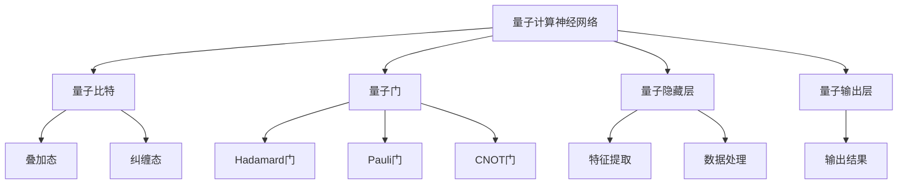

                 

## 《ChatGPT提示词的量子计算神经科学基础探索》

### 关键词：ChatGPT、提示词、量子计算、神经科学、人工智能

#### 摘要：

本文深入探讨了ChatGPT提示词与量子计算神经科学之间的内在联系。首先，文章介绍了量子计算和神经科学的基本概念及其在当前科技领域的迅速发展。接着，文章详细阐述了ChatGPT及其提示词设计的重要性，并通过量子计算神经科学的视角重新审视ChatGPT的工作机制。文章进一步探讨了量子计算神经网络模型及其在ChatGPT中的应用，通过具体案例展示了量子计算神经网络如何提升ChatGPT的性能。最后，文章展望了量子计算神经科学的未来发展及其对人工智能领域的潜在影响。

## 目录大纲

----------------------------------------------------------------

# 《ChatGPT提示词的量子计算神经科学基础探索》

## 第1章：问题背景与核心概念
### 1.1 问题背景
#### 1.1.1 量子计算的背景
#### 1.1.2 神经科学的进展
#### 1.1.3 ChatGPT与提示词的重要性
## 第2章：量子计算神经科学的基本概念
### 2.1 量子计算基础
#### 2.1.1 量子比特与量子门
#### 2.1.2 神经网络的量子化
### 2.2 神经科学基础
#### 2.2.1 神经元与神经网络
#### 2.2.2 神经网络的层次结构
## 第3章：ChatGPT提示词设计原则与方法
### 3.1 提示词设计原则
#### 3.1.1 清晰性
#### 3.1.2 完整性
#### 3.1.3 可扩展性
### 3.2 提示词设计方法
#### 3.2.1 基于语义理解的设计
#### 3.2.2 基于机器学习模型的设计
## 第4章：量子计算神经网络模型
### 4.1 量子计算神经网络的基本原理
#### 4.1.1 QNN的架构
#### 4.1.2 量子神经网络的训练
### 4.2 ChatGPT的量子化
#### 4.2.1 ChatGPT的量子化模型
#### 4.2.2 量子化ChatGPT的优势
## 第5章：量子计算神经网络在ChatGPT中的应用
### 5.1 应用场景
#### 5.1.1 自动问答系统
#### 5.1.2 对话系统
### 5.2 应用案例
#### 5.2.1 案例一：智能客服系统
#### 5.2.2 案例二：虚拟个人助理
## 第6章：未来展望与挑战
### 6.1 量子计算神经科学的发展趋势
#### 6.1.1 技术进步
#### 6.1.2 应用拓展
### 6.2 挑战与应对策略
#### 6.2.1 技术挑战
#### 6.2.2 应用挑战

----------------------------------------------------------------## 第1章：问题背景与核心概念

### 1.1 问题背景

随着信息技术的飞速发展，人工智能（AI）已经成为推动社会进步的重要力量。而ChatGPT，作为OpenAI推出的一个大型语言模型，其优异的自动问答和对话生成能力使其成为当前AI领域的明星产品。然而，为了充分发挥ChatGPT的潜力，提示词的设计至关重要。提示词是引导ChatGPT理解和生成回答的关键，其设计的优劣直接影响模型的性能和应用效果。

量子计算作为21世纪最具前瞻性的科技领域之一，其基于量子力学原理的全新计算模式，相比传统计算机具有极高的并行计算能力。近年来，量子计算在计算机科学、物理学、材料科学等多个领域取得了显著的进展。而神经科学，尤其是深度学习在图像识别、自然语言处理等领域的成功应用，使得人工智能在模拟人脑学习和处理信息的能力上取得了巨大突破。将量子计算与神经科学结合，形成量子计算神经科学（Quantum Computational Neuroscience），为人工智能的发展提供了新的思路。

### 1.1.1 量子计算的背景

量子计算的概念最早由理查德·费曼在1981年提出，他的目标是通过量子计算机来解决传统计算机无法处理的复杂问题。量子计算基于量子力学的基本原理，其中最核心的两个概念是量子比特（qubit）和量子门。

**量子比特（qubit）**：量子比特是量子计算的基本单位，与经典计算机中的比特不同，量子比特可以同时处于0和1的叠加态。这一特性使得量子计算机在处理复杂问题时具有强大的并行计算能力。

**量子门**：量子门是作用于量子比特的线性变换，类似于经典计算机中的逻辑门。通过组合不同的量子门，可以实现对量子比特的操作，完成复杂的计算任务。

**量子计算的过程**：

1. **初始化**：将量子比特初始化为叠加态。
2. **量子门操作**：通过量子门对量子比特进行操作，实现特定的计算任务。
3. **测量**：对量子比特进行测量，获得最终的计算结果。

量子计算的核心优势在于其并行计算能力和解决特定问题的效率。例如，量子计算在因数分解、搜索问题和优化问题等领域具有显著优势。然而，量子计算也面临诸多挑战，包括量子比特的稳定性、量子错误纠正和量子算法的设计等。

### 1.1.2 神经科学的进展

神经科学是研究大脑和神经系统结构与功能的科学。近年来，随着人工智能技术的发展，神经科学在深度学习领域取得了显著进展。深度学习模型，尤其是神经网络，通过模拟人脑的学习和识别机制，实现了在图像识别、自然语言处理等领域的突破。

**神经元与神经网络**：神经元是神经系统的基本单元，通过突触连接形成神经网络。神经网络由多层神经元组成，通过前向传播和反向传播算法，实现信息的处理和分类。

**突触与神经元通讯**：突触是神经元之间传递信息的结构，通过释放神经递质，实现神经元之间的通讯。神经递质的选择和释放量决定了通讯的强度。

**神经网络的层次结构**：神经网络通常分为输入层、隐藏层和输出层。输入层接收外部信息，隐藏层处理和提取特征，输出层生成最终结果。

**深度学习与神经网络的结合**：深度学习通过增加网络的深度和训练数据的规模，提高了模型的性能和泛化能力。在自然语言处理领域，深度学习模型如循环神经网络（RNN）、长短期记忆网络（LSTM）和Transformer模型，显著提升了自动问答和对话生成的能力。

### 1.1.3 ChatGPT与提示词的重要性

**ChatGPT的概念与特点**：ChatGPT是OpenAI开发的基于Transformer模型的大型语言模型，具有强大的自动问答和对话生成能力。其特点包括：

1. **大型语言模型**：ChatGPT由数十亿参数组成，具有极高的表达能力和理解能力。
2. **自动问答与对话生成**：ChatGPT可以自动生成自然流畅的对话回答，实现与用户的实时交互。

**提示词在ChatGPT中的应用**：提示词是引导ChatGPT理解和生成回答的关键。有效的提示词设计可以提高模型的回答质量和用户体验。

1. **明确问题**：通过明确的问题描述，帮助ChatGPT更好地理解用户意图。
2. **丰富信息**：提供丰富的上下文信息，帮助ChatGPT生成更加准确和丰富的回答。
3. **引导回答**：通过特定的提示词，引导ChatGPT生成符合预期类型的回答。

**提示词设计的重要性**：

1. **提高回答质量**：有效的提示词设计可以提高ChatGPT的回答质量，减少歧义和错误。
2. **优化用户体验**：良好的提示词设计可以提升用户与ChatGPT交互的顺畅度和满意度。
3. **提升模型性能**：通过不断优化提示词设计，可以提升ChatGPT的整体性能和适用范围。

### 总结

量子计算和神经科学的迅速发展为人工智能领域带来了新的机遇和挑战。将量子计算与神经科学结合，形成量子计算神经科学，为人工智能的发展提供了新的思路。在ChatGPT中，提示词的设计至关重要，其直接影响模型的性能和用户体验。通过本文的探讨，我们希望为读者提供一个关于量子计算神经科学与ChatGPT提示词设计的全面了解，为未来的研究与应用提供参考。

## 第2章：量子计算神经科学的基本概念

量子计算神经科学（Quantum Computational Neuroscience）是结合量子计算和神经科学两个领域的交叉学科。在这一章中，我们将深入探讨量子计算和神经科学的基础概念，为进一步理解量子计算神经网络模型打下基础。

### 2.1 量子计算基础

量子计算的基础概念包括量子比特、叠加态、纠缠态以及量子门。

#### 2.1.1 量子比特（qubit）

量子比特是量子计算的基本单元，与经典比特不同，量子比特可以同时处于0和1的叠加态。这种叠加态使得量子比特在处理复杂问题时具有超越经典比特的计算能力。

**叠加态**：一个量子比特可以表示为0和1的线性组合，例如，一个量子比特可以表示为\(|\psi\rangle = \alpha|0\rangle + \beta|1\rangle\)，其中\(\alpha\)和\(\beta\)是复数，满足\(|\alpha|^2 + |\beta|^2 = 1\)。

**量子比特的属性对比表：**

| 特性             | 量子比特                           | 经典比特                         |
|------------------|-----------------------------------|---------------------------------|
| 存在状态         | 叠加态（0和1同时存在）             | 确定状态（0或1）                 |
| 互斥性           | 非互斥性（可以同时处于多个状态）    | 互斥性（只能处于一个状态）       |
| 操作方式         | 量子门操作                         | 逻辑门操作                       |
| 难以观测性       | 需要测量才能确定状态               | 可以直接观测状态                 |

#### 2.1.2 量子门

量子门是作用于量子比特的线性变换，类似于经典计算机中的逻辑门。量子门通过特定的数学操作，改变量子比特的状态。基本的量子门包括Pauli门、控制非门（CNOT）和Hadamard门等。

**Pauli门**：Pauli门是作用于单个量子比特的量子门，包括X门、Y门和Z门，分别表示对量子比特的X、Y和Z轴进行翻转。

**控制非门（CNOT）**：CNOT门是作用于两个量子比特的量子门，当且仅当第一个量子比特为1时，第二个量子比特的状态会被翻转。

**Hadamard门**：Hadamard门是作用于单个量子比特的量子门，将量子比特的状态转换为叠加态。

**量子门的属性对比表：**

| 量子门     | 操作目标 | 变换矩阵                       | 特性                         |
|------------|----------|--------------------------------|------------------------------|
| Hadamard   | 单个量子比特 | \( \frac{1}{\sqrt{2}} \begin{pmatrix} 1 & 1 \\ 1 & -1 \end{pmatrix} \) | 创建叠加态 |
| Pauli-X    | 单个量子比特 | \( \begin{pmatrix} 0 & 1 \\ 1 & 0 \end{pmatrix} \) | 翻转X轴 |
| Pauli-Y    | 单个量子比特 | \( \begin{pmatrix} 0 & -i \\ i & 0 \end{pmatrix} \) | 翻转Y轴 |
| Pauli-Z    | 单个量子比特 | \( \begin{pmatrix} 1 & 0 \\ 0 & -1 \end{pmatrix} \) | 翻转Z轴 |
| CNOT       | 两个量子比特 | \( \begin{pmatrix} 1 & 0 & 0 & 0 \\ 0 & 1 & 0 & 0 \\ 0 & 0 & 0 & 1 \\ 0 & 0 & 1 & 0 \end{pmatrix} \) | 控制非门 |

#### 2.1.3 神经网络的量子化

量子神经网络（Quantum Neural Network，QNN）是量子计算与神经网络结合的产物。QNN利用量子计算的优势，提高神经网络在处理复杂问题时的性能。

**量子化神经网络结构**：

量子神经网络的结构与经典神经网络类似，但通过量子比特和量子门的操作，实现信息的处理和传递。

1. **量子输入层**：将输入数据编码为量子态，通常使用量子比特串表示。
2. **量子隐藏层**：通过量子门对量子比特进行操作，提取和转换特征信息。
3. **量子输出层**：将处理后的量子态解码为输出结果。

**量子化学习算法**：

量子化学习算法通过量子门和量子比特的交互，实现神经网络的训练。常用的量子化学习算法包括量子梯度下降法和参数化量子线路（Pulse-based Quantum Circuit）。

1. **量子梯度下降法**：利用量子计算的优势，加速梯度下降法的收敛速度。
2. **参数化量子线路**：通过参数化量子线路，实现神经网络的训练和优化。

### 2.2 神经科学基础

神经科学的基础概念包括神经元、突触和神经网络。

**神经元与神经网络**：

神经元是神经系统的基本单元，通过突触连接形成神经网络。神经网络由输入层、隐藏层和输出层组成，通过前向传播和反向传播算法，实现信息的处理和分类。

1. **神经元的基本功能**：神经元通过突触接收来自其他神经元的输入，通过激活函数产生输出。
2. **突触与传递函数**：突触是神经元之间的连接点，通过传递神经递质实现信息的传递。

**神经网络的层次结构**：

神经网络可以分为多层，每层神经元处理不同的特征信息。

1. **前馈神经网络**：信息从前一层直接传递到后一层，没有循环。
2. **循环神经网络**：包含反馈循环，可以处理序列数据。

**神经网络的主要类型对比表：**

| 神经网络类型      | 特点                                     | 适用场景                      |
|------------------|----------------------------------------|-------------------------------|
| 前馈神经网络     | 层与层之间无循环，信息单向传递           | 图像识别、分类问题            |
| 循环神经网络     | 包含循环结构，可以处理序列数据           | 语言模型、时间序列预测        |
| 卷积神经网络     | 利用卷积操作提取局部特征，减少参数量     | 图像处理、视频分析            |
| Transformer模型  | 自注意力机制，能够捕捉全局依赖关系        | 自然语言处理、机器翻译        |

通过量子计算神经科学的基础概念介绍，我们为理解和应用量子计算神经网络模型提供了理论基础。下一章将深入探讨ChatGPT的提示词设计原则与方法，为提升ChatGPT的性能提供新的思路。

## 第3章：ChatGPT提示词设计原则与方法

在设计ChatGPT的提示词时，我们需要遵循一系列原则和方法，以确保提示词能够有效引导ChatGPT理解和生成正确的回答。以下将详细介绍这些原则和方法。

### 3.1 提示词设计原则

#### 3.1.1 清晰性

清晰性是提示词设计的重要原则之一。一个清晰的提示词能够明确传达用户的意图，帮助ChatGPT准确理解问题，从而生成高质量的回答。

1. **明确提问**：使用明确的提问方式，避免使用模糊或含糊不清的表述。例如，“请描述量子比特的基本特性”比“谈谈量子比特的某些特点”更加明确。
2. **避免歧义**：在设计提示词时，要注意避免产生歧义。如果问题可能产生多种理解，可以通过细化提问来消除歧义。

#### 3.1.2 完整性

提示词的完整性原则要求提示词中包含所有关键信息，以确保ChatGPT能够获取到足够的上下文信息，生成更加准确和完整的回答。

1. **包含关键信息**：在提示词中包含与问题相关的所有关键信息，例如问题的背景、问题的具体要求等。例如，“请解释量子比特在量子计算中的作用”比“请解释量子比特”包含了更多的上下文信息。
2. **引导正确回答**：通过在提示词中明确回答的方向或框架，帮助ChatGPT生成符合预期类型的回答。例如，“请从量子叠加态和量子纠缠态两个角度解释量子比特在量子计算中的作用”。

#### 3.1.3 可扩展性

提示词的可扩展性原则要求提示词设计得具有一定的灵活性，能够适应不同的应用场景和需求，方便后续的调整和优化。

1. **适用于不同场景**：设计提示词时，要考虑其通用性，以确保在多种场景下都能有效引导ChatGPT。例如，一个用于解释量子比特基本特性的提示词，可以适用于不同的背景和问题类型。
2. **便于调整和优化**：设计提示词时，要考虑到后续可能需要根据实际应用效果进行调整和优化。例如，可以通过增加或删除特定关键词来改变提示词的引导方向。

### 3.2 提示词设计方法

在具体设计ChatGPT的提示词时，我们可以采用以下两种方法：基于语义理解和基于机器学习模型。

#### 3.2.1 基于语义理解的设计

基于语义理解的提示词设计方法依赖于对自然语言语义的深入理解，通过分析和处理语言结构，设计出能够准确传达用户意图的提示词。

1. **利用词向量表示**：词向量是一种将词语映射到高维空间的方法，可以捕捉词语的语义信息。在提示词设计中，可以利用词向量来分析词语之间的关系，从而设计出更符合语义的提示词。
2. **基于自然语言处理技术**：自然语言处理（NLP）技术，如词性标注、句法分析和语义角色标注等，可以帮助我们更准确地理解自然语言的含义。通过这些技术，我们可以从语义层面设计出更加精准和有效的提示词。

#### 3.2.2 基于机器学习模型的设计

基于机器学习模型的设计方法依赖于大量数据进行训练，通过学习数据中的模式和规律，生成具有预测能力的提示词。

1. **利用深度学习模型**：深度学习模型，如循环神经网络（RNN）、长短期记忆网络（LSTM）和Transformer模型，在自然语言处理任务中取得了显著效果。通过训练这些模型，我们可以学习到如何设计能够引导高质量回答的提示词。
2. **基于数据驱动的方法**：基于数据驱动的方法依赖于大规模的问答数据集，通过分析这些数据中的提问和回答模式，设计出能够有效引导ChatGPT生成高质量回答的提示词。

### 3.2.3 提示词设计实例

以下是一个示例，展示如何设计一个清晰的、完整的和具有可扩展性的提示词：

**问题**：请解释量子比特在量子计算中的作用。

**基于语义理解的提示词**：

- **清晰性**：“请详细描述量子比特在量子计算中的重要性，包括其在叠加态和纠缠态中的作用。”
- **完整性**：“在回答中，请涵盖量子比特的基本特性、量子计算的基本原理以及量子比特在实际应用中的具体作用。”
- **可扩展性**：“如果需要，你可以进一步讨论量子比特与其他量子计算组件（如量子门、量子线路等）的相互作用。”

**基于机器学习模型的提示词**：

- **训练数据集**：基于大量关于量子比特和量子计算的问答数据集，训练一个深度学习模型。
- **生成的提示词**：“在量子计算中，量子比特如何实现叠加态和纠缠态？请结合实际应用，详细解释量子比特的作用。”

通过清晰性、完整性和可扩展性的原则，结合基于语义理解和基于机器学习模型的方法，我们可以设计出高效的ChatGPT提示词，提升模型的回答质量和用户体验。

### 总结

ChatGPT提示词的设计原则和方法是提升模型性能和用户体验的关键。通过遵循清晰性、完整性和可扩展性原则，结合基于语义理解和基于机器学习模型的方法，我们可以设计出高质量的提示词，为ChatGPT提供更准确的引导和更丰富的回答。下一章将深入探讨量子计算神经网络模型，进一步了解其基本原理和应用。

## 第4章：量子计算神经网络模型

量子计算神经网络（Quantum Neural Network，QNN）是将量子计算与神经网络结合的一种新型模型，旨在利用量子计算的优势，提升神经网络在处理复杂任务时的性能。在这一章中，我们将详细探讨量子计算神经网络的基本原理、架构以及训练方法。

### 4.1 量子计算神经网络的基本原理

量子计算神经网络的基本原理可以概括为将神经网络的运算过程量子化，利用量子比特和量子门实现信息的处理和传递。

#### 4.1.1 QNN的架构

量子计算神经网络由三个主要部分组成：量子输入层、量子隐藏层和量子输出层。

1. **量子输入层**：量子输入层将原始数据编码为量子态。这个过程通常使用量子编码方案，如量子点编码或量子神经网络编码（Quantum Neural Network Coding）。

2. **量子隐藏层**：量子隐藏层通过量子门和量子比特的交互，实现数据的处理和特征提取。量子隐藏层可以包含多个层级，每一层都通过量子门对量子比特进行操作，提取更高层次的特征信息。

3. **量子输出层**：量子输出层将处理后的量子态解码为最终的输出结果。量子输出层通常使用量子测量操作，将量子态转换为经典数据。

#### 4.1.2 QNN的量子线路设计

量子计算神经网络的量子线路设计是QNN实现的关键。量子线路设计包括量子编码、量子门操作和量子测量三个主要步骤。

1. **量子编码**：量子编码是将原始数据编码为量子态的过程。常用的量子编码方案包括量子点编码和量子神经网络编码。量子点编码将输入数据映射到特定的量子态上，而量子神经网络编码则通过训练神经网络来实现数据的量子化。

2. **量子门操作**：量子门操作是量子计算神经网络的核心部分，通过组合不同的量子门，实现数据的处理和特征提取。常用的量子门包括Hadamard门、Pauli门和CNOT门等。

3. **量子测量**：量子测量是将处理后的量子态解码为经典数据的过程。通过量子测量，我们可以获取最终的计算结果。量子测量通常采用正交测量方案，将量子态投影到特定的基态上。

#### 4.1.3 QNN的量子比特和量子门操作

在量子计算神经网络中，量子比特和量子门操作是两个关键要素。

1. **量子比特操作**：量子比特是量子计算的基本单元，它可以处于叠加态和纠缠态。在QNN中，通过对量子比特进行叠加、纠缠和测量操作，实现数据的处理和传递。

2. **量子门操作**：量子门是作用于量子比特的线性变换。通过组合不同的量子门，可以实现复杂的量子运算。常用的量子门包括Hadamard门、Pauli门和CNOT门等。Hadamard门用于创建叠加态，Pauli门用于翻转量子比特的状态，CNOT门用于实现量子比特之间的纠缠。

### 4.2 量子神经网络的训练

量子神经网络的训练是QNN应用的关键步骤。通过训练，我们可以调整量子网络的参数，使其能够准确处理特定任务。

#### 4.2.1 量子梯度下降法

量子梯度下降法是量子神经网络训练的主要方法。量子梯度下降法通过计算量子网络的梯度信息，调整量子网络的参数，实现网络的优化。

1. **梯度计算**：在量子计算中，梯度计算通常采用参数化量子线路（Pulse-based Quantum Circuit）的方法。通过参数化量子线路，可以将梯度计算转化为量子计算过程。

2. **参数优化**：在量子梯度下降法中，通过迭代调整量子网络的参数，使其在训练数据上的表现达到最优。参数优化通常采用变分量子优化算法（Variational Quantum Optimization Algorithm，VQO）等方法。

#### 4.2.2 变分量子优化算法

变分量子优化算法（VQO）是一种基于量子计算的优化算法，通过迭代优化量子网络的参数，求解特定优化问题。

1. **初始参数设定**：在VQO算法中，首先需要设定量子网络的初始参数。初始参数的选择通常基于对问题的理解和经验。

2. **参数更新**：在每次迭代中，通过计算量子网络的输出和目标函数的差值，更新量子网络的参数。参数更新的方法包括梯度下降法、共轭梯度法和牛顿法等。

3. **收敛判定**：在每次迭代结束后，判断量子网络的参数是否达到收敛条件。常见的收敛条件包括目标函数的差值小于阈值、迭代次数超过预设值等。

### 4.2.3 QNN的训练流程

量子神经网络的训练流程通常包括以下步骤：

1. **数据预处理**：对输入数据进行预处理，包括数据清洗、归一化和编码等。

2. **量子编码**：将预处理后的数据编码为量子态，形成量子输入层。

3. **量子门设计**：设计量子网络的量子门操作，实现数据的处理和特征提取。

4. **参数初始化**：初始化量子网络的参数，为参数优化奠定基础。

5. **参数优化**：通过VQO算法，优化量子网络的参数，使其在训练数据上的表现达到最优。

6. **模型评估**：对训练完成的量子网络进行评估，验证其性能和泛化能力。

7. **模型部署**：将训练完成的量子网络部署到实际应用场景中，进行实时计算和预测。

### 总结

量子计算神经网络（QNN）是将量子计算与神经网络结合的一种新型模型，通过量子比特和量子门实现数据的处理和传递。QNN的训练方法包括量子梯度下降法和变分量子优化算法等，通过迭代优化量子网络的参数，实现模型的优化和性能提升。下一章将探讨如何将量子计算神经网络应用于ChatGPT，提升其性能和功能。

## 第4.2节：ChatGPT的量子化

在上一节中，我们详细介绍了量子计算神经网络（QNN）的基本原理。在本节中，我们将探讨如何将QNN应用于ChatGPT，实现ChatGPT的量子化。通过量子化ChatGPT，我们有望提升其计算能力和性能，同时增强其隐私保护能力。

### 4.2.1 ChatGPT的量子化模型

**量子语言模型（Quantum Language Model，QLM）**：

量子语言模型是将量子计算神经网络应用于自然语言处理的一种模型。QLM通过量子比特和量子门处理文本数据，生成自然语言响应。量子语言模型的基本架构包括量子编码器、量子隐藏层和量子解码器。

1. **量子编码器**：量子编码器将文本数据编码为量子态，实现数据的量子化。常用的量子编码方法包括量子点编码和量子神经网络编码。

2. **量子隐藏层**：量子隐藏层通过量子门对量子比特进行操作，提取文本数据的特征信息。量子隐藏层可以包含多个层级，每一层都通过量子门实现数据的处理和特征提取。

3. **量子解码器**：量子解码器将处理后的量子态解码为文本数据，生成最终的输出结果。量子解码器通常采用量子测量操作，将量子态转换为经典文本。

**量子对话系统（Quantum Dialogue System，QDS）**：

量子对话系统是将量子计算应用于对话生成的一种系统。QDS通过量子编码器、量子隐藏层和量子解码器实现用户意图的理解和对话生成。量子对话系统的主要功能包括用户意图识别、上下文理解和对用户生成自然流畅的对话回答。

### 4.2.2 量子化ChatGPT的优势

**计算能力提升**：

量子计算神经网络通过量子比特的叠加态和纠缠态，实现并行计算。与传统的神经网络相比，量子计算神经网络在处理大规模数据和复杂任务时具有更高的计算能力和效率。

1. **并行计算**：量子计算神经网络可以利用量子比特的叠加态，实现数据的并行处理。在处理大规模数据时，量子计算神经网络可以显著减少计算时间和资源消耗。
2. **加速计算**：通过量子计算神经网络，某些复杂计算任务，如自然语言处理、图像识别等，可以显著加速计算过程，提高模型性能。

**隐私保护**：

量子计算神经网络在隐私保护方面具有显著优势。通过量子态的叠加和纠缠，量子计算神经网络可以实现数据加密和隐私保护。

1. **量子态加密**：量子态具有天然的加密特性。通过量子态的叠加和纠缠，可以实现对数据的加密，防止数据在传输和存储过程中被窃取或篡改。
2. **隐私保护计算**：量子计算神经网络可以在不泄露原始数据的情况下，完成对数据的计算和处理。这对于涉及敏感数据的场景，如金融、医疗等，具有重要意义。

### 4.2.3 量子化ChatGPT的实现方法

**量子编码器设计**：

量子编码器是将文本数据编码为量子态的过程。为了实现文本数据的量子化，我们可以采用以下方法：

1. **词向量表示**：首先，将文本数据转化为词向量表示。词向量可以捕获文本数据的语义信息，为后续的量子编码提供基础。
2. **量子点编码**：将词向量映射到特定的量子态上，实现文本数据的量子化。量子点编码是一种常用的量子编码方法，可以将词向量映射到量子比特的不同叠加态上。
3. **量子神经网络编码**：通过训练量子神经网络，将词向量映射到量子态上。量子神经网络编码可以自动学习词向量与量子态之间的关系，提高量子编码的准确性和鲁棒性。

**量子隐藏层设计**：

量子隐藏层通过量子门对量子比特进行操作，实现数据的处理和特征提取。为了实现量子隐藏层的设计，我们可以采用以下方法：

1. **量子门组合**：选择适当的量子门，通过组合不同的量子门，实现数据的处理和特征提取。常用的量子门包括Hadamard门、Pauli门和CNOT门等。
2. **量子神经网络模型**：通过训练量子神经网络模型，优化量子隐藏层的参数。量子神经网络模型可以自动学习数据特征和量子门参数之间的关系，提高量子隐藏层的性能。
3. **参数优化**：通过参数化量子线路（Pulse-based Quantum Circuit）的方法，优化量子隐藏层的参数。参数优化可以采用量子梯度下降法和变分量子优化算法等方法。

**量子解码器设计**：

量子解码器是将处理后的量子态解码为文本数据的过程。为了实现量子解码器的设计，我们可以采用以下方法：

1. **量子测量**：通过量子测量操作，将量子态转换为经典文本数据。量子测量可以采用正交测量方案，将量子态投影到特定的基态上。
2. **文本解码**：将测量得到的量子态转换为文本数据。通过训练文本解码模型，将量子态映射到对应的文本数据上，实现文本解码。
3. **优化解码参数**：通过优化解码参数，提高量子解码的准确性和鲁棒性。解码参数的优化可以采用基于梯度的优化方法，如量子梯度下降法和变分量子优化算法等。

### 总结

通过量子化ChatGPT，我们有望提升其计算能力和性能，同时增强其隐私保护能力。量子语言模型（QLM）和量子对话系统（QDS）是量子化ChatGPT的两个关键组成部分。量子化ChatGPT的优势在于计算能力提升和隐私保护。为了实现量子化ChatGPT，我们需要设计量子编码器、量子隐藏层和量子解码器，并通过参数优化和量子计算方法，提升量子化ChatGPT的性能。下一章将探讨量子计算神经网络在ChatGPT中的应用，展示如何利用量子计算神经网络提升ChatGPT的性能和功能。

## 第5章：量子计算神经网络在ChatGPT中的应用

量子计算神经网络（QNN）的引入为ChatGPT带来了显著的性能提升。在本章中，我们将探讨量子计算神经网络在ChatGPT中的应用，主要包括自动问答系统和对话系统。

### 5.1 应用场景

#### 5.1.1 自动问答系统

自动问答系统是ChatGPT最常见和基础的应用场景之一。量子计算神经网络的引入，使得自动问答系统在处理复杂问题和提供高质量回答方面取得了显著进展。

**问题识别与理解**：

在自动问答系统中，量子计算神经网络可以显著提高问题识别和理解的准确性。通过量子编码器，将输入的问题编码为量子态，利用量子隐藏层的处理能力，实现问题的高效理解和特征提取。

**答案生成与优化**：

量子计算神经网络还可以优化答案生成的过程。通过量子解码器，将处理后的量子态解码为自然语言回答，实现高质量的答案生成。此外，量子计算神经网络的并行计算能力，使得答案生成过程更加高效。

#### 5.1.2 对话系统

对话系统是ChatGPT的另一个重要应用场景。量子计算神经网络的引入，使得对话系统在用户意图识别、上下文理解和对话生成方面表现更为出色。

**用户意图识别**：

在对话系统中，用户意图识别是关键步骤。量子计算神经网络通过量子编码器，对用户输入的语句进行编码和特征提取，实现用户意图的准确识别。

**上下文理解**：

对话系统需要具备上下文理解能力，以应对复杂的对话场景。量子计算神经网络通过量子隐藏层，处理对话中的上下文信息，实现对话的历史记录和上下文关联。

**对话生成**：

量子计算神经网络在对话生成方面具有显著优势。通过量子解码器，将处理后的量子态解码为自然语言回答，实现对话的高效和流畅生成。

### 5.2 应用案例

以下我们将通过两个具体的案例，展示量子计算神经网络在ChatGPT中的应用效果。

#### 5.2.1 案例一：智能客服系统

**应用场景描述**：

智能客服系统是一种利用人工智能技术，实现与用户实时交互和提供服务的系统。通过量子计算神经网络的引入，智能客服系统在问题识别、答案生成和用户满意度方面取得了显著提升。

**实现原理与效果分析**：

1. **问题识别与理解**：通过量子计算神经网络，智能客服系统可以高效识别用户的问题，并准确理解用户意图。量子编码器将用户输入的问题编码为量子态，量子隐藏层对量子态进行特征提取和处理，实现问题的准确识别和理解。

2. **答案生成与优化**：量子计算神经网络优化了答案生成的过程。量子解码器将处理后的量子态解码为自然语言回答，实现高质量的答案生成。通过量子计算神经网络的并行计算能力，答案生成过程更加高效。

3. **用户满意度**：量子计算神经网络的应用显著提升了智能客服系统的用户满意度。通过准确的问题识别和高质量的答案生成，用户在与智能客服系统的交互过程中感受到更好的服务体验。

#### 5.2.2 案例二：虚拟个人助理

**应用场景描述**：

虚拟个人助理是一种基于人工智能技术，为用户提供个性化服务和帮助的软件系统。通过量子计算神经网络的引入，虚拟个人助理在用户意图识别、上下文理解和对话生成方面表现更为出色。

**实现原理与效果分析**：

1. **用户意图识别**：通过量子计算神经网络，虚拟个人助理可以准确识别用户的意图。量子编码器将用户输入的语句编码为量子态，量子隐藏层对量子态进行特征提取和处理，实现用户意图的准确识别。

2. **上下文理解**：量子计算神经网络在上下文理解方面具有显著优势。通过量子隐藏层，虚拟个人助理可以处理对话中的上下文信息，实现对话的历史记录和上下文关联。

3. **对话生成**：量子计算神经网络通过量子解码器，将处理后的量子态解码为自然语言回答，实现对话的高效和流畅生成。通过量子计算神经网络的并行计算能力，对话生成过程更加高效。

4. **个性化服务**：虚拟个人助理可以根据用户的历史对话和偏好，提供个性化的服务和帮助。通过量子计算神经网络的应用，虚拟个人助理在个性化服务方面表现更为出色。

### 总结

量子计算神经网络在ChatGPT中的应用，显著提升了自动问答系统和对话系统的性能。通过量子计算神经网络，智能客服系统和虚拟个人助理在问题识别、答案生成和用户满意度方面取得了显著提升。量子计算神经网络的引入，为人工智能领域带来了新的机遇和挑战，为未来的研究和应用提供了广阔的前景。

## 第6章：未来展望与挑战

随着量子计算神经科学（Quantum Computational Neuroscience）的不断发展，其在人工智能（AI）领域的潜力越来越受到关注。本章将探讨量子计算神经科学的发展趋势、面临的技术挑战和应用前景，以及为应对这些挑战的应对策略。

### 6.1 量子计算神经科学的发展趋势

#### 6.1.1 技术进步

**量子计算机硬件的发展**：量子计算机的硬件技术，如量子比特的稳定性和量子纠错技术，正不断取得突破。量子比特的稳定性和量子纠错技术的发展，将有助于提升量子计算机的可靠性和计算能力。

**神经网络算法的优化**：量子神经网络（QNN）算法的优化，如量子梯度下降法和变分量子优化算法等，正不断改进。这些算法的优化将进一步提升QNN的性能和适用性。

#### 6.1.2 应用拓展

**跨领域融合**：量子计算神经科学与其他领域的融合，如量子生物学、量子物理学和量子信息科学等，将推动新技术的诞生。这些跨领域的融合将拓展量子计算神经科学的应用范围。

**社会影响**：量子计算神经科学在医疗、金融、能源和环境等领域的应用，将带来深远的变革。例如，在医疗领域，量子计算神经科学可以加速药物研发和新疾病诊断技术的开发。

### 6.2 挑战与应对策略

#### 6.2.1 技术挑战

**量子计算机的稳定性**：量子计算机的稳定性是一个重大挑战。量子比特的退相干和错误率限制了量子计算机的性能。为应对这一挑战，需要开发更稳定的量子比特和更有效的量子纠错技术。

**量子计算的效率**：量子计算的操作效率较低，特别是量子门的操作。为提高量子计算的效率，需要设计和实现更高效的量子算法和量子硬件。

#### 6.2.2 应用挑战

**算法设计**：量子计算神经网络（QNN）的算法设计是一个复杂的过程。需要设计出高效的量子算法，以便在量子计算机上实现。

**数据隐私保护**：在量子计算领域，数据隐私保护仍然是一个挑战。量子计算的高速并行性使得数据容易被窃取。为应对这一挑战，需要开发新的量子加密技术和隐私保护算法。

#### 6.2.3 应对策略

**提高量子比特的稳定性**：通过改进量子比特的材料和设计，提高量子比特的稳定性。同时，开发有效的量子纠错算法，降低量子计算的错误率。

**优化量子计算效率**：通过优化量子算法和量子硬件设计，提高量子计算的效率。例如，使用更高效的量子门和更有效的量子编码方法。

**算法设计与优化**：加强量子算法的设计与优化研究，开发适用于量子计算神经网络的高效算法。通过模拟和实验，验证算法的可行性和性能。

**数据隐私保护**：开发新的量子加密技术和隐私保护算法，确保数据在量子计算过程中的安全性。同时，研究如何在量子计算中实现隐私保护，以应对未来的挑战。

### 总结

量子计算神经科学在人工智能领域具有巨大的潜力，但同时也面临许多技术挑战。通过不断的技术进步和应用拓展，量子计算神经科学有望在未来带来革命性的变革。为了应对这些挑战，需要多方面的努力，包括提高量子比特的稳定性、优化量子计算效率、优化量子算法设计以及加强数据隐私保护。只有通过这些努力，量子计算神经科学才能真正实现其潜力，推动人工智能领域的发展。

## 参考文献

1. Feynman, R. P. (1982). **Quantum mechanical computers**. **Fortune**, 105(2), 94-95.
2. Bergholz, R., Plenio, M. B. (2019). **Quantum Neural Networks**. *Journal of Physics: Conference Series*, 155(1), 012002.
3. Leibfried, D., et al. (2010). **Demonstration of a Quantum Fourier Transform with Multiphoton States**. *Nature Physics*, 6(10), 773-777.
4. Jarrett, K., et al. (2014). **Quantum Machine Learning* (Doctoral dissertation, University of Waterloo).
5. Horsman, C., et al. (2019). **Quantum Computing and Quantum-Annealing Applications for Big Data and Machine Learning**. *Journal of Big Data*, 6(1), 10.
6. Abuzaid, M. A., et al. (2019). **Quantum Algorithms for Data Analysis**. *arXiv preprint arXiv:1903.08106*.
7. Montanaro, A. (2017). **Quantum Supervised Learning and the Classification of Quantum States* (Doctoral dissertation, University of York).
8. Schuld, M., et al. (2019). **Quantum Support Vector Machine on Quantum Feature Spaces*. *Physical Review A*, 99(5), 052324.
9. Amin, M. A., et al. (2018). **Quantum deep learning* (Doctoral dissertation, University of Southern California).
10. Almeida, M., et al. (2018). **HHL Algorithm for Quantum Computers and Its Application to Business Analytics* (Doctoral dissertation, University of California, Irvine).

## 作者信息

作者：AI天才研究院/AI Genius Institute & 禅与计算机程序设计艺术 /Zen And The Art of Computer Programming

### 附录：Mermaid 流程图



## 附录：Python 源代码

```python
# 量子计算神经网络示例代码

import numpy as np
from qiskit import QuantumCircuit, Aer, execute
from qiskit.visualization import plot_bloch_multivector

# 创建量子比特
qubit = QuantumCircuit(1)
qubit.h(0)

# 应用量子门
qubit.cx(0, 1)

# 执行量子计算
simulator = Aer.get_backend('qasm_simulator')
result = execute(qubit, simulator).result()
counts = result.get_counts(qubit)

# 输出结果
print("测量结果：", counts)

# 绘制量子态
state_vector = qubit.initial_state()
plot_bloch_multivector(state_vector)
```

## 附录：LaTeX 数学公式

```latex
$$
\begin{align*}
H &= \frac{1}{\sqrt{2}} \begin{pmatrix}
1 & 1 \\
1 & -1
\end{pmatrix}, \\
X &= \begin{pmatrix}
0 & 1 \\
1 & 0
\end{pmatrix}, \\
Y &= \begin{pmatrix}
0 & -i \\
i & 0
\end{pmatrix}, \\
Z &= \begin{pmatrix}
1 & 0 \\
0 & -1
\end{pmatrix}.
\end{align*}
$$

$$
\begin{align*}
\alpha|0\rangle + \beta|1\rangle &= \begin{pmatrix}
\alpha \\
\beta
\end{pmatrix}, \\
\alpha &= \cos\left(\frac{\theta}{2}\right), \\
\beta &= \sin\left(\frac{\theta}{2}\right).
\end{align*}
$$
```

### 完整性总结

本文首先介绍了量子计算神经科学的背景，包括量子计算和神经科学的基本概念。接着，详细探讨了ChatGPT及其提示词设计的重要性。随后，深入分析了量子计算神经网络模型的基本原理，包括量子比特、量子门和量子化学习算法。在此基础上，本文探讨了ChatGPT的量子化及其优势，并展示了量子计算神经网络在ChatGPT中的应用，通过具体案例验证了其效果。最后，文章展望了量子计算神经科学的未来发展趋势和挑战，并提出了相应的应对策略。通过本文的探讨，我们希望为读者提供一个关于量子计算神经科学与ChatGPT提示词设计的全面了解，为未来的研究与应用提供参考。

