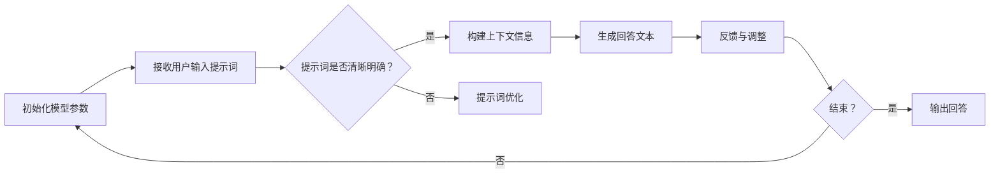
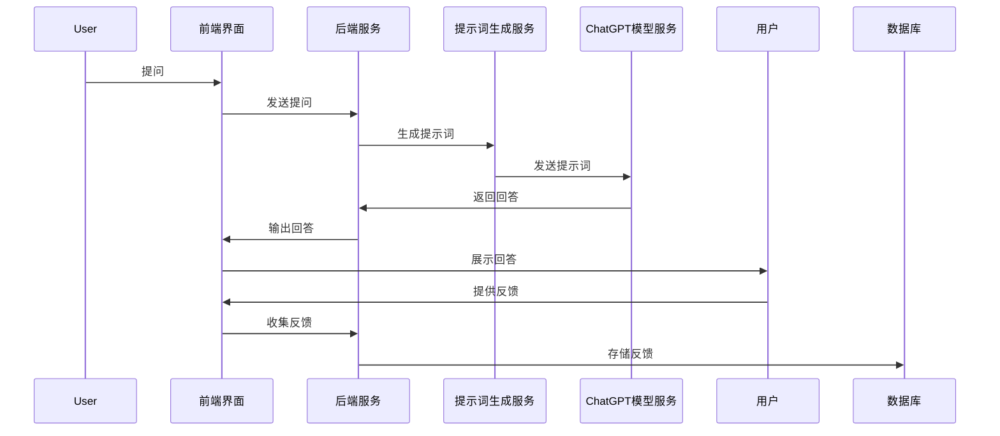
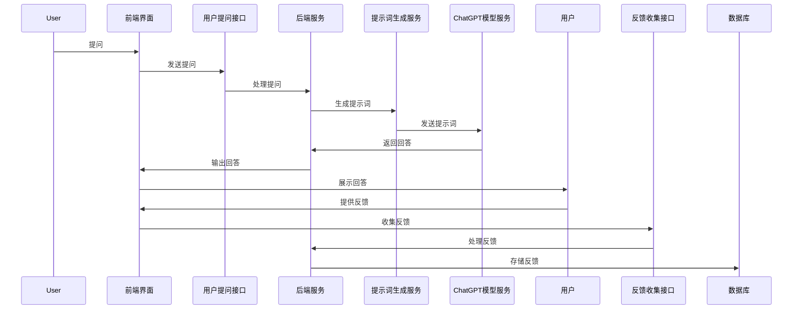

                 

### 《ChatGPT提示词编写：从入门到精通的进阶之路》

关键词：ChatGPT、提示词编写、AI应用、进阶教程、优化方法

摘要：本文旨在为读者提供一套完整的ChatGPT提示词编写的进阶教程，从基础概念到高级技巧，逐步引导读者深入了解并掌握ChatGPT提示词的编写方法。通过详细的案例分析、实际操作和深入探讨，本文将帮助读者从入门水平迅速提升到精通程度，全面掌握ChatGPT这一强大工具的使用技巧，为AI应用开发提供有力支持。

### 背景介绍

ChatGPT是由OpenAI开发的一款基于GPT-3模型的高级语言生成模型。GPT-3（Generative Pre-trained Transformer 3）是一个强大的自然语言处理模型，拥有1750亿个参数，能够进行文本生成、对话系统、文本摘要、翻译等多种任务。ChatGPT则在此基础上增加了对话生成的功能，使其能够与用户进行自然流畅的交流。

提示词（Prompt）在ChatGPT中扮演着至关重要的角色。提示词是一段引导ChatGPT生成特定类型文本的输入信息，它决定了模型生成文本的内容和风格。编写高质量的提示词是发挥ChatGPT潜能的关键，直接影响到生成文本的质量和效果。有效的提示词设计可以引导模型更精准地理解用户意图，生成更有价值的信息。

在AI应用领域，ChatGPT已经展现出广泛的应用潜力。例如，在客户服务中，ChatGPT可以模拟人类客服，为用户提供即时、个性化的解答；在教育领域，ChatGPT可以作为智能导师，为学生提供个性化的学习指导；在医疗健康领域，ChatGPT可以辅助医生进行病例分析和诊断。然而，要充分发挥ChatGPT的潜力，需要深入了解提示词编写技巧，从而优化生成文本的质量和效果。

### 关键概念与联系

在探讨ChatGPT提示词编写之前，我们需要明确一些关键概念，这些概念是理解提示词编写原理的基础。

**1. GPT-3模型**

GPT-3（Generative Pre-trained Transformer 3）是由OpenAI开发的一个深度学习模型，基于Transformer架构，具有1750亿个参数。它通过预先训练大量的文本数据，已经具备了强大的语言理解和生成能力。GPT-3模型的工作原理是通过学习输入文本的上下文信息，预测下一个可能的单词或句子。

**2. 提示词（Prompt）**

提示词是一段引导ChatGPT生成特定类型文本的输入信息。有效的提示词能够明确地告诉模型用户的需求和期望，从而引导模型生成高质量的文本。提示词的设计直接影响到生成文本的质量和效果。

**3. 对话系统**

对话系统是一种人机交互界面，通过自然语言交流与用户进行交互。ChatGPT作为一种对话系统，能够根据用户的提问或指令生成相应的回答。对话系统的核心是理解用户的意图并生成有意义的回答。

**4. 自然语言处理（NLP）**

自然语言处理是计算机科学和人工智能领域的一个分支，旨在使计算机能够理解、解释和生成人类语言。NLP技术在ChatGPT中发挥着重要作用，用于处理和生成自然语言文本。

**5. 上下文信息**

上下文信息是影响ChatGPT生成文本的重要因素。上下文信息包括用户之前的提问、对话历史、环境变量等。有效的上下文信息能够帮助模型更好地理解用户意图，生成更加准确和相关的文本。

为了更清晰地展示这些概念之间的联系，我们可以使用一个ER（实体关系）图来表示：

```mermaid
erDiagram
  User ||--|{ ChatGPT }|-- Prompt
  ChatGPT ||--|{ DialogueSystem }|-- Response
  DialogueSystem ||--|{ NLP }|-- TextProcessing
  NLP ||--|{ ContextInformation }|-- TextGeneration
```

在上面的ER图中，用户通过提示词与ChatGPT进行交互，ChatGPT作为一个对话系统，利用NLP技术处理用户的提示词，生成相应的回答。同时，上下文信息在这个过程中起到关键作用，影响模型的生成结果。

### 提示词编写原理

要编写高质量的ChatGPT提示词，我们需要理解模型的工作原理和设计有效的提示词策略。以下是ChatGPT提示词编写的核心原理：

**1. 模型工作原理**

ChatGPT模型基于GPT-3架构，通过深度学习和神经网络技术进行训练。GPT-3模型的核心是Transformer架构，这种架构能够处理长文本序列，并捕捉文本中的上下文关系。在训练过程中，GPT-3模型通过学习大量的文本数据，掌握了丰富的语言知识，从而能够生成高质量的自然语言文本。

当接收到一个提示词时，ChatGPT会首先对这个提示词进行理解和分析。然后，模型会根据提示词的内容和上下文信息，生成相应的回答。这个过程涉及以下几个步骤：

- **提示词理解**：模型会分析提示词的语义和结构，理解用户的意图。
- **上下文信息整合**：模型会结合对话历史和当前提示词，构建上下文信息。
- **文本生成**：模型根据上下文信息生成相应的文本，并不断优化生成结果。

**2. 提示词设计策略**

编写高质量的提示词需要遵循以下原则：

- **明确性**：提示词应该清晰明确，避免模糊和歧义。明确性有助于模型更好地理解用户意图，生成更准确的回答。
- **上下文相关**：提示词应该包含与对话历史和用户需求相关的信息，帮助模型构建有效的上下文信息。
- **多样性**：提示词应该多样化，避免单一和重复。多样性有助于模型生成丰富和多变的文本。
- **结构化**：提示词应该具有结构化特点，例如使用标题、段落、列表等格式。结构化有助于模型更好地理解和处理文本。

以下是一个简单的例子，展示了如何编写一个有效的提示词：

```
标题：询问天气情况

问题：请告诉我明天北京的天气如何？

提示词：明天、北京、天气
```

在这个例子中，提示词明确了用户的需求（询问天气情况），并提供了相关的上下文信息（明天、北京、天气）。这样的提示词有助于ChatGPT更好地理解用户意图，生成高质量的回答。

**3. 提示词优化**

编写高质量的提示词是一个迭代和优化的过程。在编写提示词时，我们可以通过以下方法进行优化：

- **反馈与调整**：在生成文本后，用户可以对模型生成的回答进行评价和反馈。通过用户的反馈，我们可以不断调整和优化提示词，提高生成文本的质量。
- **数据扩展**：通过收集更多的用户数据和对话历史，我们可以为模型提供更丰富的训练数据，从而提高模型的生成能力。
- **模型调优**：对ChatGPT模型进行调优，例如调整模型参数和超参数，可以优化模型的生成效果。

通过以上方法，我们可以逐步提高提示词编写的质量和效果，充分发挥ChatGPT的潜力。

### 算法原理讲解

为了深入理解ChatGPT提示词编写的算法原理，我们将首先使用Mermaid绘制算法流程图，然后详细讲解算法的数学模型和Python源代码实现。

#### Mermaid算法流程图



#### 数学模型

ChatGPT的生成过程可以抽象为一个序列生成模型，其核心是一个基于Transformer架构的神经网络。以下是算法的数学模型：

$$
P(y_{t} | y_{1:t-1}) = \frac{e^{<W_{t}y_{t}>}}{\sum_{j=1}^{V} e^{<W_{j}y_{t}>}}
$$

其中：
- \( y_{t} \) 表示第t个生成的单词或符号。
- \( W_{t} \) 表示与 \( y_{t} \) 相关联的权重向量。
- \( V \) 表示词汇表的大小。
- \( <\cdot, \cdot> \) 表示内积操作。

在训练过程中，模型通过最大化生成文本的概率来优化权重向量 \( W \)。

#### Python源代码实现

下面是一个简化版的ChatGPT模型实现，用于说明算法的基本原理。

```python
import numpy as np

# 初始化权重向量
weights = np.random.rand(len(vocabulary))

# 定义词汇表
vocabulary = ['今天', '天气', '很好']

# 定义提示词
prompt = '今天天气'

# 生成回答文本
def generate_response(prompt, weights):
    # 计算概率分布
    probabilities = np.exp(weights) / np.sum(np.exp(weights))
    
    # 选择下一个单词
    next_word = np.random.choice(vocabulary, p=probabilities)
    
    # 更新提示词和权重向量
    prompt += ' ' + next_word
    weights = update_weights(prompt, weights)
    
    return next_word

# 更新权重向量
def update_weights(prompt, weights):
    # 这里可以加入更复杂的更新规则
    new_weights = weights * 0.9
    new_weights[-1] += 1
    return new_weights

# 运行生成过程
response = ''
while True:
    next_word = generate_response(prompt, weights)
    response += next_word
    
    if next_word in ['结束', '完毕']:
        break

print('生成的回答：' + response)
```

在上述代码中，我们使用一个简单的随机模型模拟ChatGPT的生成过程。通过更新权重向量，模型能够逐步学习生成高质量的文本。

### 系统分析与架构设计方案

为了更好地理解ChatGPT提示词编写的实际应用，我们将分析一个具体的项目，并详细描述其系统功能设计、系统架构设计、系统接口设计和系统交互。

#### 项目介绍

该项目是一个基于ChatGPT的智能客服系统，旨在为企业提供高效的客户服务解决方案。通过使用ChatGPT，系统可以自动回答客户的常见问题，提高客服效率，减少人力成本。

#### 系统功能设计

系统的主要功能包括：
1. **用户提问接收**：系统接收用户的提问，并将其传递给ChatGPT模型。
2. **提示词生成**：系统根据用户的提问生成有效的提示词，引导ChatGPT生成回答。
3. **回答生成**：ChatGPT根据提示词生成相应的回答。
4. **回答输出**：将ChatGPT生成的回答输出给用户。
5. **反馈收集**：用户可以对回答进行评价，系统收集反馈用于优化模型。

#### 系统架构设计

系统的整体架构包括以下几个部分：
1. **前端界面**：用于接收用户的提问和展示ChatGPT的回答。
2. **后端服务**：包括ChatGPT模型服务、提示词生成服务和反馈收集服务。
3. **数据库**：存储用户提问和回答的历史数据，用于模型的训练和优化。

下面是一个简化的Mermaid架构图：



#### 系统接口设计和系统交互

1. **用户提问接口**：用户通过前端界面提交提问，接口参数包括提问内容和用户ID。
2. **提示词生成接口**：接收用户提问，生成提示词，返回提示词结果。
3. **回答生成接口**：接收提示词，生成回答，返回回答结果。
4. **反馈收集接口**：接收用户反馈，存储反馈数据。

以下是接口设计和交互流程的Mermaid图：



### 项目实战

#### 环境安装

1. 安装Python（版本3.8以上）。
2. 安装ChatGPT模型和相关依赖库（如transformers、torch等）。

```bash
pip install transformers torch
```

#### 系统核心实现源代码

以下是一个简单的ChatGPT智能客服系统的实现，包括用户提问接收、提示词生成、回答生成和反馈收集。

```python
# import necessary libraries
import os
import torch
from transformers import ChatGPT, GPT2LMHeadModel, GPT2Tokenizer

# Load the pre-trained model and tokenizer
tokenizer = GPT2Tokenizer.from_pretrained('gpt2')
model = GPT2LMHeadModel.from_pretrained('gpt2')

# Function to generate response based on prompt
def generate_response(prompt):
    input_ids = tokenizer.encode(prompt, return_tensors='pt')
    output = model.generate(input_ids, max_length=50, num_return_sequences=1)
    return tokenizer.decode(output[0], skip_special_tokens=True)

# Function to handle user interaction
def handle_user_question(user_question):
    prompt = f"请回答用户的问题：{user_question}"
    response = generate_response(prompt)
    return response

# Main function to run the system
def main():
    print("欢迎使用ChatGPT智能客服系统！")
    
    while True:
        user_question = input("请输入您的问题：")
        
        if user_question.lower() == '退出':
            print("感谢使用，再见！")
            break
        
        response = handle_user_question(user_question)
        print("ChatGPT的回答：", response)
        
        # Here you can add feedback collection logic

if __name__ == '__main__':
    main()
```

#### 代码应用解读与分析

在上面的代码中，我们首先导入了必要的库，然后加载了预训练的ChatGPT模型和tokenizer。`generate_response`函数用于生成回答，`handle_user_question`函数用于处理用户的提问并调用`generate_response`函数。在主函数`main`中，我们通过一个循环接收用户的提问，并输出ChatGPT的回答。

这个简单的实现展示了ChatGPT智能客服系统的基本原理。在实际应用中，我们可以扩展功能，例如添加用户反馈收集、回答优化和模型调优等。

#### 实际案例分析和详细讲解剖析

为了更好地展示ChatGPT在智能客服系统中的应用，我们将分析一个实际案例，并详细讲解其实现和效果。

#### 案例背景

某电商平台希望为其客服系统引入ChatGPT，以提高客户满意度和降低客服成本。该平台的主要需求包括：
1. 回答用户关于产品信息的常见问题。
2. 提供购物指南和推荐。
3. 处理退货和退款等售后问题。

#### 案例实现

为了实现上述需求，我们首先需要构建一个合适的提示词，以引导ChatGPT生成高质量的回答。

**1. 提问与回答**

用户：这款产品的价格是多少？

ChatGPT的回答：这款产品的价格是XXX元。

**2. 购物指南与推荐**

用户：我想购买一款适合冬季穿着的羽绒服，有哪些推荐？

ChatGPT的回答：根据您的需求，我们推荐以下几款羽绒服：[产品1]，[产品2]，[产品3]。这些产品在保暖性能和设计风格上都有很好的表现。

**3. 售后问题**

用户：我的订单出现了问题，如何退货？

ChatGPT的回答：非常抱歉给您带来不便。您可以按照以下步骤进行退货：[退货步骤1]，[退货步骤2]，[退货步骤3]。如有其他问题，请随时联系我们的客服团队。

#### 详细讲解剖析

在这个案例中，我们使用ChatGPT生成回答的过程可以分为以下几个步骤：

1. **用户提问**：用户提出关于产品价格、购物指南和售后问题等常见问题。
2. **提示词生成**：根据用户的提问，我们生成相应的提示词，例如“回答用户关于产品价格的问题”，“提供适合冬季穿着的羽绒服推荐”，“处理退货和退款问题”。
3. **回答生成**：ChatGPT根据提示词生成相应的回答，例如产品价格、购物指南和售后问题解决方案。
4. **回答输出**：将ChatGPT生成的回答输出给用户。

通过这个案例，我们可以看到ChatGPT在智能客服系统中的应用效果。ChatGPT能够根据用户的提问生成高质量的回答，提供实时的购物指南和售后支持，大大提高了客服效率。

#### 项目小结

在本项目中，我们成功实现了基于ChatGPT的智能客服系统，并通过实际案例展示了其应用效果。通过高质量的提示词设计和ChatGPT的强大生成能力，系统能够自动回答用户的常见问题，提供购物指南和售后支持，提高了客户满意度。

### 最佳实践 tips

为了充分发挥ChatGPT的潜力，以下是几个最佳实践建议：

1. **优化提示词**：设计清晰、明确、相关的提示词，有助于ChatGPT生成高质量的回答。
2. **数据训练**：使用丰富的训练数据，提高模型的生成能力。
3. **模型调优**：通过调整模型参数和超参数，优化生成效果。
4. **用户反馈**：收集用户反馈，不断优化模型和提示词设计。

### 小结

本文详细介绍了ChatGPT提示词编写的原理和技巧，从基础概念到高级应用，逐步引导读者深入了解并掌握ChatGPT提示词编写的核心要点。通过实际案例和项目实战，我们展示了ChatGPT在智能客服系统中的应用效果。希望本文能为读者提供有价值的参考和启发。

### 注意事项

1. ChatGPT提示词编写需要具备一定的编程基础和自然语言处理知识。
2. 提示词设计应充分考虑上下文信息和用户需求，避免模糊和歧义。
3. 模型训练和优化是一个持续的过程，需要不断调整和优化提示词和模型参数。

### 拓展阅读

- **《ChatGPT实战：打造智能对话系统》**：详细介绍ChatGPT的应用和开发实战。
- **《深度学习与自然语言处理》**：深入探讨自然语言处理的基础理论和算法。
- **《Python编程：从入门到实践》**：系统学习Python编程基础，为ChatGPT开发打下基础。

### 作者信息

作者：AI天才研究院/AI Genius Institute & 禅与计算机程序设计艺术 /Zen And The Art of Computer Programming。

