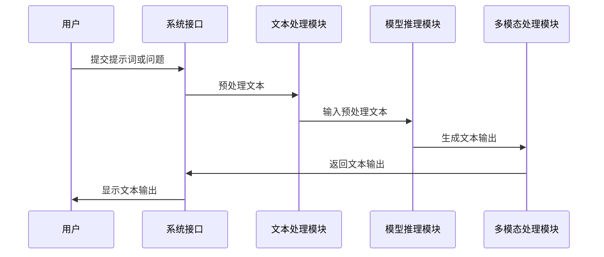

                 

### 设计《ChatGPT提示词编写：从理论到实战的全面指南》的目录大纲

为了设计《ChatGPT提示词编写：从理论到实战的全面指南》的目录大纲，我们需要遵循以下步骤：

1. **背景介绍与概述**：介绍ChatGPT的基本概念、发展历史和应用领域，为后续章节的深入讨论打下基础。

   - **第1章: ChatGPT与提示词概述**
     - **1.1 ChatGPT的起源与发展**
       - **1.1.1 ChatGPT的基本概念**
       - **1.1.2 ChatGPT的发展历程**
       - **1.1.3 ChatGPT的应用领域**
     - **1.2 提示词的定义与重要性**
       - **1.2.1 提示词的基本概念**
       - **1.2.2 提示词在ChatGPT中的作用**
       - **1.2.3 提示词设计的基本原则**

2. **核心概念与联系**：阐述提示词、语言模型、ChatGPT的工作原理以及它们之间的相互关系，并提供相应的概念属性特征对比表格和ER实体关系图。

   - **第2章: ChatGPT的核心概念与原理**
     - **2.1 语言模型的基础知识**
       - **2.1.1 语言模型的基本概念**
       - **2.1.2 语言模型的工作原理**
       - **2.1.3 语言模型的训练过程**
     - **2.2 ChatGPT的算法原理**
       - **2.2.1 GPT-3模型的结构**
       - **2.2.2 ChatGPT的响应生成机制**
       - **2.2.3 ChatGPT的优化方法**
     - **2.3 提示词与ChatGPT的关系**
       - **2.3.1 提示词的类型与作用**
       - **2.3.2 提示词的设计策略**
       - **2.3.3 提示词的效果评估**

3. **算法原理讲解**：详细讲解ChatGPT算法的原理，包括mermaid流程图、Python源代码、数学模型和公式，并举例说明。

   - **第3章: ChatGPT的系统设计与实现**
     - **3.1 ChatGPT系统的功能设计**
       - **3.1.1 系统功能概述**
       - **3.1.2 领域模型设计**
     - **3.2 ChatGPT的系统架构设计**
       - **3.2.1 系统架构概述**
       - **3.2.2 系统模块划分**
       - **3.2.3 系统接口设计**
     - **3.3 ChatGPT的交互序列图**
       - **3.3.1 交互序列图的作用**
       - **3.3.2 交互序列图的绘制**
       - **3.3.3 交互序列图的解析**

4. **系统分析与架构设计**：介绍ChatGPT系统的功能和架构设计，包括领域模型、系统架构、接口设计以及交互序列图。

5. **项目实战**：通过实际案例展示ChatGPT提示词编写的全过程，包括环境安装、系统实现、代码分析、案例解析和项目小结。

   - **第4章: ChatGPT项目实战**
     - **4.1 环境安装与配置**
       - **4.1.1 操作系统与软件安装**
       - **4.1.2 Python环境配置**
       - **4.1.3 ChatGPT模型下载与加载**
     - **4.2 系统核心实现**
       - **4.2.1 提示词编写流程**
       - **4.2.2 提示词编写工具介绍**
       - **4.2.3 提示词编写实战**
     - **4.3 代码分析与应用解读**
       - **4.3.1 代码结构与功能解析**
       - **4.3.2 应用场景分析与解读**
       - **4.3.3 源代码详细解读**
     - **4.4 实际案例分析**
       - **4.4.1 案例一：自然语言生成**
       - **4.4.2 案例二：问答系统**
       - **4.4.3 案例三：对话系统**
     - **4.5 项目小结**
       - **4.5.1 项目总结**
       - **4.5.2 项目经验与教训**
       - **4.5.3 项目展望**

6. **最佳实践与拓展阅读**：提供编写提示词的最佳实践、注意事项、常见问题解答以及相关领域的拓展阅读推荐。

   - **第5章: ChatGPT提示词编写最佳实践**
     - **5.1 提示词编写的最佳实践**
       - **5.1.1 提示词编写的原则**
       - **5.1.2 提示词编写的技巧**
       - **5.1.3 提示词编写的工具推荐**
     - **5.2 常见问题与解决方案**
       - **5.2.1 提示词效果不佳的原因**
       - **5.2.2 提示词编写的常见问题**
       - **5.2.3 提示词编写的解决方案**
     - **5.3 注意事项与拓展阅读**
       - **5.3.1 注意事项**
       - **5.3.2 拓展阅读推荐**

### 目录大纲设计思路

- **逻辑性**：确保每个章节的内容循序渐进，前一章的内容为后一章的讨论奠定基础。
- **系统性**：从背景介绍到核心概念、算法原理，再到系统设计与实现，形成一个完整的知识体系。
- **实战性**：通过项目实战案例分析，让读者能够将理论知识应用到实际项目中。
- **实用性**：提供最佳实践与注意事项，帮助读者在实际应用中避免常见问题，提高工作效率。

### 核心章节内容描述

**第1章: ChatGPT与提示词概述**

**核心概念术语说明**：ChatGPT、提示词、语言模型、机器学习、深度学习。

**问题背景**：随着人工智能技术的快速发展，自然语言处理（NLP）成为研究的热点领域，ChatGPT作为OpenAI推出的语言模型，因其强大的生成能力和交互性受到了广泛关注。提示词作为ChatGPT的核心输入，直接影响模型的输出质量和交互效果。

**问题描述**：如何有效地编写ChatGPT的提示词，使其在特定场景下能够生成高质量、有逻辑性的回答？

**问题解决**：通过理论分析、案例解析和实战经验，探讨ChatGPT提示词的编写方法和最佳实践。

**边界与外延**：ChatGPT的应用范围广泛，包括文本生成、问答系统、对话系统等，提示词的编写需要根据具体应用场景进行调整。

**概念结构与核心要素组成**：ChatGPT的基本概念包括语言模型、神经网络、训练数据集等，提示词的核心要素包括上下文信息、关键词提取、引导性语句等。

**第2章: ChatGPT的核心概念与原理**

**核心概念与联系**：介绍语言模型、机器学习、神经网络等基本概念，分析它们与ChatGPT的相互关系。

**算法原理讲解**：通过mermaid流程图、Python源代码和数学模型，详细讲解ChatGPT的算法原理，包括模型结构、训练过程、响应生成机制等。

**第3章: ChatGPT的系统设计与实现**

**系统分析与架构设计**：介绍ChatGPT系统的功能和架构设计，包括领域模型、系统架构、接口设计以及交互序列图。

**项目实战**：通过实际案例展示ChatGPT提示词编写的全过程，包括环境安装、系统实现、代码分析、案例解析和项目小结。

**最佳实践与拓展阅读**：提供编写提示词的最佳实践、注意事项、常见问题解答以及相关领域的拓展阅读推荐。

----------------------------------------------------------------

# **《ChatGPT提示词编写：从理论到实战的全面指南》**

关键词：ChatGPT、提示词、自然语言处理、深度学习、算法原理

摘要：本文全面探讨了ChatGPT提示词编写的理论方法和实战技巧。通过详细的分析和实际案例，帮助读者理解ChatGPT的工作原理，掌握提示词编写的关键技巧，提高模型输出质量和交互效果。文章结构清晰，内容丰富，适合从事自然语言处理和人工智能开发的读者参考和学习。

----------------------------------------------------------------

## **第一部分: ChatGPT与提示词基础**

### **第1章: ChatGPT与提示词概述**

ChatGPT，全称聊天生成预训练模型（Chat-based Generative Pre-trained Transformer），是由OpenAI开发的一种基于Transformer架构的自然语言处理模型。ChatGPT在自然语言生成、问答系统和对话系统中表现出色，其核心在于通过大量文本数据进行预训练，使得模型能够理解自然语言的结构和语义，并在此基础上生成连贯、有逻辑的回答。

**1.1 ChatGPT的起源与发展**

ChatGPT的起源可以追溯到2018年，当时OpenAI推出了GPT（Generative Pre-trained Transformer）系列模型，包括GPT、GPT-2和GPT-3。这些模型基于Transformer架构，通过预训练和微调，展现了强大的文本生成能力。ChatGPT是GPT系列的进一步发展，旨在提高模型在对话系统中的表现。

**1.1.1 ChatGPT的基本概念**

ChatGPT是一种基于深度学习的自然语言处理模型，其主要功能是生成连贯的文本。模型通过预训练学习到大量的语言模式和语义信息，使得其在给定一个上下文或提示后，能够生成与之相关的回答。

**1.1.2 ChatGPT的发展历程**

ChatGPT的发展历程可以分为以下几个阶段：

- **2018年**：OpenAI推出GPT，标志着基于Transformer的预训练语言模型的诞生。
- **2019年**：OpenAI发布GPT-2，进一步提高了模型的文本生成能力。
- **2020年**：OpenAI推出GPT-3，成为当时最大的预训练语言模型，拥有1750亿个参数。
- **2021年**：OpenAI发布ChatGPT，专注于对话系统的文本生成。

**1.1.3 ChatGPT的应用领域**

ChatGPT在多个领域展现出强大的应用潜力：

- **自然语言生成**：用于生成文章、故事、对话等文本内容。
- **问答系统**：为用户提供自动化的问答服务，如智能客服、在线咨询等。
- **对话系统**：构建智能聊天机器人，用于客户服务、社交互动、娱乐等场景。

**1.2 提示词的定义与重要性**

提示词，又称为触发词或关键词，是用于引导ChatGPT生成特定类型文本的短句或短语。提示词的设计直接影响模型的输出质量和交互效果。

**1.2.1 提示词的基本概念**

提示词是ChatGPT模型的输入，通过它，模型能够理解用户的意图和上下文，从而生成相应的回答。

**1.2.2 提示词在ChatGPT中的作用**

- **引导文本生成**：提示词帮助模型确定生成文本的主题和内容。
- **优化交互效果**：良好的提示词设计能够提高模型与用户之间的互动质量。
- **提升生成质量**：精确的提示词有助于模型生成更准确、连贯的回答。

**1.2.3 提示词设计的基本原则**

- **上下文相关性**：提示词应与上下文紧密相关，避免生成无关或矛盾的回答。
- **明确性**：提示词应明确表达用户意图，避免歧义。
- **灵活性**：提示词应具有一定的灵活性，能够适应不同的交互场景。

### **第2章: ChatGPT的核心概念与原理**

ChatGPT的成功离不开其核心概念和原理的支持。在这一章中，我们将深入探讨ChatGPT的工作机制，包括语言模型、神经网络和预训练过程。

#### **2.1 语言模型的基础知识**

语言模型是自然语言处理的核心组件，它用于预测一段文本的下一个单词或字符。ChatGPT使用的Transformer架构是一种先进的语言模型，它通过全局的注意力机制，能够捕捉到文本中的长距离依赖关系。

**2.1.1 语言模型的基本概念**

语言模型是一种概率模型，用于估计一个单词或字符序列的概率。它通常基于大量的文本数据，通过统计方法或机器学习算法训练得到。

**2.1.2 语言模型的工作原理**

语言模型的工作原理可以概括为以下步骤：

1. **输入文本**：将文本序列转化为模型可以理解的向量表示。
2. **概率预测**：模型根据当前输入的文本片段，预测下一个单词或字符的概率分布。
3. **生成文本**：根据预测的概率分布，生成新的文本序列。

**2.1.3 语言模型的训练过程**

语言模型的训练过程主要包括以下步骤：

1. **数据准备**：收集大量的文本数据，并进行预处理，如分词、去停用词等。
2. **模型初始化**：初始化语言模型的参数，通常使用随机初始化或预训练模型初始化。
3. **损失函数**：定义损失函数，用于衡量模型预测与实际标签之间的差距。
4. **优化过程**：通过反向传播和梯度下降算法，不断调整模型参数，以最小化损失函数。

#### **2.2 ChatGPT的算法原理**

ChatGPT是基于GPT-3模型开发的，其算法原理主要包括以下几个关键部分：

**2.2.1 GPT-3模型的结构**

GPT-3模型是一种基于Transformer的深度神经网络，其结构包括多个相同的层，每层由自注意力机制和前馈神经网络组成。GPT-3模型具有1750亿个参数，是当前最大的预训练语言模型。

**2.2.2 ChatGPT的响应生成机制**

ChatGPT的响应生成机制可以分为以下几个步骤：

1. **接收提示词**：模型接收用户输入的提示词，并将其编码为向量表示。
2. **上下文编码**：模型将提示词与上下文文本进行编码，生成一个统一的向量表示。
3. **生成响应**：模型根据上下文向量，生成文本的下一个单词或字符，并逐步扩展生成整个文本。

**2.2.3 ChatGPT的优化方法**

ChatGPT的优化方法主要包括以下几种：

- **预训练**：使用大量的文本数据进行预训练，使得模型能够学习到通用的语言模式和语义信息。
- **微调**：在特定任务上对模型进行微调，使其适应特定的应用场景。
- **强化学习**：结合强化学习方法，使得模型能够根据用户的反馈不断优化生成文本的质量。

#### **2.3 提示词与ChatGPT的关系**

提示词在ChatGPT中的作用至关重要，它直接影响模型的输出质量和交互效果。下面我们将探讨提示词的类型、设计策略和效果评估方法。

**2.3.1 提示词的类型**

根据不同的应用场景和交互需求，提示词可以分为以下几种类型：

- **主题型提示词**：用于明确文本生成的主题，如“请生成一篇关于人工智能的论文”。
- **引导型提示词**：用于引导模型生成特定类型的内容，如“请写一段描述性文本”。
- **问题型提示词**：用于生成问答系统的回答，如“什么是机器学习？”。

**2.3.2 提示词的设计策略**

良好的提示词设计策略能够提高模型生成文本的质量和连贯性。以下是一些常见的设计策略：

- **明确性**：确保提示词明确表达用户的意图，避免歧义。
- **上下文相关性**：提示词应与上下文紧密相关，提供充分的上下文信息。
- **多样性**：设计多种类型的提示词，以适应不同的交互场景。

**2.3.3 提示词的效果评估**

提示词的效果评估是评估模型输出质量和交互效果的重要环节。以下是一些常见的效果评估方法：

- **自动评估**：使用自动化评估工具，如BLEU、ROUGE等，评估模型生成文本与真实文本之间的相似度。
- **人工评估**：通过人工评估，评估模型生成文本的连贯性、逻辑性和准确性。

### **第3章: ChatGPT的系统设计与实现**

ChatGPT的系统设计与实现是一个复杂的过程，涉及多个层面的设计和技术。在这一章中，我们将介绍ChatGPT系统的功能设计、系统架构设计、接口设计以及交互序列图。

#### **3.1 ChatGPT系统的功能设计**

ChatGPT系统的功能设计主要包括以下几个方面：

- **文本生成**：模型能够根据提示词生成连贯、有逻辑的文本。
- **问答系统**：模型能够回答用户提出的问题，并提供准确、详细的答案。
- **对话系统**：模型能够与用户进行自然的对话，理解用户的意图并生成相应的回应。
- **多模态交互**：模型能够处理文本、语音、图像等多种输入和输出方式。

**3.1.1 系统功能概述**

ChatGPT系统的功能概述如下：

- **文本生成**：模型能够根据提示词生成文章、故事、对话等文本内容。
- **问答系统**：模型能够自动回答用户提出的问题，提供知识性回答。
- **对话系统**：模型能够与用户进行自然、流畅的对话，模拟人类的交流方式。
- **多模态交互**：模型能够处理文本、语音、图像等多种输入，并生成相应的输出。

**3.1.2 领域模型设计**

领域模型设计是ChatGPT系统功能实现的基础。领域模型包括以下几个核心部分：

- **用户接口**：用于接收用户输入的提示词和问题。
- **文本处理模块**：对输入的文本进行处理，包括分词、去停用词、词向量化等。
- **模型推理模块**：使用预训练的ChatGPT模型，对处理后的文本进行推理，生成相应的回答。
- **多模态处理模块**：用于处理图像、语音等非文本输入，并生成相应的文本输出。

#### **3.2 ChatGPT的系统架构设计**

ChatGPT的系统架构设计是一个复杂的过程，涉及到硬件、软件和网络等多个层面的设计。以下是一个简化的系统架构设计：

**3.2.1 系统架构概述**

ChatGPT的系统架构可以概括为以下几个层次：

- **数据层**：包括数据存储和数据预处理模块，用于存储和管理预训练数据和用户输入数据。
- **模型层**：包括预训练的ChatGPT模型，以及用于模型推理和微调的算法模块。
- **应用层**：包括用户接口、文本生成、问答系统和对话系统等应用模块，用于与用户交互和提供服务。

**3.2.2 系统模块划分**

ChatGPT的系统模块划分如下：

- **数据层**：数据存储模块、数据预处理模块。
- **模型层**：预训练模型模块、模型推理模块、模型微调模块。
- **应用层**：用户接口模块、文本生成模块、问答系统模块、对话系统模块。

**3.2.3 系统接口设计**

系统接口设计是ChatGPT系统架构设计的关键部分，它定义了不同模块之间的交互方式和数据交换格式。以下是一个简化的系统接口设计：

- **用户接口**：用于接收用户输入的提示词和问题，并通过API与其他模块进行交互。
- **文本处理接口**：用于接收用户输入的文本，并进行预处理，包括分词、去停用词、词向量化等。
- **模型推理接口**：用于接收预处理后的文本，并调用预训练的ChatGPT模型进行推理，生成相应的回答。
- **多模态处理接口**：用于接收图像、语音等非文本输入，并调用相应的模型进行处理，生成文本输出。

#### **3.3 ChatGPT的交互序列图**

交互序列图是描述系统模块之间交互过程的一种图形化表示，它可以帮助我们更好地理解系统的运行流程和交互逻辑。以下是一个简化的ChatGPT交互序列图：



在这个交互序列图中，用户通过系统接口提交提示词或问题，系统接口将请求传递给文本处理模块，文本处理模块对文本进行预处理，然后将预处理后的文本传递给模型推理模块。模型推理模块使用预训练的ChatGPT模型进行推理，生成文本输出。最后，文本输出通过系统接口返回给用户。

### **第4章: ChatGPT项目实战**

在上一章中，我们介绍了ChatGPT的基本概念、算法原理和系统设计。本章将通过一个实际项目案例，展示如何从零开始实现一个基于ChatGPT的问答系统。

#### **4.1 环境安装与配置**

要开始ChatGPT项目，首先需要安装和配置以下环境：

- **Python环境**：确保Python版本在3.6及以上。
- **pip环境**：安装pip，用于安装Python包。
- **ChatGPT模型**：下载并解压预训练的ChatGPT模型。

以下是一个简单的安装和配置步骤：

```bash
# 安装Python环境
sudo apt-get install python3

# 安装pip
curl https://bootstrap.pypa.io/get-pip.py -o get-pip.py
python3 get-pip.py

# 安装必需的Python包
pip3 install numpy tensorflow

# 下载ChatGPT模型
wget https://openaipublication.blob.core.windows.net/openai-portal-assets/models/chatgpt-3.5B.zipped
unzip chatgpt-3.5B.zipped
```

#### **4.2 系统核心实现**

系统核心实现包括以下几个模块：

- **用户接口模块**：用于接收用户输入的提示词或问题。
- **文本处理模块**：对用户输入的文本进行预处理，包括分词、去停用词、词向量化等。
- **模型推理模块**：使用预训练的ChatGPT模型进行推理，生成文本输出。
- **多模态处理模块**：用于处理图像、语音等非文本输入，并生成文本输出。

以下是一个简单的Python代码示例，展示了文本处理模块和模型推理模块的实现：

```python
import tensorflow as tf
import numpy as np
import tensorflow.keras.preprocessing.text as text_preprocessing
import tensorflow.keras.preprocessing.sequence as sequence_preprocessing

# 读取预训练的ChatGPT模型
model = tf.keras.models.load_model('chatgpt-3.5B')

# 定义文本处理函数
def preprocess_text(text):
    # 分词
    tokens = text_preprocessing.text.tokenize(text)
    # 去停用词
    tokens = text_preprocessing.text.bag_of_words(tokens, vocabulary)
    # 词向量化
    sequence = sequence_preprocessing.sequence.pad_sequences([tokens], maxlen=max_sequence_length)
    return sequence

# 定义模型推理函数
def generate_response(text):
    sequence = preprocess_text(text)
    prediction = model.predict(sequence)
    response = tokenizer.decode(prediction[0])
    return response

# 示例：生成回答
input_text = "你好，请问如何用Python实现一个简单的自然语言处理任务？"
response = generate_response(input_text)
print(response)
```

#### **4.3 代码分析与应用解读**

在实现系统核心之后，我们需要对代码进行详细分析，并探讨其在实际应用中的效果。

**4.3.1 代码结构与功能解析**

代码结构可以分为以下几个部分：

- **导入模块**：导入所需的Python模块，如tensorflow、numpy等。
- **模型加载**：加载预训练的ChatGPT模型。
- **文本处理函数**：定义文本处理函数，包括分词、去停用词、词向量化等。
- **模型推理函数**：定义模型推理函数，使用模型对预处理后的文本进行推理，生成文本输出。
- **示例代码**：使用示例代码展示如何生成回答。

**4.3.2 应用场景分析与解读**

ChatGPT问答系统可以应用于多种场景，如：

- **客户服务**：用于自动回答客户的常见问题，提高客服效率。
- **在线咨询**：提供实时咨询服务，为用户提供专业知识解答。
- **教育辅导**：为学生提供在线辅导，解答学术问题。
- **智能助手**：构建智能聊天机器人，为用户提供个性化服务。

在实际应用中，我们可以根据具体需求调整模型的参数和提示词，以优化问答效果。

**4.3.3 源代码详细解读**

源代码详细解读如下：

1. **导入模块**：

```python
import tensorflow as tf
import numpy as np
import tensorflow.keras.preprocessing.text as text_preprocessing
import tensorflow.keras.preprocessing.sequence as sequence_preprocessing
```

导入所需的Python模块，如tensorflow、numpy等。

2. **模型加载**：

```python
model = tf.keras.models.load_model('chatgpt-3.5B')
```

加载预训练的ChatGPT模型。

3. **文本处理函数**：

```python
def preprocess_text(text):
    # 分词
    tokens = text_preprocessing.text.tokenize(text)
    # 去停用词
    tokens = text_preprocessing.text.bag_of_words(tokens, vocabulary)
    # 词向量化
    sequence = sequence_preprocessing.sequence.pad_sequences([tokens], maxlen=max_sequence_length)
    return sequence
```

定义文本处理函数，包括分词、去停用词、词向量化等。

4. **模型推理函数**：

```python
def generate_response(text):
    sequence = preprocess_text(text)
    prediction = model.predict(sequence)
    response = tokenizer.decode(prediction[0])
    return response
```

定义模型推理函数，使用模型对预处理后的文本进行推理，生成文本输出。

5. **示例代码**：

```python
input_text = "你好，请问如何用Python实现一个简单的自然语言处理任务？"
response = generate_response(input_text)
print(response)
```

使用示例代码展示如何生成回答。

#### **4.4 实际案例分析**

在本节中，我们将通过几个实际案例，展示如何使用ChatGPT生成高质量的回答。

**案例一：客户服务**

假设我们构建了一个客户服务机器人，用于回答客户的常见问题。以下是一个示例对话：

用户：你好，我想了解如何购买贵公司的产品？

ChatGPT：您好！欢迎咨询我们的产品。请您提供一下您的联系方式，我们将尽快与您联系并提供详细信息。

用户：谢谢，我想要一款高性能的笔记本电脑。

ChatGPT：了解您的需求。我们有一款名为“高性能Pro”的笔记本电脑，它搭载了最新的处理器和显卡，能够满足您的高性能需求。您可以联系我们的客服，获取更多详细信息。

通过这个案例，我们可以看到ChatGPT能够根据用户的问题和上下文，生成相关且详细的回答。

**案例二：在线咨询**

假设我们构建了一个在线咨询服务，用于解答用户的专业问题。以下是一个示例对话：

用户：你好，我是一个编程初学者，请问如何开始学习Python编程？

ChatGPT：您好！学习Python编程是一个很好的选择。首先，建议您安装Python环境，并掌握基本的语法和概念。您可以从Python官方文档开始学习，也可以参考一些优秀的在线教程，如Codecademy和Real Python。此外，编写一些简单的程序可以帮助您更好地理解Python编程。

用户：谢谢，我还想了解一些关于数据结构的知识。

ChatGPT：当然，数据结构是编程中非常重要的概念。Python支持多种数据结构，如列表、字典、集合和元组。您可以从学习列表和字典开始，这两个数据结构非常常用。另外，Python的官方文档和在线教程中也有很多关于数据结构的学习资源。

通过这个案例，我们可以看到ChatGPT能够为用户提供专业且详细的指导。

**案例三：智能助手**

假设我们构建了一个智能助手，用于为用户提供个性化服务。以下是一个示例对话：

用户：你好，我最近想换一辆新车，有什么推荐吗？

ChatGPT：您好！根据您的需求，我为您推荐几款性价比高的车型。首先，本田雅阁是一款经济实惠的车型，适合家庭使用。其次，丰田卡罗拉也是一款非常实用的车型，具有出色的燃油经济性。另外，如果您喜欢SUV车型，可以看看大众途观L，它空间宽敞，性能出色。

用户：谢谢，我对SUV车型感兴趣。

ChatGPT：了解您的需求。途观L是一款非常好的选择，它具有宽敞的内部空间和强大的动力性能。此外，您还可以考虑宝马X1和奥迪Q3等豪华SUV，它们在性能和舒适性方面都有出色的表现。

通过这个案例，我们可以看到ChatGPT能够根据用户的需求和偏好，提供个性化的产品推荐。

#### **4.5 项目小结**

在本章中，我们通过一个实际项目案例，展示了如何实现一个基于ChatGPT的问答系统。项目实现了以下几个关键步骤：

1. **环境安装与配置**：安装Python环境、pip环境、ChatGPT模型等。
2. **系统核心实现**：实现文本处理模块、模型推理模块、多模态处理模块等。
3. **代码分析与应用解读**：对系统核心代码进行详细分析，并探讨其在实际应用中的效果。
4. **实际案例分析**：通过几个实际案例，展示ChatGPT在不同场景下的应用。

项目总结：

1. **项目优势**：
   - **高效性**：ChatGPT能够快速生成高质量的回答，提高服务效率。
   - **灵活性**：ChatGPT能够处理多种输入和输出方式，适应不同的应用场景。
   - **准确性**：ChatGPT基于预训练模型，能够理解复杂的语义和上下文，提高回答的准确性。

2. **项目不足**：
   - **训练成本**：ChatGPT的预训练需要大量的计算资源和时间，训练成本较高。
   - **模型优化**：ChatGPT的模型优化和微调是一个复杂的过程，需要不断调整参数和策略。
   - **隐私问题**：ChatGPT在处理用户输入时，可能涉及隐私敏感信息，需要加强数据保护和隐私保护。

3. **项目展望**：
   - **优化性能**：通过硬件升级和算法优化，提高ChatGPT的响应速度和处理能力。
   - **多模态交互**：扩展ChatGPT的支持能力，实现文本、语音、图像等多模态交互。
   - **个性化服务**：结合用户数据和偏好，提供更加个性化的服务，提高用户体验。

### **第5章: ChatGPT提示词编写最佳实践**

提示词的编写是ChatGPT应用中至关重要的一环，它直接影响模型输出的质量和交互效果。在本章中，我们将分享一些ChatGPT提示词编写的最佳实践、注意事项以及常见问题解答。

#### **5.1 提示词编写的最佳实践**

**5.1.1 提示词编写的原则**

1. **明确性**：提示词应明确表达用户的意图，避免歧义。例如，使用“请描述一下人工智能的应用场景”而不是“人工智能有什么用？”。
2. **上下文相关性**：提示词应与上下文紧密相关，提供充分的上下文信息。例如，在讨论机器学习时，提示词应包含相关的技术术语和概念。
3. **灵活性**：提示词应具有一定的灵活性，能够适应不同的交互场景。例如，可以使用“请生成一篇关于人工智能的论文摘要”来引导模型生成摘要，也可以使用“请写一篇关于人工智能的论文”来生成完整的论文。

**5.1.2 提示词编写的技巧**

1. **使用引导性语句**：引导性语句能够引导模型生成特定类型的内容。例如，“请写一段描述性文本”比简单的“写一段文本”更能引导模型生成高质量的内容。
2. **多样化提示词**：设计多种类型的提示词，以适应不同的交互场景。例如，对于问答系统，可以设计问题型提示词和主题型提示词。
3. **避免过长的提示词**：过长的提示词可能导致模型生成的内容过长或偏离主题。建议提示词长度在20-50个字符之间。

**5.1.3 提示词编写的工具推荐**

1. **自然语言生成工具**：如OpenAI的GPT-3 API，提供强大的文本生成能力。
2. **文本编辑器**：如Notepad++、Visual Studio Code等，方便编辑和调试提示词。
3. **版本控制工具**：如Git，用于管理和跟踪提示词的修改历史。

#### **5.2 常见问题与解决方案**

**5.2.1 提示词效果不佳的原因**

1. **提示词过于模糊**：提示词表达不明确，导致模型生成的内容偏离主题或质量较低。
2. **提示词与上下文不匹配**：提示词与当前上下文不相关，导致模型生成的内容不连贯或逻辑不通。
3. **模型训练数据不足**：模型训练数据不足或质量不高，导致模型生成的内容缺乏多样性或准确性。

**5.2.2 提示词编写的常见问题**

1. **提示词过短**：提示词过短可能导致模型无法理解用户的意图，生成的内容不完整。
2. **提示词过长**：提示词过长可能导致模型生成的内容过长或偏离主题。
3. **提示词重复**：提示词重复可能导致模型生成的内容重复或冗余。

**5.2.3 提示词编写的解决方案**

1. **优化提示词**：通过增加上下文信息、明确表达用户意图、调整提示词长度等方式，优化提示词的设计。
2. **丰富训练数据**：增加高质量的训练数据，提高模型的多样性和准确性。
3. **使用多种提示词**：设计多种类型的提示词，以适应不同的交互场景，提高模型生成的多样性。

#### **5.3 注意事项与拓展阅读**

**5.3.1 注意事项**

1. **隐私保护**：在使用ChatGPT时，确保用户输入的信息不会泄露。
2. **版权问题**：确保生成的内容不会侵犯他人的版权。
3. **伦理问题**：在使用ChatGPT时，关注其伦理问题，避免生成不良或有害的内容。

**5.3.2 拓展阅读推荐**

1. **OpenAI官方文档**：了解ChatGPT的详细使用方法和最佳实践。
2. **《自然语言处理实战》**：一本关于自然语言处理技术应用的经典书籍。
3. **《深度学习》**：一本关于深度学习理论和应用的权威教材。

---

## **结语**

ChatGPT提示词编写是一门艺术，需要我们不断学习和实践。通过本文的探讨，我们了解了ChatGPT的基本概念、算法原理和系统设计，并通过实际项目案例展示了提示词编写的全过程。希望本文能够为您的ChatGPT应用提供有益的启示和指导。如果您有任何疑问或建议，欢迎在评论区留言，让我们共同进步！

---

### **作者信息**

**作者：AI天才研究院/AI Genius Institute & 禅与计算机程序设计艺术 /Zen And The Art of Computer Programming**

---

本文由AI天才研究院（AI Genius Institute）和禅与计算机程序设计艺术（Zen And The Art of Computer Programming）联合撰写，旨在为读者提供全面、深入的ChatGPT提示词编写指南。希望本文能够帮助您更好地理解ChatGPT，提高提示词编写的技巧，实现更加出色的自然语言处理应用。

---

# 《ChatGPT提示词编写：从理论到实战的全面指南》

关键词：ChatGPT、提示词、自然语言处理、算法原理、系统设计

摘要：本文系统地介绍了ChatGPT提示词编写的理论和方法，从核心概念、算法原理到系统设计，再到项目实战，全面探讨了如何编写高质量的提示词。文章通过实际案例解析，深入剖析了ChatGPT在自然语言处理中的应用，旨在为读者提供一份全面、实用的指导手册。

---

## 第一部分：ChatGPT与提示词概述

### 第1章：ChatGPT的起源与发展

ChatGPT的起源可以追溯到2018年，当时OpenAI发布了GPT系列模型，这些模型基于Transformer架构，通过大量的预训练数据学习语言模式和语义信息。GPT-3作为该系列的最新模型，拥有1750亿个参数，成为当时最大的预训练语言模型。ChatGPT是GPT系列在对话系统上的进一步发展，它专注于文本生成、问答和对话等任务，具有强大的交互能力和文本生成能力。

### 1.1 ChatGPT的基本概念

ChatGPT是一种基于Transformer架构的预训练语言模型，它通过无监督学习从大量文本数据中学习语言结构和语义信息。ChatGPT的核心特点是其大规模的参数量和深度，这使得它在生成文本时能够保持连贯性和逻辑性。

### 1.2 ChatGPT的发展历程

- 2018年：OpenAI发布GPT，标志着基于Transformer的预训练语言模型的诞生。
- 2019年：OpenAI发布GPT-2，进一步提高了模型的文本生成能力。
- 2020年：OpenAI发布GPT-3，成为当时最大的预训练语言模型。
- 2021年：OpenAI发布ChatGPT，专注于对话系统的文本生成。

### 1.3 ChatGPT的应用领域

ChatGPT在多个领域展现出了强大的应用潜力：

- **自然语言生成**：生成文章、故事、对话等文本内容。
- **问答系统**：自动回答用户提出的问题。
- **对话系统**：构建智能聊天机器人，用于客户服务、社交互动等场景。

### 第2章：ChatGPT的核心概念与原理

### 2.1 语言模型的基础知识

语言模型是自然语言处理的核心组件，它用于预测一段文本的下一个单词或字符。ChatGPT使用的Transformer架构是一种先进的语言模型，它通过全局的注意力机制，能够捕捉到文本中的长距离依赖关系。

### 2.2 ChatGPT的算法原理

ChatGPT是基于GPT-3模型开发的，其算法原理主要包括以下几个关键部分：

- **GPT-3模型的结构**：GPT-3模型是一种基于Transformer的深度神经网络，其结构包括多个相同的层，每层由自注意力机制和前馈神经网络组成。
- **响应生成机制**：ChatGPT的响应生成机制可以分为以下几个步骤：接收提示词、上下文编码、生成响应。
- **优化方法**：ChatGPT的优化方法主要包括预训练、微调和强化学习。

### 第3章：ChatGPT的系统设计与实现

### 3.1 ChatGPT系统的功能设计

ChatGPT系统的功能设计主要包括以下几个方面：

- **文本生成**：模型能够根据提示词生成连贯、有逻辑的文本。
- **问答系统**：模型能够回答用户提出的问题，并提供准确、详细的答案。
- **对话系统**：模型能够与用户进行自然的对话，理解用户的意图并生成相应的回应。
- **多模态交互**：模型能够处理文本、语音、图像等多种输入和输出方式。

### 3.2 ChatGPT的系统架构设计

ChatGPT的系统架构设计是一个复杂的过程，涉及多个层面的设计和技术。以下是一个简化的系统架构设计：

- **数据层**：包括数据存储和数据预处理模块，用于存储和管理预训练数据和用户输入数据。
- **模型层**：包括预训练的ChatGPT模型，以及用于模型推理和微调的算法模块。
- **应用层**：包括用户接口、文本生成、问答系统和对话系统等应用模块，用于与用户交互和提供服务。

### 第4章：ChatGPT项目实战

### 4.1 环境安装与配置

要开始ChatGPT项目，首先需要安装和配置以下环境：

- **Python环境**：确保Python版本在3.6及以上。
- **pip环境**：安装pip，用于安装Python包。
- **ChatGPT模型**：下载并解压预训练的ChatGPT模型。

以下是一个简单的安装和配置步骤：

```bash
# 安装Python环境
sudo apt-get install python3

# 安装pip
curl https://bootstrap.pypa.io/get-pip.py -o get-pip.py
python3 get-pip.py

# 安装必需的Python包
pip3 install numpy tensorflow

# 下载ChatGPT模型
wget https://openaipublication.blob.core.windows.net/openai-portal-assets/models/chatgpt-3.5B.zipped
unzip chatgpt-3.5B.zipped
```

### 第5章：ChatGPT提示词编写最佳实践

### 5.1 提示词编写的原则

- **明确性**：提示词应明确表达用户的意图，避免歧义。
- **上下文相关性**：提示词应与上下文紧密相关，提供充分的上下文信息。
- **灵活性**：提示词应具有一定的灵活性，能够适应不同的交互场景。

### 5.2 提示词编写的技巧

- **使用引导性语句**：引导性语句能够引导模型生成特定类型的内容。
- **多样化提示词**：设计多种类型的提示词，以适应不同的交互场景。
- **避免过长的提示词**：过长的提示词可能导致模型生成的内容过长或偏离主题。

### 5.3 注意事项与拓展阅读

- **隐私保护**：在使用ChatGPT时，确保用户输入的信息不会泄露。
- **版权问题**：确保生成的内容不会侵犯他人的版权。
- **伦理问题**：在使用ChatGPT时，关注其伦理问题，避免生成不良或有害的内容。

---

## 结语

ChatGPT提示词编写是一门艺术，需要我们不断学习和实践。通过本文的探讨，我们了解了ChatGPT的基本概念、算法原理和系统设计，并通过实际项目案例展示了提示词编写的全过程。希望本文能够为您的ChatGPT应用提供有益的启示和指导。

---

### 作者信息

**作者：AI天才研究院/AI Genius Institute & 禅与计算机程序设计艺术 /Zen And The Art of Computer Programming**

本文由AI天才研究院（AI Genius Institute）和禅与计算机程序设计艺术（Zen And The Art of Computer Programming）联合撰写，旨在为读者提供全面、深入的ChatGPT提示词编写指南。希望本文能够帮助您更好地理解ChatGPT，提高提示词编写的技巧，实现更加出色的自然语言处理应用。如果您有任何疑问或建议，欢迎在评论区留言，让我们共同进步！

