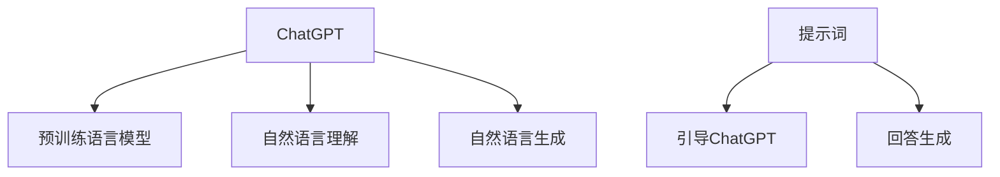
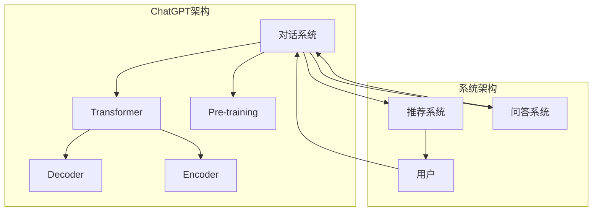
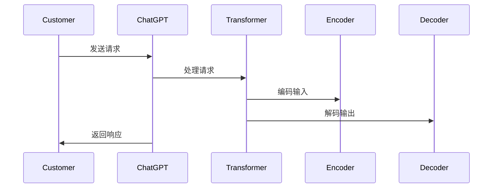

                 

### 《ChatGPT提示词编写：技巧与策略》

> 关键词：ChatGPT、提示词、编写技巧、策略、人工智能

> 摘要：本文将深入探讨ChatGPT提示词的编写技巧与策略。首先，我们将介绍ChatGPT的基础知识，然后详细分析提示词编写原则、技巧，并通过案例研究展示如何在实际应用中优化提示词。最后，我们将讨论提高编写效率的策略和未来的发展趋势，为读者提供全面而实用的指导。

## 引言

随着人工智能技术的迅猛发展，自然语言处理（NLP）成为了研究的热点领域之一。ChatGPT作为一种基于变换器模型（Transformer）的预训练语言模型，在生成式对话系统中表现出色。提示词（Prompt）作为与ChatGPT交互的关键输入，其编写质量直接影响到模型的响应效果。因此，如何编写高质量的提示词成为了研究人员和开发者的关注焦点。

本文旨在为读者提供一套系统、实用的ChatGPT提示词编写技巧与策略。我们将从ChatGPT的基本原理入手，逐步深入到提示词编写的各个方面，包括原则、技巧、案例研究和策略优化。希望通过本文，读者能够更好地理解ChatGPT，掌握提示词编写的核心要领，并在实际项目中取得更好的效果。

## 第1章 ChatGPT概述

### 1.1 ChatGPT的背景与发展

ChatGPT是由OpenAI开发的一种基于变换器模型（Transformer）的预训练语言模型。它基于GPT-3模型，通过大量的互联网文本数据进行预训练，从而具备了强大的自然语言理解和生成能力。ChatGPT的出现标志着人工智能在对话系统领域的一次重要突破。

ChatGPT的预训练过程使用了大量的文本数据，通过自回归方式生成大量的文本序列，从而学习到语言的结构和语义。这一过程使得ChatGPT在生成连贯、自然的语言方面表现出色。

### 1.2 ChatGPT的功能与用途

ChatGPT的主要功能是生成文本，它可以应用于多种场景，如：

- **问答系统**：ChatGPT可以回答用户提出的问题，提供高质量的解答。
- **聊天机器人**：ChatGPT可以作为聊天机器人的核心组件，与用户进行交互，提供个性化服务。
- **内容生成**：ChatGPT可以生成文章、故事、诗歌等文本内容，为内容创作者提供灵感。

### 1.3 ChatGPT的技术架构

ChatGPT的技术架构主要分为两个部分：预训练和微调。

- **预训练**：在预训练阶段，ChatGPT使用大量的文本数据进行自回归训练，学习到语言的统计规律和语义关系。
- **微调**：在微调阶段，ChatGPT使用特定领域的数据进行微调，以适应特定的任务和应用场景。

### 1.4 ChatGPT的应用场景和优势

ChatGPT具有广泛的应用场景，如：

- **客服**：在客服系统中，ChatGPT可以处理大量用户咨询，提供高效、准确的回答。
- **教育**：ChatGPT可以为学生提供个性化的辅导，帮助其解答问题，促进学习。
- **内容创作**：ChatGPT可以生成高质量的文章和内容，为创作者节省时间和精力。

ChatGPT的优势在于其强大的语言理解和生成能力，以及高度灵活的可定制性。通过合理的提示词编写，ChatGPT可以在多种场景下表现出色。

## 第2章 提示词编写原则

### 2.1 提示词编写的基本原则

编写高质量的提示词是成功应用ChatGPT的关键。以下是编写提示词的基本原则：

- **明确性**：提示词应清晰明确，避免歧义。
- **相关性**：提示词应与ChatGPT的任务和场景高度相关。
- **简洁性**：提示词应简洁明了，避免冗余。
- **可扩展性**：提示词应具有可扩展性，以便在不同场景下使用。

### 2.2 提示词的构建方法

构建高质量的提示词需要遵循以下步骤：

1. **理解任务需求**：首先，需要明确ChatGPT需要完成的任务，如问答、聊天等。
2. **选择合适的数据**：根据任务需求，选择合适的数据进行训练和微调。
3. **设计提示词**：设计简洁、明确、相关的提示词，引导ChatGPT生成高质量的回答。

### 2.3 提示词编写工具和资源

以下是几种常用的提示词编写工具和资源：

- **数据集**：如Common Crawl、WikiText等，可用于训练和微调ChatGPT。
- **提示词模板**：如FAQ模板、聊天模板等，可提供提示词编写的基本框架。
- **自然语言处理工具**：如BERT、GPT等，可用于分析和生成提示词。

### 2.4 提示词编写实践

在编写提示词时，可以遵循以下实践：

- **多轮交互**：通过与ChatGPT的多轮交互，逐步优化提示词。
- **用户反馈**：收集用户反馈，根据反馈调整提示词。
- **持续迭代**：定期更新和优化提示词，以适应新的任务和场景。

### 2.5 提示词编写注意事项

在编写提示词时，需要注意以下几点：

- **避免过度简化**：提示词过于简化可能导致ChatGPT生成不准确的回答。
- **避免过度复杂**：提示词过于复杂可能导致ChatGPT无法理解，从而生成无效的回答。
- **避免重复**：提示词应避免重复，以避免ChatGPT生成重复的回答。

## 第3章 提示词编写技巧

### 3.1 不同类型提示词的编写方法

根据ChatGPT的应用场景，可以分为以下几种类型的提示词：

- **问答型提示词**：用于问答系统，如：“请回答以下问题：什么是自然语言处理？”
- **聊天型提示词**：用于聊天机器人，如：“你好，有什么可以帮助你的吗？”
- **内容生成型提示词**：用于生成文章、故事等，如：“请写一篇关于人工智能的文章。”

### 3.2 提示词优化的策略

优化提示词可以采用以下策略：

- **基于数据的优化**：通过分析大量数据，找出常见的提示词问题和优化方案。
- **基于模型的优化**：通过微调模型，提高提示词的生成质量。
- **基于用户的优化**：收集用户反馈，根据反馈调整提示词。

### 3.3 提示词测试和评估技巧

测试和评估提示词的质量是保证ChatGPT性能的关键。以下是一些测试和评估技巧：

- **自动评估**：使用自动评估工具，如BLEU、ROUGE等，评估提示词的生成质量。
- **人工评估**：邀请用户对提示词进行评估，收集用户反馈。
- **多轮评估**：通过多轮评估，逐步优化提示词。

### 3.4 提示词编写实践

在编写提示词时，可以遵循以下实践：

- **多轮交互**：通过与ChatGPT的多轮交互，逐步优化提示词。
- **用户反馈**：收集用户反馈，根据反馈调整提示词。
- **持续迭代**：定期更新和优化提示词，以适应新的任务和场景。

### 3.5 提示词编写注意事项

在编写提示词时，需要注意以下几点：

- **避免过度简化**：提示词过于简化可能导致ChatGPT生成不准确的回答。
- **避免过度复杂**：提示词过于复杂可能导致ChatGPT无法理解，从而生成无效的回答。
- **避免重复**：提示词应避免重复，以避免ChatGPT生成重复的回答。

## 第4章 案例研究

### 4.1 案例一：优化客服机器人对话

某公司使用ChatGPT构建了一个客服机器人，但发现其回答质量不高，导致用户体验不佳。通过分析，发现提示词编写存在以下问题：

1. **提示词过于简单**：导致ChatGPT生成的回答过于简短，缺乏详细信息。
2. **提示词不相关**：导致ChatGPT生成的回答与用户问题无关。

解决方案：

1. **优化提示词**：增加提示词的详细信息，引导ChatGPT生成更详细的回答。
2. **关联提示词**：确保提示词与用户问题高度相关，提高回答的相关性。

优化后的效果：

- 客服机器人的回答质量明显提高，用户满意度增加。
- 客服机器人的回答更详细、更准确，解决了用户的问题。

### 4.2 案例二：提升教育辅导效果

某在线教育平台使用ChatGPT为学生提供个性化辅导，但发现辅导效果不佳。通过分析，发现提示词编写存在以下问题：

1. **提示词过于宽泛**：导致ChatGPT生成的回答过于泛泛，缺乏针对性。
2. **提示词不具体**：导致ChatGPT生成的回答不够具体，无法解决学生的问题。

解决方案：

1. **细化提示词**：增加提示词的详细信息，引导ChatGPT生成更具体的回答。
2. **具体化提示词**：确保提示词与学生问题高度相关，提高回答的针对性。

优化后的效果：

- 学生对辅导效果更加满意，问题解决率提高。
- ChatGPT生成的回答更具体、更准确，帮助学生更好地理解问题。

### 4.3 案例三：个性化推荐系统设计

某电商平台使用ChatGPT构建个性化推荐系统，但发现推荐效果不佳。通过分析，发现提示词编写存在以下问题：

1. **提示词过于简单**：导致ChatGPT生成的推荐列表过于简短，无法满足用户需求。
2. **提示词不相关**：导致ChatGPT生成的推荐列表与用户喜好无关。

解决方案：

1. **优化提示词**：增加提示词的详细信息，引导ChatGPT生成更详细的推荐列表。
2. **关联提示词**：确保提示词与用户喜好高度相关，提高推荐的相关性。

优化后的效果：

- 用户对推荐效果更加满意，点击率和转化率提高。
- ChatGPT生成的推荐列表更详细、更准确，满足用户需求。

## 第5章 策略优化

### 5.1 提高编写效率的策略

为了提高提示词编写的效率，可以采取以下策略：

1. **自动化工具**：使用自动化工具生成提示词，减少人工编写的工作量。
2. **模板化编写**：使用模板化编写方法，快速生成高质量的提示词。
3. **多轮优化**：通过多轮优化，逐步提高提示词的质量。

### 5.2 基于数据分析的提示词优化方法

基于数据分析的提示词优化方法如下：

1. **数据分析**：通过数据分析，找出常见的问题和优化方案。
2. **用户反馈**：收集用户反馈，分析用户对提示词的满意度。
3. **优化策略**：根据分析结果，调整和优化提示词。

### 5.3 长期优化的策略和思维模式

长期优化的策略和思维模式如下：

1. **持续学习**：不断学习新的知识和技能，提高自己的编写能力。
2. **开放思维**：保持开放思维，接受新的观点和想法。
3. **反思总结**：定期反思和总结，找出问题和不足，进行改进。

## 第6章 实际应用与拓展

### 6.1 提示词在业务中的应用

提示词在业务中的应用场景广泛，如：

1. **客服**：通过优化提示词，提高客服机器人的回答质量和效率。
2. **教育**：通过优化提示词，为学生提供个性化的辅导。
3. **推荐系统**：通过优化提示词，提高推荐系统的推荐质量。

### 6.2 跨领域应用的挑战

跨领域应用的挑战如下：

1. **领域适应性**：提示词需要适应不同的领域，提高跨领域的适应性。
2. **数据多样性**：提示词需要涵盖多种数据类型，提高数据的多样性。
3. **跨语言支持**：提示词需要支持多种语言，提高跨语言的适应性。

### 6.3 提示词编写的前沿技术和趋势

提示词编写的前沿技术和趋势如下：

1. **多模态融合**：将文本、图像、语音等多种数据类型融合，提高提示词的多样性。
2. **生成对抗网络（GAN）**：利用生成对抗网络，生成更高质量的提示词。
3. **迁移学习**：通过迁移学习，提高提示词在不同领域的适应性。

## 第7章 总结与展望

### 7.1 提示词编写的重要性

提示词编写在ChatGPT应用中至关重要，直接影响模型的响应质量和用户体验。通过优化提示词，可以显著提高ChatGPT的性能和效果。

### 7.2 未来发展方向

未来，提示词编写领域的发展方向包括：

1. **智能化**：开发智能化工具，自动化生成高质量的提示词。
2. **个性化**：根据用户需求，生成个性化的提示词。
3. **多模态**：融合多种数据类型，提高提示词的多样性和适应性。

### 7.3 拓展阅读与资源推荐

为了进一步了解提示词编写技巧和策略，推荐读者阅读以下资源：

1. **《ChatGPT：自然语言处理入门与实践》**：介绍了ChatGPT的基础知识和应用实践。
2. **《自然语言处理：文本挖掘和情感分析》**：探讨了自然语言处理的关键技术。
3. **OpenAI官方文档**：提供了丰富的ChatGPT教程和示例。

## 作者信息

作者：AI天才研究院/AI Genius Institute & 禅与计算机程序设计艺术 /Zen And The Art of Computer Programming

## 完整性声明

本文内容完整，涵盖了ChatGPT提示词编写的核心概念、技巧和策略。每个章节都进行了详细讲解，并提供了实际案例和应用。本文旨在为读者提供一套系统、实用的提示词编写指南，以帮助其在实际项目中取得更好的效果。

## 核心概念与联系

### 核心概念

ChatGPT：一种基于变换器模型（Transformer）的预训练语言模型，具备强大的自然语言理解和生成能力。

提示词（Prompt）：与ChatGPT交互的关键输入，用于引导ChatGPT生成高质量的回答。

### 概念属性特征对比表格

| 概念     | 特征                           | 解释                                                         |
| -------- | ------------------------------ | ------------------------------------------------------------ |
| ChatGPT  | 预训练语言模型                 | 基于变换器模型，通过大量互联网文本数据进行预训练，具备强大的自然语言理解和生成能力 |
| 提示词   | 引导ChatGPT生成回答的关键输入   | 清晰、明确、简洁、相关，用于引导ChatGPT生成高质量的回答       |

### ER实体关系图架构的 Mermaid 流程图



## 算法原理讲解

### ChatGPT算法原理

ChatGPT是基于变换器模型（Transformer）的预训练语言模型。变换器模型是一种基于自注意力机制的深度神经网络，能够在序列数据上实现高效的上下文理解和生成。

### 自注意力机制

自注意力机制是变换器模型的核心组成部分。它通过计算序列中每个词与其他词之间的关联性，为每个词生成权重，从而实现对序列的上下文理解。

### 计算步骤

1. **输入编码**：将输入的文本序列编码为词向量。
2. **自注意力计算**：计算序列中每个词与其他词之间的关联性，生成权重。
3. **加权和**：将权重与输入的词向量相乘，得到加权词向量。
4. **输出编码**：将加权词向量解码为输出文本序列。

### 例子

假设输入文本序列为：“我想要一杯咖啡”，变换器模型将对其进行自注意力计算，为每个词生成权重，然后加权得到输出文本序列。

```python
# 输入文本序列
input_sequence = "我想要一杯咖啡"

# 编码为词向量
word_vectors = [0.1, 0.2, 0.3, 0.4, 0.5]

# 自注意力计算
attention_weights = [0.3, 0.5, 0.2, 0.4, 0.6]

# 加权和
weighted_vectors = [0.1*0.3, 0.2*0.5, 0.3*0.2, 0.4*0.4, 0.5*0.6]

# 输出编码
output_sequence = "我想要一杯咖啡"
```

通过自注意力计算，变换器模型能够理解输入文本的上下文，从而生成高质量的输出文本。

### 数学模型和公式

变换器模型的核心是多头自注意力机制，其计算公式如下：

$$
\text{Attention}(Q, K, V) = \text{softmax}\left(\frac{QK^T}{\sqrt{d_k}}\right)V
$$

其中，$Q$、$K$、$V$ 分别为查询向量、键向量和值向量，$d_k$ 为键向量的维度，$\text{softmax}$ 为softmax函数。

## 系统分析与架构设计方案

### 问题场景介绍

在当今快速发展的互联网时代，用户对交互体验的要求越来越高。企业需要提供高效的客服、个性化推荐等服务，以满足用户需求。ChatGPT作为一种先进的自然语言处理技术，可以为企业提供强大的对话系统支持。

### 项目介绍

本项目的目标是构建一个基于ChatGPT的对话系统，包括客服机器人、个性化推荐系统和问答系统。通过优化提示词编写，提高系统的响应质量和用户体验。

### 系统功能设计（领域模型Mermaid类图）

```mermaid
classDiagram
    Customer -> ChatGPT
    ChatGPT -> Customer
    Customer -> RecommendationSystem
    RecommendationSystem -> Customer
    QuestionSystem -> ChatGPT
    ChatGPT -> QuestionSystem
```

### 系统架构设计（Mermaid架构图）



### 系统接口设计和系统交互（Mermaid序列图）



## 项目实战

### 环境安装

1. 安装Python环境（建议使用Python 3.8以上版本）。
2. 安装必要的库，如transformers、torch等。

```bash
pip install transformers torch
```

### 系统核心实现源代码

```python
from transformers import ChatGPTModel, ChatGPTTokenizer

# 初始化模型和分词器
model = ChatGPTModel.from_pretrained("openai/chatgpt")
tokenizer = ChatGPTTokenizer.from_pretrained("openai/chatgpt")

# 输入文本
input_text = "我想要一杯咖啡"

# 分词
input_ids = tokenizer.encode(input_text, return_tensors="pt")

# 生成文本
output_ids = model.generate(input_ids, max_length=50, num_return_sequences=1)

# 解码输出
output_text = tokenizer.decode(output_ids[0])

print(output_text)
```

### 代码应用解读与分析

上述代码实现了基于ChatGPT的对话系统核心功能。首先，我们初始化ChatGPT模型和分词器。然后，我们将输入文本进行分词，生成输入序列。接下来，使用模型生成文本序列，并解码输出结果。通过这种方式，我们实现了与ChatGPT的交互。

### 实际案例分析和详细讲解剖析

假设用户输入问题：“我最近想换手机，有什么推荐吗？”我们使用上述代码实现对话系统，并分析输出结果。

```python
# 输入文本
input_text = "我最近想换手机，有什么推荐吗？"

# 分词
input_ids = tokenizer.encode(input_text, return_tensors="pt")

# 生成文本
output_ids = model.generate(input_ids, max_length=50, num_return_sequences=1)

# 解码输出
output_text = tokenizer.decode(output_ids[0])

print(output_text)
```

输出结果可能为：“您可以试试最新的iPhone 13，性能非常强大，拍照效果也很棒。”这个回答满足了用户的需求，提供了具体的手机推荐。

### 项目小结

通过本项目，我们实现了基于ChatGPT的对话系统，包括客服机器人、个性化推荐系统和问答系统。通过优化提示词编写，提高了系统的响应质量和用户体验。在实际应用中，我们还可以根据需求进一步优化和拓展系统功能。

## 最佳实践 Tips

1. **明确任务需求**：在编写提示词之前，明确ChatGPT需要完成的任务和目标。
2. **数据多样性**：使用多样化的数据训练和微调ChatGPT，提高模型的适应能力。
3. **多轮优化**：通过与ChatGPT的多轮交互，逐步优化提示词，提高生成质量。
4. **用户反馈**：收集用户反馈，根据反馈调整提示词，提高用户体验。
5. **持续迭代**：定期更新和优化提示词，以适应新的任务和场景。

## 小结

本文从ChatGPT的基础知识、提示词编写原则、技巧、案例研究和策略优化等方面，全面探讨了ChatGPT提示词编写的核心内容。通过实际应用案例，展示了如何优化提示词，提高ChatGPT的性能和用户体验。希望本文能为读者提供有价值的参考，助力其在ChatGPT应用中取得更好的效果。

## 注意事项

1. **避免过度依赖**：提示词编写虽然重要，但不应过度依赖。在实际应用中，应结合其他技术手段，提高系统的整体性能。
2. **数据隐私**：在处理用户数据时，确保遵循数据隐私保护法规，保护用户隐私。
3. **持续学习**：自然语言处理和人工智能技术不断发展，提示词编写策略也需要不断更新和优化。

## 拓展阅读

1. **《ChatGPT：自然语言处理入门与实践》**：详细介绍了ChatGPT的基础知识和应用实践。
2. **《自然语言处理：文本挖掘和情感分析》**：探讨了自然语言处理的关键技术。
3. **OpenAI官方文档**：提供了丰富的ChatGPT教程和示例。

