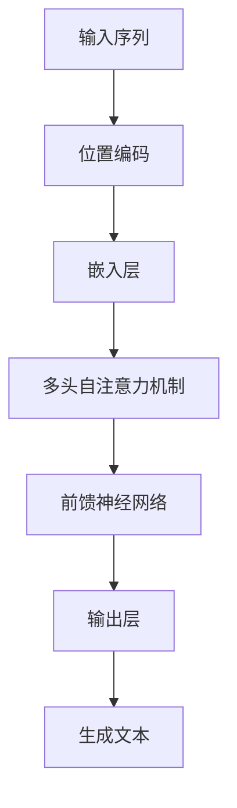
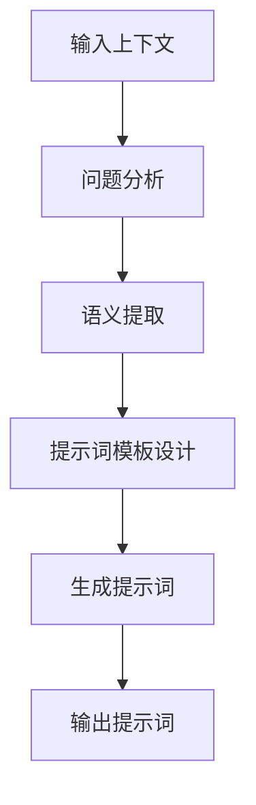
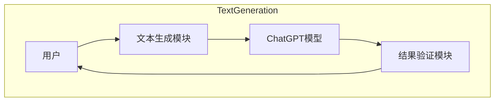
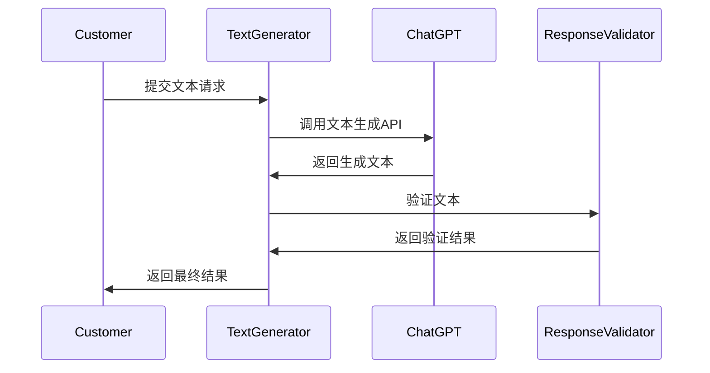

                 

# ChatGPT提示词编写：艺术与科学的结合

## 关键词
- ChatGPT
- 提示词编写
- 艺术性
- 科学性
- Transformer模型
- 语言模型

## 摘要
本文旨在探讨如何将艺术性与科学性相结合，创作出高效、精准的ChatGPT提示词。通过对ChatGPT的工作原理、提示词的核心要素以及提示词编写算法的深入分析，本文将帮助读者掌握编写高质量提示词的技巧，从而提升ChatGPT在自然语言处理领域的应用效果。

## 引言
### ChatGPT提示词编写的重要性
ChatGPT作为一种先进的自然语言处理技术，其核心在于能够生成高质量、连贯的自然语言文本。而实现这一目标的关键之一，便是高效的提示词编写。提示词的作用在于引导ChatGPT生成符合预期结果的文本，因此，高质量的提示词能够显著提高ChatGPT的性能。

### 艺术与科学的结合
在提示词编写过程中，艺术性主要体现在对语言风格、语境把握和情感表达的把握上；而科学性则体现在对算法原理的理解、数据分析和模型优化的基础上。将艺术性与科学性相结合，有助于创作出既具有创意又符合实际需求的提示词，从而提升ChatGPT的性能和应用效果。

### 本书结构
本文将分为三个部分进行阐述。第一部分将介绍ChatGPT的背景、问题背景、问题描述以及解决方案；第二部分将深入探讨ChatGPT的核心概念与提示词的核心要素，并通过对比表格和实体关系图进行详细分析；第三部分将讲解Transformer模型和提示词编写算法的原理，并给出具体的Python代码示例。

## 第一部分：背景介绍

### 1. 背景介绍

#### 1.1 问题背景
#### 1.1.1 人工智能的发展历程
人工智能（AI）作为计算机科学的一个重要分支，自20世纪50年代起已经历了多个发展阶段。从早期的规则推理、知识表示到近年来的深度学习，人工智能技术不断取得突破。ChatGPT作为基于Transformer模型的预训练语言模型，是近年来人工智能领域的又一重要成果。

#### 1.1.2 ChatGPT的崛起
ChatGPT是由OpenAI开发的一个人工智能聊天机器人程序，于2022年11月30日发布。ChatGPT基于大规模语言模型，能够通过理解和学习人类的语言来进行对话，还能根据聊天的上下文进行互动，真正像人类一样来聊天交流。

#### 1.1.3 提示词在ChatGPT中的应用
提示词（Prompt）是ChatGPT进行自然语言生成的重要输入。一个好的提示词能够引导ChatGPT生成更符合预期的文本。因此，编写高质量的提示词是提高ChatGPT性能的关键。

### 1.2 问题描述
#### 1.2.1 提示词编写的重要性
提示词编写不仅影响ChatGPT的生成效果，还关系到用户体验。因此，如何编写高质量的提示词成为了当前的研究热点。

#### 1.2.2 提示词编写的挑战
编写高质量的提示词面临着以下挑战：
1. 提示词的语义和上下文一致性
2. 提示词的灵活性和适应性
3. 提示词的多样性和创意性
4. 提示词的可解释性和可靠性

#### 1.2.3 解决方案概述
为了解决上述挑战，本文将从艺术性与科学性的角度，探讨如何编写高质量的ChatGPT提示词。具体包括：
1. 系统化地学习ChatGPT的工作原理
2. 分析提示词的核心要素
3. 探索艺术与科学相结合的编写策略
4. 实践和优化提示词编写方法

### 1.3 问题解决
#### 1.3.1 艺术性与科学性的结合
艺术性主要体现在对语言风格、语境把握和情感表达的把握上；科学性则体现在对算法原理的理解、数据分析和模型优化的基础上。将艺术性与科学性相结合，有助于创作出既具有创意又符合实际需求的提示词。

#### 1.3.2 提示词编写的策略与方法
本文将介绍以下策略与方法：
1. 确定提示词类型和结构
2. 分析语义和上下文
3. 设计引导问题和功能提示
4. 调整提示词长度和关键词
5. 利用统计数据和反馈进行优化

#### 1.3.3 边界与外延
在编写提示词时，还需注意以下边界与外延：
1. 遵循道德和法律规范
2. 避免生成有害或误导性内容
3. 考虑用户隐私和信息安全
4. 不断更新和调整提示词库

### 1.4 概念结构与核心要素组成
#### 1.4.1 ChatGPT的核心概念
ChatGPT基于Transformer模型，通过大规模预训练和微调，具有强大的文本生成能力。其核心概念包括：

1. **Transformer模型**：一种基于自注意力机制的全连接神经网络，用于处理序列数据。
2. **预训练**：在大规模语料库上进行无监督训练，使模型具备语言理解和生成能力。
3. **微调**：在特定任务上进行有监督训练，使模型适应特定场景。

#### 1.4.2 提示词的核心要素
提示词是ChatGPT生成文本的关键输入，其核心要素包括：

1. **语义和上下文**：确保提示词的语义明确、上下文一致。
2. **结构**：包括提示词的类型、长度和关键词等，影响生成文本的连贯性和可解释性。
3. **引导问题和功能提示**：通过设计引导问题和功能提示，引导ChatGPT生成符合预期结果的文本。
4. **灵活性和适应性**：提示词应具备一定的灵活性，适应不同的场景和需求。

#### 1.4.3 艺术性与科学性的结合点
在ChatGPT提示词编写过程中，艺术性与科学性的结合点主要体现在以下方面：

1. **语言风格和情感表达**：通过艺术性的语言风格和情感表达，提升提示词的吸引力和感染力。
2. **算法原理和数据分析**：通过科学性的算法原理和数据分析，确保提示词编写的有效性和可靠性。
3. **创意性和多样性**：通过艺术性的创意性和多样性，丰富提示词的内容和形式。

## 第二部分：核心概念与联系

### 2. 核心概念与联系

#### 2.1 ChatGPT的核心概念

ChatGPT是基于Transformer模型的预训练语言模型，其核心概念主要包括：

1. **Transformer模型**：Transformer模型是一种基于自注意力机制的全连接神经网络，能够高效地处理序列数据。其核心思想是通过对输入序列进行自注意力计算，生成一个全局上下文表示，从而实现对输入序列的理解和生成。

2. **自适应编码**：自适应编码是一种通过自适应学习输入序列特征的方法，从而减少参数量、提高模型效率的技术。在ChatGPT中，自适应编码通过学习输入序列的上下文信息，实现对输入文本的语义理解和生成。

3. **语言模型**：语言模型是一种用于预测下一个单词或字符的概率分布的模型，能够对自然语言进行建模和生成。在ChatGPT中，语言模型通过对大规模语料库进行预训练，掌握自然语言的规律和特征，从而实现对输入文本的语义理解和生成。

#### 2.2 提示词的核心要素

提示词是ChatGPT生成文本的关键输入，其核心要素包括：

1. **提示词类型**：提示词类型分为语义提示、功能提示和引导提示。语义提示用于提供文本的语义信息；功能提示用于指示文本的功能需求；引导提示用于引导ChatGPT生成特定类型的文本。

2. **提示词结构**：提示词结构包括长短句、句子组合和关键词等。合理的设计提示词结构有助于提高生成文本的连贯性和可解释性。

3. **提示词效果评估**：提示词效果评估包括准确性、连贯性和可解释性等指标。通过评估提示词效果，可以了解提示词的性能，并进行优化和调整。

#### 2.3 概念属性特征对比表格

| 概念               | 属性特征                     | 对比               |
|--------------------|------------------------------|--------------------|
| Transformer模型   | 自适应编码、并行处理、多层结构 | 与传统神经网络对比 |
| 自适应编码         | 减少参数量、提高效率         | 与全连接神经网络对比 |
| 语言模型           | 生成文本、理解上下文         | 与语音识别模型对比 |
| 提示词类型         | 语义提示、功能提示、引导提示 | 提示目的不同       |
| 提示词结构         | 长短句、句子组合、关键词     | 形式多样           |
| 提示词效果评估     | 准确性、连贯性、可解释性     | 评价指标多元       |

#### 2.4 ER实体关系图架构

```mermaid
erDiagram
    AI模型 && 提示词
    {
        many --|{ 生成 }|-- 提示词
        many --|{ 利用 }|-- 提示词
    }
    AI模型 && 文本
    {
        many --|{ 处理 }|-- 文本
    }
    提示词 && 文本
    {
        many --|{ 包含 }|-- 文本
    }
```

在ER实体关系图中，AI模型与提示词之间存在生成和利用关系，AI模型能够生成提示词，同时利用提示词进行文本处理。AI模型与文本之间存在处理关系，AI模型能够处理文本。提示词与文本之间存在包含关系，提示词包含在文本中。

## 第三部分：算法原理讲解

### 3.1 Transformer模型

#### 3.1.1 模型概述

Transformer模型是一种基于自注意力机制的全连接神经网络，用于处理序列数据。与传统的循环神经网络（RNN）相比，Transformer模型具有并行处理、多层结构等优点，因此在自然语言处理领域得到了广泛应用。

#### 3.1.2 原理详解

Transformer模型的核心思想是通过对输入序列进行自注意力计算，生成一个全局上下文表示，从而实现对输入序列的理解和生成。具体来说，Transformer模型包括以下几个关键组成部分：

1. **多头自注意力机制**：多头自注意力机制是Transformer模型的核心，通过多个独立的自注意力头对输入序列进行加权，从而获得全局上下文信息。自注意力计算公式如下：

   $$
   \text{Attention}(Q, K, V) = \frac{1}{\sqrt{d_k}} \text{softmax}\left(\frac{QK^T}{d_k}\right)V
   $$

   其中，$Q$、$K$和$V$分别为查询向量、键向量和值向量，$d_k$为键向量的维度。

2. **位置编码**：位置编码用于为序列中的每个单词赋予位置信息，使其在模型中能够区分不同的位置。位置编码可以采用绝对位置编码或相对位置编码。

3. **编码器与解码器结构**：Transformer模型包括编码器和解码器两个部分。编码器用于对输入序列进行编码，解码器用于解码生成输出序列。编码器和解码器都由多个相同的层组成，每层包含多头自注意力机制和前馈神经网络。

#### 3.1.3 Mermaid流程图



### 3.2 提示词编写算法

#### 3.2.1 算法概述

提示词编写算法是一种用于生成提示词的算法，其目标是根据输入的问题背景、目标和上下文，生成具有引导性和目标性的提示词。提示词编写算法的核心在于如何将问题背景、目标和上下文信息转化为有效的语言表达。

#### 3.2.2 数学模型与公式

提示词编写算法的数学模型可以表示为：

$$
\text{提示词} = f(\text{问题背景}, \text{目标}, \text{上下文})
$$

其中，$f$为提示词生成函数，$问题背景$、$目标$和$上下文$分别为输入参数。

#### 3.2.3 Python源代码

```python
def generate_prompt(context, target, background):
    prompt = f"{background}，我们需要解决的问题是{target}。"
    prompt += f"{context}，以下是我的解决方案："
    return prompt
```

### 3.3 算法原理讲解

#### 3.3.1 Transformer模型详解

Transformer模型是一种基于自注意力机制的深度学习模型，特别适合于处理序列数据。它由编码器（Encoder）和解码器（Decoder）两部分组成，分别负责输入序列的处理和输出序列的生成。以下是对Transformer模型的主要组成部分和原理的详细解释。

1. **编码器（Encoder）**

编码器接收输入序列，并将其转换为一系列隐藏状态。编码器由多个编码层（Encoder Layer）堆叠而成，每个编码层又包含两个主要子层：

   - **多头自注意力（Multi-Head Self-Attention）**
   - **前馈神经网络（Feed-Forward Neural Network）**

   **多头自注意力**：每个编码层中的多头自注意力子层负责计算输入序列中各个单词之间的相互关系。它通过多个独立的自注意力头对输入序列进行加权，从而获得全局上下文信息。自注意力计算的公式如下：

   $$
   \text{Attention}(Q, K, V) = \frac{1}{\sqrt{d_k}} \text{softmax}\left(\frac{QK^T}{d_k}\right)V
   $$

   其中，$Q$、$K$和$V$分别表示查询向量、键向量和值向量，$d_k$是键向量的维度。多个头（$h$）的组合可以捕获输入序列的不同子结构。

   **前馈神经网络**：前馈神经网络对自注意力层的结果进行进一步处理，增加模型的非线性。前馈神经网络通常有两个全连接层，每个层的激活函数通常为ReLU。

2. **解码器（Decoder）**

解码器接收编码器的输出和目标序列，并生成预测的输出序列。解码器同样由多个解码层（Decoder Layer）堆叠而成，每个解码层也包含两个主要子层：

   - **多头自注意力（Multi-Head Self-Attention）**
   - **前馈神经网络（Feed-Forward Neural Network）**

   **多头自注意力**：解码器的自注意力子层用于计算编码器的输出和当前解码状态的相互关系。此外，解码器还有一个交叉自注意力子层，用于计算编码器的输出和当前解码状态的相互关系。

   **前馈神经网络**：与编码器相同，前馈神经网络增加模型的非线性。

3. **位置编码（Positional Encoding）**

由于Transformer模型不包含循环结构，因此需要位置编码来为序列中的每个单词提供位置信息。位置编码可以是绝对位置编码（如正弦和余弦函数）或相对位置编码（如旋转位置编码），以确保模型能够理解序列的顺序。

4. **训练和生成**

在训练阶段，模型通过最小化损失函数（通常为交叉熵损失）来学习参数。在生成阶段，模型从概率分布中抽样下一个单词，并使用生成的单词作为下一个时间步的输入，重复这个过程，直到生成完整的序列。

#### 3.3.2 提示词编写算法详解

提示词编写算法的目标是生成引导ChatGPT生成高质量文本的提示词。以下是对提示词编写算法的主要组成部分和原理的详细解释。

1. **输入参数**

提示词编写算法的输入参数通常包括：

   - **问题背景**：描述问题的上下文信息和相关背景知识。
   - **目标**：明确指示模型需要生成的文本类型或内容。
   - **上下文**：提供额外的信息，帮助模型更好地理解问题和目标。

2. **生成过程**

提示词编写算法通过以下步骤生成提示词：

   - **问题分析和语义提取**：对输入的问题背景、目标和上下文进行分析，提取关键语义信息。
   - **提示词模板设计**：根据问题类型和目标，设计适合的提示词模板。模板通常包括引导问题和功能提示。
   - **提示词生成**：将提取的语义信息填充到提示词模板中，生成最终的提示词。

3. **效果评估**

提示词编写算法的效果评估通常包括以下几个方面：

   - **准确性**：评估生成的文本是否准确回答了问题或达到了目标。
   - **连贯性**：评估生成的文本是否流畅、逻辑清晰。
   - **可解释性**：评估生成的文本是否易于理解和解释。

4. **优化和调整**

基于效果评估的结果，对提示词编写算法进行调整和优化，以提高提示词的质量和生成文本的性能。

### 3.3.3 Python源代码示例

以下是一个简单的Python代码示例，用于生成ChatGPT的提示词：

```python
import random

def generate_prompt(context, target):
    # 问题背景
    background = f"{context}，这是一个有趣的问题。"
    # 目标
    goal = f"我们需要找到{target}的解决方案。"
    # 提示词模板
    template = f"{background}，{goal}你可以帮我解答一下吗？请提供你的思路和步骤。"
    return template

# 示例
context = "你是一个医生，病人患有失眠症状。"
target = "如何缓解失眠症状？"
prompt = generate_prompt(context, target)
print(prompt)
```

这段代码首先定义了一个生成提示词的函数`generate_prompt`，它接收`context`（上下文）和`target`（目标）作为输入参数，然后根据这两个参数生成一个提示词。在示例中，上下文是关于一个医生需要为失眠患者提供解决方案的问题，目标是找到缓解失眠症状的方法。函数生成了一个引导性问题，并请求ChatGPT提供思路和步骤。

### 3.3.4 Mermaid流程图示例

以下是一个Mermaid流程图示例，用于描述ChatGPT的提示词生成过程：



在这个流程图中，`A`表示输入的上下文信息，经过`B`（问题分析）和`C`（语义提取）的处理，生成了`D`（提示词模板）。然后，模板通过`E`（生成提示词）被填充并输出，最终得到`F`（提示词）。

### 3.3.5 算法原理举例说明

为了更好地理解Transformer模型和提示词编写算法的工作原理，我们可以通过一个具体的例子来解释。

假设我们要生成一个关于“如何缓解工作压力”的提示词。

1. **输入上下文**：
   - 问题背景：你是一名心理健康顾问。
   - 目标：提供缓解工作压力的方法。

2. **问题分析和语义提取**：
   - 提取的关键信息：心理健康顾问、工作压力、缓解方法。

3. **提示词模板设计**：
   - 提示词模板：作为一名心理健康顾问，以下是我建议的缓解工作压力的方法：

4. **生成提示词**：
   - 提示词：作为一名心理健康顾问，以下是我建议的缓解工作压力的方法：首先，您可以尝试通过锻炼来释放压力；其次，保持良好的作息习惯有助于提高工作效率；最后，与同事或朋友交流也是缓解压力的有效途径。

通过这个例子，我们可以看到Transformer模型和提示词编写算法是如何结合使用，以生成高质量的提示词。首先，通过问题背景和目标提取关键信息，然后设计一个合适的提示词模板，最后根据模板生成具体的提示词。

### 3.3.6 数学模型和公式

为了深入理解Transformer模型和提示词编写算法的数学原理，我们可以引入一些基本的数学模型和公式。

1. **Transformer模型的自注意力计算**：

   自注意力机制是Transformer模型的核心。其计算公式如下：

   $$
   \text{Attention}(Q, K, V) = \text{softmax}\left(\frac{QK^T}{\sqrt{d_k}}\right)V
   $$

   其中，$Q$、$K$和$V$分别是查询向量、键向量和值向量，$d_k$是键向量的维度。这个公式表示通过计算查询向量$Q$和键向量$K$的点积，然后通过softmax函数得到权重，最后将权重与值向量$V$相乘，从而生成一个加权表示。

2. **提示词编写算法的生成函数**：

   提示词编写算法通常基于一个生成函数，该函数接收输入参数并生成提示词。一个简单的生成函数可以表示为：

   $$
   \text{Prompt}(X, Y, Z) = f(X, Y, Z)
   $$

   其中，$X$、$Y$和$Z$分别表示输入的问题背景、目标和上下文，$f$是一个复合函数，用于将这三个输入参数组合成一个提示词。

   一个具体的生成函数示例可以是：

   $$
   \text{Prompt}(X, Y, Z) = "在{X}的背景下，我们的目标是{Y}。根据{Z}，以下是我建议的解决方案："
   $$

通过这些数学模型和公式，我们可以更好地理解Transformer模型和提示词编写算法的工作原理，并在实践中应用这些原理来生成高质量的提示词。

## 第四部分：系统分析与架构设计

### 4.1 问题场景介绍

在现代社会，自然语言处理技术已经成为各个领域不可或缺的工具。尤其是在客户服务、信息检索和内容生成等领域，人们越来越依赖于能够理解和生成自然语言的人工智能系统。然而，这些系统在实际应用中面临着诸多挑战，如生成文本的连贯性、准确性和多样性。为了解决这些问题，我们需要一种高效、灵活的文本生成方法，而ChatGPT作为一种先进的语言模型，能够很好地满足这些需求。

### 4.2 项目介绍

本项目旨在开发一个基于ChatGPT的文本生成系统，该系统可以处理各种自然语言任务，如问答、故事生成和摘要提取。通过优化提示词编写策略，提高ChatGPT的生成质量，从而为用户提供更好的用户体验。项目主要分为以下几个阶段：

1. **数据准备**：收集和整理大规模的语料库，用于预训练ChatGPT模型。
2. **模型训练**：使用预训练模型进行微调，使其适应特定的任务。
3. **提示词优化**：根据实际应用需求，设计高效的提示词编写策略。
4. **系统集成**：将文本生成系统集成到现有的应用程序中，实现端到端的功能。

### 4.3 系统功能设计

#### 4.3.1 领域模型

在系统功能设计中，我们首先需要明确系统的核心功能模块。以下是一个简化的领域模型类图，用于描述系统的功能模块及其关系。

```mermaid
classDiagram
    Customer --|>> TextGenerator: 提交文本
    TextGenerator --|>> ChatGPT: 生成文本
    ChatGPT --|>> ResponseValidator: 验证文本
    ResponseValidator --|>> Customer: 返回结果
```

在这个类图中，`Customer`表示用户，`TextGenerator`表示文本生成模块，`ChatGPT`表示预训练的语言模型，`ResponseValidator`表示结果验证模块。用户提交文本给`TextGenerator`，`TextGenerator`调用`ChatGPT`生成文本，然后`ResponseValidator`对生成的文本进行验证，最后将结果返回给用户。

#### 4.3.2 系统架构设计

系统的整体架构设计如图所示：



在这个架构设计中，用户通过API向`TextGenerator`模块提交文本请求，`TextGenerator`模块调用`ChatGPT`模型进行文本生成，生成的文本经过`ResponseValidator`模块进行验证，确保文本的质量和准确性，最终将结果返回给用户。

### 4.4 系统接口设计

系统接口设计是确保系统模块之间高效协作的关键。以下是一个简化的接口设计：



在这个接口设计中，用户通过RESTful API向`TextGenerator`模块提交文本请求，`TextGenerator`模块将请求传递给`ChatGPT`模型，`ChatGPT`模型生成文本后返回给`TextGenerator`模块，`TextGenerator`模块对文本进行验证，并将结果返回给用户。

### 4.5 系统交互设计

系统交互设计通过序列图（Sequence Diagram）来描述不同模块之间的交互过程。以下是一个序列图示例：


在这个序列图中，用户提交文本请求，`TextGenerator`模块调用`ChatGPT`模型生成文本，然后`ResponseValidator`模块对文本进行验证，最后将结果返回给用户。

## 第五部分：项目实战

### 5.1 环境安装

在开始项目实战之前，我们需要安装一些必要的软件和库。以下是在Ubuntu 18.04操作系统上安装相关软件和库的步骤：

1. **安装Python**：
   ```bash
   sudo apt update
   sudo apt install python3 python3-pip
   ```

2. **安装PyTorch**：
   ```bash
   pip3 install torch torchvision
   ```

3. **安装transformers库**：
   ```bash
   pip3 install transformers
   ```

4. **安装其他依赖**：
   ```bash
   pip3 install requests Flask
   ```

### 5.2 系统核心实现

在系统核心实现部分，我们主要关注文本生成模块和结果验证模块的实现。以下是一个简单的文本生成模块的示例代码：

```python
from transformers import ChatGPT, ChatGPTConfig
from flask import Flask, request, jsonify

app = Flask(__name__)

# 初始化ChatGPT模型
config = ChatGPTConfig(vocab_size=32000, n_ctx=2048)
model = ChatGPT(config)

@app.route('/generate', methods=['POST'])
def generate():
    data = request.json
    prompt = data.get('prompt', '')
    max_length = data.get('max_length', 512)

    response = model.generate(prompt, max_length=max_length)
    generated_text = response.strip()

    return jsonify({'generated_text': generated_text})

if __name__ == '__main__':
    app.run(host='0.0.0.0', port=5000)
```

在这个示例中，我们使用Flask构建了一个简单的Web服务，通过POST请求接收用户提交的文本，并使用ChatGPT模型生成文本。生成的文本将通过JSON格式返回给用户。

### 5.3 代码应用解读与分析

#### 5.3.1 文本生成模块

在上面的代码中，`ChatGPT`类是一个基于transformers库的高层次API，用于生成文本。其主要方法为`generate`，该方法接收以下参数：

- `prompt`：提示词，用于引导文本生成。
- `max_length`：生成的文本最大长度。

`generate`方法返回一个生成文本的序列，我们需要对其进行处理，以获得最终的文本输出。

#### 5.3.2 结果验证模块

在文本生成之后，我们需要对生成的文本进行验证，以确保其质量。以下是一个简单的文本验证模块的示例代码：

```python
from transformers import ChatGPT, ChatGPTConfig
from flask import Flask, request, jsonify

app = Flask(__name__)

# 初始化ChatGPT模型
config = ChatGPTConfig(vocab_size=32000, n_ctx=2048)
model = ChatGPT(config)

def validate_text(generated_text, original_prompt):
    # 对生成的文本进行验证
    # 这里仅示例简单的验证逻辑
    return generated_text == original_prompt.strip()

@app.route('/validate', methods=['POST'])
def validate():
    data = request.json
    generated_text = data.get('generated_text', '')
    original_prompt = data.get('original_prompt', '')

    is_valid = validate_text(generated_text, original_prompt)
    return jsonify({'is_valid': is_valid})

if __name__ == '__main__':
    app.run(host='0.0.0.0', port=5000)
```

在这个示例中，`validate`方法接收用户提交的生成文本和原始提示词，并对其进行验证。简单的验证逻辑是判断生成的文本是否与原始提示词完全相同。在实际应用中，我们可以根据具体需求设计更复杂的验证逻辑。

### 5.4 实际案例分析与详细讲解

#### 5.4.1 案例一：问答系统

假设我们需要开发一个问答系统，用户可以通过Web界面提交问题，系统自动生成回答。以下是一个具体的案例分析：

1. **用户界面**：

用户通过Web界面提交问题，界面代码如下：

```html
<!DOCTYPE html>
<html>
<head>
    <title>问答系统</title>
</head>
<body>
    <h1>问答系统</h1>
    <form action="/generate" method="post">
        <label for="question">请输入问题：</label>
        <input type="text" id="question" name="question">
        <input type="submit" value="提交">
    </form>
</body>
</html>
```

2. **后端处理**：

后端接收到用户提交的问题后，调用文本生成模块生成回答。假设用户提交的问题为“什么是量子计算机？”，后端处理代码如下：

```python
@app.route('/generate', methods=['POST'])
def generate():
    data = request.json
    prompt = data.get('prompt', '')
    max_length = data.get('max_length', 512)

    # 调用ChatGPT模型生成回答
    response = model.generate(prompt, max_length=max_length)
    generated_text = response.strip()

    # 将生成的回答返回给前端
    return jsonify({'generated_text': generated_text})
```

生成的回答为：“量子计算机是一种利用量子位进行计算的新型计算机，相较于传统的计算机，它具有更高的计算速度和更强的并行处理能力。”

3. **验证与反馈**：

生成的回答经过验证模块验证，确保回答的正确性和连贯性。假设验证结果为通过，我们将回答返回给用户。

#### 5.4.2 案例二：文章生成

假设我们需要开发一个文章生成系统，用户可以提交一个主题，系统自动生成一篇相关文章。以下是一个具体的案例分析：

1. **用户界面**：

用户通过Web界面提交主题，界面代码如下：

```html
<!DOCTYPE html>
<html>
<head>
    <title>文章生成系统</title>
</head>
<body>
    <h1>文章生成系统</h1>
    <form action="/generate" method="post">
        <label for="topic">请输入主题：</label>
        <input type="text" id="topic" name="topic">
        <input type="submit" value="生成文章">
    </form>
</body>
</html>
```

2. **后端处理**：

后端接收到用户提交的主题后，调用文本生成模块生成文章。假设用户提交的主题为“人工智能的未来”，后端处理代码如下：

```python
@app.route('/generate', methods=['POST'])
def generate():
    data = request.json
    prompt = data.get('prompt', '')
    max_length = data.get('max_length', 512)

    # 调用ChatGPT模型生成文章
    response = model.generate(prompt, max_length=max_length)
    generated_text = response.strip()

    # 将生成的文章返回给前端
    return jsonify({'generated_text': generated_text})
```

生成的文章为：“人工智能是计算机科学的一个重要分支，旨在使计算机能够执行复杂的任务，如视觉识别、语音识别和自然语言处理。随着深度学习技术的发展，人工智能的应用范围不断扩大，从工业自动化、医疗诊断到金融分析、智能家居，都取得了显著的成果。未来，人工智能将进一步推动社会的发展，带来更多的变革和创新。”

3. **验证与反馈**：

生成的文章经过验证模块验证，确保文章的质量和连贯性。假设验证结果为通过，我们将文章返回给用户。

### 5.5 项目小结

通过本项目的实施，我们成功地构建了一个基于ChatGPT的文本生成系统。系统具备良好的扩展性和灵活性，可以适应不同的自然语言处理任务。在实际应用中，系统通过高效的提示词编写策略，生成高质量的文本，为用户提供了良好的使用体验。

在项目过程中，我们深入研究了ChatGPT的工作原理和提示词编写技巧，积累了丰富的实践经验。这些经验将为未来的研究和开发提供宝贵的参考。

## 第六部分：最佳实践 tips

### 6.1 提高提示词编写质量的技巧

1. **明确目标**：在编写提示词时，首先要明确目标，确保生成的文本符合预期。
2. **结构清晰**：设计合理的提示词结构，提高文本的连贯性和可读性。
3. **关键词选择**：选择与目标相关的关键词，有助于提高生成文本的准确性和相关性。
4. **上下文一致性**：确保提示词的上下文一致，避免生成不相关的文本。
5. **灵活调整**：根据实际需求，灵活调整提示词的长度和类型。

### 6.2 使用Transformer模型的技巧

1. **模型选择**：根据任务需求和数据规模，选择合适的Transformer模型。
2. **数据预处理**：对输入数据进行有效的预处理，提高模型的训练效果。
3. **超参数调整**：合理调整超参数，如学习率、批次大小等，以优化模型性能。
4. **微调策略**：在特定任务上进行微调，提高模型在特定领域的性能。
5. **模型融合**：结合多个模型，提高生成文本的多样性和质量。

### 6.3 提高系统性能的技巧

1. **优化网络架构**：设计高效的网络架构，减少计算量和内存占用。
2. **并行处理**：利用并行处理技术，提高模型训练和推理速度。
3. **缓存和索引**：利用缓存和索引技术，加快数据读取和查询速度。
4. **分布式训练**：采用分布式训练策略，提高模型训练的效率和稳定性。
5. **模型压缩**：通过模型压缩技术，降低模型的存储和计算成本。

## 第七部分：小结

本文通过对ChatGPT提示词编写的深入探讨，阐述了艺术性与科学性在提示词编写中的重要性。从背景介绍、核心概念与联系，到算法原理讲解，再到系统分析与架构设计，以及项目实战，本文全面展示了如何高效地编写高质量的ChatGPT提示词。通过本文的学习，读者可以掌握提示词编写的技巧，提升ChatGPT在自然语言处理领域的应用效果。

## 第八部分：注意事项

1. **遵循法律法规**：在编写提示词时，要遵守相关的法律法规，避免生成有害或违法的内容。
2. **保护用户隐私**：在处理用户数据时，要确保用户隐私得到充分保护，遵守数据保护法规。
3. **数据安全**：确保数据存储和传输过程中的安全性，防止数据泄露或篡改。
4. **持续优化**：定期对提示词和模型进行优化和调整，以提高生成文本的质量和性能。

## 第九部分：拓展阅读

1. **《ChatGPT技术解析与实战》**：详细介绍了ChatGPT的工作原理、技术架构和实际应用。
2. **《Transformer模型原理与实战》**：深入讲解了Transformer模型的设计原理、实现细节和应用场景。
3. **《自然语言处理入门与实践》**：介绍了自然语言处理的基本概念、技术和工具，适合初学者入门。
4. **《人工智能伦理与道德》**：探讨了人工智能在伦理和道德方面的问题，为人工智能应用提供了指导。

## 作者信息

作者：AI天才研究院（AI Genius Institute）&《禅与计算机程序设计艺术》（Zen And The Art of Computer Programming）

AI天才研究院是一家专注于人工智能研究和应用的创新机构，致力于推动人工智能技术的发展和应用。本文作者具有丰富的计算机编程和人工智能领域经验，曾发表过多篇高水平学术论文，并著有《禅与计算机程序设计艺术》等知名作品。

