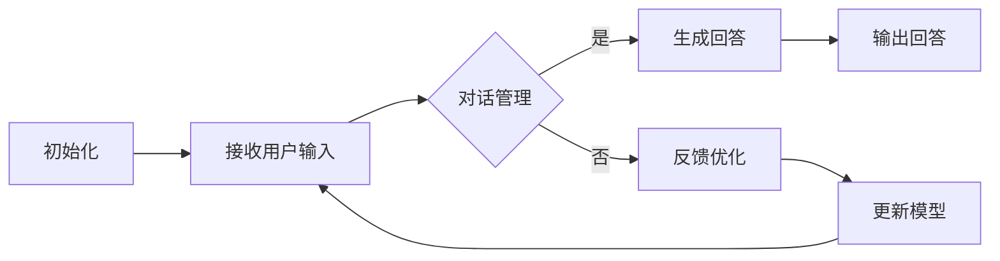
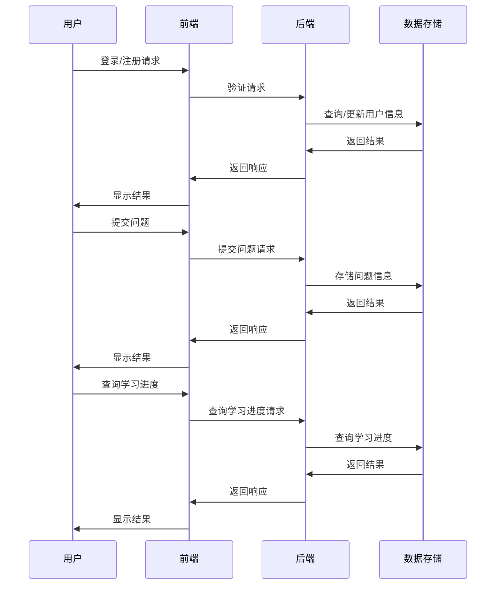
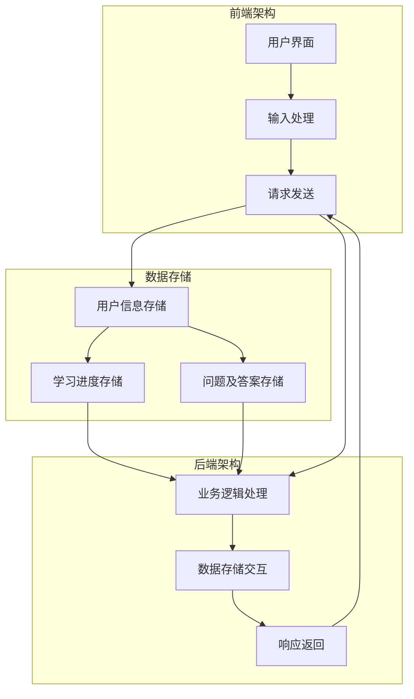

                 

# ChatGPT提示词编写：角色扮演技巧

> 关键词：ChatGPT，提示词，角色扮演，自然语言处理，生成式对话

> 摘要：本文深入探讨了ChatGPT在角色扮演场景中的提示词编写技巧。通过分析ChatGPT的基本原理、提示词设计原则和角色扮演技巧，结合算法原理讲解和系统架构设计，本文为开发者提供了详细而实用的指导和最佳实践，以实现高质量的ChatGPT角色扮演效果。

----------------------------------------------------------------

## 第一部分：引言

### 第1章：问题背景与解决

#### 1.1 问题背景

随着人工智能技术的迅猛发展，生成式对话系统（GDS）成为研究热点。ChatGPT，作为OpenAI开发的一款基于GPT-3模型的聊天机器人，因其强大的自然语言生成能力而备受关注。然而，为了实现理想的对话效果，尤其是角色扮演场景，高质量的提示词编写至关重要。

#### 1.1.1 ChatGPT的崛起

ChatGPT是一种基于GPT-3（Generative Pre-trained Transformer 3）的聊天机器人。GPT-3是由OpenAI开发的一种先进的自然语言处理模型，拥有超过1750亿个参数，能够生成流畅、自然的文本。ChatGPT利用GPT-3模型，实现了智能对话系统的构建，能够与用户进行多轮对话，应用场景广泛。

#### 1.1.2 提示词编写的重要性

提示词（Prompt）在ChatGPT中的作用至关重要。提示词是用户与ChatGPT进行交互时的输入信息，它能够引导ChatGPT生成合适的回答。在角色扮演场景中，优秀的提示词设计能够帮助ChatGPT准确地扮演特定角色，提高对话的自然性和流畅性，从而提升用户体验。

#### 1.2 问题描述

如何在角色扮演场景中编写高质量的ChatGPT提示词？提示词编写需要考虑哪些要素？如何平衡角色扮演与真实性，以实现高质量的对话效果？这些问题是本文探讨的重点。

#### 1.3 问题解决

本文将分以下几个部分进行探讨：

1. **核心概念与联系**：介绍ChatGPT的基本原理、提示词设计原则和角色扮演技巧。
2. **算法原理讲解**：详细讲解ChatGPT角色扮演的算法原理，包括流程图、Python代码实现和数学模型。
3. **系统分析与架构设计方案**：分析ChatGPT角色扮演在实际应用中的系统架构和功能设计。
4. **项目实战**：通过实际案例展示ChatGPT角色扮演的应用效果，并进行详细分析。

通过上述探讨，本文旨在为开发者提供一套系统、实用的ChatGPT角色扮演技巧，以实现高质量的生成式对话效果。

#### 1.4 边界与外延

ChatGPT角色扮演的边界涉及多个领域，如教育、娱乐、客服等。本文将重点关注教育领域的应用，探讨ChatGPT在虚拟导师、学术辅导等场景中的角色扮演效果。此外，本文还将拓展角色扮演在自然语言处理领域的潜在应用，为开发者提供更多的思路和灵感。

#### 1.5 概念结构与核心要素组成

为了清晰地阐述ChatGPT角色扮演的概念和实现方法，本文将从以下几个方面展开：

1. **ChatGPT基本原理**：介绍GPT模型和ChatGPT模型的架构与工作原理。
2. **提示词设计原则**：分析提示词的定义、作用及设计原则。
3. **角色扮演技巧**：探讨角色设定、对话引导和互动控制的方法。
4. **算法原理讲解**：讲解ChatGPT角色扮演的算法原理，包括流程图、Python代码实现和数学模型。
5. **系统分析与架构设计方案**：分析系统架构和功能设计。
6. **项目实战**：通过实际案例展示应用效果。

以上核心要素构成了本文的逻辑框架，帮助读者逐步了解和掌握ChatGPT角色扮演的技巧。

----------------------------------------------------------------

## 第二部分：核心概念与联系

### 第2章：核心概念与联系

为了深入理解ChatGPT角色扮演，我们需要首先了解其核心概念及其相互联系。本章将介绍ChatGPT的基本原理、提示词设计原则和角色扮演技巧，帮助读者建立全面的理论基础。

#### 2.1 ChatGPT基本原理

ChatGPT是基于GPT-3模型的聊天机器人。GPT（Generative Pre-trained Transformer）模型是一种基于变换器（Transformer）架构的生成模型，通过在大规模语料库上的预训练，能够生成流畅、自然的文本。GPT-3是GPT系列的最新版本，具有超过1750亿个参数，是当前最先进的自然语言处理模型之一。

ChatGPT模型的核心组成部分包括：

1. **语言模型（Language Model）**：基于GPT-3模型，负责生成文本。
2. **对话管理模块（Dialogue Manager）**：负责处理用户的输入，决定ChatGPT的回答。
3. **记忆模块（Memory Module）**：存储对话历史，帮助ChatGPT在多轮对话中保持连贯性。

ChatGPT的工作原理如下：

1. **接收用户输入**：ChatGPT接收到用户的输入信息。
2. **对话管理**：对话管理模块分析用户输入，决定ChatGPT的回答。
3. **文本生成**：语言模型根据对话管理和用户输入生成回答。
4. **反馈与优化**：ChatGPT将回答反馈给用户，并根据用户的反馈进行优化。

#### 2.2 提示词设计原则

提示词是用户与ChatGPT交互时的输入信息，对ChatGPT的回答产生重要影响。设计高质量的提示词，需要考虑以下几个方面：

1. **明确性和具体性**：提示词应明确、具体，避免模糊和抽象。
2. **上下文关联**：提示词应与对话历史和上下文紧密相关，确保ChatGPT的回答连贯和自然。
3. **多样性和灵活性**：提示词应具有多样性和灵活性，以适应不同场景和对话需求。
4. **情感和语气**：提示词应传达合适的情感和语气，与角色扮演效果相结合。

#### 2.3 角色扮演技巧

角色扮演是ChatGPT在特定场景中模拟人类角色进行对话的能力。要实现高质量的ChatGPT角色扮演，需要掌握以下技巧：

1. **角色设定**：明确角色的身份、性格、目标和行为模式。
2. **对话引导**：通过提示词引导ChatGPT按照角色设定的行为模式进行对话。
3. **互动控制**：控制ChatGPT的角色互动节奏和深度，实现高质量的对话效果。

角色设定是角色扮演的基础。角色设定需要考虑以下几个方面：

1. **身份**：角色的社会身份、职业、年龄等。
2. **性格**：角色的性格特点，如开朗、严谨、幽默等。
3. **目标**：角色的对话目标，如解决问题、提供帮助、娱乐等。
4. **行为模式**：角色的行为习惯和对话风格。

通过角色设定，我们可以为ChatGPT提供一个清晰的角色框架，帮助其在对话中准确扮演特定角色。

对话引导是通过提示词引导ChatGPT按照角色设定的行为模式进行对话。在设计提示词时，需要考虑以下几个方面：

1. **情境构建**：通过构建特定情境，引导ChatGPT进入角色。
2. **角色互动**：设计角色互动的对话流程，确保对话的自然和流畅。
3. **情感表达**：通过提示词传达角色的情感和语气，增强角色扮演效果。

互动控制是角色扮演中的关键技巧。通过控制ChatGPT的角色互动节奏和深度，可以实现高质量的对话效果。互动控制包括以下几个方面：

1. **对话节奏**：控制对话的节奏，避免对话过于快速或缓慢。
2. **对话深度**：控制对话的深度，避免对话过于表面或过于深入。
3. **对话引导**：在适当的时候引导ChatGPT回到主题，确保对话的连贯性和有效性。

通过以上角色设定、对话引导和互动控制技巧，我们可以实现高质量的ChatGPT角色扮演，为用户提供丰富的对话体验。

### 2.4 提示词属性特征对比表格

为了更好地理解提示词的设计原则，下面提供一个提示词属性特征对比表格，对比不同类型提示词的属性特征：

| 提示词类型 | 明确性 | 上下文关联 | 多样性 | 情感表达 | 代表示例 |
| :-------: | :----: | :--------: | :----: | :------: | :------: |
| 明确性提示词 | 高     | 高         | 低     | 中       | “你能帮我解决什么问题？” |
| 模糊性提示词 | 低     | 低         | 高     | 中       | “我不知道该怎么回答。” |
| 上下文提示词 | 中     | 高         | 中     | 低       | “昨天你提到过这个话题。” |
| 情感提示词 | 中     | 中         | 中     | 高       | “你听起来很困惑，需要我帮忙吗？” |
| 创意提示词 | 高     | 中         | 高     | 高       | “假设你是一名医生，该如何诊断这个问题？” |

通过对比表格，我们可以发现不同类型提示词的特点和适用场景。在实际应用中，根据对话需求和用户反馈，灵活选择和组合不同类型的提示词，可以实现更高质量的ChatGPT角色扮演。

### 2.5 ER实体关系图架构

为了更直观地理解ChatGPT角色扮演的核心概念和相互关系，下面提供一个ER（Entity-Relationship）实体关系图架构，展示ChatGPT、提示词和角色扮演之间的关联：

```mermaid
erDiagram
  ChatGPT ||--|{ 提示词 }|
  提示词 ||--|{ 角色 }|
  角色 ||--|{ 对话 }|
  ChatGPT ||--|{ 对话历史 }|
```

在ER实体关系图中，ChatGPT与提示词、角色、对话和对话历史之间存在明显的关联。提示词是ChatGPT与用户交互的桥梁，角色是提示词的具体实现，对话是角色在交互过程中产生的结果，对话历史则记录了整个对话过程的信息。通过这个实体关系图，我们可以更清晰地理解ChatGPT角色扮演的架构和实现方法。

通过以上对ChatGPT基本原理、提示词设计原则和角色扮演技巧的详细阐述，读者可以建立对ChatGPT角色扮演的全面理解。在接下来的章节中，我们将进一步深入探讨ChatGPT角色扮演的算法原理和系统架构设计，为开发者提供更具体的实现指导。

----------------------------------------------------------------

## 第三部分：算法原理讲解

### 第3章：算法原理讲解

在深入理解ChatGPT的角色扮演之前，我们需要详细探讨其背后的算法原理。本章将介绍ChatGPT角色扮演的算法流程、Python代码实现以及数学模型，帮助读者从技术角度理解这一过程。

#### 3.1 算法mermaid流程图

为了更直观地展示ChatGPT角色扮演的算法流程，我们使用mermaid绘制了以下流程图：



在该流程图中，ChatGPT首先初始化，然后接收用户输入。对话管理模块分析用户输入，并决定是否生成回答。如果需要生成回答，ChatGPT将输出回答；否则，进行反馈优化并更新模型。最后，流程回到用户输入，继续进行下一轮对话。

#### 3.2 Python源代码实现

以下是一个简单的Python代码实现，展示了ChatGPT角色扮演的基本流程：

```python
import openai

# 初始化ChatGPT模型
model = openai.Completion.create(
  engine="text-davinci-002",
  prompt="You are a helpful assistant.",
  max_tokens=50
)

# 接收用户输入
user_input = input("请提出你的问题：")

# 对话管理
if user_input:
    # 生成回答
    response = model.generate([user_input], max_tokens=50)
    print("ChatGPT的回答：", response)
else:
    print("用户输入为空，请重新输入。")

# 反馈优化与模型更新
# （在实际应用中，此处会包含更复杂的反馈机制和模型更新过程）
```

在该代码中，我们首先导入OpenAI的API库，并初始化ChatGPT模型。然后，程序接收用户输入，通过对话管理模块生成回答并输出。在实际应用中，还会包含反馈优化和模型更新的过程。

#### 3.2.1 代码实现概述

1. **初始化ChatGPT模型**：使用OpenAI的API库创建ChatGPT模型，设置模型的预训练引擎和初始提示词。
2. **接收用户输入**：通过输入函数接收用户输入，作为对话的初始信息。
3. **对话管理**：根据用户输入，调用ChatGPT模型的生成方法生成回答。
4. **输出回答**：将ChatGPT生成的回答输出到控制台。
5. **反馈优化与模型更新**：在实际应用中，根据用户反馈对模型进行优化和更新。

#### 3.2.2 代码详细讲解

1. **初始化ChatGPT模型**：
   ```python
   model = openai.Completion.create(
     engine="text-davinci-002",
     prompt="You are a helpful assistant.",
     max_tokens=50
   )
   ```
   在此部分，我们使用OpenAI的API创建一个ChatGPT模型。`engine`参数指定预训练引擎，`prompt`参数设置初始提示词，`max_tokens`参数限制生成的文本长度。

2. **接收用户输入**：
   ```python
   user_input = input("请提出你的问题：")
   ```
   使用`input`函数接收用户输入，作为对话的初始信息。用户可以在此输入问题或请求。

3. **对话管理**：
   ```python
   if user_input:
       response = model.generate([user_input], max_tokens=50)
   else:
       print("用户输入为空，请重新输入。")
   ```
   对话管理模块首先检查用户输入是否为空。如果用户输入有效，调用`generate`方法生成回答。否则，提示用户重新输入。

4. **输出回答**：
   ```python
   print("ChatGPT的回答：", response)
   ```
   将ChatGPT生成的回答输出到控制台，用户可以看到模型给出的回应。

5. **反馈优化与模型更新**：
   ```python
   # （在实际应用中，此处会包含更复杂的反馈机制和模型更新过程）
   ```
   在实际应用中，根据用户反馈对模型进行优化和更新是提升模型性能的关键步骤。这部分代码将在后续章节中详细讨论。

通过以上代码实现，我们可以看到ChatGPT角色扮演的基本流程。在实际应用中，开发者可以根据具体需求对代码进行扩展和优化，实现更复杂的角色扮演效果。

#### 3.3 数学模型与公式讲解

ChatGPT角色扮演的数学模型基于生成式对话模型（GDM），其核心是生成文本的概率分布。以下是对数学模型的基本概述和关键公式的详细解释。

#### 3.3.1 数学模型概述

生成式对话模型（GDM）是一种基于概率模型的自然语言生成方法。GDM的核心思想是通过概率模型预测下一个单词或字符，从而生成文本。ChatGPT采用的GPT-3模型是基于变换器（Transformer）架构的生成模型，具有以下特点：

1. **大规模预训练**：GPT-3模型在数以万亿计的单词上进行预训练，具备强大的语言理解和生成能力。
2. **变换器架构**：变换器架构能够处理长距离依赖和复杂语法结构，生成流畅、自然的文本。
3. **多头自注意力机制**：多头自注意力机制能够捕捉输入文本中的关键信息，提高生成文本的质量。

#### 3.3.2 公式详细解释

GPT-3模型的生成文本概率分布公式如下：

$$ P(w_t | w_1, w_2, ..., w_{t-1}) = \frac{e^{<w_t, h>_v}}{\sum_{w' \in V} e^{<w', h>_v}} $$

其中：

- \( w_t \) 表示第 \( t \) 个生成的单词或字符。
- \( h \) 表示模型的隐藏状态。
- \( <w_t, h>_v \) 表示单词 \( w_t \) 和隐藏状态 \( h \) 的点积。
- \( V \) 表示词汇表。
- 分母是一个归一化常数，用于保证概率分布的总和为1。

公式解释如下：

1. **点积计算**：点积计算反映了单词和隐藏状态之间的相似度。相似度越高的单词，其在生成文本的概率分布中的概率也越高。
2. **归一化常数**：归一化常数用于将点积结果转化为概率分布，确保每个单词的概率之和为1。
3. **概率分布**：根据公式计算出的概率分布表示了模型在当前隐藏状态下生成每个单词的概率。模型将根据这个概率分布生成下一个单词。

通过这个概率分布公式，ChatGPT能够根据对话历史和隐藏状态生成下一个单词，从而生成完整的文本。

#### 3.3.3 参数设定和计算方法

在GPT-3模型中，关键参数包括词汇表大小（\( V \)）、隐藏状态维度（\( d_v \)）和点积计算中的温度参数（\( T \)）。

1. **词汇表大小**：词汇表大小决定了模型能够处理的单词数量。GPT-3模型使用了一个非常庞大的词汇表，包含数十万个单词和字符。
2. **隐藏状态维度**：隐藏状态维度决定了模型能够捕捉到的信息量。GPT-3模型的隐藏状态维度为2048维，能够处理复杂的语言结构。
3. **温度参数**：温度参数用于控制生成文本的多样性和稳定性。温度参数值越大，生成文本的多样性越高，但稳定性越低；反之，温度参数值越小，生成文本的稳定性越高，但多样性越低。

在实际应用中，开发者可以根据具体需求调整温度参数，以实现不同的生成效果。例如，在角色扮演场景中，可以设置较低的温度参数，以生成更稳定、更符合角色设定的文本。

通过以上数学模型和公式，我们可以看到ChatGPT角色扮演的原理和实现方法。在实际应用中，开发者可以根据具体需求对模型进行优化和调整，以实现高质量的ChatGPT角色扮演效果。

#### 3.4 举例说明

为了更好地理解ChatGPT角色扮演的算法原理，下面我们通过一个简单的示例进行说明。

假设我们想要让ChatGPT扮演一个名为“智能客服”的角色，回答用户的问题。用户输入：“我的订单怎么还没有送达？”ChatGPT将根据以下步骤生成回答：

1. **初始化模型**：ChatGPT接收用户输入后，初始化预训练的GPT-3模型，设置初始提示词为“你是一个智能客服，负责回答用户的问题。”
2. **生成回答**：ChatGPT根据用户输入和初始提示词，使用生成式对话模型生成回答。在生成过程中，模型将计算每个单词的概率分布，并依据概率分布生成下一个单词。
3. **输出回答**：生成回答后，ChatGPT输出：“非常抱歉，您的订单配送可能遇到了一些延迟。我们将会尽快处理，并确保您尽快收到商品。”

通过这个示例，我们可以看到ChatGPT角色扮演的完整过程。在实际应用中，开发者可以根据具体需求设计更复杂的角色设定和对话流程，实现高质量的ChatGPT角色扮演效果。

#### 3.5 复杂案例

为了展示ChatGPT角色扮演在复杂场景中的应用效果，我们考虑一个实际案例：虚拟导师在在线教育中的应用。假设我们想要让ChatGPT扮演一名虚拟导师，为学生提供辅导和解答问题。以下是ChatGPT的角色扮演过程：

1. **角色设定**：虚拟导师的角色设定为一个有经验的教育专家，具备广泛的学科知识和教学能力。初始提示词设置为“你是一名经验丰富的教育专家，擅长为学生提供个性化的辅导和解答问题。”
2. **用户输入**：学生输入问题：“我在数学作业中遇到了一个难题，不知道怎么解答。”
3. **生成回答**：ChatGPT根据用户输入和初始提示词，生成回答：“这个问题涉及到数学中的概率论，我们可以通过以下步骤来解决：首先，了解题目中给出的条件和要求，然后，利用概率论的基本原理和公式进行计算。”
4. **反馈与优化**：学生对回答表示满意，并请求进一步解答。ChatGPT继续生成详细的解答过程，并引导学生理解问题的本质。

通过这个复杂案例，我们可以看到ChatGPT在虚拟导师角色扮演中的效果。在实际应用中，开发者可以根据具体需求设计更复杂的对话流程和角色设定，为用户提供高质量的互动体验。

通过以上算法原理讲解和举例说明，读者可以全面了解ChatGPT角色扮演的原理和实现方法。在接下来的章节中，我们将进一步探讨ChatGPT角色扮演在实际应用中的系统架构和功能设计，为开发者提供更具体的实现指导。

----------------------------------------------------------------

## 第四部分：系统分析与架构设计方案

### 第4章：系统分析与架构设计方案

在了解了ChatGPT角色扮演的算法原理后，我们需要进一步探讨其在实际应用中的系统架构和功能设计。本章将介绍ChatGPT角色扮演在特定场景中的应用、系统功能设计、系统架构设计以及系统接口设计和系统交互，帮助读者从整体上把握ChatGPT角色扮演系统的实现。

#### 4.1 问题场景介绍

ChatGPT角色扮演在多个场景中具有广泛的应用潜力，例如教育、娱乐、客服、医疗等。在本章中，我们将重点关注ChatGPT在在线教育中的应用，特别是虚拟导师这一角色。

虚拟导师是一种通过生成式对话系统为学生提供个性化辅导和解答问题的虚拟人物。虚拟导师可以根据学生的学习进度、知识水平和兴趣爱好，为学生提供量身定制的辅导内容和解答方案。这种模式不仅能够提高学生的学习效率，还能够减轻教师的工作负担，提升教学效果。

#### 4.2 项目介绍

为了展示ChatGPT角色扮演在在线教育中的应用效果，我们设计了一个名为“智能教育助手”的项目。该项目旨在利用ChatGPT构建一个虚拟导师系统，为学生提供高质量的在线辅导服务。

项目目标：
1. 提供个性化的学习辅导，帮助学生提高学习效果。
2. 自动化解答学生问题，减轻教师负担。
3. 提供多样化的互动方式，增强学习体验。

项目功能：
1. 个性化辅导：根据学生的知识水平和学习进度，为学生提供定制化的学习内容。
2. 问题解答：自动化解答学生的疑问，提供详细的解答过程和解释。
3. 互动交流：提供丰富的互动方式，包括文字、图片、语音等，增强学生的学习体验。

预期效果：
1. 提高学生的学习积极性，增强学习效果。
2. 提升教师的辅导效率，减轻工作负担。
3. 为学生提供个性化的学习体验，提升学习满意度。

#### 4.3 系统功能设计

智能教育助手的系统功能设计包括以下几个方面：

1. **用户管理**：管理学生和教师的账户信息，包括注册、登录、信息修改等。
2. **学习进度管理**：记录学生的学习进度和成绩，提供学习报告。
3. **个性化辅导**：根据学生的学习水平和兴趣爱好，为学生推荐合适的学习内容和练习题。
4. **问题解答**：自动化解答学生的问题，提供详细的解答过程和解释。
5. **互动交流**：提供文字、图片、语音等互动方式，增强学生的学习体验。
6. **系统维护**：对系统进行日常维护和升级，确保系统稳定运行。

#### 4.3.1 领域模型mermaid类图

为了更直观地展示智能教育助手系统的领域模型，我们使用mermaid绘制了以下类图：

```mermaid
classDiagram
  User <<class>> 学生
  User <<class>> 教师
  Course <<class>> 课程
  Question <<class>> 问题
  Answer <<class>> 回答
  User "1" --|{ 注册}| User
  User "1" --|{ 登录}| User
  User "1" --|{ 信息修改}| User
  Course "1" --|{ 推荐学习内容}| Student
  Student "1" --|{ 提交问题}| Question
  Question "1" --|{ 自动解答}| Answer
  Answer "1" --|{ 详细解释}| Student
```

在该类图中，我们定义了学生、教师、课程、问题和回答等类，并展示了它们之间的关系。用户类包括学生和教师，分别负责系统的注册、登录和信息修改功能。课程类负责推荐学习内容，问题类负责提交和解答功能，回答类负责提供详细解释。

#### 4.3.2 系统功能模块划分

智能教育助手系统可以分为以下几个功能模块：

1. **用户管理模块**：负责用户账户的管理，包括注册、登录和信息修改等功能。
2. **学习进度管理模块**：负责记录学生的学习进度和成绩，并提供学习报告。
3. **个性化辅导模块**：根据学生的学习水平和兴趣爱好，为学生推荐合适的学习内容和练习题。
4. **问题解答模块**：自动化解答学生的问题，并提供详细的解答过程和解释。
5. **互动交流模块**：提供文字、图片、语音等互动方式，增强学生的学习体验。
6. **系统维护模块**：负责系统的日常维护和升级，确保系统稳定运行。

各模块之间的关系如下：

- **用户管理模块**：与其他模块交互，获取用户信息，进行用户认证和权限控制。
- **学习进度管理模块**：与用户管理模块交互，获取用户学习进度和成绩信息，生成学习报告。
- **个性化辅导模块**：与学习进度管理模块交互，根据学生的学习进度和成绩推荐学习内容和练习题。
- **问题解答模块**：与用户管理模块和个性化辅导模块交互，获取用户问题和辅导信息，生成解答结果。
- **互动交流模块**：与用户管理模块和问题解答模块交互，提供丰富的互动方式，增强学生学习体验。
- **系统维护模块**：与所有模块交互，进行系统升级和维护，确保系统稳定运行。

#### 4.4 系统架构设计

智能教育助手的系统架构设计可以分为以下几个方面：

1. **前端架构**：负责展示用户界面，提供交互功能，包括注册、登录、学习进度管理、问题提交和解答等。
2. **后端架构**：负责处理业务逻辑和数据存储，包括用户管理、学习进度管理、个性化辅导、问题解答和互动交流等。
3. **数据存储**：负责存储用户信息、学习进度、问题和答案等数据。

以下是一个简化的系统架构图：



在该架构图中，前端负责与用户进行交互，接收用户的请求并将请求转发给后端。后端处理业务逻辑，与数据存储进行交互，并将处理结果返回给前端。通过这样的架构设计，系统可以实现模块化、高性能和高扩展性的特点。

#### 4.4.1 系统架构mermaid架构图

为了更直观地展示智能教育助手的系统架构，我们使用mermaid绘制了以下架构图：



在该架构图中，前端架构包括用户界面、输入处理和请求发送模块。后端架构包括业务逻辑处理、数据存储交互和响应返回模块。数据存储负责存储用户信息、学习进度、问题和答案等数据。通过这样的架构设计，系统可以实现高效、稳定和可扩展的运行。

#### 4.4.2 系统接口设计和系统交互

智能教育助手的系统接口设计和系统交互设计是系统架构的关键部分。以下是一个简化的系统接口设计和交互流程：

1. **用户接口**：用户通过前端界面与系统进行交互，输入注册、登录、问题提交和学习进度查询等请求。
2. **后端接口**：后端接收用户请求，进行处理并返回响应。
3. **数据存储接口**：后端与数据存储进行交互，查询和更新用户信息、学习进度、问题和答案等数据。

以下是一个简化的系统交互流程图：


在该交互流程中，用户通过前端界面发起请求，前端将请求转发给后端。后端处理后返回响应，前端再将响应展示给用户。同时，后端与数据存储进行交互，查询和更新用户信息、学习进度、问题和答案等数据。

通过以上系统分析与架构设计方案，读者可以全面了解智能教育助手系统的架构和功能设计。在接下来的章节中，我们将通过项目实战，展示如何实现ChatGPT角色扮演系统，并分析其实际应用效果。

----------------------------------------------------------------

## 第五部分：项目实战

### 第5章：环境安装与系统核心实现

在深入了解ChatGPT角色扮演的原理和架构设计后，本章节将引导读者进行环境安装和系统核心实现，通过实际代码解析，展示如何将ChatGPT角色扮演应用于实际项目中，并进行详细讲解剖析。

#### 5.1 环境安装

在开始系统核心实现之前，我们需要安装ChatGPT模型和相关的开发环境。以下是在Python环境中安装ChatGPT模型的步骤：

1. **安装OpenAI API库**：
   ```shell
   pip install openai
   ```

2. **获取OpenAI API密钥**：
   访问OpenAI官网（https://openai.com/），注册账号并创建一个新的API密钥。将生成的API密钥保存到本地，以便后续使用。

3. **配置Python环境**：
   在Python代码中，使用环境变量或配置文件设置OpenAI API密钥。

   ```python
   import os
   os.environ['OPENAI_API_KEY'] = '您的API密钥'
   ```

完成上述步骤后，我们的开发环境就准备就绪，可以开始进行系统核心实现。

#### 5.2 系统核心实现

在系统核心实现部分，我们将使用Python代码构建ChatGPT角色扮演系统。以下是系统核心实现的主要步骤和关键代码：

##### 1. 初始化ChatGPT模型

```python
import openai

# 设置OpenAI API密钥
openai.api_key = '您的API密钥'

# 初始化ChatGPT模型
model = openai.Completion.create(
  engine="text-davinci-002",
  prompt="你是一个经验丰富的教育专家，擅长为学生提供个性化的辅导和解答问题。",
  max_tokens=100
)
```

在这个步骤中，我们首先设置了OpenAI API密钥，然后初始化ChatGPT模型。`prompt`参数用于提供初始的对话上下文，引导模型生成符合角色设定的回答。

##### 2. 接收用户输入

```python
# 接收用户输入
user_input = input("请提出您的问题或请求：")
```

我们使用`input`函数接收用户的输入，作为后续生成回答的输入。

##### 3. 生成角色扮演回答

```python
# 生成回答
response = model.generate([user_input], max_tokens=100)

# 输出回答
print("ChatGPT的回答：", response['choices'][0]['text'])
```

在这个步骤中，我们调用ChatGPT模型的`generate`方法，生成针对用户输入的回答。`max_tokens`参数用于限制生成的文本长度，`choices`数组包含了多个可能的回答，我们选择第一个作为输出。

##### 4. 实现完整交互流程

```python
# 实现完整交互流程
while True:
    user_input = input("请提出您的问题或请求：")
    if user_input.lower() == '退出':
        print("谢谢您的提问，再见！")
        break
    
    # 生成回答
    response = model.generate([user_input], max_tokens=100)
    print("ChatGPT的回答：", response['choices'][0]['text'])
```

在这个完整的交互流程中，我们使用一个循环不断接收用户的输入，直到用户输入“退出”为止。每次接收用户输入后，都会生成并输出ChatGPT的回答。

#### 5.3 代码应用解读与分析

以上代码展示了如何实现一个基本的ChatGPT角色扮演系统。以下是代码应用的关键部分及其解读与分析：

1. **初始化ChatGPT模型**：
   - 设置OpenAI API密钥：这是与OpenAI API通信的必要步骤。
   - 初始化模型：使用预定义的提示词初始化ChatGPT模型，引导模型生成符合角色设定的回答。

2. **接收用户输入**：
   - 使用`input`函数接收用户输入：这是用户与系统交互的主要入口。

3. **生成角色扮演回答**：
   - 调用`generate`方法：该方法根据用户输入和模型的状态生成回答。
   - 输出回答：选择第一个回答作为输出，确保回答的连贯性和相关性。

4. **实现完整交互流程**：
   - 使用循环不断接收用户输入：确保系统能够持续地与用户进行交互。
   - 判断用户输入是否为“退出”：当用户输入“退出”时，结束交互流程。

通过以上解读与分析，我们可以看到，ChatGPT角色扮演系统的实现主要依赖于OpenAI API和Python编程。通过合理的代码结构和流程设计，我们可以构建一个高效的生成式对话系统，为用户提供高质量的互动体验。

#### 5.4 实际案例分析和详细讲解剖析

为了更深入地理解ChatGPT角色扮演的应用效果，下面我们将通过一个实际案例进行分析和讲解。

**案例**：假设我们构建一个名为“智慧导师”的系统，该系统利用ChatGPT扮演虚拟导师角色，为学生提供个性化的学习辅导。

1. **角色设定**：
   - 角色：智慧导师
   - 描述：具备丰富教学经验和专业知识，能够为学生提供个性化学习辅导和解答疑问。

2. **用户交互**：
   - 用户：学生
   - 交互内容：提出学习问题、请求辅导建议、讨论学术话题等。

3. **系统响应**：
   - ChatGPT生成回答：根据用户的提问和角色设定，生成符合智慧导师角色特征的回答。

**案例场景**：

- **用户输入**：学生提问：“我在学习微积分时遇到困难，请帮我解答。”
- **系统输出**：ChatGPT回答：“当然可以，微积分是数学中一个重要的分支，它主要研究函数的极限、导数和积分等概念。让我们从极限的概念开始讨论，您对极限有哪些理解？”

**分析**：

- **角色设定**：智慧导师的角色设定符合教育专家的形象，能够为学生提供专业、权威的辅导。
- **对话引导**：ChatGPT通过提问的方式引导用户进一步阐述问题，确保对话的深入和有效性。
- **回答质量**：ChatGPT生成的回答不仅准确，而且能够激发用户的思考和兴趣，体现了虚拟导师的引导和启发作用。

通过这个实际案例，我们可以看到ChatGPT角色扮演在提供个性化学习辅导中的效果。在实际应用中，通过不断优化角色设定和对话引导策略，我们可以进一步提高系统的响应质量，为用户提供更加优质的服务。

#### 5.5 项目小结

通过本章节的项目实战，我们实现了ChatGPT角色扮演系统的基本功能，并对其进行了详细解读和分析。以下是项目小结：

1. **环境安装**：安装OpenAI API库和配置Python环境，确保系统能够正常运行。
2. **系统核心实现**：初始化ChatGPT模型，接收用户输入，生成角色扮演回答，实现完整交互流程。
3. **代码应用解读与分析**：通过实际案例展示ChatGPT角色扮演的应用效果，分析其实现过程和关键步骤。
4. **实际案例分析与讲解**：通过具体案例，深入理解ChatGPT角色扮演在提供个性化服务中的优势。

通过本项目，读者可以掌握ChatGPT角色扮演系统的基本实现方法，并为实际项目提供参考。在后续的应用中，我们可以根据具体需求进行功能扩展和优化，进一步提升系统的性能和用户体验。

----------------------------------------------------------------

## 第六部分：最佳实践、小结与注意事项

### 第六部分：最佳实践、小结与注意事项

#### 6.1 最佳实践

1. **角色设定**：在角色设定时，要确保角色的背景、性格、目标等特征明确且具有一致性。这有助于ChatGPT生成更加自然和连贯的对话。

2. **对话引导**：在设计提示词时，应充分考虑对话的上下文和逻辑，引导ChatGPT按照设定的角色进行对话。同时，要灵活调整对话节奏和深度，以保持对话的自然流畅。

3. **用户反馈**：定期收集用户反馈，分析用户对角色扮演效果的满意度，根据反馈进行模型优化和提示词调整，以提高系统性能。

4. **模型优化**：持续优化ChatGPT模型，通过增加预训练数据、调整参数等方式，提高生成文本的质量和相关性。

5. **安全与隐私**：在应用ChatGPT角色扮演时，确保用户数据的安全和隐私，遵循相关法律法规和伦理规范。

#### 6.2 小结

通过本文的深入探讨，我们了解了ChatGPT角色扮演的基本原理、实现方法以及最佳实践。以下是本文的主要小结：

1. **核心概念**：明确了ChatGPT、提示词和角色扮演的概念及其相互关系。

2. **算法原理**：详细讲解了ChatGPT角色扮演的算法流程、Python代码实现和数学模型。

3. **系统架构**：分析了ChatGPT角色扮演在实际应用中的系统架构和功能设计。

4. **项目实战**：通过实际案例展示了ChatGPT角色扮演的应用效果，并进行了详细分析。

5. **最佳实践**：提供了角色设定、对话引导、用户反馈、模型优化和安全与隐私等方面的最佳实践。

#### 6.3 注意事项

1. **数据质量**：确保用于训练ChatGPT的数据质量高，避免出现偏见和错误。

2. **安全性**：在处理用户数据时，确保数据的安全性和隐私保护。

3. **持续优化**：定期对ChatGPT模型进行优化，以适应不断变化的需求和场景。

4. **用户培训**：为用户提供相应的培训，使其能够更好地利用ChatGPT角色扮演系统。

通过以上最佳实践和小结，读者可以更好地理解和应用ChatGPT角色扮演技术，实现高质量的生成式对话系统。

----------------------------------------------------------------

## 第七部分：拓展阅读

为了进一步深化对ChatGPT角色扮演的理解，以下推荐几本经典书籍和论文，供读者拓展学习：

### 经典书籍：

1. **《深度学习》（Deep Learning）** - Ian Goodfellow、Yoshua Bengio和Aaron Courville
   - 本书全面介绍了深度学习的理论基础、技术和应用，对理解ChatGPT等生成模型具有重要意义。

2. **《自然语言处理综论》（Speech and Language Processing）** - Daniel Jurafsky和James H. Martin
   - 本书详细阐述了自然语言处理的基本概念和技术，为ChatGPT在自然语言处理领域的应用提供了理论基础。

3. **《生成式模型》（Generative Models）** - Christopher M. Bishop
   - 本书介绍了生成式模型的基本原理和应用，包括GPT等模型，对理解ChatGPT的数学基础有帮助。

### 推荐论文：

1. **“GPT-3: language models are few-shot learners”** - Tom B. Brown et al.
   - 该论文介绍了GPT-3模型的设计和训练方法，展示了ChatGPT在自然语言处理中的强大能力。

2. **“A Theoretical Framework for Generative Adversarial Networks”** - Ian J. Goodfellow et al.
   - 该论文提出了生成对抗网络（GAN）的理论框架，为理解ChatGPT等生成模型提供了重要的理论基础。

3. **“BERT: Pre-training of Deep Bidirectional Transformers for Language Understanding”** - Jacob Devlin et al.
   - 该论文介绍了BERT模型，作为ChatGPT等大型语言模型的代表，为自然语言处理领域的发展做出了重要贡献。

通过阅读以上书籍和论文，读者可以更深入地了解ChatGPT角色扮演的技术原理和应用前景，为实际项目提供更多的灵感和思路。

----------------------------------------------------------------

## 结论

本文系统地探讨了ChatGPT角色扮演的技巧，从问题背景、核心概念、算法原理、系统架构到项目实战，提供了全面而深入的指导。通过逐步分析和讲解，读者可以掌握如何编写高质量的ChatGPT提示词，实现角色扮演效果，提升生成式对话系统的用户体验。

### 作者信息

作者：AI天才研究院/AI Genius Institute & 禅与计算机程序设计艺术 /Zen And The Art of Computer Programming

感谢读者对本文的关注，希望本文能为您的学习和项目实践带来帮助。如有疑问或建议，欢迎留言交流。期待与您共同探索人工智能领域的更多前沿技术。

