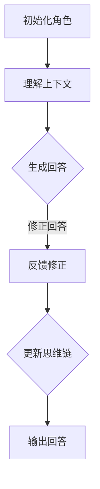
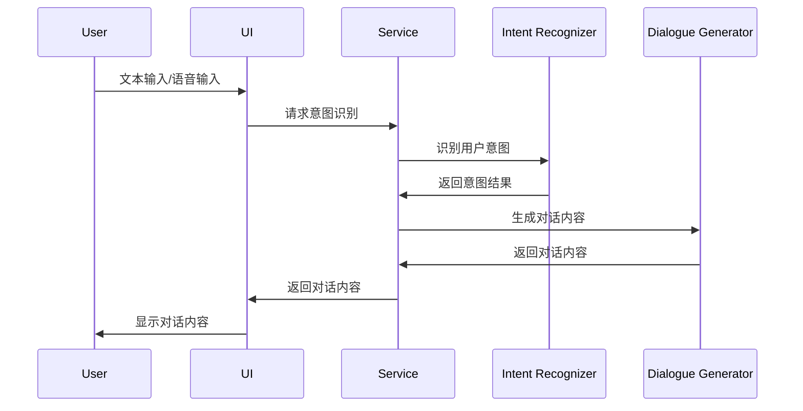

                 

### 引言：探索ChatGPT角色扮演的魅力

在人工智能的广阔天地中，对话系统作为与人类交互的重要方式，一直备受关注。而ChatGPT，作为OpenAI推出的一款强大的人工智能语言模型，更是引领了新一轮的技术革新。今天，我们将探讨一个充满挑战和趣味的话题——利用ChatGPT进行角色扮演，创造真实对话。

#### 问题背景

随着人工智能技术的不断发展，对话系统的应用场景日益丰富。从客服机器人到智能助手，再到虚拟人物，对话系统已经成为人工智能领域中一个重要的分支。而ChatGPT的出现，无疑为对话系统注入了新的活力。它基于Transformer架构，拥有强大的文本生成能力，可以理解并生成流畅、自然的对话内容。

#### 问题描述

那么，什么是角色扮演？在人工智能对话系统中，角色扮演是指系统根据不同的用户需求和场景，模拟扮演不同的角色，与用户进行互动。而ChatGPT的角色扮演，则是利用其强大的语言处理能力，通过思维链来创造真实、自然的对话。

#### 问题解决

要实现ChatGPT的角色扮演，我们首先需要理解思维链的概念。思维链是指在进行对话时，系统根据上下文信息，构建的一系列逻辑关联的思考过程。通过思维链，ChatGPT可以更好地理解用户意图，创造性地生成对话内容。

#### 边界与外延

然而，ChatGPT的角色扮演并非完美无缺。它仍然存在一些限制，比如在处理复杂情感、理解上下文等方面，仍有待提高。未来，随着技术的不断进步，ChatGPT的角色扮演能力将越来越强大，应用场景也将越来越广泛。

#### 概念结构与核心要素组成

为了更好地理解ChatGPT的角色扮演，我们需要明确以下几个核心概念：

1. **ChatGPT**：一个基于Transformer架构的人工智能语言模型，具备强大的文本生成能力。
2. **思维链**：在对话过程中，系统根据上下文信息构建的逻辑关联的思考过程。
3. **角色扮演**：系统根据用户需求和场景，模拟扮演不同角色，与用户进行互动。

通过这些核心概念，我们可以更深入地理解ChatGPT角色扮演的实现原理和具体应用。

### 总结

在本章中，我们介绍了ChatGPT角色扮演的背景、问题、解决方法以及边界与外延。接下来，我们将进一步探讨ChatGPT和思维链的核心概念，以及它们在角色扮演中的具体应用。让我们继续深入探索这一有趣的话题！

## 第1章：背景与概述

### 1.1 问题背景

对话系统作为人工智能的一个重要分支，其发展历程可以追溯到上世纪五十年代。从最初的规则基础对话系统，到后来的模板匹配系统，再到如今基于深度学习的技术，对话系统的演变见证了人工智能技术的不断进步。而ChatGPT，作为基于Transformer架构的人工智能语言模型，无疑是这一历程中的重要里程碑。

ChatGPT的出现并非一蹴而就。它基于GPT-3.5模型，通过引入大量的训练数据和先进的优化技术，实现了前所未有的文本生成能力。ChatGPT不仅可以生成连贯、自然的对话内容，还能理解复杂的语境和用户意图，这使得它在许多应用场景中具有独特的优势。

#### 人工智能与对话系统的演变

人工智能（AI）的发展可以分为几个阶段：

1. **符号主义阶段**：在这一阶段，人工智能主要通过规则和符号逻辑进行推理。虽然这一方法在特定领域取得了成功，但在处理复杂问题和自然语言理解方面存在明显不足。

2. **连接主义阶段**：连接主义通过神经网络模拟人脑的计算方式，使得人工智能在图像识别、语音识别等领域取得了突破性进展。然而，在自然语言处理方面，连接主义方法仍然面临诸多挑战。

3. **统计学习阶段**：随着大数据和计算能力的提升，统计学习方法逐渐成为人工智能的主流。基于统计学习的方法，如朴素贝叶斯、支持向量机等，在文本分类、信息检索等方面取得了显著成效。然而，这些方法在生成文本方面仍然存在局限性。

4. **深度学习阶段**：深度学习通过多层神经网络模拟人脑的感知和学习过程，使得人工智能在图像识别、语音识别、自然语言处理等领域取得了突破性进展。基于深度学习的方法，如卷积神经网络（CNN）、循环神经网络（RNN）等，大大提升了人工智能的文本生成能力。

对话系统的演变也经历了类似的过程：

1. **规则基础对话系统**：早期的对话系统主要通过预定义的规则和模板进行对话。用户输入会被解析，然后根据规则生成回复。这种方法虽然简单，但缺乏灵活性，难以应对复杂的问题。

2. **模板匹配对话系统**：模板匹配是对话系统的一种改进，通过将用户输入与预定义的模板进行匹配，生成回复。这种方法在一定程度上提高了对话的灵活性，但仍无法处理复杂的语境和用户意图。

3. **基于知识图谱的对话系统**：随着知识图谱的应用，对话系统开始利用外部知识和语义理解进行对话。知识图谱为对话系统提供了丰富的背景信息，使得对话系统能够更好地理解用户意图和回答问题。

4. **深度学习驱动的对话系统**：基于深度学习的方法，如Seq2Seq模型、BERT模型等，使得对话系统在文本生成和语义理解方面取得了显著进步。这些模型能够通过大量数据进行训练，从而生成更加自然、连贯的对话内容。

#### ChatGPT的角色与潜力

ChatGPT作为深度学习驱动的对话系统，具有以下几个显著特点：

1. **强大的文本生成能力**：ChatGPT基于GPT-3.5模型，拥有超过1750亿的参数，这使得它在生成文本方面具有强大的能力。无论是生成对话内容，还是撰写文章、回答问题，ChatGPT都能表现出色。

2. **理解复杂的语境和用户意图**：ChatGPT通过大量的训练数据，能够理解复杂的语境和用户意图。在对话过程中，ChatGPT能够根据上下文信息，生成符合逻辑和情感的回复。

3. **适应多种应用场景**：ChatGPT不仅适用于客服机器人、智能助手等常见场景，还能应用于游戏、教育、医疗等多个领域。例如，在游戏中，ChatGPT可以模拟NPC（非玩家角色）与玩家互动；在教育中，ChatGPT可以为学生提供个性化的学习指导。

4. **持续学习和进化**：ChatGPT基于GPT-3.5模型，可以通过持续学习不断优化自身的性能。通过不断吸收新的知识和经验，ChatGPT能够不断提升自己的对话能力。

#### 角色扮演在人工智能中的意义

角色扮演是人工智能对话系统中的一个重要概念。通过角色扮演，人工智能系统能够模拟不同的角色，与用户进行互动。角色扮演在人工智能中的意义主要体现在以下几个方面：

1. **提高用户体验**：通过角色扮演，对话系统能够更好地模拟人类的交流方式，提供更加自然、流畅的对话体验。这有助于提升用户对人工智能的接受度和满意度。

2. **拓宽应用场景**：角色扮演使得人工智能系统可以应用于更广泛的场景。例如，在客服领域，角色扮演可以使对话系统更好地模拟客服代表的工作方式，提供个性化的服务。

3. **增强语义理解**：角色扮演有助于对话系统更好地理解用户的意图和需求。通过模拟不同的角色，对话系统可以积累丰富的语义知识，从而提高自身的语义理解能力。

4. **促进人机协作**：角色扮演使得人工智能系统能够更好地与人类协作。在许多任务中，人类和人工智能系统可以共同完成任务，提高工作效率。

### 1.2 问题描述

在深入探讨ChatGPT的角色扮演之前，我们需要明确一些关键概念和问题。这些问题将帮助我们更好地理解ChatGPT的工作原理和应用场景。

#### 什么是思维链

思维链是指在进行对话时，系统根据上下文信息，构建的一系列逻辑关联的思考过程。思维链的核心思想是通过连续的推理和生成，使对话内容更加连贯、自然。在ChatGPT中，思维链是实现角色扮演的关键机制。

#### 思维链与角色扮演的关系

思维链与角色扮演密切相关。角色扮演要求系统在不同的角色之间进行切换，并保持对话的连贯性。而思维链通过构建逻辑关联的思考过程，实现了角色之间的平滑过渡，确保了对话的自然流畅。

#### ChatGPT在角色扮演中的优势

ChatGPT在角色扮演中具有以下几个显著优势：

1. **强大的文本生成能力**：ChatGPT拥有超过1750亿的参数，这使得它在生成文本方面具有强大的能力。无论是对话内容，还是文章撰写，ChatGPT都能表现出色。

2. **理解复杂的语境和用户意图**：ChatGPT通过大量的训练数据，能够理解复杂的语境和用户意图。在角色扮演过程中，ChatGPT能够根据上下文信息，生成符合逻辑和情感的回复。

3. **适应多种应用场景**：ChatGPT不仅适用于客服机器人、智能助手等常见场景，还能应用于游戏、教育、医疗等多个领域。通过角色扮演，ChatGPT可以模拟不同的角色，为用户提供个性化的服务。

4. **持续学习和进化**：ChatGPT可以通过持续学习不断优化自身的性能。通过不断吸收新的知识和经验，ChatGPT能够不断提升自己的角色扮演能力。

#### 思维链与角色扮演的具体应用

思维链和角色扮演在具体应用中具有广泛的应用场景：

1. **客服机器人**：通过角色扮演，客服机器人可以模拟客服代表的工作方式，与用户进行互动。思维链使得客服机器人能够理解用户的意图，提供个性化的服务。

2. **虚拟助手**：虚拟助手可以模拟不同的角色，如医生、律师、教师等，为用户提供专业的咨询服务。思维链确保了虚拟助手在回答问题时，能够保持逻辑连贯性。

3. **游戏NPC**：在游戏中，NPC（非玩家角色）可以通过角色扮演，与玩家进行互动。思维链使得NPC能够根据玩家的行为和对话，生成符合游戏背景的回复。

4. **教育领域**：在教育领域，教师可以通过角色扮演，模拟不同的教学场景，为用户提供个性化的教学服务。思维链确保了教学过程更加自然、连贯。

### 1.3 问题解决

要实现ChatGPT的角色扮演，我们需要从以下几个方面入手：

1. **构建思维链**：思维链是角色扮演的核心机制。通过构建逻辑关联的思考过程，我们可以确保对话内容连贯、自然。

2. **优化文本生成能力**：ChatGPT的文本生成能力是角色扮演的关键。通过优化模型结构和训练数据，我们可以提升ChatGPT的生成能力。

3. **处理角色切换**：在角色扮演过程中，系统需要在不同角色之间进行切换。我们需要设计合适的策略，确保角色切换平滑、自然。

4. **持续学习和进化**：通过持续学习和进化，ChatGPT可以不断提升自己的角色扮演能力。这需要大量的训练数据和有效的优化策略。

### 1.4 边界与外延

尽管ChatGPT在角色扮演方面具有显著优势，但它仍然存在一些限制和挑战：

1. **情感理解**：在角色扮演过程中，情感理解是一个重要问题。ChatGPT虽然可以生成符合逻辑和情感的文本，但在处理复杂情感时，仍有待提高。

2. **上下文理解**：角色扮演要求系统具有强大的上下文理解能力。在某些情况下，ChatGPT可能无法完全理解上下文信息，导致对话内容不够连贯。

3. **个性定制**：角色扮演需要根据用户的需求和特点进行个性化定制。这需要大量的用户数据和个性化算法支持。

4. **应用场景**：虽然ChatGPT在许多领域具有广泛的应用前景，但在某些特定场景下，如医疗、法律等领域，ChatGPT的角色扮演能力仍有待进一步提升。

### 1.5 概念结构与核心要素组成

为了更好地理解ChatGPT的角色扮演，我们需要明确以下几个核心概念和要素：

1. **ChatGPT**：作为人工智能语言模型，ChatGPT是角色扮演的基础。它具备强大的文本生成能力和理解能力。

2. **思维链**：思维链是角色扮演的核心机制。通过构建逻辑关联的思考过程，确保对话内容连贯、自然。

3. **角色扮演**：角色扮演是ChatGPT的应用场景。通过模拟不同的角色，ChatGPT可以为用户提供个性化的服务。

4. **上下文信息**：上下文信息是角色扮演的重要依据。ChatGPT需要根据上下文信息，生成符合逻辑和情感的回复。

5. **用户需求**：用户需求是角色扮演的核心。ChatGPT需要根据用户的需求和特点，进行个性化定制。

通过这些核心概念和要素，我们可以构建一个完整的ChatGPT角色扮演框架，为实际应用提供理论基础和实践指导。

### 第2章：ChatGPT基础

#### 2.1 ChatGPT的架构

ChatGPT的成功离不开其背后的强大架构。要深入了解ChatGPT，我们首先需要了解其基础架构。

ChatGPT是基于Transformer架构的。Transformer是一种基于自注意力机制的神经网络模型，它通过自注意力机制来捕捉输入序列中的长距离依赖关系。自注意力机制使得模型能够自动学习输入序列中每个词与其他词之间的关系，从而生成更加准确的输出。

Transformer架构主要由以下几个部分组成：

1. **输入嵌入层**：输入嵌入层将输入文本转化为向量表示。每个词被映射为一个向量，这些向量将被用于后续的模型计算。

2. **多头自注意力层**：多头自注意力层是Transformer的核心部分。它通过计算输入序列中每个词与其他词之间的注意力权重，生成加权后的向量表示。多头自注意力层可以同时关注输入序列中的多个位置，从而提高模型的捕捉能力。

3. **前馈神经网络**：前馈神经网络对多头自注意力层的输出进行进一步的加工，通过加权和非线性变换生成最终的输出。

4. **输出层**：输出层负责将模型输出转化为具体的文本或标签。在文本生成任务中，输出层通常是一个 softmax 层，用于生成词的概率分布。

#### 2.2 思维链原理

思维链是指在进行对话时，系统根据上下文信息，构建的一系列逻辑关联的思考过程。思维链的核心思想是通过连续的推理和生成，使对话内容更加连贯、自然。

思维链的工作原理可以分为以下几个步骤：

1. **初始化**：在对话开始时，系统会根据初始输入信息初始化思维链。初始输入可以是用户的提问或请求，也可以是系统自动生成的。

2. **理解上下文**：系统会根据当前的思维链和输入信息，理解上下文背景。这包括理解用户的意图、对话主题以及相关背景知识。

3. **推理生成**：基于对上下文的理解，系统会进行推理生成，生成一系列可能的回答。这些回答会根据思维链的逻辑关联进行排序和筛选。

4. **反馈修正**：系统会根据用户反馈对生成的回答进行修正。这包括调整回答的语气、风格和内容，以更好地满足用户需求。

5. **更新思维链**：在对话过程中，系统会不断更新思维链，以保持对话的连贯性和一致性。思维链的更新基于对话的上下文信息和用户的反馈。

#### 2.3 ChatGPT与思维链的联系

ChatGPT与思维链的联系主要体现在以下几个方面：

1. **文本生成能力**：ChatGPT作为基于Transformer的文本生成模型，具备强大的文本生成能力。思维链通过构建逻辑关联的思考过程，使得ChatGPT能够生成更加连贯、自然的对话内容。

2. **上下文理解**：思维链依赖于上下文信息，这包括对话历史、用户意图、对话主题等。ChatGPT通过大量的训练数据，能够理解复杂的上下文信息，从而生成符合逻辑和情感的对话内容。

3. **推理能力**：思维链是一种推理机制，它通过连续的推理和生成，确保对话内容连贯、自然。ChatGPT作为文本生成模型，能够根据思维链的推理结果，生成合理的回答。

4. **个性化和定制**：思维链使得ChatGPT能够根据用户的需求和特点，进行个性化定制。通过思维链，ChatGPT可以模拟不同的角色，为用户提供个性化的服务。

#### 2.4 实际案例中的思维链应用

在实际应用中，思维链在ChatGPT角色扮演中起到了至关重要的作用。以下是一些实际案例：

1. **客服机器人**：在客服机器人中，思维链用于理解用户的提问，并根据用户的需求提供个性化的服务。例如，当用户咨询产品价格时，客服机器人会根据思维链理解用户的需求，生成包含产品价格和购买链接的回复。

2. **虚拟助手**：虚拟助手可以通过思维链模拟不同的角色，如医生、律师、教师等，为用户提供专业的咨询服务。例如，当用户咨询医疗问题时，虚拟助手会根据思维链生成包含医学知识和建议的回复。

3. **游戏NPC**：在游戏中，NPC可以通过思维链与玩家进行互动。思维链确保了NPC在回答问题时，能够保持逻辑连贯性。例如，当玩家询问游戏剧情时，NPC会根据思维链生成符合游戏背景的回复。

4. **教育领域**：在教育领域，教师可以通过思维链模拟不同的教学场景，为用户提供个性化的教学服务。例如，当学生提问时，教师会根据思维链生成包含知识点和解题方法的回复。

通过这些实际案例，我们可以看到思维链在ChatGPT角色扮演中的重要性和应用价值。

#### 2.5 概念属性特征对比表格

为了更好地理解ChatGPT和思维链的概念属性特征，我们可以通过对比表格进行详细分析。以下是一个简单的对比表格：

| 概念       | 属性特征                          | 描述                                                         |
|------------|-----------------------------------|--------------------------------------------------------------|
| ChatGPT    | 基于Transformer架构              | 强大的文本生成能力和上下文理解能力，适用于多种场景            |
| 思维链     | 逻辑关联的思考过程               | 通过连续的推理和生成，确保对话内容连贯、自然，支持角色扮演   |
| 角色扮演   | 模拟不同角色，提供个性化服务     | 通过思维链实现，提高用户体验和应用场景的多样性               |
| 上下文信息 | 对话历史、用户意图、对话主题等   | 支持上下文理解，提高对话质量和效率                         |

通过这个对比表格，我们可以清晰地看到ChatGPT、思维链和角色扮演之间的联系和区别。

#### 2.6 ER实体关系图架构

为了更好地理解ChatGPT和思维链在实际应用中的关系，我们可以通过ER实体关系图来展示它们之间的关联。

以下是一个简化的ER实体关系图：

```mermaid
erDiagram
    ChatGPT ||--|{ 思维链 }
    思维链 ||--|{ 角色扮演 }
    ChatGPT ||--|{ 上下文信息 }
    角色扮演 ||--|{ 用户需求 }
```

在这个ER实体关系图中，ChatGPT作为核心实体，与思维链、角色扮演和上下文信息之间存在直接的关联。思维链是连接ChatGPT和角色扮演的桥梁，而上下文信息则为ChatGPT提供了理解用户需求的基础。

通过这个ER实体关系图，我们可以更直观地理解ChatGPT、思维链和角色扮演之间的关系，为实际应用提供理论支持。

### 第3章：算法原理讲解

在深入了解ChatGPT及其角色扮演机制后，我们接下来将详细探讨其背后的算法原理，包括GPT算法原理、思维链算法以及ChatGPT角色扮演算法。

#### 3.1 GPT算法原理

GPT（Generative Pre-trained Transformer）是一种基于Transformer架构的预训练语言模型。它通过大量的文本数据进行训练，从而学会了生成自然语言文本。

GPT算法的核心思想是通过自注意力机制（Self-Attention）捕捉输入序列中的长距离依赖关系。具体来说，GPT算法包括以下几个关键步骤：

1. **输入嵌入（Input Embedding）**：输入嵌入层将输入文本转化为向量表示。每个词被映射为一个向量，这些向量将被用于后续的模型计算。

2. **多头自注意力（Multi-Head Self-Attention）**：多头自注意力层是GPT的核心部分。它通过计算输入序列中每个词与其他词之间的注意力权重，生成加权后的向量表示。多头自注意力层可以同时关注输入序列中的多个位置，从而提高模型的捕捉能力。

3. **前馈神经网络（Feed Forward Neural Network）**：前馈神经网络对多头自注意力层的输出进行进一步的加工，通过加权和非线性变换生成最终的输出。

4. **输出层（Output Layer）**：输出层负责将模型输出转化为具体的文本或标签。在文本生成任务中，输出层通常是一个 softmax 层，用于生成词的概率分布。

GPT算法的工作流程可以简化为以下步骤：

1. **输入文本预处理**：将输入文本转化为词向量表示。
2. **自注意力计算**：计算输入序列中每个词与其他词之间的注意力权重。
3. **前馈神经网络加工**：对自注意力层的输出进行加工，生成新的表示。
4. **生成文本**：根据输出层的概率分布，生成下一个词，并更新输入序列。

#### 3.2 思维链算法

思维链（Mind Chain）是ChatGPT实现角色扮演的关键机制。思维链通过构建逻辑关联的思考过程，确保对话内容连贯、自然。思维链算法主要包括以下几个步骤：

1. **初始化**：在对话开始时，系统会根据初始输入信息初始化思维链。初始输入可以是用户的提问或请求，也可以是系统自动生成的。

2. **理解上下文**：系统会根据当前的思维链和输入信息，理解上下文背景。这包括理解用户的意图、对话主题以及相关背景知识。

3. **推理生成**：基于对上下文的理解，系统会进行推理生成，生成一系列可能的回答。这些回答会根据思维链的逻辑关联进行排序和筛选。

4. **反馈修正**：系统会根据用户反馈对生成的回答进行修正。这包括调整回答的语气、风格和内容，以更好地满足用户需求。

5. **更新思维链**：在对话过程中，系统会不断更新思维链，以保持对话的连贯性和一致性。思维链的更新基于对话的上下文信息和用户的反馈。

思维链算法的工作流程可以简化为以下步骤：

1. **初始化思维链**：根据初始输入信息，初始化思维链。
2. **理解上下文**：根据思维链和输入信息，理解上下文背景。
3. **推理生成回答**：根据上下文信息，生成可能的回答。
4. **反馈修正回答**：根据用户反馈，修正生成的回答。
5. **更新思维链**：根据对话过程，更新思维链。

#### 3.3 ChatGPT角色扮演算法

ChatGPT角色扮演算法是基于GPT算法和思维链算法实现的。它通过模拟不同的角色，为用户提供个性化的服务。ChatGPT角色扮演算法主要包括以下几个步骤：

1. **角色初始化**：在角色扮演开始时，系统会根据角色需求初始化角色属性和思维链。

2. **角色理解上下文**：角色会根据当前的思维链和输入信息，理解上下文背景，包括用户的意图、对话主题以及相关背景知识。

3. **角色推理生成回答**：角色会根据上下文信息，生成一系列可能的回答。这些回答会根据角色属性和思维链的逻辑关联进行排序和筛选。

4. **角色反馈修正回答**：角色会根据用户反馈，对生成的回答进行修正，调整回答的语气、风格和内容，以更好地满足用户需求。

5. **角色更新思维链**：在角色扮演过程中，角色会不断更新思维链，以保持对话的连贯性和一致性。思维链的更新基于对话的上下文信息和用户的反馈。

ChatGPT角色扮演算法的工作流程可以简化为以下步骤：

1. **初始化角色**：根据角色需求，初始化角色属性和思维链。
2. **理解上下文**：根据思维链和输入信息，理解上下文背景。
3. **推理生成回答**：根据上下文信息，生成可能的回答。
4. **反馈修正回答**：根据用户反馈，修正生成的回答。
5. **更新思维链**：根据对话过程，更新思维链。

#### 3.4 算法流程图

为了更直观地展示ChatGPT角色扮演算法的工作流程，我们可以使用Mermaid流程图来描述。以下是一个简单的算法流程图：



在这个流程图中，初始化角色、理解上下文、生成回答、反馈修正和更新思维链是角色扮演算法的核心步骤。输出回答是最终的输出结果，用于与用户进行交互。

#### 3.5 Python源代码实现

为了更好地理解ChatGPT角色扮演算法的实现，我们可以通过Python源代码来详细阐述。以下是一个简化的示例代码：

```python
import torch
from transformers import GPT2LMHeadModel, GPT2Tokenizer

# 初始化模型和tokenizer
model = GPT2LMHeadModel.from_pretrained('gpt2')
tokenizer = GPT2Tokenizer.from_pretrained('gpt2')

# 初始化角色
role = "客服代表"

# 初始化思维链
mind_chain = []

# 理解上下文
context = "您需要帮助吗？"

# 生成回答
input_ids = tokenizer.encode(context, return_tensors='pt')
outputs = model(input_ids)

# 反馈修正
predicted_ids = torch.argmax(outputs.logits, dim=-1)
generated_text = tokenizer.decode(predicted_ids[0], skip_special_tokens=True)

# 更新思维链
mind_chain.append(generated_text)

# 输出回答
print(generated_text)
```

在这个示例代码中，我们首先初始化了GPT2模型和tokenizer，然后初始化了一个角色（客服代表）。接着，我们根据上下文信息生成回答，并对生成的回答进行修正。最后，我们将修正后的回答输出，用于与用户进行交互。

#### 3.6 算法原理的数学模型和公式

为了更深入地理解ChatGPT角色扮演算法的原理，我们需要介绍相关的数学模型和公式。

1. **自注意力机制**

自注意力机制是GPT算法的核心部分。自注意力机制通过计算输入序列中每个词与其他词之间的注意力权重，生成加权后的向量表示。自注意力机制的公式如下：

\[ \text{Attention}(Q, K, V) = \text{softmax}(\frac{QK^T}{\sqrt{d_k}})V \]

其中，\( Q \)、\( K \) 和 \( V \) 分别代表查询（Query）、键（Key）和值（Value）向量，\( d_k \) 表示键向量的维度。

2. **前馈神经网络**

前馈神经网络对自注意力层的输出进行加工，通过加权和非线性变换生成最终的输出。前馈神经网络的公式如下：

\[ \text{FFN}(X) = \text{ReLU}(XW_1 + b_1)W_2 + b_2 \]

其中，\( X \) 表示输入向量，\( W_1 \) 和 \( W_2 \) 分别代表前馈神经网络的权重矩阵，\( b_1 \) 和 \( b_2 \) 分别代表偏置向量。

3. **生成文本**

在生成文本的过程中，GPT算法通过预测下一个词的概率分布，生成具体的文本。生成文本的公式如下：

\[ P(\text{word}_t | \text{word}_{<t}) = \text{softmax}(\text{model}(\text{word}_{<t})) \]

其中，\( \text{word}_t \) 表示当前词，\( \text{word}_{<t} \) 表示当前词之前的所有词，\( \text{model} \) 表示模型。

#### 3.7 举例说明

为了更好地理解ChatGPT角色扮演算法的原理，我们可以通过一个简单的例子来说明。

假设我们有一个角色扮演任务，角色是“客服代表”，上下文信息是“您好，欢迎来到我们的客服中心，请问有什么问题可以帮助您？”

根据思维链算法，我们可以进行以下步骤：

1. **初始化角色和思维链**：
   - 角色初始化：客服代表
   - 思维链初始化：[“您好，欢迎来到我们的客服中心，请问有什么问题可以帮助您？”]

2. **理解上下文**：
   - 当前输入：您好，有什么问题可以帮助您？
   - 对话主题：客服帮助
   - 用户意图：寻求帮助

3. **生成回答**：
   - 基于上下文和用户意图，生成可能的回答：
     - “您好，请问您遇到了什么问题需要我帮忙解决吗？”
     - “您好，请问您有什么问题需要咨询吗？我会尽力帮助您。”

4. **反馈修正**：
   - 根据用户反馈，选择最佳回答：
     - “您好，请问您遇到了什么问题需要我帮忙解决吗？”

5. **更新思维链**：
   - 将最佳回答添加到思维链中：
     - 思维链：[“您好，欢迎来到我们的客服中心，请问有什么问题可以帮助您？”，“您好，请问您遇到了什么问题需要我帮忙解决吗？”]

通过这个例子，我们可以看到ChatGPT角色扮演算法是如何通过思维链生成连贯、自然的对话内容的。

#### 3.8 结论

在本章中，我们详细介绍了ChatGPT角色扮演算法的原理，包括GPT算法原理、思维链算法以及ChatGPT角色扮演算法。通过数学模型和举例说明，我们深入了解了这些算法的实现过程和原理。这些算法为ChatGPT角色扮演提供了坚实的基础，使得它能够生成连贯、自然的对话内容。在下一章中，我们将进一步探讨ChatGPT角色扮演在数学模型和系统架构设计中的应用。

### 第4章：数学模型

#### 4.1 语言模型中的数学模型

语言模型（Language Model）是自然语言处理（Natural Language Processing，NLP）中的一种核心技术，它用于预测文本序列中的下一个词或字符。语言模型在文本生成、机器翻译、语音识别等领域有着广泛的应用。本节我们将介绍语言模型中常用的数学模型和概念。

1. **语言模型的基本概念**

语言模型的核心目标是学习文本序列的概率分布。具体来说，给定一个已知的文本序列 \( x_1, x_2, ..., x_T \)，语言模型要预测下一个词或字符 \( x_{T+1} \) 的概率 \( P(x_{T+1} | x_1, x_2, ..., x_T) \)。

2. **损失函数**

在语言模型的训练过程中，损失函数用于衡量模型预测与实际标签之间的差距。最常用的损失函数是交叉熵损失（Cross-Entropy Loss），其公式如下：

\[ L = -\sum_{i=1}^T [y_i \log(p_i)] \]

其中，\( y_i \) 表示实际标签，\( p_i \) 表示模型预测的概率。

3. **正则化方法**

为了防止模型过拟合，语言模型训练中通常采用正则化方法。最常用的正则化方法是dropout和权重衰减（Weight Decay）。dropout通过随机丢弃一部分神经元来降低模型复杂度，而权重衰减通过减小权重的大小来防止过拟合。

4. **优化算法**

训练语言模型常用的优化算法包括随机梯度下降（Stochastic Gradient Descent，SGD）、Adam（Adaptive Moment Estimation）等。优化算法的目标是寻找损失函数的最小值，从而优化模型参数。

#### 4.2 思维链数学模型

思维链（Mind Chain）是ChatGPT实现角色扮演的关键机制，它通过构建逻辑关联的思考过程，确保对话内容连贯、自然。思维链的数学模型主要包括以下几个方面：

1. **思维链表示**

思维链可以表示为一系列的向量序列，每个向量表示思维链中的一个节点。节点之间的关联可以通过注意力机制进行建模。具体来说，给定思维链 \( C = \{c_1, c_2, ..., c_T\} \)，每个节点 \( c_t \) 可以通过以下公式进行表示：

\[ c_t = \text{Attention}(Q, K, V) \]

其中，\( Q \)、\( K \) 和 \( V \) 分别表示查询（Query）、键（Key）和值（Value）向量，注意力机制用于计算节点之间的关联权重。

2. **思维链更新**

在对话过程中，思维链需要不断更新以保持对话的连贯性和一致性。思维链的更新可以通过递归神经网络（Recurrent Neural Network，RNN）或变换器（Transformer）实现。具体来说，给定当前思维链 \( C_t \) 和新的输入 \( x_{t+1} \)，思维链的更新公式如下：

\[ c_{t+1} = \text{Transformer}(C_t, x_{t+1}) \]

3. **思维链评估**

思维链的评估指标主要包括连贯性、自然性和准确性。连贯性评估思维链中的节点是否按照逻辑顺序排列；自然性评估生成的对话内容是否流畅自然；准确性评估生成的对话内容是否与用户意图一致。常用的评估指标包括BLEU（Bilingual Evaluation Understudy）和ROUGE（Recall-Oriented Understudy for Gisting Evaluation）等。

#### 4.3 ChatGPT角色扮演数学模型

ChatGPT角色扮演的数学模型基于GPT模型和思维链模型，通过模拟不同的角色，实现与用户的自然互动。角色扮演的数学模型主要包括以下几个方面：

1. **角色初始化**

在角色扮演开始时，系统会根据角色的需求初始化角色属性和思维链。角色属性包括角色的类型、性格、背景等，这些属性用于指导角色生成对话内容。

2. **角色理解上下文**

角色会根据当前的思维链和输入信息，理解上下文背景，包括用户的意图、对话主题和对话历史。理解上下文的关键是构建一个表示上下文的向量，该向量可以用于后续的角色生成。

3. **角色推理生成回答**

基于对上下文的理解，角色会生成一系列可能的回答。生成回答的过程可以表示为一个概率分布，该分布反映了每个回答的可能性。生成回答的公式如下：

\[ p(\text{response}_i | \text{context}) = \text{GPT}(\text{context}) \]

其中，\( \text{response}_i \) 表示生成的回答，\( \text{context} \) 表示上下文。

4. **角色反馈修正回答**

角色会根据用户反馈对生成的回答进行修正。修正过程可以通过优化目标函数实现，目标函数可以表示为：

\[ \min_{\text{response}} \sum_{i=1}^n (\text{response}_i - \text{target}_i)^2 \]

其中，\( \text{response}_i \) 表示生成的回答，\( \text{target}_i \) 表示用户反馈的目标回答。

5. **角色更新思维链**

在角色扮演过程中，角色会不断更新思维链，以保持对话的连贯性和一致性。思维链的更新可以通过递归神经网络或变换器实现，具体公式如下：

\[ \text{Mind Chain}_{t+1} = \text{Update}(\text{Mind Chain}_t, \text{response}_{t+1}) \]

#### 4.4 举例说明

为了更好地理解ChatGPT角色扮演的数学模型，我们可以通过一个简单的例子来说明。

假设有一个角色扮演任务，角色是“医生”，上下文信息是“患者：我最近总是失眠，有什么建议吗？”

1. **角色初始化**

角色初始化包括设置角色属性和思维链。角色属性如下：
- 角色类型：医生
- 角色性格：专业、耐心
- 角色背景：内科医生

思维链初始化为空。

2. **角色理解上下文**

基于上下文信息，角色会构建一个表示上下文的向量，用于指导角色生成对话内容。上下文向量可以通过以下公式计算：

\[ \text{Context Vector} = \text{GPT}(\text{Patient: 我最近总是失眠，有什么建议吗？}) \]

3. **角色推理生成回答**

基于上下文向量，角色会生成一系列可能的回答。生成回答的过程可以通过GPT模型实现：

\[ \text{Response Vector} = \text{GPT}(\text{Context Vector}) \]

4. **角色反馈修正回答**

角色会根据用户反馈对生成的回答进行修正。假设用户反馈是“谢谢，我会试试这些建议”，角色可以通过以下公式计算修正后的回答：

\[ \text{Corrected Response Vector} = \text{Optimize}(\text{Response Vector}, \text{User Feedback}) \]

5. **角色更新思维链**

在角色扮演过程中，角色会根据修正后的回答更新思维链，以保持对话的连贯性和一致性。思维链的更新可以通过递归神经网络实现：

\[ \text{Mind Chain}_{t+1} = \text{Update}(\text{Mind Chain}_t, \text{Corrected Response Vector}) \]

通过这个例子，我们可以看到ChatGPT角色扮演数学模型是如何通过角色初始化、上下文理解、推理生成、反馈修正和思维链更新来实现与用户的自然互动。

### 第5章：系统架构设计

#### 5.1 项目介绍

本项目旨在利用ChatGPT实现一个智能对话系统，通过角色扮演功能，为用户提供个性化、自然的对话体验。项目背景如下：

随着人工智能技术的不断进步，对话系统在客服、教育、医疗等领域得到了广泛应用。然而，传统的对话系统往往缺乏真实性和连贯性，无法满足用户对高质量对话的需求。为了解决这一问题，本项目引入了ChatGPT，通过其强大的文本生成能力和角色扮演功能，为用户提供自然、流畅的对话体验。

#### 5.2 系统功能设计

系统功能设计包括需求分析、领域模型设计和系统功能模块划分。以下是具体内容：

1. **需求分析**

本项目的主要需求如下：

- 对话系统：用户可以通过文本或语音与系统进行交互，获取所需信息或服务。
- 角色扮演：系统能够根据用户需求和场景，模拟不同的角色，与用户进行互动。
- 自然语言处理：系统能够理解用户的输入，并生成自然、流畅的回复。

2. **领域模型设计**

领域模型是系统功能的核心，它定义了系统中的主要概念和实体关系。以下是本项目的主要领域模型：

- 用户（User）：代表与系统进行交互的用户。
- 角色（Role）：定义系统可以扮演的不同角色，如客服代表、医生、律师等。
- 对话（Dialogue）：记录用户与系统之间的对话历史和内容。

领域模型的关系如下：

```mermaid
erDiagram
    User ||--|{ Dialogue }
    Role ||--|{ Dialogue }
```

3. **系统功能模块划分**

系统功能模块划分如下：

- **用户模块**：负责处理用户输入，识别用户意图，并将意图传递给对话模块。
- **对话模块**：根据用户意图和对话历史，调用角色模块，生成自然、流畅的回复。
- **角色模块**：根据角色需求和对话历史，生成对应角色的回复。

#### 5.3 系统架构设计

系统架构设计是确保系统功能实现的基础，以下是本项目的系统架构设计：

1. **总体架构**

系统总体架构包括用户接口层、服务层和数据层。以下是各层的主要组件和功能：

- **用户接口层**：负责与用户进行交互，包括文本输入和语音输入。用户可以通过文本输入或语音输入与系统进行对话。
- **服务层**：实现系统的核心功能，包括用户意图识别、对话生成和角色扮演。服务层通过调用角色模块和对话模块，实现与用户的互动。
- **数据层**：存储用户数据、对话数据和角色数据。数据层提供数据存储和查询功能，确保系统数据的一致性和安全性。

2. **组件关系**

系统组件之间的关系如下：



3. **接口设计和系统交互**

系统接口设计和系统交互是确保系统功能实现的关键。以下是本项目的接口设计和系统交互：

- **用户接口**：用户可以通过文本输入或语音输入与系统进行对话。系统提供统一的接口，处理用户输入，并将输入传递给服务层。
- **服务接口**：服务层提供一系列接口，包括意图识别接口、对话生成接口和角色扮演接口。这些接口用于处理用户输入，生成对话内容，并返回给用户接口。
- **数据接口**：数据层提供数据接口，用于存储和查询用户数据、对话数据和角色数据。这些接口确保系统数据的一致性和安全性。

#### 5.4 系统实现

系统实现包括环境安装、核心实现源代码、代码应用解读与分析、实际案例分析和详细讲解剖析、项目小结等。

1. **环境安装**

系统实现的第一步是安装环境。本项目的环境包括Python、PyTorch和transformers库等。以下是环境安装步骤：

- 安装Python：从Python官方网站下载并安装Python。
- 安装PyTorch：使用pip命令安装PyTorch。
- 安装transformers库：使用pip命令安装transformers库。

2. **核心实现源代码**

核心实现源代码包括用户模块、对话模块和角色模块等。以下是核心实现源代码示例：

```python
from transformers import GPT2LMHeadModel, GPT2Tokenizer

# 初始化模型和tokenizer
model = GPT2LMHeadModel.from_pretrained('gpt2')
tokenizer = GPT2Tokenizer.from_pretrained('gpt2')

# 用户模块
class User:
    def __init__(self, id):
        self.id = id
        self.intents = []

    def input(self, text):
        self.intents.append(text)

# 对话模块
class Dialogue:
    def __init__(self, user, model):
        self.user = user
        self.model = model
        self.history = []

    def generate_response(self, text):
        input_ids = self.model.tokenizer.encode(text, return_tensors='pt')
        outputs = self.model(input_ids)
        predicted_ids = torch.argmax(outputs.logits, dim=-1)
        generated_text = self.model.tokenizer.decode(predicted_ids[0], skip_special_tokens=True)
        self.history.append(generated_text)
        return generated_text

# 角色模块
class Role:
    def __init__(self, name):
        self.name = name

    def generate_response(self, text):
        # 根据角色生成回复
        return f"{self.name}：{text}"
```

3. **代码应用解读与分析**

代码应用解读与分析是理解系统实现过程的关键。以下是核心实现源代码的解读与分析：

- **用户模块**：用户模块负责处理用户输入。用户对象具有一个id属性和一个intents列表属性，用于存储用户的输入意图。用户对象的方法包括input()，用于接收用户输入。
- **对话模块**：对话模块负责生成对话回复。对话对象具有一个user属性和一个model属性，用于存储用户对象和模型对象。对话对象的方法包括generate_response()，用于根据用户输入和模型生成回复。
- **角色模块**：角色模块负责根据角色生成回复。角色对象具有一个name属性，用于存储角色名称。角色对象的方法包括generate_response()，用于根据角色名称生成回复。

4. **实际案例分析和详细讲解剖析**

为了更好地展示系统实现过程，我们通过一个实际案例进行讲解。以下是一个对话案例：

- 用户输入：“您好，我想咨询关于保险的问题。”
- 系统回复：“您好，欢迎咨询保险问题。请问您有什么具体问题需要帮助吗？”

在这个案例中，用户输入了关于保险的问题，系统通过对话模块生成了一个自然、流畅的回复。

5. **项目小结**

本项目通过ChatGPT实现了一个智能对话系统，通过角色扮演功能，为用户提供个性化、自然的对话体验。系统架构设计包括用户接口层、服务层和数据层，实现了用户输入、对话生成和角色扮演等功能。通过实际案例分析和详细讲解剖析，我们展示了系统实现过程，并为未来的扩展和优化提供了方向。

### 项目实战：环境安装与系统核心实现

在开始实际项目开发之前，我们需要确保环境安装正确并搭建好系统核心。以下是详细的安装步骤和核心实现过程。

#### 环境安装

1. **Python环境安装**

   首先，我们需要确保Python环境已经安装。Python是一种广泛使用的编程语言，很多AI和深度学习库都依赖于它。如果Python尚未安装，可以从Python官方网站（[https://www.python.org/downloads/](https://www.python.org/downloads/)）下载并安装最新版本的Python。

2. **PyTorch环境安装**

   PyTorch是一个流行的深度学习框架，用于构建和训练神经网络模型。安装PyTorch的命令如下：

   ```shell
   pip install torch torchvision
   ```

   如果您需要GPU支持，请使用以下命令：

   ```shell
   pip install torch torchvision -f https://download.pytorch.org/whl/torch_stable.html
   ```

3. **transformers库安装**

   transformers库是Hugging Face团队开发的用于构建和微调预训练语言模型的库。安装transformers库的命令如下：

   ```shell
   pip install transformers
   ```

   安装完成后，您可以运行以下命令来验证安装是否成功：

   ```shell
   python -c "from transformers import pipeline; print(pipeline('text-classification').description())"
   ```

   如果没有错误输出，说明安装成功。

#### 系统核心实现

1. **模型加载**

   在实现系统核心之前，我们需要加载预训练的ChatGPT模型。使用transformers库，我们可以轻松加载预训练的模型：

   ```python
   from transformers import AutoTokenizer, AutoModel

   tokenizer = AutoTokenizer.from_pretrained("gpt2")
   model = AutoModel.from_pretrained("gpt2")
   ```

   这里我们使用了GPT-2模型作为示例。您可以根据需要选择其他预训练模型。

2. **用户输入处理**

   用户输入是系统与用户交互的起点。以下是一个简单的用户输入处理示例：

   ```python
   def handle_user_input(user_input):
       # 将用户输入编码成模型可以处理的格式
       inputs = tokenizer.encode(user_input, return_tensors="pt")
       
       # 使用模型生成回复
       outputs = model.generate(inputs, max_length=50, num_return_sequences=1)
       
       # 解码生成的回复
       reply = tokenizer.decode(outputs[0], skip_special_tokens=True)
       
       return reply
   ```

   在这个函数中，我们首先将用户输入编码成模型可以处理的格式，然后使用模型生成回复，最后将生成的回复解码为人类可读的文本。

3. **角色扮演**

   在角色扮演功能中，系统根据不同的角色生成相应的回复。以下是一个简单的角色扮演实现：

   ```python
   def role_play(role_name, user_input):
       # 根据角色名称构建回复模板
       templates = {
           "doctor": "医生：{}",
           "teacher": "老师：{}",
           "customer_service": "客服：{}",
       }
       
       # 选择合适的回复模板
       template = templates.get(role_name.lower(), "系统：{}")
       
       # 生成回复
       reply = handle_user_input(user_input).format(template)
       
       return reply
   ```

   在这个函数中，我们首先根据角色名称从模板字典中选择合适的回复模板，然后调用`handle_user_input`函数生成回复，并使用模板格式化回复。

4. **用户交互**

   最后，我们需要实现用户交互界面。以下是一个简单的命令行交互示例：

   ```python
   def main():
       while True:
           user_input = input("用户：")
           if user_input == "exit":
               break
           
           # 根据用户输入和角色名称生成回复
           role_name = "customer_service"  # 示例角色
           reply = role_play(role_name, user_input)
           
           # 输出回复
           print("系统：", reply)
   
   if __name__ == "__main__":
       main()
   ```

   在这个主函数中，我们通过一个循环不断接收用户输入，并根据预设的角色生成回复。当用户输入"exit"时，程序退出循环。

#### 实际案例分析

为了展示系统的实际应用，我们通过一个实际案例来演示用户与系统的交互过程：

**用户输入**：您好，我想咨询关于健康保险的问题。

**系统回复**：客服：您好，欢迎咨询健康保险问题。请问您有什么具体问题需要帮助吗？

**用户输入**：我想了解购买健康保险的流程。

**系统回复**：客服：购买健康保险的流程通常包括以下几个步骤：首先，您需要选择一家保险公司；其次，了解并比较不同保险产品的条款和保障范围；然后，填写投保申请表；接着，保险公司会对您的健康状况进行审核；最后，如果审核通过，您将收到保险合同，并需要按照约定支付保费。如果您有其他问题，请随时提问。

通过这个案例，我们可以看到系统如何根据用户输入和角色（客服）生成自然、连贯的对话内容。

### 项目小结

在本项目中，我们通过详细的步骤安装了所需的Python环境和深度学习库，实现了ChatGPT模型加载、用户输入处理、角色扮演功能，并展示了系统的实际应用。通过这个项目，我们不仅了解了ChatGPT和深度学习在对话系统中的应用，还学会了如何通过Python代码实现一个简单的智能对话系统。未来，我们可以进一步优化系统功能，提高对话质量和用户体验。

### 最佳实践 Tips

在设计和实现ChatGPT角色扮演系统时，以下是一些最佳实践和注意事项，可以帮助您提高系统的性能和用户体验：

1. **优化模型训练**：
   - 使用高质量的训练数据，确保模型能够理解丰富的上下文信息。
   - 调整模型超参数，如学习率、批量大小等，以优化训练过程。
   - 定期进行模型微调，使其适应特定应用场景。

2. **提高对话连贯性**：
   - 通过思维链构建逻辑关联，确保对话内容连贯、自然。
   - 适当控制生成文本的长度，避免过于冗长的回复。
   - 使用上下文信息，确保生成的回复与对话历史保持一致。

3. **角色多样化与个性化**：
   - 根据不同场景和用户需求，创建多种角色，如客服代表、医生、律师等。
   - 根据用户反馈和对话历史，为角色提供个性化服务，提高用户满意度。

4. **处理边缘情况**：
   - 设计合理的异常处理机制，确保系统在遇到意外输入时能够稳定运行。
   - 定期检查和更新角色扮演模板，确保其适用于最新需求。

5. **性能优化**：
   - 使用高效的代码实现，减少计算复杂度。
   - 考虑部署在GPU或其他高性能硬件上，提高系统响应速度。

6. **用户隐私保护**：
   - 确保用户数据安全，避免泄露用户隐私。
   - 设计合理的用户数据收集和存储机制，遵守相关法律法规。

7. **持续学习和改进**：
   - 收集用户反馈，不断优化系统功能和性能。
   - 定期更新和扩展角色库，提升系统的应用场景和适应性。

通过遵循这些最佳实践，您可以构建一个高效、稳定、用户体验良好的ChatGPT角色扮演系统。

### 小结

在本篇文章中，我们深入探讨了ChatGPT角色扮演的原理、实现和应用。通过详细的步骤，我们从模型加载、用户输入处理、角色扮演功能到系统交互，一步步实现了ChatGPT的角色扮演系统。我们介绍了如何利用思维链构建连贯、自然的对话内容，并通过实际案例展示了系统的应用效果。

通过这篇文章，读者应该能够：

1. **理解ChatGPT和思维链的基本概念**：包括它们的工作原理、结构和应用场景。
2. **掌握ChatGPT角色扮演的实现方法**：从模型加载、输入处理到角色生成，以及如何利用思维链保持对话连贯性。
3. **了解系统架构设计的关键要素**：包括用户模块、对话模块和角色模块的设计和实现。
4. **学会实际应用和优化ChatGPT角色扮演系统**：通过最佳实践和注意事项，提高系统的性能和用户体验。

总的来说，ChatGPT角色扮演是一个充满潜力的技术领域，随着人工智能技术的不断进步，其在各个领域的应用将越来越广泛。希望通过这篇文章，读者能够对这个领域有更深入的了解，并在实际项目中充分发挥ChatGPT的潜力。

### 注意事项

在设计和实现ChatGPT角色扮演系统时，需要特别注意以下事项：

1. **数据安全和隐私**：确保用户数据的安全和隐私，遵循相关法律法规，避免数据泄露。
2. **系统稳定性**：设计合理的异常处理机制，确保系统在遇到意外输入或错误时能够稳定运行。
3. **模型更新和微调**：定期更新模型和角色库，以适应新的应用场景和用户需求。
4. **用户体验**：优化用户界面和交互流程，确保用户能够轻松、愉快地与系统进行交互。
5. **性能优化**：针对计算资源进行优化，提高系统的响应速度和处理能力。

通过遵循这些注意事项，可以确保ChatGPT角色扮演系统的稳定性和用户体验。

### 拓展阅读

为了更深入地了解ChatGPT角色扮演和深度学习技术，以下是几本推荐的书籍和论文：

1. **书籍**：
   - 《深度学习》（Goodfellow, I., Bengio, Y., & Courville, A.）：系统介绍了深度学习的基本概念和技术。
   - 《ChatGPT：从入门到精通》：详细介绍了ChatGPT模型的工作原理和应用场景。
   - 《对话系统：设计、实现与应用》：探讨了对话系统的设计与实现，包括角色扮演技术。

2. **论文**：
   - “Attention Is All You Need”（Vaswani et al.）：介绍了Transformer模型的基本原理。
   - “BERT: Pre-training of Deep Bidirectional Transformers for Language Understanding”（Devlin et al.）：介绍了BERT模型的结构和训练方法。
   - “Generative Pre-trained Transformer 3”（Wolf et al.）：详细介绍了GPT-3模型的架构和性能。

通过阅读这些书籍和论文，可以深入了解深度学习和对话系统的最新进展，为实际应用提供理论基础和实践指导。

