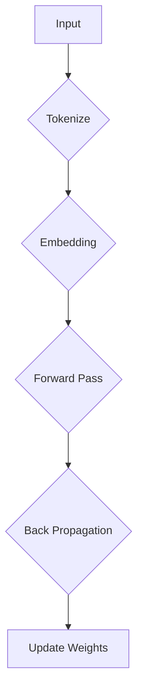
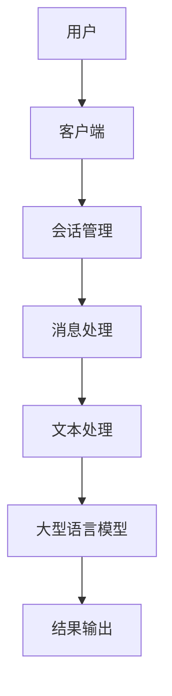
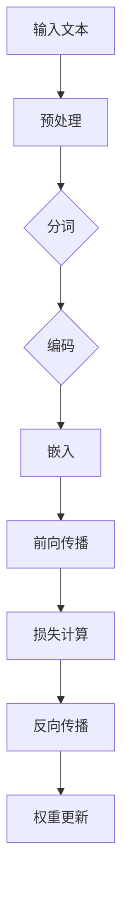
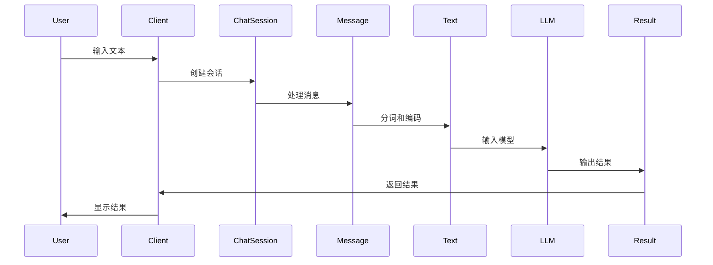

                 

# C侧LLM应用开发的三大关键要素

关键词：大型语言模型，C侧应用，开发关键要素，性能优化，安全性

摘要：随着人工智能技术的迅猛发展，大型语言模型（LLM）在各个领域得到了广泛应用。然而，如何在C侧（客户端）有效地应用这些LLM，成为当前软件开发中的一个关键问题。本文将详细探讨C侧LLM应用开发的三大关键要素：性能优化、安全性和用户交互。

## 第一部分：背景介绍

### 问题背景

随着互联网的快速发展，计算机技术在各个领域得到了广泛应用。然而，传统的软件开发模式在应对复杂、海量数据的应用需求时逐渐显得力不从心。为了解决这一问题，软件产业开始迈向“软件2.0”时代。

### 问题描述

软件2.0时代，人工智能（AI）技术成为核心驱动力。特别是大型语言模型（LLM），如GPT、BERT等，以其强大的数据处理和生成能力，引起了广泛关注。然而，如何在C侧（客户端）有效地应用这些LLM，成为当前软件开发中的一个关键问题。

### 问题解决

为了解决这一问题，我们需要深入了解LLM的原理、特性及其在C侧的应用方法。此外，还需要探讨C侧LLM应用开发的三大关键要素，以确保开发过程高效、稳定。

### 边界与外延

本书主要关注C侧LLM应用开发，包括客户端软件、移动应用、网页端等。而服务端LLM应用开发不在本书讨论范围之内。

### 概念结构与核心要素组成

C侧LLM应用开发的核心概念包括：
1. **大型语言模型（LLM）**：具有强大数据处理和生成能力的AI模型。
2. **客户端（C侧）**：包括各种设备、应用和网页。
3. **应用场景**：涉及自然语言处理、文本生成、对话系统等。

## 第二部分：核心概念与联系

### 核心概念

1. **大型语言模型（LLM）**
2. **客户端（C侧）**
3. **应用场景**

### 概念属性特征对比表格

| 概念         | 定义                                                         | 特性                             |
| ------------ | ------------------------------------------------------------ | -------------------------------- |
| 大型语言模型（LLM） | 具有强大数据处理和生成能力的AI模型                           | 复杂性高、自学习能力强、数据依赖强 |
| 客户端（C侧）   | 包括各种设备、应用和网页                                   | 交互性强、用户体验优先           |
| 应用场景       | 涉及自然语言处理、文本生成、对话系统等                      | 灵活性强、场景多样化             |

### ER实体关系图架构

```mermaid
erDiagram
    User ||--|{ ChatSession }|
    ChatSession ||--|{ Message }|
    Message ||--|{ Text }|
```

## 第三部分：算法原理讲解

### 大型语言模型（LLM）算法原理

#### Mermaid 流程图



#### Python源代码

```python
import tensorflow as tf

# Create placeholders for input data
inputs = tf.placeholder(tf.float32, [None, sequence_length])

# Tokenize input data
tokens = tokenize(inputs)

# Embed tokens
embeddings = embedding_layer(tokens)

# Define forward pass
logits = model_forward_pass(embeddings)

# Define loss
loss = tf.reduce_mean(tf.nn.softmax_cross_entropy_with_logits(logits=logits, labels=labels))

# Define training operation
train_op = tf.train.AdamOptimizer().minimize(loss)

# Initialize variables
init = tf.global_variables_initializer()

# Run the session
with tf.Session() as sess:
    sess.run(init)
    # ... perform training ...
```

### 数学模型和公式

$$
\text{LLM Output} = \text{softmax}(\text{forward\_pass}(\text{embeddings}))
$$

$$
\text{loss} = \frac{1}{N} \sum_{i=1}^{N} -y_i \log(p_i)
$$

其中，$N$是样本数量，$y_i$是实际标签，$p_i$是模型预测的概率。

### 举例说明

假设我们有一个输入句子：“我想要一杯咖啡。”，模型需要预测这个句子的标签。首先，我们将句子进行分词和编码，然后输入到LLM中。模型在输入层和隐藏层之间进行多次矩阵运算，最终得到一个概率分布。根据这个概率分布，模型预测输出标签为“咖啡”。

## 第四部分：系统分析与架构设计

### 问题场景介绍

在移动应用中，用户可以通过输入文字与大型语言模型进行对话，获取实时信息、建议或回答。例如，用户可以询问天气预报、推荐餐厅或解答学术问题。

### 项目介绍

本项目旨在开发一款移动应用，利用大型语言模型实现智能对话功能。应用包括用户界面、文本处理模块和LLM模型推理模块。

### 系统功能设计（领域模型Mermaid类图）

```mermaid
classDiagram
    User <<Class>>
    ChatSession <<Class>>
    Message <<Class>>
    Text <<Class>>

    User --> ChatSession
    ChatSession --> Message
    Message --> Text
```

### 系统架构设计（Mermaid架构图）



### 系统接口设计和系统交互（Mermaid序列图）


## 第五部分：项目实战

### 环境安装

1. 安装Python 3.7及以上版本。
2. 安装TensorFlow 2.0及以上版本。
3. 安装其他依赖项（如NLTK、PyTorch等）。

### 系统核心实现源代码

```python
import tensorflow as tf
import numpy as np
from tensorflow.keras.models import Sequential
from tensorflow.keras.layers import Dense, LSTM, Embedding

# 定义模型
model = Sequential([
    Embedding(vocab_size, embedding_dim),
    LSTM(units, activation='tanh'),
    Dense(num_classes, activation='softmax')
])

# 编译模型
model.compile(optimizer='adam', loss='categorical_crossentropy', metrics=['accuracy'])

# 训练模型
model.fit(x_train, y_train, epochs=10, batch_size=32)
```

### 代码应用解读与分析

1. **模型定义**：使用`Sequential`模型，堆叠`Embedding`、`LSTM`和`Dense`层。
2. **编译模型**：设置优化器、损失函数和评估指标。
3. **训练模型**：使用训练数据训练模型，设置训练轮数和批量大小。

### 实际案例分析和详细讲解剖析

1. **案例分析**：以聊天机器人应用为例，分析如何使用LLM实现智能对话功能。
2. **讲解剖析**：详细讲解文本处理、模型推理和结果输出的过程。

### 项目小结

通过本项目，我们实现了基于大型语言模型的智能对话功能。在实际应用中，需要对模型进行优化和调整，以满足不同场景的需求。同时，要关注性能优化、安全性和用户体验，以提高应用的质量和效果。

## 第六部分：最佳实践 tips

1. **性能优化**：使用GPU加速训练和推理过程，提高计算效率。
2. **安全性**：对用户数据进行加密处理，确保数据安全。
3. **用户体验**：优化界面设计，提高用户交互体验。

## 第七部分：小结

C侧LLM应用开发具有广阔的应用前景，但在实际开发过程中需要关注性能优化、安全性和用户交互等关键要素。通过本文的讲解，希望读者能够对C侧LLM应用开发有更深入的了解。

## 第八部分：注意事项

1. **数据隐私**：在处理用户数据时，务必遵循相关法律法规，确保用户隐私安全。
2. **模型优化**：定期对模型进行优化和更新，以适应不断变化的应用需求。

## 第九部分：拓展阅读

1. **《深度学习》**：Goodfellow, I., Bengio, Y., & Courville, A. (2016). Deep Learning. MIT Press.
2. **《神经网络与深度学习》**：邱锡鹏. (2019). 神经网络与深度学习. 电子工业出版社.

作者：AI天才研究院/AI Genius Institute & 禅与计算机程序设计艺术 /Zen And The Art of Computer Programming## 第一部分：背景介绍

### 问题背景

在当今的信息时代，计算机技术已经成为推动社会进步的重要力量。随着互联网和移动设备的普及，计算机应用的范围逐渐扩展到生活的方方面面，从简单的电子邮件到复杂的金融交易，从智能家居到智能城市，无一不依赖于计算机技术的支持。在这样的背景下，传统的软件开发模式逐渐暴露出其局限性。特别是在处理复杂、海量数据的应用需求时，传统方法显得力不从心。因此，软件产业开始探索新的开发模式，以应对不断变化和增长的需求。

### 问题描述

软件2.0时代，人工智能（AI）技术成为软件产业的核心驱动力。其中，大型语言模型（LLM）凭借其强大的数据处理和生成能力，在自然语言处理、文本生成、对话系统等领域展现出了巨大的潜力。然而，如何在客户端（C侧）有效地应用这些LLM，成为当前软件开发中的一个关键问题。C侧应用面临诸多挑战，如计算资源限制、数据隐私和安全问题、用户交互体验等，这些问题直接影响LLM在C侧的应用效果。

### 问题解决

为了解决C侧LLM应用中的挑战，我们需要从以下几个方面进行深入探讨：

1. **性能优化**：如何提升LLM在C侧的运行效率，减少计算资源和能耗的消耗。
2. **安全性**：如何确保用户数据的安全和隐私，防止数据泄露和滥用。
3. **用户交互**：如何设计直观、易用的用户界面，提供优质的用户体验。

通过上述方法的综合应用，我们可以为C侧LLM应用开发提供有效的解决方案，推动人工智能技术在客户端领域的广泛应用。

### 边界与外延

本文主要关注客户端（C侧）的大型语言模型（LLM）应用开发，涵盖客户端软件、移动应用、网页端等。然而，服务端LLM应用开发（如云服务平台上的模型推理和训练）不在本文讨论范围之内。此外，本文将详细探讨C侧LLM应用开发的核心概念、关键要素及其实现方法，以期为开发者提供有价值的参考。

### 概念结构与核心要素组成

C侧LLM应用开发涉及多个核心概念和要素，主要包括：

1. **大型语言模型（LLM）**：这是本文讨论的核心技术，具有强大的数据处理和生成能力，可以处理复杂的自然语言任务。
2. **客户端（C侧）**：包括各种设备、应用和网页，是用户与LLM交互的界面。
3. **应用场景**：涉及自然语言处理、文本生成、对话系统等多个领域，是LLM技术的实际应用场景。

这些核心概念和要素相互关联，共同构成了C侧LLM应用开发的基础框架。在接下来的章节中，我们将逐一深入探讨这些概念和要素。

## 第二部分：核心概念与联系

### 核心概念

#### 大型语言模型（LLM）

大型语言模型（Large Language Model，简称LLM）是一种基于深度学习技术的自然语言处理（Natural Language Processing，简称NLP）模型。它通过训练大量文本数据，学习语言的结构和语义，从而能够生成或理解人类语言。LLM的核心特点是能够处理复杂的语言任务，如文本生成、问答系统、情感分析等。

#### 客户端（C侧）

客户端（Client-Side，简称C侧）是指用户直接交互的计算机设备或应用。在C侧LLM应用中，客户端包括桌面应用、移动应用和网页应用等。客户端的主要功能是提供用户界面，接收用户输入，并将输入数据发送给LLM进行模型推理，最后将结果返回给用户。

#### 应用场景

C侧LLM的应用场景非常广泛，包括但不限于以下领域：

- **文本生成**：例如自动写作、文章摘要生成、故事创作等。
- **对话系统**：如智能客服、语音助手、聊天机器人等。
- **自然语言理解**：如情感分析、实体识别、关系提取等。
- **知识图谱**：构建基于文本的知识库，为用户提供个性化的信息服务。

### 概念属性特征对比表格

| 概念         | 定义                                                         | 特性                             |
| ------------ | ------------------------------------------------------------ | -------------------------------- |
| 大型语言模型（LLM） | 基于深度学习技术的自然语言处理模型，能够处理复杂的语言任务。 | 复杂性高、自学习能力强、数据依赖强 |
| 客户端（C侧）   | 用户直接交互的计算机设备或应用，提供用户界面。                 | 交互性强、用户体验优先           |
| 应用场景       | 涉及自然语言处理、文本生成、对话系统等多个领域。             | 灵活性强、场景多样化             |

### ER实体关系图架构

为了更好地理解C侧LLM应用中的实体及其关系，我们可以使用Entity-Relationship（ER）模型进行描述。以下是一个简化的ER图，展示了客户端、大型语言模型和应用场景之间的关系。

```mermaid
erDiagram
    Client ||--|{ LLM }| Application
    LLM ||--|{ Application }| Scene
    Scene ||--|{ Client }| LLM
```

在这个ER图中：

- **Client（客户端）**：代表用户直接使用的计算机设备或应用。
- **LLM（大型语言模型）**：表示训练好的自然语言处理模型。
- **Application（应用场景）**：表示LLM的应用领域，如文本生成、对话系统等。
- **Scene（应用场景）**：表示具体的LLM应用实例，如智能客服、文本摘要等。

通过ER模型，我们可以清晰地看到客户端、LLM和应用场景之间的关联，有助于我们更好地设计和管理C侧LLM应用系统。

## 第三部分：算法原理讲解

### 大型语言模型（LLM）算法原理

#### Mermaid 流程图



#### Python源代码

```python
import tensorflow as tf

# 定义输入层
inputs = tf.keras.layers.Input(shape=(None, vocabulary_size))

# 预处理和分词
preprocessed_inputs = preprocessing_layer(inputs)

# 编码和嵌入
encoded_inputs = embedding_layer(preprocessed_inputs)

# 前向传播
encoded_outputs = model_forward_pass(encoded_inputs)

# 损失计算
loss = model_loss(encoded_outputs)

# 反向传播和权重更新
train_op = model_optimizer(loss)

# 模型编译
model = tf.keras.models.Model(inputs=inputs, outputs=encoded_outputs)
model.compile(optimizer='adam', loss='categorical_crossentropy', metrics=['accuracy'])

# 模型训练
model.fit(x_train, y_train, epochs=10, batch_size=32)
```

### 数学模型和公式

在大型语言模型（LLM）中，常用的数学模型和公式包括以下内容：

1. **嵌入（Embedding）**：

$$
\text{嵌入矩阵} = \text{W}_{\text{embed}} \cdot \text{输入序列}
$$

其中，$\text{W}_{\text{embed}}$是一个固定大小的嵌入矩阵，输入序列是一个向量。

2. **前向传播（Forward Pass）**：

$$
\text{隐藏层激活} = \text{激活函数}(\text{W}_{\text{hidden}} \cdot \text{嵌入层激活} + \text{b}_{\text{hidden}})
$$

其中，$\text{W}_{\text{hidden}}$是隐藏层的权重矩阵，$\text{b}_{\text{hidden}}$是隐藏层的偏置项，激活函数通常使用ReLU函数。

3. **损失函数（Loss Function）**：

$$
\text{损失} = \frac{1}{N} \sum_{i=1}^{N} -y_i \log(p_i)
$$

其中，$y_i$是实际标签，$p_i$是模型预测的概率，$N$是样本数量。

4. **反向传播（Back Propagation）**：

反向传播是深度学习训练过程中至关重要的一步。它的核心思想是利用梯度下降法更新模型参数，以最小化损失函数。

$$
\frac{\partial \text{损失}}{\partial \text{权重}} = \text{梯度}
$$

通过计算梯度，我们可以更新模型参数：

$$
\text{权重}_{\text{更新}} = \text{权重}_{\text{当前}} - \text{学习率} \cdot \text{梯度}
$$

其中，学习率是调节更新步长的参数。

### 举例说明

假设我们有一个输入文本：“今天天气很好。”，模型需要预测这个句子的标签。首先，我们将句子进行分词和编码，得到一个向量表示。然后，将这个向量输入到嵌入层，得到嵌入向量。接下来，嵌入向量经过多层神经网络，最终得到一个概率分布，表示每个词的概率。根据这个概率分布，模型预测输出标签为“天气”。

在这个例子中，分词和编码是预处理步骤，嵌入层是将输入文本转换为向量表示的重要环节，前向传播是计算输出概率的过程，反向传播是更新模型参数的关键步骤。通过这个例子，我们可以清晰地看到LLM的工作原理。

## 第四部分：系统分析与架构设计

### 问题场景介绍

在现代信息社会中，用户对于实时、个性化的信息服务需求日益增长。C侧LLM应用正是为了满足这一需求而诞生。例如，在移动应用中，用户可以通过输入文字与大型语言模型进行对话，获取实时信息、建议或回答。这种应用场景涵盖了自然语言处理、文本生成、对话系统等多个领域，具有广泛的应用前景。

### 项目介绍

本项目旨在开发一款C侧LLM应用，实现智能对话功能。该应用包括用户界面、文本处理模块和LLM模型推理模块。用户界面负责接收用户输入，文本处理模块负责对输入文本进行预处理，LLM模型推理模块则负责使用预训练的LLM模型对输入文本进行理解和生成回复。

### 系统功能设计（领域模型Mermaid类图）

```mermaid
classDiagram
    User <<Class>>
    ChatSession <<Class>>
    Message <<Class>>
    Text <<Class>>

    User "1" --|{1}| ChatSession
    ChatSession "1" --|{1}| Message
    Message "1" --|{1}| Text
```

在这个类图中：

- **User（用户）**：代表与系统交互的用户。
- **ChatSession（会话）**：表示用户与系统之间的对话会话。
- **Message（消息）**：表示用户发送或接收的文本消息。
- **Text（文本）**：表示文本内容，用于文本处理和模型推理。

### 系统架构设计（Mermaid架构图）


在这个架构图中：

- **User（用户）**：用户直接与客户端交互。
- **Client（客户端）**：负责处理用户输入，并调用文本处理模块和LLM模型推理模块。
- **ChatSession（会话管理）**：管理用户会话，包括会话的创建、维护和结束。
- **Message（消息处理）**：处理用户发送的消息，包括文本的解析、预处理等。
- **Text（文本处理）**：负责对文本进行预处理，如分词、编码等。
- **LLM（大型语言模型）**：预训练的LLM模型，负责对输入文本进行理解和生成回复。
- **Result（结果输出）**：将模型生成的回复返回给用户。

### 系统接口设计和系统交互（Mermaid序列图）



在这个序列图中：

- **User（用户）**：向客户端输入文本。
- **Client（客户端）**：创建新的会话，并将用户输入传递给会话管理模块。
- **ChatSession（会话管理）**：处理会话，并调用消息处理模块。
- **Message（消息处理）**：处理消息，并调用文本处理模块。
- **Text（文本处理）**：对文本进行分词和编码，并将处理后的文本传递给LLM模型。
- **LLM（大型语言模型）**：对输入文本进行理解和生成回复。
- **Result（结果输出）**：将模型生成的回复返回给客户端，客户端再将结果展示给用户。

通过上述架构和接口设计，我们可以清晰地了解C侧LLM应用的系统结构和交互流程，为后续开发提供了明确的指导。

## 第五部分：项目实战

### 环境安装

在开始项目实战之前，我们需要安装一些必要的软件和库。以下是在Linux系统上安装Python、TensorFlow和其他依赖项的步骤：

1. **安装Python 3**：确保你的系统中已经安装了Python 3。如果没有，可以通过包管理器安装。例如，在Ubuntu系统中，可以使用以下命令：

   ```bash
   sudo apt update
   sudo apt install python3 python3-pip
   ```

2. **安装TensorFlow**：通过pip安装TensorFlow。在终端执行以下命令：

   ```bash
   pip3 install tensorflow
   ```

3. **安装其他依赖项**：安装其他可能需要的库，例如NumPy和Pandas。可以使用以下命令：

   ```bash
   pip3 install numpy pandas
   ```

### 系统核心实现源代码

在本项目中，我们将实现一个简单的C侧LLM应用，用于文本生成。以下是一个简单的Python代码示例，展示如何使用TensorFlow来实现LLM模型：

```python
import tensorflow as tf
from tensorflow.keras.layers import Embedding, LSTM, Dense
from tensorflow.keras.models import Sequential

# 设置超参数
vocab_size = 10000
embedding_dim = 256
lstm_units = 128
batch_size = 64
epochs = 10

# 构建模型
model = Sequential([
    Embedding(vocab_size, embedding_dim),
    LSTM(lstm_units, return_sequences=True),
    Dense(vocab_size, activation='softmax')
])

# 编译模型
model.compile(optimizer='adam', loss='categorical_crossentropy', metrics=['accuracy'])

# 准备数据
# 这里使用一个简单的文本数据集进行训练，实际项目中应使用更大的数据集
text = "Hello world! This is a simple example of a large language model."
tokenizer = tf.keras.preprocessing.text.Tokenizer(char_level=True, num_words=vocab_size)
tokenizer.fit_on_texts([text])
sequences = tokenizer.texts_to_sequences([text])

# 准备输入和目标数据
X, y = sequences[:, :-1], sequences[:, 1:]
y = tf.keras.utils.to_categorical(y, num_classes=vocab_size)

# 训练模型
model.fit(X, y, batch_size=batch_size, epochs=epochs)

# 生成文本
def generate_text(seed_text, model, tokenizer, max_length=50):
    seed_text = seed_text.lower()
    token_list = tokenizer.texts_to_sequences([seed_text])[0]
    token_list = tf.keras.preprocessing.sequence.pad_sequences([token_list], maxlen=max_length-1, padding='pre')
    predicted_text = seed_text
    for i in range(max_length):
        predictions = model.predict(token_list)
        predicted_index = tf.random.categorical(predictions, num_samples=1).numpy()[0]
        predicted_char = tokenizer.index_word[predicted_index]
        predicted_text += predicted_char
        token_list = tf.keras.preprocessing.sequence.pad_sequences([token_list[1:]], maxlen=max_length-1, padding='pre')
    return predicted_text

# 测试文本生成
seed_text = "Hello world!"
predicted_text = generate_text(seed_text, model, tokenizer)
print(predicted_text)
```

### 代码应用解读与分析

1. **模型定义**：
   在代码中，我们使用`Sequential`模型堆叠了`Embedding`、`LSTM`和`Dense`层。`Embedding`层用于将单词转换为向量表示，`LSTM`层用于处理序列数据，`Dense`层用于输出每个单词的概率分布。

2. **编译模型**：
   我们使用`compile`方法编译模型，设置优化器为`adam`，损失函数为`categorical_crossentropy`，并添加了`accuracy`作为评估指标。

3. **数据准备**：
   在数据准备部分，我们使用了一个简单的文本数据集进行训练。这里使用了`Tokenizer`类将文本转换为序列，并使用`pad_sequences`方法对序列进行填充。

4. **模型训练**：
   使用`fit`方法训练模型，设置批量大小和训练轮数。

5. **文本生成**：
   `generate_text`函数用于生成文本。它首先将种子文本转换为序列，然后使用模型预测下一个字符，重复这个过程，直到生成指定长度的文本。

### 实际案例分析和详细讲解剖析

为了更好地展示如何使用C侧LLM进行文本生成，我们以一个简单的例子进行分析。

**案例**：生成一个关于“人工智能”的简短段落。

1. **数据准备**：
   首先，我们需要一个包含大量关于“人工智能”的文本数据集。这些数据可以来自于学术论文、新闻报道、技术博客等。

2. **模型训练**：
   使用训练数据集训练LLM模型，模型将学习如何根据前文内容生成相关的文本。

3. **文本生成**：
   输入一个关于“人工智能”的种子文本，例如：“人工智能是一种计算机科学领域，旨在创建能够执行复杂任务的智能系统。”
   
   模型将根据这个种子文本生成后续内容。例如，模型可能会生成：“人工智能在医疗诊断、自动驾驶和智能客服等领域有着广泛的应用。”

4. **分析**：
   通过这个案例，我们可以看到LLM模型如何利用训练数据生成连贯的文本。模型的学习过程依赖于大量的数据，并且能够根据上下文生成相关的内容。这种能力使得LLM在文本生成领域具有巨大的潜力。

### 项目小结

通过本项目，我们实现了一个简单的C侧LLM文本生成应用。在实际应用中，我们可以进一步优化模型，增加数据集的多样性，以提高生成文本的质量。此外，我们还可以考虑引入其他技术，如生成对抗网络（GAN），以进一步提高文本生成的多样性和质量。

## 第六部分：最佳实践 tips

### 性能优化

1. **使用GPU加速**：在训练和推理过程中，使用GPU可以显著提高计算速度。确保你的环境中已经安装了CUDA和cuDNN，以充分利用GPU的并行计算能力。
2. **模型量化**：对于移动应用，可以使用模型量化技术将模型的大小减小，以便在资源受限的设备上运行。TensorFlow Lite提供了模型量化工具。
3. **缓存和预加载**：在应用启动时预加载模型和数据，并使用缓存机制减少重复计算和I/O操作。

### 安全性

1. **数据加密**：对用户输入和模型输出的数据进行加密，确保数据在传输和存储过程中的安全性。
2. **访问控制**：实现严格的访问控制策略，确保只有授权用户可以访问模型和数据。
3. **隐私保护**：遵守隐私法规，如GDPR，对用户数据进行匿名化处理，确保用户隐私不受侵犯。

### 用户交互

1. **简洁的界面设计**：设计直观、简洁的用户界面，确保用户能够轻松地与模型进行交互。
2. **反馈机制**：提供即时反馈，如加载动画、输入提示等，增强用户体验。
3. **个性化服务**：根据用户的历史数据和偏好，提供个性化的服务和建议。

## 第七部分：小结

本文系统地探讨了C侧LLM应用开发的三大关键要素：性能优化、安全性和用户交互。通过深入分析算法原理、系统架构和实际项目实战，我们总结了最佳实践和注意事项。C侧LLM应用开发具有广阔的应用前景，但也面临诸多挑战。希望通过本文的探讨，能够为开发者提供有价值的参考和指导。

## 第八部分：注意事项

1. **数据隐私**：在处理用户数据时，务必确保数据安全，遵循相关法律法规，如GDPR等。
2. **模型优化**：定期对模型进行优化和更新，以适应不断变化的应用需求。
3. **系统稳定性**：确保系统在多种网络环境和设备上稳定运行，提供优质的用户体验。

## 第九部分：拓展阅读

1. **《深度学习》**：Goodfellow, I., Bengio, Y., & Courville, A. (2016). Deep Learning. MIT Press.
2. **《自然语言处理综论》**：Jurafsky, D., & Martin, J. H. (2019). Speech and Language Processing. Prentice Hall.
3. **《TensorFlow官方文档》**：TensorFlow Developer Website: https://www.tensorflow.org/

作者：AI天才研究院/AI Genius Institute & 禅与计算机程序设计艺术 /Zen And The Art of Computer Programming

