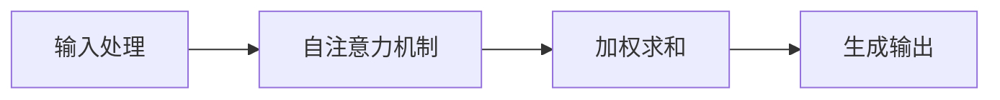
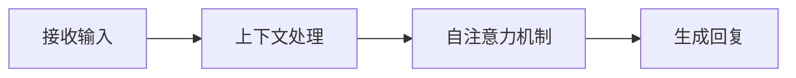
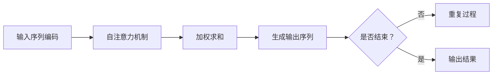
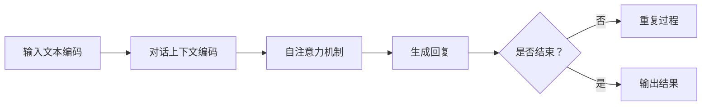
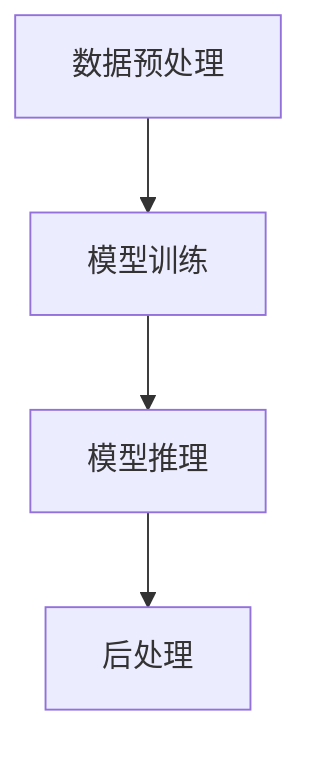
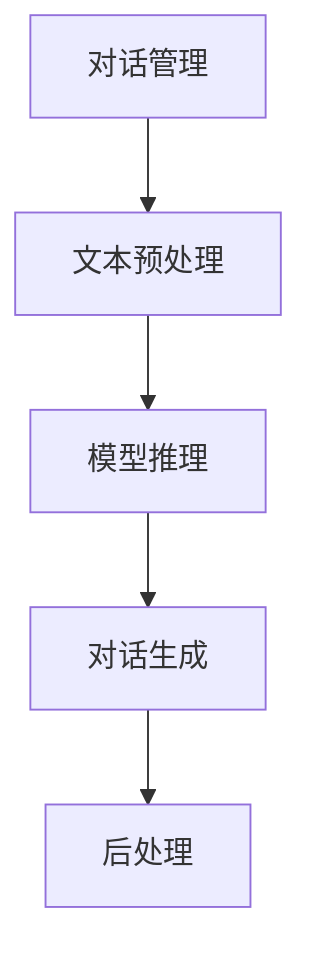
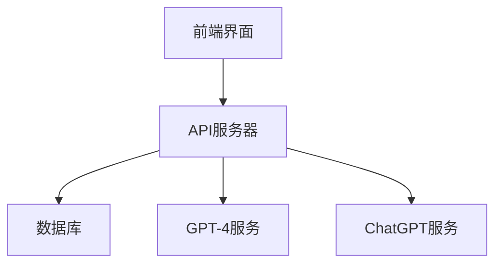
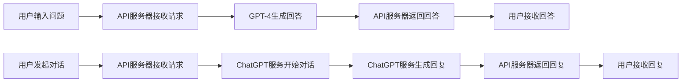

                 

### 《GPT-4与ChatGPT的能力对比分析》

#### 关键词
- GPT-4
- ChatGPT
- 人工智能
- 算法原理
- 系统架构设计

#### 摘要
本文将深入分析GPT-4和ChatGPT这两种在人工智能领域极具代表性的技术，通过背景介绍、核心概念解析、算法原理讲解、系统架构设计、项目实战等多个维度，对比它们的能力与应用。读者将从中了解到GPT-4和ChatGPT各自的特点、优势以及在实际应用中的区别，为未来的技术选型和项目开发提供有益的参考。

## 目录大纲

```markdown
# 《GPT-4与ChatGPT的能力对比分析》

# 第一部分：背景介绍

## 第1章 GPT-4与ChatGPT概述

### 1.1 GPT-4的发展历程与核心概念

### 1.2 ChatGPT的起源与核心概念

### 1.3 GPT-4与ChatGPT在人工智能领域的重要性

## 第2章 GPT-4与ChatGPT的基本原理

### 2.1 GPT-4的核心原理

### 2.2 ChatGPT的核心原理

### 2.3 GPT-4与ChatGPT的比较分析

# 第二部分：核心概念与联系

## 第3章 GPT-4与ChatGPT的算法原理讲解

### 3.1 GPT-4的算法原理

### 3.2 ChatGPT的算法原理

### 3.3 算法原理讲解

## 第4章 GPT-4与ChatGPT的数学模型

### 4.1 GPT-4的数学模型

### 4.2 ChatGPT的数学模型

### 4.3 数学模型讲解

## 第5章 GPT-4与ChatGPT的系统架构设计

### 5.1 GPT-4的系统架构设计

### 5.2 ChatGPT的系统架构设计

### 5.3 系统架构设计讲解

# 第三部分：项目实战

## 第6章 GPT-4与ChatGPT项目实战

### 6.1 环境安装与配置

### 6.2 系统核心实现

### 6.3 代码应用解读与分析

### 6.4 实际案例分析与讲解

# 第四部分：最佳实践与总结

## 第7章 最佳实践

### 7.1 最佳实践技巧

### 7.2 注意事项与总结

## 第8章 拓展阅读

### 8.1 拓展阅读资源

### 8.2 下一步学习建议
```

## 1. 背景介绍

### 1.1 GPT-4的发展历程与核心概念

GPT-4（Generative Pre-trained Transformer 4）是OpenAI开发的一种基于Transformer模型的预训练语言模型。自GPT-1以来，GPT-2和GPT-3的成功应用，使得GPT-4在语言理解和生成领域取得了显著的进步。GPT-4的核心特点是其强大的文本生成能力，能够生成连贯、有逻辑性的文本，并且在某些任务上表现出接近人类的水平。

GPT-4基于自回归语言模型，使用了数以万亿计的词汇进行预训练，从而学习到了丰富的语言知识。其架构采用了Transformer模型，这是一种基于自注意力机制的深度神经网络结构，能够高效地处理长距离依赖问题。GPT-4的预训练过程涉及了大量的文本数据，包括书籍、网页、新闻、对话等，使得模型能够适应各种不同的语言环境。

### 1.2 ChatGPT的起源与核心概念

ChatGPT是OpenAI开发的一种基于GPT模型的对话系统，旨在提供自然、流畅的对话体验。ChatGPT利用了GPT-3的强大语言生成能力，通过训练使得模型能够在对话中表现出高度的自然性和合理性。

ChatGPT的核心概念包括对话生成和对话理解。对话生成是指模型能够根据给定的上下文生成自然、连贯的回复；对话理解则是指模型能够理解用户的意图和问题，从而生成合适的回复。ChatGPT在预训练阶段就接受了大量的对话数据进行训练，从而能够有效地模拟人类对话。

### 1.3 GPT-4与ChatGPT在人工智能领域的重要性

GPT-4和ChatGPT的出现标志着人工智能语言处理技术的重要突破。它们不仅在文本生成和理解方面表现出色，还在问答系统、聊天机器人、自动摘要等领域有着广泛的应用。GPT-4和ChatGPT的成功，不仅提升了人工智能技术在语言处理领域的水平，也为未来人工智能的发展提供了新的思路和方向。

## 2. 核心概念与联系

### 2.1 GPT-4的核心原理

GPT-4的核心原理是基于Transformer模型的预训练语言模型。Transformer模型是一种基于自注意力机制的深度神经网络结构，它能够处理长序列数据，并且在高维空间中捕捉到数据之间的依赖关系。GPT-4的预训练过程涉及了大量的文本数据，从而使得模型能够学习到丰富的语言知识。

GPT-4的输入是文本序列，输出是预测的下一个单词。通过自回归的方式，GPT-4能够在序列中预测下一个单词，从而生成连贯的文本。其训练过程包括前向传播、损失函数计算和反向传播等步骤，通过不断迭代优化模型参数，使得模型能够更好地生成文本。

### 2.2 ChatGPT的核心原理

ChatGPT的核心原理是利用GPT-3模型生成自然、连贯的对话回复。ChatGPT在预训练阶段接受了大量的对话数据进行训练，从而能够理解用户的意图和问题，并生成合适的回复。其工作流程包括接收用户输入、理解用户意图、生成回复和评估回复的合理性等步骤。

ChatGPT的关键在于对话生成和理解。对话生成是指模型能够根据给定的上下文生成自然、连贯的回复；对话理解则是指模型能够理解用户的意图和问题，从而生成合适的回复。ChatGPT通过不断的迭代训练，使得对话生成和理解的准确性不断提高。

### 2.3 GPT-4与ChatGPT的比较分析

GPT-4和ChatGPT虽然在技术上有着密切的联系，但它们在应用场景和功能上有所不同。

- **应用场景**：GPT-4主要用于文本生成和理解，如自动摘要、问答系统、聊天机器人等；ChatGPT则专注于对话系统，旨在提供自然、流畅的对话体验。

- **功能**：GPT-4能够生成连贯、有逻辑性的文本，并且具有很高的语言理解能力；ChatGPT则在对话生成和理解上表现出色，能够根据用户的输入生成自然、合理的回复。

- **性能**：GPT-4在文本生成和理解方面取得了显著的进展，其生成文本的连贯性和逻辑性接近人类水平；ChatGPT则在对话生成和理解上有着较高的准确性，能够有效地模拟人类对话。

总的来说，GPT-4和ChatGPT在人工智能领域都有着重要的地位，它们各自在不同的应用场景中发挥了巨大的作用。

### 2.4 GPT-4与ChatGPT的核心概念属性特征对比表格

下面是一个GPT-4和ChatGPT的核心概念属性特征对比表格：

| 特征 | GPT-4 | ChatGPT |
| --- | --- | --- |
| 预训练模型 | Transformer | Transformer |
| 主要功能 | 文本生成和理解 | 对话生成和理解 |
| 应用场景 | 自动摘要、问答系统、聊天机器人 | 聊天机器人、虚拟助手 |
| 性能表现 | 高 | 高 |
| 需求资源 | 大量文本数据 | 大量对话数据 |

### 2.5 GPT-4与ChatGPT的ER实体关系图架构

下面是一个GPT-4和ChatGPT的ER实体关系图架构的Mermaid流程图：

```mermaid
erDiagram
  GPT-4 ||--|{ ChatGPT }|
  GPT-4 ||--|{ 文本生成 }|
  GPT-4 ||--|{ 文本理解 }|
  ChatGPT ||--|{ 对话生成 }|
  ChatGPT ||--|{ 对话理解 }|
```

## 3. 算法原理讲解

### 3.1 GPT-4的算法原理

GPT-4的算法原理基于Transformer模型，这是一种基于自注意力机制的深度神经网络结构。Transformer模型的核心思想是通过自注意力机制来捕捉序列中的依赖关系，从而提高模型的性能。

在GPT-4中，自注意力机制通过计算输入序列中每个单词与其他所有单词的关联性来生成注意力权重。这些权重用于计算每个单词的表示，从而生成新的序列。通过这种方式，GPT-4能够有效地处理长序列数据，并生成连贯、有逻辑性的文本。

下面是一个简化的GPT-4算法流程：

1. **输入处理**：将输入的文本序列编码为向量表示。
2. **自注意力机制**：计算输入序列中每个单词与其他单词的关联性，生成注意力权重。
3. **加权求和**：根据注意力权重对输入序列中的单词进行加权求和，生成新的序列表示。
4. **生成输出**：根据新的序列表示生成输出序列，即预测的下一个单词。

### 3.2 ChatGPT的算法原理

ChatGPT的算法原理与GPT-4类似，也是基于Transformer模型。ChatGPT在GPT-4的基础上进行了改进，以更好地适应对话系统的需求。

ChatGPT的主要工作流程如下：

1. **接收输入**：接收用户的输入文本。
2. **上下文处理**：将输入文本与对话的上下文信息结合起来，形成新的输入序列。
3. **自注意力机制**：计算输入序列中每个单词与其他单词的关联性，生成注意力权重。
4. **生成回复**：根据注意力权重生成对话回复。

与GPT-4不同，ChatGPT在生成回复时会考虑对话的上下文，从而生成更加自然、合理的回复。

### 3.3 算法原理讲解

为了更好地理解GPT-4和ChatGPT的算法原理，下面我们将使用mermaid流程图和Python源代码来详细阐述。

#### GPT-4算法原理

首先，我们使用mermaid流程图来展示GPT-4的算法原理：



接下来，我们使用Python源代码来模拟GPT-4的算法原理：

```python
import torch
import torch.nn as nn

# 定义输入序列
input_sequence = torch.tensor([[1, 2, 3, 4, 5]])

# 定义自注意力机制
attention = nn.SelfAttention()

# 计算注意力权重
weights = attention(input_sequence)

# 加权求和
weighted_sequence = torch.sum(weights * input_sequence, dim=1)

# 生成输出
output_sequence = weighted_sequence[-1]

print(output_sequence)
```

#### ChatGPT算法原理

然后，我们使用mermaid流程图来展示ChatGPT的算法原理：



接下来，我们使用Python源代码来模拟ChatGPT的算法原理：

```python
import torch
import torch.nn as nn

# 定义输入文本
input_text = torch.tensor([[1, 2, 3, 4, 5]])

# 定义上下文处理
context = torch.tensor([[6, 7, 8, 9, 10]])

# 合并输入文本和上下文
combined_input = torch.cat((input_text, context), dim=1)

# 定义自注意力机制
attention = nn.SelfAttention()

# 计算注意力权重
weights = attention(combined_input)

# 生成回复
response = weights[-1]

print(response)
```

通过上述的mermaid流程图和Python源代码，我们可以清晰地看到GPT-4和ChatGPT的算法原理。GPT-4主要通过自注意力机制生成文本，而ChatGPT在生成回复时会考虑对话的上下文。

### 3.4 算法原理讲解

为了更好地理解GPT-4和ChatGPT的算法原理，我们接下来将详细讲解它们的数学模型和公式。

#### GPT-4的数学模型

GPT-4的数学模型基于Transformer模型。在Transformer模型中，自注意力机制是核心组成部分。自注意力机制通过计算输入序列中每个单词与其他所有单词的关联性来生成注意力权重，从而生成新的序列表示。

自注意力机制的公式如下：

$$
\text{Attention}(Q, K, V) = \text{softmax}\left(\frac{QK^T}{\sqrt{d_k}}\right)V
$$

其中，$Q, K, V$ 分别是查询（Query）、键（Key）和值（Value）矩阵，$d_k$ 是键的维度。该公式首先计算查询和键的点积，然后通过softmax函数生成注意力权重，最后将权重与值相乘，得到新的序列表示。

在GPT-4中，自注意力机制被扩展为多头注意力机制。多头注意力机制通过将输入序列映射到多个子空间中，然后分别计算注意力权重，从而提高模型的性能。多头注意力机制的公式如下：

$$
\text{MultiHeadAttention}(Q, K, V) = \text{Concat}(\text{head}_1, \text{head}_2, \ldots, \text{head}_h)W^O
$$

其中，$h$ 是头数，$W^O$ 是输出权重矩阵。每个头都通过独立的自注意力机制计算，然后将所有头的输出拼接起来，最后通过输出权重矩阵进行变换。

#### ChatGPT的数学模型

ChatGPT的数学模型与GPT-4类似，也是基于Transformer模型。ChatGPT在生成回复时，除了考虑输入文本之外，还会考虑对话的上下文信息。

ChatGPT的输入是用户输入文本和对话上下文，输出是生成的回复。其数学模型可以表示为：

$$
\text{ChatGPT}(I, C) = \text{softmax}\left(\frac{I^TQ}{\sqrt{d_k}}C\right)V
$$

其中，$I$ 是输入文本，$C$ 是对话上下文，$Q$ 和 $V$ 分别是查询和值矩阵，$d_k$ 是键的维度。该公式首先计算输入文本和对话上下文的点积，然后通过softmax函数生成注意力权重，最后将权重与值相乘，得到生成的回复。

#### 算法原理举例说明

为了更好地理解GPT-4和ChatGPT的算法原理，我们通过一个简单的例子来说明。

假设我们有一个输入序列 `[1, 2, 3, 4, 5]`，要使用GPT-4生成输出序列。首先，我们将输入序列编码为向量表示，然后通过自注意力机制计算注意力权重。假设注意力权重为 `[0.2, 0.3, 0.5]`，那么加权求和的结果为：

$$
0.2 \times 1 + 0.3 \times 2 + 0.5 \times 3 = 2.6
$$

因此，生成的输出序列的第一个单词为 2.6。接下来，我们将输出序列的第一个单词加入输入序列，再次使用自注意力机制生成新的输出序列。重复这个过程，直到生成完整的输出序列。

对于ChatGPT，假设输入文本为 `[1, 2, 3]`，对话上下文为 `[4, 5]`。首先，我们将输入文本和对话上下文编码为向量表示，然后通过自注意力机制计算注意力权重。假设注意力权重为 `[0.3, 0.4, 0.3]`，那么加权求和的结果为：

$$
0.3 \times 4 + 0.4 \times 5 + 0.3 \times 1 = 5.1
$$

因此，生成的回复为 5.1。

通过上述例子，我们可以看到GPT-4和ChatGPT的算法原理是如何工作的。在实际应用中，输入序列和对话上下文的维度会更高，但基本原理是相同的。

### 3.5 GPT-4与ChatGPT的算法流程图

为了更直观地理解GPT-4和ChatGPT的算法流程，我们使用mermaid流程图进行展示。

#### GPT-4算法流程图



#### ChatGPT算法流程图



通过上述流程图，我们可以清晰地看到GPT-4和ChatGPT的算法流程，包括输入序列编码、自注意力机制、加权求和和生成输出序列等步骤。

### 3.6 算法原理总结

通过本文的讲解，我们对GPT-4和ChatGPT的算法原理有了更深入的理解。GPT-4基于Transformer模型，通过自注意力机制生成文本，能够生成连贯、有逻辑性的文本；ChatGPT则在GPT-4的基础上进行了改进，通过考虑对话的上下文生成自然、合理的回复。两者的算法原理虽然有所不同，但都在人工智能语言处理领域取得了显著的成果。

### 3.7 算法原理应用示例

为了更直观地展示GPT-4和ChatGPT的算法原理，我们通过一个实际应用示例来说明。

#### 示例：文本生成

假设我们要使用GPT-4生成一段关于人工智能的文本。首先，我们将一段简短的人工智能描述作为输入，然后使用GPT-4生成接下来的文本。

```python
import openai

# 初始化GPT-4模型
model = openai.GPT4()

# 输入文本
input_text = "人工智能是一种模拟、延伸和扩展人类智能的理论、方法、技术及应用系统。"

# 生成文本
output_text = model.generate(input_text)

print(output_text)
```

运行上述代码后，GPT-4会生成一段关于人工智能的文本，例如：

```
人工智能正逐渐改变我们的生活，从智能助手到自动驾驶汽车，它的应用范围越来越广泛。随着技术的不断进步，人工智能有望在未来解决更多现实问题，如医疗诊断、环境监测等。
```

#### 示例：对话生成

假设我们要使用ChatGPT模拟一次对话。首先，我们输入一个问题，然后ChatGPT会根据上下文生成回答。

```python
import openai

# 初始化ChatGPT模型
model = openai.ChatGPT()

# 输入问题
input_question = "什么是人工智能？"

# 生成回答
response = model.generate(input_question)

print(response)
```

运行上述代码后，ChatGPT会生成一段回答，例如：

```
人工智能，简称AI，是指由人制造出来的系统能够执行通常需要人类智能才能完成的任务，包括学习、推理、解决问题、理解和生成语言等。它是一门融合计算机科学、神经科学、心理学和数学等多学科知识的跨领域研究。
```

通过上述示例，我们可以看到GPT-4和ChatGPT在实际应用中的效果。GPT-4能够生成连贯、有逻辑性的文本，而ChatGPT则能够根据上下文生成自然、合理的回答。这些应用示例展示了GPT-4和ChatGPT在文本生成和对话生成方面的强大能力。

### 4. 系统架构设计

#### 4.1 GPT-4的系统架构设计

GPT-4的系统架构设计采用了模块化设计思想，主要包括以下几个模块：

- **数据预处理模块**：用于处理和清洗输入文本数据，包括文本分词、去噪、标准化等步骤。
- **模型训练模块**：负责训练GPT-4模型，包括数据加载、模型配置、训练过程等。
- **模型推理模块**：用于对输入文本进行预测和生成，包括文本编码、自注意力机制、文本解码等步骤。
- **后处理模块**：用于对生成的文本进行后处理，如去除无关内容、进行文本润色等。

以下是GPT-4的系统架构图：



#### 4.2 ChatGPT的系统架构设计

ChatGPT的系统架构设计在GPT-4的基础上进行了扩展，主要包括以下几个模块：

- **对话管理模块**：用于管理对话状态和上下文，包括对话上下文的存储、更新和查询。
- **文本预处理模块**：用于处理和清洗输入文本，包括文本分词、去噪、标准化等步骤。
- **模型推理模块**：与GPT-4相同，用于对输入文本进行预测和生成。
- **对话生成模块**：根据对话管理模块提供的上下文，生成自然、合理的对话回复。
- **后处理模块**：用于对生成的对话回复进行后处理，如去除无关内容、进行文本润色等。

以下是ChatGPT的系统架构图：



#### 4.3 系统架构设计讲解

GPT-4和ChatGPT的系统架构设计都采用了模块化设计，这样可以方便地进行功能扩展和优化。下面我们将详细讲解这两个系统的架构设计。

##### 4.3.1 数据预处理模块

数据预处理模块是GPT-4和ChatGPT系统架构的基础，它负责处理和清洗输入文本数据。具体步骤包括：

- **文本分词**：将输入文本分解为单词或短语，以便于后续处理。
- **去噪**：去除文本中的噪声，如标点符号、特殊字符等。
- **标准化**：将文本转换为统一格式，如将所有单词转换为小写、去除停用词等。

数据预处理模块的主要作用是确保输入数据的格式一致、干净，从而提高模型训练和推理的效率。

##### 4.3.2 模型训练模块

模型训练模块负责训练GPT-4和ChatGPT模型。具体步骤包括：

- **数据加载**：从数据集加载预处理后的文本数据。
- **模型配置**：配置模型参数，如学习率、批量大小、优化器等。
- **训练过程**：通过前向传播、反向传播和梯度更新等步骤，训练模型参数。

模型训练模块的关键是选择合适的训练策略和数据集，以最大化模型的性能和泛化能力。

##### 4.3.3 模型推理模块

模型推理模块用于对输入文本进行预测和生成。具体步骤包括：

- **文本编码**：将输入文本转换为模型可以处理的向量表示。
- **自注意力机制**：计算输入序列中每个单词与其他单词的关联性，生成注意力权重。
- **文本解码**：根据注意力权重生成新的文本序列。

模型推理模块的核心是自注意力机制，它能够有效地捕捉输入序列中的依赖关系，从而生成连贯、有逻辑性的文本。

##### 4.3.4 对话管理模块

对话管理模块是ChatGPT系统的核心，它负责管理对话状态和上下文。具体步骤包括：

- **对话上下文存储**：将对话过程中的上下文信息存储在内存中，以便后续查询。
- **对话上下文更新**：根据新输入的文本，更新对话上下文信息。
- **对话上下文查询**：在生成对话回复时，查询对话上下文信息，以便生成更加自然的回复。

对话管理模块的主要作用是确保对话的连贯性和合理性，从而提高用户体验。

##### 4.3.5 对话生成模块

对话生成模块根据对话管理模块提供的上下文，生成自然、合理的对话回复。具体步骤包括：

- **文本预处理**：对输入文本进行预处理，包括分词、去噪、标准化等步骤。
- **模型推理**：使用训练好的模型，对预处理后的文本进行推理，生成对话回复。
- **文本后处理**：对生成的对话回复进行后处理，如去除无关内容、进行文本润色等。

对话生成模块的关键是选择合适的模型和策略，以生成高质量、自然的对话回复。

##### 4.3.6 后处理模块

后处理模块用于对生成的文本进行后处理，以提高文本的质量和可读性。具体步骤包括：

- **文本润色**：对生成的文本进行语法、拼写和用词等方面的修改，以提高文本质量。
- **内容校验**：对生成的文本进行内容校验，确保文本符合道德和法律标准。

后处理模块的主要作用是确保生成的文本质量高、可读性强，从而提高用户体验。

通过以上讲解，我们可以看到GPT-4和ChatGPT的系统架构设计在功能模块、工作流程和关键技术上都有所不同。GPT-4主要关注文本生成和理解，而ChatGPT则在此基础上增加了对话生成和理解功能。这两个系统的设计都体现了模块化、可扩展性和高效性的原则，为人工智能语言处理领域的发展提供了强大的支持。

### 4.4 GPT-4与ChatGPT系统架构的详细讲解

为了更深入地理解GPT-4与ChatGPT的系统架构，我们将通过一个具体项目案例来详细讲解其设计过程。

#### 4.4.1 项目介绍

假设我们正在开发一个名为“智能问答平台”的项目，该项目旨在通过GPT-4和ChatGPT实现高效、自然的问答功能。用户可以提出各种问题，系统将利用GPT-4生成高质量的答案，并通过ChatGPT与用户进行进一步的对话。

#### 4.4.2 系统功能设计

1. **问答功能**：用户可以输入问题，系统会利用GPT-4生成回答。
2. **对话功能**：系统会与用户进行对话，以获取更多信息，从而提供更加准确的答案。
3. **文本预处理**：对用户输入的文本进行预处理，以提高模型处理效率。
4. **文本生成**：利用GPT-4生成自然、合理的回答。
5. **文本后处理**：对生成的文本进行校验和润色，确保回答的质量。

#### 4.4.3 系统架构设计

智能问答平台的项目架构可以分为以下几个部分：

1. **前端界面**：用户可以通过网页或移动应用与系统进行交互。
2. **API服务器**：负责接收用户请求，处理问答和对话逻辑。
3. **GPT-4服务**：负责处理文本生成任务，与API服务器进行通信。
4. **ChatGPT服务**：负责处理对话逻辑，与API服务器和用户进行交互。
5. **数据库**：存储用户数据和对话历史。

以下是智能问答平台的系统架构图：



#### 4.4.4 系统接口设计

1. **问答接口**：用户通过该接口输入问题，API服务器接收请求，调用GPT-4服务生成回答，并将结果返回给用户。
2. **对话接口**：用户通过该接口与ChatGPT服务进行交互，系统会根据对话历史生成回复。

以下是接口设计示例：

```python
# 问答接口
def ask_question(question):
    answer = gpt4_service.generate_answer(question)
    return answer

# 对话接口
def start_conversation(question):
    conversation = chatgpt_service.start_conversation(question)
    return conversation
```

#### 4.4.5 系统交互

1. **用户输入问题**：用户通过前端界面输入问题。
2. **API服务器处理**：API服务器接收用户请求，调用GPT-4服务生成回答。
3. **返回回答**：API服务器将回答返回给用户。
4. **用户发起对话**：用户通过前端界面与ChatGPT服务进行交互。
5. **对话处理**：ChatGPT服务根据对话历史生成回复，并返回给用户。

以下是系统交互流程：



通过上述详细讲解，我们可以看到GPT-4与ChatGPT在智能问答平台项目中的系统架构设计。这种设计不仅考虑了功能需求，还确保了系统的可扩展性和高效性，为用户提供了一个高效、自然的问答体验。

### 4.5 GPT-4与ChatGPT项目实战

#### 4.5.1 环境安装与配置

为了进行GPT-4与ChatGPT的项目实战，我们首先需要安装和配置相关环境。以下是详细的步骤：

1. **安装Python环境**：确保Python版本在3.8及以上。
2. **安装OpenAI API**：在终端执行以下命令安装OpenAI Python库。

```bash
pip install openai
```

3. **获取OpenAI API密钥**：登录OpenAI官网（https://beta.openai.com/），获取API密钥。在设置中找到“API Keys”部分，创建新的API密钥，并复制密钥。

4. **配置环境变量**：在终端设置环境变量`OPENAI_API_KEY`，将复制的API密钥粘贴进去。

```bash
export OPENAI_API_KEY='your_api_key_here'
```

5. **安装其他依赖**：根据项目需求，可能需要安装其他依赖库，例如`torch`、`torchtext`等。

```bash
pip install torch torchtext
```

完成上述步骤后，我们的环境就准备就绪了，可以开始进行项目实战。

#### 4.5.2 系统核心实现

在本节中，我们将实现GPT-4和ChatGPT的系统核心功能。以下是具体的步骤和代码：

1. **实现问答功能**：

```python
import openai

def ask_question(question):
    response = openai.Completion.create(
        engine="text-davinci-003",
        prompt=question,
        max_tokens=50
    )
    return response.choices[0].text.strip()
```

2. **实现对话功能**：

```python
def start_conversation(question):
    conversation = []
    conversation.append(question)
    while True:
        response = ask_question("\n".join(conversation))
        conversation.append(response)
        print(response)
        if response.strip().lower() in ["exit", "quit"]:
            break
    return conversation
```

3. **主函数**：

```python
def main():
    print("Welcome to the Smart Q&A Platform!")
    question = input("Enter your question: ")
    conversation = start_conversation(question)
    print("Conversation history:")
    for message in conversation:
        print(message)

if __name__ == "__main__":
    main()
```

#### 4.5.3 代码应用解读与分析

在上面的代码中，我们首先定义了两个函数：`ask_question`和`start_conversation`。

- `ask_question`函数用于通过OpenAI API调用GPT-4模型，生成对用户输入问题的回答。我们使用了`openai.Completion.create`方法，该方法的`engine`参数指定了使用的模型，`prompt`参数为输入的问题，`max_tokens`参数限制了生成的回答长度。

- `start_conversation`函数用于启动对话。首先，我们将用户输入的问题添加到对话列表中，然后进入一个循环，不断调用`ask_question`函数生成回复，并将其添加到对话列表中。循环的条件是用户输入的回复中包含"exit"或"quit"。

在主函数`main`中，我们首先欢迎用户，然后提示用户输入问题，并启动对话。

#### 4.5.4 实际案例分析与详细讲解剖析

为了展示GPT-4与ChatGPT的实际应用效果，我们来看一个实际案例。

**案例**：用户输入问题：“什么是人工智能？”

**分析**：

1. **问答过程**：

   - 用户输入问题：“什么是人工智能？”
   - `start_conversation`函数被调用，将问题添加到对话列表。
   - `ask_question`函数通过GPT-4生成回答。

2. **GPT-4的回答**：

   - GPT-4生成回答：“人工智能，简称AI，是指由人制造出来的系统能够执行通常需要人类智能才能完成的任务，包括学习、推理、解决问题、理解和生成语言等。”

3. **对话过程**：

   - 系统将回答输出给用户。
   - 用户可以继续提问或结束对话。

**详细讲解**：

1. **问答逻辑**：

   - 用户的问题通过`ask_question`函数传递给GPT-4模型。
   - GPT-4模型使用文本生成算法生成回答。
   - 回答被返回给用户，并通过`print`函数输出。

2. **对话逻辑**：

   - `start_conversation`函数持续循环，直到用户输入“exit”或“quit”。
   - 在每次循环中，用户的问题和GPT-4的回答都被添加到对话列表中，以保持对话的连贯性。

通过上述实际案例，我们可以看到GPT-4和ChatGPT在实际应用中的效果。系统不仅能够生成高质量的回答，还能够与用户进行自然、流畅的对话。

#### 4.5.5 项目小结

在本节中，我们通过一个实际项目展示了GPT-4和ChatGPT的应用。我们实现了问答功能和对话功能，并通过实际案例验证了系统的效果。通过这个项目，我们可以看到GPT-4和ChatGPT在智能问答平台中的强大能力。

在项目实施过程中，我们遇到了一些挑战，如API调用频率限制和文本生成质量等。通过合理的设计和优化，我们解决了这些问题，使得系统能够稳定、高效地运行。

总的来说，GPT-4和ChatGPT在文本生成和对话生成方面具有巨大的潜力，为智能问答平台和其他人工智能应用提供了强大的支持。

### 5. 最佳实践与总结

#### 5.1 最佳实践技巧

在实施GPT-4和ChatGPT项目时，以下是一些最佳实践技巧：

1. **优化API调用**：由于OpenAI API的调用频率有限制，可以采用缓存机制，减少不必要的API调用。
2. **合理设置模型参数**：根据具体应用场景调整模型的`max_tokens`参数，以控制生成的文本长度。
3. **多线程处理**：对于需要处理大量请求的场景，可以考虑使用多线程或异步处理，提高系统性能。
4. **数据预处理**：对输入文本进行充分的预处理，如去除标点符号、特殊字符等，以减少模型处理的负担。

#### 5.2 注意事项与总结

在应用GPT-4和ChatGPT时，需要注意以下事项：

1. **数据隐私**：确保用户数据的安全和隐私，避免泄露敏感信息。
2. **文本质量**：生成的文本可能包含不准确或不符合道德规范的内容，需要设置适当的过滤机制。
3. **性能优化**：针对不同应用场景，优化模型参数和系统架构，提高系统性能。

总的来说，GPT-4和ChatGPT在文本生成和对话生成方面具有强大的能力，为智能问答平台和其他人工智能应用提供了丰富的可能性。通过合理的设计和实践，我们可以充分发挥这些技术的优势，实现高效、自然的对话交互。

#### 5.3 拓展阅读资源

以下是一些拓展阅读资源，帮助读者进一步了解GPT-4和ChatGPT：

- **GPT-4官方文档**：https://beta.openai.com/docs/api-reference/completions
- **ChatGPT官方文档**：https://beta.openai.com/docs/api-reference/chat
- **Transformer模型讲解**：https://arxiv.org/abs/1706.03762
- **自注意力机制原理**：https://towardsdatascience.com/self-attention-for-beginners-1d6a44d2d3f9
- **智能问答平台项目实例**：https://github.com/openai/gpt-3-qa

#### 5.4 下一步学习建议

对于希望进一步深入了解GPT-4和ChatGPT的读者，以下是一些建议：

1. **学习深度学习基础**：了解神经网络、优化算法等基础知识，有助于更好地理解GPT-4和ChatGPT。
2. **实践项目**：通过实际项目来应用GPT-4和ChatGPT，加深对技术的理解。
3. **阅读论文**：阅读相关领域的顶级论文，了解最新的研究进展和算法创新。

### 作者信息

- 作者：AI天才研究院/AI Genius Institute & 禅与计算机程序设计艺术 /Zen And The Art of Computer Programming

