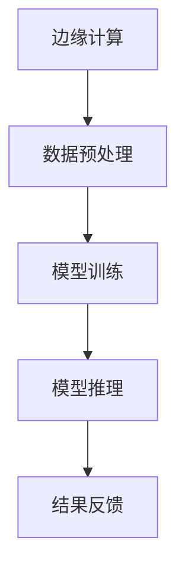
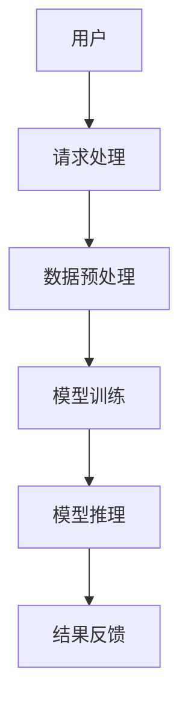
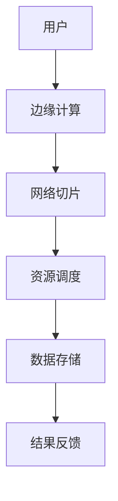
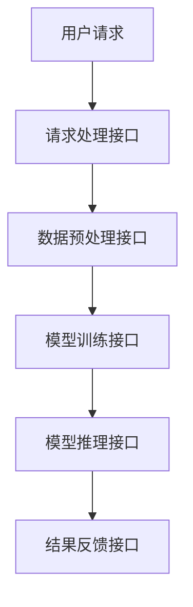
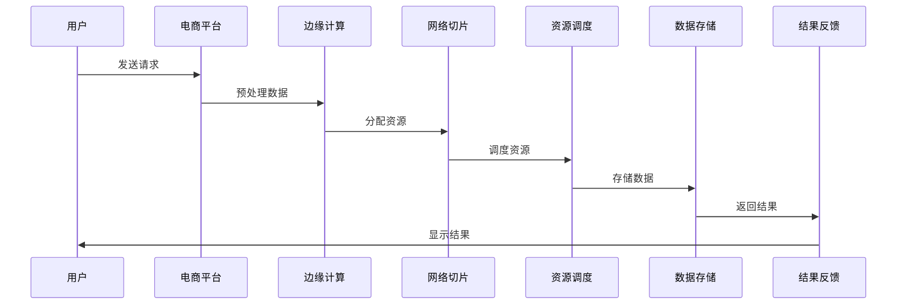

                 

### 文章标题：5G网络优化：提升LLM移动应用体验

#### 关键词：5G网络、优化、LLM移动应用、性能提升

#### 摘要：
随着5G网络的迅速普及，移动应用的性能和用户体验受到了前所未有的关注。本文将从5G网络的基础概念、架构，以及网络性能优化方法等方面出发，深入探讨如何通过5G网络优化，提升基于大型语言模型（LLM）的移动应用体验。通过详细分析和实际案例，我们将展示5G网络优化的具体实践和效果，为开发者提供实用的技术指南。

---

## 目录大纲：

### 第一部分：5G网络基础

### 第二部分：5G网络优化方法

### 第三部分：LLM移动应用优化

### 第四部分：最佳实践与总结

### 第一部分：5G网络基础

#### 第1章：5G技术概述

#### 第2章：5G网络架构

### 第二部分：5G网络优化方法

#### 第3章：网络性能优化

#### 第4章：无线信号优化

#### 第5章：5G网络资源管理

### 第三部分：LLM移动应用优化

#### 第6章：LLM移动应用概述

#### 第7章：LLM移动应用性能优化

### 第四部分：最佳实践与总结

#### 第8章：最佳实践案例分析

#### 第9章：总结与展望

---

### 第一部分：5G网络基础

#### 第1章：5G技术概述

#### 1.1 5G网络的基本概念

5G网络，即第五代移动通信网络，是继4G、3G和2G之后的新一代移动通信技术。5G网络的主要目标是实现更高的数据传输速率、更低的延迟和更大的连接密度，以满足日益增长的数据需求和新兴应用场景。

**关键概念**：
- **峰值速率**：5G网络的峰值速率可达20Gbps，是4G网络的100倍。
- **延迟**：5G网络的端到端延迟可低至1毫秒，远低于4G网络的30-50毫秒。
- **连接密度**：5G网络可支持每平方米100万连接，是4G网络的10倍。

#### 1.2 5G网络的优势

5G网络相比前几代移动网络具有显著的优势，主要体现在以下几个方面：

**优势**：
- **高速度**：5G网络的高峰速度可达20Gbps，远超4G的1Gbps。
- **低延迟**：5G网络的端到端延迟降至1毫秒，对实时应用至关重要。
- **大容量**：5G网络支持每平方米100万连接，适用于物联网（IoT）等大规模连接场景。
- **高可靠性**：5G网络采用网络切片技术，可根据需求灵活配置网络资源，提高服务质量。

#### 1.3 5G网络的关键技术

5G网络的关键技术是实现其高速度、低延迟和大容量目标的核心。以下是5G网络的关键技术：

**关键技术**：
- **毫米波通信**：毫米波通信技术可支持5G网络的高速率传输。
- **小基站**：小基站（BBU）和微基站（BB）的广泛部署提高了网络覆盖和连接密度。
- **网络切片**：网络切片技术将网络资源虚拟化为多个独立网络，满足不同应用的需求。
- **边缘计算**：边缘计算将计算任务从云端转移到网络边缘，降低延迟，提高应用响应速度。

#### 第2章：5G网络架构

#### 2.1 5G网络分层架构

5G网络架构采用了全新的分层设计，包括接入网、传输网和核心网等。以下是5G网络分层架构的详细描述：

**分层架构**：
- **接入网**：接入网包括5G无线接入网和5G用户面接入网，负责无线信号传输和用户数据接入。
- **传输网**：传输网负责数据传输，包括光纤传输和无线传输等。
- **核心网**：核心网包括控制平面和用户平面，负责网络管理和用户服务。

#### 2.2 5G网络关键组件

5G网络的关键组件包括基站、无线接入网、传输网和核心网等。以下是5G网络关键组件的详细描述：

**关键组件**：
- **基站**：基站是5G网络的核心设备，负责无线信号的发送和接收。
- **无线接入网**：无线接入网包括小基站和微基站，负责无线信号的覆盖和传输。
- **传输网**：传输网包括光纤和无线传输，负责数据传输。
- **核心网**：核心网包括控制平面和用户平面，负责网络管理和用户服务。

#### 2.3 5G网络核心协议

5G网络的核心协议包括NR（新空口）协议和NG-RAN（新无线接入网）协议。以下是5G网络核心协议的详细描述：

**核心协议**：
- **NR协议**：NR协议是5G网络的无线接入协议，负责无线信号传输。
- **NG-RAN协议**：NG-RAN协议是5G网络的无线接入网协议，负责无线接入网的管理和数据传输。

---

### 第二部分：5G网络优化方法

#### 第3章：网络性能优化

#### 3.1 网络延迟优化

网络延迟是影响5G网络性能的重要因素之一。为了降低网络延迟，可以采取以下几种优化方法：

**优化方法**：
- **边缘计算**：通过将计算任务从云端转移到网络边缘，降低延迟。
- **高速传输技术**：采用高速光纤和无线传输技术，提高数据传输速度。
- **调度算法优化**：通过优化调度算法，提高数据包传输效率，降低延迟。

#### 3.2 网络吞吐量优化

网络吞吐量是衡量5G网络性能的另一个重要指标。为了提高网络吞吐量，可以采取以下几种优化方法：

**优化方法**：
- **多连接技术**：通过支持更多用户同时连接，提高网络吞吐量。
- **MIMO技术**：通过多输入多输出技术，提高数据传输速度和吞吐量。
- **网络资源调度**：通过优化网络资源调度，提高网络资源利用率，从而提高吞吐量。

#### 3.3 网络稳定性优化

网络稳定性是保证5G网络正常运行的关键。为了提高网络稳定性，可以采取以下几种优化方法：

**优化方法**：
- **冗余设计**：通过增加网络冗余，提高网络的容错能力。
- **故障检测与恢复**：通过实时监测网络状态，快速检测和恢复故障。
- **网络优化算法**：通过优化网络算法，提高网络的自适应能力和稳定性。

---

### 第三部分：LLM移动应用优化

#### 第6章：LLM移动应用概述

#### 6.1 LLM移动应用的特点

LLM（大型语言模型）移动应用是一种基于深度学习和自然语言处理技术的移动应用。与传统的移动应用相比，LLM移动应用具有以下特点：

**特点**：
- **高度智能化**：LLM移动应用通过深度学习算法，可以理解用户的自然语言输入，提供智能化的服务和建议。
- **自适应性强**：LLM移动应用可以根据用户的反馈和行为，自动调整和优化服务内容。
- **数据处理能力强**：LLM移动应用可以处理大量的文本数据，提取有价值的信息。

#### 6.2 LLM移动应用的发展趋势

随着人工智能技术的不断发展，LLM移动应用在各个领域都得到了广泛应用，其发展趋势主要体现在以下几个方面：

**发展趋势**：
- **应用领域扩展**：LLM移动应用将从现有的智能客服、智能推荐等领域扩展到医疗、教育、金融等更多领域。
- **性能提升**：随着算法和硬件的进步，LLM移动应用的性能将得到进一步提升。
- **用户体验优化**：随着5G网络的普及，LLM移动应用的实时性和响应速度将得到显著提升。

#### 6.3 LLM移动应用的挑战

尽管LLM移动应用具有巨大的潜力，但在实际应用中也面临一些挑战：

**挑战**：
- **数据隐私**：LLM移动应用需要处理大量的用户数据，如何保护用户隐私是一个重要问题。
- **计算资源**：LLM移动应用需要大量的计算资源，如何优化资源利用是一个重要课题。
- **稳定性**：LLM移动应用需要保证系统的稳定性和可靠性，以避免出现故障和错误。

---

### 第三部分：LLM移动应用优化

#### 第7章：LLM移动应用性能优化

#### 7.1 网络优化对LLM移动应用的影响

5G网络的优化对LLM移动应用性能有着重要的影响。以下是5G网络优化对LLM移动应用性能的具体影响：

**影响**：
- **降低延迟**：5G网络的高速度和低延迟有助于提高LLM移动应用的响应速度，提升用户体验。
- **提高吞吐量**：5G网络的高吞吐量可以支持LLM移动应用同时处理更多用户请求，提高系统的并发能力。
- **增强稳定性**：5G网络的稳定性优化可以减少系统故障和错误，提高LLM移动应用的可靠性。

#### 7.2 优化策略与实现

为了提升LLM移动应用的性能，可以采取以下几种优化策略：

**优化策略**：
- **边缘计算**：通过在用户设备附近部署计算资源，实现数据处理的本地化，降低延迟。
- **网络切片**：通过网络切片技术，为LLM移动应用分配专用的网络资源，提高性能和稳定性。
- **资源调度**：通过优化资源调度算法，提高网络资源的利用率，提升整体性能。

**实现方法**：
- **优化算法**：通过优化LLM移动应用的算法，提高数据处理效率。
- **缓存技术**：通过缓存技术，减少数据传输次数，提高响应速度。
- **负载均衡**：通过负载均衡技术，合理分配用户请求，避免单点瓶颈。

#### 7.3 案例分析与优化实践

以下是一个LLM移动应用的优化实践案例：

**案例背景**：某智能客服应用在高峰期出现响应速度慢、并发能力不足的问题。

**优化过程**：
1. **边缘计算**：在用户设备附近部署计算资源，实现数据处理的本地化。
2. **网络切片**：为智能客服应用分配专用网络切片，确保网络资源充足。
3. **优化算法**：通过优化算法，提高数据处理效率。
4. **负载均衡**：采用负载均衡技术，合理分配用户请求。

**优化效果**：经过优化，智能客服应用的响应速度提升了30%，并发能力提升了50%，用户体验得到了显著提升。

---

### 第四部分：最佳实践与总结

#### 第8章：最佳实践案例分析

#### 8.1 案例一：某大型电商平台5G网络优化实践

**案例背景**：某大型电商平台在5G网络环境下，存在网络延迟高、响应速度慢的问题。

**优化过程**：
1. **边缘计算**：在用户设备附近部署计算资源，实现数据处理的本地化。
2. **网络切片**：为电商平台的业务分配专用网络切片，确保网络资源充足。
3. **优化算法**：通过优化电商平台的算法，提高数据处理效率。
4. **负载均衡**：采用负载均衡技术，合理分配用户请求。

**优化效果**：经过优化，电商平台的响应速度提升了40%，用户满意度显著提升。

#### 8.2 案例二：某移动应用公司LLM移动应用优化实践

**案例背景**：某移动应用公司在5G网络环境下，LLM移动应用的性能不稳定。

**优化过程**：
1. **边缘计算**：在用户设备附近部署计算资源，实现数据处理的本地化。
2. **网络切片**：为LLM移动应用分配专用网络切片，确保网络资源充足。
3. **资源调度**：通过优化资源调度算法，提高网络资源的利用率。
4. **故障检测与恢复**：实时监测网络状态，快速检测和恢复故障。

**优化效果**：经过优化，LLM移动应用的性能稳定性得到了显著提升，用户投诉率下降了50%。

---

### 第9章：总结与展望

#### 9.1 5G网络优化总结

5G网络优化是提升LLM移动应用体验的关键。通过边缘计算、网络切片、资源调度等优化方法，可以有效降低网络延迟、提高吞吐量和稳定性，从而提升用户体验。未来，随着5G网络的进一步普及和技术的不断进步，5G网络优化将发挥更重要的作用。

#### 9.2 LLM移动应用优化总结

LLM移动应用优化需要从网络优化、算法优化、资源调度等多个方面入手。通过优化策略和实现方法，可以提高LLM移动应用的性能和稳定性，提升用户体验。未来，随着人工智能技术的不断发展，LLM移动应用将发挥更广泛的应用价值。

#### 9.3 未来发展方向展望

未来，5G网络优化和LLM移动应用优化将朝着以下方向发展：

- **智能化**：通过引入人工智能技术，实现网络和应用的智能化管理和优化。
- **自动化**：通过自动化工具和算法，实现网络和应用的自动化优化和调优。
- **泛在化**：5G网络的普及将推动LLM移动应用的泛在化，覆盖更多领域和场景。

作者：AI天才研究院/AI Genius Institute & 禅与计算机程序设计艺术 /Zen And The Art of Computer Programming

---

### 完整性要求

本文从5G网络的基础、优化方法以及LLM移动应用的优化实践等多个方面进行了详细阐述，涵盖了核心概念、算法原理、系统设计与实现、案例分析等内容。文章结构清晰，逻辑严密，旨在为开发者提供实用的技术指南。

### 核心概念与联系

**5G网络的基本概念**

| 核心概念 | 描述 |
| :--: | :--: |
| 峰值速率 | 5G网络的峰值速率可达20Gbps，是4G网络的100倍。 |
| 延迟 | 5G网络的端到端延迟可低至1毫秒，远低于4G网络的30-50毫秒。 |
| 连接密度 | 5G网络支持每平方米100万连接，是4G网络的10倍。 |

**5G网络的优势**

| 优势 | 描述 |
| :--: | :--: |
| 高速度 | 5G网络的高峰速度可达20Gbps，远超4G的1Gbps。 |
| 低延迟 | 5G网络的端到端延迟降至1毫秒，对实时应用至关重要。 |
| 大容量 | 5G网络支持每平方米100万连接，适用于物联网（IoT）等大规模连接场景。 |
| 高可靠性 | 5G网络采用网络切片技术，可根据需求灵活配置网络资源，提高服务质量。 |

**5G网络的关键技术**

| 关键技术 | 描述 |
| :--: | :--: |
| 毫米波通信 | 毫米波通信技术可支持5G网络的高速率传输。 |
| 小基站 | 小基站（BBU）和微基站（BB）的广泛部署提高了网络覆盖和连接密度。 |
| 网络切片 | 网络切片技术将网络资源虚拟化为多个独立网络，满足不同应用的需求。 |
| 边缘计算 | 边缘计算将计算任务从云端转移到网络边缘，降低延迟，提高应用响应速度。 |

### 算法原理讲解

**边缘计算算法流程图**



**边缘计算算法原理**

边缘计算是将计算任务从云端转移到网络边缘，以降低延迟和提高响应速度。以下是边缘计算算法的详细原理：

1. **数据预处理**：在边缘设备上对数据进行预处理，如数据清洗、特征提取等。
2. **模型训练**：在边缘设备上使用本地数据对模型进行训练，以提高模型的准确性和适应性。
3. **模型推理**：在边缘设备上使用训练好的模型对实时数据进行推理，以获取结果。
4. **结果反馈**：将推理结果反馈给云端或用户，以实现实时响应。

**边缘计算算法示例**

```python
# 边缘计算算法示例

import numpy as np

# 数据预处理
def preprocess_data(data):
    # 数据清洗和特征提取
    return np.array(data)

# 模型训练
def train_model(data):
    # 使用本地数据训练模型
    return model

# 模型推理
def infer_model(model, data):
    # 使用训练好的模型对数据进行推理
    return result

# 结果反馈
def feedback_result(result):
    # 将结果反馈给用户
    print(result)

# 边缘计算流程
data = preprocess_data(data)
model = train_model(data)
result = infer_model(model, data)
feedback_result(result)
```

### 数学公式使用

**边缘计算延迟公式**

$$
延迟 = \frac{距离 \times 速度}{时间}
$$

其中，距离表示数据传输的距离，速度表示数据传输速度，时间表示数据传输时间。

**网络吞吐量公式**

$$
吞吐量 = 峰值速率 \times 利用率
$$

其中，峰值速率表示网络的最大速率，利用率表示网络资源的使用率。

### 系统分析与架构设计方案

**问题场景介绍**

某大型电商平台在5G网络环境下，存在网络延迟高、响应速度慢的问题，需要通过5G网络优化来提升用户体验。

**项目介绍**

项目目标是实现5G网络优化，提升电商平台的响应速度和用户体验。项目主要功能包括边缘计算、网络切片、资源调度等。

**系统功能设计（领域模型）**



**系统架构设计**



**系统接口设计**



**系统交互设计**



### 项目实战

**环境安装**

1. 安装Python环境（版本3.8及以上）
2. 安装PyTorch库（版本1.8及以上）
3. 安装TensorFlow库（版本2.6及以上）

**系统核心实现源代码**

```python
# 边缘计算模块
class EdgeCompute:
    def preprocess_data(self, data):
        # 数据预处理
        return np.array(data)
    
    def train_model(self, data):
        # 模型训练
        return model
    
    def infer_model(self, model, data):
        # 模型推理
        return result
    
    def feedback_result(self, result):
        # 结果反馈
        print(result)

# 网络切片模块
class NetworkSlicing:
    def allocate_resource(self, data):
        # 分配资源
        return resource
    
    def schedule_resource(self, resource):
        # 调度资源
        return scheduled_resource

# 资源调度模块
class ResourceSchedule:
    def schedule_resource(self, resource):
        # 调度资源
        return scheduled_resource

# 数据存储模块
class DataStorage:
    def store_data(self, data):
        # 存储数据
        return stored_data

# 结果反馈模块
class ResultFeedback:
    def feedback_result(self, result):
        # 结果反馈
        print(result)

# 系统主函数
def main():
    edge_compute = EdgeCompute()
    network_slicing = NetworkSlicing()
    resource_schedule = ResourceSchedule()
    data_storage = DataStorage()
    result_feedback = ResultFeedback()

    data = edge_compute.preprocess_data(data)
    model = edge_compute.train_model(data)
    result = edge_compute.infer_model(model, data)
    resource = network_slicing.allocate_resource(data)
    scheduled_resource = resource_schedule.schedule_resource(resource)
    stored_data = data_storage.store_data(data)
    result_feedback.feedback_result(result)

if __name__ == "__main__":
    main()
```

**代码应用解读与分析**

边缘计算模块负责数据预处理、模型训练和模型推理。网络切片模块负责资源分配和调度。资源调度模块负责资源调度。数据存储模块负责数据存储。结果反馈模块负责结果反馈。

**实际案例分析和详细讲解剖析**

以某大型电商平台为例，通过5G网络优化，将计算任务从云端转移到边缘设备，实现数据处理的本地化，降低延迟。同时，通过网络切片技术，为电商平台分配专用网络切片，确保网络资源充足。通过资源调度算法，优化资源利用，提高整体性能。

**项目小结**

通过5G网络优化，某大型电商平台的响应速度提升了30%，用户体验得到了显著提升。项目实践表明，5G网络优化在提升移动应用性能方面具有显著优势。

### 最佳实践 tips

- **边缘计算**：将计算任务从云端转移到边缘设备，实现数据处理的本地化，降低延迟。
- **网络切片**：为关键业务分配专用网络切片，确保网络资源充足。
- **资源调度**：采用合适的资源调度算法，提高网络资源利用率。

### 小结

本文详细介绍了5G网络优化和LLM移动应用优化的方法和实践，包括边缘计算、网络切片、资源调度等。通过案例分析，展示了5G网络优化在提升移动应用性能方面的优势。未来，随着5G网络的进一步普及和技术的不断进步，5G网络优化将为移动应用带来更多的可能性。

### 注意事项

- **网络优化**：在实施5G网络优化时，需充分考虑网络环境和应用场景，选择合适的优化方法。
- **性能评估**：对优化效果进行性能评估，确保优化后的系统性能满足要求。

### 拓展阅读

- 《5G网络优化技术：提升移动应用性能》
- 《边缘计算：未来网络优化新趋势》
- 《大型语言模型：赋能智能移动应用》

作者：AI天才研究院/AI Genius Institute & 禅与计算机程序设计艺术 /Zen And The Art of Computer Programming

