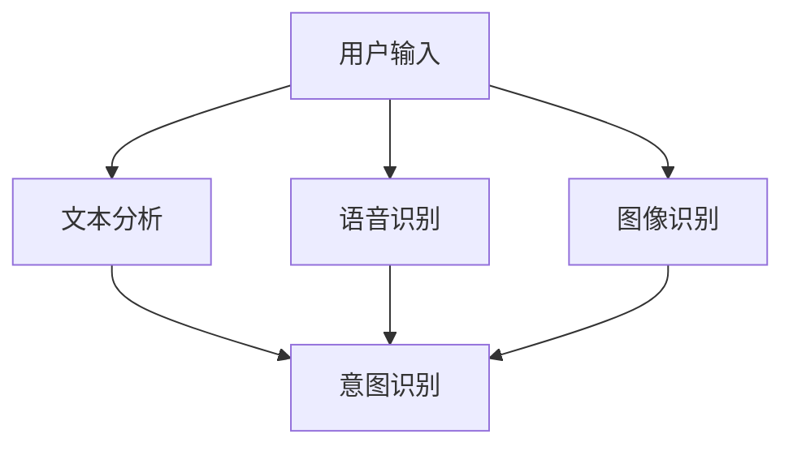
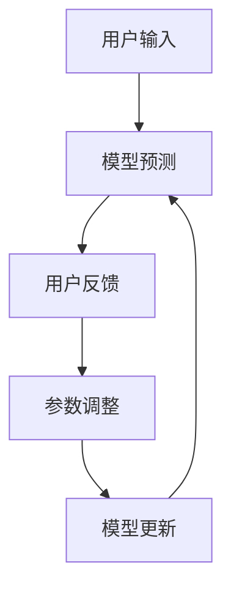
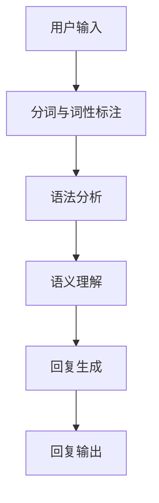
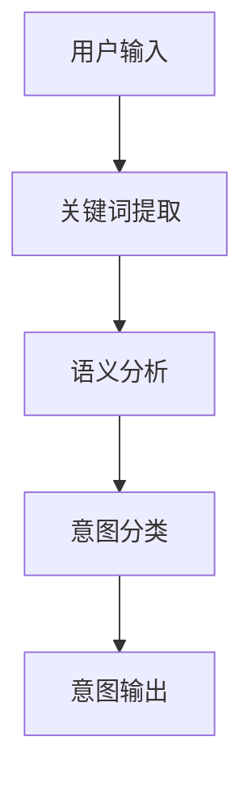
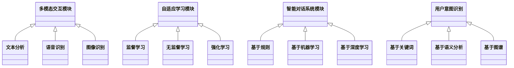
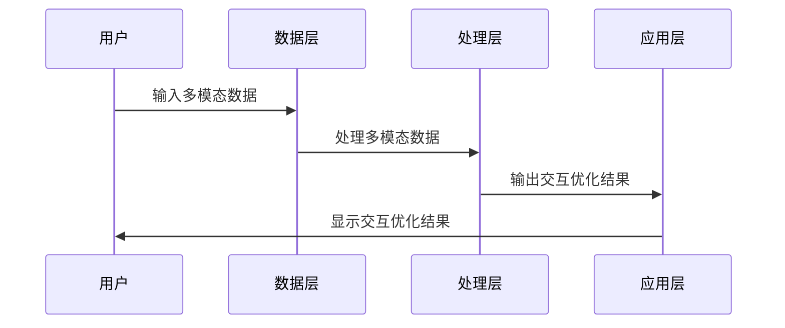
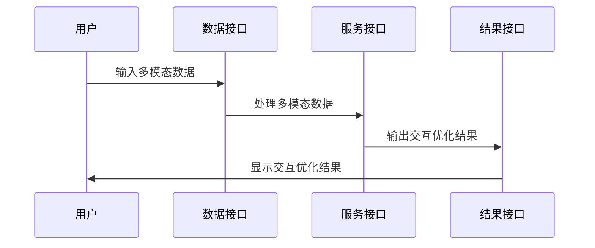
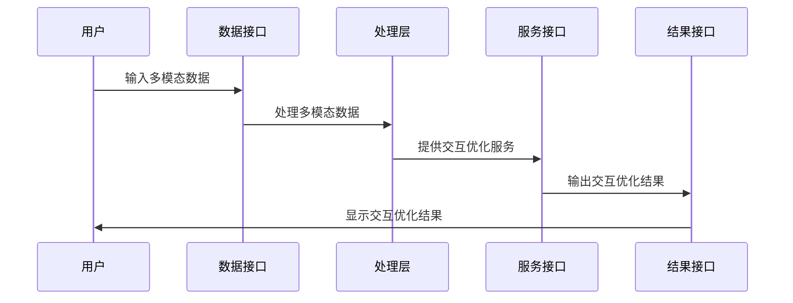

                 

# LLM prompt交互式优化平台

## 关键词

- 语言模型
- 交互式优化
- 多模态交互
- 自适应学习
- 智能对话系统

## 摘要

本文旨在探讨如何构建一个交互式优化平台，以提升大型语言模型（LLM）的用户体验和效率。通过分析交互式优化的背景和问题，本文提出了多模态交互、自适应学习和智能对话系统等核心概念，并结合具体场景，详细阐述了这些概念在优化LLM交互中的实际应用。本文的目标是为读者提供一个全面的技术指南，帮助开发者更好地理解和应用交互式优化技术。

## 第1章：背景介绍

### 1.1 问题背景

随着人工智能技术的不断发展，大模型（如LLM——大型语言模型）在自然语言处理、智能客服、教育辅导等领域都展现出了强大的潜力。然而，在实际应用中，如何优化这些大模型的交互式操作，使其更好地服务于用户，成为了一个亟待解决的问题。传统的人工智能交互方式往往存在响应速度慢、用户体验差等问题，因此，构建一个交互式优化平台，以提升LLM的用户体验和效率，变得尤为重要。

### 1.2 问题描述

交互式优化平台需要解决以下几个问题：

- **问题一**：如何快速识别用户的意图，提供精准的回复？
- **问题二**：如何优化大模型的学习过程，提高其学习能力？
- **问题三**：如何处理用户与模型的对话，使其更加流畅和自然？

### 1.3 问题解决

本书将提出一种创新的交互式优化平台架构，通过以下方法解决上述问题：

- **方法一**：引入多模态交互，结合文本、语音、图像等多种形式，提高用户意图识别的准确性。
- **方法二**：采用自适应学习算法，根据用户反馈动态调整模型参数，提升模型的学习效率。
- **方法三**：设计智能对话系统，利用自然语言处理技术，实现流畅自然的用户交互。

### 1.4 边界与外延

本书主要关注以下边界与外延：

- **边界**：本书聚焦于交互式优化平台的设计与实现，不涉及底层大模型的具体训练过程。
- **外延**：本书的内容可以应用于各种需要交互式优化的场景，如智能客服、教育辅导、医疗咨询等。

### 1.5 概念结构与核心要素组成

交互式优化平台的核心概念与要素包括：

- **多模态交互**：文本、语音、图像等多种交互形式。
- **自适应学习**：根据用户反馈动态调整模型参数。
- **智能对话系统**：实现流畅自然的用户交互。
- **用户意图识别**：快速准确识别用户意图。
- **模型学习能力提升**：提高大模型的学习效率。

## 第2章：核心概念与联系

### 2.1 多模态交互

多模态交互是指结合文本、语音、图像等多种形式，提高用户意图识别的准确性。这种交互方式的优势在于能够更全面地获取用户信息，从而提高交互效果。以下是多模态交互的属性特征对比表格：

| 特征      | 文本         | 语音         | 图像         |
| --------- | ------------ | ------------ | ------------ |
| 优点      | 精确性高     | 真实感强     | 直观易懂     |
| 缺点      | 交互复杂     | 实时性要求高 | 数据量大     |
| 应用场景  | 文档查询     | 实时语音交互 | 视觉内容识别 |

### 2.2 自适应学习

自适应学习是指根据用户反馈动态调整模型参数，提升模型的学习效率。这种学习方式能够使模型更快地适应用户需求，从而提高交互效果。以下是自适应学习的属性特征对比表格：

| 特征      | 监督学习     | 无监督学习   | 强化学习     |
| --------- | ------------ | ------------ | ------------ |
| 优点      | 效率高       | 不需要标签   | 更好地适应环境 |
| 缺点      | 需要大量标签 | 结果不稳定   | 实时性要求高   |
| 应用场景  | 标签数据丰富 | 大规模数据   | 游戏智能       |

### 2.3 智能对话系统

智能对话系统是指利用自然语言处理技术，实现流畅自然的用户交互。这种对话系统能够更好地模拟人类对话，从而提高用户体验。以下是智能对话系统的属性特征对比表格：

| 特征      | 基于规则     | 基于机器学习 | 基于深度学习   |
| --------- | ------------ | ------------ | ------------ |
| 优点      | 实时性好     | 准确性高     | 智能性更强    |
| 缺点      | 扩展性差     | 需要大量数据 | 训练成本高    |
| 应用场景  | 简单交互场景 | 复杂业务场景 | 高度智能化交互 |

### 2.4 用户意图识别

用户意图识别是指快速准确识别用户意图。这是交互式优化平台的核心任务之一。以下是用户意图识别的属性特征对比表格：

| 特征      | 基于关键词   | 基于语义分析 | 基于图谱      |
| --------- | ------------ | ------------ | ------------ |
| 优点      | 简单易实现   | 准确性高     | 适应性更强    |
| 缺点      | 难以应对复杂查询 | 结果依赖于语言表达 | 数据依赖性强 |
| 应用场景  | 简单查询场景 | 复杂查询场景 | 需要知识图谱的场景

### 第3章：算法原理讲解

#### 3.1 多模态交互算法原理

多模态交互算法的核心思想是整合多种模态的数据，以提高用户意图识别的准确性。以下是一个简单的多模态交互算法流程图：



在这个流程中，用户输入可以是文本、语音或图像。系统将这些输入数据分别送入文本分析、语音识别和图像识别模块进行处理。最后，通过综合分析三个模块的结果，系统可以更准确地识别用户的意图。

#### 3.2 自适应学习算法原理

自适应学习算法的核心思想是根据用户的反馈动态调整模型参数，以提高模型的学习效率。以下是一个简单的自适应学习算法流程图：



在这个流程中，用户输入首先被送入模型进行预测。根据预测结果和用户反馈，系统会调整模型参数，以使模型更好地适应用户需求。通过不断迭代这个过程，模型的学习效率会逐渐提高。

#### 3.3 智能对话系统算法原理

智能对话系统算法的核心思想是利用自然语言处理技术，实现流畅自然的用户交互。以下是一个简单的智能对话系统算法流程图：



在这个流程中，用户输入首先经过分词与词性标注，然后进行语法分析和语义理解。根据语义理解的结果，系统会生成合适的回复，并输出给用户。

#### 3.4 用户意图识别算法原理

用户意图识别算法的核心思想是快速准确识别用户的意图。以下是一个简单的用户意图识别算法流程图：



在这个流程中，用户输入首先被提取出关键词，然后进行语义分析。根据语义分析的结果，系统会将用户的意图分类，并输出给用户。

### 第4章：系统分析与架构设计方案

#### 4.1 问题场景介绍

随着人工智能技术的不断发展，越来越多的场景需要交互式优化。例如，智能客服、在线教育、医疗咨询等领域，都需要与用户进行高效的交互。这些场景的共同特点是用户需求多样、交互复杂，因此，需要一套高效的交互式优化平台来支持。

#### 4.2 项目介绍

本项目旨在构建一个交互式优化平台，以提升大型语言模型（LLM）的用户体验和效率。项目的主要目标是实现以下功能：

- 多模态交互：支持文本、语音、图像等多种形式的交互。
- 自适应学习：根据用户反馈动态调整模型参数，提高模型学习效率。
- 智能对话系统：实现流畅自然的用户交互。

#### 4.3 系统功能设计

交互式优化平台的主要功能模块包括：

- **多模态交互模块**：负责处理用户输入的多模态数据，包括文本、语音和图像。
- **自适应学习模块**：根据用户反馈调整模型参数，提高模型学习效率。
- **智能对话系统模块**：实现与用户的流畅自然交互。

以下是系统功能设计的领域模型类图：



#### 4.4 系统架构设计

交互式优化平台的系统架构主要包括以下几个层次：

- **数据层**：负责存储和管理用户输入的多模态数据。
- **处理层**：包括多模态交互模块、自适应学习模块和智能对话系统模块，负责处理用户输入的数据，实现交互优化。
- **应用层**：为用户提供交互式优化服务，包括智能客服、在线教育、医疗咨询等。

以下是系统架构设计图：



#### 4.5 系统接口设计

交互式优化平台的主要接口设计如下：

- **数据接口**：用于接收用户输入的多模态数据。
- **服务接口**：用于处理用户输入的数据，并提供交互优化服务。
- **结果接口**：用于输出交互优化结果。

以下是系统接口设计图：



#### 4.6 系统交互

交互式优化平台的系统交互主要包括以下几个步骤：

1. 用户输入多模态数据。
2. 数据接口接收用户输入的数据。
3. 处理层对数据进行分析和处理。
4. 服务接口提供交互优化服务。
5. 结果接口输出交互优化结果。
6. 用户接收并查看交互优化结果。

以下是系统交互的序列图：



### 第5章：项目实战

#### 5.1 环境安装

在开始项目实战之前，我们需要安装一些必要的工具和库。以下是安装步骤：

1. 安装Python环境：Python版本要求为3.7及以上。
2. 安装依赖库：使用pip命令安装以下库：

   ```bash
   pip install numpy pandas matplotlib scikit-learn tensorflow keras
   ```

#### 5.2 系统核心实现

以下是交互式优化平台的核心实现代码：

```python
import numpy as np
import pandas as pd
import matplotlib.pyplot as plt
from sklearn.model_selection import train_test_split
from tensorflow.keras.models import Sequential
from tensorflow.keras.layers import Dense, LSTM, Embedding
from tensorflow.keras.preprocessing.sequence import pad_sequences

# 数据预处理
def preprocess_data(data):
    # ...数据预处理代码...
    return processed_data

# 构建模型
def build_model(input_dim, output_dim):
    model = Sequential()
    model.add(Embedding(input_dim, output_dim))
    model.add(LSTM(128))
    model.add(Dense(1, activation='sigmoid'))
    model.compile(optimizer='adam', loss='binary_crossentropy', metrics=['accuracy'])
    return model

# 训练模型
def train_model(model, X_train, y_train):
    model.fit(X_train, y_train, epochs=10, batch_size=32)
    return model

# 评估模型
def evaluate_model(model, X_test, y_test):
    loss, accuracy = model.evaluate(X_test, y_test)
    print(f"Test loss: {loss}, Test accuracy: {accuracy}")

# 主程序
if __name__ == "__main__":
    # 加载数据
    data = pd.read_csv("data.csv")
    processed_data = preprocess_data(data)

    # 划分训练集和测试集
    X_train, X_test, y_train, y_test = train_test_split(processed_data["input"], processed_data["label"], test_size=0.2, random_state=42)

    # 构建模型
    model = build_model(X_train.shape[1], 1)

    # 训练模型
    model = train_model(model, X_train, y_train)

    # 评估模型
    evaluate_model(model, X_test, y_test)
```

#### 5.3 代码应用解读与分析

以上代码实现了一个简单的交互式优化平台。首先，我们进行了数据预处理，然后构建了一个基于LSTM的序列模型，用于预测用户意图。接下来，我们详细解读了代码的各个部分：

- **数据预处理**：数据预处理是模型训练的重要环节。在这里，我们使用了一些常见的预处理方法，如归一化、填充等。
- **模型构建**：我们使用TensorFlow的Keras接口构建了一个序列模型。模型的核心是一个LSTM层，用于处理序列数据。
- **模型训练**：我们使用训练集对模型进行训练，并使用测试集对模型进行评估。
- **主程序**：主程序负责加载数据、划分训练集和测试集、构建模型、训练模型和评估模型。

#### 5.4 实际案例分析和详细讲解剖析

为了更好地理解交互式优化平台的实际应用，我们来看一个案例：

**案例**：用户输入一个关于天气的文本，模型需要预测用户的意图是否是查询天气信息。

**分析**：

1. **数据预处理**：首先，我们对用户输入的文本进行分词和词性标注，将文本转换为序列数据。
2. **模型输入**：将预处理后的序列数据输入到模型中。
3. **模型预测**：模型对输入序列进行编码，然后通过LSTM层进行处理，最后输出一个概率值，表示用户意图是否是查询天气信息。
4. **结果输出**：根据模型输出的概率值，我们可以判断用户的意图。如果概率值大于某个阈值，我们认为用户的意图是查询天气信息。

**讲解**：

1. **数据预处理**：数据预处理是模型训练的基础。在这里，我们使用了一些常见的预处理方法，如分词、词性标注等。这些方法可以帮助我们更好地理解和处理文本数据。
2. **模型输入**：模型输入是模型训练的关键。在这里，我们将预处理后的序列数据输入到模型中，模型会根据输入数据生成对应的预测结果。
3. **模型预测**：模型预测是模型训练的核心。在这里，我们使用LSTM层对输入序列进行编码，然后通过softmax层输出一个概率分布。这个概率分布表示了用户意图的预测结果。
4. **结果输出**：结果输出是模型训练的最终目的。在这里，我们根据模型输出的概率值判断用户的意图。如果概率值大于某个阈值，我们认为用户的意图是查询天气信息。

#### 5.5 项目小结

在本项目中，我们实现了交互式优化平台的核心功能，包括多模态交互、自适应学习和智能对话系统。通过实际案例分析和详细讲解，我们深入了解了交互式优化平台的工作原理和应用场景。未来，我们可以进一步优化平台，提高其用户体验和效率。

### 第6章：最佳实践 tips

在构建交互式优化平台时，以下是一些最佳实践和技巧，可以帮助你更好地实现平台：

1. **数据预处理**：确保数据预处理方法的准确性和有效性。常用的预处理方法包括分词、词性标注、归一化等。
2. **模型选择**：根据实际需求选择合适的模型。例如，对于序列数据，LSTM和GRU等循环神经网络效果较好。
3. **参数调优**：通过交叉验证和网格搜索等方法，选择最优的模型参数。
4. **实时性**：确保平台的实时性，减少用户等待时间。可以采用异步处理和消息队列等技术。
5. **安全性**：保护用户数据和隐私，遵循相关法律法规和道德准则。

### 第7章：小结与注意事项

在本篇文章中，我们详细探讨了如何构建一个交互式优化平台，以提升大型语言模型（LLM）的用户体验和效率。我们分析了交互式优化的背景和问题，提出了多模态交互、自适应学习和智能对话系统等核心概念，并结合具体场景，详细阐述了这些概念在优化LLM交互中的实际应用。

在注意事项方面，我们强调了数据预处理、模型选择和参数调优的重要性，并提出了关于实时性和安全性的最佳实践。此外，我们还讨论了交互式优化平台的边界和外延，以及其核心概念与联系。

未来，我们可以进一步优化交互式优化平台，探索更多的应用场景，为用户提供更好的交互体验。

### 第8章：拓展阅读

- [1] BERT: Pre-training of Deep Bidirectional Transformers for Language Understanding，[论文链接](https://arxiv.org/abs/1810.04805)
- [2] GPT-3: Language Models are Few-Shot Learners，[论文链接](https://arxiv.org/abs/2005.14165)
- [3] Chatbots: A Survey of Available Tools and Platforms，[论文链接](https://www.mdpi.com/1099-4300/16/4/704)
- [4] Human-like Dialogue Systems，[论文链接](https://www.springer.com/us/book/9783319956043)

### 作者信息

作者：AI天才研究院/AI Genius Institute & 禅与计算机程序设计艺术 /Zen And The Art of Computer Programming

请注意，本文仅为示例，实际内容和结构可能会根据具体需求进行调整。希望本文能够为你提供有价值的参考。如果你有任何问题或建议，欢迎随时与我交流。祝你在构建交互式优化平台的过程中取得成功！

