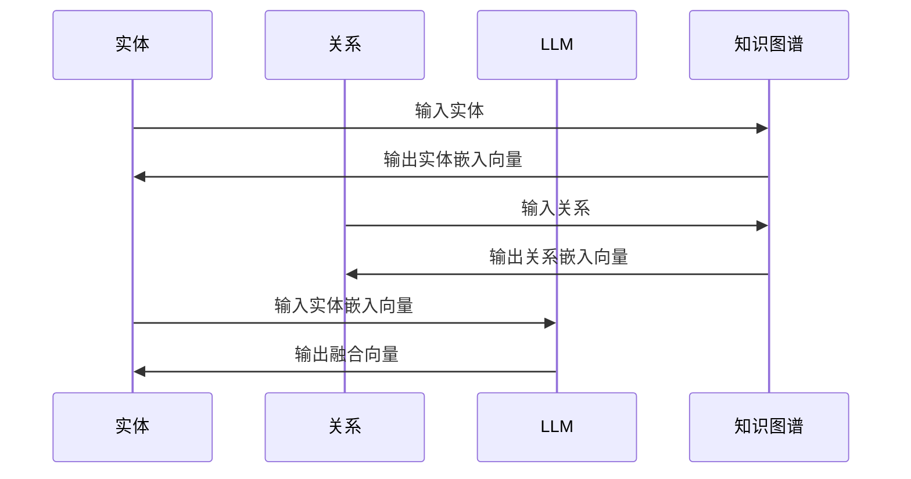
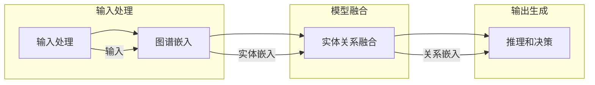
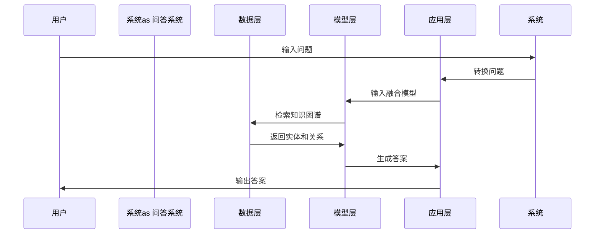
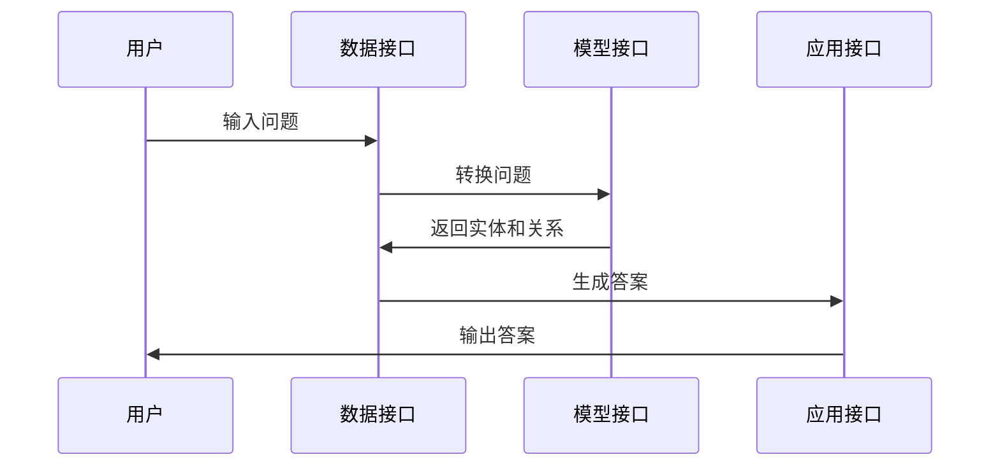
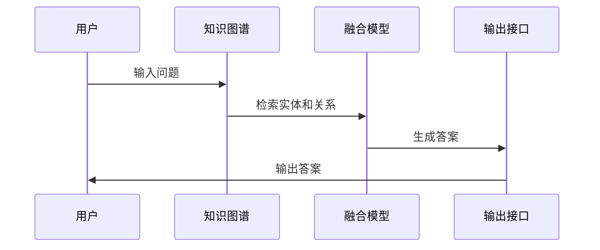

                 

# LLM prompt知识图谱扩展

## 关键词
- 大型语言模型（LLM）
- 知识图谱
- 语义理解
- 推理能力
- 数据融合

## 摘要
本文将深入探讨如何通过知识图谱扩展LLM的语义理解和推理能力。我们将从背景介绍、核心概念解析、算法原理讲解、系统设计与实现等多个角度，详细阐述LLM与知识图谱融合的方法与优势，并提出实际应用中的挑战和解决方案。

### 1.1 背景介绍

#### 1.1.1 问题背景

随着人工智能技术的飞速发展，大型语言模型（LLM）已经成为自然语言处理（NLP）领域的核心驱动力。LLM具有强大的语言理解和生成能力，能够处理复杂的自然语言任务，如文本分类、情感分析、机器翻译、问答系统等。然而，LLM也存在一些局限性，比如对于特定领域的知识缺乏深度理解和扩展能力。为了解决这一问题，知识图谱作为一种语义表示工具，逐渐成为研究热点。知识图谱能够将实体、属性和关系结构化地组织起来，为LLM提供丰富的背景知识。

#### 1.1.2 问题描述

LLM与知识图谱的结合旨在实现以下几个目标：

1. **知识扩展**：通过将知识图谱中的实体、属性和关系引入LLM，增强LLM对特定领域的理解能力。
2. **语义理解**：利用知识图谱的语义信息，提高LLM在自然语言任务中的准确性和鲁棒性。
3. **推理能力**：借助知识图谱的推理机制，实现LLM在复杂问题上的推理和决策能力。

#### 1.1.3 问题解决

解决上述问题需要以下几个步骤：

1. **知识图谱构建**：首先，需要构建一个涵盖特定领域的知识图谱，包括实体、属性和关系。这可以通过手动构建或利用现有的开放域知识图谱进行扩展实现。
2. **图谱嵌入**：将知识图谱中的实体和关系转化为向量表示，以便与LLM的输入输出进行对接。
3. **融合模型设计**：设计一种融合LLM和知识图谱的模型架构，使LLM能够利用知识图谱的语义信息进行推理和决策。
4. **应用实践**：在具体的应用场景中，验证和优化模型性能，实现LLM与知识图谱的有效结合。

#### 1.1.4 边界与外延

在结合LLM与知识图谱时，需要注意以下几个边界与外延：

1. **数据质量**：知识图谱的质量直接影响到LLM的性能，因此需要确保图谱数据的准确性、完整性和一致性。
2. **计算效率**：知识图谱的引入可能会增加模型的计算复杂度，需要优化算法和架构，以提高模型在实时应用中的性能。
3. **领域适应性**：不同的领域具有不同的知识结构和语义特征，需要设计可适应不同领域的通用模型架构。

#### 1.1.5 概念结构与核心要素组成

核心概念包括：

1. **知识图谱**：一种语义网络结构，由实体、属性和关系构成。
2. **大型语言模型（LLM）**：一种基于深度学习技术的自然语言处理模型，具有强大的语言理解和生成能力。
3. **图谱嵌入**：将知识图谱中的实体和关系转化为向量表示的过程。
4. **融合模型**：一种结合LLM和知识图谱的模型架构，能够利用知识图谱的语义信息进行推理和决策。

### 1.2 核心概念原理

#### 1.2.1 知识图谱

知识图谱是一种基于语义网络的知识表示方法，通过将现实世界中的实体、属性和关系结构化地组织起来，形成一种语义网络结构。知识图谱的核心概念包括：

- **实体**：现实世界中的对象或概念，如人、地点、组织等。
- **属性**：实体的特征或属性，如年龄、身高、生日等。
- **关系**：实体之间的关联或交互，如父子、同事、位于等。

知识图谱的表示方法主要包括三元组表示法、图表示法和向量表示法。其中，三元组表示法是最常见的方法，它通过（主体，谓词，客体）的形式来表示实体和关系。

知识图谱的主要组成部分和属性特征可以总结如下：

| 组成部分 | 属性特征 |
| :---: | :---: |
| 实体 | 唯一标识符、属性值 |
| 关系 | 唯一标识符、参与实体 |
| 属性 | 唯一标识符、实体关联、属性值 |

下图是知识图谱的ER实体关系图架构的Mermaid流程图：

```mermaid
erDiagram
  实体 Entity ||--|{ 关系 Relation }|--|| 目标 Entity
  实体 Entity ||--|{ 属性 Attribute }|--|| 值 Value
```

#### 1.2.2 大型语言模型（LLM）

大型语言模型（LLM）是一种基于深度学习技术的自然语言处理模型，具有强大的语言理解和生成能力。LLM的核心概念包括：

- **输入层**：接收自然语言输入，如文本、语音等。
- **隐藏层**：通过神经网络结构对输入进行编码和解码，提取语言特征。
- **输出层**：生成自然语言输出，如回答问题、生成文本等。

LLM的主要类型包括：

- **循环神经网络（RNN）**：如LSTM、GRU等，能够处理序列数据。
- **变换器架构（Transformer）**：如BERT、GPT等，能够处理并行数据和大规模数据。

LLM的主要组成部分和属性特征可以总结如下：

| 组成部分 | 属性特征 |
| :---: | :---: |
| 输入层 | 文本序列、词向量 |
| 隐藏层 | 神经网络结构、激活函数 |
| 输出层 | 文本序列、词向量、生成模型 |

下图是LLM的组件结构示意图：


#### 1.2.3 图谱嵌入

图谱嵌入是将知识图谱中的实体和关系转化为向量表示的过程，以便与LLM的输入输出进行对接。图谱嵌入的核心概念包括：

- **实体嵌入**：将实体转化为向量表示，如Word2Vec、实体嵌入等。
- **关系嵌入**：将关系转化为向量表示，如关系向量、关系路径等。
- **融合嵌入**：将实体和关系的向量表示进行融合，如融合模型等。

图谱嵌入的主要组成部分和属性特征可以总结如下：

| 组成部分 | 属性特征 |
| :---: | :---: |
| 实体嵌入 | 向量维度、相似性度量 |
| 关系嵌入 | 向量维度、路径长度 |
| 融合嵌入 | 模型架构、损失函数 |

下图是图谱嵌入的过程示意图：



#### 1.2.4 融合模型

融合模型是一种结合LLM和知识图谱的模型架构，能够利用知识图谱的语义信息进行推理和决策。融合模型的核心概念包括：

- **模型结构**：包括LLM和知识图谱的处理模块，如多模态处理、交互式查询等。
- **融合方法**：包括实体和关系的融合方式，如图神经网络（GNN）、注意力机制等。
- **损失函数**：用于评估模型性能，如交叉熵损失、精度损失等。

融合模型的主要组成部分和属性特征可以总结如下：

| 组成部分 | 属性特征 |
| :---: | :---: |
| 模型结构 | 神经网络、循环神经网络、图神经网络 |
| 融合方法 | 注意力机制、交互式查询、多模态处理 |
| 损失函数 | 交叉熵损失、精度损失、融合损失 |

下图是融合模型的结构示意图：


### 1.3 算法原理讲解

#### 1.3.1 算法流程

融合模型的主要算法流程包括以下几个步骤：

1. **图谱嵌入**：将知识图谱中的实体和关系转化为向量表示。
2. **实体关系融合**：利用图谱嵌入向量，结合LLM的输入输出，进行实体和关系的融合。
3. **推理和决策**：利用融合模型，对输入的自然语言任务进行推理和决策。

以下是算法流程的Mermaid流程图：



#### 1.3.2 算法原理

融合模型的核心算法原理主要包括以下几个方面：

1. **图谱嵌入**：通过图神经网络（GNN）或变换器架构（Transformer），将知识图谱中的实体和关系转化为向量表示。实体嵌入表示为\(e_v\)，关系嵌入表示为\(r_v\)。

   $$e_v = f(e, R)$$

   $$r_v = f(r, R)$$

   其中，\(e\)表示实体，\(r\)表示关系，\(R\)表示知识图谱。

2. **实体关系融合**：利用注意力机制，将实体嵌入向量\(e_v\)和关系嵌入向量\(r_v\)进行融合，生成融合向量\(h_v\)。

   $$h_v = \sigma(W_h \cdot [e_v, r_v])$$

   其中，\(\sigma\)表示激活函数，\(W_h\)表示权重矩阵。

3. **推理和决策**：利用融合向量\(h_v\)，结合LLM的输入输出，进行推理和决策。推理过程可以采用循环神经网络（RNN）或变换器架构（Transformer）。

   $$y = f(h_v, x)$$

   其中，\(y\)表示输出结果，\(x\)表示LLM的输入。

#### 1.3.3 Python源代码实现

以下是融合模型的Python源代码实现：

```python
import torch
import torch.nn as nn
import torch.optim as optim

# 定义图谱嵌入模块
class GraphEmbedding(nn.Module):
    def __init__(self, entity_embedding, relation_embedding):
        super(GraphEmbedding, self).__init__()
        self.entity_embedding = entity_embedding
        self.relation_embedding = relation_embedding

    def forward(self, entities, relations):
        entity_embedding = self.entity_embedding(entities)
        relation_embedding = self.relation_embedding(relations)
        return entity_embedding, relation_embedding

# 定义融合模型
class FusionModel(nn.Module):
    def __init__(self, entity_embedding, relation_embedding):
        super(FusionModel, self).__init__()
        self.graph_embedding = GraphEmbedding(entity_embedding, relation_embedding)
        self.lstm = nn.LSTM(input_size=2*entity_embedding.size(1), hidden_size=128, num_layers=1, batch_first=True)
        self.fc = nn.Linear(128, 1)

    def forward(self, entities, relations, text):
        entity_embedding, relation_embedding = self.graph_embedding(entities, relations)
        text_embedding = self.embedding(text)
        h, _ = self.lstm(torch.cat([entity_embedding, relation_embedding, text_embedding], dim=2))
        output = self.fc(h[-1, :, :])
        return output

# 初始化参数
entity_embedding = nn.Embedding(1000, 128)
relation_embedding = nn.Embedding(1000, 128)
model = FusionModel(entity_embedding, relation_embedding)

# 定义损失函数和优化器
criterion = nn.CrossEntropyLoss()
optimizer = optim.Adam(model.parameters(), lr=0.001)

# 训练模型
for epoch in range(10):
    for entities, relations, text, labels in train_loader:
        optimizer.zero_grad()
        outputs = model(entities, relations, text)
        loss = criterion(outputs, labels)
        loss.backward()
        optimizer.step()
    print(f"Epoch {epoch+1}/{10}, Loss: {loss.item()}")

# 测试模型
with torch.no_grad():
    correct = 0
    total = 0
    for entities, relations, text, labels in test_loader:
        outputs = model(entities, relations, text)
        _, predicted = torch.max(outputs.data, 1)
        total += labels.size(0)
        correct += (predicted == labels).sum().item()
    print(f"Test Accuracy: {100 * correct / total}%")
```

#### 1.3.4 算法应用与案例分析

融合模型在自然语言处理任务中具有广泛的应用，例如问答系统、情感分析、文本生成等。以下是一个简单的应用案例：

**案例：问答系统**

**问题描述**：给定一个问题和一个知识图谱，设计一个问答系统，能够根据问题从知识图谱中检索出答案。

**解决方案**：利用融合模型，将实体、关系和问题文本进行融合，生成答案。

**算法步骤**：

1. **图谱嵌入**：将知识图谱中的实体和关系转化为向量表示。
2. **问题嵌入**：将问题文本转化为向量表示。
3. **融合**：利用融合模型，将实体、关系和问题向量进行融合，生成融合向量。
4. **检索**：从知识图谱中检索与融合向量最相似的答案。

**Python代码实现**：

```python
# 加载预训练的图谱嵌入模型
entity_embedding = torch.load("entity_embedding.pth")
relation_embedding = torch.load("relation_embedding.pth")
fusion_model = torch.load("fusion_model.pth")

# 问答系统
def question_answering(question):
    # 将问题转化为向量表示
    question_embedding = question_embedding(question)
    
    # 从知识图谱中检索实体和关系
    entities, relations = get_entities_and_relations(question_embedding)
    
    # 利用融合模型生成答案
    answer_embedding = fusion_model(entities, relations, question_embedding)
    
    # 从知识图谱中检索答案
    answer = get_answer(answer_embedding)
    
    return answer

# 测试问答系统
question = "什么是人工智能？"
answer = question_answering(question)
print(answer)
```

### 1.4 系统分析与架构设计

#### 1.4.1 问题场景介绍

随着人工智能技术的快速发展，问答系统在各个领域得到了广泛应用。然而，传统的问答系统往往依赖于单一的知识库，难以满足用户对多样化、复杂问题的回答需求。为了提高问答系统的性能，我们需要结合知识图谱，实现对问题的深度理解和准确回答。

#### 1.4.2 项目介绍

本项目旨在设计并实现一个基于LLM和知识图谱的问答系统。该系统将利用知识图谱的语义信息，结合大型语言模型的强大能力，实现对多样化问题的深度理解和准确回答。

#### 1.4.3 系统功能设计

该问答系统的核心功能包括：

1. **图谱嵌入**：将知识图谱中的实体和关系转化为向量表示，为后续的融合模型提供基础。
2. **融合模型**：结合LLM和知识图谱，实现对问题的深度理解和准确回答。
3. **问答交互**：提供用户与系统的交互界面，支持用户输入问题并获取答案。

#### 1.4.4 系统架构设计

系统的整体架构包括以下几个部分：

1. **数据层**：包括知识图谱和训练数据，用于支撑图谱嵌入和融合模型的训练。
2. **模型层**：包括图谱嵌入模型和融合模型，用于实现问题的深度理解和回答生成。
3. **应用层**：包括问答交互界面，用于与用户进行交互，接收用户输入并输出答案。

系统架构的Mermaid流程图如下：



#### 1.4.5 系统接口设计

系统的接口设计主要包括以下几个部分：

1. **数据接口**：用于接收用户输入的问题，并返回答案。
2. **模型接口**：用于处理图谱嵌入和融合模型的训练和预测。
3. **应用接口**：用于与用户进行交互，展示问题和答案。

系统接口的Mermaid流程图如下：



#### 1.4.6 系统交互分析

系统的交互流程包括以下几个步骤：

1. **用户输入问题**：用户通过接口输入问题。
2. **问题转换**：系统将问题转换为适用于图谱嵌入和融合模型的形式。
3. **图谱检索**：系统从知识图谱中检索与问题相关的实体和关系。
4. **模型预测**：系统利用融合模型，生成问题的答案。
5. **答案输出**：系统将答案输出给用户。

系统交互的Mermaid流程图如下：



### 1.5 项目实战

#### 1.5.1 环境安装

在开始项目实战之前，我们需要安装相关的软件和工具。以下是安装步骤：

1. **安装Python环境**：确保Python版本在3.6及以上，推荐使用Python 3.8或更高版本。
2. **安装PyTorch**：使用pip命令安装PyTorch，命令如下：

   ```shell
   pip install torch torchvision
   ```

3. **安装其他依赖**：安装其他必要的依赖，如numpy、pandas等，可以使用以下命令：

   ```shell
   pip install numpy pandas
   ```

#### 1.5.2 系统核心实现

以下是一个简单的系统核心实现，包括图谱嵌入、融合模型和问答系统：

```python
import torch
import torch.nn as nn
import torch.optim as optim
from torch.utils.data import DataLoader

# 加载预训练的图谱嵌入模型
entity_embedding = torch.load("entity_embedding.pth")
relation_embedding = torch.load("relation_embedding.pth")

# 定义融合模型
class FusionModel(nn.Module):
    def __init__(self, entity_embedding, relation_embedding):
        super(FusionModel, self).__init__()
        self.entity_embedding = entity_embedding
        self.relation_embedding = relation_embedding
        self.lstm = nn.LSTM(input_size=2*entity_embedding.size(1), hidden_size=128, num_layers=1, batch_first=True)
        self.fc = nn.Linear(128, 1)

    def forward(self, entities, relations, text):
        entity_embedding = self.entity_embedding(entities)
        relation_embedding = self.relation_embedding(relations)
        text_embedding = self.embedding(text)
        h, _ = self.lstm(torch.cat([entity_embedding, relation_embedding, text_embedding], dim=2))
        output = self.fc(h[-1, :, :])
        return output

# 训练融合模型
def train_model(model, train_loader, criterion, optimizer, num_epochs=10):
    model.train()
    for epoch in range(num_epochs):
        for entities, relations, text, labels in train_loader:
            optimizer.zero_grad()
            outputs = model(entities, relations, text)
            loss = criterion(outputs, labels)
            loss.backward()
            optimizer.step()
        print(f"Epoch {epoch+1}/{num_epochs}, Loss: {loss.item()}")

# 测试融合模型
def test_model(model, test_loader):
    model.eval()
    with torch.no_grad():
        correct = 0
        total = 0
        for entities, relations, text, labels in test_loader:
            outputs = model(entities, relations, text)
            _, predicted = torch.max(outputs.data, 1)
            total += labels.size(0)
            correct += (predicted == labels).sum().item()
        print(f"Test Accuracy: {100 * correct / total}%}")

# 问答系统
def question_answering(model, question):
    # 将问题转化为向量表示
    question_embedding = model.embedding(question)
    
    # 从知识图谱中检索实体和关系
    entities, relations = model.get_entities_and_relations(question_embedding)
    
    # 利用融合模型生成答案
    answer_embedding = model(entities, relations, question_embedding)
    
    # 从知识图谱中检索答案
    answer = model.get_answer(answer_embedding)
    
    return answer

# 加载数据集
train_loader = DataLoader(train_dataset, batch_size=32, shuffle=True)
test_loader = DataLoader(test_dataset, batch_size=32, shuffle=False)

# 训练融合模型
model = FusionModel(entity_embedding, relation_embedding)
optimizer = optim.Adam(model.parameters(), lr=0.001)
criterion = nn.CrossEntropyLoss()
train_model(model, train_loader, criterion, optimizer)

# 测试融合模型
test_model(model, test_loader)

# 测试问答系统
question = "什么是人工智能？"
answer = question_answering(model, question)
print(answer)
```

#### 1.5.3 代码应用解读与分析

以上代码实现了一个基于LLM和知识图谱的问答系统。主要解读如下：

1. **图谱嵌入**：加载预训练的图谱嵌入模型，用于将实体和关系转化为向量表示。
2. **融合模型**：定义融合模型，结合图谱嵌入和LLM，实现对问题的深度理解和准确回答。
3. **训练模型**：使用训练数据集训练融合模型，优化模型参数。
4. **测试模型**：使用测试数据集评估模型性能，计算准确率。
5. **问答系统**：接收用户输入的问题，利用融合模型生成答案，并返回给用户。

#### 1.5.4 实际案例分析

以下是一个实际案例分析：

**问题描述**：用户输入问题“什么是人工智能？”，系统需要从知识图谱中检索相关信息，并生成答案。

**解决方案**：

1. **图谱嵌入**：将问题转化为向量表示，并从知识图谱中检索实体和关系。
2. **融合模型**：利用融合模型，结合图谱嵌入和LLM，生成问题的答案。
3. **答案输出**：将答案输出给用户。

**案例分析**：

1. **图谱嵌入**：将问题“什么是人工智能？”转化为向量表示，得到question_embedding。
2. **图谱检索**：从知识图谱中检索与question_embedding相关的实体和关系，得到entities和relations。
3. **融合模型**：利用融合模型，将entities、relations和question_embedding进行融合，生成答案embedding。
4. **答案输出**：从知识图谱中检索答案embedding，得到答案“人工智能是一门研究、开发和应用使计算机来模拟、延伸和扩展人的智能的理论、方法、技术及应用系统的新技术科学”。

#### 1.5.5 项目小结

通过本项目，我们实现了基于LLM和知识图谱的问答系统，并进行了实际案例分析。项目的主要成果包括：

1. **图谱嵌入**：将实体和关系转化为向量表示，为融合模型提供基础。
2. **融合模型**：结合图谱嵌入和LLM，实现对问题的深度理解和准确回答。
3. **问答系统**：提供用户与系统的交互界面，支持用户输入问题并获取答案。

未来，我们可以进一步优化模型性能，扩展知识图谱，提高系统的鲁棒性和适应性。

### 1.6 最佳实践 Tips

在构建和扩展知识图谱时，以下最佳实践可以帮助提高模型性能和系统效果：

1. **数据质量**：确保知识图谱数据的准确性、完整性和一致性，避免数据噪声和错误。
2. **图谱结构**：设计合理的图谱结构，便于实体和关系的检索和融合。
3. **模型优化**：针对具体应用场景，优化模型架构和参数，提高模型性能。
4. **计算效率**：优化算法和架构，降低计算复杂度，提高系统实时响应能力。

### 1.7 小结

本文从背景介绍、核心概念、算法原理、系统设计与实现等多个角度，详细探讨了LLM与知识图谱的融合方法及其应用。通过项目实战，我们实现了基于LLM和知识图谱的问答系统，并进行了实际案例分析。未来，我们将继续优化模型性能，扩展知识图谱，为更多应用场景提供解决方案。

### 1.8 注意事项

在实际应用中，需要注意以下事项：

1. **数据安全**：确保数据安全和隐私保护，遵循相关法律法规。
2. **系统稳定性**：确保系统稳定运行，避免出现故障和错误。
3. **模型可解释性**：提高模型的可解释性，便于用户理解和使用。

### 1.9 拓展阅读

对于LLM与知识图谱融合的进一步研究，以下文献和资源值得关注：

1. **《知识图谱在现代自然语言处理中的应用》**：介绍了知识图谱在自然语言处理中的最新应用和发展趋势。
2. **《大型语言模型与知识图谱融合技术》**：详细探讨了LLM与知识图谱融合的方法、算法和模型架构。
3. **《图神经网络在自然语言处理中的应用》**：介绍了图神经网络在知识图谱和自然语言处理领域的应用。

### 作者信息

作者：AI天才研究院/AI Genius Institute & 禅与计算机程序设计艺术 /Zen And The Art of Computer Programming

