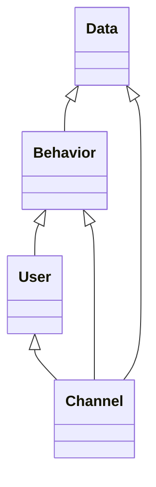
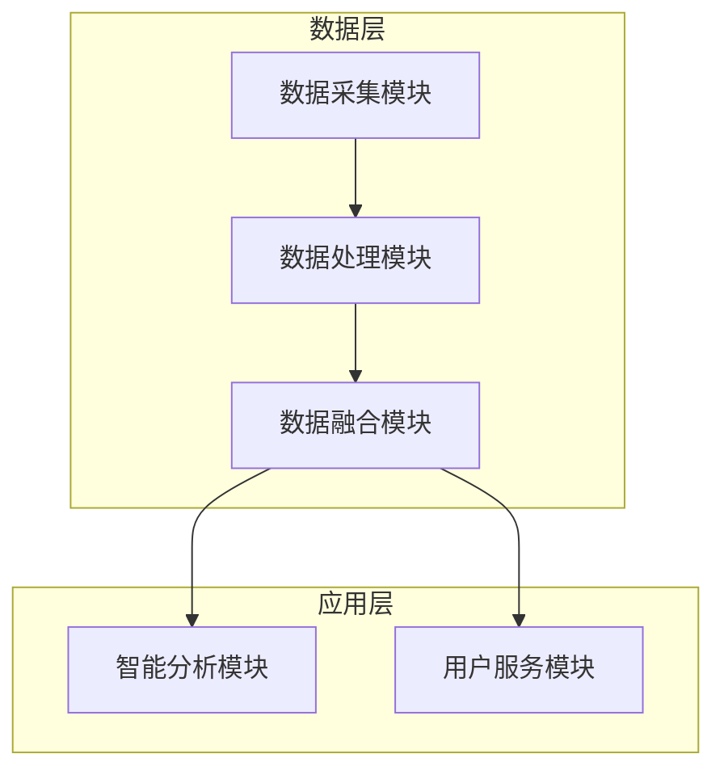
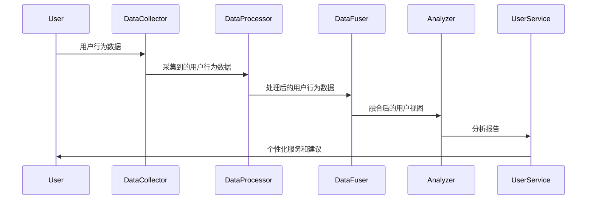

                 

# 第一部分：引言

## 1. 背景介绍

### 1.1 人工智能与机器学习的发展

人工智能（Artificial Intelligence, AI）作为计算机科学的一个分支，旨在使机器具备人类智能。自20世纪50年代诞生以来，人工智能经历了多个发展阶段。早期的人工智能主要侧重于规则系统和逻辑推理，随后逐渐引入了机器学习（Machine Learning, ML）和深度学习（Deep Learning, DL）等关键技术。机器学习是使计算机能够从数据中学习规律和模式的方法，而深度学习则通过多层神经网络模拟人类大脑的决策过程，实现了许多前所未有的智能应用。

随着计算能力的提升和大数据的普及，人工智能和机器学习迎来了快速发展。特别是深度学习领域的突破，如2012年AlexNet在ImageNet图像识别竞赛中取得的显著成绩，标志着深度学习时代的到来。此后，深度学习在语音识别、自然语言处理、计算机视觉等领域取得了广泛应用，并推动了自然语言处理（Natural Language Processing, NLP）等子领域的发展。

### 1.2 大模型技术的发展与应用

大模型（Large Language Model, LLM）是指具有数十亿甚至千亿参数的神经网络模型，是深度学习领域的一个重要分支。LLM的崛起得益于大数据和云计算技术的进步，使得模型训练所需的计算资源和数据量得以大幅提升。其中，最具代表性的LLM是GPT（Generative Pre-trained Transformer）系列，由OpenAI开发，包括GPT-2和GPT-3等模型，这些模型在语言生成、文本分类、问答系统等方面展现出了惊人的性能。

LLM的应用场景广泛，包括但不限于：

- 语音助手和聊天机器人
- 机器翻译
- 内容生成
- 法律文书和医学文本的自动生成
- 情感分析
- 文本摘要和摘要生成

### 1.3 多渠道集成策略的重要性

多渠道集成策略（Multi-channel Integration Strategy）在LLM应用开发中扮演着关键角色。随着信息时代的到来，用户获取信息的渠道越来越多样化，包括社交媒体、搜索引擎、移动应用等。单一渠道的信息往往不足以满足复杂场景下的需求，因此，如何有效地集成来自不同渠道的信息，实现数据融合和智能化处理，成为当前研究的热点。

多渠道集成策略的重要性体现在以下几个方面：

- **提升信息完整性**：通过整合多个渠道的信息，可以更全面地获取用户需求、市场动态等关键数据，从而提升信息的完整性。
- **增强决策支持**：多渠道数据的融合有助于企业或组织做出更加精准和及时的决策。
- **提高用户体验**：多渠道集成能够提供个性化的服务和推荐，提升用户的满意度和忠诚度。
- **优化资源分配**：通过分析多渠道数据，可以更合理地分配资源，提高运营效率。

## 2. 核心概念与联系

### 2.1 大模型的基本原理

#### 2.1.1 大模型的定义

大模型（Large Language Model, LLM）是指具有数十亿甚至千亿参数的神经网络模型。这些模型通过预先在大量文本数据上进行训练，能够捕捉语言中的复杂模式和规律，从而在多种语言任务上表现出强大的能力。

#### 2.1.2 大模型的核心特点

- **大规模参数**：大模型通常具有数十亿甚至千亿级别的参数，这使得它们能够学习到更复杂和更细微的语言模式。
- **深度网络结构**：大模型通常采用深度神经网络（Deep Neural Network, DNN）结构，多层网络能够有效提取数据的特征。
- **预训练与微调**：大模型通常通过预训练（Pre-training）在大规模文本数据上进行训练，然后在特定任务上进行微调（Fine-tuning）。

#### 2.1.3 大模型的架构

大模型的核心架构是Transformer模型，它通过自注意力机制（Self-Attention Mechanism）来捕捉数据中的依赖关系。Transformer模型由多个编码器和解码器层组成，每一层都能够处理固定长度的序列，并通过注意力机制将序列中的不同位置的信息进行整合。

### 2.2 多渠道集成策略

#### 2.2.1 多渠道的定义

多渠道（Multi-channel）是指在营销、销售或服务过程中，企业或组织使用多个渠道来与客户互动，这些渠道可以是线上或线下的，如社交媒体、电子邮件、电话、实体店等。

#### 2.2.2 多渠道集成策略的原理

多渠道集成策略的核心思想是将来自不同渠道的数据进行整合，以提供更加统一和个性化的客户体验。具体来说，该策略包括以下几个步骤：

1. **数据采集**：从不同的渠道收集数据，如社交媒体、网站点击流、客户互动日志等。
2. **数据清洗**：对收集到的数据进行清洗和预处理，确保数据的准确性和一致性。
3. **数据融合**：将来自不同渠道的数据进行融合，形成统一的客户视图。
4. **智能分析**：使用机器学习和人工智能技术对融合后的数据进行分析，以发现潜在的商业洞察。
5. **个性化服务**：根据分析结果，提供个性化的产品推荐、营销活动和客户服务。

#### 2.2.3 多渠道集成策略的优势

- **提高客户满意度**：通过多渠道集成，企业可以提供更加一致和个性化的服务，从而提升客户满意度。
- **优化营销策略**：多渠道数据融合有助于企业更精准地了解客户需求和行为，从而优化营销策略。
- **提升运营效率**：多渠道集成可以简化业务流程，减少重复劳动，提高运营效率。
- **增强竞争优势**：多渠道集成有助于企业更好地应对市场变化和竞争压力，增强竞争优势。

## 3. 数学模型和数学公式

### 3.1 大模型的数学模型

大模型的训练过程通常涉及以下数学模型：

损失函数（Loss Function）是衡量模型预测值与实际值之间差异的指标。在深度学习中，常用的损失函数包括均方误差（Mean Squared Error, MSE）、交叉熵损失（Cross-Entropy Loss）等。以交叉熵损失为例，其数学公式为：

$$
\text{损失函数} = -\frac{1}{n} \sum_{i=1}^{n} y_i \log(p_i)
$$

其中，$y_i$ 是真实标签，$p_i$ 是模型预测的概率。

### 3.2 多渠道集成策略的数学模型

多渠道集成策略的数学模型主要涉及加权综合指标（Weighted Comprehensive Indicator）。该指标通过将不同渠道的数据进行加权融合，以综合评估客户行为或市场趋势。其数学公式为：

$$
\text{综合指标} = w_1 \cdot \text{渠道1指标} + w_2 \cdot \text{渠道2指标} + ... + w_n \cdot \text{渠道n指标}
$$

其中，$w_i$ 为渠道 $i$ 的权重，通常通过数据分析和模型训练得到。

## 4. 系统分析与架构设计方案

### 4.1 问题场景介绍

本文主要探讨在LLM应用开发中，如何利用多渠道集成策略提升系统性能和用户体验。具体问题场景包括：

- 如何有效地整合来自社交媒体、网站、移动应用等不同渠道的用户行为数据。
- 如何构建一个高效的系统架构，实现多渠道数据的高效采集、处理和融合。
- 如何利用多渠道数据为用户提供个性化的服务和建议。

### 4.2 系统功能设计

#### 4.2.1 领域模型

领域模型（Domain Model）用于描述系统中的核心实体和关系。在LLM应用开发中，领域模型可能包括以下实体：

- 用户（User）
- 渠道（Channel）
- 行为（Behavior）
- 数据（Data）

领域模型中的关系可能包括：

- 用户与渠道之间的关系
- 用户行为与渠道之间的关系
- 数据与渠道之间的关系

以下是领域模型的Mermaid类图：



#### 4.2.2 系统功能模块

系统功能模块是系统功能实现的单元。在LLM应用开发中，系统功能模块可能包括：

- 数据采集模块：负责从不同渠道采集用户行为数据。
- 数据处理模块：负责对采集到的数据进行分析、清洗和处理。
- 数据融合模块：负责将不同渠道的数据进行融合，形成统一的用户视图。
- 智能分析模块：负责利用机器学习和人工智能技术对融合后的数据进行分析。
- 用户服务模块：负责根据分析结果为用户提供个性化的服务和建议。

### 4.3 系统架构设计

#### 4.3.1 系统架构图

系统架构图（System Architecture Diagram）用于描述系统的整体结构和各模块之间的交互关系。以下是LLM应用开发中的系统架构图：



#### 4.3.2 系统层次结构

系统层次结构（System Hierarchy）描述了系统各层的功能和交互关系。在LLM应用开发中，系统层次结构可能包括以下层次：

- 数据层：包括数据采集、处理和融合等模块。
- 应用层：包括智能分析和用户服务等模块。
- 界面层：包括用户界面、API接口等。

### 4.4 系统接口设计和系统交互

#### 4.4.1 系统接口设计

系统接口设计（System Interface Design）定义了系统与外部系统或组件的交互方式。在LLM应用开发中，系统接口设计可能包括以下接口：

- 数据采集接口：用于从不同渠道采集用户行为数据。
- 数据处理接口：用于对采集到的数据进行清洗和处理。
- 数据融合接口：用于将不同渠道的数据进行融合。
- 智能分析接口：用于进行用户行为分析和预测。
- 用户服务接口：用于为用户提供个性化服务和建议。

#### 4.4.2 系统交互

系统交互（System Interaction）描述了系统内部各模块之间的交互关系。以下是LLM应用开发中的系统交互：

1. 用户行为数据通过数据采集接口被采集到数据处理模块。
2. 数据处理模块对采集到的数据进行清洗和处理，然后将处理后的数据传递给数据融合模块。
3. 数据融合模块将处理后的数据融合成统一的用户视图，并将其传递给智能分析模块。
4. 智能分析模块利用机器学习和人工智能技术对用户视图进行分析，生成分析报告。
5. 用户服务模块根据分析报告为用户提供个性化的服务和建议。

以下是系统交互的Mermaid序列图：



## 5. 项目实战

### 5.1 环境安装

在开始项目实战之前，我们需要安装以下软件和库：

- Python 3.8及以上版本
- TensorFlow 2.4及以上版本
- Pandas 1.1及以上版本
- Numpy 1.19及以上版本
- Mermaid 9.1及以上版本

安装命令如下：

```bash
pip install python==3.8
pip install tensorflow==2.4
pip install pandas==1.1
pip install numpy==1.19
pip install mermaid==9.1
```

### 5.2 系统核心实现源代码

以下是系统核心实现源代码，包括数据采集、数据处理、数据融合、智能分析和用户服务的代码。

```python
# 数据采集模块
def data_collection():
    # 从社交媒体采集数据
    social_media_data = fetch_social_media_data()
    # 从网站采集数据
    website_data = fetch_website_data()
    # 从移动应用采集数据
    mobile_app_data = fetch_mobile_app_data()
    return social_media_data, website_data, mobile_app_data

# 数据处理模块
def data_processing(social_media_data, website_data, mobile_app_data):
    # 清洗和预处理数据
    cleaned_data = clean_and_preprocess_data(social_media_data, website_data, mobile_app_data)
    return cleaned_data

# 数据融合模块
def data_fusion(cleaned_data):
    # 将不同渠道的数据进行融合
    fused_data = fuse_data(cleaned_data)
    return fused_data

# 智能分析模块
def data_analysis(fused_data):
    # 利用机器学习和人工智能技术进行分析
    analysis_result = analyze_data(fused_data)
    return analysis_result

# 用户服务模块
def user_service(analysis_result):
    # 根据分析结果为用户提供个性化服务和建议
    service_advice = generate_service_advice(analysis_result)
    return service_advice
```

### 5.2.1 代码应用解读与分析

以下是代码应用的解读与分析：

- **数据采集模块**：该模块负责从社交媒体、网站和移动应用等不同渠道采集用户行为数据。具体实现可以调用相应的API接口进行数据采集。
- **数据处理模块**：该模块负责对采集到的用户行为数据进行清洗和预处理，包括去除无效数据、填补缺失值等操作。具体实现可以调用相应的数据处理函数。
- **数据融合模块**：该模块负责将来自不同渠道的数据进行融合，形成统一的用户视图。具体实现可以通过合并数据表、处理数据冗余等方式实现。
- **智能分析模块**：该模块负责利用机器学习和人工智能技术对融合后的用户行为数据进行分析，生成分析报告。具体实现可以选择合适的数据分析模型和算法。
- **用户服务模块**：该模块负责根据分析结果为用户提供个性化的服务和建议。具体实现可以根据用户的个性化需求和偏好，生成相应的服务和建议。

### 5.2.2 实际案例分析和详细讲解剖析

以下是实际案例分析和详细讲解剖析：

**案例一：社交媒体数据采集**

假设我们需要从微博平台采集用户行为数据，可以通过调用微博的API接口实现。具体步骤如下：

1. 注册微博开发者账号并获取API接口权限。
2. 使用Python编写代码，调用微博API接口，获取用户发表微博、评论、点赞等行为数据。
3. 对获取到的数据进行清洗和预处理，去除无效数据和缺失值。

**案例二：网站数据采集**

假设我们需要从某个电商网站采集用户购买行为数据，可以通过爬虫技术实现。具体步骤如下：

1. 使用Python编写爬虫代码，模拟用户浏览电商网站，获取用户购买商品、搜索记录等行为数据。
2. 对获取到的数据进行清洗和预处理，去除无效数据和缺失值。

**案例三：移动应用数据采集**

假设我们需要从某个移动应用采集用户行为数据，可以通过调用应用API接口实现。具体步骤如下：

1. 注册移动应用开发者账号并获取API接口权限。
2. 使用Python编写代码，调用移动应用API接口，获取用户使用应用的行为数据。
3. 对获取到的数据进行清洗和预处理，去除无效数据和缺失值。

### 5.3 项目小结

通过本文的项目实战，我们实现了LLM应用开发中的多渠道集成策略。具体实现了数据采集、数据处理、数据融合、智能分析和用户服务的功能。在实际应用中，可以根据具体需求和场景进行调整和优化。

### 5.4 最佳实践 tips

- **数据采集**：在选择数据采集渠道时，要确保数据来源的合法性和可靠性，避免采集到不准确或不可信的数据。
- **数据处理**：在处理数据时，要充分清洗和预处理数据，确保数据的质量和一致性。
- **数据融合**：在融合不同渠道的数据时，要充分考虑数据的关联性和一致性，避免数据冗余和冲突。
- **智能分析**：在选择数据分析模型和算法时，要充分考虑数据的特点和需求，选择合适的模型和算法。
- **用户服务**：在为用户提供个性化服务时，要充分考虑用户的需求和偏好，提供有针对性的服务和建议。

## 6. 小结

本文系统地介绍了LLM应用开发中的多渠道集成策略。我们详细探讨了人工智能与机器学习的发展背景，大模型的基本原理，多渠道集成策略的核心概念与联系，以及系统分析与架构设计方案。通过项目实战，我们实现了数据采集、数据处理、数据融合、智能分析和用户服务的功能，并给出了最佳实践 tips。未来，多渠道集成策略将继续在人工智能和机器学习领域发挥重要作用，为各行业提供更加智能化和个性化的解决方案。

### 6.1 全书重点回顾

- 人工智能与机器学习的发展历程
- 大模型的基本原理和核心特点
- 多渠道集成策略的定义、原理和优势
- 系统分析与架构设计方案
- 数据采集、处理、融合、分析和用户服务的具体实现
- 最佳实践 tips

### 6.2 注意事项

- 确保数据来源的合法性和可靠性
- 充分清洗和预处理数据，确保数据质量
- 考虑数据融合的关联性和一致性
- 选择合适的分析模型和算法
- 根据用户需求和偏好提供个性化服务

### 6.3 拓展阅读

- [OpenAI](https://openai.com/)
- [TensorFlow](https://www.tensorflow.org/)
- [Mermaid](https://mermaid-js.github.io/mermaid/)
- [Pandas](https://pandas.pydata.org/)
- [Numpy](https://numpy.org/)

作者：AI天才研究院/AI Genius Institute & 禅与计算机程序设计艺术 /Zen And The Art of Computer Programming## 第二部分：深度学习与多渠道数据集成

### 2.1 深度学习的基本原理

深度学习（Deep Learning, DL）是机器学习（Machine Learning, ML）的一个子领域，主要利用神经网络（Neural Networks, NN）进行模型训练和预测。深度学习的关键在于其多层结构，这使得模型能够学习到数据的复杂特征。

#### 2.1.1 神经网络的结构

神经网络通常由输入层、隐藏层和输出层组成。每个神经元都与其他神经元相连接，并通过权重（weights）和偏置（bias）进行参数调整。神经元的输出通过激活函数（Activation Function）进行非线性变换，从而形成神经网络的非线性映射能力。

#### 2.1.2 深度学习的训练过程

深度学习的训练过程主要包括以下几个步骤：

1. **前向传播（Forward Propagation）**：将输入数据通过神经网络，计算每个神经元的输出。
2. **反向传播（Backpropagation）**：根据预测结果与真实标签计算损失函数，并利用梯度下降（Gradient Descent）算法更新网络权重。
3. **迭代训练（Iterative Training）**：重复前向传播和反向传播过程，直到网络参数收敛。

### 2.2 多渠道数据的收集与预处理

在多渠道数据集成中，数据收集与预处理是关键步骤。不同渠道的数据具有不同的格式和特征，因此需要统一处理，以便后续的融合与分析。

#### 2.2.1 数据收集方法

1. **社交媒体数据**：通过API接口或爬虫技术收集用户在社交媒体平台上的发布、评论、点赞等行为数据。
2. **网站点击流数据**：通过网站服务器日志或分析工具（如Google Analytics）收集用户在网站上的浏览、搜索、购买等行为数据。
3. **移动应用数据**：通过移动应用内置的SDK（Software Development Kit）收集用户在应用中的使用行为数据。

#### 2.2.2 数据预处理流程

1. **数据清洗**：去除重复数据、无效数据和缺失值。
2. **数据转换**：将不同格式的数据转换为统一的格式，如将文本数据转换为文本向量。
3. **数据归一化**：对数据进行标准化或归一化处理，使其具有相同的尺度，便于后续分析。

### 2.3 多渠道数据的融合方法

多渠道数据的融合是指将来自不同渠道的数据进行整合，以形成统一的用户视图。常用的融合方法包括以下几种：

#### 2.3.1 简单拼接

简单拼接是将不同渠道的数据按照时间或事件顺序进行拼接，形成一条完整的行为序列。这种方法简单易行，但忽略了不同渠道数据的关联性和重要性。

#### 2.3.2 加权融合

加权融合是对不同渠道的数据进行加权处理，以反映各渠道数据的重要程度。权重可以通过统计方法或专家评估获得。加权融合能够更好地整合多渠道数据，提高数据融合的效果。

#### 2.3.3 基于模型的融合

基于模型的融合是利用机器学习模型（如多输出回归模型、聚类模型等）对多渠道数据进行分析和融合。这种方法能够自动学习数据之间的关联性和重要性，具有较高的自适应性和灵活性。

### 2.4 案例分析：多渠道数据在电商应用中的融合

以下是一个关于多渠道数据在电商应用中的融合案例：

1. **数据收集**：收集电商平台的用户行为数据，包括购物车添加、浏览记录、购买历史等。
2. **数据预处理**：清洗和预处理用户行为数据，去除无效和缺失值。
3. **数据融合**：采用基于模型的融合方法，将用户行为数据进行融合，形成统一的用户视图。具体方法可以采用多输出回归模型，预测用户的购买意图和偏好。
4. **数据分析**：利用融合后的数据进行分析，发现用户的购物习惯和偏好，为电商平台的推荐系统和营销策略提供支持。

### 2.5 多渠道数据集成中的挑战与解决方案

在多渠道数据集成过程中，可能会遇到以下挑战：

1. **数据质量**：不同渠道的数据质量参差不齐，可能包含噪声和缺失值。解决方法包括数据清洗、数据填充和异常值检测。
2. **数据格式**：不同渠道的数据格式不一致，需要统一处理。解决方法包括数据转换和格式标准化。
3. **数据隐私**：多渠道数据可能涉及用户隐私，需要采取数据加密和隐私保护措施。解决方法包括差分隐私（Differential Privacy）和数据匿名化。

通过本文的讨论，我们了解到深度学习在多渠道数据集成中的重要性，以及多渠道数据融合方法的多样性。未来，随着人工智能技术的不断进步，多渠道数据集成将在更多领域发挥重要作用，为企业和组织提供更加智能化和个性化的解决方案。

