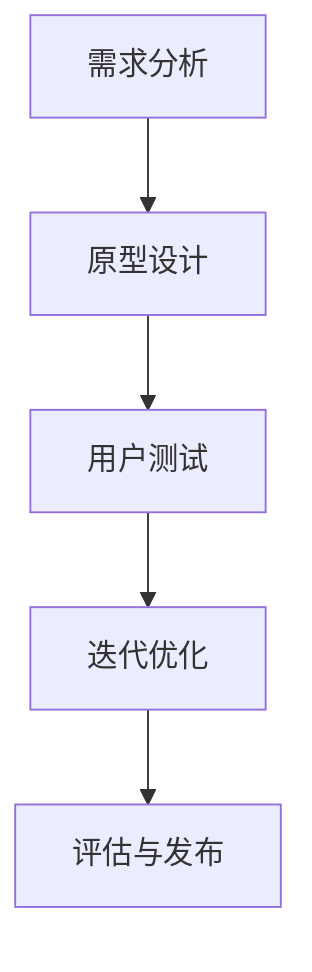
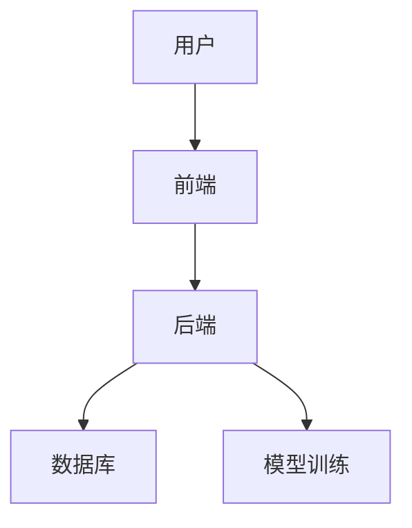

                 

# LLMA应用开发中的敏捷UI/UX设计

## 关键词

- 大型语言模型（LLM）
- 敏捷UI/UX设计
- 用户参与
- 持续迭代
- 软件开发生命周期

## 摘要

本文旨在探讨如何在大型语言模型（LLM）应用开发过程中，运用敏捷UI/UX设计方法，以实现高效的用户界面和用户体验设计。我们将从问题背景、核心概念、算法原理、系统分析与架构设计、项目实战以及最佳实践等方面进行详细讨论，旨在为开发者提供有价值的指导。

## 第一部分：背景介绍

### 1.1 问题背景

在当今技术飞速发展的时代，人工智能（AI）已经成为推动社会进步的重要力量。其中，大型语言模型（LLM）作为AI领域的一个重要分支，正逐渐改变着各行各业的应用模式。LLM是一种能够对自然语言进行理解和生成的大型神经网络模型，通过深度学习算法在大量文本数据上训练而成，具有强大的语言处理能力。

### 1.2 问题描述

随着LLM在各个领域的广泛应用，用户界面（UI）和用户体验（UX）设计逐渐成为一个关键问题。传统的UI/UX设计方法通常侧重于用户需求和视觉设计，但在LLM应用中，如何通过敏捷的UI/UX设计来快速适应和优化复杂的语言处理需求，提高用户满意度，成为了一个亟待解决的挑战。

### 1.3 问题解决

敏捷UI/UX设计方法应运而生，它强调快速迭代、持续改进和用户参与，能够更好地适应LLM应用中的动态变化和不确定性。通过敏捷UI/UX设计，开发者可以在LLM应用的开发过程中，更加灵活地调整UI/UX设计，以实现最佳的用户体验。

### 1.4 边界与外延

在本书中，我们将探讨如何在LLM应用开发中实施敏捷UI/UX设计，涵盖从需求分析、设计原型、用户测试到持续迭代的全过程。同时，本书还将探讨如何将敏捷UI/UX设计与现有的软件开发生命周期相结合，以实现高效的LLM应用开发。

### 1.5 概念结构与核心要素组成

- **敏捷UI/UX设计**：一种以用户为中心，快速迭代的设计方法，旨在通过持续的用户反馈和迭代改进，实现最佳的UI/UX设计效果。
- **LLM应用开发**：基于大型语言模型的应用开发，包括自然语言处理、对话系统、文本生成等功能。
- **用户参与**：在UI/UX设计过程中，积极引入用户反馈，确保设计满足用户需求。
- **持续迭代**：通过持续迭代，不断优化UI/UX设计，提高用户体验。

## 第二部分：核心概念与联系

### 2.1 核心概念原理

#### 2.1.1 敏捷UI/UX设计

敏捷UI/UX设计是一种以用户为中心，快速迭代的设计方法。它强调在开发过程中不断收集用户反馈，并通过快速迭代进行设计改进，从而实现最佳的UI/UX设计效果。具体而言，敏捷UI/UX设计包括以下关键原则：

1. **用户参与**：在整个设计过程中，始终关注用户的需求和反馈，确保UI/UX设计能够满足用户期望。
2. **迭代开发**：将设计过程划分为多个短期迭代，每个迭代周期内完成一部分设计任务，并在每个迭代结束时进行评估和反馈。
3. **快速反馈**：通过快速迭代，及时获取用户反馈，以便在下一个迭代中进行优化。
4. **灵活调整**：根据用户反馈和市场需求，灵活调整设计方向和策略。

#### 2.1.2 LLM应用开发

LLM应用开发是基于大型语言模型的应用开发，包括自然语言处理、对话系统、文本生成等功能。LLM具有以下几个核心特点：

1. **大规模训练**：LLM通过在大量文本数据上进行训练，能够学习到丰富的语言知识，提高语言处理能力。
2. **自适应能力**：LLM能够根据输入的文本内容，自适应地生成相应的文本，实现智能化的语言交互。
3. **通用性**：LLM不仅适用于特定领域的应用，还能跨领域进行应用，具有广泛的适用性。

### 2.1.3 敏捷UI/UX设计与LLM应用开发的联系

敏捷UI/UX设计与LLM应用开发有着紧密的联系。一方面，敏捷UI/UX设计方法可以确保LLM应用在开发过程中能够快速适应和优化复杂的语言处理需求，提高用户体验；另一方面，LLM应用开发为敏捷UI/UX设计提供了丰富的应用场景和实践经验。具体来说：

1. **用户需求反馈**：在LLM应用开发过程中，通过敏捷UI/UX设计，可以更加快速地获取用户反馈，从而更好地满足用户需求。
2. **迭代优化**：在LLM应用开发过程中，通过敏捷UI/UX设计，可以快速进行设计迭代，不断完善和优化UI/UX设计，提高用户体验。
3. **语言处理能力**：LLM强大的语言处理能力可以为敏捷UI/UX设计提供技术支持，实现更加智能化的交互体验。

### 2.2 概念属性特征对比表格

| 特征           | 敏捷UI/UX设计                      | LLM应用开发                          |
|----------------|----------------------------------|------------------------------------|
| 设计方法       | 快速迭代、用户反馈                | 深度学习、自然语言处理                |
| 重视对象       | 用户需求、用户体验                | 语言处理、文本生成                    |
| 开发生命周期   | 短周期、持续迭代                  | 大规模数据训练、模型优化                |
| 设计要素       | UI设计、UX设计                    | 语言模型、算法实现                    |
| 质量保障       | 用户反馈、迭代改进                | 模型效果评估、优化                    |

### 2.3 ER实体关系图架构

```mermaid
erDiagram
  User ||--|{ UI/UX Designer } : "designs for"
  User ||--|{ Agile Methodologist } : "adopts in"
  UI/UX Designer ||--|{ LLM Application } : "applies to"
  Agile Methodologist ||--|{ LLM Application } : "applies in"
  LLM Application ||--|{ UI/UX Design } : "influences by"
  LLM Application ||--|{ Agile Process } : "integrates with"
```

## 第三部分：算法原理讲解

### 3.1 敏捷UI/UX设计算法原理

敏捷UI/UX设计的核心在于快速迭代和用户反馈。以下是一个简单的敏捷UI/UX设计算法原理：

1. **需求分析**：收集用户需求，明确设计目标。
2. **原型设计**：根据需求分析结果，快速设计原型。
3. **用户测试**：将原型展示给用户，收集用户反馈。
4. **迭代优化**：根据用户反馈，对原型进行优化。
5. **评估与发布**：评估优化后的设计，发布上线。

### 3.2 敏捷UI/UX设计算法流程图



### 3.3 Python源代码实现

以下是一个简单的Python代码示例，用于实现敏捷UI/UX设计的算法原理：

```python
def agile_uiux_design():
    # 需求分析
    requirements = collect_requirements()

    # 原型设计
    prototype = design_prototype(requirements)

    # 用户测试
    feedback = user_test(prototype)

    # 迭代优化
    optimized_prototype = iterate_and_optimize(prototype, feedback)

    # 评估与发布
    evaluate_and_release(optimized_prototype)

# 收集需求
def collect_requirements():
    # 实现收集需求的代码
    pass

# 设计原型
def design_prototype(requirements):
    # 实现设计原型的代码
    pass

# 用户测试
def user_test(prototype):
    # 实现用户测试的代码
    pass

# 迭代优化
def iterate_and_optimize(prototype, feedback):
    # 实现迭代优化的代码
    pass

# 评估与发布
def evaluate_and_release(optimized_prototype):
    # 实现评估与发布的代码
    pass

# 执行敏捷UI/UX设计
agile_uiux_design()
```

### 3.4 算法原理的数学模型和公式

在敏捷UI/UX设计中，可以使用以下数学模型和公式来描述用户需求、原型设计、用户测试、迭代优化和评估与发布等过程：

1. **用户需求模型**：
   $$ 用户需求 = f(用户需求特征) $$
   
2. **原型设计模型**：
   $$ 原型 = f(用户需求) $$
   
3. **用户测试模型**：
   $$ 用户反馈 = f(原型) $$
   
4. **迭代优化模型**：
   $$ 优化原型 = f(原型, 用户反馈) $$
   
5. **评估与发布模型**：
   $$ 评估结果 = f(优化原型) $$
   $$ 发布状态 = f(评估结果) $$

### 3.5 通俗易懂的举例说明

假设我们开发一个聊天机器人应用，以下是一个具体的敏捷UI/UX设计案例：

1. **需求分析**：用户希望聊天机器人能够回答他们的问题。
2. **原型设计**：设计一个聊天界面，用户可以输入问题，聊天机器人会根据输入的问题生成回答。
3. **用户测试**：将原型展示给用户，用户提出问题，聊天机器人给出回答，用户对回答进行评价。
4. **迭代优化**：根据用户的评价，对聊天机器人的回答进行优化，提高回答的准确性。
5. **评估与发布**：评估优化后的聊天机器人，如果用户满意度较高，则发布上线。

通过这个案例，我们可以看到敏捷UI/UX设计在LLM应用开发中的重要作用。它帮助开发者快速适应和优化复杂的语言处理需求，提高用户满意度。

## 第四部分：系统分析与架构设计

### 4.1 问题场景介绍

在当今社会，智能对话系统已经成为许多企业和组织的关键应用，如客服、客户支持、智能助手等。这些系统需要处理大量的用户查询，提供准确、快速、个性化的回答。随着大型语言模型（LLM）的发展，我们希望能够利用其强大的语言处理能力，实现更加智能化的对话系统。

### 4.2 项目介绍

本项目旨在开发一个基于大型语言模型（LLM）的智能对话系统。该系统将利用LLM进行自然语言理解和生成，为用户提供准确、快速、个性化的回答。为了实现这一目标，我们将采用敏捷UI/UX设计方法，确保系统的用户界面和用户体验达到最佳。

### 4.3 系统功能设计

在本项目中，我们将实现以下核心功能：

1. **用户输入处理**：接收用户输入，进行预处理，如分词、去停用词等。
2. **自然语言理解**：利用LLM对用户输入进行处理，理解用户意图和需求。
3. **对话生成**：根据用户意图，生成合适的回答。
4. **用户反馈收集**：收集用户对回答的反馈，用于模型优化。
5. **系统优化**：根据用户反馈，对系统进行优化，提高回答的准确性。

### 4.4 系统架构设计

本项目的系统架构设计如下：

1. **前端**：使用HTML、CSS和JavaScript等技术，实现用户界面。
2. **后端**：使用Python和TensorFlow等框架，实现自然语言理解和生成功能。
3. **数据库**：存储用户输入、回答和反馈数据。
4. **模型训练**：使用LLM进行模型训练，提高回答的准确性。

### 4.5 系统接口设计和系统交互

在本项目中，系统接口设计和系统交互如下：

1. **用户输入**：用户通过前端界面输入问题，前端将问题发送到后端。
2. **自然语言理解**：后端接收到问题后，利用LLM进行自然语言理解，理解用户意图和需求。
3. **对话生成**：后端根据用户意图，生成合适的回答，并将回答发送到前端。
4. **用户反馈**：用户对回答进行评价，前端将反馈发送到后端。
5. **系统优化**：后端根据用户反馈，对系统进行优化，提高回答的准确性。

### 4.6 系统架构图



## 第五部分：项目实战

### 5.1 环境安装

在开始项目实战之前，我们需要安装以下环境：

1. Python 3.8 或以上版本
2. TensorFlow 2.5 或以上版本
3. HTML、CSS和JavaScript

### 5.2 系统核心实现

在本项目中，我们将实现以下核心功能：

1. **用户输入处理**：前端页面接收用户输入，后端对其进行预处理。
2. **自然语言理解**：后端利用LLM对用户输入进行处理，理解用户意图和需求。
3. **对话生成**：后端根据用户意图，生成合适的回答。
4. **用户反馈收集**：前端收集用户对回答的反馈，后端对其进行处理。

### 5.3 代码应用解读与分析

以下是一个简单的代码示例，用于实现用户输入处理、自然语言理解和对话生成：

```python
import tensorflow as tf
from tensorflow.keras.preprocessing.sequence import pad_sequences
from tensorflow.keras.models import load_model

# 加载预训练的LLM模型
model = load_model('llm_model.h5')

# 用户输入处理
def preprocess_input(text):
    # 进行分词、去停用词等预处理操作
    processed_text = ...
    return processed_text

# 自然语言理解
def understand_input(input_text):
    # 利用LLM模型进行自然语言理解
    processed_text = preprocess_input(input_text)
    input_sequence = pad_sequences([processed_text], maxlen=512)
    output_sequence = model.predict(input_sequence)
    return output_sequence

# 对话生成
def generate_response(user_input):
    # 利用LLM模型生成回答
    input_sequence = understand_input(user_input)
    response_sequence = model.predict(input_sequence)
    response = response_sequence.decode()
    return response

# 用户反馈收集
def collect_feedback(response, user_rating):
    # 收集用户对回答的反馈
    feedback = ...
    return feedback

# 主函数
def main():
    user_input = input("请输入您的问题：")
    response = generate_response(user_input)
    print("机器人回答：", response)
    user_rating = int(input("请您对回答进行评价（1-5分）："))
    feedback = collect_feedback(response, user_rating)
    print("用户反馈：", feedback)

if __name__ == '__main__':
    main()
```

通过以上代码，我们可以实现一个简单的基于LLM的智能对话系统。用户可以通过前端页面输入问题，后端利用LLM模型进行处理，生成回答，并收集用户反馈。

### 5.4 实际案例分析和详细讲解剖析

以下是一个实际案例，用于展示如何通过敏捷UI/UX设计方法优化智能对话系统的用户体验：

1. **需求分析**：用户希望聊天机器人能够快速、准确地回答问题。
2. **原型设计**：设计一个简单的聊天界面，用户可以输入问题，聊天机器人会给出回答。
3. **用户测试**：将原型展示给用户，用户提出问题，聊天机器人给出回答，用户对回答进行评价。
4. **迭代优化**：根据用户的评价，对聊天机器人的回答进行优化，提高回答的准确性。
5. **评估与发布**：评估优化后的聊天机器人，如果用户满意度较高，则发布上线。

通过以上步骤，我们可以不断优化智能对话系统的用户体验，提高用户满意度。

### 5.5 项目小结

在本项目中，我们通过敏捷UI/UX设计方法，实现了基于LLM的智能对话系统。在实际案例中，我们展示了如何通过迭代优化，提高系统的用户体验。未来，我们将继续优化系统，提高回答的准确性，为用户提供更好的服务。

## 第六部分：最佳实践

### 6.1 最佳实践

1. **用户参与**：在UI/UX设计过程中，积极引入用户反馈，确保设计满足用户需求。
2. **迭代优化**：通过持续迭代，不断优化UI/UX设计，提高用户体验。
3. **数据驱动**：利用用户数据，分析用户行为和需求，为UI/UX设计提供依据。

### 6.2 小结

本文探讨了在LLM应用开发中，如何运用敏捷UI/UX设计方法，实现高效的用户界面和用户体验设计。通过核心概念讲解、算法原理分析、系统架构设计和项目实战，我们展示了敏捷UI/UX设计的实际应用价值。

### 6.3 注意事项

1. **用户需求**：在设计过程中，始终关注用户需求，确保设计满足用户期望。
2. **技术实现**：确保系统具有稳定的性能和高质量的技术实现。
3. **迭代周期**：合理规划迭代周期，确保设计改进的效率。

### 6.4 拓展阅读

- 《用户体验要素》（User Experience Elements）
- 《敏捷UI/UX设计指南》（Agile UI/UX Design Guide）
- 《大型语言模型：原理与应用》（Large Language Models: Principles and Applications）

## 作者

作者：AI天才研究院/AI Genius Institute & 禅与计算机程序设计艺术 /Zen And The Art of Computer Programming

