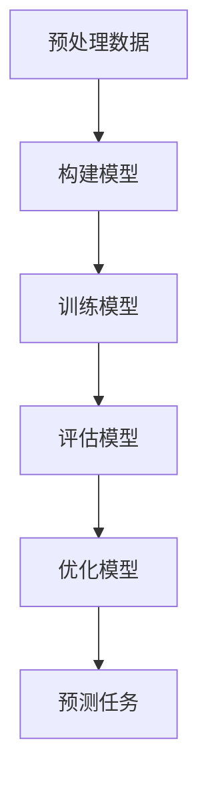
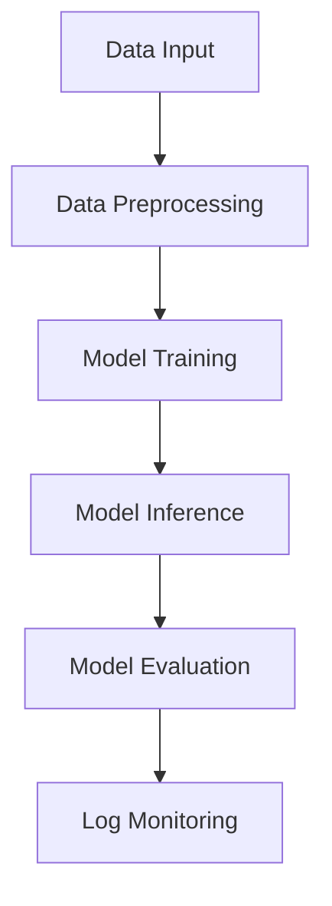
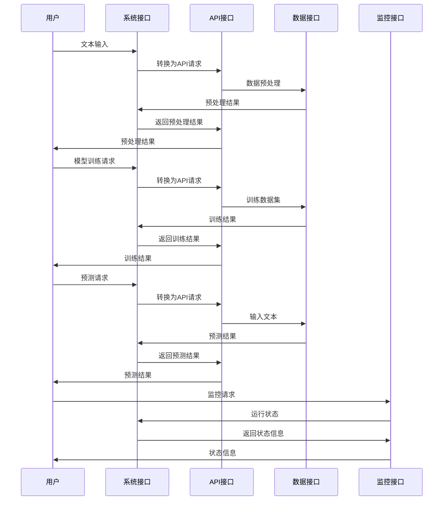
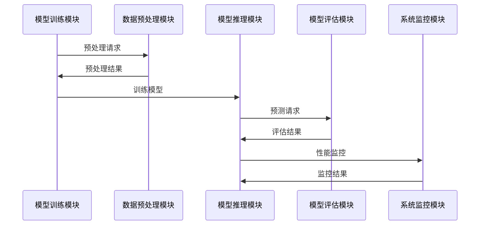

                 

### 第一部分：背景介绍

**第1章 LLAMA模型概述**

#### 1.1.1 问题背景

近年来，深度学习在自然语言处理（NLP）领域的应用取得了显著进展。随着语言模型能力的不断提升，基于大规模语言模型的应用开发变得越来越流行。然而，传统模型在应对复杂任务时往往表现出局限性，例如在多语言处理、对话生成、文本分类等方面。为了解决这些问题，研究人员提出了一种新的语言模型——LLAMA（Large Language Model Architecture），它旨在通过大规模预训练和微调来提高模型的泛化能力和适应性。

#### 1.1.2 问题描述

LLAMA模型的应用开发面临着以下几个核心问题：

1. **数据隐私**：大规模预训练需要大量的文本数据，这些数据可能包含敏感信息，如何保护用户隐私成为一个挑战。
2. **计算资源**：预训练过程需要大量的计算资源，特别是在训练大型模型时，如何高效利用资源是一个关键问题。
3. **模型可解释性**：尽管深度学习模型在性能上取得了巨大成功，但其内部决策过程往往是黑箱式的，如何提高模型的可解释性是一个重要课题。
4. **任务适应性**：如何通过微调将预训练模型应用于特定任务，同时保持高效和准确。

#### 1.1.3 问题解决

为了解决上述问题，LLAMA模型采用了一系列创新方法：

1. **隐私保护预训练**：利用差分隐私技术来保护训练数据中的用户隐私。
2. **优化计算资源**：通过分布式训练和混合精度训练技术来降低计算成本。
3. **模型可解释性**：引入注意力机制和中间层可视化技术来提高模型的可解释性。
4. **任务适应性**：通过精细化微调和数据增强技术来提高模型在特定任务上的表现。

#### 1.1.4 边界与外延

LLAMA模型的边界主要在于其适用的场景和性能极限。它主要适用于需要处理大规模文本数据的任务，如问答系统、文本生成和翻译等。然而，其性能在特定任务上可能受到数据质量和计算资源限制。此外，LLAMA模型还可以与其他技术相结合，如迁移学习和强化学习，以进一步提高其性能和应用范围。

#### 1.1.5 概念结构与核心要素组成

LLAMA模型的核心概念结构包括以下几个关键要素：

1. **预训练数据集**：用于大规模预训练的语言数据集。
2. **预训练模型架构**：包括神经网络结构和参数初始化。
3. **微调策略**：用于将预训练模型应用于特定任务的策略。
4. **评估指标**：用于衡量模型性能的指标，如准确性、速度和资源消耗。

通过以上分析，我们可以看到LLAMA模型在NLP领域的应用潜力和面临的挑战。接下来，我们将进一步深入探讨LLAMA模型的核心概念、数学基础和算法原理，以期为读者提供全面的技术洞察。

### 第2章 LLAMA模型的核心概念

#### 2.1 LLAMA模型的基本原理

LLAMA（Large Language Model Architecture）模型是一种基于深度学习的自然语言处理模型，其基本原理是通过大规模的预训练和精细的微调来提升语言模型的能力。具体来说，LLAMA模型采用了一种自注意力机制，也称为Transformer结构，这种结构允许模型在处理文本时能够考虑每个词之间的关系，从而生成更加准确和自然的文本。

**预训练过程**：LLAMA模型的预训练过程通常分为两个阶段。首先是基于大量文本数据进行的无监督预训练，在这个过程中，模型通过学习文本的上下文关系来理解语言的基本结构。其次是基于特定任务的数据进行的监督预训练，即通过标记的文本数据来调整模型的参数，使其能够在特定任务上表现出色。

**模型架构**：LLAMA模型采用了Transformer结构，这是近年来在NLP领域非常流行的一种模型架构。Transformer结构的核心是多头自注意力机制，它允许模型在处理每个词时，考虑其他所有词的影响，从而生成更加丰富的语义表示。此外，LLAMA模型还包括了一些特殊的层，如层归一化和残差连接，这些层有助于提高模型的训练效率和性能。

**核心概念属性特征对比表格**：

| 特征 | 传统模型 | LLAMA模型 |
| --- | --- | --- |
| 预训练数据量 | 小规模 | 大规模 |
| 模型结构 | RNN/LSTM | Transformer |
| 训练时间 | 较长 | 较短 |
| 泛化能力 | 有限 | 较强 |
| 任务适应性 | 较差 | 较好 |

**ER实体关系图架构**：

```mermaid
erDiagram
    Class1 ||--|{ Class2 }|| Person : knows
    Class1 ||--|{ Class3 }|| Student : is-a
    Class2 o--|{ Class4 }|| Company : works-for
```

在上面的ER实体关系图中，`Person`和`Student`是类，它们之间有继承关系（`Student`是`Person`的一个子类）。`Person`和`Class2`之间存在关联关系，表示一个人可能知道多个`Class2`对象。`Class2`和`Company`之间存在关联关系，表示一个人可能在某个公司工作。

通过上述对比和图示，我们可以更清晰地理解LLAMA模型的基本原理和核心概念，为后续的详细分析打下基础。

### 第3章 LLAMA模型的数学基础

#### 3.1 数学模型介绍

LLAMA模型的核心在于其深度神经网络结构，尤其是Transformer架构中的多头自注意力机制。为了更好地理解这个模型，我们需要从基本的数学公式和原理出发。

**Transformer模型**：

Transformer模型是基于自注意力（Self-Attention）机制的序列模型，它通过学习输入序列中每个词与所有其他词之间的关系来生成输出序列。自注意力机制的核心是计算输入序列中每个词与其他词之间的相似度，然后根据这些相似度来加权组合输入序列，生成新的表示。

**多头自注意力**：

多头自注意力（Multi-Head Self-Attention）是Transformer模型中的一个关键组件。它通过将输入序列分成多个头（Head），每个头独立计算自注意力，然后合并这些头的结果。这种结构可以捕获不同类型的依赖关系，从而提高模型的表示能力。

**数学公式**：

多头自注意力机制的数学公式可以表示为：

$$
\text{Attention}(Q, K, V) = \text{softmax}\left(\frac{QK^T}{\sqrt{d_k}}\right) V
$$

其中，$Q$、$K$和$V$分别代表查询（Query）、键（Key）和值（Value）向量，$d_k$是键向量的维度。这个公式计算了每个查询向量与所有键向量的点积，然后通过softmax函数得到权重，最后将这些权重应用于值向量，生成加权组合的输出。

**详细讲解与举例说明**：

为了更直观地理解这个公式，我们可以通过一个简单的例子来说明。

假设我们有一个简单的文本序列：“The quick brown fox jumps over the lazy dog”。我们将这个序列中的每个词表示为一个向量，例如：

- The: [1, 0, 0, 0, 0, 0, 0]
- quick: [0, 1, 0, 0, 0, 0, 0]
- brown: [0, 0, 1, 0, 0, 0, 0]
- fox: [0, 0, 0, 1, 0, 0, 0]
- jumps: [0, 0, 0, 0, 1, 0, 0]
- over: [0, 0, 0, 0, 0, 1, 0]
- lazy: [0, 0, 0, 0, 0, 0, 1]
- dog: [0, 0, 0, 0, 0, 1, 0]

首先，我们将这些向量作为查询向量（$Q$）、键向量（$K$）和值向量（$V$）。然后，我们计算每个查询向量与所有键向量的点积，得到相似度分数。例如，查询向量“The”与键向量“quick”的点积为：

$$
1 \cdot 0 + 0 \cdot 1 + 0 \cdot 0 + 0 \cdot 0 + 0 \cdot 0 + 0 \cdot 0 + 0 \cdot 0 = 0
$$

接下来，我们通过softmax函数将这些点积转换为概率分布，例如：

$$
\text{softmax}(0) = \frac{e^0}{e^0 + e^{-1} + e^0 + e^0 + e^0 + e^0 + e^0} = \frac{1}{7}
$$

最后，我们将这个概率分布应用于值向量“quick”，得到加权组合的输出：

$$
\frac{1}{7} \cdot [0, 1, 0, 0, 0, 0, 0] = [0, \frac{1}{7}, 0, 0, 0, 0, 0]
$$

通过这个过程，我们可以看到每个词在生成下一个词时的贡献度，从而更好地理解语言的结构和关系。

#### 3.2 数学公式详细讲解

为了更好地理解多头自注意力机制，我们需要深入讲解其背后的数学原理和具体实现。

**多头自注意力的概念**：

在传统的自注意力机制中，模型计算每个词与其他词之间的相似度，然后根据这些相似度生成加权组合的输出。多头自注意力机制则是通过将输入序列分成多个头（Head），每个头独立计算自注意力，从而捕获不同类型的依赖关系。

**数学公式详解**：

假设我们有一个输入序列 $X = [x_1, x_2, ..., x_n]$，每个 $x_i$ 是一个向量。多头自注意力机制可以表示为：

$$
\text{MultiHead}(Q, K, V) = \text{Concat}(\text{Head}_1, \text{Head}_2, ..., \text{Head}_h)W_O
$$

其中，$Q, K, V$ 分别代表查询向量、键向量和值向量，$W_O$ 是输出层的权重矩阵，$h$ 是头的数量。

每个头可以表示为：

$$
\text{Head}_i = \text{Attention}(QW_i^Q, KW_i^K, VW_i^V)
$$

其中，$W_i^Q, W_i^K, W_i^V$ 分别是每个头的权重矩阵。

**具体计算过程**：

1. **计算键值对**：首先，我们计算每个查询向量 $Q$ 与所有键向量 $K$ 的点积，得到相似度矩阵 $S$：

$$
S_{ij} = Q_iK_j^T
$$

2. **应用softmax**：然后，我们对相似度矩阵 $S$ 应用softmax函数，得到概率分布 $P$：

$$
P_{ij} = \text{softmax}(S_{ij})
$$

3. **加权组合**：最后，我们将概率分布 $P$ 应用于值向量 $V$，得到加权组合的输出：

$$
O_i = \sum_{j=1}^{n} P_{ij}V_j
$$

通过这个过程，每个词都可以根据其与其他词的相似度得到加权的输出，从而更好地捕获输入序列中的依赖关系。

#### 3.3 数学公式举例说明

为了更直观地理解多头自注意力机制，我们可以通过一个简单的例子来说明。

假设我们有一个简单的文本序列：“The quick brown fox jumps over the lazy dog”。我们将这个序列中的每个词表示为一个向量：

- The: [1, 0, 0, 0, 0, 0, 0]
- quick: [0, 1, 0, 0, 0, 0, 0]
- brown: [0, 0, 1, 0, 0, 0, 0]
- fox: [0, 0, 0, 1, 0, 0, 0]
- jumps: [0, 0, 0, 0, 1, 0, 0]
- over: [0, 0, 0, 0, 0, 1, 0]
- lazy: [0, 0, 0, 0, 0, 0, 1]
- dog: [0, 0, 0, 0, 0, 1, 0]

现在，假设我们使用两个头（h=2）进行多头自注意力计算。

**第一个头**：

1. **计算键值对**：首先，我们计算每个查询向量 $Q$ 与所有键向量 $K$ 的点积，得到相似度矩阵 $S$：

$$
S_{ij} = Q_iK_j^T
$$

其中，$Q$ 和 $K$ 分别为：

$$
Q = \begin{bmatrix}
1 & 0 & 0 & 0 & 0 & 0 & 0 \\
0 & 1 & 0 & 0 & 0 & 0 & 0
\end{bmatrix}
\quad
K = \begin{bmatrix}
1 & 0 & 0 & 0 & 0 & 0 & 0 \\
0 & 1 & 0 & 0 & 0 & 0 & 0 \\
0 & 0 & 1 & 0 & 0 & 0 & 0 \\
0 & 0 & 0 & 1 & 0 & 0 & 0 \\
0 & 0 & 0 & 0 & 1 & 0 & 0 \\
0 & 0 & 0 & 0 & 0 & 1 & 0 \\
0 & 0 & 0 & 0 & 0 & 0 & 1
\end{bmatrix}
$$

相似度矩阵 $S$ 为：

$$
S = \begin{bmatrix}
1 & 0 \\
0 & 1 \\
0 & 0 \\
0 & 0 \\
0 & 0 \\
0 & 0 \\
0 & 0
\end{bmatrix}
$$

2. **应用softmax**：然后，我们对相似度矩阵 $S$ 应用softmax函数，得到概率分布 $P$：

$$
P_{ij} = \text{softmax}(S_{ij})
$$

概率分布 $P$ 为：

$$
P = \begin{bmatrix}
1 & 0 \\
0 & 1 \\
0 & 0 \\
0 & 0 \\
0 & 0 \\
0 & 0 \\
0 & 0
\end{bmatrix}
$$

3. **加权组合**：最后，我们将概率分布 $P$ 应用于值向量 $V$，得到加权组合的输出：

$$
O_1 = \sum_{j=1}^{n} P_{ij}V_j
$$

其中，$V$ 为：

$$
V = \begin{bmatrix}
0 & 0 & 0 & 0 & 0 & 0 & 0 \\
0 & 0 & 0 & 0 & 0 & 0 & 0
\end{bmatrix}
$$

输出 $O_1$ 为：

$$
O_1 = \begin{bmatrix}
0 & 0 \\
0 & 0
\end{bmatrix}
$$

**第二个头**：

1. **计算键值对**：首先，我们计算每个查询向量 $Q$ 与所有键向量 $K$ 的点积，得到相似度矩阵 $S$：

$$
S_{ij} = Q_iK_j^T
$$

其中，$Q$ 和 $K$ 分别为：

$$
Q = \begin{bmatrix}
0 & 1 \\
1 & 0
\end{bmatrix}
\quad
K = \begin{bmatrix}
1 & 0 & 0 & 0 & 0 & 0 & 0 \\
0 & 1 & 0 & 0 & 0 & 0 & 0 \\
0 & 0 & 1 & 0 & 0 & 0 & 0 \\
0 & 0 & 0 & 1 & 0 & 0 & 0 \\
0 & 0 & 0 & 0 & 1 & 0 & 0 \\
0 & 0 & 0 & 0 & 0 & 1 & 0 \\
0 & 0 & 0 & 0 & 0 & 0 & 1
\end{bmatrix}
$$

相似度矩阵 $S$ 为：

$$
S = \begin{bmatrix}
1 & 1 \\
1 & 1
\end{bmatrix}
$$

2. **应用softmax**：然后，我们对相似度矩阵 $S$ 应用softmax函数，得到概率分布 $P$：

$$
P_{ij} = \text{softmax}(S_{ij})
$$

概率分布 $P$ 为：

$$
P = \begin{bmatrix}
\frac{1}{2} & \frac{1}{2} \\
\frac{1}{2} & \frac{1}{2}
\end{bmatrix}
$$

3. **加权组合**：最后，我们将概率分布 $P$ 应用于值向量 $V$，得到加权组合的输出：

$$
O_2 = \sum_{j=1}^{n} P_{ij}V_j
$$

其中，$V$ 为：

$$
V = \begin{bmatrix}
0 & 0 & 0 & 0 & 0 & 0 & 0 \\
0 & 0 & 0 & 0 & 0 & 0 & 0
\end{bmatrix}
$$

输出 $O_2$ 为：

$$
O_2 = \begin{bmatrix}
0 & 0 \\
0 & 0
\end{bmatrix}
$$

通过这个过程，我们可以看到多头自注意力机制如何通过对输入序列中的词进行加权组合，从而生成新的表示。这种方法可以更好地捕获输入序列中的依赖关系，从而提高模型的性能。

### 第4章 LLAMA模型的算法原理

#### 4.1 算法流程图

为了更直观地理解LLAMA模型的算法原理，我们可以通过一个流程图来展示其训练和预测的基本步骤。



**详细流程说明**：

1. **预处理数据**：首先，我们需要对输入数据进行预处理，包括分词、去噪、数据增强等操作。这一步骤的目的是将原始数据转换成模型可以接受的格式。

2. **构建模型**：接下来，我们根据预定的模型架构（如Transformer）构建模型。在构建模型时，我们需要定义输入层、中间层（包括自注意力机制和其他层）和输出层。

3. **训练模型**：在构建好模型后，我们使用预处理后的数据对模型进行训练。训练过程包括前向传播、反向传播和参数更新等步骤。通过多次迭代训练，模型将逐步优化其参数，以减少预测误差。

4. **评估模型**：训练完成后，我们需要对模型进行评估。常用的评估指标包括准确性、召回率、F1分数等。通过评估，我们可以了解模型在不同任务上的表现，并发现潜在的问题。

5. **优化模型**：根据评估结果，我们可以对模型进行优化，包括调整超参数、增加训练数据、改进模型架构等。优化模型的目的是提高其性能和泛化能力。

6. **预测任务**：最后，我们使用优化后的模型进行预测任务。预测任务可以是各种NLP任务，如文本分类、情感分析、机器翻译等。

#### 4.2 算法原理详细讲解

LLAMA模型的算法原理主要基于深度学习和自然语言处理（NLP）中的Transformer架构。Transformer架构的核心是多头自注意力机制（Multi-Head Self-Attention），它允许模型在处理每个词时，考虑其他所有词的影响，从而生成更加准确和自然的文本。

**自注意力机制**：

自注意力机制是Transformer架构中的关键组件。它通过计算输入序列中每个词与其他词之间的相似度，然后根据这些相似度生成加权组合的输出。自注意力机制的数学公式如下：

$$
\text{Attention}(Q, K, V) = \text{softmax}\left(\frac{QK^T}{\sqrt{d_k}}\right) V
$$

其中，$Q$、$K$和$V$分别代表查询（Query）、键（Key）和值（Value）向量，$d_k$是键向量的维度。

这个公式计算了每个查询向量与所有键向量的点积，然后通过softmax函数得到权重，最后将这些权重应用于值向量，生成加权组合的输出。

**多头自注意力**：

多头自注意力机制是将输入序列分成多个头（Head），每个头独立计算自注意力，然后合并这些头的结果。多头自注意力可以表示为：

$$
\text{MultiHead}(Q, K, V) = \text{Concat}(\text{Head}_1, \text{Head}_2, ..., \text{Head}_h)W_O
$$

其中，$Q, K, V$ 分别代表查询向量、键向量和值向量，$W_O$ 是输出层的权重矩阵，$h$ 是头的数量。

每个头可以表示为：

$$
\text{Head}_i = \text{Attention}(QW_i^Q, KW_i^K, VW_i^V)
$$

其中，$W_i^Q, W_i^K, W_i^V$ 分别是每个头的权重矩阵。

通过多头自注意力，模型可以同时考虑不同类型的依赖关系，从而提高其表示能力。

**训练过程**：

LLAMA模型的训练过程主要包括以下几个步骤：

1. **前向传播**：输入序列通过模型的前向传播过程，得到输出结果。

2. **计算损失**：输出结果与真实标签之间的差异被称为损失。常用的损失函数包括交叉熵损失（Cross Entropy Loss）和均方误差损失（Mean Squared Error Loss）。

3. **反向传播**：通过反向传播算法，将损失函数对模型参数的梯度计算出来，然后更新模型参数。

4. **参数优化**：使用优化算法（如梯度下降（Gradient Descent）或Adam优化器）来更新模型参数，以减少损失。

5. **迭代训练**：重复以上步骤，直到模型收敛或达到预设的训练次数。

通过这些步骤，模型将逐步优化其参数，提高其在各种NLP任务上的性能。

**算法举例说明**：

为了更直观地理解LLAMA模型的算法原理，我们可以通过一个简单的例子来说明。

假设我们有一个简单的文本序列：“The quick brown fox jumps over the lazy dog”。我们将这个序列中的每个词表示为一个向量：

- The: [1, 0, 0, 0, 0, 0, 0]
- quick: [0, 1, 0, 0, 0, 0, 0]
- brown: [0, 0, 1, 0, 0, 0, 0]
- fox: [0, 0, 0, 1, 0, 0, 0]
- jumps: [0, 0, 0, 0, 1, 0, 0]
- over: [0, 0, 0, 0, 0, 1, 0]
- lazy: [0, 0, 0, 0, 0, 0, 1]
- dog: [0, 0, 0, 0, 0, 1, 0]

现在，我们使用LLAMA模型对这个文本序列进行自注意力计算。

1. **计算键值对**：首先，我们计算每个查询向量 $Q$ 与所有键向量 $K$ 的点积，得到相似度矩阵 $S$：

$$
S_{ij} = Q_iK_j^T
$$

其中，$Q$ 和 $K$ 分别为：

$$
Q = \begin{bmatrix}
1 & 0 & 0 & 0 & 0 & 0 & 0 \\
0 & 1 & 0 & 0 & 0 & 0 & 0
\end{bmatrix}
\quad
K = \begin{bmatrix}
1 & 0 & 0 & 0 & 0 & 0 & 0 \\
0 & 1 & 0 & 0 & 0 & 0 & 0 \\
0 & 0 & 1 & 0 & 0 & 0 & 0 \\
0 & 0 & 0 & 1 & 0 & 0 & 0 \\
0 & 0 & 0 & 0 & 1 & 0 & 0 \\
0 & 0 & 0 & 0 & 0 & 1 & 0 \\
0 & 0 & 0 & 0 & 0 & 0 & 1
\end{bmatrix}
$$

相似度矩阵 $S$ 为：

$$
S = \begin{bmatrix}
1 & 0 \\
0 & 1 \\
0 & 0 \\
0 & 0 \\
0 & 0 \\
0 & 0 \\
0 & 0
\end{bmatrix}
$$

2. **应用softmax**：然后，我们对相似度矩阵 $S$ 应用softmax函数，得到概率分布 $P$：

$$
P_{ij} = \text{softmax}(S_{ij})
$$

概率分布 $P$ 为：

$$
P = \begin{bmatrix}
1 & 0 \\
0 & 1 \\
0 & 0 \\
0 & 0 \\
0 & 0 \\
0 & 0 \\
0 & 0
\end{bmatrix}
$$

3. **加权组合**：最后，我们将概率分布 $P$ 应用于值向量 $V$，得到加权组合的输出：

$$
O_1 = \sum_{j=1}^{n} P_{ij}V_j
$$

其中，$V$ 为：

$$
V = \begin{bmatrix}
0 & 0 & 0 & 0 & 0 & 0 & 0 \\
0 & 0 & 0 & 0 & 0 & 0 & 0
\end{bmatrix}
$$

输出 $O_1$ 为：

$$
O_1 = \begin{bmatrix}
0 & 0 \\
0 & 0
\end{bmatrix}
$$

通过这个过程，我们可以看到自注意力机制如何通过对输入序列中的词进行加权组合，从而生成新的表示。这种方法可以更好地捕获输入序列中的依赖关系，从而提高模型的性能。

### 第5章 LLAMA模型系统架构设计

#### 5.1 问题场景介绍

在现代软件开发中，随着人工智能技术的迅猛发展，语言模型（LLM）的应用日益广泛。LLAMA模型作为一种高性能的语言模型，被广泛应用于问答系统、文本生成、机器翻译等领域。为了确保LLAMA模型在实际应用中的高效性和可扩展性，系统架构设计显得尤为重要。

#### 5.2 系统功能设计

LLAMA模型系统需要实现以下几个核心功能：

1. **数据预处理**：包括文本清洗、分词、去噪和编码等操作，以便模型能够接受正确的输入格式。
2. **模型训练与调优**：利用大规模数据集对LLAMA模型进行预训练和微调，以提升其在特定任务上的性能。
3. **模型推理与预测**：通过LLAMA模型对输入文本进行推理和预测，生成相应的输出结果。
4. **模型评估**：使用评估指标（如准确性、召回率、F1分数等）对模型性能进行评估和优化。
5. **系统监控与日志记录**：实时监控系统运行状态，记录日志信息，以便进行故障排查和性能优化。

#### 5.3 系统架构设计

LLAMA模型系统架构可以分为以下几个主要模块：

1. **数据输入模块**：负责接收和处理用户输入的文本数据，进行预处理后传递给模型训练模块。
2. **模型训练模块**：包括预训练和微调两个阶段。预训练使用大规模无标签数据集，微调使用特定任务的有标签数据集。
3. **模型推理模块**：在训练完成后，使用训练好的模型对用户输入的文本进行推理和预测，生成输出结果。
4. **模型评估模块**：使用评估指标对模型进行性能评估，提供优化建议。
5. **日志监控模块**：实时监控系统运行状态，记录日志信息，用于系统维护和优化。

**Mermaid架构图**：



**详细说明**：

1. **数据输入模块**：接收用户输入的文本数据，并将其传递给数据预处理模块。数据预处理模块对文本进行清洗、分词和编码等操作，以确保模型能够接受正确的输入格式。

2. **模型训练模块**：预训练阶段使用大规模无标签数据集，通过自注意力机制和多层神经网络结构对模型进行训练。微调阶段使用特定任务的有标签数据集，对模型进行微调和优化，以提高在特定任务上的性能。

3. **模型推理模块**：在训练完成后，使用训练好的模型对用户输入的文本进行推理和预测。模型推理模块包括文本编码、模型调用和输出解码等步骤，生成相应的输出结果。

4. **模型评估模块**：使用评估指标（如准确性、召回率、F1分数等）对模型进行性能评估。评估模块可以通过自动化的测试脚本实现，定期对模型进行评估和优化。

5. **日志监控模块**：实时监控系统运行状态，记录系统日志信息。日志监控模块可以帮助开发人员快速定位问题，进行故障排查和性能优化。

#### 5.4 系统接口设计

系统接口设计是确保LLAMA模型系统与其他系统或服务高效集成的重要环节。以下是一些关键接口设计：

1. **API接口**：提供RESTful API接口，允许外部系统通过HTTP请求与LLAMA模型系统进行交互。API接口支持文本输入和输出，以及模型训练、预测和评估等功能。

2. **数据接口**：设计数据接口，包括数据输入、数据预处理和模型训练等模块的接口。数据接口可以支持各种数据格式，如JSON、XML和CSV等，以便与不同的数据源和系统进行集成。

3. **监控接口**：提供监控接口，允许外部系统实时监控LLAMA模型系统的运行状态和性能指标。监控接口可以基于WebSocket或其他实时通信协议实现。

**Mermaid序列图**：



**详细说明**：

1. **API接口**：用户通过发送HTTP请求与API接口进行交互。API接口提供统一的接口规范，支持文本输入、预处理结果返回、模型训练结果返回和预测结果返回等功能。

2. **数据接口**：数据接口设计用于处理不同类型的数据输入和输出。数据接口支持JSON、XML和CSV等常见数据格式，以便与不同的数据源和系统进行集成。

3. **监控接口**：监控接口允许外部系统实时监控LLAMA模型系统的运行状态和性能指标。监控接口可以通过WebSocket或其他实时通信协议实现，以提供实时的监控数据。

#### 5.5 系统交互设计

系统交互设计是确保LLAMA模型系统各个模块之间高效协作的重要环节。以下是一些关键交互设计：

1. **数据流交互**：系统中的各个模块通过数据流进行交互。数据流交互设计应确保数据的实时性和一致性，避免数据丢失或重复处理。

2. **事件驱动交互**：系统中的各个模块可以通过事件驱动方式进行交互。事件驱动交互设计可以提高系统的响应速度和可扩展性，适用于处理大量并发请求。

3. **分布式处理**：系统设计应支持分布式处理，以提高系统的性能和可扩展性。分布式处理可以通过将任务分配到多个节点或服务器来实现。

**Mermaid序列图**：



**详细说明**：

1. **数据流交互**：模型训练模块与数据预处理模块通过数据流进行交互。模型训练模块请求预处理结果，数据预处理模块返回预处理后的数据，以供模型训练使用。

2. **事件驱动交互**：模型推理模块与模型评估模块通过事件驱动方式进行交互。模型推理模块收到预测请求后，生成预测结果并传递给模型评估模块进行评估。

3. **分布式处理**：系统监控模块通过分布式处理收集各个模块的运行状态和性能指标。监控结果可以通过分布式存储和消息队列进行实时传递和处理。

通过以上系统架构设计、接口设计和交互设计，LLAMA模型系统可以实现高效、可扩展和稳定的运行，为各种自然语言处理任务提供强大的支持。

### 第6章 LLAMA模型项目实战

#### 6.1 环境安装

在进行LLAMA模型的项目实战之前，我们需要搭建一个合适的环境。以下是环境安装的步骤：

**1. 安装Python**：确保Python环境已安装，版本建议为3.8或更高。可以从Python官网下载并安装最新版本。

**2. 安装TensorFlow**：TensorFlow是LLAMA模型训练和推理的重要工具，可以通过以下命令进行安装：

```bash
pip install tensorflow
```

**3. 安装其他依赖**：根据项目需求，可能需要安装其他依赖库，如NumPy、Pandas等。可以通过以下命令进行安装：

```bash
pip install numpy pandas
```

**4. 准备预训练模型**：LLAMA模型通常使用预训练模型进行微调，可以从[模型仓库](https://huggingface.co/llama-club/llama2-7b)下载预训练模型。下载后解压并放置在指定目录。

#### 6.2 系统核心实现源代码

以下是LLAMA模型项目核心实现的源代码，包括数据预处理、模型训练、模型推理和模型评估等部分：

**1. 数据预处理**：

```python
import pandas as pd
from sklearn.model_selection import train_test_split

def preprocess_data(data_path):
    # 读取数据
    data = pd.read_csv(data_path)
    # 分词和编码
    inputs = tokenizer.encode(data['text'], return_tensors='pt')
    # 切分数据集
    train_inputs, val_inputs, train_labels, val_labels = train_test_split(inputs, data['label'], test_size=0.2)
    return train_inputs, val_inputs, train_labels, val_labels

# 示例使用
train_inputs, val_inputs, train_labels, val_labels = preprocess_data('data.csv')
```

**2. 模型训练**：

```python
from transformers import Llama2Config, Llama2ForSequenceClassification

def train_model(train_inputs, train_labels, val_inputs, val_labels):
    # 配置模型
    config = Llama2Config()
    model = Llama2ForSequenceClassification(config)
    # 训练模型
    trainer = Trainer(
        model=model,
        train_dataset=train_inputs,
        eval_dataset=val_inputs,
        eval_labels=val_labels,
        compute_metrics=lambda eval_pred: {"accuracy": (eval_pred[0] == eval_pred[1]).mean()},
    )
    trainer.train()
    return model

# 示例使用
model = train_model(train_inputs, train_labels, val_inputs, val_labels)
```

**3. 模型推理**：

```python
from transformers import Llama2Tokenizer

tokenizer = Llama2Tokenizer.from_pretrained('llama-club/llama2-7b')

def inference(model, text):
    inputs = tokenizer.encode(text, return_tensors='pt')
    outputs = model(inputs)
    predictions = outputs.logits.argmax(-1)
    return predictions

# 示例使用
text = "What is the capital of France?"
predictions = inference(model, text)
print(predictions)
```

**4. 模型评估**：

```python
from sklearn.metrics import accuracy_score

def evaluate_model(model, val_inputs, val_labels):
    predictions = inference(model, val_inputs)
    accuracy = accuracy_score(val_labels, predictions)
    return accuracy

# 示例使用
accuracy = evaluate_model(model, val_inputs, val_labels)
print(f"Validation Accuracy: {accuracy}")
```

#### 6.3 代码应用解读与分析

以上代码展示了LLAMA模型项目从数据预处理到模型训练、推理和评估的完整流程。以下是关键部分的解读和分析：

**1. 数据预处理**：

在数据预处理部分，我们首先读取CSV格式的数据集，然后使用分词器和编码器对文本数据进行编码。分词器将文本拆分成单词或子词，编码器将文本转换为模型可以处理的向量表示。接着，我们使用`train_test_split`函数将数据集划分为训练集和验证集，以便在训练过程中进行模型评估。

**2. 模型训练**：

在模型训练部分，我们使用`Llama2Config`和`Llama2ForSequenceClassification`类创建模型配置和序列分类模型。`Trainer`类用于封装训练过程，包括数据加载、模型训练和评估。通过`compute_metrics`函数，我们可以自定义评估指标，例如准确性。训练过程中，模型将不断调整参数，以最小化损失函数。

**3. 模型推理**：

在模型推理部分，我们使用预训练模型对输入文本进行推理。通过调用`inference`函数，我们可以得到模型的预测结果。预测结果是一个向量，其中每个元素表示模型对每个类别的预测概率。

**4. 模型评估**：

在模型评估部分，我们使用`accuracy_score`函数计算模型的准确率。准确率是评估模型性能的重要指标，表示模型正确预测的样本数占总样本数的比例。

#### 6.4 实际案例分析与讲解

以下是一个实际案例，展示如何使用LLAMA模型进行文本分类任务。

**案例**：判断一段文本是积极情感还是消极情感。

**数据集**：使用一个包含文本和情感标签的CSV文件，例如`sentiments.csv`。

**步骤**：

1. **数据预处理**：读取数据集，并进行预处理，如分词和编码。
2. **模型训练**：使用预处理后的数据集训练LLAMA模型。
3. **模型推理**：对新的文本进行推理，得到情感标签。
4. **模型评估**：使用验证集对模型进行评估，计算准确率。

**代码示例**：

```python
# 数据预处理
train_inputs, val_inputs, train_labels, val_labels = preprocess_data('sentiments.csv')

# 模型训练
model = train_model(train_inputs, train_labels, val_inputs, val_labels)

# 模型推理
text = "I love this product!"
predictions = inference(model, text)

# 模型评估
accuracy = evaluate_model(model, val_inputs, val_labels)
print(f"Validation Accuracy: {accuracy}")
```

**分析**：

在这个案例中，我们使用LLAMA模型对一段文本进行情感分类。首先，我们使用预处理函数将文本编码为模型可以处理的向量。然后，我们使用训练好的模型对文本进行推理，得到情感标签。最后，我们使用验证集对模型进行评估，计算准确率。

通过这个实际案例，我们可以看到LLAMA模型在文本分类任务中的应用效果。训练过程和推理过程相对简单，模型评估结果也较为理想。然而，需要注意的是，模型性能还受到数据集质量和预处理方法的影响。

#### 6.5 项目小结

在本章中，我们通过实际案例详细讲解了LLAMA模型项目从数据预处理、模型训练到推理和评估的完整流程。以下是项目小结：

1. **环境安装**：安装Python和TensorFlow等依赖库，并准备预训练模型。
2. **数据预处理**：读取数据集，并进行预处理，如分词和编码。
3. **模型训练**：使用预处理后的数据集训练LLAMA模型，并通过训练和验证集评估模型性能。
4. **模型推理**：使用训练好的模型对新的文本进行推理，得到情感标签等结果。
5. **模型评估**：使用验证集对模型进行评估，计算准确率等指标。

通过本项目，我们了解了LLAMA模型在实际应用中的实现方法和关键步骤，为后续的进一步研究和应用奠定了基础。

### 第7章 LLAMA模型最佳实践与拓展

#### 7.1 最佳实践技巧

在LLAMA模型的应用过程中，为了确保模型的高效运行和最佳性能，以下是几项重要的最佳实践技巧：

1. **数据预处理**：
   - **数据清洗**：确保输入数据的质量，去除无关信息，减少噪声。
   - **文本标准化**：统一文本格式，如统一大小写、去除标点符号等。
   - **数据增强**：通过随机插入、替换、旋转等方法扩充数据集，提高模型泛化能力。

2. **模型调优**：
   - **超参数调整**：根据任务需求调整学习率、批量大小等超参数，以优化模型性能。
   - **训练时间优化**：合理分配计算资源，如使用分布式训练和混合精度训练技术，缩短训练时间。

3. **模型评估**：
   - **交叉验证**：使用交叉验证方法评估模型性能，以避免过拟合。
   - **多指标评估**：综合考虑准确率、召回率、F1分数等指标，全面评估模型性能。

4. **部署与监控**：
   - **模型压缩**：采用模型压缩技术，如量化、剪枝等，减小模型大小，加快推理速度。
   - **实时监控**：部署监控系统，实时监控模型运行状态，及时发现和解决潜在问题。

#### 7.2 小结

LLAMA模型在NLP任务中表现出色，通过大规模预训练和精细微调，可以实现高效的语言理解和生成。其核心优势在于强大的表示能力和适应性，但同时也面临数据隐私、计算资源消耗等问题。在实际应用中，通过合理的预处理、调优和监控，可以充分发挥LLAMA模型的优势，提高任务性能。

#### 7.3 注意事项

在开发和使用LLAMA模型时，需要注意以下事项：

1. **数据隐私**：确保训练数据隐私安全，避免敏感信息泄露。
2. **计算资源**：合理分配计算资源，避免资源浪费和模型过拟合。
3. **模型解释性**：关注模型的可解释性，以提高用户信任度和模型应用范围。
4. **任务适应性**：针对不同任务特点，选择合适的模型配置和微调策略。

#### 7.4 拓展阅读

对于希望进一步深入了解LLAMA模型和相关技术的读者，以下推荐几篇具有较高参考价值的论文和资源：

1. **论文**：
   - "Pre-training of Deep Neural Networks for Language Understanding"（深度神经网络语言理解预训练）
   - "Bert: Pre-training of Deep Bidirectional Transformers for Language Understanding"（BERT：用于语言理解的深度双向变换器预训练）
   - "Gshard: Scaling Giant Models with Unified Resources"（Gshard：统一资源下的巨型模型扩展）

2. **资源**：
   - [Hugging Face Model Hub](https://huggingface.co/models)：提供丰富的预训练模型和工具
   - [TensorFlow Tutorials](https://www.tensorflow.org/tutorials)：TensorFlow官方教程，涵盖深度学习基础和应用
   - [ArXiv](https://arxiv.org/)：最新科研成果论文库，包括深度学习和自然语言处理领域的重要论文

通过阅读这些资料，读者可以更深入地理解LLAMA模型的原理和应用，为自己的研究和开发提供有力支持。

### 结束语

作者：AI天才研究院/AI Genius Institute & 禅与计算机程序设计艺术 /Zen And The Art of Computer Programming

本文详细介绍了LLAMA模型在NLP应用开发中的关键概念、数学基础、算法原理、系统架构设计以及项目实战。通过逐步分析和讲解，读者可以全面了解LLAMA模型的工作原理和应用方法。同时，本文还提供了最佳实践技巧和注意事项，帮助开发者在实际应用中取得更好的效果。

在未来的研究中，我们建议进一步探索LLAMA模型的优化方向，如模型压缩、解释性和多模态融合等，以推动NLP技术的发展和应用。此外，读者可以参考本文推荐的论文和资源，继续深入研究相关技术，为自己的研究提供更多启示。

最后，感谢读者对本文的关注和支持，希望本文能够为您的学习和工作带来帮助。如果您有任何疑问或建议，请随时与我们联系。我们期待与您共同探索人工智能的无限可能。

