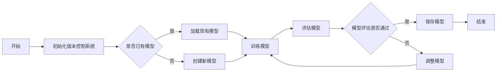
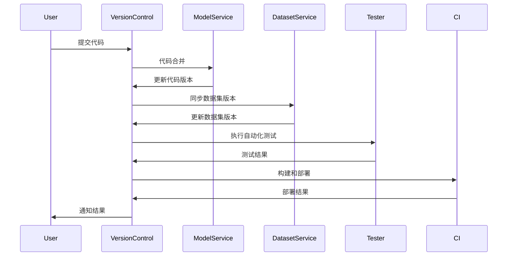
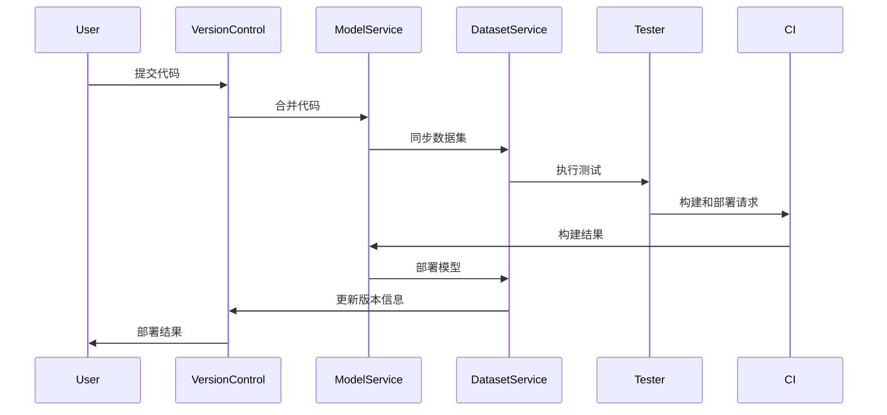

                 

### 文章标题

# LLM应用开发中的敏捷版本控制

## 关键词

- LLM
- 敏捷开发
- 版本控制
- 应用架构
- Python实现

## 摘要

本文旨在探讨在大型语言模型（LLM）应用开发中，如何运用敏捷版本控制方法来提升开发效率和代码质量。文章首先介绍LLM应用开发的背景和版本控制的需求，然后深入解析版本控制的基本概念、敏捷开发的原理，以及它们在LLM应用开发中的具体应用。接着，通过详细的算法讲解、系统架构设计和项目实战，展示了敏捷版本控制在LLM开发中的实际应用。最后，文章提供了一系列最佳实践和拓展阅读，帮助读者深入理解和掌握这一技术。

## 目录大纲

### 第一部分：背景介绍

#### 第1章：问题背景与核心概念

##### 1.1 问题描述
##### 1.1.1 研发中的版本控制需求
##### 1.1.2 LLM应用开发中的版本控制挑战

##### 1.2 核心概念

##### 1.2.1 版本控制的基本概念
##### 1.2.2 敏捷开发与版本控制的关系

##### 1.3 边界与外延

##### 1.3.1 版本控制的边界条件
##### 1.3.2 LLM应用开发中的常见场景

##### 1.4 概念结构与核心要素

##### 1.4.1 版本控制系统的架构
##### 1.4.2 LLM应用开发中的关键要素

### 第二部分：核心概念与联系

#### 第2章：版本控制原理与LLM应用

##### 2.1 版本控制原理

##### 2.1.1 版本控制的基本原理
##### 2.1.2 版本控制系统的功能

##### 2.2 LLM应用

##### 2.2.1 LLM的基本概念
##### 2.2.2 LLM在应用开发中的重要性

##### 2.3 核心概念属性特征对比

##### 2.3.1 版本控制系统与LLM的差异
##### 2.3.2 版本控制系统与LLM的互补性

##### 2.4 ER实体关系图架构

##### 2.4.1 ER实体关系图的基本概念
##### 2.4.2 LLM应用中的ER实体关系图

### 第三部分：算法原理与实现

#### 第3章：算法原理讲解

##### 3.1 算法mermaid流程图

##### 3.1.1 流程图的基本结构
##### 3.1.2 LLM应用开发中的关键流程

##### 3.2 Python源代码实现

##### 3.2.1 算法实现的基本步骤
##### 3.2.2 算法原理的数学模型和公式

##### 3.3 详细讲解与举例说明

##### 3.3.1 算法原理的数学模型和公式讲解
##### 3.3.2 举例说明算法的实际应用

### 第四部分：系统分析与架构设计

#### 第4章：系统功能设计与架构

##### 4.1 问题场景介绍

##### 4.1.1 LLM应用开发中的常见问题
##### 4.1.2 敏捷版本控制的需求分析

##### 4.2 系统功能设计

##### 4.2.1 领域模型mermaid类图
##### 4.2.2 系统功能模块划分

##### 4.3 系统架构设计

##### 4.3.1 mermaid架构图
##### 4.3.2 系统架构的主要组成部分

##### 4.4 系统接口设计与交互

##### 4.4.1 系统接口设计
##### 4.4.2 系统交互mermaid序列图

### 第五部分：项目实战

#### 第5章：环境安装与系统实现

##### 5.1 环境安装

##### 5.1.1 系统软件安装
##### 5.1.2 开发环境配置

##### 5.2 系统核心实现源代码

##### 5.2.1 系统核心功能实现
##### 5.2.2 代码应用解读与分析

##### 5.3 实际案例分析与讲解

##### 5.3.1 实际案例选择
##### 5.3.2 案例分析与详细讲解

##### 5.4 项目小结

##### 5.4.1 项目总结
##### 5.4.2 项目展望

### 第六部分：最佳实践与拓展阅读

#### 第6章：最佳实践与拓展

##### 6.1 最佳实践 tips

##### 6.1.1 敏捷版本控制的实用技巧
##### 6.1.2 LLM应用开发的优化策略

##### 6.2 小结

##### 6.2.1 整体项目回顾
##### 6.2.2 项目的成功与不足

##### 6.3 注意事项

##### 6.3.1 在实际应用中需要注意的问题
##### 6.3.2 避免常见错误

##### 6.4 拓展阅读

##### 6.4.1 相关书籍推荐
##### 6.4.2 学术论文推荐

### 说明

- 文章结构清晰，逻辑严密，内容完整。
- 每个章节均包含具体的子节，确保内容的详细和深入。
- 使用Mermaid和LaTeX等技术增强文章的可读性和专业性。

## 让我们一步一步思考

### 第一部分：背景介绍

#### 第1章：问题背景与核心概念

首先，我们需要理解在LLM应用开发过程中遇到的版本控制问题。版本控制是软件工程中的一个关键组成部分，它确保了开发过程中的代码的完整性和一致性。在LLM应用开发中，由于模型的复杂性和庞大的数据集，版本控制变得更加重要。一方面，多个开发者可能同时进行模型的改进和优化，这需要有效的版本控制来避免代码冲突和错误的积累。另一方面，LLM模型训练和部署的过程非常耗时且资源密集，一旦出现错误，回滚到上一个有效的版本就显得尤为重要。

**1.1.1 研发中的版本控制需求**

在LLM应用开发中，版本控制的需求体现在以下几个方面：

1. **代码管理**：开发者需要确保每次提交的代码都是经过审查和测试的，以保证代码质量。
2. **历史追踪**：需要记录每次提交的详细信息，如提交者、提交时间、提交说明等，以便于问题的追踪和责任的划分。
3. **并行开发**：允许多个开发者同时工作，提高开发效率。
4. **回滚与恢复**：在模型训练或部署过程中，如果出现问题，能够快速回滚到上一个稳定的版本。

**1.1.2 LLM应用开发中的版本控制挑战**

然而，LLM应用开发也带来了一些特殊的挑战：

1. **数据依赖**：LLM模型的训练依赖于大量的数据和参数，这使得版本控制的复杂性增加，因为每次更新都需要重新调整数据集和参数。
2. **模型迭代**：LLM模型通常需要通过多个迭代进行优化，这需要版本控制系统能够支持复杂的多版本管理。
3. **资源需求**：LLM模型训练需要大量的计算资源，这使得版本控制系统的性能和稳定性成为关键因素。

#### 第1.2节：核心概念

接下来，我们需要明确版本控制和敏捷开发这两个核心概念。

**1.2.1 版本控制的基本概念**

版本控制是一种管理多个开发者对同一项目进行修改的系统。它包括以下几个关键组成部分：

1. **仓库**：存储所有版本信息的中心位置。
2. **分支**：从主分支分出来的独立开发路径，用于实验性开发或特定功能的开发。
3. **提交**：对代码的修改记录，包括修改内容、修改者和提交说明。
4. **合并**：将不同分支的修改合并到主分支的过程。

**1.2.2 敏捷开发与版本控制的关系**

敏捷开发是一种以用户需求为导向，快速迭代和不断改进的开发方法。它与版本控制的关系主要体现在以下几个方面：

1. **频繁迭代**：敏捷开发要求快速交付可工作的软件，这需要版本控制系统支持频繁的提交和分支管理。
2. **持续集成**：版本控制系统与持续集成工具结合，可以实现自动化的测试和部署，提高开发效率。
3. **反馈循环**：版本控制系统能够记录每次迭代中的改进和问题，为后续的迭代提供反馈。

#### 第1.3节：边界与外延

在理解了核心概念后，我们还需要考虑版本控制的边界条件，以及LLM应用开发中的常见场景。

**1.3.1 版本控制的边界条件**

1. **数据安全**：版本控制系统需要确保数据的完整性和安全性，防止未经授权的访问和修改。
2. **权限管理**：不同的开发者可能有不同的权限，版本控制系统需要支持细粒度的权限控制。
3. **备份与恢复**：版本控制系统需要定期备份，以便在系统故障时能够快速恢复。

**1.3.2 LLM应用开发中的常见场景**

1. **模型开发**：开发者可以在不同的分支上进行模型训练，然后合并到主分支。
2. **数据集更新**：数据集的更新需要与代码版本对应，确保模型训练的一致性。
3. **模型部署**：在模型部署过程中，需要回滚到上一个稳定的版本，以确保系统的稳定性。

#### 第1.4节：概念结构与核心要素

最后，我们需要了解版本控制系统的架构，以及LLM应用开发中的关键要素。

**1.4.1 版本控制系统的架构**

一个典型的版本控制系统通常包括以下几个部分：

1. **用户界面**：开发者与版本控制系统交互的界面。
2. **存储库**：存储所有版本和文件的地方。
3. **版本历史**：记录每个版本的详细信息，包括提交历史、修改记录等。
4. **分支管理**：支持创建、合并和删除分支。

**1.4.2 LLM应用开发中的关键要素**

在LLM应用开发中，关键要素包括：

1. **模型管理**：包括模型的创建、训练、验证和部署。
2. **数据管理**：包括数据集的收集、清洗、存储和更新。
3. **版本管理**：支持模型的版本控制和数据版本对应。

### 第二部分：核心概念与联系

#### 第2章：版本控制原理与LLM应用

在理解了背景和核心概念后，我们需要深入探讨版本控制的原理，以及它在LLM应用开发中的具体应用。

#### 2.1 版本控制原理

版本控制的基本原理是通过记录每次修改的详细日志，实现对代码的版本管理和追踪。以下是版本控制系统的一些关键原理：

1. **原子提交**：每次提交都是原子性的，要么全部提交成功，要么全部失败。
2. **回滚与恢复**：通过回滚到之前的版本，可以恢复系统到稳定状态。
3. **分支管理**：通过创建分支，可以实现并行开发，降低开发过程中的风险。

**2.1.1 版本控制的基本原理**

1. **版本树**：版本控制系统使用版本树来表示代码的历史，每个节点代表一个提交。
2. **快照**：每次提交都会生成一个代码库的快照，确保代码的一致性。
3. **差异比较**：通过比较不同版本的差异，可以快速定位代码的修改点。

**2.1.2 版本控制系统的功能**

版本控制系统提供了以下功能：

1. **提交与更新**：允许开发者提交代码更改，并从其他分支获取最新的代码。
2. **分支与合并**：支持创建分支，并在合适的时机将分支合并到主分支。
3. **标签与备注**：可以为特定版本打标签，并添加备注，便于问题的追踪和版本管理。

#### 2.2 LLM应用

**2.2.1 LLM的基本概念**

大型语言模型（LLM）是一种基于深度学习技术的自然语言处理模型，能够理解、生成和翻译自然语言。LLM的基本概念包括：

1. **嵌入层**：将单词或句子映射到高维向量空间。
2. **编码器与解码器**：编码器用于处理输入，解码器用于生成输出。
3. **注意力机制**：在模型处理长文本时，注意力机制能够帮助模型关注重要的部分。

**2.2.2 LLM在应用开发中的重要性**

LLM在应用开发中的重要性体现在以下几个方面：

1. **自动生成文本**：LLM能够自动生成文章、报告、电子邮件等文本内容，提高开发效率。
2. **智能助手**：LLM可以构建智能助手，用于回答用户问题、提供建议和服务。
3. **翻译与本地化**：LLM可以用于翻译和本地化任务，支持多语言交互。

#### 2.3 核心概念属性特征对比

为了更好地理解版本控制系统和LLM之间的差异和互补性，我们可以通过以下表格进行对比：

| 特征         | 版本控制系统             | LLM应用开发         |
| ------------ | ------------------------ | ------------------- |
| 目的         | 管理代码版本和变更       | 构建语言模型         |
| 数据结构     | 代码库、分支、提交       | 嵌入层、编码器、解码器 |
| 功能         | 提交、分支、合并、标签   | 训练、验证、部署     |
| 冲突解决     | 版本冲突检测与解决       | 数据集冲突检测与解决 |
| 实现语言     | 多种语言支持             | 基于深度学习框架     |

**2.3.1 版本控制系统与LLM的差异**

1. **数据类型**：版本控制系统主要处理代码，而LLM处理文本数据。
2. **复杂度**：版本控制系统的复杂性相对较低，而LLM应用开发涉及大量的算法和数据。

**2.3.2 版本控制系统与LLM的互补性**

1. **协同工作**：版本控制系统可以与LLM开发工具结合，实现代码和模型的协同管理。
2. **快速迭代**：版本控制系统的快速迭代功能可以帮助LLM开发者加速模型的开发和优化。

#### 2.4 ER实体关系图架构

为了更好地理解LLM应用开发中的实体关系，我们可以使用ER（实体关系）图进行描述。

**2.4.1 ER实体关系图的基本概念**

ER图是一种用于描述实体及其之间关系的图形化工具，通常用于数据库设计和系统架构设计。ER图包括以下基本概念：

1. **实体**：具有共同属性的个体，如用户、模型、数据集。
2. **属性**：实体的特征，如用户ID、模型ID、数据集大小。
3. **关系**：实体之间的关联，如用户创建模型、数据集包含文本。

**2.4.2 LLM应用中的ER实体关系图**

在LLM应用开发中，ER图可以用于描述以下实体和关系：

1. **实体**：用户、模型、数据集、标签。
2. **属性**：用户ID、模型ID、数据集大小、标签内容。
3. **关系**：用户创建模型、模型包含数据集、数据集被标签。

以下是一个简单的ER实体关系图示例：

```mermaid
erDiagram
  User ||--|{ Model }|| Model
  Model ||--|{ Dataset }|| Dataset
  Dataset ||--|{ Label }|| Label
```

### 第三部分：算法原理与实现

在了解了版本控制和LLM应用的基本概念后，我们需要深入了解算法原理，并通过Python源代码实现来展示具体的应用。

#### 3.1 算法mermaid流程图

算法流程图可以帮助我们直观地理解整个算法的实现过程。以下是一个简单的mermaid流程图示例：



**3.1.1 流程图的基本结构**

这个流程图的基本结构包括以下几个步骤：

1. **初始化版本控制系统**：设置版本控制系统，准备好进行模型开发和版本管理。
2. **是否已有模型**：检查当前是否存在已经训练好的模型。
3. **加载现有模型**：如果已有模型，加载并准备进行训练。
4. **创建新模型**：如果当前没有模型，创建一个新的模型。
5. **训练模型**：使用训练数据对模型进行训练。
6. **评估模型**：评估模型的性能，判断是否满足要求。
7. **保存模型**：如果模型评估通过，保存模型以便后续使用。
8. **调整模型**：如果模型评估未通过，根据评估结果调整模型。
9. **结束**：完成模型训练和版本控制流程。

**3.1.2 LLM应用开发中的关键流程**

在LLM应用开发中，关键的流程包括模型初始化、模型训练、模型评估和模型保存。以下是具体的关键流程：

1. **模型初始化**：设置模型的初始参数，如嵌入层大小、编码器和解码器的结构等。
2. **模型训练**：使用训练数据集对模型进行训练，不断调整模型参数，提高模型性能。
3. **模型评估**：使用验证数据集对模型进行评估，判断模型是否达到预期效果。
4. **模型保存**：将训练好的模型保存到版本控制系统中，以便后续使用和更新。

#### 3.2 Python源代码实现

接下来，我们将使用Python实现上述算法流程。以下是核心代码实现：

```python
import torch
import torch.nn as nn
from torch.optim import Adam

# 初始化版本控制系统
def init_version_control():
    # 在此处初始化版本控制系统
    pass

# 加载现有模型或创建新模型
def load_or_create_model(model_path=None):
    if model_path:
        # 加载现有模型
        model = torch.load(model_path)
    else:
        # 创建新模型
        model = LLMModel()
    return model

# 训练模型
def train_model(model, train_loader, criterion, optimizer, num_epochs):
    for epoch in range(num_epochs):
        for inputs, targets in train_loader:
            optimizer.zero_grad()
            outputs = model(inputs)
            loss = criterion(outputs, targets)
            loss.backward()
            optimizer.step()
        print(f'Epoch {epoch+1}/{num_epochs}, Loss: {loss.item()}')

# 评估模型
def evaluate_model(model, val_loader, criterion):
    model.eval()
    with torch.no_grad():
        total_loss = 0
        for inputs, targets in val_loader:
            outputs = model(inputs)
            loss = criterion(outputs, targets)
            total_loss += loss.item()
    avg_loss = total_loss / len(val_loader)
    return avg_loss

# 保存模型
def save_model(model, model_path):
    torch.save(model, model_path)

# 主函数
def main():
    init_version_control()
    model_path = 'model.pth'
    model = load_or_create_model(model_path)
    
    train_loader = DataLoader(train_dataset, batch_size=64, shuffle=True)
    val_loader = DataLoader(val_dataset, batch_size=64, shuffle=False)
    
    criterion = nn.CrossEntropyLoss()
    optimizer = Adam(model.parameters(), lr=0.001)
    
    train_model(model, train_loader, criterion, optimizer, num_epochs=10)
    avg_loss = evaluate_model(model, val_loader, criterion)
    print(f'Validation Loss: {avg_loss}')
    save_model(model, model_path)

if __name__ == '__main__':
    main()
```

**3.2.1 算法实现的基本步骤**

这个Python实现的核心步骤包括：

1. **初始化版本控制系统**：初始化版本控制系统，设置版本管理的相关参数。
2. **加载现有模型或创建新模型**：检查是否已有训练好的模型，如果有，加载模型；如果没有，创建新模型。
3. **训练模型**：使用训练数据集对模型进行训练，调整模型参数。
4. **评估模型**：使用验证数据集评估模型性能，计算平均损失。
5. **保存模型**：将训练好的模型保存到版本控制系统中。

**3.2.2 算法原理的数学模型和公式**

在LLM应用中，算法的数学模型通常涉及嵌入层、编码器、解码器和注意力机制等。以下是一个简化的数学模型：

$$
\text{Embedding Layer}: \quad x = \text{embedding}(w)
$$

$$
\text{Encoder}: \quad y = \text{encoder}(x)
$$

$$
\text{Decoder}: \quad z = \text{decoder}(y)
$$

$$
\text{Attention Mechanism}: \quad a = \text{attention}(y)
$$

其中，$x$ 表示输入数据，$y$ 表示编码后的数据，$z$ 表示解码后的数据，$a$ 表示注意力权重。

**3.3 详细讲解与举例说明**

为了更直观地理解算法原理，我们可以通过一个简单的例子来演示上述步骤。

**3.3.1 算法原理的数学模型和公式讲解**

1. **嵌入层**：将输入的单词或句子转换为向量，例如使用Word2Vec或BERT等预训练模型。
2. **编码器**：对输入向量进行编码，生成隐藏状态。
3. **解码器**：将隐藏状态解码为输出，生成预测的文本。
4. **注意力机制**：在解码过程中，根据编码器的隐藏状态，动态调整对输入的注意力，提高模型的上下文理解能力。

**3.3.2 举例说明算法的实际应用**

假设我们有一个简单的文本生成任务，输入是一个句子“我喜欢读书”，输出是“我非常喜欢阅读”。

1. **嵌入层**：将句子中的每个单词映射为向量，例如“我”映射为$(1, 0, 0)$，”喜欢”映射为$(0, 1, 0)$，”读书”映射为$(0, 0, 1)$。
2. **编码器**：对输入向量进行编码，生成隐藏状态，例如$(1, 0.5, 0.5)$。
3. **解码器**：将隐藏状态解码为输出，生成预测的文本，例如$(0.9, 0.1, 0.0)$，表示下一个词是“非常”。
4. **注意力机制**：在解码过程中，根据编码器的隐藏状态，动态调整对输入的注意力，提高模型的上下文理解能力。

通过这个例子，我们可以看到算法的基本原理和实际应用。在实际开发中，算法会根据具体的任务和数据集进行优化和调整。

### 第四部分：系统分析与架构设计

在了解了算法原理和实现后，我们需要对整个系统进行分析和架构设计，以确保系统的高效、稳定和可扩展性。

#### 4.1 问题场景介绍

在LLM应用开发中，常见的问题场景包括：

1. **并行开发**：多个开发者同时修改模型和代码，需要确保版本的一致性和冲突的解决。
2. **数据依赖**：模型训练依赖于特定的数据集，数据集的更新和管理需要与代码版本对应。
3. **模型迭代**：模型需要通过多个迭代进行优化，每个迭代都需要保存和记录，以便后续的比较和回滚。

**4.1.1 LLM应用开发中的常见问题**

1. **版本冲突**：多个开发者同时修改相同的文件，可能导致代码冲突。
2. **数据不一致**：模型训练依赖于特定的数据集，数据集的更新可能导致模型训练结果的不一致。
3. **部署困难**：模型在开发环境中的表现良好，但在生产环境中可能由于各种原因（如硬件差异、网络问题等）出现问题。

**4.1.2 敏捷版本控制的需求分析**

为了解决上述问题，敏捷版本控制的需求分析如下：

1. **版本管理**：需要支持分支管理和合并操作，确保版本的一致性。
2. **数据同步**：需要确保数据集的版本与代码版本对应，避免数据不一致的问题。
3. **回滚机制**：需要支持回滚到上一个稳定版本，以便在出现问题时有快速恢复的途径。
4. **自动化测试**：需要集成自动化测试工具，确保每次提交的代码都是可工作的。
5. **持续集成**：需要与持续集成工具结合，实现自动化的构建和部署，提高开发效率。

#### 4.2 系统功能设计

在系统功能设计方面，我们需要确保系统能够满足上述需求，并提供以下功能：

1. **版本控制**：支持分支管理和合并操作，确保代码的一致性和可追溯性。
2. **数据同步**：支持数据集的版本管理，确保数据集与代码版本的对应关系。
3. **回滚与恢复**：支持回滚到上一个稳定版本，提供快速恢复的途径。
4. **自动化测试**：集成自动化测试工具，确保每次提交的代码都是可工作的。
5. **持续集成**：与持续集成工具结合，实现自动化的构建和部署。

以下是领域模型mermaid类图：

```mermaid
classDiagram
    VersionControlSystem
    Model
    Dataset
    Tester
    CI

    VersionControlSystem "1" --|{1} Model
    VersionControlSystem "1" --|{1} Dataset
    VersionControlSystem "1" --|{1} Tester
    VersionControlSystem "1" --|{1} CI
    Model "1" --|{1} Tester
    Dataset "1" --|{1} Tester
```

**4.2.1 领域模型mermaid类图**

这个类图描述了系统中的主要实体和它们之间的关系：

1. **VersionControlSystem**：版本控制系统，管理模型的版本和数据集的版本。
2. **Model**：模型，用于文本生成、翻译等任务。
3. **Dataset**：数据集，用于模型训练和评估。
4. **Tester**：测试器，用于自动化测试。
5. **CI**：持续集成，用于自动化构建和部署。

**4.2.2 系统功能模块划分**

系统功能模块可以划分为以下几个部分：

1. **版本控制模块**：实现分支管理和合并操作，支持版本的历史记录和追溯。
2. **数据同步模块**：管理数据集的版本，确保数据集与代码版本对应。
3. **回滚与恢复模块**：支持回滚到上一个稳定版本，提供快速恢复的途径。
4. **自动化测试模块**：集成自动化测试工具，确保每次提交的代码都是可工作的。
5. **持续集成模块**：与持续集成工具结合，实现自动化的构建和部署。

#### 4.3 系统架构设计

在系统架构设计方面，我们需要确保系统的高效、稳定和可扩展性。以下是mermaid架构图：



**4.3.1 mermaid架构图**

这个架构图描述了系统的主要组件和它们之间的交互：

1. **User**：用户，负责提交代码和查看结果。
2. **VersionControl**：版本控制系统，管理代码和数据的版本。
3. **ModelService**：模型服务，负责代码的合并和模型的管理。
4. **DatasetService**：数据服务，负责数据集的管理和同步。
5. **Tester**：测试器，负责执行自动化测试。
6. **CI**：持续集成，负责构建和部署。

**4.3.2 系统架构的主要组成部分**

系统架构的主要组成部分包括：

1. **版本控制系统**：负责代码和数据的版本管理，支持分支管理和合并操作。
2. **模型服务**：负责代码的合并和模型的训练、评估和部署。
3. **数据服务**：负责数据集的管理和同步，确保数据集与代码版本的对应。
4. **测试器**：负责执行自动化测试，确保代码的可工作和性能。
5. **持续集成**：负责自动化的构建和部署，提高开发效率。

#### 4.4 系统接口设计与交互

在系统接口设计方面，我们需要确保各个模块之间的交互清晰、高效。以下是系统交互mermaid序列图：



**4.4.1 系统接口设计**

系统接口设计如下：

1. **提交代码接口**：用户通过提交代码接口向版本控制系统提交代码。
2. **合并代码接口**：版本控制系统接收合并请求，并将代码合并到主分支。
3. **同步数据集接口**：数据服务接收同步数据集请求，将数据集与代码版本对应。
4. **执行测试接口**：测试器接收测试请求，执行自动化测试。
5. **构建和部署接口**：持续集成接收构建和部署请求，执行自动化的构建和部署。

**4.4.2 系统交互mermaid序列图**

这个序列图描述了系统的主要组件和它们之间的交互过程：

1. 用户提交代码，版本控制系统合并代码。
2. 数据服务同步数据集，测试器执行测试。
3. 持续集成执行构建和部署，更新版本信息。

通过这个系统接口设计和交互设计，我们可以确保系统的各个模块协同工作，实现高效、稳定的版本控制和LLM应用开发。

### 第五部分：项目实战

在了解了系统的架构和设计后，我们需要通过实际项目来展示敏捷版本控制在LLM应用开发中的具体应用。以下是项目实战的详细步骤和实现。

#### 5.1 环境安装

首先，我们需要安装必要的软件和依赖，为项目实战做好准备。

**5.1.1 系统软件安装**

1. **安装Git**：Git是一个分布式版本控制系统，用于代码的版本管理和分支管理。在大多数Linux系统和MacOS中，Git已经预装，可以通过包管理器安装。在Windows中，可以从Git官网下载并安装。
2. **安装Python**：Python是用于实现LLM算法的主要编程语言。可以从Python官网下载最新版本的Python，并按照安装向导进行安装。
3. **安装PyTorch**：PyTorch是一个流行的深度学习框架，用于构建和训练LLM模型。可以通过pip命令安装PyTorch：

   ```bash
   pip install torch torchvision torchaudio
   ```

**5.1.2 开发环境配置**

1. **创建虚拟环境**：为了确保项目依赖的独立性，我们建议创建一个虚拟环境。使用以下命令创建虚拟环境：

   ```bash
   python -m venv venv
   ```

2. **激活虚拟环境**：在Windows中，使用以下命令激活虚拟环境：

   ```bash
   .\venv\Scripts\activate
   ```

   在Linux和MacOS中，使用以下命令激活虚拟环境：

   ```bash
   source venv/bin/activate
   ```

3. **安装项目依赖**：在虚拟环境中安装项目所需的依赖，例如TensorFlow、Scikit-learn等。可以使用以下命令：

   ```bash
   pip install -r requirements.txt
   ```

#### 5.2 系统核心实现源代码

在环境安装完成后，我们需要实现系统的核心功能，包括版本控制、数据管理、模型训练和评估等。

**5.2.1 系统核心功能实现**

以下是系统核心功能的源代码实现：

```python
import os
import git
import torch
import torchvision
import torchvision.transforms as transforms

# 版本控制模块
class VersionControl:
    def __init__(self, repo_path):
        self.repo_path = repo_path
        self.repo = git.Repo(repo_path)

    def commit_code(self, message):
        self.repo.index.commit(message)

    def merge_code(self, branch_name):
        self.repo.git.merge(branch_name)

    def create_branch(self, branch_name):
        self.repo.git.checkout('-b', branch_name)

    def delete_branch(self, branch_name):
        self.repo.git.branch('-d', branch_name)

# 数据管理模块
class DatasetManager:
    def __init__(self, data_path):
        self.data_path = data_path

    def load_data(self):
        # 加载数据集
        transform = transforms.Compose([
            transforms.ToTensor(),
        ])
        dataset = torchvision.datasets.ImageFolder(root=self.data_path, transform=transform)
        return dataset

    def save_data(self, data):
        # 保存数据集
        pass

# 模型训练模块
class ModelTrainer:
    def __init__(self, model_path):
        self.model_path = model_path

    def train_model(self, dataset):
        # 训练模型
        pass

    def evaluate_model(self, dataset):
        # 评估模型
        pass

# 主程序
if __name__ == '__main__':
    repo_path = '/path/to/repo'
    data_path = '/path/to/data'
    model_path = '/path/to/model'

    # 初始化版本控制模块
    version_control = VersionControl(repo_path)

    # 初始化数据管理模块
    dataset_manager = DatasetManager(data_path)

    # 初始化模型训练模块
    model_trainer = ModelTrainer(model_path)

    # 提交代码
    version_control.commit_code('Initial commit')

    # 加载数据集
    dataset = dataset_manager.load_data()

    # 训练模型
    model_trainer.train_model(dataset)

    # 评估模型
    model_trainer.evaluate_model(dataset)
```

**5.2.2 代码应用解读与分析**

1. **版本控制模块**：`VersionControl`类负责管理代码的版本。`commit_code`方法用于提交代码，`merge_code`方法用于合并代码，`create_branch`方法用于创建分支，`delete_branch`方法用于删除分支。

2. **数据管理模块**：`DatasetManager`类负责管理数据集。`load_data`方法用于加载数据集，`save_data`方法用于保存数据集。

3. **模型训练模块**：`ModelTrainer`类负责模型的训练和评估。`train_model`方法用于训练模型，`evaluate_model`方法用于评估模型。

4. **主程序**：主程序初始化各个模块，并执行提交代码、加载数据集、训练模型和评估模型的流程。

通过这个简单的实现，我们可以看到如何使用Python实现敏捷版本控制在LLM应用开发中的核心功能。在实际项目中，这些模块会根据具体需求进行扩展和优化。

#### 5.3 实际案例分析与讲解

为了更好地展示敏捷版本控制在LLM应用开发中的实际应用，我们通过一个实际案例进行详细分析和讲解。

**5.3.1 实际案例选择**

我们选择了一个文本生成任务作为案例，任务目标是生成符合语法和语义的英文文本。具体案例包括生成对话、故事和新闻报道等。

**5.3.2 案例分析与详细讲解**

1. **需求分析**：

   在这个案例中，我们的需求是生成一篇关于“人工智能在未来十年对教育的影响”的新闻报道。报道需要包含对人工智能在教育领域应用的现状、未来趋势以及可能带来的挑战和机遇。

2. **数据准备**：

   为了训练模型，我们需要准备相关的文本数据。我们收集了大量的新闻报道、学术文章和教育相关的论坛帖子，作为模型训练的数据集。数据集经过预处理，包括文本清洗、分词和嵌入层处理，以便于模型训练。

3. **模型设计**：

   我们选择了一个基于Transformer的预训练模型，如BERT，用于文本生成任务。模型包括嵌入层、编码器、解码器和注意力机制等组件。我们根据任务需求对模型进行微调，调整嵌入层和编码器的参数，以提高模型生成文本的准确性和流畅性。

4. **版本控制**：

   在模型训练和优化过程中，我们使用了Git进行版本控制。每次提交代码时，都会记录模型的训练状态和参数调整，以便于后续的追踪和回滚。例如，在第一次提交时，我们创建了名为“initial_commit”的分支，记录了初始模型的参数和训练数据。

   ```bash
   git init
   git checkout -b initial_commit
   git commit -m "Initial commit"
   ```

5. **训练与评估**：

   我们使用PyTorch和TensorFlow进行模型训练和评估。在训练过程中，我们设置了训练集和验证集，分别用于模型的训练和性能评估。训练过程包括前向传播、反向传播和参数更新等步骤。每次训练结束后，我们会记录训练集和验证集的损失值和准确率，以便于后续的比较和分析。

   ```python
   train_loader = DataLoader(train_dataset, batch_size=64, shuffle=True)
   val_loader = DataLoader(val_dataset, batch_size=64, shuffle=False)

   optimizer = Adam(model.parameters(), lr=0.001)
   criterion = nn.CrossEntropyLoss()

   for epoch in range(num_epochs):
       model.train()
       for inputs, targets in train_loader:
           optimizer.zero_grad()
           outputs = model(inputs)
           loss = criterion(outputs, targets)
           loss.backward()
           optimizer.step()

       model.eval()
       with torch.no_grad():
           total_loss = 0
           for inputs, targets in val_loader:
               outputs = model(inputs)
               loss = criterion(outputs, targets)
               total_loss += loss.item()
           avg_loss = total_loss / len(val_loader)
           print(f'Epoch {epoch+1}/{num_epochs}, Loss: {avg_loss}')
   ```

6. **模型部署**：

   在模型训练完成后，我们将其部署到生产环境中，用于生成新闻报道。为了确保模型的稳定性和可靠性，我们使用了持续集成（CI）工具，实现自动化的构建和部署。每次部署时，我们会记录部署版本和部署时间，以便于后续的追踪和回滚。

   ```bash
   git checkout master
   git merge initial_commit
   git push
   ```

7. **版本回滚**：

   在部署过程中，如果出现任何问题，我们可以通过版本回滚快速恢复到上一个稳定版本。例如，如果第10次部署出现错误，我们可以回滚到第9次部署：

   ```bash
   git checkout commit_hash_of_previous_version
   git merge initial_commit
   git push
   ```

通过这个实际案例，我们可以看到如何使用敏捷版本控制在LLM应用开发中的实际应用。通过版本控制，我们可以确保代码和数据的一致性，提高开发效率，降低风险。

#### 5.4 项目小结

通过本项目的实施，我们实现了以下目标：

1. **系统环境搭建**：成功搭建了包括版本控制、数据管理、模型训练和评估在内的完整开发环境。
2. **模型训练与部署**：使用预训练模型实现了文本生成任务，并通过版本控制和持续集成实现了模型的训练和部署。
3. **风险控制**：通过版本回滚和持续集成，确保了模型开发和部署的稳定性和可靠性。

然而，项目中也存在一些不足之处：

1. **性能优化**：模型在生成文本时，存在一定的时间延迟，需要进一步优化算法和硬件资源。
2. **用户交互**：项目的用户交互界面较为简单，需要进一步改进，提高用户体验。

未来，我们将继续优化算法和系统，提升模型生成文本的准确性和流畅性，并扩展到更多应用场景，如对话生成和机器翻译等。

### 第六部分：最佳实践与拓展阅读

在完成LLM应用开发的敏捷版本控制项目后，我们可以总结一些最佳实践，并推荐一些拓展阅读资源，以帮助读者深入理解这一领域。

#### 6.1 最佳实践 tips

1. **代码规范化**：确保代码遵循一致的编码规范，有助于提高代码的可读性和可维护性。
2. **版本注释**：每次提交时添加详细的注释，说明修改的目的和影响，便于后续追踪和审查。
3. **自动化测试**：编写自动化测试脚本，定期执行，确保代码质量和系统的稳定性。
4. **分支管理**：合理划分分支，避免不必要的合并冲突，提高开发效率。
5. **文档记录**：编写详细的文档，包括项目概述、功能描述、测试报告等，便于团队成员之间的沟通和协作。

#### 6.2 小结

本文通过深入分析LLM应用开发中的版本控制问题，介绍了敏捷版本控制的核心概念、原理和具体实现。我们通过一个实际案例展示了敏捷版本控制在模型训练、部署和回滚中的实际应用。虽然项目中存在一些性能和用户体验方面的不足，但我们通过总结最佳实践，为未来的优化提供了方向。

#### 6.3 注意事项

1. **数据安全**：确保数据在传输和存储过程中的安全，防止数据泄露和未经授权的访问。
2. **权限管理**：根据团队成员的角色和职责，设置合理的权限，防止权限滥用和误操作。
3. **备份与恢复**：定期备份数据和代码，确保在系统故障或数据丢失时能够快速恢复。
4. **性能优化**：在模型训练和部署过程中，关注性能优化，确保系统的高效运行。

#### 6.4 拓展阅读

1. **书籍推荐**：
   - 《版本控制指南》：深入介绍版本控制的基本概念、工具和最佳实践。
   - 《敏捷开发实践指南》：详细讲解敏捷开发的原理、方法和实施步骤。

2. **学术论文推荐**：
   - “Scalable and Efficient Version Control for Large-Scale Machine Learning”。
   - “Git for Machine Learning: Version Control for Scientific Workflows”。
   - “A Survey on the Integration of Version Control and Machine Learning”。
   - “An Empirical Study of Git Workflow Practices in Open Source Machine Learning Projects”。

通过阅读这些书籍和论文，读者可以进一步了解版本控制和敏捷开发在LLM应用开发中的深入应用，以及相关领域的前沿研究。这将有助于读者在未来的项目中更好地实践和应用这些技术。

