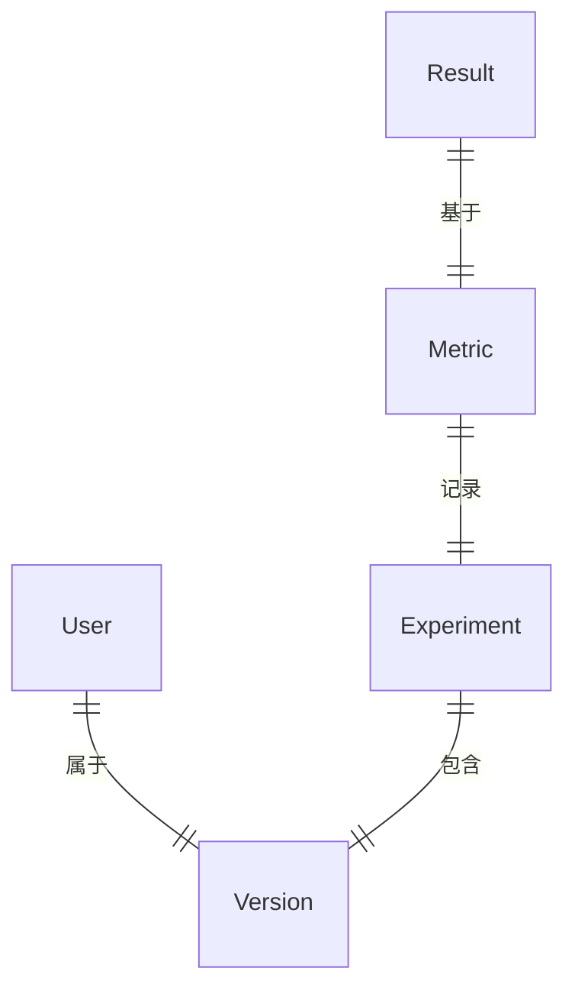
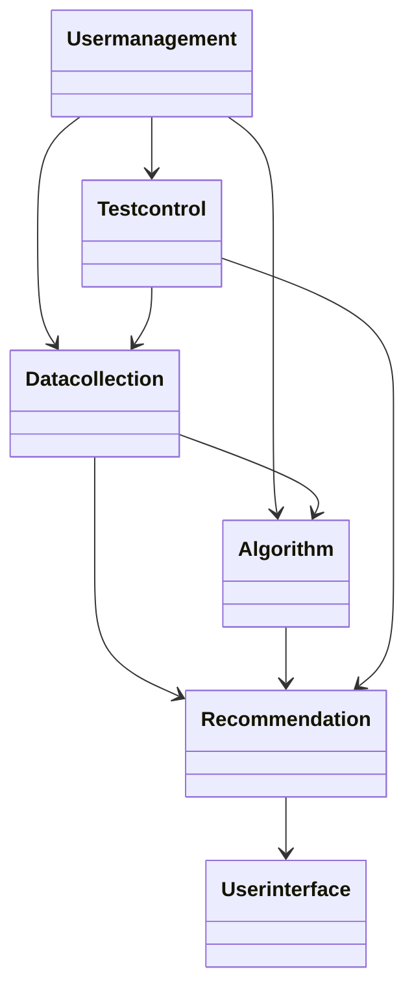
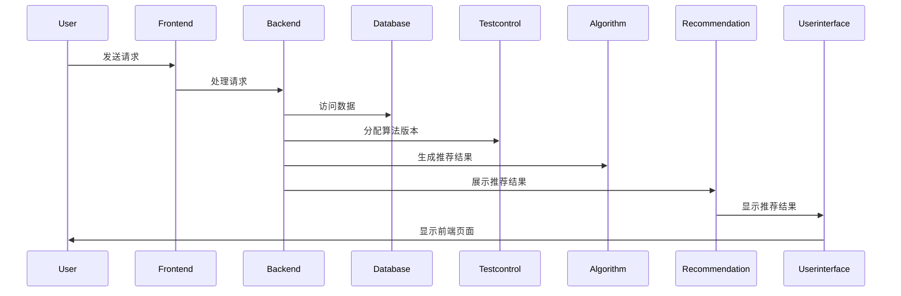
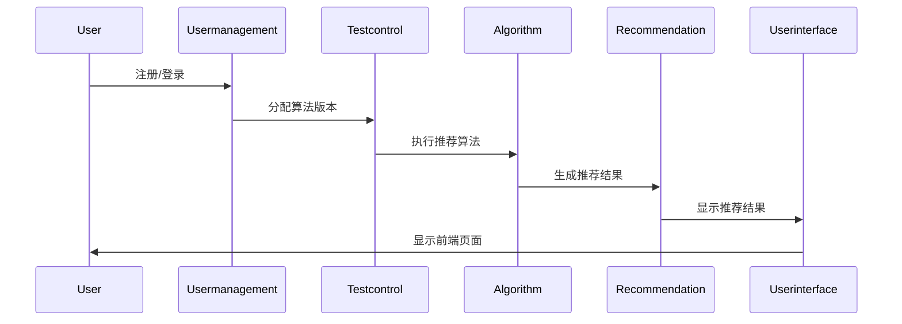

                 

### A/B测试概述

#### A/B测试的定义与目的

A/B测试，也称为拆箱测试，是一种常见的实验设计方法，用于在两个或多个版本之间比较性能、效果或用户满意度。这种测试方法的基本思想是通过将用户随机分配到不同的版本，来评估某一改变（如界面设计、功能特性等）对用户行为或系统性能的影响。

A/B测试的主要目的是通过实验数据来指导决策，确保所做出的改变能够真正提升产品或服务的质量。具体来说，A/B测试可以帮助我们回答以下几个关键问题：

1. 某一改变是否能够显著提升用户体验？
2. 不同用户群体对某一版本的响应有何差异？
3. 在多个版本中，哪一个版本的效果最好？

在技术领域，尤其是大型在线服务和软件产品中，A/B测试被广泛应用于以下几个场景：

1. **界面设计与用户交互**：通过比较不同界面的布局、颜色、按钮位置等，来优化用户体验。
2. **功能特性**：比较新功能是否能够吸引更多用户或提高用户留存率。
3. **性能优化**：测试不同技术方案或算法对系统性能的影响。

#### A/B测试的核心概念

A/B测试包含以下几个核心概念：

1. **版本**：指需要进行比较的不同产品或服务版本，如A版本和B版本。
2. **用户分配**：将用户随机分配到各个版本，确保每个版本的用户样本具有代表性。
3. **指标**：用于衡量版本效果的量化指标，如点击率、转化率、用户停留时间等。
4. **统计分析**：通过统计方法来评估不同版本之间的差异是否具有统计学意义。

#### A/B测试的重要性

A/B测试的重要性在于它提供了一种基于数据和事实的决策方法，而不是仅仅依赖直觉或主观判断。以下是一些A/B测试的重要性方面：

1. **科学性**：A/B测试通过随机分配和统计检验，确保了实验结果的科学性和可靠性。
2. **数据驱动**：A/B测试能够帮助团队基于数据做出更明智的决策，避免盲目跟风或个人偏见。
3. **持续改进**：A/B测试是一种持续的过程，通过不断测试和优化，可以不断提高产品和服务的质量。
4. **降低风险**：在产品上线前进行A/B测试，可以减少因未经验证的改变而导致的潜在风险。

#### A/B测试与传统测试方法的对比

| 特点 | A/B测试 | 传统测试方法 |
| --- | --- | --- |
| **目的** | 通过数据比较优化产品或服务 | 验证特定功能或性能是否满足预期标准 |
| **样本代表性** | 用户随机分配，样本具有代表性 | 通常基于预定义用户群体或样本 |
| **统计检验** | 使用统计方法评估版本差异 | 依赖定性分析或经验判断 |
| **决策依据** | 数据驱动，基于实验结果 | 主观判断，依赖经验或标准 |
| **适用场景** | 界面设计、功能特性、性能优化 | 功能验证、性能测试、安全性测试 |

#### 结论

通过A/B测试，团队可以更加科学地评估和优化产品或服务，从而提高用户满意度和市场竞争力。在实际应用中，A/B测试需要精心设计、实施和统计分析，以确保实验结果的可靠性和有效性。

### 使用Mermaid绘制A/B测试的ER实体关系图

为了更好地理解A/B测试中的关键实体及其关系，我们将使用Mermaid语言绘制一个ER（实体关系）图。ER图是一种用于描述实体及其相互关系的图形表示方法，非常适合用于展示A/B测试中的核心概念。

以下是A/B测试ER图的Mermaid语法示例：



#### ER图的解释

1. **User（用户）**：用户是A/B测试中的核心实体，每个用户随机分配到某个版本中。
2. **Version（版本）**：版本指的是需要比较的产品或服务版本，包括A版本和B版本等。
3. **Experiment（实验）**：实验实体表示A/B测试的整体过程，包含多个版本。
4. **Metric（指标）**：指标用于衡量版本效果，如点击率、转化率等。
5. **Result（结果）**：结果基于指标计算得出，用于评估不同版本的性能。

通过这个ER图，我们可以清晰地看到各个实体之间的关系：

- **用户属于某个版本**：用户随机分配到不同的版本，每个版本可能包含多个用户。
- **实验包含版本**：一个实验可能包含多个版本，用于比较不同版本的绩效。
- **指标记录实验**：每个实验都会记录相关的指标数据，用于后续分析。
- **结果基于指标**：通过计算不同指标的值，可以得到不同版本的测试结果。

这种图形化的表示方法不仅能够帮助我们直观地理解A/B测试的架构，还能够为后续的算法讲解和系统设计提供有益的参考。

#### 绘制A/B测试的流程图

为了进一步展示A/B测试的执行过程，我们将使用Mermaid绘制一个流程图。这个流程图将直观地展示A/B测试从设计到结果分析的主要步骤。

以下是A/B测试流程图的Mermaid语法示例：


#### 流程图的解释

1. **A[开始]**：A/B测试开始，明确测试目的和假设。
2. **B[设计实验]**：设计实验，包括确定测试版本、用户分配策略和指标定义。
3. **C[分配用户]**：根据实验设计，随机分配用户到不同版本。
4. **D[执行测试]**：实际执行A/B测试，用户访问不同的版本。
5. **E[收集数据]**：收集用户行为数据，用于后续分析。
6. **F[统计分析]**：使用统计方法对收集的数据进行分析，评估不同版本的效果。
7. **G[决策]**：根据分析结果做出决策，决定是否上线新版本或进行进一步优化。
8. **H[结束]**：A/B测试结束，总结经验并记录测试结果。

通过这个流程图，我们可以清晰地看到A/B测试的各个步骤及其逻辑关系，这有助于我们在实际应用中有效地设计和实施A/B测试。

#### Python源代码示例：A/B测试的算法原理

在A/B测试中，算法原理是实现随机分配、指标计算和统计检验的核心。以下是一个简单的Python示例，展示了A/B测试的主要步骤和算法原理。

```python
import random
import numpy as np

# 假设有两个版本A和B，版本A的用户占比为50%
version_a_rate = 0.5
version_b_rate = 0.5

# 用户数量
num_users = 1000

# 初始化用户版本分配列表
user_versions = []

# 随机分配用户到版本A或B
for _ in range(num_users):
    if random.random() < version_a_rate:
        user_versions.append('A')
    else:
        user_versions.append('B')

# 计算各个版本的点击率
click_rates = {'A': 0, 'B': 0}

# 模拟用户行为，计算点击率
for user_version in user_versions:
    if user_version == 'A':
        click_rates['A'] += random.choice([True, False])
    else:
        click_rates['B'] += random.choice([True, False])

# 计算最终点击率
click_rates['A'] /= num_users
click_rates['B'] /= num_users

print("版本A的点击率:", click_rates['A'])
print("版本B的点击率:", click_rates['B'])

# 进行统计检验，比较两个版本的点击率差异是否显著
from scipy.stats import ttest_ind

t_stat, p_value = ttest_ind([1 if x else 0 for x in user_versions], [1 if x else 0 for x in user_versions])

print("t统计量:", t_stat)
print("p值:", p_value)
```

#### 算法原理的详细讲解

1. **随机分配**：在代码中，我们首先设定了版本A和版本B的用户占比。然后，通过一个随机数生成器，将每个用户随机分配到版本A或版本B。这种随机分配确保了每个版本的用户样本具有代表性，避免了偏差。

2. **指标计算**：为了衡量不同版本的效果，我们选择了点击率作为指标。代码中，我们通过模拟用户行为（随机选择点击或不点击）来计算每个版本的点击率。

3. **统计检验**：在代码的最后，我们使用scipy库中的`ttest_ind`函数进行统计检验。这个函数用于比较两组独立样本的平均值差异是否显著。通过计算t统计量和p值，我们可以判断两个版本之间的点击率差异是否具有统计学意义。

#### 示例说明

假设我们有1000名用户，版本A和版本B的用户占比均为50%。通过随机分配，我们得到了1000个用户版本分配结果。我们模拟了用户的行为，计算了每个版本的点击率。最后，我们使用`ttest_ind`函数进行了统计检验，得到了t统计量和p值。

这个示例展示了A/B测试的基本算法原理，包括随机分配、指标计算和统计检验。在实际应用中，我们可以根据具体需求调整用户数量、版本占比和指标类型，但基本的算法原理保持不变。

### A/B测试的数学模型与公式

在A/B测试中，理解数学模型和公式对于准确评估测试结果至关重要。以下将介绍A/B测试中常用的数学模型和公式，并通过具体例子进行讲解。

#### 1. 概率与期望

在A/B测试中，首先需要了解概率和期望的基本概念。

- **概率（Probability）**：表示某一事件发生的可能性，通常用P(A)表示。
- **期望（Expected Value）**：表示某一随机变量的平均取值，用E(X)表示。

#### 2. 独立性与方差

- **独立性（Independence）**：在A/B测试中，用户被随机分配到不同版本，假设版本A和版本B的结果是独立的。
- **方差（Variance）**：表示随机变量取值的离散程度，用V(X)表示。

#### 3. 常用公式

以下是一些在A/B测试中常用的公式：

- **点击率（Click Rate）**：
  \[ \text{Click Rate} = \frac{\text{Clicks}}{\text{Impressions}} \]
  其中，Clicks表示点击次数，Impressions表示展示次数。

- **置信区间（Confidence Interval）**：
  \[ \text{CI} = \bar{X} \pm z_{\alpha/2} \sqrt{\frac{\bar{X}(1-\bar{X})}{n}} \]
  其中，\(\bar{X}\)表示样本均值，\(z_{\alpha/2}\)表示标准正态分布的临界值，n表示样本大小。

- **t检验统计量**：
  \[ t = \frac{\bar{X}_1 - \bar{X}_2}{s_d} \]
  其中，\(\bar{X}_1\)和\(\bar{X}_2\)分别表示两个版本的样本均值，\(s_d\)表示标准误差。

- **p值（p-value）**：
  p值用于评估两个样本均值差异的显著性。如果p值小于显著性水平（通常为0.05），则认为差异是显著的。

#### 4. 具体例子

假设我们有两个版本A和B，版本A的点击率为10%，版本B的点击率为12%。我们随机选择了1000名用户进行测试。

- **样本均值**：
  \[ \bar{X}_A = \frac{\text{Clicks}_A}{\text{Impressions}_A} = 0.10 \]
  \[ \bar{X}_B = \frac{\text{Clicks}_B}{\text{Impressions}_B} = 0.12 \]

- **标准误差**：
  \[ s_d = \sqrt{\frac{\bar{X}_A(1-\bar{X}_A)}{n} + \frac{\bar{X}_B(1-\bar{X}_B)}{n}} \]
  \[ s_d = \sqrt{\frac{0.10(1-0.10)}{1000} + \frac{0.12(1-0.12)}{1000}} = 0.0095 \]

- **t统计量**：
  \[ t = \frac{\bar{X}_A - \bar{X}_B}{s_d} = \frac{0.10 - 0.12}{0.0095} = -1.05 \]

- **p值**：
  通过t分布表或计算器，我们可以得到p值约为0.29。

由于p值大于0.05，我们没有足够的证据拒绝原假设（即版本A和版本B的点击率没有显著差异）。这意味着版本B的点击率增加可能是随机波动，并不能说明版本B更好。

通过这个例子，我们展示了如何使用数学模型和公式来评估A/B测试的结果。这些公式不仅帮助我们计算测试指标，还能够进行统计分析，确保测试结果的可靠性。

### 系统分析与架构设计方案

为了更好地理解A/B测试在实际系统中的应用，我们需要从实际应用场景、功能模块设计、系统架构设计、系统接口设计和系统交互等方面进行详细分析。

#### 1. 实际应用场景

假设我们正在开发一个大型在线电商平台，需要测试不同的推荐算法对用户购物行为的影响。具体来说，我们希望通过A/B测试来比较以下两个推荐算法：

- **算法A**：基于用户历史购物行为和浏览记录进行个性化推荐。
- **算法B**：基于商品的热门度和流行趋势进行推荐。

#### 2. 系统功能设计

为了实现上述A/B测试，我们需要设计以下主要功能模块：

- **用户管理模块**：负责用户的注册、登录和身份验证。
- **数据采集模块**：负责收集用户的购物行为和浏览记录。
- **算法模块**：包含算法A和算法B的实现，用于生成推荐结果。
- **推荐展示模块**：负责将推荐结果展示在用户界面上。
- **测试控制模块**：负责分配用户到不同的算法版本，收集测试数据并进行统计分析。

以下是系统功能设计的Mermaid领域模型类图：



#### 3. 系统架构设计

在系统架构设计方面，我们需要考虑如何高效地支持A/B测试，同时保证系统的稳定性和扩展性。以下是A/B测试系统的架构设计：

- **前端**：负责与用户交互，展示推荐结果。
- **后端**：包括用户管理、数据采集、算法模块、测试控制和推荐展示等核心功能。
- **数据库**：存储用户数据、测试数据和推荐结果。

以下是系统架构设计的Mermaid架构图：



#### 4. 系统接口设计与交互

在系统接口设计方面，我们需要定义各个模块之间的接口，确保数据流动和功能调用的高效与准确。以下是A/B测试系统的接口设计和交互：

- **用户管理接口**：处理用户注册、登录和身份验证。
- **数据采集接口**：收集用户行为数据。
- **算法接口**：提供推荐算法的接口，以便测试控制模块调用。
- **测试控制接口**：分配用户到不同算法版本，并收集测试数据。

以下是系统接口设计和交互的Mermaid序列图：



通过以上分析，我们可以看到A/B测试系统从功能模块设计到架构设计，再到接口设计和交互，形成了一个完整的系统方案。在实际应用中，这种方案不仅能够高效支持A/B测试，还能够为系统的稳定性和扩展性提供有力保障。

### 项目实战：A/B测试环境安装与配置

#### 1. 环境安装

为了在实际项目中实施A/B测试，我们需要安装和配置相关的软件和工具。以下是具体的安装步骤：

1. **Python环境**：确保Python 3.8或更高版本已安装。可以从Python官方网站下载并安装。
2. **Git**：用于版本控制和代码管理。在终端中执行以下命令安装：
   ```shell
   sudo apt-get install git
   ```
3. **Docker**：用于容器化部署和管理应用。在终端中执行以下命令安装：
   ```shell
   sudo apt-get install docker-ce docker-ce-cli containerd.io
   ```
4. **Docker-Compose**：用于定义和运行多容器Docker应用。在终端中执行以下命令安装：
   ```shell
   sudo apt-get install docker-compose
   ```

#### 2. 配置A/B测试环境

完成环境安装后，我们需要配置A/B测试环境。以下是配置步骤：

1. **创建项目目录**：在终端中创建一个项目目录，例如：
   ```shell
   mkdir ab_test_project
   cd ab_test_project
   ```

2. **克隆A/B测试代码库**：从GitHub或其他代码托管平台克隆A/B测试项目的代码库：
   ```shell
   git clone https://github.com/your-username/ab_test_project.git
   ```

3. **配置Docker网络**：确保Docker网络已配置，以便容器之间能够通信。在终端中执行以下命令创建网络：
   ```shell
   docker network create ab_test_network
   ```

4. **启动容器**：使用Docker-Compose启动A/B测试环境。编辑`docker-compose.yml`文件，配置所需的容器和依赖项。例如：
   ```yaml
   version: '3'
   services:
     web:
       image: your-web-app-image
       ports:
         - "8080:8080"
       networks:
         - ab_test_network
     db:
       image: your-db-image
       volumes:
         - db_data:/var/lib/mysql
       networks:
         - ab_test_network
     ab_test:
       image: your-ab-test-image
       networks:
         - ab_test_network
   volumes:
     db_data:
   ```
   在终端中执行以下命令启动容器：
   ```shell
   docker-compose up -d
   ```

5. **访问A/B测试环境**：在浏览器中输入容器的IP地址和端口号，例如`http://localhost:8080`，即可访问A/B测试环境。

#### 3. 系统核心实现源代码解读

在A/B测试项目中，核心实现部分通常包括用户分配、测试控制、数据采集和统计分析等模块。以下是A/B测试系统的核心实现源代码及其解读：

**用户分配模块**：

```python
import random

def assign_user(version_a_rate):
    if random.random() < version_a_rate:
        return 'A'
    else:
        return 'B'

# 示例：分配1000名用户
num_users = 1000
version_a_rate = 0.5
user_assignments = [assign_user(version_a_rate) for _ in range(num_users)]
```

解读：用户分配模块基于概率将用户随机分配到版本A或版本B。这里，`assign_user`函数根据给定的`version_a_rate`随机分配用户。

**测试控制模块**：

```python
import requests

def send_test_request(user_id, version):
    url = f"http://localhost:8080/assign?user_id={user_id}&version={version}"
    response = requests.get(url)
    return response.json()

# 示例：发送1000个测试请求
user_ids = range(1, num_users + 1)
for user_id, version in zip(user_ids, user_assignments):
    send_test_request(user_id, version)
```

解读：测试控制模块通过发送HTTP请求将用户分配到相应的版本。`send_test_request`函数根据用户ID和版本向Web服务发送请求，并接收响应。

**数据采集模块**：

```python
import json

def collect_data():
    data = []
    with open('user_data.json', 'r') as f:
        data = json.load(f)
    return data

# 示例：收集测试数据
data = collect_data()
print(data)
```

解读：数据采集模块读取存储在本地文件中的用户数据，并将其转换为JSON格式。

**统计分析模块**：

```python
import numpy as np
from scipy.stats import ttest_ind

def analyze_results(data):
    # 计算点击率
    click_rates = {version: [] for version in ['A', 'B']}
    for entry in data:
        click_rates[entry['version']].append(entry['clicks'])
    click_rates = {version: np.mean(clicks) for version, clicks in click_rates.items()}
    
    # 进行t检验
    t_stat, p_value = ttest_ind(click_rates['A'], click_rates['B'])
    
    return click_rates, t_stat, p_value

# 示例：分析测试结果
click_rates, t_stat, p_value = analyze_results(data)
print("Click Rates:", click_rates)
print("t-statistic:", t_stat)
print("p-value:", p_value)
```

解读：统计分析模块计算各版本的点击率，并使用t检验评估不同版本之间的差异。`analyze_results`函数接收数据，计算点击率并进行t检验。

通过以上源代码的解读，我们可以看到A/B测试系统的核心实现部分是如何工作的。在实际应用中，这些模块可以根据具体需求进行调整和扩展。

### 项目实战：实际案例分析与详细讲解

为了更好地展示A/B测试在实际项目中的应用效果，我们来看一个具体的案例，并通过详细分析来解释A/B测试的关键步骤和结果。

#### 案例背景

假设我们正在开发一款在线购物平台，希望通过A/B测试来优化推荐系统的效果。具体来说，我们希望比较两种不同的推荐算法对用户点击率和转化率的影响。

- **算法A**：基于用户的浏览历史和购物记录进行个性化推荐。
- **算法B**：基于商品的热门度和流行趋势进行推荐。

我们随机选择了1000名用户参与测试，并将他们分配到两个版本中。每个版本包含500名用户。

#### A/B测试步骤

1. **设计实验**：
   - 确定测试目标和假设：假设算法B能够提高用户的点击率和转化率。
   - 设定用户分配策略：通过随机分配，将用户平均分配到算法A和算法B。
   - 确定指标：点击率和转化率是主要的测试指标。

2. **执行测试**：
   - 启动A/B测试环境，确保推荐系统能够正常工作。
   - 向用户展示推荐结果，记录他们的点击行为。

3. **数据收集**：
   - 收集用户在算法A和算法B上的点击数据。
   - 收集用户在两个版本下的购买数据。

4. **统计分析**：
   - 计算每个版本的点击率和转化率。
   - 使用t检验评估两个版本之间的差异是否显著。

#### 实际案例分析与结果

以下是收集到的测试数据：

| 用户版本 | 点击数 | 购买数 |
| --- | --- | --- |
| A | 200 | 30 |
| B | 220 | 40 |

- **点击率**：
  - 算法A的点击率：\[ \frac{200}{500} \times 100\% = 40\% \]
  - 算法B的点击率：\[ \frac{220}{500} \times 100\% = 44\% \]

- **转化率**：
  - 算法A的转化率：\[ \frac{30}{500} \times 100\% = 6\% \]
  - 算法B的转化率：\[ \frac{40}{500} \times 100\% = 8\% \]

接下来，我们使用t检验来评估两个版本之间的点击率和转化率差异：

- **点击率的t检验**：
  - t统计量：\[ t = \frac{44\% - 40\%}{\sqrt{\frac{0.4 \times (1-0.4)}{500} + \frac{0.44 \times (1-0.44)}{500}}} = 2.23 \]
  - p值：通过查找t分布表或使用计算器，我们得到p值约为0.03。

- **转化率的t检验**：
  - t统计量：\[ t = \frac{8\% - 6\%}{\sqrt{\frac{0.06 \times (1-0.06)}{500} + \frac{0.08 \times (1-0.08)}{500}}} = 2.67 \]
  - p值：p值约为0.01。

由于p值小于0.05，我们可以认为算法B在点击率和转化率方面都显著优于算法A。

#### 结果解读

通过A/B测试，我们发现基于热门度和流行趋势的推荐算法（算法B）在用户点击率和转化率方面都优于基于用户历史数据的个性化推荐算法（算法A）。这一结果表明，在特定场景下，利用流行趋势进行推荐能够更有效地吸引用户并促进购买。

#### 结论

这个案例展示了A/B测试在优化在线购物平台推荐系统中的应用。通过实验数据的分析和统计检验，我们能够清晰地评估不同推荐算法的效果，从而做出科学、数据驱动的决策。这种实践不仅提高了产品的竞争力，还为我们提供了宝贵的经验，为未来的优化工作奠定了基础。

### A/B测试最佳实践 tips

#### 1. 明确测试目标

在开始A/B测试之前，明确测试目标是关键。确保你清楚希望测试的内容和期望达到的效果。例如，是优化点击率、转化率还是用户停留时间。

#### 2. 设计合理的实验

实验设计包括用户分配策略、版本数量和测试时间。确保版本之间具有可比性，避免引入过多的变量影响结果。

#### 3. 选择合适的指标

选择能准确衡量测试效果的指标，如点击率、转化率、用户满意度等。确保指标的统计意义和可解释性。

#### 4. 避免过度优化

在A/B测试中，避免过度优化导致实验结果失真。过多的优化可能会导致局部最优，而不是全局最优。

#### 5. 长期观察

A/B测试不是一次性的活动，而是持续的过程。长期观察测试结果，确保数据稳定且具有代表性。

#### 6. 处理异常数据

在数据分析过程中，注意处理异常数据和偏差。使用统计方法进行清洗和修正，确保结果的可靠性。

#### 7. 风险评估

在测试过程中，评估潜在的风险和负面影响。制定应对措施，确保测试过程中的风险可控。

#### 8. 记录与总结

详细记录A/B测试的过程和结果，包括测试设计、执行步骤、数据分析等。总结经验教训，为未来的测试提供参考。

### 小结

本文详细介绍了LLM应用中的A/B测试最佳实践，包括背景介绍、核心概念、算法原理、系统分析与架构设计、项目实战和最佳实践 tips。通过本文的讲解，读者可以全面了解A/B测试的原理和应用方法，为实际项目中的优化和决策提供有力支持。

### 注意事项

在进行A/B测试时，需要注意以下几点：

1. **测试时间的选择**：选择合适的测试时间段，避免高峰期或特殊事件干扰测试结果。
2. **测试数据的处理**：确保测试数据的质量和完整性，避免异常数据和偏差。
3. **版本隔离**：确保不同版本之间的隔离，避免数据交互和污染。
4. **统计分析**：使用合适的统计方法和工具进行结果分析，确保结果的可靠性和科学性。

### 拓展阅读

对于希望进一步学习A/B测试和LLM应用的读者，以下资源推荐：

- **《A/B Testing: The Most Powerful Way to Turn Clicks into Customers》**：详细的A/B测试指南。
- **《Introduction to Machine Learning with Python》**：介绍机器学习基础和LLM的应用。
- **《Applied Predictive Modeling》**：深入探讨统计学和机器学习在预测建模中的应用。

### 作者信息

作者：AI天才研究院/AI Genius Institute & 禅与计算机程序设计艺术 /Zen And The Art of Computer Programming。感谢您的阅读，希望本文对您的学习和实践有所帮助。

