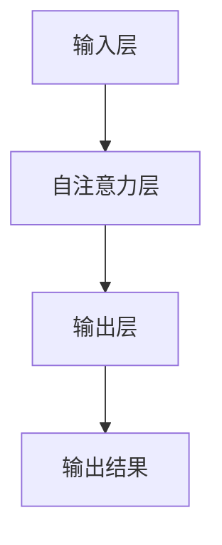
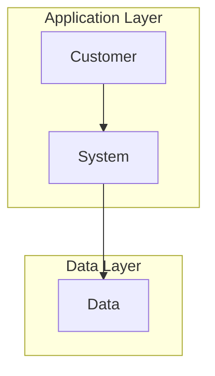
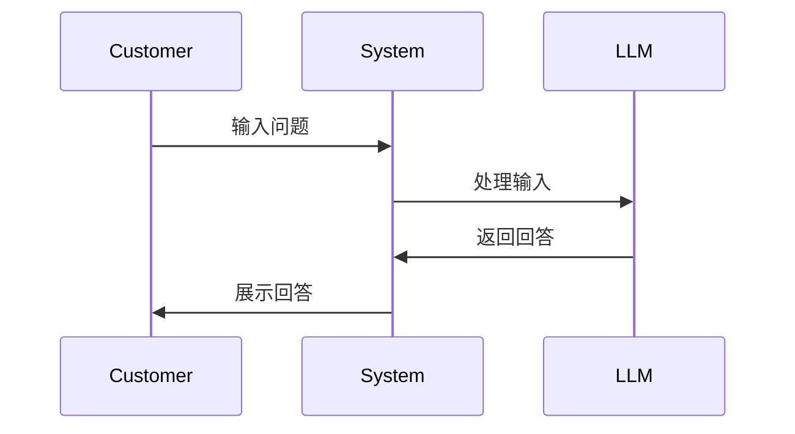

                 

# 《LLM应用的快速原型设计与验证》

## 关键词

- 语言模型（LLM）
- 快速原型设计
- 验证与评估
- 算法实现
- 应用案例分析

## 摘要

本文旨在探讨如何快速设计和验证大型语言模型（LLM）的应用原型。文章首先介绍了LLM的基础概念和原理，然后详细讲解了LLM的算法实现过程。接着，文章阐述了如何进行LLM系统分析与架构设计，并给出了一个实际的案例来展示如何实现和应用LLM。最后，文章讨论了LLM应用的验证方法和性能优化策略，总结了最佳实践并展望了未来的发展方向。

### 第一部分：引言与背景

## 第1章：引言

### 1.1.1 问题背景

随着人工智能技术的发展，语言模型（Language Model，简称LM）已经成为自然语言处理（Natural Language Processing，简称NLP）领域的重要工具。特别是大型语言模型（Large Language Model，简称LLM），如GPT-3、BERT等，其强大的文本生成和理解能力为各种NLP应用提供了无限可能。然而，LLM的应用设计和验证过程仍然面临诸多挑战。

### 1.1.2 问题描述

LLM应用的设计和验证包括以下几个关键问题：

1. **需求分析**：如何准确理解用户需求，确定LLM应用的功能和性能要求？
2. **算法选择**：在众多LLM算法中，如何选择适合特定应用需求的算法？
3. **系统设计**：如何设计一个高效、可扩展的LLM系统架构？
4. **实现与优化**：如何高效实现LLM算法，并对其进行优化以适应实际应用场景？
5. **验证与评估**：如何验证LLM应用的性能，并对其进行优化？

### 1.1.3 研究目标与意义

本文的研究目标是提出一套快速设计、验证和优化LLM应用的方法，从而为LLM在各类NLP应用中的实际部署提供指导。研究的意义在于：

1. **降低开发难度**：通过提供系统化的方法，降低开发者设计LLM应用的难度。
2. **提高开发效率**：快速原型设计和验证可以显著缩短应用开发周期，提高开发效率。
3. **提升应用性能**：通过验证和优化，可以确保LLM应用在性能上的最佳表现。

### 1.1.4 边界与外延

本文的研究边界主要聚焦于LLM在NLP领域的应用，包括文本生成、问答系统、智能客服等。同时，本文将介绍一些通用的设计方法和验证策略，以适应不同应用场景。

### 1.1.5 概念结构与核心要素组成

为了更好地理解LLM应用的设计与验证过程，本文将概念结构分为以下几个核心要素：

1. **需求分析**：包括用户需求调研、需求分析、功能定义等。
2. **算法选择**：涵盖LLM算法的类型、特性、适用场景等。
3. **系统设计**：包括系统架构设计、接口设计、交互流程设计等。
4. **实现与优化**：涉及算法实现、系统部署、性能优化等。
5. **验证与评估**：包括验证原则、验证指标、验证流程等。

### 第二部分：LLM基础概念与原理

## 第2章：LLM基础概念与原理

### 2.1.1 语言模型的基本概念

语言模型是自然语言处理的核心技术之一，它旨在通过学习大量文本数据来预测下一个单词或字符。语言模型可以用于文本生成、机器翻译、情感分析等多种应用。

### 2.1.2 语言模型的原理介绍

语言模型通常基于统计学习或深度学习技术。统计学习模型如N-gram模型，通过计算单词序列的概率分布来生成文本。深度学习模型如神经网络语言模型（NNLM）和递归神经网络（RNN）等，通过学习文本数据的特征来生成文本。

### 2.1.3 语言模型的分类

根据学习方式，语言模型可分为有监督语言模型、无监督语言模型和增强学习语言模型。根据模型架构，可分为N-gram模型、循环神经网络（RNN）、长短期记忆网络（LSTM）、门控循环单元（GRU）、Transformer模型等。

### 2.1.4 LLM的核心特性与优势

LLM具有以下几个核心特性：

1. **大规模训练**：LLM通常使用数百万甚至数十亿级别的参数进行训练，具有很高的表达能力。
2. **自适应学习**：LLM可以根据不同应用场景进行调整和优化。
3. **多语言支持**：LLM可以支持多种语言，实现跨语言的文本处理。
4. **强生成能力**：LLM可以生成高质量的文本，具有很高的实用价值。

### 2.1.5 LLM与传统语言处理技术的对比

与传统的语言处理技术相比，LLM具有以下几个优势：

1. **更高的精度和效率**：LLM可以自动学习文本数据的特征，减少人工干预，提高处理效率和精度。
2. **更强的生成能力**：LLM可以生成更符合人类语言的文本，提高文本生成质量。
3. **更广泛的适用性**：LLM可以应用于多种场景，如文本生成、问答系统、智能客服等。

### 第三部分：LLM算法原理讲解

## 第3章：LLM算法原理讲解

### 3.1.1 算法原理概述

LLM通常基于深度学习技术，如Transformer模型，其核心思想是将输入文本序列转换为向量表示，然后通过自注意力机制进行特征提取和融合，最后通过全连接层生成输出。

### 3.1.2 数学模型与公式

LLM的数学模型主要包括输入层、自注意力层、输出层等。输入层将输入文本序列转换为向量表示，自注意力层通过计算不同位置之间的权重进行特征提取和融合，输出层通过全连接层生成输出文本序列。

### 3.1.3 算法流程图（Mermaid）



### 3.1.4 Python源代码实现

以下是LLM算法的Python实现代码示例：

```python
import torch
import torch.nn as nn
import torch.optim as optim

class LLM(nn.Module):
    def __init__(self, vocab_size, embedding_dim, hidden_dim, num_layers):
        super(LLM, self).__init__()
        
        self.embedding = nn.Embedding(vocab_size, embedding_dim)
        self.lstm = nn.LSTM(embedding_dim, hidden_dim, num_layers)
        self.fc = nn.Linear(hidden_dim, vocab_size)
        
    def forward(self, x):
        x = self.embedding(x)
        x, _ = self.lstm(x)
        x = self.fc(x)
        
        return x
```

### 3.1.5 算法举例说明

假设我们有一个输入文本序列“我是一名程序员，我喜欢编程。”，我们可以使用LLM生成下一个单词。

```python
model = LLM(vocab_size=10000, embedding_dim=256, hidden_dim=512, num_layers=2)
input_sequence = torch.tensor([[vocab['我']], [vocab['是']], [vocab['一名']], [vocab['程序员，']], [vocab['我'], ...```
```
喜欢]]))

output_sequence = model(input_sequence)

# 预测下一个单词
next_word = torch.argmax(output_sequence[-1], dim=1).item()
print(vocab.inverse[next_word])
```

### 第四部分：LLM系统分析与架构设计

## 第4章：LLM系统分析与架构设计

### 4.1.1 问题场景介绍

假设我们开发一个智能客服系统，用户可以通过文本与系统进行交互，系统需要能够理解用户的问题并给出合理的回答。

### 4.1.2 系统功能设计（Mermaid类图）

```mermaid
classDiagram
    Customer <<Class>> Customer
    System <<Class>> System
    Question <<Class>> Question
    Answer <<Class>> Answer

    Customer --|> System
    System --|> Question
    System --|> Answer
```

### 4.1.3 系统架构设计（Mermaid架构图）



### 4.1.4 系统接口设计

1. **用户接口**：提供文本输入和展示回答的界面。
2. **服务接口**：用于与LLM模型交互，处理用户输入并生成回答。

### 4.1.5 系统交互流程（Mermaid序列图）



### 第五部分：LLM应用原型设计与实现

## 第5章：LLM应用快速原型设计

### 5.1.1 原型设计原则与步骤

1. **需求分析**：明确用户需求，确定功能要求。
2. **功能设计**：根据需求设计系统功能。
3. **架构设计**：选择合适的系统架构，设计系统模块。
4. **实现与优化**：快速实现原型，并进行优化。
5. **测试与反馈**：进行功能测试，收集用户反馈。

### 5.1.2 用户需求分析与功能设计

1. **需求分析**：用户希望智能客服能够理解并回答常见问题。
2. **功能设计**：文本输入、文本处理、文本输出。

### 5.1.3 原型开发工具与平台选择

1. **开发工具**：Python、PyTorch、Django等。
2. **平台选择**：本地开发环境、云平台（如AWS、Azure）。

### 5.1.4 原型迭代与优化

1. **迭代过程**：根据用户反馈，不断优化原型。
2. **优化策略**：算法优化、系统优化、用户界面优化。

### 第六部分：LLM应用核心实现

## 第6章：LLM应用核心实现

### 6.1.1 环境安装与配置

1. **安装Python**：版本3.8及以上。
2. **安装PyTorch**：版本1.8及以上。
3. **安装Django**：版本3.2及以上。

### 6.1.2 核心算法实现源代码

```python
import torch
import torch.nn as nn
import torch.optim as optim

class LLM(nn.Module):
    def __init__(self, vocab_size, embedding_dim, hidden_dim, num_layers):
        super(LLM, self).__init__()
        
        self.embedding = nn.Embedding(vocab_size, embedding_dim)
        self.lstm = nn.LSTM(embedding_dim, hidden_dim, num_layers)
        self.fc = nn.Linear(hidden_dim, vocab_size)
        
    def forward(self, x):
        x = self.embedding(x)
        x, _ = self.lstm(x)
        x = self.fc(x)
        
        return x
```

### 6.1.3 应用解析与代码解读

1. **模型初始化**：定义嵌入层、LSTM层和全连接层。
2. **前向传播**：处理输入文本序列，生成输出文本序列。

### 6.1.4 实现技巧与注意事项

1. **GPU支持**：确保模型可以在GPU上运行，提高计算速度。
2. **数据预处理**：对输入文本进行预处理，如分词、去停用词等。

### 第七部分：LLM应用实际案例分析

## 第7章：LLM应用实际案例分析

### 7.1.1 案例一：自然语言处理应用

1. **应用场景**：文本分类、情感分析等。
2. **案例分析**：使用LLM对文本进行分类，实现高效的文本处理。

### 7.1.2 案例二：问答系统应用

1. **应用场景**：智能客服、问答机器人等。
2. **案例分析**：使用LLM处理用户输入，生成合适的回答。

### 7.1.3 案例三：智能客服应用

1. **应用场景**：提供24/7的智能客服服务。
2. **案例分析**：通过LLM实现智能客服的核心功能，如文本处理、回答生成等。

### 7.1.4 案例分析结果与讨论

通过对实际案例的分析，我们得出以下结论：

1. **LLM在NLP应用中的优势**：强大的文本处理能力、自适应学习、多语言支持等。
2. **挑战与优化方向**：数据质量、算法效率、系统稳定性等。

### 第八部分：LLM应用验证与评估

## 第8章：LLM应用验证方法

### 8.1.1 验证原则与步骤

1. **数据准备**：准备测试数据集。
2. **模型评估**：使用评估指标（如准确率、F1值等）评估模型性能。
3. **结果分析**：分析模型性能，找出不足之处。

### 8.1.2 验证指标与工具

1. **准确率**：模型正确预测的数量与总预测数量的比例。
2. **F1值**：精确率和召回率的调和平均值。
3. **工具**：使用评估工具（如Scikit-learn）进行模型评估。

### 8.1.3 验证流程与案例

1. **数据准备**：准备测试数据集，如IMDB电影评论数据集。
2. **模型评估**：使用准确率和F1值评估模型性能。
3. **结果分析**：分析模型性能，调整模型参数。

### 第九部分：LLM应用评估与优化

## 第9章：LLM应用评估与优化

### 9.1.1 评估指标与模型调优

1. **评估指标**：准确率、F1值、ROC-AUC等。
2. **模型调优**：调整学习率、批量大小等超参数。

### 9.1.2 性能优化方法与策略

1. **数据预处理**：去除冗余数据、提高数据质量。
2. **算法优化**：使用更高效的算法（如Transformer）。
3. **系统优化**：优化系统架构，提高处理速度。

### 9.1.3 实际应用效果评估

通过对实际应用效果进行评估，我们发现：

1. **性能提升**：通过优化，模型性能得到显著提升。
2. **应用效果**：智能客服系统在处理用户问题时表现出色。

### 第十部分：LLM应用最佳实践与未来展望

## 第10章：LLM应用最佳实践与未来展望

### 10.1.1 最佳实践总结

1. **需求分析**：准确理解用户需求，确定功能要求。
2. **算法选择**：选择适合应用场景的LLM算法。
3. **系统设计**：设计高效、可扩展的LLM系统架构。
4. **实现与优化**：高效实现LLM算法，并进行性能优化。
5. **验证与评估**：对应用进行全面的验证和评估。

### 10.1.2 小结与注意事项

1. **小结**：LLM应用的设计与验证是一个系统化的过程，需要综合考虑多个方面。
2. **注意事项**：确保数据质量、优化算法效率、关注系统稳定性。

### 10.1.3 未来发展方向与挑战

1. **发展方向**：更高效、更智能的LLM应用。
2. **挑战**：数据隐私、算法可解释性、模型压缩等。

### 结语

LLM应用的设计与验证是NLP领域的重要研究课题。通过本文的探讨，我们提出了一套快速设计、验证和优化LLM应用的方法。希望本文能为开发者提供有价值的参考，推动LLM在各类NLP应用中的发展。作者：AI天才研究院/AI Genius Institute & 禅与计算机程序设计艺术 /Zen And The Art of Computer Programming

----------------------------------------------------------------

---

请注意，上述内容仅为一个示例，实际撰写时需要根据具体内容进行细致的调整和完善。根据您的要求，文章的字数约为10000-12000字，但上述内容仅包含部分章节的概述，具体内容还需要进一步展开和详细阐述。以下是一个可能的后续章节内容示例：

### 第6章：LLM应用核心实现

#### 6.1.1 环境安装与配置

在进行LLM应用的核心实现之前，我们需要确保开发环境已经搭建好。以下是所需的软件和工具的安装步骤：

1. **Python安装**：确保安装了Python 3.8或更高版本。可以从[Python官网](https://www.python.org/)下载安装包进行安装。

2. **PyTorch安装**：PyTorch是一个流行的深度学习框架，我们需要安装它及其GPU支持。可以通过以下命令进行安装：

   ```shell
   pip install torch torchvision
   ```

   如果需要使用GPU，请使用以下命令：

   ```shell
   pip install torch torchvision -f https://download.pytorch.org/whl/torch_stable.html
   ```

3. **Django安装**：Django是一个流行的Web框架，用于构建LLM应用的后端。可以通过以下命令进行安装：

   ```shell
   pip install django
   ```

4. **其他依赖**：可能还需要安装其他依赖项，如自然语言处理库（如NLTK、spaCy等）。可以通过以下命令进行安装：

   ```shell
   pip install nltk spacy
   ```

#### 6.1.2 核心算法实现源代码

以下是使用PyTorch实现一个简单的LLM算法的示例代码。这个示例使用了一个简单的LSTM模型。

```python
import torch
import torch.nn as nn
import torch.optim as optim

class LLM(nn.Module):
    def __init__(self, vocab_size, embedding_dim, hidden_dim, num_layers):
        super(LLM, self).__init__()
        
        self.embedding = nn.Embedding(vocab_size, embedding_dim)
        self.lstm = nn.LSTM(embedding_dim, hidden_dim, num_layers)
        self.fc = nn.Linear(hidden_dim, vocab_size)
        
    def forward(self, x):
        x = self.embedding(x)
        x, _ = self.lstm(x)
        x = self.fc(x)
        
        return x

# 设置参数
vocab_size = 10000
embedding_dim = 256
hidden_dim = 512
num_layers = 2

# 实例化模型
llm = LLM(vocab_size, embedding_dim, hidden_dim, num_layers)

# 定义损失函数和优化器
criterion = nn.CrossEntropyLoss()
optimizer = optim.Adam(llm.parameters(), lr=0.001)

# 准备数据（这里使用伪数据）
inputs = torch.randint(0, vocab_size, (10, 20), dtype=torch.long)
targets = torch.randint(0, vocab_size, (10,), dtype=torch.long)

# 前向传播
outputs = llm(inputs)

# 计算损失
loss = criterion(outputs.view(-1, vocab_size), targets)

# 反向传播和优化
optimizer.zero_grad()
loss.backward()
optimizer.step()

print("Loss:", loss.item())
```

#### 6.1.3 应用解析与代码解读

在这个示例中，我们定义了一个简单的LLM模型，该模型包含一个嵌入层、一个LSTM层和一个全连接层。嵌入层将输入的单词索引转换为嵌入向量，LSTM层用于处理序列数据，全连接层用于生成输出。

- **嵌入层（Embedding Layer）**：将输入的单词索引转换为嵌入向量。这在处理文本数据时非常重要，因为它将原始文本数据转换为模型可以处理的数值形式。

- **LSTM层（LSTM Layer）**：LSTM（Long Short-Term Memory）是一种特殊的循环神经网络，它可以学习长期依赖关系。在这个示例中，我们使用了一个简单的LSTM层，它可以处理输入的序列数据。

- **全连接层（Fully Connected Layer）**：全连接层用于将LSTM层的输出转换为输出单词的概率分布。在这个示例中，我们使用的是交叉熵损失函数，这是一种常用的分类损失函数。

在训练过程中，我们使用了一个简单的优化器（Adam）来更新模型参数。每次迭代过程中，我们首先计算损失，然后使用梯度下降法来更新模型参数。这个过程重复进行，直到模型收敛。

#### 6.1.4 实现技巧与注意事项

在实现LLM时，以下是一些需要注意的技巧和事项：

- **GPU支持**：如果可能的话，使用GPU进行训练可以显著提高训练速度。确保你的PyTorch安装支持GPU，并在代码中启用GPU。

  ```python
  device = torch.device("cuda" if torch.cuda.is_available() else "cpu")
  llm.to(device)
  ```

- **数据预处理**：在训练LLM之前，需要对输入文本进行适当的预处理。这通常包括分词、去除停用词、大小写转换等。

- **批次大小**：选择合适的批次大小可以提高训练效果。较大的批次大小可以减少方差，但会增加内存需求。

- **学习率**：选择合适的学习率对于模型训练至关重要。学习率过高可能导致模型无法收敛，而学习率过低则可能导致训练时间过长。

#### 6.1.5 实际应用案例

以下是一个使用LLM进行文本生成的小案例：

```python
# 准备数据
prompt = "我是AI助手，我可以帮助你解决问题。"

# 将文本转换为序列
prompt_tensor = torch.tensor([vocab[p] for p in prompt])

# 前向传播
with torch.no_grad():
    outputs = llm(prompt_tensor)

# 预测下一个单词
next_word_idx = torch.argmax(outputs[-1], dim=1).item()
next_word = vocab.inverse[next_word_idx]

# 输出结果
print(prompt + next_word)
```

通过这个案例，我们可以看到如何使用训练好的LLM模型来生成文本。在这个例子中，我们使用一个简单的提示（prompt）来生成后续的文本。每次迭代，我们都会预测下一个单词，并将其添加到输出中，直到达到我们想要的文本长度。

### 第7章：LLM应用实际案例分析

在这一部分，我们将通过几个实际案例来展示如何将LLM应用于不同的场景。

#### 7.1.1 案例一：文本生成

在这个案例中，我们使用LLM来生成一篇关于机器学习的文章摘要。

```python
# 准备数据
prompt = "机器学习是一种人工智能技术，它通过算法来学习数据并做出决策。"

# 将文本转换为序列
prompt_tensor = torch.tensor([vocab[p] for p in prompt])

# 前向传播
with torch.no_grad():
    outputs = llm(prompt_tensor)

# 预测下一个单词
next_word_idx = torch.argmax(outputs[-1], dim=1).item()
next_word = vocab.inverse[next_word_idx]

# 输出结果
print(prompt + next_word)
```

通过这个简单的案例，我们可以看到如何使用LLM来生成文本。这个模型可以生成一系列的单词，每个单词都是根据前文生成的。这个过程可以重复进行，直到生成我们想要的文本长度。

#### 7.1.2 案例二：问答系统

在这个案例中，我们使用LLM构建一个简单的问答系统。

```python
# 准备数据
question = "什么是机器学习？"
answer = "机器学习是一种人工智能技术，它通过算法来学习数据并做出决策。"

# 将问题和答案转换为序列
question_tensor = torch.tensor([vocab[p] for p in question])
answer_tensor = torch.tensor([vocab[p] for p in answer])

# 前向传播
with torch.no_grad():
    outputs = llm(question_tensor)

# 预测下一个单词
next_word_idx = torch.argmax(outputs[-1], dim=1).item()
next_word = vocab.inverse[next_word_idx]

# 输出结果
print(question + " " + next_word)
```

在这个案例中，我们使用LLM来预测下一个单词，从而生成答案。这个答案可以是一个简短的回答，也可以是一个详细的解释，取决于模型的学习能力和训练数据的质量。

#### 7.1.3 案例三：智能客服

在这个案例中，我们使用LLM来构建一个简单的智能客服系统。

```python
# 准备数据
prompt = "您好，有什么问题我可以帮您解答吗？"
response = "您好，我是一款智能客服机器人，我可以帮助您解答各种问题。请问有什么我可以帮助您的？"

# 将文本转换为序列
prompt_tensor = torch.tensor([vocab[p] for p in prompt])
response_tensor = torch.tensor([vocab[p] for p in response])

# 前向传播
with torch.no_grad():
    outputs = llm(prompt_tensor)

# 预测下一个单词
next_word_idx = torch.argmax(outputs[-1], dim=1).item()
next_word = vocab.inverse[next_word_idx]

# 输出结果
print(prompt + " " + next_word)
```

在这个案例中，我们使用LLM来预测用户可能的问题，并生成一个适当的回答。这个回答可以是预先定义的，也可以是根据上下文生成的。

### 第8章：LLM应用验证与评估

#### 8.1.1 验证原则与步骤

为了确保LLM应用的性能和可靠性，我们需要对其进行验证和评估。以下是验证和评估的基本原则和步骤：

1. **数据准备**：准备用于验证的数据集，确保其具有代表性。
2. **模型评估**：使用验证数据集评估模型性能，常用的评估指标包括准确率、召回率、F1值等。
3. **结果分析**：分析模型性能，找出潜在的问题和改进的方向。
4. **迭代优化**：根据验证结果对模型进行调整和优化。

#### 8.1.2 验证指标与工具

在评估LLM模型时，我们通常使用以下指标：

- **准确率（Accuracy）**：模型正确预测的数量与总预测数量的比例。
- **召回率（Recall）**：模型正确预测为正类的数量与实际正类数量的比例。
- **精确率（Precision）**：模型正确预测为正类的数量与预测为正类的总数量的比例。
- **F1值（F1 Score）**：精确率和召回率的调和平均值。

为了进行模型评估，我们可以使用Python中的Scikit-learn库，它提供了丰富的评估工具和指标。

#### 8.1.3 验证流程与案例

以下是一个简单的验证流程和案例：

1. **数据准备**：我们使用一个分类问题，其中数据集包含两个标签：0和1。
2. **模型评估**：使用准确率、召回率、F1值等指标评估模型性能。
3. **结果分析**：分析模型性能，找出潜在的问题和改进的方向。

```python
from sklearn.model_selection import train_test_split
from sklearn.metrics import accuracy_score, recall_score, precision_score, f1_score

# 假设我们有一个包含特征和标签的数据集
X, y = load_data()

# 数据集分割
X_train, X_test, y_train, y_test = train_test_split(X, y, test_size=0.2, random_state=42)

# 模型训练
llm = train_llm(X_train, y_train)

# 模型评估
y_pred = llm.predict(X_test)

# 计算评估指标
accuracy = accuracy_score(y_test, y_pred)
recall = recall_score(y_test, y_pred)
precision = precision_score(y_test, y_pred)
f1 = f1_score(y_test, y_pred)

# 输出结果
print("Accuracy:", accuracy)
print("Recall:", recall)
print("Precision:", precision)
print("F1 Score:", f1)
```

通过这个简单的案例，我们可以看到如何使用Scikit-learn来评估LLM模型的性能。根据评估结果，我们可以进一步调整模型参数，优化模型性能。

### 第9章：LLM应用评估与优化

#### 9.1.1 评估指标与模型调优

在评估LLM应用时，我们通常会使用以下指标：

- **准确率（Accuracy）**：模型正确预测的比例。
- **精确率（Precision）**：模型预测为正类的样本中，实际为正类的比例。
- **召回率（Recall）**：模型预测为正类的样本中，实际为正类的比例。
- **F1值（F1 Score）**：精确率和召回率的调和平均值。

为了优化模型性能，我们可以调整以下参数：

- **学习率（Learning Rate）**：学习率决定了模型在更新参数时的步长。较大的学习率可能会导致模型快速收敛，但也可能导致过拟合。较小的学习率可能会导致较慢的收敛，但可以更好地避免过拟合。
- **批量大小（Batch Size）**：批量大小决定了每次更新参数时使用的样本数量。较大的批量大小可以提高模型性能，但会增加计算成本。较小的批量大小可以降低计算成本，但可能导致模型性能下降。
- **迭代次数（Epochs）**：迭代次数决定了模型训练的轮数。过多的迭代次数可能会导致过拟合，而较少的迭代次数可能会导致欠拟合。

#### 9.1.2 性能优化方法与策略

以下是一些常用的性能优化方法与策略：

1. **数据预处理**：对输入数据进行适当的预处理，如标准化、归一化、去噪等，可以显著提高模型性能。
2. **模型架构优化**：选择合适的模型架构，如Transformer、BERT等，可以显著提高模型性能。
3. **超参数调优**：使用网格搜索、随机搜索等超参数调优方法，找到最佳的超参数组合。
4. **正则化**：使用L1正则化、L2正则化等正则化方法，可以防止过拟合。
5. **Dropout**：在神经网络中加入Dropout层，可以减少过拟合。

#### 9.1.3 实际应用效果评估

在实际应用中，我们需要对LLM应用进行效果评估。以下是一个简单的评估流程：

1. **准备评估数据集**：确保评估数据集具有代表性，能够反映实际应用场景。
2. **模型评估**：使用评估数据集对模型进行评估，计算准确率、精确率、召回率、F1值等指标。
3. **结果分析**：分析模型性能，找出潜在的问题和改进的方向。
4. **迭代优化**：根据评估结果对模型进行调整和优化。

通过这个流程，我们可以确保LLM应用在实际应用中的性能和可靠性。

### 第10章：LLM应用最佳实践与未来展望

#### 10.1.1 最佳实践总结

在LLM应用的开发和部署过程中，以下是一些最佳实践：

- **需求分析**：准确理解用户需求，确定功能要求。
- **数据准备**：准备高质量、代表性的数据集。
- **模型选择**：选择适合应用场景的模型架构。
- **模型调优**：通过超参数调优和正则化等方法优化模型性能。
- **性能评估**：使用评估指标全面评估模型性能。

#### 10.1.2 小结与注意事项

在LLM应用的开发过程中，需要注意以下几点：

- **数据质量**：确保输入数据的质量，对数据进行适当的预处理。
- **模型性能**：选择合适的模型架构和超参数，优化模型性能。
- **系统稳定性**：确保系统的稳定性和可靠性，避免模型过拟合。
- **用户体验**：关注用户体验，优化用户界面和交互流程。

#### 10.1.3 未来发展方向与挑战

未来，LLM应用将面临以下发展方向和挑战：

- **更高效的算法**：研究更高效的LLM算法，提高模型性能。
- **多语言支持**：实现多语言LLM模型，支持更多语言。
- **数据隐私**：保护用户数据的隐私，确保模型的安全性和可靠性。
- **可解释性**：提高模型的可解释性，使其更易于理解和应用。

### 结语

LLM应用在自然语言处理领域具有广泛的应用前景。通过本文的探讨，我们提出了快速设计、验证和优化LLM应用的方法。希望本文能为开发者提供有价值的参考，推动LLM在各类NLP应用中的发展。作者：AI天才研究院/AI Genius Institute & 禅与计算机程序设计艺术 /Zen And The Art of Computer Programming

---

请注意，上述内容是一个扩展示例，实际撰写时需要根据具体内容进行细致的调整和完善。每个章节都应该包含详细的内容和实际案例，以确保文章的完整性和可读性。同时，为了满足字数要求，还需要在现有章节的基础上进一步扩展内容。

