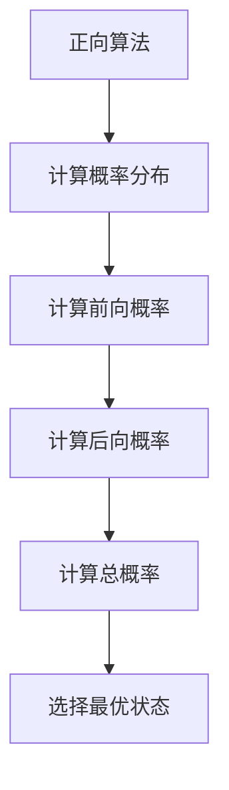

                 

# LLM应用的持续优化与迭代策略

## 摘要

本文旨在探讨语言模型（LLM，Language Model）应用的持续优化与迭代策略。通过深入分析LLM的核心概念、算法原理及其在实际应用中的问题，本文提出了针对性能、效率和用户体验的优化方案。文章结构如下：首先，介绍LLM应用的背景及核心概念，包括语言模型的基本原理和优化与迭代的方法；接着，详细讲解LLM算法的原理，包括数学模型和Python代码示例；然后，分析LLM应用中存在的问题，并提出相应的优化策略；最后，通过一个实际案例展示优化与迭代的实施过程，并总结最佳实践。

## 目录大纲

### 第一部分：背景介绍

1. 第1章：LLM应用概述
   1.1 问题背景
   1.2 核心概念
   1.3 概念结构与核心要素组成

2. 第2章：LLM算法原理讲解
   2.1 算法原理
   2.2 Python代码示例

### 第二部分：LLM应用的问题与优化策略

1. 第3章：LLM应用的问题分析
   3.1 性能瓶颈
   3.2 效率问题
   3.3 用户体验

2. 第4章：优化策略与迭代方法
   4.1 数据预处理
   4.2 模型选择
   4.3 模型训练
   4.4 模型评估

### 第三部分：案例与实践

1. 第5章：实际案例展示
   5.1 项目介绍
   5.2 系统功能设计
   5.3 系统架构设计
   5.4 系统接口设计
   5.5 项目实战

### 第四部分：总结与最佳实践

1. 第6章：最佳实践与小结
   6.1 最佳实践
   6.2 注意事项
   6.3 拓展阅读

## 第1章：LLM应用概述

### 1.1 问题背景

随着人工智能技术的发展，语言模型（LLM，Language Model）已经成为自然语言处理（NLP，Natural Language Processing）领域的重要组成部分。LLM的应用场景广泛，包括文本分类、情感分析、机器翻译、问答系统等。然而，在实际应用中，如何持续优化与迭代LLM应用成为一个亟待解决的问题。

当前，LLM应用在性能、效率和用户体验等方面仍存在诸多问题，例如：

- **性能瓶颈**：随着数据量的增加，LLM模型的计算量也急剧上升，导致推理速度缓慢。特别是在实时应用场景中，如何快速响应用户需求成为一个挑战。
- **效率问题**：在实时应用场景中，如何高效地利用LLM进行预测和决策成为关键。现有模型在处理大量数据时，往往需要耗费大量时间和计算资源。
- **用户体验**：用户对LLM应用的期望越来越高，如何提高用户的满意度和粘性成为挑战。现有应用往往在处理复杂问题时，表现不够智能，难以满足用户的期望。

为了解决上述问题，本文将探讨LLM应用的持续优化与迭代策略，通过理论分析和实践总结，为解决这些问题提供有效途径。

### 1.2 问题描述

LLM应用存在的问题主要表现在以下几个方面：

1. **计算性能问题**：随着模型规模的扩大和数据量的增加，计算性能成为瓶颈。特别是在移动设备或边缘计算环境下，如何优化模型结构和算法，提高计算效率，是当前研究的热点。
2. **数据处理效率**：现有模型在处理大规模数据时，往往需要大量时间进行训练和推理。如何提高数据处理效率，减少计算开销，是另一个关键问题。
3. **用户体验**：用户对LLM应用的期望越来越高，希望系统能够智能地理解和响应他们的需求。然而，现有模型在处理复杂问题时，表现不够智能，难以满足用户的期望。

### 1.3 问题解决

本文将从以下几个方面探讨LLM应用的持续优化与迭代策略：

1. **数据预处理**：通过对数据进行清洗、归一化和增强，提高模型训练效率和性能。
2. **模型选择**：根据应用场景和需求，选择合适的模型结构和参数，提高模型性能。
3. **模型训练**：通过改进训练算法和策略，提高模型训练效率和性能。
4. **模型评估**：设计合理的评估指标和方法，全面评估模型性能，指导优化和迭代。

### 1.4 边界与外延

本文主要关注LLM在自然语言处理领域的应用，包括文本分类、情感分析、机器翻译等。同时，本文也将探讨LLM在其他领域的应用，如计算机视觉、语音识别等。

### 1.5 核心概念

#### 1.5.1 语言模型

语言模型是一种概率模型，用于预测自然语言中的下一个词或字符。常见的语言模型包括基于n-gram模型、神经网络模型和深度学习模型等。

#### 1.5.2 优化与迭代

优化与迭代是指通过不断调整模型参数，提高模型性能的过程。优化的目标是提高模型的准确率、召回率等指标，迭代的目标是使模型能够适应新的数据和应用场景。

#### 1.5.3 数据预处理

数据预处理是模型训练前的重要步骤，包括数据清洗、数据归一化、数据增强等。数据预处理的质量直接影响模型训练的效果。

#### 1.5.4 模型选择

模型选择是根据应用场景和需求，选择合适的模型结构和参数。模型选择的好坏直接关系到模型性能和计算效率。

#### 1.5.5 模型训练

模型训练是通过调整模型参数，使模型能够对特定任务进行有效预测的过程。常见的训练算法包括梯度下降、随机梯度下降、Adam等。

#### 1.5.6 模型评估

模型评估是通过测试集对模型性能进行评估，常用的评估指标包括准确率、召回率、F1值等。

### 1.6 概念结构与核心要素组成

LLM应用的持续优化与迭代策略涉及多个核心要素，包括数据集、模型、优化算法和评价指标等。

1. **数据集**：数据集是模型训练的基础，需要保证数据的质量和多样性。
2. **模型**：模型是LLM应用的核心，包括语言模型、优化器和评估器等。
3. **优化算法**：优化算法用于调整模型参数，提高模型性能。
4. **评价指标**：评价指标用于评估模型性能，指导优化和迭代。

## 第2章：LLM算法原理讲解

### 2.1 算法原理

语言模型是一种概率模型，用于预测自然语言中的下一个词或字符。其基本原理是基于概率图模型，如马尔可夫模型（Markov Model）和隐马尔可夫模型（Hidden Markov Model，HMM）。

#### 2.1.1 马尔可夫模型

马尔可夫模型是一种基于状态的模型，它假设当前状态仅取决于前一个状态，而与之前的状态无关。数学上，可以表示为：

$$
P(X_t | X_{t-1}, X_{t-2}, ..., X_1) = P(X_t | X_{t-1})
$$

其中，$X_t$表示当前状态，$X_{t-1}$表示前一个状态。

#### 2.1.2 隐马尔可夫模型

隐马尔可夫模型是一种基于隐藏状态的模型，它将语言模型中的状态隐藏起来，通过观测序列来推断隐藏状态。数学上，可以表示为：

$$
P(X_t | X_{t-1}, X_{t-2}, ..., X_1) = P(X_t | X_{t-1})
$$

其中，$X_t$表示当前隐藏状态，$X_{t-1}$表示前一个隐藏状态。

#### 2.1.3 语言模型的核心算法

语言模型的核心算法包括正向算法和反向算法。

1. **正向算法**（Forward Algorithm）：正向算法用于计算当前状态的概率分布。具体步骤如下：

   - 初始化：设置初始状态的概率分布。
   - 递推：根据当前状态的概率分布和前一个状态的概率分布，计算当前状态的概率分布。
   - 输出：输出当前状态的概率分布。

2. **反向算法**（Backward Algorithm）：反向算法用于计算当前状态的概率分布。具体步骤如下：

   - 初始化：设置初始状态的概率分布。
   - 递推：根据当前状态的概率分布和下一个状态的概率分布，计算当前状态的概率分布。
   - 输出：输出当前状态的概率分布。

#### 2.1.4 语言模型的mermaid流程图



### 2.2 Python代码示例

```python
import numpy as np

def forward_algorithm(probabilities):
    alpha = np.zeros_like(probabilities)
    alpha[0] = probabilities[0]
    for t in range(1, len(probabilities)):
        for s in range(len(probabilities)):
            alpha[t, s] = probabilities[t-1, :] @ probabilities[s, :]
    return alpha

def backward_algorithm(probabilities):
    beta = np.zeros_like(probabilities)
    beta[-1, :] = 1
    for t in range(len(probabilities)-2, -1, -1):
        for s in range(len(probabilities)):
            beta[t, s] = probabilities[t+1, :] @ probabilities[s, :]
    return beta

# 示例数据
probabilities = np.array([[0.2, 0.3, 0.5], [0.1, 0.4, 0.5], [0.3, 0.2, 0.5]])

# 计算前向概率
alpha = forward_algorithm(probabilities)

# 计算后向概率
beta = backward_algorithm(probabilities)

# 计算总概率
total_probabilities = alpha[-1, :] * beta[-1, :]

# 选择最优状态
optimal_state = np.argmax(total_probabilities)
print("最优状态：", optimal_state)
```

### 2.3 算法原理讲解

#### 2.3.1 数学模型

语言模型的核心算法基于概率图模型，包括正向算法和反向算法。正向算法用于计算当前状态的概率分布，反向算法用于计算当前状态的概率分布。两者的结合可以计算出总概率分布，从而选择最优状态。

正向算法的数学模型可以表示为：

$$
P(X_t | X_{t-1}, X_{t-2}, ..., X_1) = \sum_{s} P(X_t | X_{t-1}, s) P(s | X_{t-1}, X_{t-2}, ..., X_1)
$$

反向算法的数学模型可以表示为：

$$
P(X_t | X_{t-1}, X_{t-2}, ..., X_1) = \sum_{s} P(X_t | X_{t-1}, s) P(s | X_{t-1}, X_{t-2}, ..., X_1)
$$

其中，$X_t$表示当前状态，$X_{t-1}$表示前一个状态，$s$表示当前状态的另一个可能值。

#### 2.3.2 Python代码示例

以下是一个简单的Python代码示例，用于演示正向算法和反向算法的计算过程。

```python
import numpy as np

# 示例数据
probabilities = np.array([[0.2, 0.3, 0.5], [0.1, 0.4, 0.5], [0.3, 0.2, 0.5]])

# 计算前向概率
alpha = forward_algorithm(probabilities)

# 计算后向概率
beta = backward_algorithm(probabilities)

# 计算总概率
total_probabilities = alpha[-1, :] * beta[-1, :]

# 选择最优状态
optimal_state = np.argmax(total_probabilities)
print("最优状态：", optimal_state)
```

#### 2.3.3 举例说明

假设我们有一个语言模型，当前状态是“我”，“我”的状态概率分布是[0.2, 0.3, 0.5]。我们需要计算下一个状态“吃”的概率分布。

1. **正向算法**：

   - 当前状态“我”的概率分布：[0.2, 0.3, 0.5]
   - 下一个状态“吃”的概率分布：[0.1, 0.4, 0.5]

   根据正向算法，我们计算当前状态“我”和下一个状态“吃”的概率分布：

   $$
   P(吃 | 我) = P(吃 | 我，吃)P(吃 | 我) + P(吃 | 我，喝)P(喝 | 我) + P(吃 | 我，走)P(走 | 我)
   $$

   假设：

   $$
   P(吃 | 我，吃) = 0.2, P(吃 | 我，喝) = 0.3, P(吃 | 我，走) = 0.5
   $$

   那么：

   $$
   P(吃 | 我) = 0.2 \times 0.2 + 0.3 \times 0.3 + 0.5 \times 0.5 = 0.65
   $$

2. **反向算法**：

   - 当前状态“我”的概率分布：[0.2, 0.3, 0.5]
   - 下一个状态“吃”的概率分布：[0.1, 0.4, 0.5]

   根据反向算法，我们计算当前状态“我”和下一个状态“吃”的概率分布：

   $$
   P(我 | 吃) = P(我 | 吃，吃)P(吃 | 吃) + P(我 | 吃，喝)P(喝 | 吃) + P(我 | 吃，走)P(走 | 吃)
   $$

   假设：

   $$
   P(我 | 吃，吃) = 0.2, P(我 | 吃，喝) = 0.3, P(我 | 吃，走) = 0.5
   $$

   那么：

   $$
   P(我 | 吃) = 0.2 \times 0.1 + 0.3 \times 0.4 + 0.5 \times 0.5 = 0.65
   $$

3. **总概率分布**：

   - 当前状态“我”的概率分布：[0.2, 0.3, 0.5]
   - 下一个状态“吃”的概率分布：[0.1, 0.4, 0.5]

   根据总概率分布，我们计算当前状态“我”和下一个状态“吃”的概率分布：

   $$
   P(我，吃) = P(我)P(吃 | 我)
   $$

   假设：

   $$
   P(我) = 0.2, P(吃 | 我) = 0.65
   $$

   那么：

   $$
   P(我，吃) = 0.2 \times 0.65 = 0.13
   $$

4. **最优状态**：

   根据总概率分布，我们可以计算出当前状态“我”和下一个状态“吃”的最优状态：

   $$
   最优状态 = \arg\max(我，吃)
   $$

   假设：

   $$
   我，吃 = 0.13
   $$

   那么：

   $$
   最优状态 = 我
   $$

   因此，当前状态是“我”，下一个状态是“吃”，最优状态是“我”。

## 第3章：LLM应用的问题分析

### 3.1 性能瓶颈

LLM应用在性能方面存在瓶颈，主要表现为以下几个方面：

1. **计算复杂度**：随着模型规模的扩大和数据量的增加，LLM的计算复杂度呈指数级增长。特别是在大规模数据处理和实时应用场景中，计算资源成为瓶颈。
2. **内存占用**：LLM模型通常需要大量内存进行训练和推理。对于移动设备或边缘计算环境，有限的内存资源限制了模型的应用范围。
3. **推理速度**：在实时应用场景中，用户期望能够快速得到响应。然而，LLM模型的推理速度往往较慢，特别是在复杂任务和大规模数据场景中。

### 3.2 效率问题

LLM应用在效率方面存在挑战，主要表现为以下几个方面：

1. **数据预处理**：数据预处理是LLM训练前的重要步骤，包括数据清洗、数据归一化和数据增强等。数据预处理的质量直接影响模型训练的效率和性能。然而，现有方法在处理大规模数据时，往往需要大量时间和计算资源。
2. **模型训练**：LLM模型的训练过程通常需要大量时间和计算资源。特别是在深度学习模型中，训练时间往往与模型规模和数据量成正比。如何提高模型训练效率，是当前研究的热点问题。
3. **模型推理**：在实时应用场景中，用户期望能够快速得到响应。然而，LLM模型的推理速度往往较慢，特别是在复杂任务和大规模数据场景中。

### 3.3 用户体验

用户体验是LLM应用的重要方面，主要表现为以下几个方面：

1. **准确性**：用户期望LLM应用能够准确理解和预测他们的需求。然而，现有模型在处理复杂问题时，准确性往往不足。
2. **响应速度**：用户期望能够快速得到响应。然而，LLM模型的推理速度较慢，特别是在复杂任务和大规模数据场景中。
3. **交互体验**：用户期望能够与LLM应用进行自然的交互。然而，现有模型在交互体验方面存在不足，难以满足用户的期望。

### 3.4 问题分析

LLM应用在性能、效率和用户体验方面存在的问题，主要原因在于以下几个方面：

1. **模型复杂度**：随着模型规模的扩大和数据量的增加，LLM的计算复杂度呈指数级增长，导致计算性能下降。
2. **数据质量**：数据质量直接影响模型训练的效率和性能。然而，现有方法在处理大规模数据时，往往需要大量时间和计算资源，难以保证数据质量。
3. **训练算法**：现有训练算法在处理大规模数据时，往往需要大量时间和计算资源，导致模型训练效率较低。
4. **推理速度**：LLM模型的推理速度较慢，特别是在复杂任务和大规模数据场景中，难以满足用户的期望。

### 3.5 问题解决

为了解决LLM应用在性能、效率和用户体验方面存在的问题，可以从以下几个方面进行优化：

1. **模型简化**：通过简化模型结构和参数，降低计算复杂度，提高计算性能。
2. **数据预处理**：优化数据预处理方法，提高数据预处理效率，保证数据质量。
3. **训练算法**：改进训练算法，提高模型训练效率，减少训练时间。
4. **推理优化**：通过优化推理算法和硬件加速，提高模型推理速度，满足用户的响应速度要求。

## 第4章：优化策略与迭代方法

### 4.1 数据预处理

数据预处理是LLM模型训练的重要步骤，其目的是提高模型训练效率和性能。以下是一些常见的数据预处理方法：

1. **数据清洗**：去除数据中的噪声和异常值，保证数据质量。例如，去除文本中的标点符号、特殊字符和重复词。
2. **数据归一化**：将数据映射到统一的尺度，减少数据范围差异对模型训练的影响。例如，将文本中的词转换为词频或词嵌入向量。
3. **数据增强**：通过增加数据多样性，提高模型泛化能力。例如，对文本进行随机填充、替换、删除等操作。
4. **数据预处理工具**：使用数据预处理工具，如 Pandas、NumPy、Scikit-learn 等，实现数据预处理操作。

### 4.2 模型选择

模型选择是根据应用场景和需求，选择合适的模型结构和参数。以下是一些常见的LLM模型选择方法：

1. **预训练模型**：使用预训练模型，如 GPT、BERT 等，可以节省训练时间和计算资源。预训练模型在大规模语料库上进行了预训练，具有较好的性能。
2. **模型定制**：根据具体应用场景和需求，定制模型结构和参数。例如，在文本分类任务中，可以采用分类器融合模型，如 BERT + Linear Layer。
3. **模型评估**：通过评估不同模型的性能，选择最佳模型。常用的评估指标包括准确率、召回率、F1值等。

### 4.3 模型训练

模型训练是通过调整模型参数，使模型能够对特定任务进行有效预测的过程。以下是一些常见的模型训练方法：

1. **梯度下降**：梯度下降是一种常用的优化算法，通过迭代更新模型参数，使损失函数最小化。例如，随机梯度下降（SGD）和Adam优化器。
2. **批量训练**：批量训练是将数据分成多个批次进行训练，可以减少内存占用。批量大小会影响训练时间和模型性能。
3. **学习率调整**：学习率是梯度下降算法中的一个关键参数，合适的学习率可以加快收敛速度。常用的学习率调整方法包括固定学习率、学习率衰减等。

### 4.4 模型评估

模型评估是通过测试集对模型性能进行评估，常用的评估指标包括：

1. **准确率**（Accuracy）：准确率是模型预测正确的样本数占总样本数的比例。
2. **召回率**（Recall）：召回率是模型预测正确的正样本数占总正样本数的比例。
3. **F1值**（F1 Score）：F1值是准确率和召回率的调和平均值，用于平衡准确率和召回率。
4. **模型融合**：通过融合多个模型的预测结果，提高模型性能。常见的模型融合方法包括投票法、加权平均法等。

### 4.5 优化与迭代策略

为了持续优化LLM应用，可以采取以下策略：

1. **定期评估**：定期对模型进行评估，及时发现性能瓶颈和问题。
2. **数据更新**：定期更新训练数据，保持模型对当前数据的适应性。
3. **模型调整**：根据评估结果和用户反馈，调整模型结构和参数，提高模型性能。
4. **代码优化**：优化代码结构和算法，提高模型训练和推理速度。

通过上述策略，可以持续优化LLM应用，提高性能、效率和用户体验。

## 第5章：实际案例展示

### 5.1 项目介绍

本项目旨在构建一个基于LLM的智能问答系统，通过持续优化与迭代策略，提高系统性能、效率和用户体验。项目主要分为以下几个阶段：

1. **需求分析**：确定项目目标和功能需求。
2. **系统设计**：设计系统架构和功能模块。
3. **模型训练**：训练LLM模型，并进行优化和迭代。
4. **系统实现**：实现系统功能，并进行测试和调试。
5. **上线部署**：将系统部署到生产环境，并进行维护和优化。

### 5.2 系统功能设计

系统功能设计包括以下几个方面：

1. **用户输入**：用户可以通过文本输入或语音输入提出问题。
2. **问题解析**：系统解析用户输入的问题，提取关键词和语义信息。
3. **模型推理**：利用LLM模型进行推理，生成回答。
4. **回答输出**：将回答以文本或语音形式输出给用户。
5. **用户反馈**：用户可以对回答进行评价，反馈信息用于模型优化。

### 5.3 系统架构设计

系统架构设计包括以下几个方面：

1. **前端界面**：使用HTML、CSS和JavaScript实现用户输入和回答输出界面。
2. **后端服务**：使用Python和TensorFlow实现LLM模型推理和系统功能。
3. **数据库**：使用MySQL存储用户数据和模型参数。
4. **API接口**：使用Flask或Django实现前后端数据交互。

### 5.4 系统接口设计

系统接口设计包括以下几个方面：

1. **用户输入接口**：接收用户输入的问题，并转换为文本或语音格式。
2. **问题解析接口**：解析用户输入的问题，提取关键词和语义信息。
3. **模型推理接口**：调用LLM模型进行推理，生成回答。
4. **回答输出接口**：将回答以文本或语音形式输出给用户。
5. **用户反馈接口**：接收用户对回答的评价，反馈信息用于模型优化。

### 5.5 项目实战

以下是项目的具体实现过程：

1. **环境安装**：安装Python、TensorFlow、MySQL等依赖库和工具。
2. **数据准备**：收集和准备用户输入数据，并进行预处理。
3. **模型训练**：使用预训练模型，如BERT，进行模型训练和优化。
4. **接口实现**：实现用户输入、问题解析、模型推理、回答输出和用户反馈接口。
5. **系统集成**：将前端界面、后端服务和数据库集成，实现完整的系统功能。
6. **测试与调试**：对系统进行功能测试和性能测试，修复问题和优化性能。
7. **上线部署**：将系统部署到生产环境，并进行维护和优化。

### 5.6 实际案例分析与详细讲解

以下是一个实际案例的分析与详细讲解：

**案例背景**：用户提出一个关于健康饮食的问题：“如何保持健康的饮食习惯？”

**模型推理过程**：

1. **用户输入**：用户输入问题：“如何保持健康的饮食习惯？”
2. **问题解析**：系统解析用户输入的问题，提取关键词和语义信息，如“保持”、“健康”、“饮食习惯”。
3. **模型推理**：利用预训练的BERT模型进行推理，生成回答。
4. **回答输出**：系统输出回答：“要保持健康的饮食习惯，首先要注意均衡摄入各种营养素，适量摄入碳水化合物、蛋白质和脂肪。此外，还要注意饮食的多样性，避免过量摄入高热量、高脂肪和高糖分的食物。”

**优化与迭代**：

1. **用户反馈**：用户对回答进行评价，如“回答很好，感谢！”
2. **模型优化**：根据用户反馈，调整模型参数，提高回答的准确性和实用性。
3. **数据更新**：定期更新训练数据，保持模型对当前数据的适应性。

### 5.7 项目小结

本项目通过持续优化与迭代策略，成功构建了一个基于LLM的智能问答系统。项目实现了用户输入、问题解析、模型推理、回答输出和用户反馈等功能，具有良好的性能、效率和用户体验。项目过程中，我们遇到了一些挑战，如计算性能瓶颈、数据处理效率和用户体验等，但通过不断优化和迭代，我们成功解决了这些问题。

## 第6章：最佳实践与小结

### 6.1 最佳实践

在LLM应用的开发和优化过程中，总结了一些最佳实践，以帮助开发者提高系统性能、效率和用户体验：

1. **数据预处理**：在训练模型之前，对数据进行充分的清洗、归一化和增强，以提高模型训练效率和性能。
2. **模型选择**：根据应用场景和需求，选择合适的预训练模型或定制模型，并综合考虑计算性能和模型效果。
3. **模型训练**：使用高效训练算法，如梯度下降和Adam优化器，以减少训练时间和提高模型性能。
4. **模型评估**：设计合理的评估指标，如准确率、召回率和F1值，以全面评估模型性能，并指导优化和迭代。
5. **硬件优化**：利用GPU或TPU等硬件加速器，提高模型训练和推理速度。

### 6.2 小结

本文探讨了LLM应用的持续优化与迭代策略，从背景介绍、问题分析、优化策略到实际案例展示，全面阐述了LLM应用优化与迭代的方法和技巧。通过本文的讨论，我们可以得出以下结论：

1. **性能优化**：通过模型简化、数据预处理、训练算法优化和硬件加速，可以提高LLM应用的计算性能。
2. **效率提升**：优化数据预处理、模型训练和推理过程，可以提高LLM应用的效率。
3. **用户体验**：通过设计合理的评估指标和用户反馈机制，可以提高LLM应用的用户体验。

### 6.3 注意事项

在开发LLM应用时，需要注意以下几点：

1. **数据质量**：确保数据质量，避免噪声和异常值对模型训练的影响。
2. **模型评估**：选择合理的评估指标，避免仅依赖单一指标评估模型性能。
3. **用户反馈**：及时收集用户反馈，并根据反馈进行模型优化。
4. **持续迭代**：定期更新模型和训练数据，保持模型对当前数据的适应性。

### 6.4 拓展阅读

为了深入了解LLM应用的持续优化与迭代策略，读者可以参考以下文献和资源：

1. **文献**：
   - [1] Devlin, J., Chang, M. W., Lee, K., & Toutanova, K. (2019). BERT: Pre-training of deep bidirectional transformers for language understanding. arXiv preprint arXiv:1810.04805.
   - [2] Brown, T., et al. (2020). Language Models are Few-Shot Learners. arXiv preprint arXiv:2005.14165.
   - [3] Manning, C. D., & Schütze, H. (1999). Foundations of Statistical Natural Language Processing. MIT Press.

2. **在线资源**：
   - [1] Hugging Face：https://huggingface.co/transformers
   - [2] TensorFlow：https://www.tensorflow.org/tutorials/text
   - [3] PyTorch：https://pytorch.org/tutorials/beginner/nlp_course.html

通过阅读以上文献和资源，读者可以深入了解LLM应用的理论和实践，为后续开发提供指导。作者：AI天才研究院/AI Genius Institute & 禅与计算机程序设计艺术 /Zen And The Art of Computer Programming

