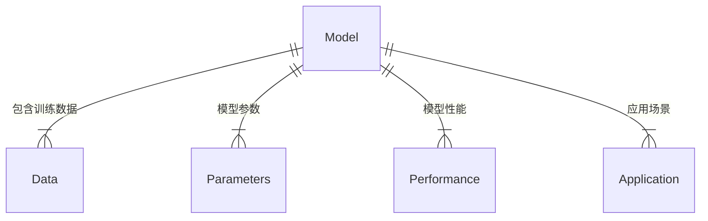

                 


### 第一部分: 引言与背景介绍

#### 1.1 问题背景

近年来，人工智能（AI）技术取得了飞速发展，大规模语言模型（Large Language Models，简称LLM）作为一种重要的AI技术，已经广泛应用于自然语言处理（NLP）、机器翻译、文本生成等领域。LLM通过学习海量文本数据，能够生成连贯、有逻辑的文本，甚至能够进行复杂的问题回答和对话生成。然而，随着LLM的应用场景不断拓展，如何高效、大规模地部署和运维LLM成为亟待解决的问题。

当前，LLM应用面临的主要问题包括：

1. **计算资源瓶颈**：LLM模型通常需要大量计算资源，如何高效利用现有资源成为一个挑战。
2. **部署难度**：将LLM模型部署到生产环境中，需要解决模型部署、模型管理和模型优化等问题。
3. **运维成本**：大规模的LLM应用需要专业的运维团队，如何降低运维成本是关键问题。

#### 1.2 问题描述

LLM应用中存在以下主要问题：

1. **计算资源瓶颈**：由于LLM模型对计算资源的需求较高，如何在有限的资源下实现高效计算成为关键问题。这涉及到如何优化模型结构、如何选择合适的硬件设施以及如何合理调度计算资源。
2. **部署难度**：将LLM模型部署到生产环境需要解决多个问题，如模型部署策略、模型版本管理、模型性能优化等。此外，还需要考虑如何确保模型在部署过程中的稳定性和可靠性。
3. **运维成本**：大规模的LLM应用需要专业的运维团队进行日常管理和维护，如何降低运维成本成为关键问题。这涉及到如何优化运维流程、如何自动化运维任务以及如何利用云服务降低成本。

#### 1.3 问题解决

为了解决上述问题，本书将介绍LLM应用的敏捷规模化方法，帮助企业实现从试点到企业级实施的全过程。具体方法包括：

1. **敏捷开发**：通过迭代开发和持续集成，快速优化和改进LLM应用。
2. **模型优化**：通过模型选择、模型优化和模型评估，提高LLM模型性能。
3. **部署策略**：选择适合企业需求的部署方案，确保模型在部署过程中的稳定性和可靠性。
4. **运维管理**：通过自动化运维和监控，降低运维成本，提高运维效率。

#### 1.4 边界与外延

本书主要讨论以下内容：

1. **敏捷规模化方法**：介绍如何将LLM应用快速扩展到生产环境。
2. **部署与运维**：讲解如何部署和运维LLM模型，包括计算资源管理、模型优化和成本控制等。
3. **案例分析**：通过实际案例，展示如何在不同场景下实现LLM应用的敏捷规模化。

#### 1.5 概念结构与核心要素组成

在本部分中，我们将定义关键概念，并解释它们之间的相互关系：

##### 1.5.1 敏捷规模化

敏捷规模化是一种方法，旨在通过快速迭代和持续优化，将LLM应用从试点阶段扩展到企业级规模。核心要素包括：

1. **迭代开发**：迭代开发是一种软件开发方法，通过快速迭代和持续反馈，不断优化和改进产品。
2. **持续集成**：持续集成是一种软件开发实践，通过持续将代码集成到主干分支，确保代码质量并及时发现潜在问题。
3. **持续部署**：持续部署是一种自动化部署方法，通过自动化流程，实现代码的持续交付和部署。

##### 1.5.2 LLM应用

LLM应用是指利用大规模语言模型实现的实际应用，如聊天机器人、智能客服、文本生成等。核心要素包括：

1. **模型选择**：模型选择是选择适合应用场景的LLM模型，如GPT、BERT等。
2. **模型优化**：模型优化是通过调整模型参数、数据预处理等方法，提高模型性能。
3. **应用场景**：应用场景是LLM模型实际应用的领域，如NLP、机器翻译、文本生成等。

##### 1.5.3 企业级实施

企业级实施是将LLM应用部署到企业生产环境，实现大规模应用。核心要素包括：

1. **部署策略**：部署策略是选择适合企业需求的部署方案，如容器化、虚拟化等。
2. **运维管理**：运维管理是确保LLM应用稳定运行的管理工作，包括监控、日志分析、故障处理等。
3. **成本控制**：成本控制是控制LLM应用部署和运维的成本，实现经济效益。

#### 1.6 本章小结

在本章中，我们介绍了LLM应用敏捷规模化的问题背景、问题描述、问题解决方法以及核心概念结构与核心要素组成。接下来，本书将深入探讨LLM应用的核心概念与联系，为后续内容奠定基础。

## LLM应用的核心概念与联系

### 2.1 大规模语言模型（LLM）

#### 2.1.1 概念定义

大规模语言模型（Large Language Models，简称LLM）是一种基于深度学习技术的自然语言处理（NLP）模型。它通过学习海量文本数据，能够理解和生成自然语言，从而实现各种NLP任务，如文本分类、机器翻译、文本生成等。

#### 2.1.2 概念属性特征对比表格

| 特征             | 描述                                                         |
|------------------|------------------------------------------------------------|
| 学习能力         | LLM通过学习海量文本数据，能够理解和生成自然语言。               |
| 通用性           | LLM具有通用性，可以应用于多种NLP任务，如文本分类、机器翻译、文本生成等。 |
| 模型结构         | LLM通常采用深度神经网络结构，如Transformer等。                 |
| 训练数据量       | LLM需要大量训练数据，以实现良好的性能。                         |
| 运行资源需求     | LLM在运行时需要大量计算资源，特别是训练阶段。                   |

#### 2.1.3 ER实体关系图架构



### 2.2 自然语言处理（NLP）

#### 2.2.1 概念定义

自然语言处理（Natural Language Processing，简称NLP）是计算机科学和人工智能领域的一个分支，旨在使计算机能够理解和处理人类语言。NLP技术包括文本分类、实体识别、情感分析、机器翻译等。

#### 2.2.2 概念属性特征对比表格

| 特征             | 描述                                                         |
|------------------|------------------------------------------------------------|
| 数据预处理       | NLP需要对原始文本进行清洗、分词、去停用词等预处理操作。           |
| 特征提取         | NLP通过特征提取方法，将文本转换为计算机可以理解的向量表示。         |
| 模型选择         | NLP任务通常需要选择合适的模型，如深度神经网络、循环神经网络等。    |
| 应用场景         | NLP广泛应用于文本分类、机器翻译、文本生成等领域。               |

#### 2.2.3 ER实体关系图架构

```mermaid
erDiagram
    Text ||--|{ Preprocessing: 文本预处理
    Text ||--|{ Feature Extraction: 特征提取
    Text ||--|{ Classification: 文本分类
    Text ||--|{ Translation: 机器翻译
```

### 2.3 计算机视觉（CV）

#### 2.3.1 概念定义

计算机视觉（Computer Vision，简称CV）是人工智能领域的一个重要分支，旨在使计算机能够理解、分析和解释数字图像或视频中的信息。CV技术包括图像分类、目标检测、图像分割等。

#### 2.3.2 概念属性特征对比表格

| 特征             | 描述                                                         |
|------------------|------------------------------------------------------------|
| 图像预处理       | CV需要对图像进行去噪、增强、缩放等预处理操作。                 |
| 特征提取         | CV通过特征提取方法，将图像转换为计算机可以理解的向量表示。       |
| 模型选择         | CV任务通常需要选择合适的模型，如卷积神经网络、循环神经网络等。    |
| 应用场景         | CV广泛应用于图像分类、目标检测、图像分割等领域。               |

#### 2.3.3 ER实体关系图架构

```mermaid
erDiagram
    Image ||--|{ Preprocessing: 图像预处理
    Image ||--|{ Feature Extraction: 特征提取
    Image ||--|{ Classification: 图像分类
    Image ||--|{ Detection: 目标检测
    Image ||--|{ Segmentation: 图像分割
```

### 2.4 机器学习（ML）

#### 2.4.1 概念定义

机器学习（Machine Learning，简称ML）是一门人工智能（AI）的分支学科，通过算法和统计模型，从数据中自动发现模式。ML广泛应用于分类、回归、聚类等领域。

#### 2.4.2 概念属性特征对比表格

| 特征             | 描述                                                         |
|------------------|------------------------------------------------------------|
| 数据集           | ML需要对数据进行收集、处理和标注。                             |
| 特征工程         | ML通过特征工程，将原始数据进行预处理，以提高模型性能。           |
| 模型选择         | ML任务通常需要选择合适的模型，如线性模型、决策树、神经网络等。    |
| 评估指标         | ML通过评估指标，如准确率、召回率、F1分数等，来评估模型性能。       |

#### 2.4.3 ER实体关系图架构

```mermaid
erDiagram
    Data ||--|{ Collection: 数据收集
    Data ||--|{ Processing: 数据处理
    Data ||--|{ Annotation: 数据标注
    Model ||--|{ Linear Model: 线性模型
    Model ||--|{ Decision Tree: 决策树
    Model ||--|{ Neural Network: 神经网络
    Model ||--|{ Evaluation: 模型评估
```

### 2.5 深度学习（DL）

#### 2.5.1 概念定义

深度学习（Deep Learning，简称DL）是机器学习的一个子领域，通过多层神经网络，对数据进行分析和学习。DL在图像识别、语音识别、自然语言处理等领域取得了显著成果。

#### 2.5.2 概念属性特征对比表格

| 特征             | 描述                                                         |
|------------------|------------------------------------------------------------|
| 网络结构         | DL通常采用多层神经网络结构，如卷积神经网络（CNN）、循环神经网络（RNN）等。 |
| 激活函数         | DL通过激活函数，将神经网络中的非线性变换引入模型。                   |
| 学习算法         | DL通过反向传播算法，优化网络参数，实现模型训练。                   |

#### 2.5.3 ER实体关系图架构

```mermaid
erDiagram
    Neural Network ||--|{ Convolutional Neural Network: 卷积神经网络
    Neural Network ||--|{ Recurrent Neural Network: 循环神经网络
    Neural Network ||--|{ Feedforward Neural Network: 前馈神经网络
    Activation Function ||--|{ Sigmoid: sigmoid激活函数
    Activation Function ||--|{ ReLU: ReLU激活函数
    Activation Function ||--|{ Tanh: tanh激活函数
    Learning Algorithm ||--|{ Backpropagation: 反向传播算法
    Learning Algorithm ||--|{ Gradient Descent: 梯度下降算法
    Learning Algorithm ||--|{ Adam: Adam优化器
```

### 2.6 人工智能（AI）

#### 2.6.1 概念定义

人工智能（Artificial Intelligence，简称AI）是一门模拟、延伸和扩展人类智能的科学。AI通过计算机程序，使计算机具备感知、学习、推理、决策等能力。

#### 2.6.2 概念属性特征对比表格

| 特征             | 描述                                                         |
|------------------|------------------------------------------------------------|
| 应用领域         | AI广泛应用于图像识别、语音识别、自然语言处理、游戏、自动化等。     |
| 技术层次         | AI技术包括机器学习、深度学习、计算机视觉、自然语言处理等。           |
| 发展历程         | AI经历了从符号主义、连接主义到现代的深度学习的发展历程。           |

#### 2.6.3 ER实体关系图架构

```mermaid
erDiagram
    AI ||--|{ Machine Learning: 机器学习
    AI ||--|{ Deep Learning: 深度学习
    AI ||--|{ Computer Vision: 计算机视觉
    AI ||--|{ Natural Language Processing: 自然语言处理
    AI ||--|{ Automation: 自动化
    AI ||--|{ Robotics: 机器人
    AI ||--|{ Autonomous Vehicles: 自动驾驶
    AI ||--|{ Healthcare: 医疗
    AI ||--|{ Finance: 金融
    AI ||--|{ E-commerce: 电子商务
```

### 2.7 LL

