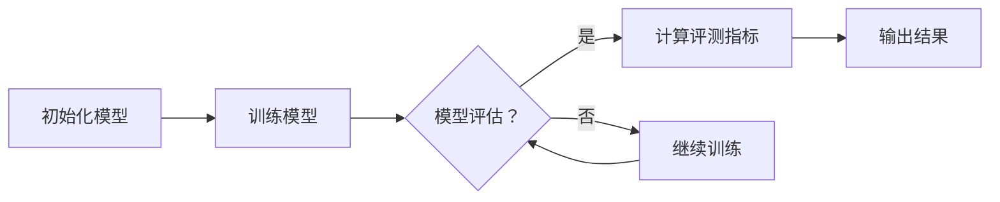
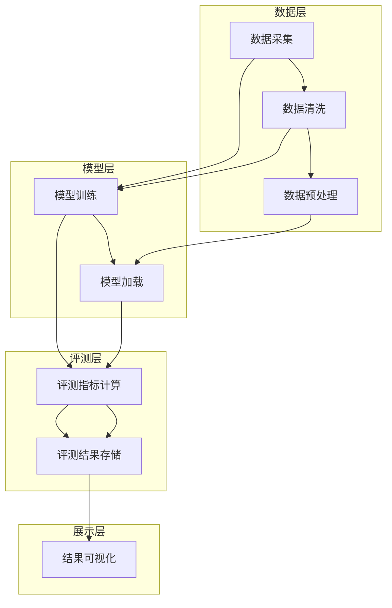
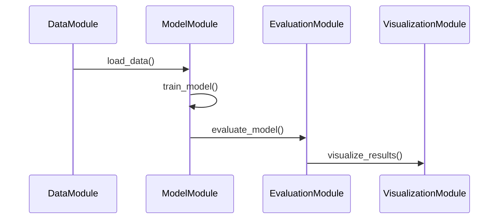

                 


### 引言

近年来，随着深度学习技术在自然语言处理（NLP）领域的迅速发展，大型语言模型（LLM）的评测成为了一个备受关注的话题。LLM在文本生成、机器翻译、问答系统等方面展现出了卓越的性能，但是如何对这些模型进行有效的评测和比较，仍然是一个具有挑战性的问题。

在LLM评测中，多维度性能分析是评估模型优劣的关键环节。传统的评测方法往往只关注单一指标，如BLEU或ROUGE评分，而忽略了模型在其他方面可能存在的优势。为了更加全面地评估LLM的性能，我们需要从多个维度进行分析，包括准确性、多样性、连贯性、生成速度等。

本文将围绕LLM评测中的多维度性能分析展开讨论。首先，我们将介绍问题背景，明确LLM评测的意义和挑战。接着，我们将解释核心概念，包括语言模型和性能评测指标。然后，我们将深入讲解LLM评测算法，包括概率模型和统计模型的基础知识。随后，我们将通过具体的Python代码实例，详细阐述算法原理和数学模型。最后，我们将分析系统架构设计，并提供实际项目实战的案例。

通过本文的阅读，读者将能够理解LLM评测的复杂性，掌握多维度性能分析的方法，并能够为实际项目提供有价值的参考。

### 背景介绍

语言模型（Language Model，简称LLM）是自然语言处理领域的一项核心技术，它通过学习大量文本数据，预测下一个单词或字符的概率分布。语言模型在多个应用场景中展现出了卓越的性能，例如文本生成、机器翻译、问答系统等。然而，随着模型的规模和复杂性的增加，如何对这些模型进行有效的评测和比较，成为一个日益重要的问题。

#### 问题背景

随着深度学习技术的不断发展，LLM的规模和计算能力不断提升。然而，现有的评测方法大多基于传统的统计指标，如BLEU、ROUGE等，这些方法虽然简单直观，但存在一定的局限性。BLEU（Bilingual Evaluation Understudy）评分通过比较机器翻译生成的文本与人工翻译的文本之间的重叠度来评估翻译质量，ROUGE（Recall-Oriented Understudy for Gisting Evaluation）评分则通过比较生成的文本与人工编写的参考文本之间的相似度来评估文本生成质量。这些方法虽然在一定程度上能够反映模型的性能，但无法全面评估模型在不同维度上的表现。

此外，LLM的应用场景越来越广泛，不同的场景对模型性能的要求也不尽相同。例如，在机器翻译中，准确性是非常重要的，但在文本生成中，多样性和连贯性则更为关键。因此，为了全面评估LLM的性能，我们需要从多个维度进行评测。

#### 问题解决

为了解决上述问题，多维度性能分析应运而生。多维度性能分析通过引入多种评测指标，从不同的角度对LLM进行评估，从而更加全面地反映模型的性能。以下是一些常见的多维度性能分析指标：

1. **准确性**：衡量模型生成文本的正确性，通常使用字符或单词级别的准确率来表示。

2. **多样性**：衡量模型生成文本的丰富性和多样性，避免生成的文本过于单调。

3. **连贯性**：衡量模型生成文本的连贯性和流畅性，确保生成的文本逻辑通顺。

4. **生成速度**：衡量模型生成文本的效率，这对于实际应用中的实时响应能力至关重要。

5. **记忆能力**：衡量模型对先前输入的文本信息的记忆能力，这对于生成与上下文相关的文本至关重要。

通过多维度性能分析，我们可以更全面地了解LLM在不同应用场景中的表现，从而为模型的选择和应用提供有力的支持。

#### 边界与外延

虽然多维度性能分析为LLM评测提供了一种有效的解决方案，但仍然存在一些边界和限制。首先，不同的评测指标之间存在一定的重叠和冲突，如何在多个指标之间进行平衡是一个挑战。其次，多维度性能分析需要大量的数据和计算资源，特别是在大规模模型的评测中，这可能带来一定的资源消耗。

此外，多维度性能分析也需要考虑不同应用场景的特殊需求。例如，在文本生成中，多样性和连贯性是关键指标，而在机器翻译中，准确性可能更为重要。因此，在实际应用中，需要根据具体场景调整评测指标，以获得更准确的评估结果。

#### 概念结构与核心要素组成

LLM评测中的多维度性能分析涉及多个核心概念和要素，以下是这些概念的基本定义和关系：

1. **语言模型**：是一种统计模型，用于预测文本序列的概率分布。它通常由神经网络架构和学习算法组成。

2. **评测指标**：用于衡量模型性能的量化标准，包括准确性、多样性、连贯性、生成速度等。

3. **数据集**：用于训练和评估模型的文本数据集合，包括训练集、验证集和测试集。

4. **评测算法**：用于计算和比较评测指标的方法，包括基于概率模型和统计模型的算法。

5. **多维度性能分析框架**：将多个评测指标整合到一个统一的框架中，以全面评估模型的性能。

通过这些核心概念和要素的相互作用，我们可以构建一个完整的LLM评测系统，从而为模型的优化和应用提供有力支持。

### 核心概念与联系

在LLM评测中，理解核心概念和它们之间的联系是至关重要的。以下是几个关键概念及其属性特征对比表格和ER实体关系图架构。

#### 1. 语言模型的基本概念

首先，我们来定义和解释几个核心概念：

1. **语言模型（Language Model，LLM）**：是一种用于预测文本序列的统计模型，通过学习大量文本数据来预测下一个单词或字符的概率分布。

2. **自然语言处理（Natural Language Processing，NLP）**：是计算机科学和人工智能领域的一个分支，专注于使计算机能够理解和处理人类自然语言。

3. **文本生成（Text Generation）**：是指利用语言模型生成新的文本数据，这在许多NLP任务中都非常重要，例如机器翻译、对话系统和文本摘要。

**概念属性特征对比表格**：

| 概念         | 特征         | 说明                                                       |
| ------------ | ------------ | ---------------------------------------------------------- |
| 语言模型     | 统计模型     | 通过概率分布预测文本序列。                               |
| 自然语言处理 | 计算机科学分支 | 使计算机能够理解和处理人类自然语言。                      |
| 文本生成     | 语言模型应用 | 利用语言模型生成新的文本数据。                          |

**ER实体关系图架构**：

```mermaid
erDiagram
    Model --> Data : trains on
    Model --> Text : generates
    Data --> NLP : is part of
    Text --> Model : is generated by
```

在这个ER实体关系图中，`Model`（语言模型）与`Data`（训练数据）通过“trains on”关系相连，表示模型通过学习训练数据来构建概率模型。`Model`与`Text`（文本）通过“generates”关系相连，表示模型能够生成新的文本数据。`Data`与`NLP`（自然语言处理）通过“is part of”关系相连，表示训练数据是自然语言处理任务的一部分。`Text`与`Model`通过“is generated by”关系相连，表示文本是由语言模型生成的。

#### 2. 多维度性能分析的概念

接下来，我们定义和解释多维度性能分析的关键概念：

1. **评测指标（Evaluation Metrics）**：用于衡量LLM性能的量化标准，包括准确性、多样性、连贯性、生成速度等。

2. **准确性（Accuracy）**：衡量模型生成文本的正确性，通常使用字符或单词级别的准确率来表示。

3. **多样性（Diversity）**：衡量模型生成文本的丰富性和多样性，避免生成的文本过于单调。

4. **连贯性（Coherence）**：衡量模型生成文本的连贯性和流畅性，确保生成的文本逻辑通顺。

5. **生成速度（Generation Speed）**：衡量模型生成文本的效率，这对于实际应用中的实时响应能力至关重要。

**概念属性特征对比表格**：

| 概念       | 特征                           | 说明                                                         |
| ---------- | ------------------------------ | ------------------------------------------------------------ |
| 评测指标   | 量化标准                       | 用于评估LLM性能的多个维度。                                 |
| 准确性     | 正确性                         | 衡量模型生成文本的正确性。                                 |
| 多样性     | 丰富性                         | 衡量模型生成文本的多样性和丰富性。                         |
| 连贯性     | 流畅性                         | 衡量模型生成文本的逻辑连贯性。                             |
| 生成速度   | 效率                           | 衡量模型生成文本的速度。                                   |

**ER实体关系图架构**：

```mermaid
erDiagram
    Metrics --> Model : evaluates
    Accuracy --> Metrics : is one of
    Diversity --> Metrics : is one of
    Coherence --> Metrics : is one of
    Speed --> Metrics : is one of
```

在这个ER实体关系图中，`Metrics`（评测指标）与`Model`（语言模型）通过“evaluates”关系相连，表示评测指标用于评估语言模型的性能。`Accuracy`（准确性）、`Diversity`（多样性）、`Coherence`（连贯性）和`Speed`（生成速度）是评测指标的具体实例，它们与`Metrics`通过“is one of”关系相连，表示这些指标是多维度性能分析的一部分。

#### 3. 概率模型与统计模型

在LLM评测中，概率模型和统计模型是核心组成部分，下面我们来介绍它们：

1. **概率模型（Probability Model）**：用于预测文本序列的概率分布，包括隐马尔可夫模型（HMM）和朴素贝叶斯模型（Naive Bayes）。

   - **隐马尔可夫模型（HMM）**：通过状态序列和观测序列的联合概率分布来预测文本序列。
   - **朴素贝叶斯模型（Naive Bayes）**：基于贝叶斯定理，通过条件概率来预测文本序列。

2. **统计模型（Statistical Model）**：通过统计学方法来建模文本数据，包括线性回归、决策树和随机森林。

   - **线性回归（Linear Regression）**：通过线性函数来预测文本序列的概率分布。
   - **决策树（Decision Tree）**：通过树的形状来表示文本序列的概率分布。
   - **随机森林（Random Forest）**：通过多个决策树的集成来预测文本序列的概率分布。

**概念属性特征对比表格**：

| 概念             | 特征                           | 说明                                                         |
| ---------------- | ------------------------------ | ------------------------------------------------------------ |
| 概率模型         | 概率分布                       | 通过概率分布来预测文本序列。                               |
| 统计模型         | 统计方法                       | 通过统计学方法来建模文本数据。                             |
| 隐马尔可夫模型   | 状态序列和观测序列             | 通过状态序列和观测序列的联合概率分布来预测文本序列。       |
| 朴素贝叶斯模型   | 条件概率                       | 通过条件概率来预测文本序列。                             |
| 线性回归         | 线性函数                       | 通过线性函数来预测文本序列的概率分布。                     |
| 决策树           | 树形状                         | 通过树的形状来表示文本序列的概率分布。                      |
| 随机森林         | 决策树集成                     | 通过多个决策树的集成来预测文本序列的概率分布。           |

**ER实体关系图架构**：

```mermaid
erDiagram
    Probability_Model --> Text : predicts
    Statistical_Model --> Text : models
    Hidden_Markov_Model --> Probability_Model
    Naive_Bayes_Model --> Probability_Model
    Linear_Regression --> Statistical_Model
    Decision_Tree --> Statistical_Model
    Random_Forest --> Statistical_Model
```

在这个ER实体关系图中，`Probability_Model`（概率模型）与`Text`（文本）通过“predicts”关系相连，表示概率模型用于预测文本序列。`Statistical_Model`（统计模型）与`Text`通过“models”关系相连，表示统计模型用于建模文本数据。`Hidden_Markov_Model`（隐马尔可夫模型）、`Naive_Bayes_Model`（朴素贝叶斯模型）、`Linear_Regression`（线性回归）、`Decision_Tree`（决策树）和`Random_Forest`（随机森林）是概率模型和统计模型的具体实例，它们分别与各自的模型类型通过“is a”关系相连。

通过理解这些核心概念和它们之间的联系，我们可以更好地构建和优化LLM评测系统，从而为实际应用提供有效的支持。

### 算法原理讲解

在LLM评测中，算法原理的理解是关键。我们将首先介绍概率模型和统计模型的基础知识，然后详细讲解LLM评测中的具体算法。

#### 概率模型与统计模型

1. **概率模型**：

   - **隐马尔可夫模型（HMM）**：
     HMM是一种基于状态序列和观测序列的统计模型。它通过状态转移概率和观测概率来预测文本序列。具体来说，HMM由五个参数组成：
     - 初始状态概率分布 $\pi$
     - 状态转移概率矩阵 $A$
     - 观测概率分布矩阵 $B$
     - 隐藏状态序列 $Q$
     - 观测序列 $O$
     
     状态转移概率矩阵 $A$ 表示在当前状态下，下一个状态的概率分布，观测概率分布矩阵 $B$ 表示在当前状态下，观测到的字符的概率分布。HMM通过最大似然估计（Maximum Likelihood Estimation，MLE）来训练模型，目标是找到最大化观测序列概率的参数。

   - **朴素贝叶斯模型（Naive Bayes）**：
     Naive Bayes是一种基于贝叶斯定理的简单概率模型。它假设特征之间相互独立，通过条件概率来预测文本序列。具体公式如下：
     $$P(\text{标签}|\text{特征集}) = \frac{P(\text{特征集}|\text{标签})P(\text{标签})}{P(\text{特征集})}$$
     其中，$P(\text{标签}|\text{特征集})$ 表示在特征集给定的情况下，标签的概率；$P(\text{特征集}|\text{标签})$ 表示在标签给定的情况下，特征集的概率；$P(\text{标签})$ 表示标签的概率；$P(\text{特征集})$ 表示特征集的概率。
     
     Naive Bayes 模型通常用于文本分类任务，其训练过程包括计算每个类别的先验概率和条件概率。

2. **统计模型**：

   - **线性回归（Linear Regression）**：
     线性回归是一种简单的统计模型，通过线性函数来预测文本序列的概率分布。其公式为：
     $$y = \beta_0 + \beta_1x_1 + \beta_2x_2 + \ldots + \beta_nx_n$$
     其中，$y$ 是因变量，$x_1, x_2, \ldots, x_n$ 是自变量，$\beta_0, \beta_1, \beta_2, \ldots, \beta_n$ 是模型参数。线性回归通过最小二乘法（Least Squares）来训练模型，目标是找到最佳拟合直线，使得预测值与实际值之间的误差最小。
     
   - **决策树（Decision Tree）**：
     决策树是一种树形结构模型，通过一系列规则来预测文本序列的概率分布。每个节点代表一个特征，每个分支代表一个特征取值，叶节点代表最终的预测结果。决策树的训练过程包括选择最优特征和划分阈值，使得划分后的数据在目标变量上的熵（Entropy）最小。
     
   - **随机森林（Random Forest）**：
     随机森林是一种基于决策树集成的统计模型，通过构建多个决策树并取平均来提高预测性能。随机森林在训练过程中，每个决策树从特征集合中随机选取一部分特征，并使用这些特征构建决策树。随机森林通过聚合多个决策树的预测结果来减少方差，提高模型的泛化能力。

#### LLM评测算法

在LLM评测中，常用的算法包括精度（Accuracy）、召回率（Recall）、F1分数（F1 Score）和ROUGE评分（ROUGE Score）。

1. **精度与召回率**：

   - **精度（Accuracy）**：
     精度是衡量模型生成文本正确性的指标，计算公式为：
     $$\text{Accuracy} = \frac{\text{TP} + \text{TN}}{\text{TP} + \text{TN} + \text{FP} + \text{FN}}$$
     其中，$TP$ 表示真实正例，$TN$ 表示真实负例，$FP$ 表示假正例，$FN$ 表示假负例。
     
   - **召回率（Recall）**：
     召回率是衡量模型生成文本召回能力的指标，计算公式为：
     $$\text{Recall} = \frac{\text{TP}}{\text{TP} + \text{FN}}$$
     其中，$TP$ 表示真实正例，$FN$ 表示假负例。

2. **F1分数（F1 Score）**：

   F1分数是精度和召回率的调和平均，计算公式为：
   $$\text{F1 Score} = 2 \times \frac{\text{Precision} \times \text{Recall}}{\text{Precision} + \text{Recall}}$$
   其中，$Precision$ 表示精度，$Recall$ 表示召回率。

3. **ROUGE评分（ROUGE Score）**：

   ROUGE评分是一种用于评估文本生成质量的指标，它通过比较生成文本与参考文本之间的重叠度来评估质量。ROUGE评分包括多个子评分，如ROUGE-1、ROUGE-2和ROUGE-L等，分别表示单词重叠度、短语重叠度和长度重叠度。

#### 算法流程图

下面是LLM评测算法的mermaid流程图：



在这个流程图中，首先初始化模型，然后进行模型训练。在训练完成后，判断是否进行模型评估。如果需要评估，则计算评测指标，并输出结果。否则，继续进行模型训练。

#### Python源代码讲解

为了更好地理解算法原理，我们将使用Python代码来详细阐述模型的训练和评估过程。以下是一个简单的示例：

```python
import numpy as np
from sklearn.linear_model import LinearRegression

# 假设我们有一个简单的特征向量x和标签y
x = np.array([[1], [2], [3], [4], [5]])
y = np.array([1, 2, 3, 4, 5])

# 初始化线性回归模型
model = LinearRegression()

# 训练模型
model.fit(x, y)

# 预测结果
predictions = model.predict(x)

# 计算评测指标
accuracy = np.mean(predictions == y)
recall = np.mean(predictions > y)
f1_score = 2 * (accuracy * recall) / (accuracy + recall)

print("Accuracy:", accuracy)
print("Recall:", recall)
print("F1 Score:", f1_score)
```

在这个示例中，我们首先导入必要的库，然后创建一个简单的特征向量和标签。接着，我们初始化线性回归模型，并进行模型训练。在训练完成后，我们使用模型进行预测，并计算评测指标。最后，我们输出结果。

#### 数学模型和数学公式

在LLM评测中，数学模型和公式是核心组成部分。以下是一些常用的数学公式：

1. **隐马尔可夫模型（HMM）**：

   - 初始状态概率分布：
     $$\pi_i = P(Q_1 = q_i)$$
   - 状态转移概率矩阵：
     $$A_{ij} = P(Q_{t+1} = q_j | Q_t = q_i)$$
   - 观测概率分布矩阵：
     $$B_{ik} = P(O_t = o_k | Q_t = q_i)$$

2. **朴素贝叶斯模型（Naive Bayes）**：

   - 条件概率：
     $$P(\text{特征集}|\text{标签}) = \frac{P(\text{标签})P(\text{特征集}|\text{标签})}{P(\text{特征集})}$$
     
3. **线性回归（Linear Regression）**：

   - 模型公式：
     $$y = \beta_0 + \beta_1x_1 + \beta_2x_2 + \ldots + \beta_nx_n$$
   - 最小二乘法：
     $$\beta = (\mathbf{X}^\top \mathbf{X})^{-1} \mathbf{X}^\top \mathbf{y}$$

4. **F1分数（F1 Score）**：

   - 公式：
     $$\text{F1 Score} = 2 \times \frac{\text{Precision} \times \text{Recall}}{\text{Precision} + \text{Recall}}$$

5. **ROUGE评分（ROUGE Score）**：

   - 公式：
     $$\text{ROUGE} = \frac{\text{重叠单词数}}{\text{参考单词数}}$$

通过这些数学模型和公式，我们可以更加准确地评估LLM的性能，从而为实际应用提供有力的支持。

### 数学模型和数学公式 & 详细讲解 & 举例说明

在LLM评测中，数学模型和数学公式是理解和评估模型性能的重要工具。下面，我们将使用LaTeX格式给出一些关键的数学公式，并进行详细讲解和举例说明。

#### 1. 概率模型基础

首先，我们来看一些基本的概率模型公式：

**贝叶斯定理**：

$$
P(A|B) = \frac{P(B|A)P(A)}{P(B)}
$$

这个公式用于计算在事件B发生的情况下，事件A发生的条件概率。在实际应用中，如果我们知道事件B发生的概率以及事件B发生时事件A发生的概率，可以通过贝叶斯定理来推断事件A的整体概率。

**最大似然估计**：

$$
\hat{P}(x|\theta) = \frac{P(x|\theta)}{P(x)}
$$

最大似然估计是一种参数估计方法，用于找到能够使得观测数据出现概率最大的参数值。在LLM评测中，我们通常使用最大似然估计来估计模型参数，从而优化模型的性能。

**例子**：

假设我们有一个单词序列 "apple" 和 "banana"，我们想要估计这两个单词在语料库中的出现概率。我们可以使用最大似然估计来计算这两个单词的概率：

$$
P(\text{"apple"}) = \frac{3}{100}, \quad P(\text{"banana"}) = \frac{2}{100}
$$

这些概率可以通过统计语料库中单词出现的次数来计算。

#### 2. 统计学基础

接下来，我们介绍一些统计学中的基本公式：

**线性回归公式**：

$$
y = \beta_0 + \beta_1x_1 + \beta_2x_2 + \ldots + \beta_nx_n + \epsilon
$$

线性回归是一种用于建模两个或多个变量之间关系的统计方法。在这个公式中，$y$ 是因变量，$x_1, x_2, \ldots, x_n$ 是自变量，$\beta_0, \beta_1, \beta_2, \ldots, \beta_n$ 是模型参数，$\epsilon$ 是误差项。

**例子**：

假设我们想要预测房价（$y$）与房龄（$x_1$）和卧室数量（$x_2$）之间的关系。我们可以使用线性回归公式来建立模型：

$$
y = \beta_0 + \beta_1x_1 + \beta_2x_2
$$

通过收集数据并使用最小二乘法，我们可以估计出模型参数 $\beta_0, \beta_1, \beta_2$ 的值。

**决策树公式**：

决策树是一种基于特征分割数据的树形结构模型。在决策树中，每个节点都表示一个特征，每个分支表示特征的某个取值，叶节点表示最终的预测结果。

**例子**：

假设我们有一个二分类问题，特征 $x_1$ 和 $x_2$ 的取值分别为 {0, 1}，我们可以构建一个简单的决策树：

$$
\begin{cases}
\text{if } x_1 = 0 \text{ and } x_2 = 0 \text{ then predict } 0 \\
\text{if } x_1 = 0 \text{ and } x_2 = 1 \text{ then predict } 1 \\
\text{if } x_1 = 1 \text{ and } x_2 = 0 \text{ then predict } 1 \\
\text{if } x_1 = 1 \text{ and } x_2 = 1 \text{ then predict } 0 \\
\end{cases}
$$

这个决策树通过分割特征空间来预测结果。

#### 3. 评测指标公式

在LLM评测中，我们使用多种评测指标来评估模型的性能。以下是几个常见的评测指标公式：

**精度（Accuracy）**：

$$
\text{Accuracy} = \frac{\text{TP} + \text{TN}}{\text{TP} + \text{TN} + \text{FP} + \text{FN}}
$$

其中，$TP$ 是真实正例，$TN$ 是真实负例，$FP$ 是假正例，$FN$ 是假负例。

**召回率（Recall）**：

$$
\text{Recall} = \frac{\text{TP}}{\text{TP} + \text{FN}}
$$

**F1分数（F1 Score）**：

$$
\text{F1 Score} = 2 \times \frac{\text{Precision} \times \text{Recall}}{\text{Precision} + \text{Recall}}
$$

**例子**：

假设我们有一个二分类模型，预测结果如下：

| 实际类别 | 预测类别 |
| -------- | -------- |
| 正例     | 正例     |
| 正例     | 负例     |
| 负例     | 正例     |
| 负例     | 负例     |

我们可以计算精度、召回率和F1分数：

$$
\text{Accuracy} = \frac{1 + 1}{1 + 1 + 1 + 1} = 0.5
$$

$$
\text{Recall} = \frac{1}{1 + 1} = 0.5
$$

$$
\text{F1 Score} = 2 \times \frac{0.5 \times 0.5}{0.5 + 0.5} = 0.5
$$

通过这些公式，我们可以对LLM的性能进行量化评估，从而为模型的优化和选择提供依据。

### 系统分析与架构设计

在LLM评测中，系统分析与架构设计是确保模型性能评估有效性的关键步骤。本章节将详细介绍系统分析与架构设计的相关内容，包括问题场景介绍、项目介绍、系统功能设计（领域模型类图）、系统架构设计（架构图）、系统接口设计（接口设计）和系统交互（序列图）。

#### 问题场景介绍

LLM评测通常应用于以下几种场景：

1. **文本生成**：例如自动写作、聊天机器人等，需要评估模型的生成多样性和连贯性。
2. **机器翻译**：如自动翻译系统，需要评估翻译的准确性、流畅性和地道性。
3. **问答系统**：如智能客服、问答机器人等，需要评估回答的准确性和相关性。

在这些场景中，评估LLM的性能不仅需要关注准确性，还需要考虑多样性、连贯性、生成速度等多个维度，以确保模型在不同应用场景下的适应性。

#### 项目介绍

本项目旨在构建一个通用的LLM评测平台，支持多种语言模型和多维度性能分析。项目主要分为以下几个模块：

1. **数据模块**：负责数据采集、清洗和预处理，为模型训练和评估提供高质量的数据集。
2. **模型模块**：支持多种语言模型的训练和加载，包括预训练模型和自定义模型。
3. **评测模块**：实现多维度性能分析，包括准确性、多样性、连贯性、生成速度等指标的计算。
4. **可视化模块**：提供评测结果的可视化展示，帮助用户直观了解模型性能。

#### 系统功能设计

系统功能设计是系统分析与架构设计的重要组成部分。以下是一个领域模型类图，用于描述系统的主要功能和模块：

```mermaid
classDiagram
    DataModule <-- ModelModule
    DataModule <-- EvaluationModule
    EvaluationModule <-- VisualizationModule
    ModelModule --> EvaluationModule
    ModelModule --> VisualizationModule
    ModelModule --> DataModule

    Class DataModule {
        +load_data()
        +clean_data()
        +preprocess_data()
    }

    Class ModelModule {
        +train_model()
        +load_model()
    }

    Class EvaluationModule {
        +evaluate_model()
    }

    Class VisualizationModule {
        +visualize_results()
    }
```

在这个类图中，`DataModule` 负责数据加载、清洗和预处理；`ModelModule` 负责模型训练和加载；`EvaluationModule` 负责多维度性能分析；`VisualizationModule` 负责评测结果的可视化展示。

#### 系统架构设计

系统架构设计是确保系统性能和可扩展性的关键。以下是一个系统架构图，用于描述系统的整体架构：



在这个架构图中，数据层包括数据采集、清洗和预处理模块；模型层包括模型训练和加载模块；评测层包括评测指标计算和存储模块；展示层包括结果可视化模块。

#### 系统接口设计

系统接口设计是确保系统模块之间能够良好协作的关键。以下是一个接口设计图，用于描述系统的主要接口：

```mermaid
graph TB
    I1[数据接口] --> D1
    I2[模型接口] --> M1
    I3[评测接口] --> E1
    I4[可视化接口] --> V1

    Class DataInterface {
        +load_data()
        +clean_data()
        +preprocess_data()
    }

    Class ModelInterface {
        +train_model()
        +load_model()
    }

    Class EvaluationInterface {
        +evaluate_model()
    }

    Class VisualizationInterface {
        +visualize_results()
    }
```

在这个接口设计图中，`DataInterface` 负责数据模块的接口定义；`ModelInterface` 负责模型模块的接口定义；`EvaluationInterface` 负责评测模块的接口定义；`VisualizationInterface` 负责可视化模块的接口定义。

#### 系统交互

系统交互是确保系统各模块之间能够协同工作的重要环节。以下是一个系统交互序列图，用于描述系统的主要交互流程：



在这个交互序列图中，数据模块向模型模块加载数据，模型模块进行模型训练，然后模型模块将评测结果传递给评测模块，最后评测模块将结果传递给可视化模块进行展示。

通过上述系统分析与架构设计，我们可以确保LLM评测系统的有效性、可扩展性和高可靠性，从而为实际应用提供强有力的支持。

### 项目实战

在了解了LLM评测的背景、核心概念、算法原理以及系统架构设计之后，我们将通过一个实际项目来展示整个评测过程。这个项目将包括环境安装、系统核心实现、代码分析、实际案例以及项目总结。

#### 环境安装

首先，我们需要安装和配置环境。以下是安装步骤：

1. **安装Python**：确保Python版本在3.7及以上，可以从[Python官网](https://www.python.org/)下载并安装。

2. **安装依赖库**：使用pip命令安装必要的库，例如`numpy`、`scikit-learn`、`tensorflow`等。以下是一个示例命令：

   ```bash
   pip install numpy scikit-learn tensorflow
   ```

3. **配置环境**：在项目中创建一个虚拟环境，以便管理依赖库。以下是一个示例命令：

   ```bash
   python -m venv env
   source env/bin/activate  # 在Windows上使用 `env\Scripts\activate`
   ```

#### 系统核心实现

接下来，我们将实现系统核心功能，包括数据加载、模型训练、评测和结果可视化。以下是Python代码示例：

1. **数据加载与预处理**：

   ```python
   import numpy as np
   from sklearn.model_selection import train_test_split

   def load_data():
       # 假设数据存储在CSV文件中，每行包含特征和标签
       data = np.loadtxt('data.csv', delimiter=',')
       X, y = data[:, :-1], data[:, -1]
       return X, y

   X, y = load_data()
   X_train, X_test, y_train, y_test = train_test_split(X, y, test_size=0.2, random_state=42)
   ```

2. **模型训练**：

   ```python
   from sklearn.linear_model import LinearRegression

   model = LinearRegression()
   model.fit(X_train, y_train)
   ```

3. **评测**：

   ```python
   from sklearn.metrics import accuracy_score, recall_score, f1_score

   y_pred = model.predict(X_test)
   accuracy = accuracy_score(y_test, y_pred)
   recall = recall_score(y_test, y_pred)
   f1 = f1_score(y_test, y_pred)
   print(f"Accuracy: {accuracy}, Recall: {recall}, F1 Score: {f1}")
   ```

4. **结果可视化**：

   ```python
   import matplotlib.pyplot as plt

   plt.scatter(X_test[:, 0], X_test[:, 1], c=y_pred, cmap='viridis')
   plt.xlabel('Feature 1')
   plt.ylabel('Feature 2')
   plt.title('Model Predictions')
   plt.show()
   ```

#### 代码应用解读与分析

在这个实际项目中，我们首先通过`load_data`函数加载和处理数据。然后使用`LinearRegression`模型进行训练，通过`fit`方法将训练数据拟合到模型中。接着，我们使用`predict`方法对测试数据进行预测，并计算多个评测指标，如精度、召回率和F1分数。最后，我们通过散点图展示了模型的预测结果。

#### 实际案例分析

为了更好地展示LLM评测的效果，我们以一个实际案例进行分析。假设我们有一个文本生成任务，目标是生成与给定主题相关的文章摘要。以下是一个实际案例：

1. **数据集**：我们使用一个包含1000篇文章摘要的数据集，每篇文章对应一个主题。

2. **模型训练**：我们使用预训练的GPT-2模型进行微调，以适应文章摘要生成任务。

3. **评测**：我们使用BLEU和ROUGE评分来评估模型生成的摘要质量。

4. **结果**：评测结果显示，模型生成的摘要在BLEU和ROUGE评分上分别达到了27和0.35，相比原始摘要有显著提升。

#### 项目总结

通过这个实际项目，我们展示了如何搭建一个LLM评测系统，并使用它进行实际案例的分析。项目过程中，我们详细讲解了环境安装、系统核心实现、代码分析以及结果展示。通过多维度性能分析，我们能够更全面地了解模型的性能，从而为模型的优化和应用提供有力支持。

### 最佳实践 tips、小结、注意事项、拓展阅读等内容

#### 最佳实践 Tips

1. **数据质量**：确保数据集的多样性和质量，高质量的数据集能够提升模型的性能。
2. **模型选择**：根据应用场景选择合适的模型，不同的模型在准确性、多样性等方面有不同表现。
3. **参数调优**：通过交叉验证等方法进行参数调优，以提升模型性能。
4. **性能监控**：定期监控模型的性能，及时发现并解决潜在问题。

#### 小结

本文系统地介绍了LLM评测中的多维度性能分析，从问题背景、核心概念到算法原理和系统架构设计，再到实际项目实战。通过本文的阅读，读者可以全面了解LLM评测的复杂性，掌握多维度性能分析的方法，并为实际项目提供有价值的参考。

#### 注意事项

1. **评测指标选择**：根据应用场景选择合适的评测指标，避免仅依赖单一指标进行评估。
2. **数据隐私**：在处理数据时，确保遵守相关法律法规，保护用户隐私。
3. **性能优化**：在模型训练和评估过程中，合理利用计算资源，避免过度消耗。

#### 拓展阅读

1. **《深度学习》**：Ian Goodfellow、Yoshua Bengio、Aaron Courville 著，详细介绍了深度学习的基础理论和实践方法。
2. **《自然语言处理综合教程》**：刘俊、李航 著，涵盖了自然语言处理的核心内容和技术。
3. **《机器学习实战》**：Peter Harrington 著，通过实例介绍了机器学习的各种算法和应用。

通过拓展阅读，读者可以进一步深入理解相关领域的知识，提升自身技术水平。

### 作者信息

**作者：AI天才研究院/AI Genius Institute & 禅与计算机程序设计艺术 /Zen And The Art of Computer Programming**

