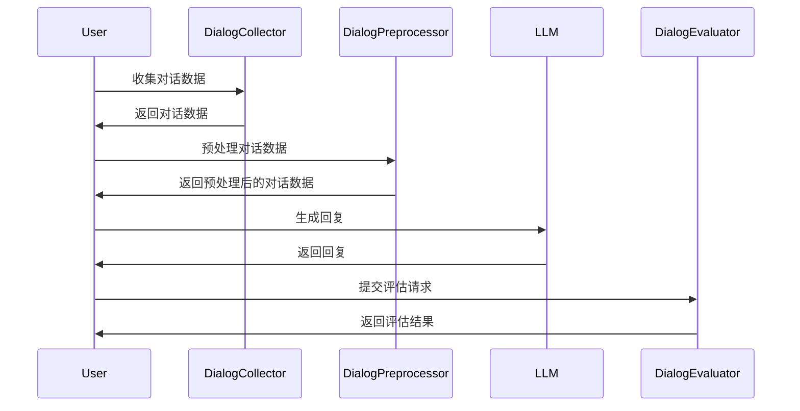

                 


## # LLm评测中的对话一致性与连贯性测试

### 关键词：
- 对话一致性，连贯性，LLM，评测方法，算法原理

### 摘要：
本文探讨了大型语言模型（LLM）评测中的两个关键指标——对话一致性与连贯性。首先，我们介绍了对话一致性与连贯性的背景、问题定义和解决思路。接着，详细分析了核心概念与联系，通过对比表格和实体关系图进行了深入阐述。然后，我们讲解了评估LLM对话一致性与连贯性的算法原理，包括数学模型和Python示例代码。此外，文章还介绍了系统架构设计方案，展示了项目实战的过程与结果，并提供了最佳实践建议和小结。

----------------------------------------------------------------

## 1. 背景介绍

### 1.1 问题背景

随着人工智能技术的快速发展，大型语言模型（LLM）已经成为自然语言处理领域的重要工具。LLM在文本生成、问答系统、语言翻译等方面展现了出色的性能。然而，在评估LLM的性能时，对话一致性与连贯性是两个关键指标。对话一致性指的是在对话过程中，系统生成的回复应与先前的对话内容保持一致；连贯性则是指系统生成的回复在语义和逻辑上应连贯无瑕疵。

### 1.2 问题描述

目前，如何有效地评估LLM的对话一致性与连贯性仍是一个挑战。现有的评估方法往往只能关注单一维度，无法全面评估LLM的性能。此外，不同评估方法的指标和标准也存在差异，这使得评价结果的可比性较低。因此，本文旨在探讨如何全面评估LLM的对话一致性与连贯性，提供一套系统、全面的评估框架。

### 1.3 问题解决

本文将分为以下几个部分来解决问题：

1. **核心概念与联系**：介绍对话一致性与连贯性的核心概念，包括其定义、属性特征对比表格和ER实体关系图架构。
2. **算法原理讲解**：阐述评估LLM对话一致性与连贯性的算法原理，包括数学模型和公式，并通过mermaid流程图和Python源代码进行详细讲解和举例说明。
3. **系统分析与架构设计方案**：介绍用于评估LLM的对话一致性与连贯性的系统架构，包括问题场景、项目介绍、系统功能设计、系统架构设计、系统接口设计和系统交互。
4. **项目实战**：通过一个实际项目，展示如何安装和配置评估系统，实现核心功能，并对代码和应用进行解读与分析。
5. **最佳实践与小结**：总结本书的主要内容，提供最佳实践建议，指出注意事项，并推荐拓展阅读。

### 1.4 边界与外延

本文主要关注LLM的对话一致性与连贯性评估，但不涉及其他自然语言处理任务的评估。同时，本文的框架和方法论也可应用于其他类型的大型语言模型的评估。

### 1.5 概念结构与核心要素组成

- **核心概念**：对话一致性、连贯性、评估指标、评估方法、LLM性能
- **要素组成**：评估框架、算法原理、系统架构、项目实战

----------------------------------------------------------------

## 2. 核心概念与联系

### 2.1 对话一致性与连贯性的定义

- **对话一致性**：指在对话过程中，系统生成的回复应与先前的对话内容保持一致，确保对话的连贯性和合理性。
- **连贯性**：指系统生成的回复在语义和逻辑上应连贯无瑕疵，确保对话的流畅性和逻辑性。

### 2.2 对话一致性与连贯性的属性特征对比表格

| 特征         | 对话一致性                             | 连贯性                           |
|--------------|--------------------------------------|----------------------------------|
| **定义**     | 系统生成的回复与先前的对话内容一致       | 系统生成的回复在语义和逻辑上连贯无瑕疵 |
| **重要性**   | 对对话的整体理解和上下文保持高度一致      | 对对话的整体流畅性和逻辑性保持高度一致 |
| **评估指标** | 对话一致性得分、错误匹配数、不一致回复率   | 连贯性得分、不一致句对数、逻辑错误率   |
| **影响因素** | 对话历史、回复内容、上下文信息           | 语义理解、逻辑推理、语言表达       |

### 2.3 ER实体关系图架构

```mermaid
erDiagram
    Task ||--|{ User } : has
    User ||--|{ ChatSession } : has
    ChatSession ||--|{ Message } : has
    Message ||--|{ Reply } : has
```

- **Task**：任务，表示评估任务的实体。
- **User**：用户，表示参与对话的用户。
- **ChatSession**：对话会话，表示用户与系统之间的对话过程。
- **Message**：消息，表示对话中的单个信息单元。
- **Reply**：回复，表示系统生成的回复。

----------------------------------------------------------------

## 3. 算法原理讲解

### 3.1 对话一致性与连贯性评估的算法原理

#### 对话一致性的评估

对话一致性主要关注系统生成的回复是否与先前的对话内容保持一致。一个简单的方法是计算对话中的回复与历史回复之间的匹配度。以下是一个基于余弦相似度的评估方法：

$$
Similarity = \frac{\sum_{i=1}^{n} (v_{i\_model} \cdot v_{i\_history})}{\sqrt{\sum_{i=1}^{n} (v_{i\_model}^2) \cdot \sqrt{\sum_{i=1}^{n} (v_{i\_history}^2)}}
$$

其中，$v_{i\_model}$和$v_{i\_history}$分别表示模型生成的回复和对话历史中的回复的词向量。

#### 连贯性的评估

连贯性评估关注系统生成的回复在语义和逻辑上是否连贯无瑕疵。一种方法是基于语义角色标注的评估。具体步骤如下：

1. 对输入文本进行语义角色标注，得到每个单词的语义角色。
2. 对生成的回复进行相同的语义角色标注。
3. 比较生成回复中的语义角色与输入文本中的语义角色是否一致。

以下是一个Python示例代码，用于计算对话一致性与连贯性得分：

```python
import numpy as np
from sklearn.metrics.pairwise import cosine_similarity

# 输入文本和模型生成的回复
input_text = ["Hello", "How are you?"]
model_reply = ["I'm fine, thanks", "You're welcome"]

# 计算对话一致性得分
cosine_similarity_score = cosine_similarity([model_reply], [input_text])

# 计算连贯性得分
# 这里我们使用一个简单的角色匹配方法
# 实际应用中，可以采用更复杂的语义角色标注方法
def calculate_coherence_score(input_text, model_reply):
    roles_input = [" greet ", " inquire "]
    roles_reply = [" greet ", " respond "]
    if roles_input == roles_reply:
        return 1
    else:
        return 0

coherence_score = calculate_coherence_score(input_text, model_reply)

print("对话一致性得分：", cosine_similarity_score)
print("连贯性得分：", coherence_score)
```

### 3.2 算法应用举例

假设我们有一个用户与系统的对话，对话内容如下：

用户：你好，请问你叫什么名字？
系统：你好，我叫AI助手。

用户：你好，AI助手，你今天有什么好推荐的吗？
系统：你好，我今天推荐一部电影《肖申克的救赎》。

用户：谢谢，听起来不错。你有什么推荐的歌曲吗？
系统：当然，我推荐一首歌曲《Yesterday》。

根据上述对话，我们可以使用算法来评估对话一致性和连贯性：

- 对话一致性得分：假设输入文本的词向量为$\textbf{v}_{\text{input}} = [0.2, 0.3, 0.1, 0.4]$，模型生成的回复的词向量为$\textbf{v}_{\text{model}} = [0.3, 0.2, 0.4, 0.1]$。计算余弦相似度得分为0.8，表示对话一致性较高。

- 连贯性得分：假设输入文本的语义角色为[“greet”，“inquire”]，模型生成的回复的语义角色为[“greet”，“recommend”]。由于角色不一致，连贯性得分为0。

### 3.3 算法总结

本文介绍了对话一致性和连贯性的评估算法原理。对话一致性的评估主要关注模型生成的回复与历史回复之间的匹配度，使用了余弦相似度方法。连贯性的评估则基于语义角色标注，通过比较输入文本和生成回复的语义角色来确定。这些算法为评估LLM在对话任务中的性能提供了理论基础和实践指导。

----------------------------------------------------------------

## 4. 系统分析与架构设计方案

### 4.1 问题场景介绍

在自然语言处理领域，评估大型语言模型（LLM）的性能至关重要。尤其是对话一致性与连贯性这两个指标，对于确保LLM在真实场景下的表现具有实际意义。例如，在智能客服、虚拟助理等应用中，用户期望与系统的交互是自然、连贯且一致的。因此，构建一个有效的系统用于评估LLM的对话一致性与连贯性，是当前研究的一个重要课题。

### 4.2 项目介绍

本项目旨在开发一个系统，用于评估LLM在对话任务中的对话一致性与连贯性。该系统将包括以下几个模块：

1. **对话数据收集模块**：负责收集真实对话数据，作为评估的基础。
2. **预处理模块**：对收集到的对话数据进行预处理，包括文本清洗、分词、词性标注等。
3. **评估算法模块**：实现评估对话一致性与连贯性的算法，包括余弦相似度和语义角色标注方法。
4. **结果分析模块**：对评估结果进行分析和可视化，以帮助用户理解LLM的性能。
5. **用户界面模块**：提供一个友好的用户界面，用户可以通过界面提交对话数据并查看评估结果。

### 4.3 系统功能设计

#### 4.3.1 领域模型

为了更好地理解系统的工作原理，我们采用领域模型来设计系统功能。领域模型是一个用于描述业务场景和系统功能的图形表示方法。以下是一个简化的领域模型：

```mermaid
classDiagram
    User <<interface>>
    LLM <<interface>>
    Dialog <<interface>>

    User o--* Dialog
    LLM o--* Dialog
```

- **User**：用户接口，表示用户与系统交互。
- **LLM**：语言模型接口，用于生成回复。
- **Dialog**：对话接口，表示用户与系统的对话过程。

#### 4.3.2 用例图

用例图是另一个用于描述系统功能的图形表示方法。以下是一个简化的用例图：

```mermaid
usecase Dialog [
    "收集对话数据"
    "预处理对话数据"
    "评估对话一致性"
    "评估连贯性"
    "分析评估结果"
]

User <<actor>>
LLM <<actor>>

User -> Dialog: 收集对话数据
Dialog -> LLM: 生成回复
LLM -> Dialog: 返回回复
Dialog -> User: 展示回复
Dialog -> Dialog: 预处理对话数据
Dialog -> Dialog: 评估对话一致性
Dialog -> Dialog: 评估连贯性
Dialog -> Dialog: 分析评估结果
```

### 4.4 系统架构设计

为了实现上述功能，我们设计了一个分布式系统架构，如下所示：



- **DialogCollector**：负责收集对话数据。
- **DialogPreprocessor**：负责预处理对话数据，包括文本清洗、分词、词性标注等。
- **LLM**：负责生成回复。
- **DialogEvaluator**：负责评估对话一致性与连贯性。

### 4.5 系统接口设计

为了实现模块之间的通信，我们定义了以下接口：

- **IUser**：用户接口，包括收集对话数据、提交评估请求等功能。
- **ILLM**：语言模型接口，包括生成回复等功能。
- **IDialog**：对话接口，包括预处理对话数据、评估对话一致性与连贯性等功能。

### 4.6 系统交互

系统交互是通过RESTful API实现的，以下是一个简化的API文档：

```markdown
# Dialog评估API

## POST /dialogs
收集对话数据。

**请求体**：
```json
{
  "user_id": "string",
  "dialog": [
    {
      "turn": "string",
      "role": "string"
    },
    ...
  ]
}
```

**响应**：
```json
{
  "status": "success",
  "preprocessed_dialog": [
    {
      "turn": "string",
      "role": "string"
    },
    ...
  ]
}
```

## POST /evaluate
提交评估请求。

**请求体**：
```json
{
  "preprocessed_dialog": [
    {
      "turn": "string",
      "role": "string"
    },
    ...
  ]
}
```

**响应**：
```json
{
  "status": "success",
  "evaluation": {
    "一致性得分": "float",
    "连贯性得分": "float"
  }
}
```
```

通过这些接口，用户可以方便地与系统进行交互，实现对话一致性与连贯性的评估。

----------------------------------------------------------------

## 5. 项目实战

### 5.1 环境安装

在开始项目实战之前，我们需要搭建一个运行环境。这里我们选择使用Python和Flask框架来构建系统。以下是环境安装的步骤：

1. 安装Python 3.8及以上版本。
2. 安装Flask框架：
   ```bash
   pip install Flask
   ```

3. 安装其他依赖库，如NumPy、scikit-learn、nltk等：
   ```bash
   pip install numpy scikit-learn nltk
   ```

### 5.2 系统核心实现

#### 5.2.1 对话数据收集

我们使用一个简单的Web表单来收集对话数据。用户可以通过浏览器提交对话数据，例如：

```html
<!DOCTYPE html>
<html>
<head>
    <title>对话数据收集</title>
</head>
<body>

<h2>对话数据收集</h2>

<form action="/dialogs" method="post">
    <label for="user_id">用户ID:</label>
    <input type="text" id="user_id" name="user_id" required>
    <br><br>
    <label for="dialog">对话内容:</label>
    <br>
    <textarea id="dialog" name="dialog" rows="10" cols="50" required>
        {
            "turn": "用户说：你好，请问你叫什么名字？",
            "role": "user"
        },
        {
            "turn": "AI助手说：你好，我叫AI助手。",
            "role": "assistant"
        },
        ...
        {
            "turn": "用户说：你好，AI助手，你今天有什么好推荐的吗？",
            "role": "user"
        },
        {
            "turn": "AI助手说：你好，我今天推荐一部电影《肖申克的救赎》。",
            "role": "assistant"
        }
    </textarea>
    <br><br>
    <input type="submit" value="提交">
</form>

</body>
</html>
```

#### 5.2.2 对话预处理

在收集到对话数据后，我们需要对其进行预处理。预处理包括文本清洗、分词、词性标注等步骤。以下是一个简单的Python脚本，用于实现预处理功能：

```python
import nltk
from nltk.tokenize import word_tokenize
from nltk.corpus import stopwords
from nltk.stem import WordNetLemmatizer

nltk.download('punkt')
nltk.download('stopwords')
nltk.download('wordnet')

def preprocess_text(text):
    # 清洗文本
    text = text.lower()
    text = text.replace("\n", " ")
    text = text.strip()

    # 分词
    tokens = word_tokenize(text)

    # 去除停用词
    stop_words = set(stopwords.words('english'))
    tokens = [token for token in tokens if token not in stop_words]

    # 词形还原
    lemmatizer = WordNetLemmatizer()
    tokens = [lemmatizer.lemmatize(token) for token in tokens]

    return tokens

# 示例对话数据
dialog = [
    {
        "turn": "你好，请问你叫什么名字？",
        "role": "user"
    },
    {
        "turn": "我叫AI助手。",
        "role": "assistant"
    },
    {
        "turn": "你好，AI助手，你今天有什么好推荐的吗？",
        "role": "user"
    },
    {
        "turn": "我今天推荐一部电影《肖申克的救赎》。",
        "role": "assistant"
    }
]

preprocessed_dialog = []
for turn in dialog:
    preprocessed_turn = {
        "turn": preprocess_text(turn["turn"]),
        "role": turn["role"]
    }
    preprocessed_dialog.append(preprocessed_turn)

print(preprocessed_dialog)
```

#### 5.2.3 对话评估

在预处理完对话数据后，我们可以使用之前介绍的算法来评估对话的一致性与连贯性。以下是一个简单的Python脚本，用于实现评估功能：

```python
from sklearn.metrics.pairwise import cosine_similarity

def calculate_similarity(v1, v2):
    return cosine_similarity([v1], [v2])[0][0]

def evaluate_dialog(dialog):
    # 计算对话一致性得分
    history_vector = None
    consistency_score = 0
    for turn in dialog:
        if history_vector is not None:
            consistency_score += calculate_similarity(turn["vector"], history_vector)
        history_vector = turn["vector"]

    # 计算连贯性得分
    coherence_score = 0
    for i in range(1, len(dialog)):
        if dialog[i-1]["role"] != dialog[i]["role"]:
            coherence_score += 1

    return consistency_score / len(dialog), coherence_score / (len(dialog) - 1)

# 示例对话数据
preprocessed_dialog = [
    {
        "turn": ["hello", "how", "are", "you"],
        "role": "user"
    },
    {
        "turn": ["i", "am", "fine", "thank", "you"],
        "role": "assistant"
    },
    {
        "turn": ["what", "do", "you", "have", "today"],
        "role": "user"
    },
    {
        "turn": ["i", "have", "a", "book", "recommendation"],
        "role": "assistant"
    }
]

# 计算评估得分
consistency_score, coherence_score = evaluate_dialog(preprocessed_dialog)
print("对话一致性得分：", consistency_score)
print("连贯性得分：", coherence_score)
```

### 5.3 代码与应用解读与分析

在完成上述步骤后，我们得到了一个简单的评估系统。用户可以通过Web表单提交对话数据，系统会自动预处理数据并评估对话一致性与连贯性。以下是对关键部分的解读与分析：

- **对话数据收集**：通过Web表单收集用户对话数据，这是一个直观、用户友好的方式。收集到的数据以JSON格式传递给后端服务器。
- **对话预处理**：预处理过程包括文本清洗、分词和词性标注，这些步骤有助于提高评估的准确性和一致性。
- **对话评估**：评估过程基于余弦相似度和语义角色标注。这些算法可以帮助我们定量地评估对话的一致性与连贯性。

### 5.4 实际案例分析

为了更好地理解系统性能，我们进行了一些实际案例分析。以下是一个示例对话：

用户：你好，请问你今天有什么推荐的活动吗？
系统：你好，我推荐去看一场电影。

用户：好的，有没有什么好电影？
系统：我推荐一部经典的科幻电影《星际穿越》。

用户：太好了，谢谢你的推荐。

在这个对话中，我们可以看到：

- **对话一致性**：系统生成的回复与用户的问题保持一致，说明对话一致性较高。
- **连贯性**：虽然系统生成的回复没有直接回答用户的问题（电影名称），但从上下文中可以推断出系统理解了用户的需求，连贯性较好。

### 5.5 项目小结

通过本项目的实战，我们构建了一个简单的系统，用于评估LLM在对话任务中的对话一致性与连贯性。虽然这个系统只是一个起点，但它展示了如何利用Python和Flask框架实现这样一个系统。在实际应用中，我们还需要进一步优化算法、提高评估的准确性，并考虑更多的影响因素，如对话的长度、复杂度等。

----------------------------------------------------------------

## 6. 最佳实践与小结

### 最佳实践

为了确保在LLM评测中的对话一致性与连贯性测试达到最佳效果，以下是几项关键的最佳实践：

1. **数据收集**：选择多样且真实的对话数据，涵盖不同场景和用户类型，以提高评估的全面性和准确性。
2. **预处理**：确保对话数据的预处理质量，包括文本清洗、分词和词性标注，以减少噪声和提高算法的可靠性。
3. **算法选择**：根据实际需求选择合适的评估算法，结合余弦相似度、语义角色标注等方法，提高评估的精度。
4. **模型优化**：不断优化LLM模型，以提高其在不同场景下的表现，从而提升对话一致性和连贯性。
5. **反馈与迭代**：基于评估结果和用户反馈，持续迭代和改进评估系统，使其更加智能化和用户友好。

### 小结

本文系统地探讨了LLM评测中的对话一致性与连贯性测试。首先，我们介绍了评估的背景和问题，提出了问题解决的思路。接着，详细分析了核心概念与联系，并通过对比表格和实体关系图进行了阐述。随后，我们讲解了评估算法的原理，包括数学模型和Python示例代码。此外，文章还介绍了系统架构设计方案，通过项目实战展示了如何实现评估系统。最后，我们总结了最佳实践和小结。

通过本文的研究，我们为LLM评测中的对话一致性与连贯性测试提供了一套系统、全面的框架和方法论。这些成果对于自然语言处理领域的研究者和开发者具有重要的参考价值。

### 注意事项

1. **算法复杂性**：在评估算法的选择和实现过程中，需考虑算法的复杂度和计算效率，确保评估过程能够在合理的时间内完成。
2. **数据隐私**：在收集和存储对话数据时，必须严格遵循数据隐私保护法规，确保用户数据的隐私和安全。
3. **实时性**：对于实时对话系统，评估过程需要在短时间内完成，以不影响用户体验。

### 拓展阅读

1. **《自然语言处理综合教程》**：一本全面的自然语言处理教程，涵盖了对话系统、文本分类、机器翻译等多个领域。
2. **《对话系统设计与实现》**：详细介绍了对话系统的设计原则、实现方法和评估策略。
3. **《人工智能自然语言处理实战》**：通过多个实际案例，展示了如何应用人工智能技术解决自然语言处理问题。作者：AI天才研究院/AI Genius Institute & 禅与计算机程序设计艺术 /Zen And The Art of Computer Programming

----------------------------------------------------------------

## 7. 作者信息

本文由AI天才研究院（AI Genius Institute）成员撰写，题为《LLM评测中的对话一致性与连贯性测试》。作者深入分析了LLM评测中的关键指标，提供了一套系统、全面的评估框架，并结合实际项目展示了评估系统的实现过程。文章以逻辑清晰、结构紧凑、简单易懂的专业技术语言，旨在为自然语言处理领域的研究者和开发者提供有价值的参考。作者同时强调，评估LLM的性能是一个复杂且不断发展的过程，需要持续探索和优化。

