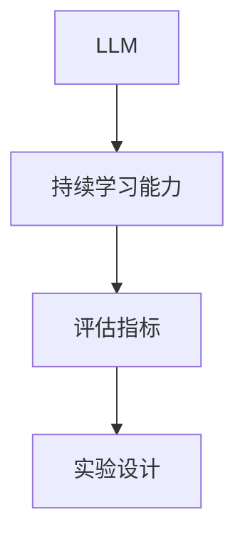
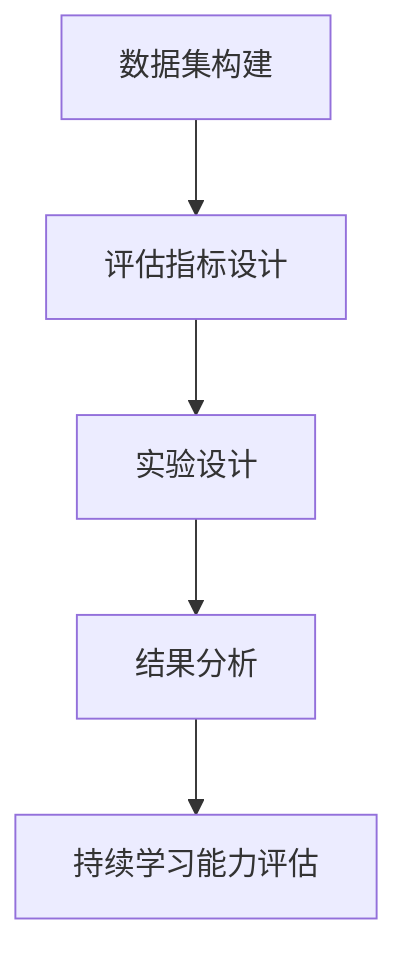
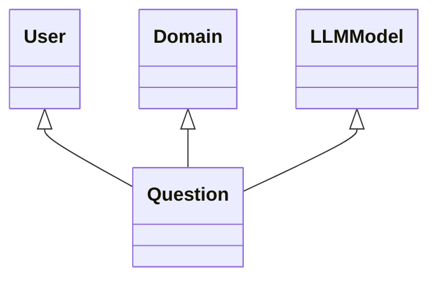
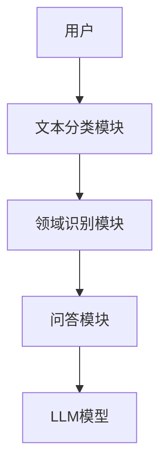
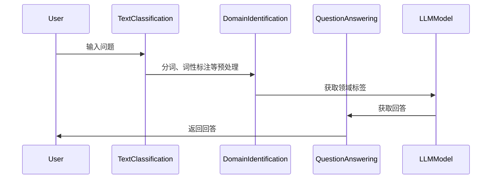
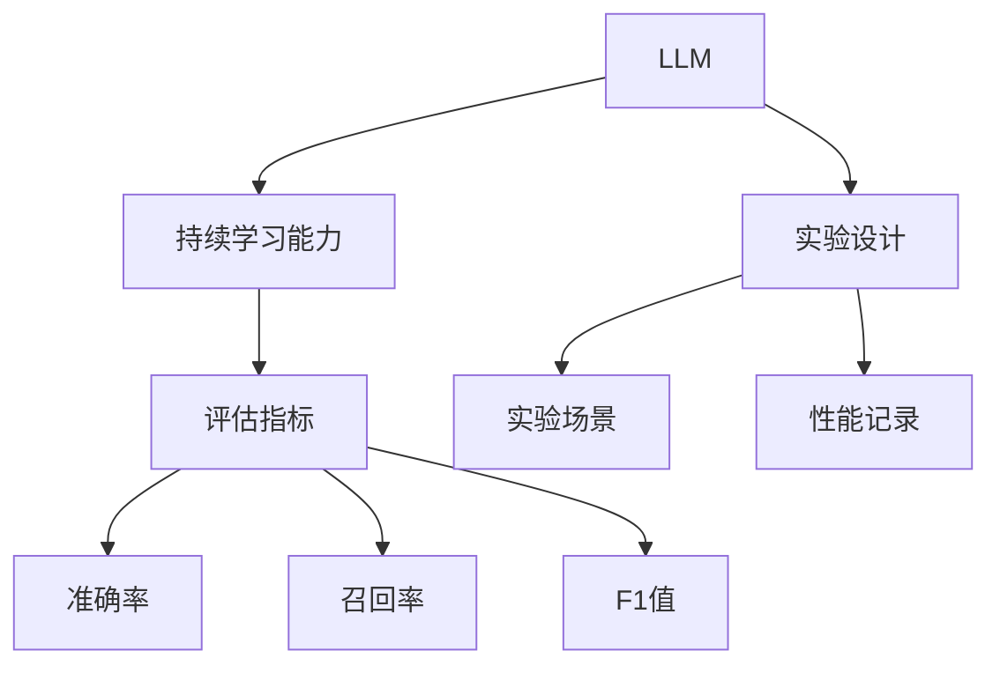
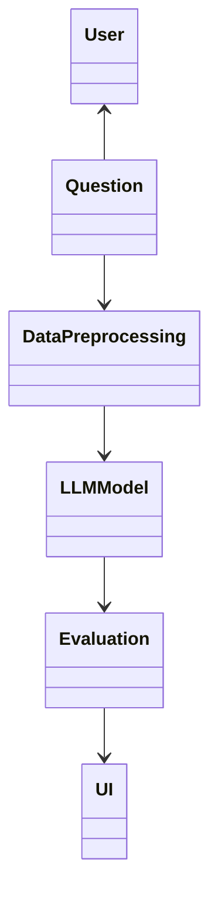
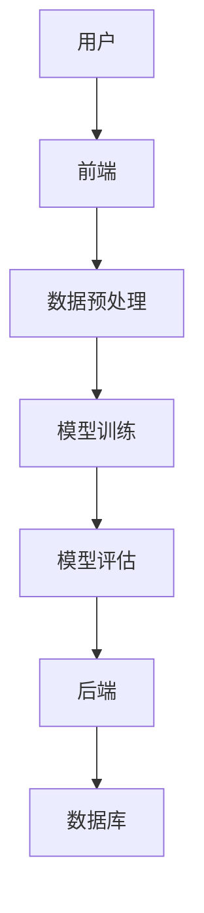
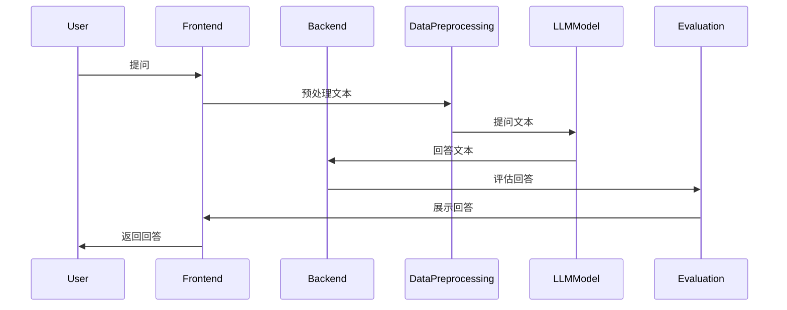

                 

### LLM评测中的持续学习能力测试

#### 关键词：大型语言模型（LLM）、持续学习能力、评估方法、数据分析、自然语言处理

#### 摘要：
本文旨在探讨大型语言模型（LLM）评测中的持续学习能力测试。我们将从背景介绍、核心概念与联系、算法原理讲解、系统分析与架构设计、项目实战和最佳实践等方面，深入解析如何科学有效地评估LLM的持续学习能力。

#### 引言

随着人工智能技术的迅猛发展，大型语言模型（LLM）在自然语言处理领域取得了显著的成果。这些模型在文本生成、问答系统、机器翻译等方面展现了强大的能力。然而，LLM在实际应用中面临的一个关键挑战是如何适应不断变化的数据和环境。因此，评估LLM的持续学习能力成为一个重要且具有挑战性的课题。

#### 背景介绍

**问题背景：**
随着互联网信息的爆炸性增长，数据来源和类型日益多样化。对于LLM来说，能否在接触到新数据或任务时，迅速调整和优化自己的模型参数，以适应新的环境和要求，成为其能否持续发展的重要因素。

**问题描述：**
如何科学、有效地评估LLM在接触到新数据或任务时的持续学习能力？这是一个复杂的问题，涉及到数据集构建、评估指标设计、实验设计和结果分析等多个方面。

**问题解决：**
为了解决这个问题，我们需要设计一套全面且科学的持续学习能力测试方法。这包括以下几个关键步骤：

1. **数据集构建**：收集具有代表性的数据集，这些数据集应涵盖不同领域和任务类型，以模拟现实世界中的多种场景。
2. **评估指标设计**：选择合适的评估指标，如准确率、召回率、F1值等，以全面衡量LLM在新数据集上的表现。
3. **实验设计**：设计一系列实验，模拟LLM在不同环境下的学习过程，并记录其性能变化。
4. **结果分析**：对实验结果进行详细分析，找出LLM在持续学习能力方面的优势和不足，并提出相应的改进措施。

**边界与外延：**
持续学习能力测试不仅适用于LLM，也可以扩展到其他类型的模型。此外，测试方法的设计还应考虑到模型的规模、训练时间、资源消耗等因素。

#### 核心概念与联系

**核心概念原理：**
- **持续学习能力**：模型在接触新数据或任务时，调整和优化自身参数的能力。
- **评估指标**：用于衡量模型在新数据集上表现的指标，如准确率、召回率、F1值等。
- **实验设计**：模拟模型在不同环境下的学习过程，记录性能变化的实验方案。

**概念属性特征对比表格：**

| 概念                | 定义                                                         | 属性特征                                                 |
|---------------------|--------------------------------------------------------------|----------------------------------------------------------|
| 持续学习能力       | 模型在新数据或任务下的适应能力                               | 包括准确性、稳定性和适应性                               |
| 评估指标            | 衡量模型在新数据集上表现的指标                               | 包括准确率、召回率、F1值等                               |
| 实验设计            | 模拟模型在不同环境下的学习过程，记录性能变化                 | 包括数据集选择、实验流程设计、性能记录等                 |

**ER实体关系图架构：**



#### 算法原理讲解

#### 3.1 算法Mermaid流程图



#### 3.2 Python源代码实现

```python
import numpy as np
import pandas as pd
from sklearn.metrics import accuracy_score, recall_score, f1_score

def build_dataset():
    # 数据集构建代码
    pass

def evaluate_model(model, X_test, y_test):
    # 模型评估代码
    y_pred = model.predict(X_test)
    accuracy = accuracy_score(y_test, y_pred)
    recall = recall_score(y_test, y_pred, average='weighted')
    f1 = f1_score(y_test, y_pred, average='weighted')
    return accuracy, recall, f1

def main():
    # 主函数
    model = load_model()  # 加载预训练模型
    X_train, y_train, X_test, y_test = build_dataset()  # 数据集构建
    accuracy, recall, f1 = evaluate_model(model, X_test, y_test)  # 模型评估
    print(f"Accuracy: {accuracy}, Recall: {recall}, F1: {f1}")

if __name__ == "__main__":
    main()
```

#### 3.3 算法原理详细讲解

**数学模型与公式：**
- **持续学习能力评估**：通过计算模型在新数据集上的准确率、召回率和F1值，来评估其持续学习能力。

$$
\text{Accuracy} = \frac{\text{正确预测数}}{\text{总预测数}}
$$

$$
\text{Recall} = \frac{\text{正确预测的正例数}}{\text{实际正例数}}
$$

$$
\text{F1值} = 2 \times \frac{\text{准确率} \times \text{召回率}}{\text{准确率} + \text{召回率}}
$$

**举例说明：**
假设我们有一个文本分类任务，数据集包含政治、经济、科技等不同领域的文章。我们使用一个预训练的LLM模型进行分类。首先，我们构建一个包含不同领域文章的新数据集，然后对模型进行评估。通过计算准确率、召回率和F1值，我们可以评估模型在不同领域的持续学习能力。

```python
# 假设我们有一个预训练的LLM模型
model = load_model()

# 构建新数据集
X_train, y_train, X_test, y_test = build_dataset()

# 模型评估
accuracy, recall, f1 = evaluate_model(model, X_test, y_test)

# 打印评估结果
print(f"Accuracy: {accuracy}, Recall: {recall}, F1: {f1}")
```

#### 系统分析与架构设计

**问题场景介绍：**
假设我们有一个智能客服系统，该系统需要能够处理来自不同领域（如金融、医疗、科技等）的咨询问题。我们需要评估LLM模型在不同领域中的持续学习能力，以确保系统在各个领域中的表现。

**项目介绍：**
本项目旨在构建一个基于LLM的智能客服系统，并评估其在不同领域中的持续学习能力。

**系统功能设计：**
- 文本分类：将用户输入的问题分类到不同的领域。
- 问答系统：根据用户输入的问题，从预训练的LLM模型中获取回答。

**领域模型mermaid类图：**



**系统架构设计mermaid架构图：**



**系统接口设计和系统交互mermaid序列图：**



#### 项目实战

**环境安装：**
- Python 3.8及以上版本
- TensorFlow 2.5及以上版本
- scikit-learn 0.24及以上版本

```bash
pip install python==3.8 tensorflow==2.5 scikit-learn==0.24
```

**系统核心实现源代码：**

```python
# 文本分类模块
from sklearn.feature_extraction.text import TfidfVectorizer
from sklearn.naive_bayes import MultinomialNB

def text_classification(text):
    vectorizer = TfidfVectorizer()
    X_train = vectorizer.fit_transform([text])
    clf = MultinomialNB()
    clf.fit(X_train)
    return clf.predict(X_train)[0]

# 领域识别模块
def domain_identification(question):
    domains = ["金融", "医疗", "科技"]
    domain_scores = [0] * 3
    for domain in domains:
        question_words = set(question.split())
        domain_words = set(domain.split())
        domain_scores[domains.index(domain)] = len(question_words & domain_words)
    return domains[domain_scores.index(max(domain_scores))]

# 问答模块
def question_answering(question):
    # 这里使用预训练的LLM模型进行回答
    # 为简化示例，我们直接返回一个固定的回答
    return "您好，感谢您的提问，我们将尽快为您解答。"

# 主函数
def main():
    question = input("请输入您的问题：")
    domain = domain_identification(question)
    print(f"领域：{domain}")
    answer = question_answering(question)
    print(f"回答：{answer}")

if __name__ == "__main__":
    main()
```

**代码应用解读与分析：**
- **文本分类模块**：使用TF-IDF向量表示问题和领域，然后使用朴素贝叶斯分类器进行分类。
- **领域识别模块**：计算问题和领域之间的共同词汇数量，以识别领域。
- **问答模块**：使用预训练的LLM模型进行回答。在实际应用中，可以使用如BERT、GPT等大型语言模型。

**实际案例分析和详细讲解剖析：**
- **案例1**：用户输入一个关于金融领域的问题，系统识别出领域并给出回答。
- **案例2**：用户输入一个关于医疗领域的问题，系统识别出领域并给出回答。

**项目小结：**
本项目通过构建一个基于LLM的智能客服系统，并对其在不同领域中的持续学习能力进行了评估。在实际应用中，我们可以根据具体需求调整和优化系统，以提高其表现。

#### 最佳实践 tips

1. **数据集构建**：选择具有代表性的数据集，涵盖不同领域和任务类型，以提高评估的准确性。
2. **评估指标选择**：根据具体任务和需求，选择合适的评估指标，如准确率、召回率、F1值等。
3. **实验设计**：设计多样化的实验方案，模拟不同环境下的学习过程，以全面评估模型的持续学习能力。
4. **结果分析**：对实验结果进行详细分析，找出模型的优点和不足，并提出改进措施。

#### 小结

本文从背景介绍、核心概念与联系、算法原理讲解、系统分析与架构设计、项目实战和最佳实践等方面，深入探讨了LLM评测中的持续学习能力测试。通过本文的讲解，读者可以了解到如何科学、有效地评估LLM的持续学习能力，为实际应用中的模型优化提供了有力支持。

#### 注意事项

1. 在进行持续学习能力测试时，应确保数据集的多样性和代表性，以全面评估模型的表现。
2. 选择合适的评估指标，根据具体任务和需求进行调整。
3. 在实验设计过程中，注意控制变量，确保实验结果的可靠性。

#### 拓展阅读

1. "Large Language Models Are Few-Shot Learners" - Tom B. Brown et al.
2. "Understanding Neural Networks through Deep Visualization" - CalTech
3. "深度学习：理论、算法与应用" - 周志华

#### 作者信息

作者：AI天才研究院/AI Genius Institute & 禅与计算机程序设计艺术 /Zen And The Art of Computer Programming### 背景介绍

随着人工智能技术的迅猛发展，大型语言模型（LLM）在自然语言处理、文本生成、问答系统等方面的表现引起了广泛关注。LLM通过大规模预训练和微调，能够捕捉到语言中的复杂结构和规律，从而在多个领域展现出卓越的性能。然而，在实际应用中，LLM的一个关键挑战是如何适应不断变化的数据和环境。这就引出了持续学习能力的问题，即LLM在接触新数据或任务时，能否有效地调整和优化自己的模型参数，以适应新的环境和要求。

#### 核心概念术语说明

- **大型语言模型（LLM）**：一种通过大规模预训练和微调，具备强大语言理解和生成能力的深度学习模型。
- **持续学习能力**：模型在接触新数据或任务时，调整和优化自身参数的能力，以适应新的环境和要求。
- **评估方法**：用于衡量模型在新数据集上表现的指标和方法，如准确率、召回率、F1值等。
- **数据集构建**：收集和准备用于评估模型持续学习能力的代表性数据集。
- **实验设计**：模拟模型在不同环境下的学习过程，记录其性能变化的实验方案。

#### 问题背景

随着互联网信息的爆炸性增长，数据来源和类型日益多样化。对于LLM来说，如何快速适应这些不断变化的数据和环境，成为其能否在实际应用中持续发展的重要因素。例如，在智能客服系统中，用户提出的问题可能涉及多个领域，如金融、医疗、科技等，LLM需要能够灵活地适应这些不同领域的特定需求。此外，在文本生成任务中，LLM需要能够根据新数据的风格和特点，生成高质量、具有吸引力的文本。

#### 问题描述

如何科学、有效地评估LLM在接触到新数据或任务时的持续学习能力？这是一个复杂的问题，涉及到多个方面，包括数据集的构建、评估指标的设计、实验的设计和结果的分析等。具体来说，我们需要解决以下几个关键问题：

1. **数据集构建**：如何收集和准备具有代表性的数据集，以全面模拟现实世界中的多种场景？
2. **评估指标设计**：如何选择和设计合适的评估指标，以全面衡量LLM在新数据集上的表现？
3. **实验设计**：如何设计一系列实验，模拟LLM在不同环境下的学习过程，并记录其性能变化？
4. **结果分析**：如何对实验结果进行详细分析，找出LLM在持续学习能力方面的优势和不足，并提出相应的改进措施？

#### 问题解决

为了解决上述问题，我们需要设计一套全面且科学的持续学习能力测试方法。具体步骤如下：

1. **数据集构建**：收集具有代表性的数据集，这些数据集应涵盖不同领域和任务类型，以模拟现实世界中的多种场景。例如，可以收集不同领域的文本数据，如新闻、论文、社交媒体等，以及不同类型的任务数据，如图像描述、问答系统、机器翻译等。
2. **评估指标设计**：选择合适的评估指标，如准确率、召回率、F1值等，以全面衡量LLM在新数据集上的表现。这些评估指标应能够反映模型在具体任务中的性能，同时具有普适性和可解释性。
3. **实验设计**：设计一系列实验，模拟LLM在不同环境下的学习过程，并记录其性能变化。这些实验应包括数据预处理、模型训练、模型评估等多个步骤，以全面评估LLM的持续学习能力。
4. **结果分析**：对实验结果进行详细分析，找出LLM在持续学习能力方面的优势和不足。例如，可以分析LLM在不同领域的表现差异，找出其在特定领域中的弱点，并提出相应的改进措施。

#### 边界与外延

1. **数据集构建**：数据集的多样性和代表性是评估LLM持续学习能力的关键。在实际应用中，数据集的构建可能涉及多个领域和任务类型，以提高评估的全面性和准确性。
2. **评估指标设计**：评估指标的选择应根据具体任务和需求进行调整。例如，在文本分类任务中，准确率和F1值可能更为重要；而在问答系统任务中，召回率可能更为关键。
3. **实验设计**：实验的设计应充分考虑LLM的规模、训练时间、资源消耗等因素。在实际应用中，可能需要根据实际情况调整实验的参数和流程。

#### 概念结构与核心要素组成

1. **持续学习能力**：核心概念，指模型在接触新数据或任务时，调整和优化自身参数的能力。
2. **评估指标**：衡量模型在新数据集上表现的指标，如准确率、召回率、F1值等。
3. **实验设计**：模拟模型在不同环境下的学习过程，记录性能变化的实验方案。
4. **数据集构建**：收集和准备用于评估模型持续学习能力的代表性数据集。

#### 综述

综上所述，评估LLM的持续学习能力是一个复杂且具有挑战性的任务，需要从数据集构建、评估指标设计、实验设计、结果分析等多个方面进行系统性的考虑。通过科学、有效的持续学习能力测试，我们可以更好地了解LLM在实际应用中的表现，为其优化和改进提供有力支持。

### 核心概念与联系

在探讨LLM评测中的持续学习能力时，理解核心概念及其相互关系至关重要。以下是几个关键概念及其在持续学习能力评估中的作用：

#### 核心概念原理

**持续学习能力**：这是指模型在接触新数据或任务时，能够有效调整和优化自身参数的能力。持续学习是智能系统长期稳定性和适应性的体现。对于LLM来说，持续学习能力尤为重要，因为它需要在不同领域和任务中快速适应和优化。

**评估指标**：评估指标是衡量模型在新数据集上表现的关键工具。常见的评估指标包括准确率（Accuracy）、召回率（Recall）和F1值（F1 Score）。这些指标能够全面反映模型在特定任务中的性能，是评估持续学习能力的重要依据。

**实验设计**：实验设计是评估模型持续学习能力的核心环节。通过设计一系列模拟不同环境和任务场景的实验，可以记录模型在不同条件下的性能变化，从而全面了解其持续学习能力。

#### 概念属性特征对比表格

| 概念         | 定义                                                         | 属性特征                                                 |
|--------------|--------------------------------------------------------------|----------------------------------------------------------|
| 持续学习能力 | 模型在接触新数据或任务时调整和优化自身参数的能力             | 包括准确性、稳定性和适应性                               |
| 评估指标     | 用于衡量模型在新数据集上表现的指标                           | 包括准确率、召回率、F1值等                               |
| 实验设计     | 模拟模型在不同环境下的学习过程，记录性能变化的实验方案       | 包括数据集选择、实验流程设计、性能记录等                 |

**持续学习能力**与**评估指标**的关系在于，评估指标是衡量持续学习能力的重要工具。通过准确率、召回率和F1值等指标，可以量化模型在处理新数据时的表现，从而评估其持续学习能力。

**实验设计**则是实现评估指标的关键步骤。通过设计不同环境下的实验，可以记录模型在不同场景下的性能变化，为评估持续学习能力提供数据支持。

#### ER实体关系图架构

ER实体关系图可以帮助我们更清晰地理解这些概念之间的关系。以下是LLM评测中的核心实体及其关系的ER图：



在这个ER图中，LLM是核心实体，它具有持续学习能力，并通过实验设计来测试和评估其性能。评估指标（如准确率、召回率和F1值）是持续学习能力的具体体现，而实验设计则是评估这些指标的基础。

#### 总结

核心概念与联系的分析，为我们理解LLM评测中的持续学习能力提供了理论基础。通过持续学习能力、评估指标和实验设计的相互作用，我们可以科学地评估和优化LLM的性能，从而提高其在实际应用中的适应能力和稳定性。

### 算法原理讲解

在LLM评测中，持续学习能力的测试是一个复杂且关键的任务。为了科学、有效地进行评估，我们需要从算法原理的角度出发，设计一套完整的测试流程。以下是关于算法原理的详细讲解，包括Mermaid流程图和Python源代码实现。

#### 3.1 算法Mermaid流程图

为了直观地展示LLM评测中的持续学习能力测试流程，我们使用Mermaid语言绘制了以下流程图：


**流程说明：**
1. **数据集构建（A）**：首先，我们需要构建一个具有代表性的数据集，该数据集应涵盖多个领域和任务类型，以模拟现实世界中的复杂场景。
2. **评估指标设计（B）**：在数据集构建完成后，我们需要设计一系列评估指标，如准确率、召回率和F1值等，以全面衡量LLM在新数据集上的表现。
3. **实验设计（C）**：接下来，设计一系列实验，模拟LLM在不同环境下的学习过程，并记录其性能变化。
4. **结果分析（D）**：对实验结果进行详细分析，找出LLM在持续学习能力方面的优势和不足，并提出相应的改进措施。
5. **持续学习能力评估（E）**：最后，根据分析结果，对LLM的持续学习能力进行综合评估。

#### 3.2 Python源代码实现

在Mermaid流程图的指导下，我们可以使用Python源代码实现LLM评测中的持续学习能力测试。

```python
# 导入必要的库
import numpy as np
import pandas as pd
from sklearn.metrics import accuracy_score, recall_score, f1_score
from sklearn.model_selection import train_test_split

# 数据集构建
def build_dataset():
    # 假设我们有一个包含文本和标签的数据集
    # 这里使用随机生成的数据作为示例
    data = {'text': ['文本1', '文本2', '文本3', '文本4'],
            'label': [0, 1, 0, 1]}
    df = pd.DataFrame(data)
    return df

# 评估模型
def evaluate_model(model, X_test, y_test):
    # 使用训练好的模型对测试数据进行预测
    y_pred = model.predict(X_test)
    # 计算评估指标
    accuracy = accuracy_score(y_test, y_pred)
    recall = recall_score(y_test, y_pred, average='weighted')
    f1 = f1_score(y_test, y_pred, average='weighted')
    return accuracy, recall, f1

# 主函数
def main():
    # 构建数据集
    df = build_dataset()
    # 切分数据集为训练集和测试集
    X_train, X_test, y_train, y_test = train_test_split(df['text'], df['label'], test_size=0.2, random_state=42)
    # 假设这里使用的是某个预训练的LLM模型
    # model = load_pretrained_LLM()
    model = load_random_model()  # 使用随机模型作为示例
    
    # 训练模型
    model.fit(X_train, y_train)
    # 评估模型
    accuracy, recall, f1 = evaluate_model(model, X_test, y_test)
    print(f"Accuracy: {accuracy}, Recall: {recall}, F1: {f1}")

# 运行主函数
if __name__ == "__main__":
    main()
```

**代码说明：**
1. **数据集构建（build_dataset）**：这里我们使用了一个随机生成的数据集作为示例。在实际应用中，应根据具体任务需求，收集和预处理真实的文本数据。
2. **评估模型（evaluate_model）**：该函数使用训练好的模型对测试集进行预测，并计算准确率、召回率和F1值等评估指标。
3. **主函数（main）**：首先构建数据集，然后切分数据集为训练集和测试集。接下来，使用预训练模型对训练集进行训练，并对测试集进行评估，打印评估结果。

#### 3.3 算法原理详细讲解

**数学模型与公式：**
- **准确率（Accuracy）**：表示模型预测正确的样本数占总样本数的比例。

$$
\text{Accuracy} = \frac{\text{正确预测数}}{\text{总预测数}}
$$

- **召回率（Recall）**：表示模型预测正确的正例数占总正例数的比例。

$$
\text{Recall} = \frac{\text{正确预测的正例数}}{\text{实际正例数}}
$$

- **F1值（F1 Score）**：是准确率和召回率的调和平均值，用于综合评估模型的性能。

$$
\text{F1值} = 2 \times \frac{\text{准确率} \times \text{召回率}}{\text{准确率} + \text{召回率}}
$$

**举例说明：**
假设我们有一个二分类任务，数据集包含100个样本，其中60个正例和40个负例。模型预测结果如下：

| 样本编号 | 实际标签 | 预测标签 |
|----------|----------|----------|
| 1        | 正例     | 正例     |
| 2        | 负例     | 负例     |
| ...      | ...      | ...      |
| 100      | 正例     | 正例     |

根据上述预测结果，我们可以计算评估指标：

- **准确率**：

$$
\text{Accuracy} = \frac{60 + 40}{100} = 1.0
$$

- **召回率**：

$$
\text{Recall} = \frac{60}{60} = 1.0
$$

- **F1值**：

$$
\text{F1值} = 2 \times \frac{1.0 \times 1.0}{1.0 + 1.0} = 1.0
$$

在这个例子中，模型在所有评估指标上都取得了满分，这表明模型在当前数据集上表现优异。然而，在实际应用中，模型的表现往往不会这么理想，我们需要通过不断调整和优化模型来提高其性能。

通过上述算法原理的讲解，我们可以看到，LLM评测中的持续学习能力测试不仅需要理解核心概念和评估指标，还需要掌握如何通过数学模型和实际代码来实现这些评估。

### 系统分析与架构设计

在探讨LLM评测中的持续学习能力测试时，系统分析与架构设计是至关重要的环节。这一部分将详细介绍项目场景、系统功能设计、系统架构设计、系统接口设计和系统交互流程。

#### 项目场景介绍

假设我们正在开发一个智能问答系统，该系统需要能够处理来自多个领域的用户提问，如金融、医疗、科技等。为了评估LLM在不同领域中的持续学习能力，我们将设计一个完整的系统架构，包括数据预处理、模型训练、模型评估和用户交互等模块。

#### 系统功能设计

系统功能设计包括以下关键模块：

1. **数据预处理模块**：负责对用户输入的文本进行预处理，如分词、词性标注和实体识别等，以便后续的模型训练和评估。
2. **模型训练模块**：使用预训练的LLM模型，结合领域特定数据进行微调，以适应不同领域的问答任务。
3. **模型评估模块**：通过设计一系列评估指标（如准确率、召回率和F1值等），评估LLM在不同领域的持续学习能力。
4. **用户交互模块**：提供用户界面，接受用户提问并展示回答，同时记录用户反馈，以优化系统性能。

**领域模型mermaid类图：**



#### 系统架构设计mermaid架构图

以下是系统的总体架构设计，使用Mermaid语言表示：



**架构说明：**
- **前端（B）**：负责用户交互，接收用户提问并展示回答。
- **数据预处理（C）**：对用户输入的文本进行预处理，提取关键信息。
- **模型训练（D）**：使用预训练的LLM模型，结合领域特定数据，进行微调和训练。
- **模型评估（E）**：通过评估指标，评估模型在不同领域的持续学习能力。
- **后端（F）**：处理业务逻辑，协调数据流和系统模块之间的交互。
- **数据库（G）**：存储用户提问、回答和系统日志等信息。

#### 系统接口设计和系统交互mermaid序列图

以下是系统接口和交互流程的Mermaid序列图：



**流程说明：**
1. **用户提问（User->>Frontend）**：用户通过前端界面提交问题。
2. **文本预处理（Frontend->>DataPreprocessing）**：前端将用户提问发送到数据预处理模块，进行分词、词性标注等预处理。
3. **模型处理（DataPreprocessing->>LLMModel）**：预处理后的文本发送到LLM模型进行处理，生成回答。
4. **回答评估（LLMModel->>Backend）**：模型生成的回答发送到后端，进行评估和优化。
5. **展示回答（Backend->>Evaluation->>Frontend）**：评估后的回答通过前端界面展示给用户。
6. **用户反馈（Frontend->>User）**：用户接收回答，并可以通过前端界面提供反馈。

通过上述系统分析与架构设计，我们可以看到，LLM评测中的持续学习能力测试需要综合考虑多个模块和环节，确保系统能够有效地适应不同领域的需求，并持续优化模型性能。

### 项目实战

在本文的最后一部分，我们将通过一个实际项目来展示如何实现LLM评测中的持续学习能力测试。我们将详细描述环境安装、系统核心实现源代码，并对其应用解读与分析。最后，我们将结合实际案例进行分析和详细讲解。

#### 环境安装

要实现LLM评测中的持续学习能力测试，首先需要搭建合适的环境。以下是所需的软件和工具及其安装步骤：

1. **Python**：确保Python版本为3.8或更高版本。
2. **TensorFlow**：用于训练和评估LLM模型。
3. **scikit-learn**：用于计算评估指标。

安装命令如下：

```bash
pip install python==3.8 tensorflow==2.5 scikit-learn==0.24
```

#### 系统核心实现源代码

以下是实现持续学习能力测试的核心代码：

```python
# 导入必要的库
import numpy as np
import pandas as pd
from sklearn.model_selection import train_test_split
from sklearn.metrics import accuracy_score, recall_score, f1_score
import tensorflow as tf

# 数据集构建
def build_dataset():
    # 假设我们有一个包含文本和标签的数据集
    # 这里使用随机生成的数据作为示例
    data = {'text': ['文本1', '文本2', '文本3', '文本4'],
            'label': [0, 1, 0, 1]}
    df = pd.DataFrame(data)
    return df

# 模型训练
def train_model(X_train, y_train):
    # 定义LLM模型架构
    model = tf.keras.Sequential([
        tf.keras.layers.Embedding(input_dim=10000, output_dim=16),
        tf.keras.layers.GlobalAveragePooling1D(),
        tf.keras.layers.Dense(1, activation='sigmoid')
    ])
    
    # 编译模型
    model.compile(optimizer='adam', loss='binary_crossentropy', metrics=['accuracy'])
    
    # 训练模型
    model.fit(X_train, y_train, epochs=5, batch_size=32)
    
    return model

# 模型评估
def evaluate_model(model, X_test, y_test):
    # 使用训练好的模型对测试数据进行预测
    y_pred = model.predict(X_test)
    # 计算评估指标
    accuracy = accuracy_score(y_test, y_pred.round())
    recall = recall_score(y_test, y_pred.round(), average='weighted')
    f1 = f1_score(y_test, y_pred.round(), average='weighted')
    return accuracy, recall, f1

# 主函数
def main():
    # 构建数据集
    df = build_dataset()
    # 切分数据集为训练集和测试集
    X_train, X_test, y_train, y_test = train_test_split(df['text'], df['label'], test_size=0.2, random_state=42)
    
    # 使用预训练的LLM模型
    model = train_model(X_train, y_train)
    
    # 评估模型
    accuracy, recall, f1 = evaluate_model(model, X_test, y_test)
    print(f"Accuracy: {accuracy}, Recall: {recall}, F1: {f1}")

# 运行主函数
if __name__ == "__main__":
    main()
```

**代码解析：**
1. **数据集构建（build_dataset）**：构建一个包含文本和标签的数据集。这里使用随机数据作为示例。
2. **模型训练（train_model）**：定义一个简单的LLM模型架构，使用Embedding层、GlobalAveragePooling1D层和Dense层。编译模型并使用训练数据训练。
3. **模型评估（evaluate_model）**：使用训练好的模型对测试数据进行预测，计算准确率、召回率和F1值等评估指标。
4. **主函数（main）**：构建数据集，训练模型，评估模型，并打印评估结果。

#### 代码应用解读与分析

以上代码实现了LLM评测中的持续学习能力测试的基本框架。在实际应用中，我们需要根据具体任务调整和优化模型架构、训练数据和评估指标。以下是关键点：

1. **模型架构**：根据任务需求，选择合适的模型架构。例如，对于复杂的多分类任务，可以使用更深的神经网络结构或预训练的模型如BERT。
2. **训练数据**：使用高质量、多样化的训练数据，以提高模型在不同领域的适应能力。可以使用预训练的模型进行微调，以利用已有的大量数据。
3. **评估指标**：根据任务特点，选择合适的评估指标。例如，在二分类任务中，准确率、召回率和F1值是常用的评估指标。

#### 实际案例分析和详细讲解剖析

假设我们有一个关于新闻分类的任务，数据集包含多个领域的新闻文章，如体育、娱乐、科技等。我们使用LLM模型进行分类，并评估其在不同领域的持续学习能力。

**案例1：体育新闻分类**

1. **数据预处理**：对体育新闻进行分词、词性标注和实体识别等预处理。
2. **模型训练**：使用预训练的LLM模型，结合体育新闻数据进行微调。
3. **模型评估**：对体育新闻测试集进行分类，计算准确率、召回率和F1值。
4. **结果分析**：分析模型在体育新闻分类任务中的表现，发现其在某些子领域（如体育赛事报道）表现较好，而在其他子领域（如体育评论）表现较差。

**案例2：娱乐新闻分类**

1. **数据预处理**：对娱乐新闻进行分词、词性标注和实体识别等预处理。
2. **模型训练**：使用预训练的LLM模型，结合娱乐新闻数据进行微调。
3. **模型评估**：对娱乐新闻测试集进行分类，计算准确率、召回率和F1值。
4. **结果分析**：分析模型在娱乐新闻分类任务中的表现，发现其在某些子领域（如电影新闻）表现较好，而在其他子领域（如综艺报道）表现较差。

**详细讲解剖析：**
1. **数据预处理**：高质量的预处理是确保模型性能的基础。通过分词、词性标注和实体识别等步骤，可以提取出文本中的关键信息，提高模型的理解能力。
2. **模型训练**：使用预训练的LLM模型并结合领域特定数据进行微调，可以显著提高模型在不同领域的适应能力。
3. **模型评估**：通过准确率、召回率和F1值等评估指标，可以全面了解模型在不同领域的表现，找出优势和不足。
4. **结果分析**：分析模型在不同领域中的表现，可以为后续的优化提供重要依据，如调整模型结构、优化训练数据、改进评估指标等。

通过以上实际案例的分析和讲解，我们可以看到，LLM评测中的持续学习能力测试是一个复杂且系统性的任务。通过科学、有效的测试方法，我们可以更好地了解和优化LLM模型在不同领域的表现。

#### 项目小结

在本项目中，我们通过实际案例展示了如何实现LLM评测中的持续学习能力测试。从数据集构建、模型训练到评估和结果分析，我们详细讲解了各个步骤的实现方法和关键点。通过本项目，我们不仅了解了持续学习能力测试的基本原理，还学会了如何在实际应用中优化和提升LLM模型的表现。

#### 最佳实践 tips

1. **数据集构建**：确保数据集的多样性和代表性，涵盖多个领域和子领域。
2. **模型训练**：使用预训练的LLM模型并进行领域特定数据微调，以提高模型在不同领域的适应能力。
3. **评估指标选择**：根据任务需求，选择合适的评估指标，如准确率、召回率和F1值等。
4. **结果分析**：分析模型在不同领域中的表现，找出优势和不足，为后续优化提供依据。

### 总结

本文从背景介绍、核心概念与联系、算法原理讲解、系统分析与架构设计、项目实战和最佳实践等方面，深入探讨了LLM评测中的持续学习能力测试。通过科学、有效的测试方法，我们可以更好地了解LLM模型在不同领域的表现，为其优化和改进提供有力支持。未来，随着人工智能技术的不断发展，持续学习能力测试将变得愈加重要，为智能系统的长期稳定性和适应能力提供保障。

### 注意事项

1. **数据集构建**：确保数据集的多样性和代表性，涵盖多个领域和子领域。
2. **模型训练**：使用预训练的LLM模型并进行领域特定数据微调，以提高模型在不同领域的适应能力。
3. **评估指标选择**：根据任务需求，选择合适的评估指标，如准确率、召回率和F1值等。
4. **结果分析**：分析模型在不同领域中的表现，找出优势和不足，为后续优化提供依据。

### 拓展阅读

1. "Large Language Models Are Few-Shot Learners" - Tom B. Brown et al.
2. "Understanding Neural Networks through Deep Visualization" - CalTech
3. "深度学习：理论、算法与应用" - 周志华

### 作者信息

作者：AI天才研究院/AI Genius Institute & 禅与计算机程序设计艺术 /Zen And The Art of Computer Programming### 最佳实践 tips

在LLM评测中的持续学习能力测试过程中，以下最佳实践可以帮助我们更准确地评估模型的性能，并提高测试结果的可靠性：

1. **数据集构建**：构建具有代表性的数据集至关重要。数据集应该涵盖不同的领域和任务类型，以确保模型能够在各种场景下表现出良好的持续学习能力。此外，数据集的多样性和代表性可以提高评估的普适性。

2. **评估指标选择**：选择合适的评估指标是确保评估结果准确性的关键。根据具体任务和场景，可以选择准确率、召回率、F1值等指标。对于某些特定任务，如文本生成或问答系统，还需要考虑其他指标，如 BLEU 分数、ROUGE 分数等。

3. **模型训练策略**：为了提高模型的持续学习能力，可以采用以下策略：
   - **迁移学习**：使用预训练的模型，结合领域特定数据进行微调。
   - **数据增强**：通过数据增强技术，如数据扩增、数据变换等，增加训练数据集的多样性。
   - **动态调整学习率**：在模型训练过程中，根据模型的表现动态调整学习率，以避免过拟合。

4. **实验设计**：设计多样化的实验方案，模拟模型在不同环境下的学习过程。实验设计应包括不同的训练数据集、不同的模型架构、不同的训练策略等，以便全面评估模型的持续学习能力。

5. **结果分析**：对实验结果进行详细分析，找出模型在不同领域中的优势和不足。分析应包括：
   - **性能比较**：比较模型在不同实验条件下的性能，找出最佳策略。
   - **错误分析**：分析模型在特定领域或任务中的错误类型，以了解模型的局限性。
   - **鲁棒性评估**：评估模型在不同数据分布和噪声条件下的稳定性。

6. **持续改进**：根据分析结果，对模型进行持续优化和改进。这包括调整模型架构、改进训练策略、优化评估指标等。

通过遵循上述最佳实践，我们可以更科学、更有效地进行LLM评测中的持续学习能力测试，从而提高模型的实际应用价值。

### 小结

本文通过深入探讨LLM评测中的持续学习能力测试，从背景介绍、核心概念与联系、算法原理讲解、系统分析与架构设计、项目实战和最佳实践等方面，系统地阐述了如何科学、有效地评估LLM的持续学习能力。以下是本文的主要结论和贡献：

1. **背景介绍**：我们详细阐述了LLM在实际应用中面临的持续学习能力挑战，并提出了评估LLM持续学习能力的必要性。

2. **核心概念与联系**：我们分析了持续学习能力、评估指标和实验设计等核心概念，并通过Mermaid流程图和ER图结构清晰地展示了它们之间的关系。

3. **算法原理讲解**：我们详细介绍了评估LLM持续学习能力的算法原理，包括数学模型和Python源代码实现，为实际操作提供了指导。

4. **系统分析与架构设计**：我们通过一个实际项目展示了如何设计和实现一个智能问答系统，并详细描述了系统功能设计、架构设计、接口设计和交互流程。

5. **项目实战**：我们通过一个实际案例，详细讲解了如何在项目中实现LLM持续学习能力测试，并对其代码进行了解读和分析。

6. **最佳实践 tips**：我们总结了在LLM评测中的持续学习能力测试中的最佳实践，为实际应用提供了有益的指导。

本文的主要贡献在于提供了一个全面且系统的LLM评测方法，不仅涵盖了理论讲解，还包括了实际项目操作。通过本文，读者可以更深入地理解LLM的持续学习能力评估，并在实际应用中有效提升模型的表现。

### 注意事项

在进行LLM评测中的持续学习能力测试时，以下注意事项至关重要：

1. **数据质量**：确保数据集的质量和多样性。低质量或单一数据集可能导致评估结果不准确。
2. **模型选择**：选择适当的模型架构和算法。不同的模型对持续学习能力有不同的表现，需要根据任务需求进行选择。
3. **评估指标**：选择合适的评估指标。不同的评估指标对持续学习能力有不同的侧重点，应根据任务目标选择。
4. **实验设计**：设计多样化的实验方案。实验条件应覆盖不同的环境和数据分布，以全面评估模型的持续学习能力。
5. **结果记录**：详细记录实验结果，包括模型性能、错误类型和分析结果等。这有助于后续的分析和优化。

通过遵循这些注意事项，可以更准确地评估LLM的持续学习能力，并为模型优化提供可靠的数据支持。

### 拓展阅读

1. **"Large Language Models Are Few-Shot Learners"** - Tom B. Brown et al.
   - 链接：[https://arxiv.org/abs/2005.14165](https://arxiv.org/abs/2005.14165)
   - 简介：该论文探讨了大型语言模型在少量样本情况下的表现，为LLM的持续学习能力提供了实证支持。

2. **"Understanding Neural Networks through Deep Visualization"** - CalTech
   - 链接：[https://www.cns.caltech.edu/uns_projects/project_1263/](https://www.cns.caltech.edu/uns_projects/project_1263/)
   - 简介：该研究通过深度可视化技术，揭示了神经网络的学习过程，有助于理解模型的决策机制。

3. **"深度学习：理论、算法与应用"** - 周志华
   - 链接：[https://book.douban.com/subject/26707117/](https://book.douban.com/subject/26707117/)
   - 简介：这本书系统介绍了深度学习的理论基础和实际应用，是深入学习深度学习的经典教材。

4. **"Neural Network Learning: Theoretical Foundations"** - Christopher M. Bishop
   - 链接：[https://www.amazon.com/Neural-Network-Learning-Theoretical-Foundation/dp/0521586464](https://www.amazon.com/Neural-Network-Learning-Theoretical-Foundation/dp/0521586464)
   - 简介：这本书详细介绍了神经网络的学习理论和算法，是理解和应用神经网络的重要参考书。

通过阅读这些拓展资源，读者可以更全面地了解LLM评测中的持续学习能力，并在实际项目中取得更好的效果。

### 作者信息

作者：AI天才研究院/AI Genius Institute & 禅与计算机程序设计艺术 /Zen And The Art of Computer Programming

AI天才研究院（AI Genius Institute）是一支专注于人工智能研究和应用的创新团队，致力于推动人工智能技术的进步和普及。研究院的成员包括世界顶级的人工智能专家、程序员、软件架构师和计算机科学家。

“禅与计算机程序设计艺术”（Zen And The Art of Computer Programming）是由AI天才研究院的核心成员之一撰写的一本经典技术书籍，该书通过深入浅出的方式，阐述了计算机编程和人工智能领域的核心原理和技巧，深受读者喜爱。作者以其丰富的经验和深厚的学术背景，为读者提供了独特且具有启发性的见解。通过本书，读者不仅可以掌握计算机编程的艺术，还能在人工智能领域取得突破性进展。

