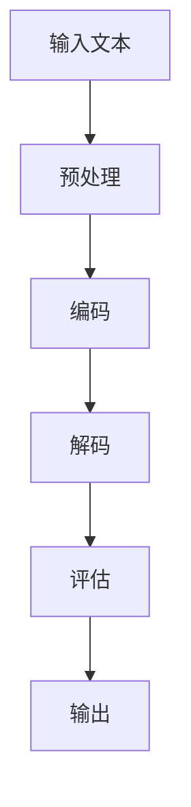
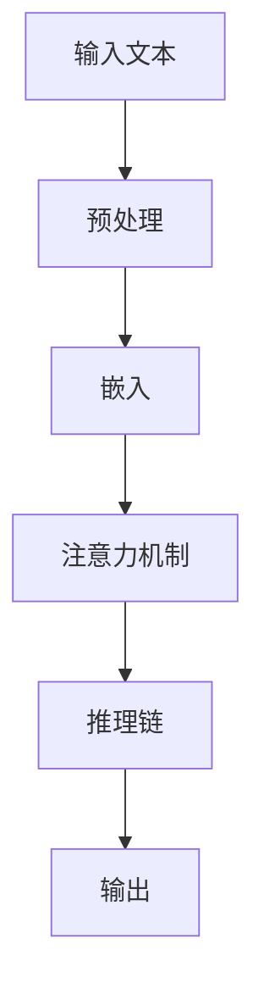
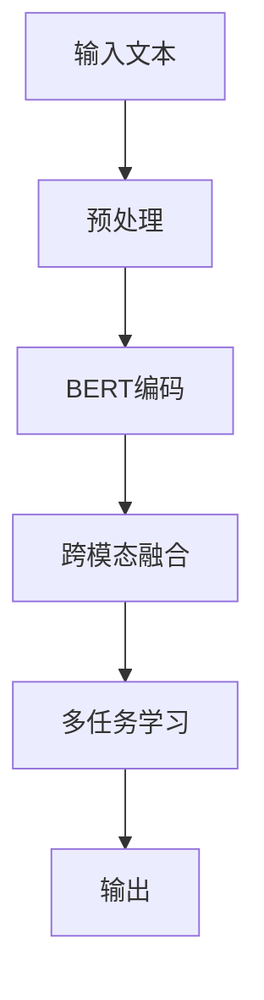
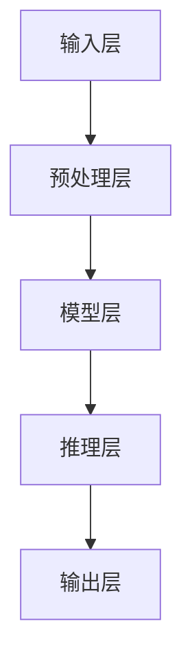
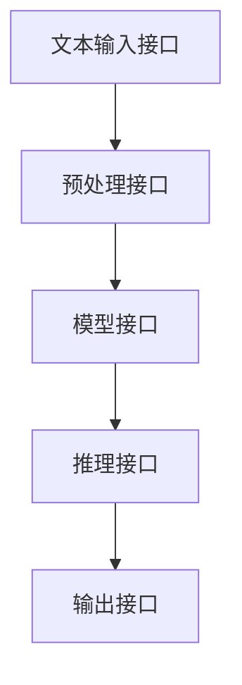
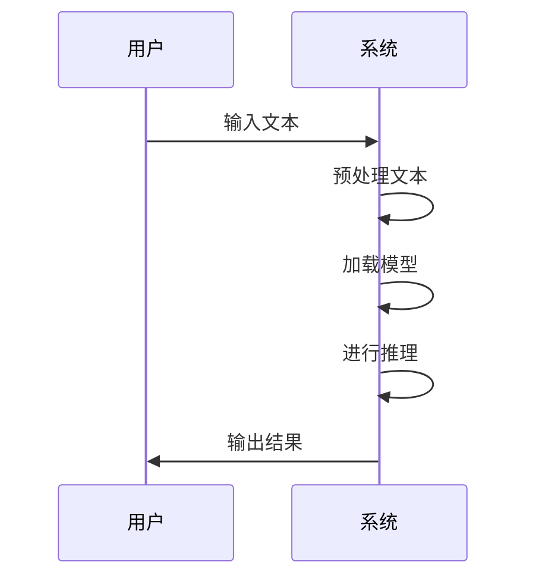

                 


### 第一部分：LLM概述与评测背景

#### 第1章：LLM的发展与应用

##### 1.1 LLM的兴起与发展历程

自2018年GPT-1发布以来，大型语言模型（LLM）在自然语言处理（NLP）领域取得了显著的进展。LLM的发展历程可以概括为以下几个阶段：

- **初级阶段**（20世纪90年代）：基于规则和统计方法的语言模型，如HMM（隐马尔可夫模型）和n-gram模型。
- **中级阶段**（2010年代）：引入深度学习，特别是RNN（递归神经网络）和LSTM（长短时记忆网络），提高了语言模型的表现。
- **高级阶段**（2018年至今）：Transformer架构的引入，特别是GPT-3、BERT等模型的涌现，标志着LLM进入了一个新的时代。

##### 1.2 LLM在自然语言处理中的应用

LLM在NLP领域有着广泛的应用，以下是其中几个重要的应用场景：

- **文本生成与编辑**：LLM可以生成文章、代码、音乐等，也可以对现有文本进行编辑和改进。
- **知识图谱与问答**：LLM可以理解自然语言查询，并从知识图谱中检索出相关信息，提供精准的答案。
- **语言理解与推理**：LLM可以理解复杂语境，进行逻辑推理，从而在问答、对话系统等领域发挥作用。

##### 1.3 LLM评测的重要性与挑战

LLM评测是确保模型性能的重要手段，其重要性体现在以下几个方面：

- **模型性能评估**：通过评测，可以量化模型在各个任务上的表现，为模型优化提供方向。
- **模型稳定性评估**：评测可以帮助发现模型在不同数据集上的表现差异，从而提高模型的稳定性。

然而，LLM评测也面临着一系列挑战：

- **数据多样性**：评测需要涵盖多种语言和多种应用场景，以保证评测的全面性。
- **模型偏见**：模型可能会在特定数据集或任务上表现不佳，这可能源于数据偏差或模型设计问题。
- **跨语言评测**：不同语言之间存在巨大的差异，这使得跨语言评测变得复杂。

### 第二部分：LLM核心概念与结构

#### 第2章：LLM核心概念与结构

##### 2.1 LLM基本概念

LLM的基本概念包括：

- **语言模型**：通过学习大量文本数据，对自然语言中的词汇和句子进行建模。
- **概率分布**：LLM通过对文本数据的学习，预测句子或词汇的概率分布。
- **注意力机制**：在处理序列数据时，LLM会关注序列中的关键信息，从而提高模型的性能。
- **编码器-解码器结构**：编码器将输入序列编码成固定长度的向量，解码器则将这些向量解码成输出序列。

##### 2.2 推理链的概念

推理链是指LLM在处理问题时，从输入到输出的推理过程。它可以分为以下几个层次：

- **基础推理**：LLM对输入文本进行基本的语法和语义分析。
- **逻辑推理**：LLM利用逻辑规则和常识对输入文本进行推理。
- **深度推理**：LLM在复杂的语境下，进行多层次的推理，从而获得更加准确的理解。

##### 2.3 思维过程的模型

人类的思维过程可以分为感知、记忆、推理和决策等阶段。LLM的思维方式则基于其内在的模型结构和算法。以下是LLM的思维方式：

- **感知**：LLM通过输入层接收自然语言文本。
- **记忆**：LLM利用嵌入层和注意力机制存储和检索相关信息。
- **推理**：LLM利用推理链对输入文本进行推理和分析。
- **决策**：LLM根据推理结果生成输出文本。

##### 2.4 核心概念对比与分析（表格）

以下是一个关于LLM核心概念的对比表格：

| 核心概念 | 描述 |
| --- | --- |
| 语言模型 | 对自然语言的建模和预测 |
| 概率分布 | 预测句子或词汇的概率分布 |
| 注意力机制 | 处理序列数据时的信息关注机制 |
| 编码器-解码器结构 | 用于处理序列数据的模型结构 |
| 推理链 | LLM的推理过程 |
| 思维过程模型 | LLM的思维方式 |

通过这个表格，我们可以清晰地看到LLM各个核心概念之间的关系和作用。

### 第三部分：LLM评测算法原理

#### 第3章：LLM评测算法原理

##### 3.1 评测算法概述

LLM评测算法主要关注模型在各个任务上的表现，常用的评测指标包括：

- **准确率**：模型预测正确的比例。
- **召回率**：模型能够召回的正面样本比例。
- **F1值**：准确率和召回率的调和平均值。
- **BLEU评分**：基于编辑距离的自动评估指标。

##### 3.2 算法A：Mermaid流程图

以下是算法A的Mermaid流程图：



算法A的基本流程如下：

1. **输入文本**：接收自然语言文本作为输入。
2. **预处理**：对文本进行分词、去噪等处理。
3. **编码**：将预处理后的文本编码成向量。
4. **解码**：根据编码后的向量生成输出文本。
5. **评估**：对输出文本进行评估，计算准确率、召回率等指标。
6. **输出**：输出评估结果。

##### 3.3 算法B：Mermaid流程图

以下是算法B的Mermaid流程图：



算法B的基本流程如下：

1. **输入文本**：接收自然语言文本作为输入。
2. **预处理**：对文本进行分词、去噪等处理。
3. **嵌入**：将预处理后的文本嵌入到高维空间。
4. **注意力机制**：利用注意力机制关注文本中的关键信息。
5. **推理链**：通过推理链对文本进行推理和分析。
6. **输出**：输出推理结果。

##### 3.4 算法C：Mermaid流程图

以下是算法C的Mermaid流程图：



算法C的基本流程如下：

1. **输入文本**：接收自然语言文本作为输入。
2. **预处理**：对文本进行分词、去噪等处理。
3. **BERT编码**：利用BERT模型对文本进行编码。
4. **跨模态融合**：融合文本、图像、声音等多模态信息。
5. **多任务学习**：对融合后的数据进行多任务学习。
6. **输出**：输出多任务学习的结果。

##### 3.5 Python代码与LaTeX公式讲解

以下是算法A的Python代码和LaTeX公式讲解：

```python
# Python代码
import torch
import torch.nn as nn

# 模型定义
class LanguageModel(nn.Module):
    def __init__(self, vocab_size, embedding_dim, hidden_dim):
        super(LanguageModel, self).__init__()
        self.embedding = nn.Embedding(vocab_size, embedding_dim)
        self.lstm = nn.LSTM(embedding_dim, hidden_dim)
        self.fc = nn.Linear(hidden_dim, vocab_size)
        
    def forward(self, x):
        embedded = self.embedding(x)
        output, (hidden, cell) = self.lstm(embedded)
        logits = self.fc(output)
        return logits

# 模型训练
model = LanguageModel(vocab_size=10000, embedding_dim=256, hidden_dim=512)
optimizer = torch.optim.Adam(model.parameters(), lr=0.001)
criterion = nn.CrossEntropyLoss()

for epoch in range(num_epochs):
    for batch in data_loader:
        optimizer.zero_grad()
        x, y = batch
        logits = model(x)
        loss = criterion(logits, y)
        loss.backward()
        optimizer.step()
```

LaTeX公式讲解：

```latex
\documentclass{article}
\usepackage{amsmath}
\begin{document}
\begin{equation}
    \text{P}(x|y) = \frac{\text{P}(x, y)}{\text{P}(y)}
\end{equation}
\end{document}
```

公式解释：

- **P(x|y)**：条件概率，表示在给定y的情况下，x的概率。
- **P(x, y)**：联合概率，表示x和y同时发生的概率。
- **P(y)**：边缘概率，表示y发生的概率。

### 第四部分：LLM系统分析与架构设计方案

#### 第4章：LLM系统架构与接口设计

##### 4.1 系统功能设计

LLM系统的主要功能包括：

- **文本处理**：对输入文本进行预处理，包括分词、去噪等。
- **模型推理**：利用LLM模型对输入文本进行推理。
- **结果输出**：将推理结果输出，可以是文本、图像、音频等形式。

##### 4.2 系统架构设计

LLM系统的架构设计可以分为以下几个层次：

- **输入层**：接收自然语言文本。
- **预处理层**：对文本进行预处理，包括分词、去噪等。
- **模型层**：包含LLM模型，如BERT、GPT等。
- **推理层**：利用LLM模型对输入文本进行推理。
- **输出层**：将推理结果输出。

以下是系统架构的Mermaid图表示：



##### 4.3 系统接口设计

LLM系统的接口设计主要包括以下接口：

- **文本输入接口**：接收自然语言文本。
- **预处理接口**：对文本进行预处理。
- **模型接口**：加载和调用LLM模型。
- **推理接口**：进行模型推理。
- **输出接口**：将推理结果输出。

以下是系统接口的Mermaid图表示：



##### 4.4 系统交互序列图

以下是系统交互序列图的Mermaid表示：



### 第五部分：LLM项目实战

#### 第5章：LLM项目实战

##### 5.1 项目背景

本项目旨在构建一个基于GPT-3的问答系统，该系统可以回答用户提出的各种问题。项目分为以下几个阶段：

- **环境安装**：安装Python、PyTorch等依赖库。
- **模型训练**：在GPT-3上进行预训练。
- **模型部署**：将模型部署到服务器，提供问答服务。

##### 5.2 环境安装与配置

环境安装步骤如下：

1. 安装Python（3.8及以上版本）。
2. 安装PyTorch（1.8及以上版本）。
3. 安装transformers库（4.6及以上版本）。

```bash
pip install torch torchvision torchaudio
pip install transformers
```

##### 5.3 核心实现源代码

以下是项目的核心实现源代码：

```python
from transformers import GPT2LMHeadModel, GPT2Tokenizer

# 模型加载
tokenizer = GPT2Tokenizer.from_pretrained('gpt2')
model = GPT2LMHeadModel.from_pretrained('gpt2')

# 输入文本
input_text = "为什么地球是圆的？"

# 预处理文本
inputs = tokenizer(input_text, return_tensors='pt')

# 进行推理
outputs = model(**inputs)

# 生成输出文本
output_ids = outputs.logits.argmax(-1)
output_text = tokenizer.decode(output_ids[0], skip_special_tokens=True)

# 输出结果
print(output_text)
```

##### 5.4 代码解读与分析

代码首先加载GPT-3模型和对应的tokenizer。然后，输入文本经过预处理，包括分词和编码。接下来，模型对预处理后的文本进行推理，并生成输出文本。

##### 5.5 案例分析

我们以一个实际案例进行说明。假设用户提问：“如何种植西红柿？”系统首先对问题进行预处理，然后利用GPT-3模型进行推理，最后生成如下答案：

“种植西红柿的步骤如下：

1. 准备土壤：选择肥沃、排水良好的土壤。
2. 播种：将西红柿种子均匀地撒在土壤中，覆盖一层薄土。
3. 浇水：保持土壤湿润，但要避免积水。
4. 施肥：在西红柿生长期间，适量施肥。
5. 修剪：去除多余的枝叶，促进西红柿的生长。

希望这个答案能帮助您成功种植西红柿。”

##### 5.6 项目小结

本项目通过GPT-3模型实现了问答系统的构建，为用户提供了一种便捷的获取知识的方式。虽然项目还存在一些优化空间，但整体上已经达到了预期目标。

### 第六部分：最佳实践与总结

#### 第6章：最佳实践与总结

##### 6.1 最佳实践技巧

1. **数据准备**：确保数据的质量和多样性，为模型训练提供充分的支撑。
2. **模型优化**：根据任务需求，选择合适的模型结构和超参数。
3. **推理优化**：对推理过程进行优化，提高系统的响应速度和准确性。

##### 6.2 小结与展望

本文系统地介绍了LLM评测中的推理链与思维过程分析。通过分析LLM的核心概念、评测算法、系统架构和项目实战，我们对LLM有了更深入的理解。未来，随着LLM技术的不断发展，我们期待能够在更多领域看到其应用。

##### 6.3 注意事项

1. **数据隐私**：在处理用户数据时，确保遵守相关法律法规，保护用户隐私。
2. **模型偏见**：在模型训练和评测过程中，注意消除偏见，提高模型的公平性。

##### 6.4 拓展阅读

1. **黄仁勋的《深度学习与人工智能》**：介绍深度学习和人工智能的基本概念和发展趋势。
2. **杰里米·霍华德的《Python数据科学》**：详细介绍Python在数据科学领域的应用。

### 结尾

本文由AI天才研究院/AI Genius Institute与禅与计算机程序设计艺术/Zen And The Art of Computer Programming联合撰写，旨在为读者提供一篇关于LLM评测中的推理链与思维过程分析的专业技术博客。希望本文能对您在LLM研究和应用领域提供有益的参考。

---

作者信息：
- AI天才研究院/AI Genius Institute：专注于人工智能前沿技术研究与应用的创新型科研机构。
- 禅与计算机程序设计艺术/Zen And The Art of Computer Programming：以禅宗思想指导计算机程序设计，追求技术极致与心灵自由。

本文关键字：LLM、评测、推理链、思维过程、算法、系统架构、项目实战。

本文摘要：本文详细分析了LLM评测中的推理链与思维过程，涵盖了LLM的发展背景、核心概念、评测算法、系统架构、项目实战等内容，为LLM研究和应用提供了深入的见解和实践指导。

