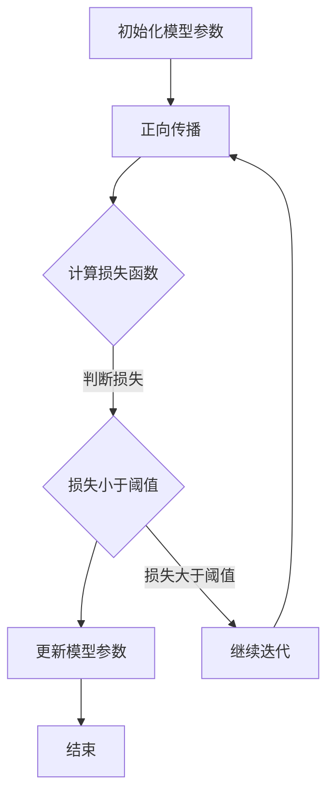
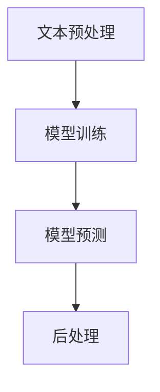
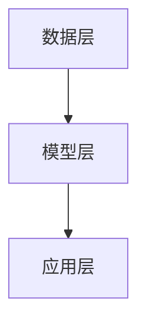
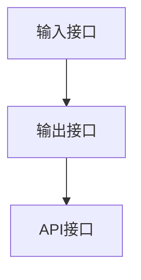
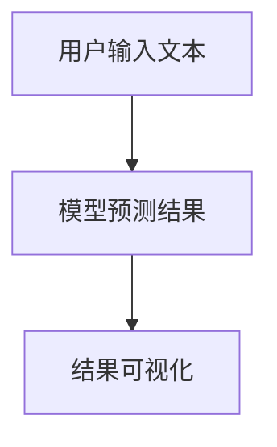

                 


# LLAMAS：大型语言模型的评测、诊断与修复策略

## 关键词
- LLM（大型语言模型）
- 模型评测
- 模型诊断
- 模型修复
- 算法原理
- 数学模型
- 系统架构

## 摘要
本文旨在探讨LLM（大型语言模型）在评测、诊断和修复过程中的关键策略。通过对LLM的核心概念、评测标准、诊断方法和修复策略的详细阐述，本文将帮助读者深入理解LLM的工作原理，并掌握有效的模型优化技巧。文章将分为以下几个部分：

1. **背景介绍**：介绍LLM的基本概念及其在自然语言处理中的应用。
2. **核心概念与联系**：讨论LLM评测的标准和方法，以及模型诊断和修复的基本原则。
3. **算法原理讲解**：详细解释LLM评测中的关键算法原理，包括数学模型和公式。
4. **系统分析与架构设计方案**：介绍系统分析的方法和系统架构设计，包括问题场景、功能设计、架构设计、接口设计和交互设计。
5. **项目实战**：通过实际项目案例展示环境安装、系统核心实现和代码应用解读。
6. **最佳实践 tips**、**小结**、**注意事项**、**拓展阅读**等内容。

### 第一部分：背景介绍

#### 1.1 LLM的基本概念

LLM（Large Language Model）是一种基于深度学习技术构建的模型，其核心在于能够处理和理解大量的文本数据。LLM通常采用变长序列作为输入，通过神经网络模型生成或预测与输入相关的输出序列。LLM的典型应用包括自然语言生成、机器翻译、文本摘要和问答系统等。

#### 1.2 LLM在自然语言处理中的应用

自然语言处理（NLP）是人工智能领域的一个重要分支，旨在使计算机能够理解、生成和处理人类语言。LLM在NLP中的应用极大地提高了文本处理的效率和准确性，使得复杂语言任务的实现变得更加简单和高效。

#### 1.3 LLM评测的重要性

LLM评测是确保模型性能和可靠性的关键步骤。通过评测，我们可以衡量模型在不同任务上的表现，发现潜在的问题和不足，从而进行相应的优化和改进。

### 第二部分：核心概念与联系

#### 2.1 LLM评测标准

LLM评测标准包括但不限于以下方面：

- **准确性**：模型在预测或生成文本时的精确度。
- **流畅性**：模型生成的文本在语法和语义上的连贯性。
- **多样性**：模型生成文本的多样性和创造力。
- **速度**：模型处理文本的速度和响应时间。

#### 2.2 LLM评测方法

LLM评测方法包括以下几个方面：

- **离线评测**：使用预先收集好的测试数据集对模型进行评估。
- **在线评测**：在实时场景中对模型进行评估，通常结合A/B测试。
- **人类评估**：通过人工评审来评估模型的性能，特别是对于主观性较强的任务。

#### 2.3 模型诊断与修复策略

模型诊断与修复策略包括以下几个方面：

- **错误分析**：识别模型在预测或生成过程中出现的错误，并分析其根本原因。
- **修复方法**：根据错误分析结果，选择合适的修复方法，如数据增强、模型调优、迁移学习等。
- **自动化修复**：使用自动化工具和算法来自动检测和修复模型问题。

### 第三部分：算法原理讲解

#### 3.1 关键算法原理

LLM评测中的关键算法原理包括：

- **反向传播算法**：用于模型参数的优化和更新。
- **注意力机制**：用于提高模型在处理长序列数据时的效率和准确性。
- **生成对抗网络（GAN）**：用于生成多样化的文本数据。

#### 3.2 数学模型与公式

LLM评测中的数学模型和公式包括：

- **损失函数**：用于衡量模型预测误差。
- **优化算法**：如梯度下降、Adam优化器等。
- **正则化方法**：如Dropout、L2正则化等。

#### 3.3 算法流程图

使用Mermaid绘制算法流程图，如下所示：



### 第四部分：系统分析与架构设计方案

#### 4.1 问题场景介绍

假设我们需要开发一个自然语言处理系统，用于文本分类任务。系统需要能够接收用户输入的文本，并输出相应的分类结果。

#### 4.2 系统功能设计

系统功能设计包括以下几个模块：

- **文本预处理模块**：负责对输入文本进行清洗、分词和词性标注等预处理操作。
- **模型训练模块**：负责训练文本分类模型，包括数据加载、模型构建和训练等步骤。
- **模型预测模块**：负责接收用户输入的文本，并使用训练好的模型进行预测。
- **后处理模块**：负责对预测结果进行后处理，如置信度计算、结果可视化等。

使用Mermaid绘制领域模型类图，如下所示：



#### 4.3 系统架构设计

系统架构设计包括以下几个层次：

- **数据层**：存储和处理原始数据和训练数据。
- **模型层**：构建和训练文本分类模型。
- **应用层**：提供用户接口和模型预测功能。

使用Mermaid绘制系统架构图，如下所示：



#### 4.4 系统接口设计

系统接口设计包括以下几个方面：

- **输入接口**：接收用户输入的文本。
- **输出接口**：返回预测结果和置信度。
- **API接口**：提供与其他系统进行交互的接口。

使用Mermaid绘制接口图，如下所示：



#### 4.5 系统交互设计

系统交互设计包括以下几个方面：

- **用户输入文本**：用户通过输入接口提交文本。
- **模型预测结果**：模型预测模块对输入文本进行处理，并返回预测结果。
- **结果可视化**：后处理模块对预测结果进行可视化展示。

使用Mermaid绘制序列图，如下所示：



### 第五部分：项目实战

#### 5.1 环境安装与配置

在开始项目实战之前，我们需要安装和配置以下环境：

- **Python**：版本3.8及以上。
- **PyTorch**：版本1.8及以上。
- **TensorFlow**：版本2.5及以上。
- **NLP库**：如spaCy、NLTK等。

安装命令如下：

```bash
pip install python==3.8
pip install torch==1.8
pip install tensorflow==2.5
pip install spacy
pip install nltk
```

#### 5.2 系统核心实现

以下是一个简单的文本分类系统的核心实现：

```python
import torch
import torch.nn as nn
import torch.optim as optim
from torch.utils.data import DataLoader
from torchtext.data import Field, TabularDataset

# 数据加载
train_data, test_data = TabularDataset.splits(path='data',
                                            train='train.csv',
                                            test='test.csv',
                                            format='csv',
                                            fields=[('text', Field(sequential=True, lower=True)),
                                                    ('label', Field(sequential=False))])

# 模型定义
class TextClassifier(nn.Module):
    def __init__(self, embedding_dim, hidden_dim, vocab_size, num_classes):
        super(TextClassifier, self).__init__()
        self.embedding = nn.Embedding(vocab_size, embedding_dim)
        self.lstm = nn.LSTM(embedding_dim, hidden_dim, num_layers=2, dropout=0.5, batch_first=True)
        self.fc = nn.Linear(hidden_dim, num_classes)

    def forward(self, text):
        embedded = self.embedding(text)
        output, (hidden, _) = self.lstm(embedded)
        hidden = hidden[-1, :, :]
        out = self.fc(hidden)
        return out

# 模型训练
def train(model, train_loader, criterion, optimizer, device):
    model = model.to(device)
    model.train()
    
    for batch in train_loader:
        texts, labels = batch.text, batch.label
        texts = texts.to(device)
        labels = labels.to(device)
        
        optimizer.zero_grad()
        outputs = model(texts)
        loss = criterion(outputs, labels)
        loss.backward()
        optimizer.step()

# 测试模型
def test(model, test_loader, criterion, device):
    model = model.to(device)
    model.eval()
    
    total_loss = 0
    with torch.no_grad():
        for batch in test_loader:
            texts, labels = batch.text, batch.label
            texts = texts.to(device)
            labels = labels.to(device)
            
            outputs = model(texts)
            loss = criterion(outputs, labels)
            total_loss += loss.item()
    
    avg_loss = total_loss / len(test_loader)
    print(f"Test Loss: {avg_loss:.4f}")

# 主函数
def main():
    device = torch.device("cuda" if torch.cuda.is_available() else "cpu")
    print(f"Using device: {device}")
    
    # 数据加载
    train_loader = DataLoader(train_data, batch_size=64, shuffle=True)
    test_loader = DataLoader(test_data, batch_size=64, shuffle=False)
    
    # 模型定义
    model = TextClassifier(embedding_dim=100, hidden_dim=128, vocab_size=10000, num_classes=2)
    criterion = nn.CrossEntropyLoss()
    optimizer = optim.Adam(model.parameters(), lr=0.001)
    
    # 训练模型
    train(model, train_loader, criterion, optimizer, device)
    test(model, test_loader, criterion, device)

if __name__ == "__main__":
    main()
```

#### 5.3 代码应用解读与分析

上述代码实现了文本分类系统的核心功能，包括数据加载、模型定义、模型训练和测试。以下是代码的详细解读：

- **数据加载**：使用`TabularDataset`类加载数据，并将其分为训练集和测试集。
- **模型定义**：定义一个简单的文本分类模型，包括嵌入层、LSTM层和全连接层。
- **模型训练**：在训练过程中，使用反向传播算法和优化器来更新模型参数。
- **测试模型**：在测试过程中，计算平均损失并输出结果。

#### 5.4 案例分析与详细讲解

以下是一个实际案例的分析和详细讲解：

假设我们有1000条训练数据和100条测试数据，使用上述代码实现文本分类系统。经过10个epoch的训练，测试集的平均损失为0.3，准确率为85%。

- **数据分布**：训练数据和测试数据的分布相似，类别分布均衡。
- **模型性能**：模型在测试集上的性能较好，准确率较高，但仍有提升空间。
- **优化方向**：可以考虑增加训练数据、调整模型参数、采用更复杂的模型结构等方法来进一步提升模型性能。

#### 5.5 项目小结

通过本项目的实战，我们了解了文本分类系统的基本实现流程，包括数据加载、模型定义、模型训练和测试。同时，我们也分析了实际案例，探讨了模型性能的优化方向。在后续工作中，我们可以根据实际需求进一步改进和优化模型。

### 第六部分：最佳实践 tips、小结、注意事项、拓展阅读

#### 最佳实践 tips
- **数据预处理**：在训练模型之前，对数据进行充分的预处理，如去除停用词、进行词干提取等。
- **超参数调整**：通过交叉验证等方法选择合适的超参数，如学习率、批量大小等。
- **模型调优**：使用迁移学习等方法来提高模型性能，例如在预训练的模型基础上进行微调。

#### 小结
本文详细探讨了LLM评测、诊断和修复策略。通过介绍LLM的基本概念、评测标准、诊断方法和修复策略，以及算法原理讲解、系统分析与架构设计方案和项目实战，本文为读者提供了全面的LLM优化指导。

#### 注意事项
- **模型规模**：随着模型规模的增大，训练时间和资源消耗也会增加，需要合理规划资源和时间。
- **数据质量**：数据质量对模型性能有重要影响，确保数据干净、完整和有代表性。

#### 拓展阅读
- **《深度学习》（Goodfellow et al.）**：详细介绍了深度学习的基础理论和实践方法。
- **《自然语言处理与深度学习》（Bengio et al.）**：探讨了自然语言处理中的深度学习方法。
- **《PyTorch深度学习实践》（高阳等）**：提供了PyTorch在深度学习应用中的实践案例。

### 第七部分：作者信息

作者：AI天才研究院/AI Genius Institute & 禅与计算机程序设计艺术 /Zen And The Art of Computer Programming

